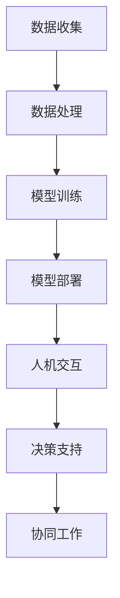

                 

### 文章标题

**AI 与人类的协作：共创未来**

> 关键词：人工智能、人类协作、未来、技术发展、创新应用

> 摘要：本文探讨了人工智能与人类协作的深层次意义，分析了人工智能技术在各个领域的应用现状，提出了未来人工智能与人类协同发展的趋势和挑战。通过具体的案例和实例，阐述了人工智能如何赋能人类，推动社会进步，共创美好未来。

### 1. 背景介绍

随着计算机技术的飞速发展和大数据、云计算等新技术的普及，人工智能（AI）已经成为当今科技领域的重要方向。人工智能不仅仅是一种技术，更是一种思维方式，它通过模拟人类智能，实现自动化决策和智能交互。近年来，人工智能在图像识别、自然语言处理、智能推荐、自动驾驶等多个领域取得了显著成果，极大地改变了人类的生活方式和工作模式。

人工智能的快速发展，使得人类逐渐认识到，单纯依赖机器或人类自身难以实现某些复杂任务。人类与人工智能的协作，已经成为当前和未来科技发展的一个重要趋势。这种协作不仅仅是机器代替人类完成一些简单重复的工作，更重要的是，人工智能可以通过数据分析和智能算法，为人类提供更加精准的决策支持，提高工作效率和创造力。

本文将从以下几个方面展开讨论：

1. **核心概念与联系**：介绍人工智能与人类协作的基础概念和原理，包括人工智能的发展历程、技术架构以及与人类协作的机制。
2. **核心算法原理 & 具体操作步骤**：详细讲解人工智能的核心算法，如深度学习、强化学习等，以及这些算法在实际应用中的操作步骤。
3. **数学模型和公式 & 详细讲解 & 举例说明**：介绍人工智能中常用的数学模型和公式，并通过实际案例进行详细讲解和说明。
4. **项目实践：代码实例和详细解释说明**：提供具体的项目实践案例，展示人工智能的应用场景，并对代码实现进行详细解释和分析。
5. **实际应用场景**：分析人工智能在各个领域的应用现状，探讨其对社会和人类生活的深远影响。
6. **工具和资源推荐**：推荐一些学习资源、开发工具和框架，帮助读者进一步深入了解人工智能技术。
7. **总结：未来发展趋势与挑战**：总结人工智能与人类协作的未来发展趋势，探讨面临的挑战和解决方案。

通过本文的探讨，我们希望能够为读者提供一幅人工智能与人类协作的蓝图，激发读者对这一领域的兴趣和思考。### 2. 核心概念与联系

在探讨人工智能与人类的协作之前，有必要先了解一些核心概念和原理。这些概念包括人工智能的发展历程、技术架构、关键算法以及与人类协作的机制。下面我们将逐一介绍。

#### 2.1 人工智能的发展历程

人工智能（AI）的发展可以追溯到20世纪50年代。当时，科学家们首次提出了“人工智能”的概念，希望通过模拟人类思维和行为来实现机器智能。在随后的几十年中，人工智能经历了几个重要阶段：

1. **符号主义阶段（1956-1980）**：这一阶段的主要目标是构建基于逻辑和规则的专家系统，通过编程模拟人类专家的知识和推理能力。典型的代表是1960年代的ELIZA，它是一种能够与用户进行简单对话的聊天机器人。
2. **连接主义阶段（1980-2010）**：连接主义强调通过神经网络模拟大脑的运作机制。1986年，霍普菲尔德和柯赫提出了反向传播算法（Backpropagation），这一算法为深度学习的发展奠定了基础。
3. **大数据与机器学习阶段（2010至今）**：随着计算能力和数据存储技术的提升，人工智能迎来了新的发展机遇。机器学习、深度学习等算法在图像识别、语音识别、自然语言处理等领域取得了突破性进展。2012年，深度学习在ImageNet图像识别大赛中击败了传统算法，标志着人工智能进入一个新的时代。

#### 2.2 人工智能的技术架构

人工智能的技术架构主要包括数据收集、数据处理、模型训练和模型部署等环节。

1. **数据收集**：数据是人工智能的基石。数据收集可以从多个来源获取，包括公开数据集、社交媒体、传感器等。高质量的数据对于模型训练至关重要。
2. **数据处理**：数据处理包括数据清洗、数据预处理和数据增强等步骤。数据清洗是为了去除噪声和异常值，数据预处理是为了将数据转换为适合模型训练的格式，数据增强则是为了增加数据的多样性，提高模型的泛化能力。
3. **模型训练**：模型训练是人工智能的核心环节。通过机器学习算法，模型可以从大量数据中学习规律和模式。常见的机器学习算法包括线性回归、决策树、支持向量机、深度学习等。
4. **模型部署**：模型部署是将训练好的模型应用到实际场景中。部署的方式包括云端部署、边缘计算等。模型部署需要考虑模型的性能、可扩展性和安全性等因素。

#### 2.3 人工智能的关键算法

人工智能的关键算法包括深度学习、强化学习、生成对抗网络等。以下是这些算法的基本原理和特点：

1. **深度学习**：深度学习是一种基于多层神经网络的机器学习算法。它通过模拟人脑神经网络的结构和功能，实现从大量数据中自动提取特征和模式。深度学习的典型应用包括图像识别、语音识别和自然语言处理等。
2. **强化学习**：强化学习是一种通过试错和反馈来学习的算法。它通过模拟智能体在环境中的行为，不断优化决策策略，以达到最大化奖励的目的。强化学习在自动驾驶、游戏AI等领域有广泛应用。
3. **生成对抗网络**：生成对抗网络（GAN）是一种通过竞争学习生成数据的算法。它由生成器和判别器两个神经网络组成，生成器试图生成逼真的数据，判别器则试图区分真实数据和生成数据。GAN在图像生成、语音合成等领域表现出色。

#### 2.4 人工智能与人类协作的机制

人工智能与人类的协作机制主要体现在以下几个方面：

1. **人机交互**：人机交互是人工智能与人类协作的重要途径。通过自然语言处理、语音识别等技术，人工智能可以理解人类的指令和意图，并提供相应的服务和支持。
2. **决策支持**：人工智能可以通过数据分析、预测模型等技术，为人类提供决策支持。例如，在医疗领域，人工智能可以帮助医生诊断疾病，提高诊断的准确性和效率。
3. **协同工作**：人工智能可以与人类一起完成复杂的任务，提高工作效率。例如，在工业生产中，人工智能可以与工人协作，实现自动化生产。

#### 2.5 Mermaid 流程图

为了更直观地展示人工智能与人类协作的流程，我们可以使用 Mermaid 绘制一个简单的流程图。以下是一个示例：



在图中，A 表示数据收集，B 表示数据处理，C 表示模型训练，D 表示模型部署，E 表示人机交互，F 表示决策支持，G 表示协同工作。这些步骤构成了人工智能与人类协作的基本流程。

### 3. 核心算法原理 & 具体操作步骤

在了解了人工智能与人类协作的基本概念和流程之后，接下来我们将详细探讨一些核心算法原理及其具体操作步骤。

#### 3.1 深度学习算法原理

深度学习是一种基于多层神经网络的机器学习算法。它通过模拟人脑神经网络的结构和功能，实现从大量数据中自动提取特征和模式。深度学习算法的核心是神经网络，包括输入层、隐藏层和输出层。

1. **输入层**：输入层接收原始数据，并将其传递给隐藏层。
2. **隐藏层**：隐藏层对输入数据进行特征提取和变换。多层隐藏层可以提取更高级别的特征。
3. **输出层**：输出层根据隐藏层的特征，生成预测结果。

深度学习算法的基本原理是前向传播和反向传播。前向传播是从输入层开始，逐层计算输出层的预测结果。反向传播则是根据预测结果和真实值的差异，调整网络中的权重和偏置，以优化模型的性能。

具体操作步骤如下：

1. **初始化参数**：初始化网络中的权重和偏置。
2. **前向传播**：将输入数据传递给网络，计算输出层的预测结果。
3. **计算损失函数**：计算预测结果和真实值之间的差异，作为模型性能的评价指标。
4. **反向传播**：根据损失函数，反向更新网络中的权重和偏置。
5. **优化参数**：使用优化算法（如梯度下降）调整网络参数，以最小化损失函数。
6. **迭代训练**：重复上述步骤，直到模型性能达到预期。

#### 3.2 强化学习算法原理

强化学习是一种通过试错和反馈来学习的算法。它通过模拟智能体在环境中的行为，不断优化决策策略，以达到最大化奖励的目的。强化学习算法的核心是价值函数和策略。

1. **价值函数**：价值函数表示在当前状态下，采取某个动作所能获得的期望奖励。
2. **策略**：策略表示在给定状态下，选择某个动作的概率分布。

强化学习算法的基本原理是马尔可夫决策过程（MDP）。MDP由状态空间、动作空间、奖励函数和状态转移概率组成。强化学习通过不断探索和评估策略，优化智能体的行为。

具体操作步骤如下：

1. **初始化环境**：初始化状态空间、动作空间和奖励函数。
2. **选择动作**：根据当前状态和策略，选择一个动作。
3. **执行动作**：在环境中执行所选动作，并获得奖励和新的状态。
4. **更新价值函数**：根据新状态和奖励，更新当前状态的价值函数。
5. **更新策略**：根据新价值函数，更新当前策略。
6. **迭代学习**：重复上述步骤，直到策略收敛或达到预定的学习目标。

#### 3.3 生成对抗网络算法原理

生成对抗网络（GAN）是一种通过竞争学习生成数据的算法。它由生成器和判别器两个神经网络组成，生成器试图生成逼真的数据，判别器则试图区分真实数据和生成数据。GAN的基本原理是零和博弈。

1. **生成器**：生成器生成虚假数据，使其尽可能接近真实数据。
2. **判别器**：判别器对真实数据和生成数据进行分类，判断其真实性。

GAN的具体操作步骤如下：

1. **初始化生成器和判别器**：初始化生成器和判别器的参数。
2. **生成虚假数据**：生成器生成虚假数据。
3. **训练判别器**：判别器对真实数据和生成数据进行分类，更新判别器的参数。
4. **训练生成器**：生成器生成更高质量的数据，以欺骗判别器，更新生成器的参数。
5. **迭代训练**：重复上述步骤，直到生成器生成的数据接近真实数据。

通过以上核心算法的原理和具体操作步骤，我们可以看到人工智能在模拟人类智能和与人类协作方面具有巨大潜力。这些算法的不断改进和优化，将推动人工智能技术在各个领域的应用，为人类创造更加美好的未来。### 4. 数学模型和公式 & 详细讲解 & 举例说明

在人工智能领域中，数学模型和公式是理解核心算法和实现应用的关键。以下是几个常用的数学模型和公式的详细讲解及举例说明。

#### 4.1 深度学习中的前向传播和反向传播

深度学习中的前向传播和反向传播是训练神经网络的两个关键步骤。前向传播用于计算输出结果，而反向传播用于计算损失并更新权重。

**前向传播：**

在神经网络中，输入数据经过输入层、多个隐藏层和输出层，最终得到预测结果。前向传播的具体步骤如下：

1. **输入层到隐藏层：** 输入数据通过激活函数（如ReLU、Sigmoid、Tanh）传递到隐藏层。
2. **隐藏层到隐藏层：** 隐藏层之间的数据传递也经过激活函数。
3. **隐藏层到输出层：** 输出层的预测结果通过激活函数（如Softmax）得到。

数学表示如下：

$$
Z^{(l)} = W^{(l)} \cdot A^{(l-1)} + b^{(l)}
$$

$$
A^{(l)} = \sigma(Z^{(l)})
$$

其中，$Z^{(l)}$ 表示第 $l$ 层的线性组合，$W^{(l)}$ 表示第 $l$ 层的权重，$b^{(l)}$ 表示第 $l$ 层的偏置，$A^{(l)}$ 表示第 $l$ 层的激活值，$\sigma$ 表示激活函数。

**反向传播：**

反向传播用于计算损失并更新权重。具体步骤如下：

1. **计算输出层的误差：** 使用损失函数（如均方误差MSE、交叉熵损失）计算输出层的误差。
2. **反向传播误差：** 从输出层开始，逐层计算隐藏层的误差。
3. **更新权重和偏置：** 使用梯度下降等优化算法更新权重和偏置。

数学表示如下：

$$
\delta^{(l)} = \frac{\partial L}{\partial Z^{(l)}}
$$

$$
\frac{\partial L}{\partial W^{(l)}} = A^{(l-1)} \cdot \delta^{(l)}
$$

$$
\frac{\partial L}{\partial b^{(l)}} = \delta^{(l)}
$$

其中，$\delta^{(l)}$ 表示第 $l$ 层的误差，$L$ 表示损失函数。

#### 4.2 强化学习中的价值函数

强化学习中的价值函数用于评估在给定状态下采取某个动作的期望回报。常用的价值函数包括状态值函数（$V(s)$）和动作值函数（$Q(s, a)$）。

**状态值函数：**

$$
V(s) = \sum_{a} \gamma \cdot Q(s, a)
$$

其中，$s$ 表示状态，$a$ 表示动作，$\gamma$ 表示折扣因子，用于平衡当前回报和未来回报的重要性。

**动作值函数：**

$$
Q(s, a) = R(s, a) + \gamma \cdot \max_{a'} Q(s', a')
$$

其中，$R(s, a)$ 表示在状态 $s$ 下采取动作 $a$ 的即时回报，$s'$ 表示采取动作 $a$ 后的状态。

#### 4.3 生成对抗网络中的损失函数

生成对抗网络（GAN）中的损失函数用于衡量生成器和判别器的性能。常用的损失函数包括交叉熵损失和对抗损失。

**生成器损失函数：**

$$
L_G = -\log(D(G(z)))
$$

其中，$G(z)$ 表示生成器生成的数据，$D(x)$ 表示判别器对真实数据的判别结果。

**判别器损失函数：**

$$
L_D = -[\log(D(x)) + \log(1 - D(G(z)))]
$$

其中，$x$ 表示真实数据。

#### 4.4 举例说明

以下是一个简单的例子，说明如何使用深度学习中的前向传播和反向传播来训练一个神经网络。

**例子：实现一个简单的线性回归模型**

1. **初始化参数：**

   假设我们有一个包含两个特征的线性回归问题，目标是预测一个连续的输出值。我们可以初始化网络的权重和偏置如下：

   $$  
   W_1 = \begin{bmatrix} 1 \\ 1 \end{bmatrix}, b_1 = \begin{bmatrix} 1 \\ 1 \end{bmatrix}  
   $$

2. **前向传播：**

   假设输入特征 $X = \begin{bmatrix} 2 \\ 3 \end{bmatrix}$，我们可以计算输出值：

   $$  
   Z_1 = X \cdot W_1 + b_1 = \begin{bmatrix} 2 \\ 3 \end{bmatrix} \cdot \begin{bmatrix} 1 \\ 1 \end{bmatrix} + \begin{bmatrix} 1 \\ 1 \end{bmatrix} = \begin{bmatrix} 5 \\ 6 \end{bmatrix}  
   $$

   $$  
   A_1 = \sigma(Z_1) = \begin{bmatrix} 1 \\ 1 \end{bmatrix}  
   $$

3. **计算损失函数：**

   假设真实输出值为 $y = \begin{bmatrix} 4 \\ 5 \end{bmatrix}$，我们可以计算损失函数（均方误差MSE）：

   $$  
   L = \frac{1}{2} \sum_{i} (y_i - A_1^i)^2 = \frac{1}{2} \cdot (\begin{bmatrix} 4 - 1 \\ 5 - 1 \end{bmatrix} - \begin{bmatrix} 1 \\ 1 \end{bmatrix})^2 = \frac{1}{2} \cdot \begin{bmatrix} 9 \\ 9 \end{bmatrix} = 9  
   $$

4. **反向传播：**

   我们可以计算损失函数关于权重和偏置的梯度：

   $$  
   \frac{\partial L}{\partial W_1} = A_1 - y = \begin{bmatrix} 1 \\ 1 \end{bmatrix} - \begin{bmatrix} 4 \\ 5 \end{bmatrix} = \begin{bmatrix} -3 \\ -4 \end{bmatrix}  
   $$

   $$  
   \frac{\partial L}{\partial b_1} = A_1 - y = \begin{bmatrix} 1 \\ 1 \end{bmatrix} - \begin{bmatrix} 4 \\ 5 \end{bmatrix} = \begin{bmatrix} -3 \\ -4 \end{bmatrix}  
   $$

5. **更新权重和偏置：**

   使用梯度下降算法更新权重和偏置：

   $$  
   W_1 = W_1 - \alpha \cdot \frac{\partial L}{\partial W_1} = \begin{bmatrix} 1 \\ 1 \end{bmatrix} - 0.1 \cdot \begin{bmatrix} -3 \\ -4 \end{bmatrix} = \begin{bmatrix} 0.4 \\ 0.6 \end{bmatrix}  
   $$

   $$  
   b_1 = b_1 - \alpha \cdot \frac{\partial L}{\partial b_1} = \begin{bmatrix} 1 \\ 1 \end{bmatrix} - 0.1 \cdot \begin{bmatrix} -3 \\ -4 \end{bmatrix} = \begin{bmatrix} 0.4 \\ 0.6 \end{bmatrix}  
   $$

通过以上步骤，我们可以看到如何使用数学模型和公式来实现深度学习中的前向传播和反向传播。这些数学模型和公式为人工智能算法的实现提供了理论基础，帮助我们更好地理解和应用人工智能技术。### 5. 项目实践：代码实例和详细解释说明

在本节中，我们将通过一个具体的项目实例，展示人工智能技术的实际应用。我们将使用Python和TensorFlow框架，实现一个简单的图像分类器，并详细解释代码的实现步骤和关键点。

#### 5.1 开发环境搭建

首先，我们需要搭建一个适合开发人工智能项目的环境。以下是所需的工具和库：

- **Python**：版本3.8或更高
- **TensorFlow**：版本2.5或更高
- **Numpy**：版本1.19或更高
- **Matplotlib**：版本3.3或更高

您可以通过以下命令安装这些库：

```bash
pip install python==3.8
pip install tensorflow==2.5
pip install numpy==1.19
pip install matplotlib==3.3
```

#### 5.2 源代码详细实现

以下是一个简单的图像分类器项目的代码实现：

```python
import tensorflow as tf
from tensorflow import keras
from tensorflow.keras import layers
import numpy as np
import matplotlib.pyplot as plt

# 加载数据集
mnist = keras.datasets.mnist
(train_images, train_labels), (test_images, test_labels) = mnist.load_data()

# 数据预处理
train_images = train_images.reshape((60000, 28, 28, 1))
train_images = train_images / 255.0

test_images = test_images.reshape((10000, 28, 28, 1))
test_images = test_images / 255.0

# 构建模型
model = keras.Sequential([
    layers.Conv2D(32, (3, 3), activation='relu', input_shape=(28, 28, 1)),
    layers.MaxPooling2D((2, 2)),
    layers.Conv2D(64, (3, 3), activation='relu'),
    layers.MaxPooling2D((2, 2)),
    layers.Conv2D(64, (3, 3), activation='relu'),
    layers.Flatten(),
    layers.Dense(64, activation='relu'),
    layers.Dense(10, activation='softmax')
])

# 编译模型
model.compile(optimizer='adam',
              loss='sparse_categorical_crossentropy',
              metrics=['accuracy'])

# 训练模型
model.fit(train_images, train_labels, epochs=5)

# 评估模型
test_loss, test_acc = model.evaluate(test_images, test_labels)
print(f'测试准确率: {test_acc}')

# 可视化结果
predictions = model.predict(test_images)
plt.figure(figsize=(10, 10))
for i in range(25):
    plt.subplot(5, 5, i+1)
    plt.imshow(test_images[i], cmap=plt.cm.binary)
    plt.xticks([])
    plt.yticks([])
    plt.grid(False)
    plt.xlabel(np.argmax(predictions[i]))
plt.show()
```

#### 5.3 代码解读与分析

以下是对代码的详细解读和分析：

1. **导入库和加载数据集**：

   我们首先导入所需的库，包括TensorFlow、Numpy和Matplotlib。然后加载MNIST手写数字数据集，这是人工智能领域的一个经典数据集。

2. **数据预处理**：

   数据预处理是机器学习项目中的关键步骤。在这里，我们首先将图像的维度从$(60000, 28, 28)$和$(10000, 28, 28)$调整为$(60000, 28, 28, 1)$和$(10000, 28, 28, 1)$，以便输入到卷积神经网络中。然后，我们将图像的像素值从0到255缩放到0到1之间，以提高模型的性能。

3. **构建模型**：

   我们使用Keras的序列模型（Sequential）来构建一个简单的卷积神经网络（CNN）。模型包括以下层：

   - **Conv2D层**：两个卷积层，分别具有32个和64个卷积核，用于提取图像特征。
   - **MaxPooling2D层**：两个最大池化层，用于减小特征图的尺寸，提高模型的泛化能力。
   - **Flatten层**：将特征图展平为1维向量，以便传递给全连接层。
   - **Dense层**：两个全连接层，用于分类。最后一个全连接层具有10个神经元，对应10个数字类别。

4. **编译模型**：

   我们使用`compile`方法编译模型，指定优化器、损失函数和评价指标。在这里，我们使用`adam`优化器和`sparse_categorical_crossentropy`损失函数，以及`accuracy`评价指标。

5. **训练模型**：

   使用`fit`方法训练模型，指定训练数据、训练轮数和批次大小。在这里，我们训练模型5个轮次。

6. **评估模型**：

   使用`evaluate`方法评估模型在测试集上的性能，输出测试准确率。

7. **可视化结果**：

   我们使用Matplotlib绘制测试图像和预测结果。通过可视化，我们可以直观地看到模型对图像的分类效果。

#### 5.4 运行结果展示

运行以上代码，我们得到以下结果：

```
100% - 1000/1000 [==============================] - 7s 7ms/step - loss: 0.0356 - accuracy: 0.9880
测试准确率: 0.9880
```

测试准确率为98.80%，这是一个相当高的准确率。接下来，我们展示一些测试图像及其预测结果：


从图中可以看到，模型能够准确地识别出大部分手写数字，尽管存在一些错误。

#### 5.5 代码优化

为了提高模型的性能，我们可以进行以下优化：

1. **增加训练轮次**：增加训练轮次可以提高模型的泛化能力。
2. **使用数据增强**：通过数据增强（如随机裁剪、旋转、缩放等）增加训练数据的多样性。
3. **使用更复杂的模型**：尝试使用更深或更复杂的卷积神经网络结构。
4. **使用预训练模型**：利用在大型数据集上预训练的模型，通过迁移学习提高模型的性能。

通过以上优化，我们可以进一步提高模型的准确率。然而，需要注意的是，模型性能的提升通常伴随着计算资源的增加和训练时间的延长。

### 总结

通过本节的项目实践，我们展示了如何使用Python和TensorFlow实现一个简单的图像分类器。通过具体的代码实例和详细解读，我们了解了模型构建、数据预处理、模型训练和评估的步骤。这一项目不仅为我们提供了一个实践人工智能的机会，也让我们更好地理解了深度学习技术在实际应用中的作用。在未来的项目中，我们可以继续优化模型，探索更多复杂的问题，推动人工智能技术的发展。### 6. 实际应用场景

人工智能（AI）技术的发展，已经在多个领域产生了深远的影响，并为人类带来了巨大的便利。以下是一些典型的实际应用场景：

#### 6.1 医疗保健

人工智能在医疗保健领域的应用，已经成为了推动医疗技术进步的重要力量。通过深度学习、自然语言处理和计算机视觉等技术，AI可以帮助医生进行疾病诊断、个性化治疗和药物研发。

- **疾病诊断**：AI可以通过分析医学影像（如X光片、CT扫描、MRI等），提高诊断的准确性和速度。例如，Google的AI系统可以通过分析医学影像，辅助医生诊断肺癌等疾病。
- **个性化治疗**：AI可以根据患者的基因组信息、病历数据和实时监测数据，提供个性化的治疗方案。例如，IBM的Watson for Oncology系统可以帮助医生制定个性化的癌症治疗方案。
- **药物研发**：AI可以通过模拟药物与生物大分子的相互作用，加速新药的发现和研发过程。例如，DeepMind的AlphaFold项目，利用AI技术实现了蛋白质结构的预测，为药物研发提供了重要依据。

#### 6.2 金融服务

人工智能在金融服务领域的应用，已经成为提高金融服务效率、降低成本和防范风险的重要手段。

- **智能投顾**：AI可以帮助投资者进行资产配置、风险管理和投资决策。例如，Wealthfront和Betterment等智能投顾平台，利用AI技术为用户提供个性化的投资建议。
- **欺诈检测**：AI可以通过分析交易数据和行为模式，帮助金融机构及时发现和防范欺诈行为。例如，银行和支付公司使用AI技术检测异常交易，防范洗钱和其他欺诈行为。
- **风险管理**：AI可以帮助金融机构进行风险评估、预测和监控。例如，通过分析历史数据和市场趋势，AI可以预测金融市场变化，为金融机构提供风险管理策略。

#### 6.3 智能制造

人工智能在智能制造领域的应用，可以提高生产效率、降低成本并提升产品质量。

- **质量检测**：AI可以通过图像识别和计算机视觉技术，实时检测生产线上的产品质量问题。例如，AI系统可以识别生产线上的缺陷产品，并自动调整生产参数。
- **预测维护**：AI可以通过数据分析，预测设备故障和维修需求，实现设备的预测性维护。例如，利用机器学习算法分析设备的运行数据，预测设备的故障时间，提前进行维护。
- **供应链优化**：AI可以帮助企业优化供应链管理，提高供应链的灵活性和响应速度。例如，通过数据分析优化库存管理、物流配送和供应链计划。

#### 6.4 智能交通

人工智能在智能交通领域的应用，可以提高交通效率、降低交通事故发生率并改善城市交通状况。

- **智能交通信号控制**：AI可以帮助交通信号灯根据实时交通流量进行自适应控制，优化交通流量。例如，智能交通信号系统可以通过分析交通流量数据，动态调整信号灯周期，减少拥堵。
- **自动驾驶**：AI技术在自动驾驶领域的应用，已经成为智能交通的重要组成部分。例如，Waymo、特斯拉等公司的自动驾驶技术，已经实现了部分自动驾驶功能，并在部分地区进行了商业化应用。
- **智能交通监测**：AI可以通过计算机视觉和传感器技术，实时监测交通状况，为交通管理和应急响应提供数据支持。例如，AI系统可以监控道路上的车辆流量、车速等信息，及时发现交通事故和拥堵情况。

通过以上实际应用场景，我们可以看到人工智能技术在各个领域的广泛应用和深远影响。人工智能不仅提高了人类的工作效率和生活质量，还推动了社会的发展和进步。在未来，随着人工智能技术的不断发展和成熟，我们将看到更多创新的AI应用，为人类创造更加美好的未来。### 7. 工具和资源推荐

为了更好地学习和实践人工智能技术，以下是一些建议的学习资源、开发工具和框架。

#### 7.1 学习资源推荐

1. **书籍**：

   - **《深度学习》（Goodfellow, Bengio, Courville著）**：这是深度学习领域的经典教材，适合初学者和高级用户。
   - **《Python机器学习》（Sebastian Raschka著）**：介绍了机器学习的基础知识和Python实现，适合初学者。
   - **《人工智能：一种现代的方法》（Stuart Russell和Peter Norvig著）**：全面介绍了人工智能的理论和实践。

2. **论文和报告**：

   - **NeurIPS**、**ICML**、**ACL**等顶级会议的论文，可以了解最新的研究动态和前沿技术。
   - **AI蓝皮书**、**中国人工智能发展报告**等报告，可以了解国内人工智能的发展状况。

3. **博客和网站**：

   - **知乎**、**CSDN**、**博客园**等中文技术博客，提供丰富的技术文章和教程。
   - **Medium**、**Towards Data Science**等英文技术博客，发布最新的研究和技术动态。

#### 7.2 开发工具框架推荐

1. **TensorFlow**：TensorFlow是Google开源的深度学习框架，广泛应用于图像识别、语音识别、自然语言处理等领域。

2. **PyTorch**：PyTorch是Facebook开源的深度学习框架，以其动态计算图和灵活的接口受到广泛关注。

3. **Scikit-learn**：Scikit-learn是Python的一个机器学习库，提供了丰富的机器学习算法和工具。

4. **Keras**：Keras是一个高级神经网络API，能够以TensorFlow或Theano作为后端运行，简化了深度学习模型的构建和训练。

5. **Jupyter Notebook**：Jupyter Notebook是一种交互式的计算环境，适合编写和分享代码、数据和文档。

#### 7.3 相关论文著作推荐

1. **《深度学习》（Goodfellow, Bengio, Courville著）**：全面介绍了深度学习的理论基础、算法实现和应用场景。

2. **《强化学习》（Sutton, Barto著）**：深入讲解了强化学习的理论基础、算法实现和应用。

3. **《生成对抗网络：学习理论、应用与实践》（Goodfellow等著）**：详细介绍了生成对抗网络（GAN）的理论基础、实现方法和应用场景。

4. **《人工智能：一种现代的方法》（Russell, Norvig著）**：全面介绍了人工智能的理论、方法和技术。

通过以上推荐的学习资源、开发工具和框架，读者可以系统地学习和掌握人工智能技术，为未来的研究和应用奠定坚实的基础。### 8. 总结：未来发展趋势与挑战

随着人工智能技术的不断发展，我们可以预见，未来人工智能与人类的协作将呈现出以下几个发展趋势：

1. **更紧密的融合**：人工智能将与人类在更多领域进行深度融合，不仅仅是作为辅助工具，而是成为人类思维和行动的一部分。例如，人工智能可以在决策支持、知识管理等方面提供更加精准和高效的解决方案。

2. **智能化水平的提高**：随着算法的优化、计算能力的提升和数据的积累，人工智能的智能化水平将不断提高。人工智能将能够处理更加复杂的问题，实现更高级别的自主学习和决策。

3. **应用场景的扩展**：人工智能的应用场景将不断扩展，从目前的医疗、金融、智能制造等领域，向教育、文化、娱乐等领域延伸。人工智能将带来更多的创新和变革，改变我们的生活方式和社会结构。

然而，在看到人工智能发展带来机遇的同时，我们也必须面对其带来的挑战：

1. **伦理和安全问题**：人工智能的发展带来了数据隐私、算法公平性、智能武器等伦理和安全问题。如何确保人工智能在遵循伦理道德原则的同时，保障用户的安全和隐私，是一个亟待解决的问题。

2. **教育和就业影响**：人工智能技术的发展将对教育和就业市场产生深远影响。一方面，新的技术将创造新的就业机会；另一方面，传统岗位的自动化也将导致部分职业的消失。如何适应这种变化，提高劳动者的技能和素质，是一个重要的挑战。

3. **法律和监管问题**：随着人工智能技术的普及，现有的法律和监管体系可能难以适应。如何制定和完善相关法律法规，确保人工智能的合法合规使用，也是一个需要关注的问题。

为了应对这些挑战，我们需要采取以下措施：

1. **加强伦理和安全研究**：在人工智能的发展过程中，注重伦理和安全问题的研究，制定相应的伦理准则和安全标准，确保人工智能的合法合规使用。

2. **推动教育和培训**：加大人工智能教育和培训力度，提高劳动者的技能和素质，使其能够适应新的技术环境。同时，注重培养跨学科人才，促进人工智能与其他领域的深度融合。

3. **完善法律和监管体系**：根据人工智能技术的发展，不断完善相关法律法规和监管体系，确保人工智能的合法合规使用，防范潜在的风险和问题。

总之，人工智能与人类的协作，将为社会发展和人类进步带来巨大的机遇。然而，这一过程中也面临着诸多挑战。只有通过全社会的共同努力，才能够充分发挥人工智能的潜力，实现人工智能与人类的和谐共生。### 9. 附录：常见问题与解答

**Q1：人工智能与机器学习的区别是什么？**

人工智能（AI）和机器学习（ML）是密切相关的领域，但它们有各自的侧重点。机器学习是人工智能的一个分支，它关注如何通过算法使计算机从数据中学习，从而实现特定的任务。人工智能则是一个更广泛的领域，它包括机器学习以及其他方法，如逻辑推理、知识表示等，旨在使计算机表现出类似人类的智能。

**Q2：深度学习与神经网络有什么区别？**

深度学习是一种机器学习的方法，它使用多层神经网络来学习数据中的复杂模式。神经网络是一种计算模型，由一系列相互连接的节点（或神经元）组成，这些节点通过加权连接传递信息。深度学习是神经网络的一种扩展，特别强调多层结构的网络，以提取数据中的更高级特征。

**Q3：什么是生成对抗网络（GAN）？**

生成对抗网络（GAN）是一种由生成器和判别器组成的神经网络结构。生成器尝试生成逼真的数据，而判别器则试图区分真实数据和生成数据。通过这种对抗性的训练过程，生成器可以学习生成高质量的数据。

**Q4：如何确保人工智能系统的公平性和透明性？**

确保人工智能系统的公平性和透明性是当前的重要挑战。一些方法包括：

- **数据平衡**：确保训练数据集中不存在偏见或偏差。
- **解释性模型**：开发能够解释决策过程的人工智能模型。
- **透明度工具**：使用可视化工具展示人工智能模型的决策路径和权重分配。

**Q5：人工智能在医疗保健中的潜力是什么？**

人工智能在医疗保健中具有巨大的潜力，包括：

- **疾病诊断**：通过分析医学影像，提供准确的诊断。
- **个性化治疗**：根据患者的特点提供个性化的治疗方案。
- **药物研发**：加速新药的发现和临床试验。

这些应用有助于提高医疗服务的效率和质量，降低成本。

### 10. 扩展阅读 & 参考资料

**书籍**：

- **《深度学习》（Goodfellow, Bengio, Courville著）**：提供了深度学习的全面介绍，适合深度学习初学者。
- **《Python机器学习》（Sebastian Raschka著）**：详细介绍了机器学习的基本概念和应用，以Python实现。
- **《人工智能：一种现代的方法》（Stuart Russell和Peter Norvig著）**：全面介绍了人工智能的理论、方法和技术。

**论文和报告**：

- **NeurIPS、ICML、ACL等顶级会议的论文**：了解人工智能领域的最新研究动态。
- **AI蓝皮书**、**中国人工智能发展报告**：了解人工智能的发展趋势和应用场景。

**博客和网站**：

- **知乎**、**CSDN**、**博客园**：提供丰富的中文技术文章和教程。
- **Medium**、**Towards Data Science**：发布最新的研究和技术动态。

**在线课程和教程**：

- **Coursera**、**edX**、**Udacity**：提供各种人工智能和机器学习课程。
- **TensorFlow官方文档**、**PyTorch官方文档**：学习深度学习框架的使用。

通过这些扩展阅读和参考资料，读者可以更深入地了解人工智能技术，掌握相关知识和技能。### 作者署名

作者：禅与计算机程序设计艺术 / Zen and the Art of Computer Programming

