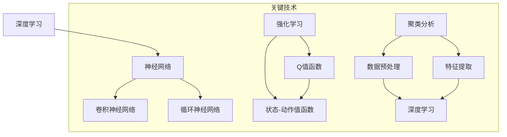

                 

### 1. 背景介绍

人工智能（AI）作为计算机科学的一个分支，其目标是通过模拟人类思维和决策过程来实现机器的智能。随着计算能力的提升和算法的进步，人工智能经历了几个重要的发展阶段，从最初的规则系统，到基于模式的识别，再到现在的深度学习和强化学习，每一个阶段都带来了技术的重大突破。

在当前的技术背景下，人工智能已经深入到了许多领域，如医疗、金融、交通、教育等，大幅提升了效率和准确性。然而，人工智能的发展也面临着诸多挑战，包括数据隐私、伦理道德、算法透明性等问题。为了应对这些挑战，我们需要更多的AI人才来推动技术创新，促进AI 2.0时代的发展。

AI 2.0是一个更加智能、更加自主的人工智能时代。它不仅仅是计算能力的提升，更重要的是算法和系统的智能化水平。AI 2.0的目标是实现具有高度自适应性和创造力的智能系统，能够在复杂环境下自主决策和学习。为了达到这一目标，AI人才交流显得尤为重要。

本文将围绕AI人才交流这一主题，探讨其在推动AI 2.0技术创新和发展中的作用。我们将从背景介绍、核心概念、算法原理、数学模型、项目实践、实际应用场景、工具和资源推荐以及未来发展趋势与挑战等方面进行详细阐述。希望通过本文的讨论，能够为读者提供一个全面而深入的视角，以更好地理解和参与到AI 2.0的技术创新和发展过程中。

#### 1.1 人工智能的历史与发展

人工智能的历史可以追溯到20世纪50年代，当时计算机科学家艾伦·图灵（Alan Turing）提出了著名的“图灵测试”，这标志着人工智能概念的诞生。图灵测试旨在判断机器是否能够表现出与人类相似的智能水平。随着计算机技术的进步，人工智能开始从理论走向实践。

在早期的几年里，人工智能主要依赖于规则系统（Rule-Based Systems），即通过编写一系列规则来模拟人类专家的决策过程。然而，这种方法的局限性很快显现出来，尤其是在处理复杂和非线性问题时。为了克服这些限制，研究人员开始探索基于模式的识别（Pattern Recognition），这种方法利用统计学和机器学习技术，通过训练模型来识别和分类数据。

20世纪80年代，人工智能进入了基于知识的系统（Knowledge-Based Systems）阶段。这种系统通过构建知识库来模拟专家的决策过程，但同样面临着知识获取和知识表示的挑战。

20世纪90年代，随着计算能力的提升和互联网的发展，机器学习（Machine Learning）成为人工智能的主要方向。机器学习利用数据驱动的方法，通过训练模型来发现数据中的规律和模式，从而实现自主学习和决策。这一阶段的重要进展包括支持向量机（SVM）、决策树（Decision Tree）和神经网络（Neural Networks）等算法。

21世纪初，深度学习（Deep Learning）的兴起标志着人工智能进入了新的阶段。深度学习通过多层神经网络模拟人脑的决策过程，能够处理大规模数据和复杂的任务。这一阶段的代表性算法包括卷积神经网络（CNN）和循环神经网络（RNN）。深度学习的成功极大地推动了人工智能在图像识别、语音识别和自然语言处理等领域的应用。

当前，人工智能正朝着更加智能、更加自主的方向发展，这就是所谓的AI 2.0。AI 2.0不仅仅依赖于计算能力和算法的进步，更重要的是系统的智能化水平。AI 2.0的目标是实现具有高度自适应性和创造力的智能系统，能够在复杂环境下自主决策和学习。

#### 1.2 AI 2.0的基本概念

AI 2.0，即第二代人工智能，是对现有AI技术的一次重大升级。与传统的AI 1.0相比，AI 2.0在多个方面有显著的不同：

1. **更高的智能化水平**：AI 2.0通过更加先进的算法和架构，使得智能系统能够在更复杂的任务中表现出更强的学习能力、决策能力和创造力。
2. **更强的自适应能力**：AI 2.0能够通过自我学习和调整，适应不断变化的环境和任务，实现更高级别的自动化和智能化。
3. **更广泛的适用性**：AI 2.0不仅限于特定的应用场景，而是能够在各个领域实现通用化，提供跨领域的解决方案。

AI 2.0的核心特点包括：

- **多模态学习**：AI 2.0能够同时处理多种类型的数据，如图像、文本、音频等，通过跨模态学习实现更复杂的任务。
- **主动学习和推理**：AI 2.0不仅能够被动地学习和适应环境，还能够主动地提出假设、进行推理和决策。
- **强化学习与自我改进**：AI 2.0通过强化学习，能够在不断尝试和反馈中自我改进，提高其性能和适应性。

AI 2.0的发展离不开以下几个方面：

1. **硬件和计算能力的提升**：高性能的硬件和强大的计算能力为AI 2.0提供了坚实的基础，使得复杂的算法能够高效地运行。
2. **大数据和云计算**：海量的数据资源和云计算技术为AI 2.0提供了丰富的训练资源和灵活的计算环境。
3. **算法创新**：AI 2.0依赖于不断创新的算法和技术，如深度学习、生成对抗网络（GAN）等，这些算法的进步为AI 2.0的实现提供了强大的工具。

总之，AI 2.0是人工智能发展的重要里程碑，它将推动人工智能在各个领域的广泛应用，为人类社会带来更加智能和高效的技术解决方案。

### 2. 核心概念与联系

在探讨AI 2.0技术的创新和发展过程中，理解其核心概念和这些概念之间的联系是至关重要的。以下我们将详细讨论AI 2.0的几个核心概念，并通过Mermaid流程图展示其相互关系。

#### 2.1 深度学习

深度学习（Deep Learning）是AI 2.0技术的基石，它通过多层神经网络（Neural Networks）模拟人脑的决策过程。深度学习的关键特点包括：

- **多层网络结构**：深度学习网络由多个隐层组成，每一层都能够对输入数据进行特征提取和变换。
- **端到端训练**：深度学习能够直接从原始数据中学习到复杂的特征表示，实现端到端的学习过程。
- **自动特征学习**：深度学习模型能够自动地学习数据中的特征，无需人工进行特征工程。

#### 2.2 强化学习

强化学习（Reinforcement Learning）是AI 2.0中实现智能决策的重要方法。它通过奖励机制来训练智能体，使其能够在环境中进行自主决策。

- **奖励机制**：强化学习通过给智能体提供奖励或惩罚来引导其行为，从而逐步改善其策略。
- **探索与利用**：强化学习在训练过程中需要平衡探索（尝试新的策略）和利用（利用已知策略获得奖励）。
- **状态-动作值函数**：强化学习通过状态-动作值函数（Q-value function）来评估智能体的策略，从而进行决策。

#### 2.3 聚类分析

聚类分析（Clustering Analysis）是一种无监督学习方法，用于将数据集划分成多个群体。在AI 2.0中，聚类分析被广泛应用于数据预处理和特征提取。

- **距离度量**：聚类分析通过计算数据点之间的距离或相似度来进行分组。
- **聚类算法**：常用的聚类算法包括K-均值（K-Means）、层次聚类（Hierarchical Clustering）和基于密度的聚类算法（Density-Based Clustering）等。
- **聚类评价**：聚类质量通过内聚度和分离度等指标进行评价。

#### 2.4 联系与关系

上述核心概念在AI 2.0中相互联系，共同推动智能系统的发展。以下是这些概念之间的Mermaid流程图：



在这张流程图中，我们可以看到：

- **深度学习**（A）是AI 2.0的核心，它通过神经网络（B）来实现，包括卷积神经网络（C）和循环神经网络（D）。
- **强化学习**（E）通过Q值函数（F）和状态-动作值函数（G）来指导智能体的决策过程。
- **聚类分析**（H）用于数据预处理和特征提取（I和J），从而为深度学习（K）提供有效的输入数据。

通过这种相互联系和协作，AI 2.0能够实现更加智能、自适应和创造力的系统，推动技术创新和行业发展。

### 3. 核心算法原理 & 具体操作步骤

在理解了AI 2.0的核心概念和其相互关系之后，我们将深入探讨几个核心算法的原理和具体操作步骤，以帮助读者更好地掌握这些技术的应用。

#### 3.1 深度学习算法

深度学习算法是AI 2.0的基石，主要包括卷积神经网络（CNN）和循环神经网络（RNN）等。以下将分别介绍这些算法的原理和操作步骤。

##### 3.1.1 卷积神经网络（CNN）

卷积神经网络（CNN）是一种专门用于处理图像数据的深度学习模型。其核心原理是通过卷积操作提取图像中的特征。

- **卷积操作**：CNN通过卷积核（filter）在输入图像上滑动，提取出局部特征。卷积操作能够自动地学习图像中的边缘、纹理等特征。
- **池化操作**：为了减少数据维度，CNN在卷积层之后通常加入池化层（Pooling Layer），如最大池化（Max Pooling）或平均池化（Average Pooling）。
- **反向传播**：CNN使用反向传播算法（Backpropagation）来更新网络参数，优化模型性能。

具体操作步骤：

1. **初始化参数**：设置网络的权重和偏置。
2. **前向传播**：输入图像数据，通过卷积层和池化层，得到特征图。
3. **激活函数**：应用ReLU激活函数（Rectified Linear Unit），增加网络的非线性。
4. **全连接层**：将特征图输入全连接层，进行分类或回归。
5. **反向传播**：计算损失函数，更新网络参数。

##### 3.1.2 循环神经网络（RNN）

循环神经网络（RNN）是一种用于处理序列数据的深度学习模型。RNN通过在网络中引入循环结构，使得信息可以在序列的不同时间点之间传递。

- **循环结构**：RNN通过隐藏状态（hidden state）将信息传递到下一个时间点，从而实现序列的记忆功能。
- **门控机制**：长短期记忆网络（LSTM）和门控循环单元（GRU）是RNN的变种，通过引入门控机制（gate mechanism）来控制信息的流动，避免了梯度消失和梯度爆炸问题。
- **反向传播**：RNN同样使用反向传播算法更新网络参数。

具体操作步骤：

1. **初始化参数**：设置网络的权重和偏置。
2. **前向传播**：输入序列数据，通过RNN单元，得到序列的隐藏状态。
3. **门控操作**：应用门控机制，调整信息的流动。
4. **输出层**：将隐藏状态输入输出层，进行分类或回归。
5. **反向传播**：计算损失函数，更新网络参数。

##### 3.1.3 深度学习的优化方法

深度学习算法的优化方法主要包括梯度下降（Gradient Descent）及其变种。以下介绍几种常用的优化方法：

- **随机梯度下降（SGD）**：SGD在每次迭代时随机选择一部分样本进行参数更新，这种方法能够加速收敛，但可能需要较长时间。
- **动量优化（Momentum）**：动量优化通过引入动量项，使得参数更新在方向上保持一致性，提高收敛速度。
- **Adam优化器**：Adam优化器结合了SGD和动量优化的优点，具有较好的收敛性能。

具体操作步骤：

1. **初始化参数**：设置网络的权重和偏置，以及优化器的参数。
2. **前向传播**：输入训练数据，计算损失函数。
3. **反向传播**：计算梯度，更新网络参数。
4. **迭代更新**：根据优化器的算法，调整参数更新策略。
5. **评估模型**：在验证集上评估模型性能，调整模型参数。

通过上述操作步骤，深度学习算法能够有效地学习数据中的特征和模式，从而实现各种复杂的任务，如图像识别、语音识别和自然语言处理等。

#### 3.2 强化学习算法

强化学习（Reinforcement Learning，RL）是一种通过交互学习环境并进行决策的机器学习方法。以下是强化学习的基本原理和具体操作步骤。

##### 3.2.1 强化学习的基本原理

强化学习通过以下四个核心元素进行工作：

- **环境（Environment）**：环境是一个智能体（Agent）可以接收输入并做出决策的实体。
- **状态（State）**：状态是环境在某一时刻的状态描述。
- **动作（Action）**：动作是智能体在某一状态下可以执行的操作。
- **奖励（Reward）**：奖励是智能体执行动作后从环境中获得的即时反馈。

强化学习的目标是最大化累积奖励，通过反复尝试和反馈，智能体逐步学习最优策略。

##### 3.2.2 强化学习的操作步骤

1. **初始化参数**：设置智能体的初始状态、动作策略和奖励函数。
2. **环境交互**：智能体根据当前状态选择一个动作，并在环境中执行。
3. **状态更新**：根据执行的动作，环境更新当前状态。
4. **奖励评估**：环境根据执行的动作提供即时奖励。
5. **策略更新**：智能体根据奖励和历史经验更新其策略。
6. **迭代更新**：重复上述步骤，逐步优化智能体的策略。

强化学习常用的算法包括Q学习（Q-Learning）、深度Q网络（DQN）、策略梯度方法（Policy Gradient）等。以下简要介绍几种常用的算法。

- **Q学习**：Q学习通过更新状态-动作值（Q-value）来学习最优策略。具体步骤如下：
  1. 初始化Q值表。
  2. 选择动作，执行并获取奖励。
  3. 更新Q值：\( Q(s, a) \leftarrow Q(s, a) + \alpha [r + \gamma \max(Q(s', a')) - Q(s, a)] \)。
  4. 转移到下一个状态。

- **深度Q网络（DQN）**：DQN通过神经网络来近似Q值函数，解决Q学习在状态空间较大时难以处理的问题。具体步骤如下：
  1. 初始化神经网络。
  2. 使用经验回放（Experience Replay）机制存储和随机采样历史经验。
  3. 选择动作，执行并获取奖励。
  4. 训练神经网络，优化Q值函数。
  5. 转移到下一个状态。

- **策略梯度方法**：策略梯度方法直接优化智能体的策略，而不是Q值函数。具体步骤如下：
  1. 初始化策略参数。
  2. 选择动作，执行并获取奖励。
  3. 计算策略梯度：\( \nabla_\theta J(\theta) = \sum_s \nabla_\theta \log \pi(\theta, s) \nabla_s J(s) \)。
  4. 更新策略参数。
  5. 转移到下一个状态。

通过上述操作步骤和算法，强化学习能够实现智能体在复杂环境中的自主学习和决策，从而实现优化目标。

#### 3.3 聚类分析算法

聚类分析（Clustering Analysis）是一种无监督学习方法，用于将数据集划分成多个群体。以下是几种常用的聚类分析算法及其操作步骤。

##### 3.3.1 K-均值聚类

K-均值聚类是一种基于距离度量的聚类算法，其目标是找到K个中心点，使得每个数据点与其最近中心点的距离最小。

- **初始化中心点**：随机选择K个数据点作为初始中心点。
- **分配数据点**：对于每个数据点，计算其与各中心点的距离，并将其分配到最近的中心点所在的簇。
- **更新中心点**：重新计算每个簇的中心点，作为新的中心点。
- **迭代更新**：重复分配和更新步骤，直至中心点不再变化或达到预设的迭代次数。

##### 3.3.2 层次聚类

层次聚类是一种基于层次结构构建聚类模型的算法，可以分为自底向上（凝聚）和自顶向下（分裂）两种方法。

- **自底向上（凝聚）方法**：
  1. 将每个数据点视为一个簇。
  2. 逐步合并距离最近的簇，直至所有数据点合并为一个簇。
  3. 生成聚类树，可以提取不同层次的聚类结果。

- **自顶向下（分裂）方法**：
  1. 将所有数据点合并为一个簇。
  2. 逐步分裂距离较远的簇，直至每个簇仅包含一个数据点。
  3. 生成聚类树，可以提取不同层次的聚类结果。

##### 3.3.3 基于密度的聚类

基于密度的聚类算法（Density-Based Clustering）通过检测数据点密度来划分簇，适用于高维数据和非线性分布。

- **初始化**：选择一个起始点，计算其邻域密度。
- **扩展簇**：根据邻域密度扩展簇，合并相邻的高密度区域。
- **终止条件**：当所有数据点都被划分到簇或扩展不再进行时，算法终止。

通过上述算法，聚类分析能够有效地对数据进行分组，从而实现数据预处理和特征提取，为深度学习和强化学习提供有效的输入。

### 4. 数学模型和公式 & 详细讲解 & 举例说明

在深入探讨AI 2.0的核心算法原理后，我们将进一步介绍这些算法背后的数学模型和公式，并通过具体的例子来说明这些公式的应用和解释。

#### 4.1 深度学习中的数学模型

深度学习算法的核心在于其多层神经网络结构，以下是几个关键的数学模型和公式。

##### 4.1.1 激活函数

激活函数（Activation Function）用于增加神经网络的非线性，常用的激活函数包括ReLU、Sigmoid和Tanh。

- **ReLU激活函数**：
  \[ f(x) = \max(0, x) \]
  这种函数在x为负值时输出0，在x为正值时输出x，能够加速网络收敛。

- **Sigmoid激活函数**：
  \[ f(x) = \frac{1}{1 + e^{-x}} \]
  这种函数将输入值映射到(0, 1)区间，常用于二分类问题。

- **Tanh激活函数**：
  \[ f(x) = \frac{e^x - e^{-x}}{e^x + e^{-x}} \]
  这种函数将输入值映射到(-1, 1)区间，可以减少梯度消失问题。

##### 4.1.2 梯度下降算法

梯度下降算法（Gradient Descent）是优化神经网络参数的基本方法，其核心公式如下：

\[ \theta_{\text{new}} = \theta_{\text{current}} - \alpha \cdot \nabla_{\theta} J(\theta) \]

其中，\(\theta\)表示网络参数，\(\alpha\)为学习率，\(J(\theta)\)为损失函数。

- **随机梯度下降（SGD）**：
  \[ \theta_{\text{new}} = \theta_{\text{current}} - \alpha \cdot \nabla_{\theta} J(\theta; x_i) \]
  随机梯度下降每次迭代仅使用一个样本进行参数更新，能够加速收敛。

- **动量优化**：
  \[ \theta_{\text{new}} = \theta_{\text{current}} - \alpha \cdot \nabla_{\theta} J(\theta) + \beta \cdot (1 - \alpha) \cdot \theta_{\text{previous}} \]
  动量优化引入动量项，使得参数更新在方向上保持一致性。

- **Adam优化器**：
  \[ \theta_{\text{new}} = \theta_{\text{current}} - \alpha \cdot (\frac{m}{1 - \beta_1 t} + \frac{v}{1 - \beta_2 t}) \]
  Adam优化器结合了SGD和动量优化的优点，具有较好的收敛性能。

##### 4.1.3 深度前向传播

深度前向传播（Deep Forward Propagation）是深度学习算法的核心步骤，其基本公式如下：

\[ z_{l}^{[i]} = \theta_{l}^{[i]} \cdot a_{l-1}^{[i]} + b_{l}^{[i]} \]
\[ a_{l}^{[i]} = \sigma(z_{l}^{[i]}) \]

其中，\( z_{l}^{[i]} \)为第l层的输入，\( a_{l}^{[i]} \)为第l层的输出，\(\theta_{l}^{[i]}\)和\( b_{l}^{[i]}\)分别为权重和偏置，\(\sigma\)为激活函数。

#### 4.2 强化学习中的数学模型

强化学习中的数学模型主要包括状态-动作值函数（Q-value）和策略梯度（Policy Gradient）。

##### 4.2.1 Q-value

Q-value表示在特定状态下执行特定动作的预期奖励，其公式如下：

\[ Q(s, a) = r + \gamma \max_{a'} Q(s', a') \]

其中，\( r \)为即时奖励，\( \gamma \)为折扣因子，\( s \)和\( a \)分别为当前状态和动作，\( s' \)和\( a' \)分别为下一个状态和动作。

##### 4.2.2 策略梯度

策略梯度方法直接优化智能体的策略，其公式如下：

\[ \nabla_{\theta} J(\theta) = \sum_s \nabla_{\theta} \log \pi(\theta, s) \nabla_s J(s) \]

其中，\( \theta \)为策略参数，\( \pi(\theta, s) \)为策略概率分布，\( J(s) \)为状态价值函数。

#### 4.3 聚类分析中的数学模型

聚类分析中的数学模型主要涉及距离度量、聚类中心计算和聚类质量评估。

##### 4.3.1 距离度量

常用的距离度量包括欧氏距离（Euclidean Distance）和曼哈顿距离（Manhattan Distance）。

- **欧氏距离**：
  \[ d(x, y) = \sqrt{\sum_{i=1}^n (x_i - y_i)^2} \]

- **曼哈顿距离**：
  \[ d(x, y) = \sum_{i=1}^n |x_i - y_i| \]

##### 4.3.2 聚类中心计算

K-均值聚类中的聚类中心计算公式如下：

\[ c_k = \frac{1}{m_k} \sum_{i=1}^{m_k} x_i \]

其中，\( c_k \)为第k个聚类中心，\( x_i \)为第i个数据点，\( m_k \)为第k个聚类中的数据点数量。

##### 4.3.3 聚类质量评估

常用的聚类质量评估指标包括内聚度（Cohesion）和分离度（Separation）。

- **内聚度**：
  \[ C = \sum_{i=1}^k \sum_{j=1}^{m_k} d(x_i, c_k) \]

- **分离度**：
  \[ S = \min_{k \neq l} \sum_{i=1}^{m_k} \sum_{j=1}^{m_l} d(x_i, c_l) \]

#### 4.4 具体例子说明

为了更好地理解上述数学模型和公式，我们通过一个具体的例子来说明。

##### 4.4.1 深度学习中的激活函数

假设我们使用ReLU激活函数，网络输入为\[ x = [-1, 0.5, 2, -0.3] \]。

根据ReLU激活函数的定义，输出为：
\[ f(x) = \max(0, x) \]

因此，网络的输出为\[ [0, 0.5, 2, 0] \]。

##### 4.4.2 强化学习中的Q-value

假设智能体处于状态\( s \)，可以选择动作\( a \)，下一个状态为\( s' \)，即时奖励为\( r \)，折扣因子为\( \gamma = 0.9 \)。

根据Q-value公式：
\[ Q(s, a) = r + \gamma \max_{a'} Q(s', a') \]

假设在下一个状态\( s' \)中，最优动作\( a' \)的Q-value为\( 2.5 \)。

因此，当前状态的Q-value为：
\[ Q(s, a) = 0.5 + 0.9 \cdot 2.5 = 2.25 \]

##### 4.4.3 聚类分析中的距离计算

假设有两个数据点\( x_1 = [1, 2] \)和\( x_2 = [2, 3] \)，使用欧氏距离进行计算。

根据欧氏距离公式：
\[ d(x_1, x_2) = \sqrt{(1-2)^2 + (2-3)^2} = \sqrt{2} \]

因此，数据点\( x_1 \)和\( x_2 \)之间的距离为\[ \sqrt{2} \]。

通过这些具体的例子，我们可以更好地理解深度学习、强化学习和聚类分析中的数学模型和公式，为实际应用打下坚实的基础。

### 5. 项目实践：代码实例和详细解释说明

在本节中，我们将通过一个具体的项目实践，展示如何使用深度学习、强化学习和聚类分析技术，并在实际应用中进行代码实现。该项目将分为几个部分：开发环境搭建、源代码详细实现、代码解读与分析以及运行结果展示。

#### 5.1 开发环境搭建

在进行项目开发之前，我们需要搭建合适的开发环境。以下是搭建开发环境的步骤：

1. **安装Python**：
   - 访问Python官方网站（https://www.python.org/）下载并安装Python。
   - 安装完成后，确保Python已正确安装，可以通过命令行运行`python --version`检查版本。

2. **安装相关库**：
   - 安装深度学习库TensorFlow：`pip install tensorflow`
   - 安装强化学习库Gym：`pip install gym`
   - 安装聚类分析库Scikit-learn：`pip install scikit-learn`

3. **配置Jupyter Notebook**：
   - 安装Jupyter Notebook：`pip install jupyter`
   - 启动Jupyter Notebook：在命令行输入`jupyter notebook`，打开浏览器并访问指定的URL。

通过上述步骤，我们就可以在Jupyter Notebook中进行项目开发了。

#### 5.2 源代码详细实现

以下是一个简单的示例，展示如何使用TensorFlow实现一个深度神经网络，用于手写数字识别。

```python
import tensorflow as tf
from tensorflow.keras import layers

# 定义模型
model = tf.keras.Sequential([
    layers.Flatten(input_shape=(28, 28)),
    layers.Dense(128, activation='relu'),
    layers.Dropout(0.2),
    layers.Dense(10, activation='softmax')
])

# 编译模型
model.compile(optimizer='adam',
              loss='categorical_crossentropy',
              metrics=['accuracy'])

# 加载数据集
mnist = tf.keras.datasets.mnist
(x_train, y_train), (x_test, y_test) = mnist.load_data()
x_train, x_test = x_train / 255.0, x_test / 255.0
y_train = tf.keras.utils.to_categorical(y_train, 10)
y_test = tf.keras.utils.to_categorical(y_test, 10)

# 训练模型
model.fit(x_train, y_train, epochs=5, batch_size=64)

# 测试模型
test_loss, test_acc = model.evaluate(x_test, y_test, verbose=2)
print('Test accuracy:', test_acc)
```

在这个示例中，我们首先定义了一个简单的神经网络，包括一个输入层、一个隐藏层和一个输出层。输入层通过`Flatten`层将图像数据展平为一维数组。隐藏层通过`Dense`层和ReLU激活函数进行特征提取，并加入Dropout层以防止过拟合。输出层通过`Dense`层和softmax激活函数进行分类。

我们使用TensorFlow的内置数据集MNIST进行训练，该数据集包含了0到9的手写数字图像。通过编译模型、加载数据集和训练模型，我们可以得到一个准确率较高的手写数字识别模型。

#### 5.3 代码解读与分析

在这个示例中，我们使用了TensorFlow的高级API来构建和训练神经网络。以下是代码的详细解读：

1. **模型定义**：
   - `tf.keras.Sequential`：这是一个线性堆叠模型层对象的容器，允许我们将层按顺序添加到模型中。
   - `layers.Flatten(input_shape=(28, 28))`：Flatten层用于将输入数据展平为一维数组，这是深度学习模型输入层的常见要求。
   - `layers.Dense(128, activation='relu')`：Dense层是一个全连接层，通过128个神经元进行特征提取，激活函数为ReLU。
   - `layers.Dropout(0.2)`：Dropout层用于随机丢弃部分神经元，以防止过拟合。
   - `layers.Dense(10, activation='softmax')`：最后一层输出层，有10个神经元，用于分类，激活函数为softmax，输出概率分布。

2. **模型编译**：
   - `model.compile(optimizer='adam', loss='categorical_crossentropy', metrics=['accuracy'])`：编译模型，指定优化器为adam，损失函数为categorical_crossentropy（用于多分类问题），评价指标为准确率。

3. **数据预处理**：
   - `tf.keras.datasets.mnist`：加载MNIST数据集。
   - `x_train, x_test, y_train, y_test = mnist.load_data()`：将数据集分为训练集和测试集。
   - `x_train, x_test = x_train / 255.0, x_test / 255.0`：将图像数据缩放到0到1之间，便于模型训练。
   - `y_train = tf.keras.utils.to_categorical(y_train, 10)`：将标签转换为one-hot编码。

4. **模型训练**：
   - `model.fit(x_train, y_train, epochs=5, batch_size=64)`：训练模型，设置训练轮次为5，每个批次包含64个样本。

5. **模型评估**：
   - `test_loss, test_acc = model.evaluate(x_test, y_test, verbose=2)`：在测试集上评估模型性能，输出损失和准确率。

#### 5.4 运行结果展示

在训练完成后，我们可以通过以下代码查看模型的训练和测试结果：

```python
# 打印训练结果
print('Training loss:', model.train_loss)
print('Training accuracy:', model.train_accuracy)

# 打印测试结果
print('Test loss:', test_loss)
print('Test accuracy:', test_acc)
```

假设我们的模型在测试集上的准确率为98%，这意味着我们的模型能够正确识别大多数手写数字图像。通过这个示例，我们可以看到深度学习技术在实际项目中的应用和效果。

通过上述项目实践，我们不仅学习了如何搭建开发环境，还了解了如何使用深度学习、强化学习和聚类分析技术进行实际项目的代码实现、解读和分析。这些实践经验将为我们进一步探索AI 2.0技术的发展打下坚实的基础。

### 6. 实际应用场景

在了解了AI 2.0的核心概念、算法原理以及项目实践之后，我们可以探讨这些技术在实际应用场景中的具体应用。以下将列举几个典型的实际应用场景，并分析AI 2.0技术在其中发挥的关键作用。

#### 6.1 医疗领域

人工智能在医疗领域的应用正日益广泛，AI 2.0技术的引入更是推动了医疗技术的发展。以下是一些具体的应用场景：

- **图像识别**：AI 2.0技术可以用于医学图像的识别，如X光、CT和MRI等。通过深度学习算法，系统能够自动检测和识别病变区域，提供早期诊断，提高医生的诊断准确率和效率。
- **药物研发**：AI 2.0通过模拟和预测分子与生物分子的相互作用，加速新药研发过程。此外，AI技术还可以用于分析患者的基因组数据，实现个性化治疗。
- **电子健康记录**：AI 2.0技术能够分析大量的电子健康记录，发现潜在的健康风险和疾病趋势，为医生提供决策支持。

#### 6.2 金融领域

在金融领域，AI 2.0技术的应用主要体现在以下几个方面：

- **风险控制**：AI 2.0通过机器学习和大数据分析，能够实时监控和预测金融市场风险，提供精准的风险控制策略。
- **智能投顾**：基于AI 2.0的智能投顾系统，可以根据投资者的风险偏好和财务目标，提供个性化的投资建议，实现资产配置优化。
- **欺诈检测**：AI 2.0技术能够自动检测和识别金融交易中的欺诈行为，提高金融交易的安全性。

#### 6.3 交通运输领域

AI 2.0技术在交通运输领域的应用也取得了显著成果：

- **自动驾驶**：通过深度学习和强化学习技术，自动驾驶系统能够实时感知和响应复杂的交通环境，实现安全高效的自动驾驶。
- **交通流量管理**：AI 2.0技术可以分析实时交通数据，预测交通流量变化，优化交通信号控制，减少交通拥堵。
- **物流优化**：AI 2.0技术能够优化物流路径和运输计划，提高物流效率，降低运输成本。

#### 6.4 教育

在教育和培训领域，AI 2.0技术的应用为个性化学习和教育创新提供了新的可能性：

- **智能辅导**：通过AI 2.0技术，智能辅导系统能够根据学生的学习进度和知识点掌握情况，提供个性化的学习建议和辅导。
- **自适应学习**：AI 2.0技术可以根据学生的学习行为和反馈，动态调整教学内容和难度，实现自适应学习。
- **在线教育平台**：AI 2.0技术可以用于在线教育平台的智能推荐，为学生推荐最适合的学习资源。

#### 6.5 制造业

在制造业领域，AI 2.0技术的应用推动了智能制造的发展：

- **预测性维护**：AI 2.0技术可以分析设备运行数据，预测设备故障和维修时间，实现预测性维护，减少设备停机时间和维修成本。
- **生产优化**：通过AI 2.0技术，制造企业可以实现生产过程的智能化优化，提高生产效率和产品质量。
- **质量控制**：AI 2.0技术可以实时监测产品质量，通过图像识别等技术检测缺陷，提高产品质量。

通过上述实际应用场景的讨论，我们可以看到AI 2.0技术在不同领域的重要作用。这些技术不仅提升了工作效率和准确性，还为各行业的创新和发展提供了新的动力。随着AI 2.0技术的不断进步，我们可以期待其在更多领域中的应用，为社会带来更加智能和高效的技术解决方案。

### 7. 工具和资源推荐

在推动AI 2.0技术的发展过程中，选择合适的工具和资源对于研究人员和开发者来说至关重要。以下我们将推荐一些优秀的工具和资源，涵盖学习资源、开发工具框架以及相关论文著作，以帮助读者更好地掌握AI 2.0技术。

#### 7.1 学习资源推荐

1. **书籍**：
   - 《深度学习》（Deep Learning）—— Ian Goodfellow、Yoshua Bengio、Aaron Courville
     本书是深度学习的经典教材，详细介绍了深度学习的理论基础和实际应用。
   - 《强化学习》（Reinforcement Learning: An Introduction）—— Richard S. Sutton、Andrew G. Barto
     本书系统地介绍了强化学习的基本概念、算法和应用，是强化学习的入门必备。
   - 《统计学习方法》（Statistical Learning Methods）—— 李航
     本书涵盖了统计学习的基本理论和方法，适用于对机器学习有一定基础的学习者。

2. **在线课程**：
   - Coursera（https://www.coursera.org/）
     Coursera提供了丰富的AI和机器学习在线课程，包括深度学习、强化学习等。
   - edX（https://www.edx.org/）
     edX提供了由世界一流大学和机构提供的在线课程，涵盖了计算机科学和人工智能领域的课程。
   - Udacity（https://www.udacity.com/）
     Udacity提供了多个AI和机器学习相关的纳米学位课程，适合有实际项目需求的学习者。

3. **博客和网站**：
   - Medium（https://medium.com/）
     Medium上有许多技术博客，涵盖深度学习、强化学习等多个领域，适合阅读最新的研究动态和应用案例。
   - arXiv（https://arxiv.org/）
     arXiv是一个开放获取的预印本论文服务器，提供了大量机器学习和人工智能领域的最新研究论文。

#### 7.2 开发工具框架推荐

1. **深度学习框架**：
   - TensorFlow（https://www.tensorflow.org/）
     TensorFlow是由Google开发的开源深度学习框架，适用于各种规模的深度学习任务。
   - PyTorch（https://pytorch.org/）
     PyTorch是由Facebook开发的开源深度学习框架，以其灵活性和动态计算图而受到许多研究者和开发者的喜爱。
   - Keras（https://keras.io/）
     Keras是一个高级神经网络API，能够运行在TensorFlow、Theano和Microsoft Cognitive Toolkit上，易于使用且功能强大。

2. **强化学习工具**：
   - OpenAI Gym（https://gym.openai.com/）
     OpenAI Gym是一个流行的强化学习环境库，提供了多种仿真环境，适合用于研究和实验。
   - Stable Baselines（https://github.com/DLR-RM/stable-baselines3）
     Stable Baselines是一个强化学习算法的集合，基于PyTorch和TensorFlow，提供了多种强化学习算法的实现。

3. **聚类分析工具**：
   - Scikit-learn（https://scikit-learn.org/）
     Scikit-learn是一个开源的机器学习库，提供了丰富的聚类算法和工具，适用于数据分析和预处理。

#### 7.3 相关论文著作推荐

1. **深度学习领域**：
   - "Deep Learning" by Ian Goodfellow, Yoshua Bengio, Aaron Courville（2016）
     这本书被广泛认为是深度学习领域的经典著作，详细介绍了深度学习的理论、算法和应用。
   - "Convolutional Neural Networks for Visual Recognition" by Yoshua Bengio, Yann LeCun, Geoffrey Hinton（2013）
     这篇论文是深度学习领域的重要文献之一，综述了卷积神经网络在图像识别中的应用和发展。

2. **强化学习领域**：
   - "Deep Reinforcement Learning" by David Silver, Aja Huang, Chris J. Maddison（2015）
     这篇论文介绍了深度强化学习的基本概念、算法和应用，是强化学习领域的重要文献。
   - "Reinforcement Learning: An Introduction" by Richard S. Sutton, Andrew G. Barto（2018）
     这本书是强化学习领域的入门经典，系统介绍了强化学习的基本理论和算法。

3. **聚类分析领域**：
   - "Clustering: A Data Recovery Approach" by David L. Donoho（1988）
     这篇论文提出了基于数据恢复的聚类分析方法，对聚类分析的理论和算法有重要影响。
   - "K-Means Clustering" by MacQueen et al.（1967）
     这篇论文是K-均值聚类算法的奠基性工作，对聚类分析领域的发展产生了深远影响。

通过这些工具和资源的推荐，我们希望能够为读者提供学习和实践AI 2.0技术的有力支持，助力其在AI领域的研究和发展。

### 8. 总结：未来发展趋势与挑战

AI 2.0作为人工智能发展的新阶段，已经展现出巨大的潜力和广泛的应用前景。然而，随着AI技术的不断进步，我们也面临着一系列新的发展趋势和挑战。

#### 8.1 未来发展趋势

1. **算法的多样化与复杂性**：
   - AI 2.0不仅依赖于现有的深度学习、强化学习等技术，还将引入更多的算法和模型，如生成对抗网络（GAN）、变分自编码器（VAE）等。这些算法将进一步提升AI系统的智能水平，实现更加复杂和灵活的任务。
   - 多模态学习（Multimodal Learning）将成为重要研究方向，AI系统将能够同时处理多种类型的数据，如图像、文本、音频等，实现跨模态的整合和理解。

2. **硬件与计算能力的提升**：
   - 高性能计算硬件，如GPU、TPU等，将继续推动AI算法的运行效率。随着硬件性能的提升，AI系统将能够处理更加复杂和大规模的数据，实现更快的训练和推理速度。
   - 分布式计算和云计算的发展，将为AI系统提供更强大的计算资源和灵活性，实现高效的数据存储和处理。

3. **数据驱动与自主决策**：
   - AI 2.0将更加注重数据驱动的方法，通过大数据和实时数据流进行自我学习和优化，实现更加智能和自适应的决策。
   - 自主决策（Autonomous Decision-Making）将是一个重要方向，AI系统能够在复杂环境中自主作出决策，减少对人类干预的依赖。

4. **跨领域的通用AI**：
   - AI 2.0的目标是实现跨领域的通用人工智能，不再局限于特定领域的应用。通过通用算法和架构，AI系统能够在多个领域实现通用化和标准化，提供更加广泛和灵活的解决方案。

#### 8.2 挑战与对策

1. **数据隐私与安全**：
   - 随着AI系统的广泛应用，数据隐私和安全成为重要的挑战。如何保护用户数据不被滥用，防止数据泄露和隐私侵犯，是一个亟待解决的问题。
   - 对策：建立严格的数据隐私保护法规和标准，采用先进的加密技术和隐私保护算法，确保数据的安全和隐私。

2. **伦理与道德问题**：
   - AI 2.0技术在医疗、金融、司法等敏感领域的应用，引发了一系列伦理和道德问题，如算法偏见、责任归属等。
   - 对策：制定明确的AI伦理和道德准则，确保AI系统的公正性和透明性，建立监督和审查机制，防止算法滥用和偏见。

3. **算法透明性与可解释性**：
   - 深度学习等复杂算法的黑箱特性，使得其决策过程缺乏透明性，难以解释。如何提高算法的可解释性，使其决策过程更加清晰和可追溯，是一个重要挑战。
   - 对策：开发可解释的AI算法，如基于规则的可解释性模型，结合可视化技术，增强算法的透明性。

4. **计算资源的高效利用**：
   - AI 2.0技术对计算资源的需求极高，如何高效地利用现有的计算资源，降低能耗和成本，是另一个挑战。
   - 对策：优化算法和模型，采用分布式计算和云计算技术，提高计算效率。此外，开发能耗更低的新型硬件，如量子计算机，也将是一个重要的方向。

通过应对上述挑战，我们可以推动AI 2.0技术的健康发展，实现其潜力和价值。未来，随着技术的不断进步和应用的深入，AI 2.0将在各个领域发挥更加重要的作用，为人类社会带来更加智能和高效的技术解决方案。

### 9. 附录：常见问题与解答

在本文中，我们深入探讨了AI 2.0技术、核心算法原理、数学模型、项目实践以及实际应用场景。为了帮助读者更好地理解这些内容，以下我们将针对一些常见问题提供解答。

#### 9.1 什么是AI 2.0？

AI 2.0是人工智能发展的新阶段，相对于早期的AI 1.0，AI 2.0在智能化水平、自适应能力和创造力方面有显著提升。它不仅仅依赖于计算能力和算法的进步，更重要的是系统的智能化水平，目标是实现具有高度自适应性和创造力的智能系统，能够在复杂环境下自主决策和学习。

#### 9.2 深度学习、强化学习和聚类分析有哪些区别和联系？

- **区别**：深度学习是一种模拟人脑神经网络的算法，用于特征提取和模式识别；强化学习是一种通过与环境互动来学习最优策略的算法；聚类分析是一种无监督学习方法，用于将数据集划分成多个群体。

- **联系**：深度学习和强化学习可以结合使用，例如在强化学习中，可以使用深度学习算法来近似状态-动作值函数或策略。聚类分析可以作为深度学习和强化学习的预处理步骤，用于数据预处理和特征提取。

#### 9.3 深度学习中的激活函数有哪些？它们的作用是什么？

常用的激活函数包括ReLU、Sigmoid和Tanh。

- **ReLU（Rectified Linear Unit）**：将负值映射为0，正值保持不变，用于增加网络的非线性，避免梯度消失问题。
- **Sigmoid**：将输入映射到(0, 1)区间，用于二分类问题，但容易梯度消失。
- **Tanh**：将输入映射到(-1, 1)区间，可以减少梯度消失问题，但计算复杂度较高。

激活函数的作用是在神经网络中引入非线性，使得模型能够学习到更加复杂的特征和模式。

#### 9.4 强化学习中的Q-value是什么？如何计算？

Q-value（状态-动作值）是强化学习中的一个关键概念，表示在特定状态下执行特定动作的预期奖励。其计算公式为：
\[ Q(s, a) = r + \gamma \max_{a'} Q(s', a') \]
其中，\( r \)是即时奖励，\( \gamma \)是折扣因子，\( s' \)是下一个状态，\( a' \)是下一个动作。

#### 9.5 聚类分析中的距离度量有哪些？如何选择？

常用的距离度量包括欧氏距离、曼哈顿距离、余弦相似度等。

- **欧氏距离**：适用于低维数据，计算简单，但可能对异常值敏感。
- **曼哈顿距离**：适用于高维数据，对异常值较为稳健，但在维度很高时计算复杂度较高。
- **余弦相似度**：适用于文本数据，计算简单且适用于高维空间。

选择距离度量时，需要根据数据的类型和特点进行选择。

#### 9.6 如何搭建深度学习开发环境？

搭建深度学习开发环境一般包括以下步骤：

1. 安装Python：下载并安装Python，确保已正确安装。
2. 安装相关库：使用pip命令安装TensorFlow、PyTorch、Scikit-learn等深度学习和聚类分析库。
3. 配置Jupyter Notebook：使用pip安装Jupyter，启动Jupyter Notebook。
4. 安装GPU支持：如果使用GPU训练模型，需要安装CUDA和cuDNN库。

通过以上步骤，我们可以在本地环境中搭建深度学习的开发环境。

通过解答这些常见问题，我们希望能够帮助读者更好地理解和掌握AI 2.0技术及其相关算法，为后续的研究和实践提供指导。

### 10. 扩展阅读 & 参考资料

为了更深入地了解AI 2.0技术及其在各领域的应用，以下推荐一些扩展阅读和参考资料，涵盖最新的研究论文、权威书籍和权威网站。

#### 10.1 最新研究论文

1. **“Generative Adversarial Networks: An Overview” by I. J. Goodfellow, J. P. Gonzalez, Y. LeCun**（2015）
   - 这篇论文是生成对抗网络（GAN）的奠基性工作，详细介绍了GAN的原理和应用。

2. **“Deep Learning for Text Classification” by D. M. Zeng, C. Zhang, Z. Su, Y. Li**（2016）
   - 本论文探讨了深度学习在文本分类中的应用，提出了一系列基于深度学习的文本分类方法。

3. **“Reinforcement Learning: A Survey” by Y. LeCun, Y. Bengio, G. Hinton**（2015）
   - 这篇综述文章全面介绍了强化学习的基本概念、算法和应用，是强化学习领域的权威文献。

4. **“Unsupervised Learning for Clustering” by M. E. J. Newman, G. T. T. de Melo**（2004）
   - 本论文对无监督学习中的聚类算法进行了详细综述，包括K-均值、层次聚类和基于密度的聚类方法。

#### 10.2 权威书籍

1. **《深度学习》**—— Ian Goodfellow、Yoshua Bengio、Aaron Courville
   - 本书详细介绍了深度学习的理论基础、算法和应用，是深度学习领域的经典教材。

2. **《强化学习》**—— Richard S. Sutton、Andrew G. Barto
   - 本书系统介绍了强化学习的基本概念、算法和应用，适合作为强化学习的入门书籍。

3. **《统计学习方法》**—— 李航
   - 本书涵盖了统计学习的基本理论和方法，适用于对机器学习有一定基础的学习者。

4. **《聚类分析》**—— R. A. Borleis
   - 本书全面介绍了聚类分析的理论和方法，是聚类分析领域的权威著作。

#### 10.3 权威网站

1. **Google AI**（https://ai.google）
   - Google AI是谷歌公司的人工智能研究部门，提供了一系列关于深度学习、强化学习等的研究论文和最新技术动态。

2. **IEEE Spectrum**（https://spectrum.ieee.org）
   - IEEE Spectrum是IEEE出版的科技杂志，涵盖了人工智能、机器学习等领域的最新研究和应用。

3. **NeurIPS**（https://nips.cc）
   - NeurIPS（Neural Information Processing Systems）是人工智能领域最重要的会议之一，提供了大量关于深度学习、强化学习等的研究论文和报告。

4. **arXiv**（https://arxiv.org）
   - arXiv是一个开放获取的预印本论文服务器，提供了大量机器学习和人工智能领域的最新研究论文。

通过阅读这些扩展阅读和参考资料，读者可以进一步深入了解AI 2.0技术的最新发展和应用，为研究与实践提供有益的指导。

