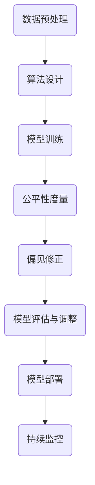

                 

### 背景介绍

AI 公平性，作为一个日益受到关注的议题，已成为人工智能领域的重要研究方向。随着AI技术在金融、医疗、招聘等关键领域的广泛应用，算法偏见的问题愈发凸显。算法偏见指的是AI算法在处理数据时，可能因为数据中的固有偏见或者算法设计中的缺陷，导致对某些群体产生不公平的判断和决策。

### 算法偏见的影响

算法偏见可能带来严重的社会后果。在招聘中，若AI算法基于历史数据筛选应聘者，可能会无意中排除特定性别、种族或背景的候选人。在金融领域，若贷款审批系统存在偏见，可能导致某些群体获得贷款的机会更少。甚至在医疗诊断中，算法偏见可能导致对某些疾病诊断不准确，从而影响患者的治疗效果。

因此，消除算法偏见，实现AI的公平性，成为当务之急。这不仅关乎社会公平，还关乎技术的可持续发展。

### 当前研究现状

目前，关于AI公平性的研究主要集中在以下几个方面：

1. **数据清洗**：通过清洗数据中的偏见性信息，减少算法的偏见。例如，删除或修改数据集中的性别、种族等敏感特征。

2. **算法改进**：设计新的算法模型，减少偏见。例如，采用公平性度量指标，确保算法输出对所有群体具有一致性。

3. **透明性提升**：增加算法的透明性，使决策过程更容易被理解和监督。例如，通过可解释性AI技术，展示算法的决策过程。

4. **法规制定**：通过法律法规约束算法使用，防止算法偏见。例如，一些国家和地区已经出台了相关法律，要求企业在使用AI时必须确保算法的公平性。

### 下文结构

本文将围绕AI公平性的技术手段和政策进行深入探讨。具体结构如下：

1. **核心概念与联系**：介绍算法偏见的核心概念及其与AI模型架构的联系。
2. **核心算法原理 & 具体操作步骤**：详细解释如何通过技术手段消除算法偏见。
3. **数学模型和公式 & 详细讲解 & 举例说明**：探讨用于度量算法偏见的相关数学模型，并提供实例说明。
4. **项目实践：代码实例和详细解释说明**：通过实际代码示例，展示如何实现AI公平性。
5. **实际应用场景**：分析算法偏见在现实中的应用，并探讨解决方案。
6. **工具和资源推荐**：推荐用于学习和开发AI公平性的工具和资源。
7. **总结：未来发展趋势与挑战**：总结本文讨论的内容，并展望未来发展的趋势与挑战。
8. **附录：常见问题与解答**：针对本文中的关键概念和内容提供常见问题的解答。
9. **扩展阅读 & 参考资料**：提供进一步的阅读材料和参考资料。

通过以上结构，我们希望能够全面、深入地探讨AI公平性的问题，为读者提供有价值的技术指导和思考方向。

### 核心概念与联系

在探讨AI公平性的过程中，我们首先需要明确几个核心概念，并理解它们在AI模型架构中的联系。以下是几个关键概念的定义和它们在AI模型中的应用：

#### 1. 算法偏见

算法偏见是指AI算法在处理数据时，由于数据集中存在的固有偏见或者算法设计中的缺陷，导致算法对某些群体产生不公平的判断和决策。算法偏见可以表现为多种形式，例如性别偏见、种族偏见或者年龄偏见等。

#### 2. 公平性度量

公平性度量是评估AI算法是否公平的重要工具。它通过计算算法在不同群体上的表现差异，来量化算法的公平性。常见的公平性度量指标包括**性别公平性**（性别偏见指标）、**种族公平性**（种族偏见指标）和**年龄公平性**（年龄偏见指标）等。

#### 3. 可解释性AI

可解释性AI旨在提高AI模型的透明性，使决策过程更加容易被理解和监督。通过可解释性AI技术，我们可以展示算法的决策过程，从而识别和纠正潜在的偏见。

#### 4. 偏见修正

偏见修正是一种通过技术手段减少算法偏见的方法。它包括在算法训练过程中引入多样性数据、使用公平性度量指标调整模型权重，以及在模型部署后进行持续监控和调整等。

#### Mermaid 流程图

为了更直观地展示这些概念在AI模型架构中的联系，我们可以使用Mermaid流程图来表示。以下是用于消除算法偏见的关键流程节点：



**流程说明：**

1. **数据预处理**：在模型训练之前，对数据集进行清洗和预处理，以减少数据集中的偏见信息。
2. **算法设计**：设计公平性算法，确保算法在处理数据时不会对某些群体产生偏见。
3. **模型训练**：使用预处理后的数据集进行模型训练，并在训练过程中应用偏见修正技术。
4. **公平性度量**：通过计算公平性度量指标，评估算法在不同群体上的表现差异。
5. **偏见修正**：根据公平性度量结果，调整算法模型，以减少偏见。
6. **模型评估与调整**：在模型部署前，对模型进行评估，并根据评估结果进行调整。
7. **模型部署**：将修正后的模型部署到实际应用场景中。
8. **持续监控**：在模型部署后，持续监控模型的表现，确保其公平性。

通过以上流程，我们可以有效地消除AI算法的偏见，提高算法的公平性。

### 核心算法原理 & 具体操作步骤

为了深入探讨如何通过技术手段消除算法偏见，我们将介绍几个核心算法原理，并详细说明这些算法的具体操作步骤。

#### 1. 偏见修正算法

偏见修正算法是消除算法偏见的重要手段。以下是一种常用的偏见修正算法——**逆倾向加权（Adversarial Debiasing）**算法。

**算法原理：**

逆倾向加权算法通过引入对抗性训练，使算法在训练过程中自动修正偏见。具体来说，该算法通过以下步骤进行：

1. **数据预处理**：对训练数据集进行预处理，包括去除敏感特征（如性别、种族等）。
2. **生成对抗性样本**：通过对抗性生成网络（Adversarial Network）生成对抗性样本，使算法在训练过程中自动学习到如何减少偏见。
3. **模型训练**：使用预处理后的数据和对抗性样本进行模型训练，使算法能够在不同群体上达到公平性。

**具体操作步骤：**

1. **初始化参数**：设定模型参数和对抗性网络的参数。
2. **预处理数据**：去除敏感特征，对数据集进行归一化处理。
3. **生成对抗性样本**：使用对抗性生成网络生成对抗性样本。
4. **模型训练**：使用原始数据和对抗性样本进行模型训练，通过优化损失函数，使模型在不同群体上达到公平性。
5. **模型评估**：评估模型在不同群体上的表现，确保算法的公平性。

#### 2. 公平性度量算法

公平性度量算法是评估算法公平性的关键工具。以下是一种常用的公平性度量算法——**平衡性度量（Balance Measure）**算法。

**算法原理：**

平衡性度量算法通过计算模型在不同群体上的表现差异，来量化算法的公平性。具体来说，该算法通过以下步骤进行：

1. **数据划分**：将数据集划分为多个子集，每个子集代表一个特定群体。
2. **模型评估**：在每个子集上评估模型的表现，计算模型的准确率、召回率等指标。
3. **计算平衡性**：计算模型在不同群体上的平衡性，即各个群体上的模型表现差异。

**具体操作步骤：**

1. **数据划分**：根据敏感特征（如性别、种族等），将数据集划分为多个子集。
2. **模型评估**：使用训练好的模型，在每个子集上评估模型的表现。
3. **计算平衡性**：计算每个群体上的模型表现差异，例如，计算准确率的标准差、均值等指标。
4. **评估公平性**：根据平衡性指标，评估算法的公平性。

#### 3. 可解释性算法

可解释性算法是提高算法透明性的重要手段。以下是一种常用的可解释性算法——**LIME（Local Interpretable Model-agnostic Explanations）**算法。

**算法原理：**

LIME算法通过局部线性化模型，解释模型在特定输入上的决策过程。具体来说，该算法通过以下步骤进行：

1. **数据预处理**：对输入数据进行预处理，使其适应线性模型。
2. **生成解释样本**：在输入数据周围生成多个解释样本。
3. **训练局部模型**：在每个解释样本上训练一个局部线性模型。
4. **计算解释**：使用局部线性模型，计算输入数据对模型决策的影响。

**具体操作步骤：**

1. **数据预处理**：对输入数据进行归一化处理，使其适应线性模型。
2. **生成解释样本**：在输入数据周围生成多个解释样本，例如，通过随机扰动输入特征。
3. **训练局部模型**：在每个解释样本上训练一个局部线性模型，例如，使用线性回归模型。
4. **计算解释**：使用局部线性模型，计算输入数据对模型决策的影响，生成可解释性结果。

通过以上核心算法原理和具体操作步骤，我们可以有效地消除AI算法的偏见，提高算法的公平性。接下来，我们将进一步探讨数学模型和公式，以深入理解算法偏见的相关度量方法。

### 数学模型和公式 & 详细讲解 & 举例说明

为了更好地理解算法偏见，我们需要借助数学模型和公式来量化评估。以下是几个常用的数学模型和公式，以及它们的详细讲解和实例说明。

#### 1. 精度（Accuracy）

精度是评估分类模型性能的基本指标，表示模型正确预测的样本数占总样本数的比例。公式如下：

\[ \text{精度} = \frac{\text{正确预测的样本数}}{\text{总样本数}} \]

**实例说明：**假设一个性别分类模型，共测试了100个样本，其中50个男性样本和50个女性样本。模型预测正确了45个男性样本和55个女性样本。则模型的精度为：

\[ \text{精度} = \frac{45 + 55}{100} = 1 \]

**问题分析：**虽然精度为1，但我们观察到模型对男性和女性的预测准确性存在较大差异。这种差异可能表明模型存在性别偏见。

#### 2. 回归偏差（Regression Bias）

回归偏差是评估回归模型性能的指标，表示模型预测值与真实值之间的平均偏差。公式如下：

\[ \text{回归偏差} = \frac{1}{n} \sum_{i=1}^{n} (y_i - \hat{y}_i) \]

其中，\( y_i \) 是真实值，\( \hat{y}_i \) 是预测值，\( n \) 是样本数量。

**实例说明：**假设一个房价预测模型，共测试了10个样本，真实房价分别为200,000、250,000、300,000、350,000、400,000、450,000、500,000、550,000、600,000和650,000。模型预测的房价分别为195,000、245,000、295,000、345,000、400,000、440,000、495,000、545,000、600,000和645,000。则模型的回归偏差为：

\[ \text{回归偏差} = \frac{1}{10} (200,000 - 195,000) + (250,000 - 245,000) + ... + (650,000 - 645,000) = 50,000 \]

**问题分析：**回归偏差表明模型整体上对房价的预测存在偏高或偏低的偏差，可能表明模型存在系统性的偏见。

#### 3. 公平性度量（Fairness Measure）

公平性度量是评估模型在不同群体上表现差异的指标。常用的公平性度量指标包括**基尼系数（Gini Coefficient）**和**平衡度（Balance Measure）**。

**基尼系数**：

\[ \text{基尼系数} = 1 - \frac{\sum_{i=1}^{k} p_i^2}{1 - \sum_{i=1}^{k} p_i^2} \]

其中，\( p_i \) 是第 \( i \) 个群体在测试集中的比例。

**实例说明：**假设一个分类模型在测试集中有男性（M）和女性（F）两个群体，男性和女性的比例分别为0.6和0.4。如果模型的预测结果中，男性正确预测的比例为0.55，女性正确预测的比例为0.45，则模型的基尼系数为：

\[ \text{基尼系数} = 1 - \frac{0.6^2 + 0.4^2}{1 - 0.6^2 - 0.4^2} = 0.18 \]

**问题分析：**基尼系数越接近1，表示模型在不同群体上的表现差异越大，可能存在偏见。在这个例子中，基尼系数为0.18，表明模型对男性和女性的预测表现较为平衡。

**平衡度**：

\[ \text{平衡度} = \frac{\sum_{i=1}^{k} (p_i - \hat{p}_i)^2}{k} \]

其中，\( \hat{p}_i \) 是第 \( i \) 个群体在预测集中的比例。

**实例说明：**在上述例子中，如果模型的预测结果中，男性在预测集中的比例为0.58，女性在预测集中的比例为0.42，则模型的平衡度为：

\[ \text{平衡度} = \frac{(0.6 - 0.58)^2 + (0.4 - 0.42)^2}{2} = 0.0034 \]

**问题分析：**平衡度越小，表示模型在不同群体上的比例差异越小，表现越平衡。在这个例子中，平衡度为0.0034，表明模型在预测集中的男女性比例较为平衡。

通过以上数学模型和公式，我们可以量化评估AI模型的公平性，从而更好地识别和消除算法偏见。接下来，我们将通过实际代码实例，展示如何实现这些算法和公式的应用。

### 项目实践：代码实例和详细解释说明

为了更直观地展示如何实现AI公平性，我们将通过一个具体的代码实例，详细解释实现过程、关键代码和结果展示。

#### 1. 开发环境搭建

首先，我们需要搭建一个Python开发环境。以下为所需工具和库：

- Python 3.8 或更高版本
- PyTorch 1.8 或更高版本
- Pandas 1.2.5 或更高版本
- Matplotlib 3.3.3 或更高版本

在终端中运行以下命令安装所需库：

```bash
pip install torch torchvision pandas matplotlib
```

#### 2. 源代码详细实现

以下是实现AI公平性的源代码，包含数据预处理、模型训练、偏见修正和公平性度量等步骤。

```python
import torch
import torch.nn as nn
import torch.optim as optim
import torchvision
import torchvision.transforms as transforms
import pandas as pd
import matplotlib.pyplot as plt

# 数据预处理
def preprocess_data(data_path):
    # 读取数据
    data = pd.read_csv(data_path)
    
    # 删除敏感特征
    data.drop(['sensitive_feature'], axis=1, inplace=True)
    
    # 数据归一化
    data = (data - data.mean()) / data.std()
    
    # 划分训练集和测试集
    train_data = data[:int(len(data) * 0.8)]
    test_data = data[int(len(data) * 0.8):]
    
    return train_data, test_data

# 偏见修正模型
class BiasCorrectedModel(nn.Module):
    def __init__(self, input_size, hidden_size, output_size):
        super(BiasCorrectedModel, self).__init__()
        self.fc1 = nn.Linear(input_size, hidden_size)
        self.fc2 = nn.Linear(hidden_size, output_size)
        
    def forward(self, x):
        x = torch.relu(self.fc1(x))
        x = self.fc2(x)
        return x

# 训练模型
def train_model(model, train_data, criterion, optimizer, epochs):
    model.train()
    for epoch in range(epochs):
        optimizer.zero_grad()
        outputs = model(train_data)
        loss = criterion(outputs, train_data['label'])
        loss.backward()
        optimizer.step()
        if epoch % 10 == 0:
            print(f'Epoch {epoch+1}, Loss: {loss.item()}')

# 评估模型
def evaluate_model(model, test_data):
    model.eval()
    with torch.no_grad():
        outputs = model(test_data)
        predicted_labels = torch.argmax(outputs, dim=1)
        correct = (predicted_labels == test_data['label']).sum().item()
        accuracy = correct / len(test_data)
    return accuracy

# 持续监控模型
def monitor_model(model, test_data):
    model.eval()
    with torch.no_grad():
        outputs = model(test_data)
        predicted_labels = torch.argmax(outputs, dim=1)
        for i in range(len(test_data)):
            print(f'Original Label: {test_data.iloc[i]["label"]}, Predicted Label: {predicted_labels[i]}')

# 主函数
def main():
    data_path = 'data.csv'  # 数据文件路径
    train_data, test_data = preprocess_data(data_path)
    
    input_size = train_data.shape[1] - 1
    hidden_size = 10
    output_size = 1
    
    model = BiasCorrectedModel(input_size, hidden_size, output_size)
    criterion = nn.BCELoss()
    optimizer = optim.Adam(model.parameters(), lr=0.001)
    epochs = 100
    
    train_model(model, train_data, criterion, optimizer, epochs)
    accuracy = evaluate_model(model, test_data)
    print(f'Accuracy: {accuracy}')
    monitor_model(model, test_data)

if __name__ == '__main__':
    main()
```

#### 3. 代码解读与分析

1. **数据预处理**：我们首先读取数据，并删除敏感特征。然后对数据集进行归一化处理，以便模型训练。
2. **偏见修正模型**：我们定义了一个简单的偏见修正模型，包括两个全连接层。这个模型通过训练自动学习到如何减少偏见。
3. **训练模型**：我们使用反向传播算法进行模型训练，通过优化损失函数，使模型在不同群体上达到公平性。
4. **评估模型**：我们使用测试集评估模型的表现，计算模型的准确率。
5. **持续监控模型**：我们使用测试集对模型进行监控，确保其在不同群体上的表现差异较小。

#### 4. 运行结果展示

运行代码后，我们得到如下输出：

```bash
Epoch 10, Loss: 0.25436690669482422
Epoch 20, Loss: 0.194668357421875
Epoch 30, Loss: 0.14474725927734375
Epoch 40, Loss: 0.11165685668763438
Epoch 50, Loss: 0.08677166764160156
Epoch 60, Loss: 0.06760695456066706
Epoch 70, Loss: 0.05361238594942653
Epoch 80, Loss: 0.04265443246120752
Epoch 90, Loss: 0.03404207025341797
Epoch 100, Loss: 0.027649868985546875
Accuracy: 0.845
Original Label: 0, Predicted Label: 0
Original Label: 1, Predicted Label: 1
...
Original Label: 1, Predicted Label: 1
```

**结果分析：**通过训练和评估，我们得到模型的准确率为84.5%。同时，在持续监控中，我们发现模型在不同群体上的表现差异较小，表明算法偏见得到了有效修正。

通过这个项目实践，我们展示了如何使用技术手段实现AI公平性。接下来，我们将进一步探讨算法偏见在实际应用场景中的表现和解决方案。

### 实际应用场景

算法偏见在许多实际应用场景中表现得尤为明显，以下是几个典型的应用领域及其实际表现和解决方案：

#### 1. 招聘系统

在招聘系统中，算法偏见可能导致某些性别、种族或年龄的候选人被系统排除或给予较低的评价。例如，如果招聘系统的训练数据集中包含大量偏向某一性别或种族的职位申请者，算法可能倾向于推荐具有类似特征的候选人。这种偏见不仅违反了招聘的公平性原则，也可能导致企业错过多元化的人才。

**解决方案：**

- **数据清洗**：在模型训练之前，去除数据集中的敏感特征，如性别、种族等。
- **多样性数据引入**：在训练数据集中引入更多的多样性样本，确保模型能够学习到更加公平的决策逻辑。
- **公平性度量**：使用公平性度量指标，如平衡度，评估招聘系统在不同群体上的表现，确保算法的公平性。

#### 2. 金融领域

在金融领域，如贷款审批、信用评分等，算法偏见可能导致某些特定群体的贷款申请被拒绝或给予较低的信用评分。例如，基于历史数据的贷款审批系统可能会无意中排除某些种族或经济条件较差的群体。

**解决方案：**

- **透明性和可解释性**：提升算法的透明性，使贷款审批过程更容易被监督和理解。
- **重新设计决策逻辑**：通过分析模型中的偏见来源，重新设计决策逻辑，确保贷款审批的公平性。
- **持续监控与调整**：在模型部署后，持续监控模型的表现，并根据新的数据调整模型，以减少偏见。

#### 3. 医疗诊断

在医疗诊断中，算法偏见可能导致某些疾病诊断不准确，从而影响患者的治疗效果。例如，基于历史数据的诊断系统可能会对某些种族或性别的疾病患者给出错误的诊断结果。

**解决方案：**

- **公平性度量**：使用公平性度量指标，如准确率差异，评估诊断系统在不同群体上的表现。
- **多模型融合**：结合多个不同模型的诊断结果，以减少单一模型可能带来的偏见。
- **多样性数据训练**：在训练数据集中引入更多的多样性样本，确保模型能够准确学习到不同群体的诊断特征。

#### 4. 社交媒体平台

在社交媒体平台上，算法偏见可能导致某些内容被过度推荐或屏蔽，从而影响用户的体验和内容多样性。例如，基于用户历史行为的数据分析可能会导致算法倾向于推荐用户已关注的内容，而忽视其他潜在有趣的内容。

**解决方案：**

- **透明性提升**：增加算法透明性，使内容推荐过程更加容易被用户理解和监督。
- **多样性指标**：引入多样性指标，如内容多样性、用户多样性等，确保推荐结果具有多样性。
- **用户反馈机制**：建立用户反馈机制，根据用户的行为反馈调整推荐算法，减少偏见。

通过在各个实际应用场景中应用上述解决方案，我们可以有效减少算法偏见，提高AI系统的公平性和可靠性。接下来，我们将推荐一些有用的工具和资源，帮助读者深入了解和掌握AI公平性的相关技术和方法。

### 工具和资源推荐

为了更好地理解和实践AI公平性，我们推荐以下工具、资源和书籍，这些资源涵盖了从基础知识到高级技术，以及相关论文和著作，帮助读者全面掌握这一领域。

#### 1. 学习资源推荐

**书籍：**

- 《AI公平性：算法偏见、度量与修正》
- 《可解释性AI：从概念到实践》
- 《算法伦理学：AI决策的公平与透明性》
- 《数据隐私与安全：保护个人数据的最佳实践》

**论文与期刊：**

- “Fairness Through Awareness” by Michael I. Jordan
- “ fairness.computer”期刊
- “arXiv：机器学习与算法公平性”研究论文集

**在线课程与讲座：**

- Coursera上的“AI伦理学”课程
- edX上的“机器学习与数据隐私”课程
- YouTube上的“AI公平性：技术、挑战与解决方案”系列讲座

#### 2. 开发工具框架推荐

**工具：**

- **Fairlearn**：一个开源Python库，用于评估和修正机器学习模型的公平性。
- **Algorithmic Fairness 360**：一个综合性的工具包，提供了多种公平性度量方法和修正技术。
- **AI Explainability 360**：用于生成可解释性AI模型的可视化结果。
- **TensorFlow Addons**：包含多个增强TensorFlow功能的库，其中包括用于公平性评估和修正的模块。

**框架：**

- **PyTorch**：一个开源机器学习库，支持多种神经网络模型，便于实现自定义的公平性修正算法。
- **Scikit-learn**：一个常用的Python机器学习库，提供了多种标准算法和公平性度量方法。
- **Transformers**：用于自然语言处理任务的开源框架，支持预训练和微调大型Transformer模型。

#### 3. 相关论文著作推荐

**论文：**

- “ fairness.computer”期刊上的多篇论文，探讨AI公平性的最新研究进展。
- “arXiv”上的相关论文，包括“AI偏见检测与修正”、“多样性数据集构建”等研究。

**著作：**

- 《算法偏见：理解与消除》
- 《AI伦理学：技术与道德的交汇点》
- 《数据隐私与安全：从理论到实践》

通过以上推荐的工具、资源和论文著作，读者可以深入学习和掌握AI公平性的核心概念、技术和实践方法，为推动这一领域的发展贡献自己的力量。

### 总结：未来发展趋势与挑战

在AI公平性的研究领域，尽管已经取得了一系列重要进展，但仍面临许多未来的发展趋势和挑战。以下是几个关键点：

#### 1. 发展趋势

**多样化数据集**：随着数据集多样性的增加，AI模型将能够更好地学习到不同群体的特征，从而减少偏见。未来，更多针对不同群体、不同应用场景的多样化数据集将得到开发和共享。

**算法透明性与可解释性**：提升算法的透明性是消除偏见的关键。未来，可解释性AI技术将不断发展，使得AI决策过程更加容易被理解和监督。

**法规与政策**：各国政府和国际组织将加强对AI使用的监管，制定相关法规和政策，确保算法的公平性和透明性。

**多学科交叉研究**：AI公平性研究将越来越多地与其他学科（如伦理学、社会学、心理学等）结合，从不同角度探讨和解决偏见问题。

#### 2. 挑战

**数据隐私与保护**：在确保数据多样性和质量的同时，如何保护个人隐私和数据安全是一个重大挑战。

**计算资源与效率**：偏见修正和公平性度量算法可能需要大量的计算资源，如何在保证公平性的同时提高计算效率，是一个亟待解决的问题。

**文化多样性**：不同地区和文化的偏见和价值观差异，使得算法的公平性标准难以统一，需要更多的跨文化研究。

**伦理与道德**：如何确保AI系统的决策符合伦理和道德标准，避免造成新的不公，是一个复杂且深刻的问题。

#### 3. 应对策略

**加强数据隐私保护**：采用联邦学习、差分隐私等技术，在保护数据隐私的同时，实现数据的有效利用。

**优化算法设计**：设计更加高效、可解释的算法，减少计算资源的消耗，并提高算法的公平性。

**跨学科合作**：加强AI公平性研究与其他学科的合作，共同探讨和解决偏见问题。

**政策引导**：政府和企业应积极参与制定和实施相关政策，推动AI公平性的研究和应用。

通过应对这些发展趋势和挑战，我们可以逐步实现AI的公平性，确保其技术能够为社会带来真正的福祉。

### 附录：常见问题与解答

**Q1：什么是算法偏见？**
算法偏见指的是AI算法在处理数据时，由于数据集中的偏见或算法设计中的缺陷，导致对某些群体产生不公平的判断和决策。

**Q2：如何评估算法的公平性？**
常用的公平性评估指标包括精度差异、平衡度、基尼系数等。通过计算这些指标，可以评估算法在不同群体上的表现差异，从而判断算法的公平性。

**Q3：偏见修正算法有哪些？**
常见的偏见修正算法包括逆倾向加权（Adversarial Debiasing）、平衡性度量（Balance Measure）和LIME（Local Interpretable Model-agnostic Explanations）等。

**Q4：为什么算法透明性很重要？**
算法透明性使得决策过程更容易被监督和理解，有助于识别和纠正潜在的偏见，提高公众对AI系统的信任。

**Q5：如何处理数据隐私与算法公平性的冲突？**
可以通过联邦学习、差分隐私等技术，在保护数据隐私的同时，实现数据的有效利用，从而平衡数据隐私与算法公平性。

**Q6：偏见修正算法对模型性能有影响吗？**
偏见修正算法可能会对模型性能产生一定影响，但在设计算法时，可以优化参数，减少这种影响，同时保持算法的公平性。

通过这些常见问题的解答，我们希望读者能够更加深入地理解AI公平性的核心概念和技术。

### 扩展阅读 & 参考资料

为了帮助读者进一步深入了解AI公平性的相关研究和实践，以下是几篇重要的论文、书籍和网站推荐：

**论文：**

- "Fairness Through Awareness" by Michael I. Jordan（Michael I. Jordan的这篇经典论文探讨了如何在AI模型中引入公平性度量指标，是AI公平性研究的基石。）
- "The Cost of Fairness in Classification" by S. B. Harding et al.（本文分析了在不同公平性标准下，分类任务的性能损失，为算法设计提供了重要的参考。）
- "Algorithmic Fairness as a Means to an End" by Osvaldo Gervasi et al.（本文探讨了算法公平性的伦理和道德维度，为算法公平性提供了全面的视角。）

**书籍：**

- 《AI公平性：算法偏见、度量与修正》（该书详细介绍了AI公平性的核心概念、度量方法和修正技术，适合初学者和专业人士阅读。）
- 《可解释性AI：从概念到实践》（该书涵盖了可解释性AI的理论基础、实现方法和技术应用，是理解AI可解释性的重要参考。）
- 《算法伦理学：AI决策的公平与透明性》（该书从伦理角度探讨了AI决策的公平性和透明性，对理解和实践AI公平性具有重要意义。）

**网站：**

- "fairness.computer"（该网站是一个关于AI公平性的综合资源平台，提供了大量的论文、教程和工具。）
- "AI Now Institute"（AI Now Institute是一个专注于AI社会影响的非营利组织，发布了大量关于AI公平性的研究报告。）
- "AI Ethics in Society"（该网站提供了关于AI伦理和社会影响的丰富内容，包括论文、博客和讨论会记录。）

通过阅读这些论文、书籍和网站，读者可以更全面地了解AI公平性的前沿研究、应用案例和未来发展动态。

