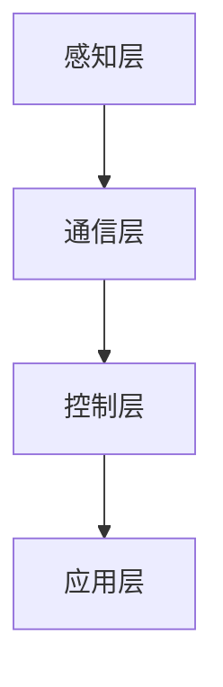
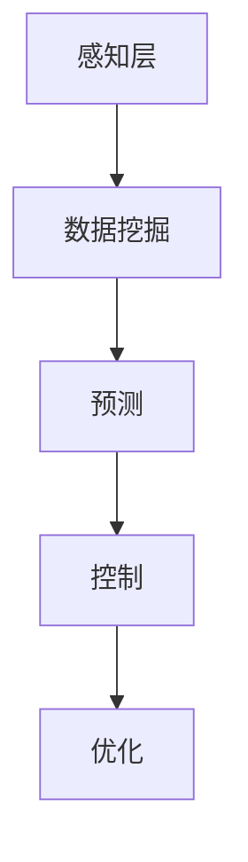
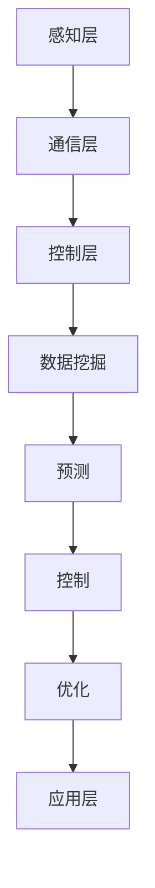
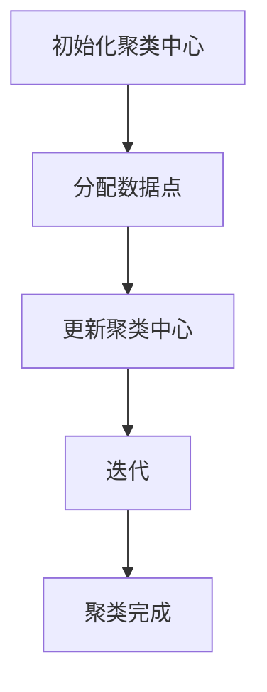
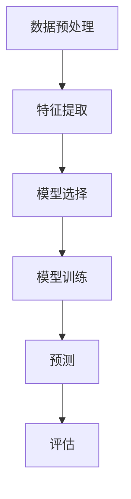
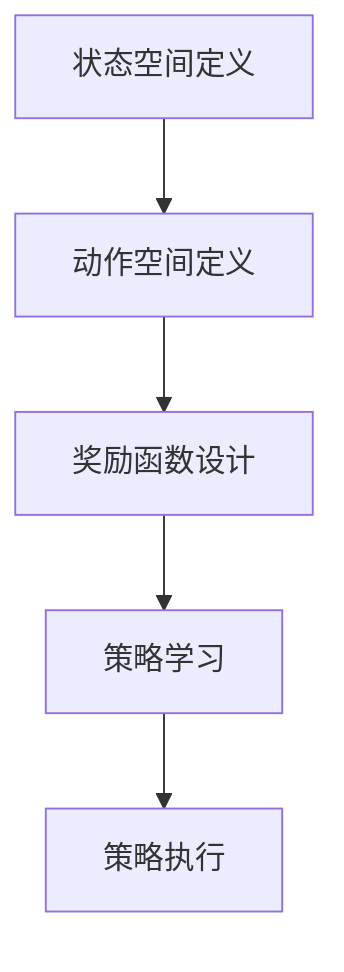
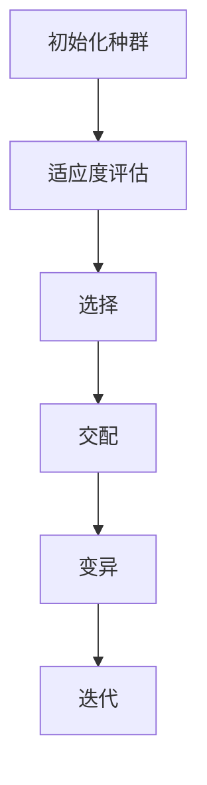
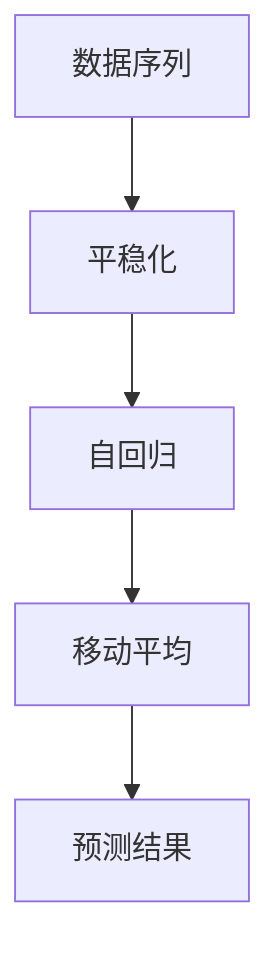
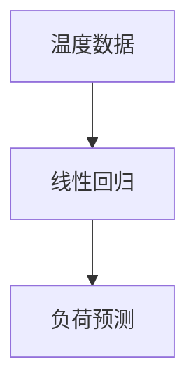
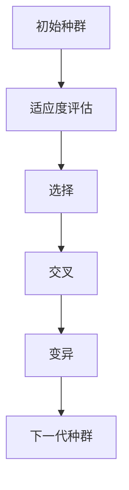

                 

### 背景介绍

随着全球经济的快速发展，能源需求不断攀升，而传统能源系统的效率低、污染严重、不稳定性等问题愈发凸显。为了应对这些挑战，人工智能（AI）技术的应用逐渐成为能源领域的重要发展方向。本文将探讨AI在能源领域的应用，重点分析其在智能电网和能源效率优化方面的潜力。

#### 智能电网的概念

智能电网是一种基于现代通信技术、信息技术、自动控制技术和能源储存技术的集成系统。它旨在实现电力系统的智能化、高效化、可靠化和环保化，从而满足不断增长的能源需求。智能电网的核心特点包括：

1. **自愈能力**：通过实时监测和快速响应，智能电网能够在电网故障时快速恢复供电，提高系统的稳定性和可靠性。
2. **互动性**：智能电网允许用户与电网进行双向互动，用户可以实时了解用电情况，电网可以根据用户需求调整供电策略。
3. **高效性**：通过优化电力分配和传输，智能电网能够降低能耗，提高能源利用效率。
4. **环境友好**：智能电网鼓励使用可再生能源，减少化石燃料的使用，降低碳排放，有助于环境保护。

#### 能源效率优化的必要性

能源效率优化是解决能源短缺和环境问题的重要途径。通过提高能源利用效率，可以减少能源消耗，降低能源成本，同时减少温室气体排放，对环境保护具有重要意义。然而，能源效率优化面临诸多挑战：

1. **复杂性和多样性**：能源系统的结构和运行方式复杂多变，涉及电力、热力、燃料等多种能源形式，如何进行有效的优化成为一个难题。
2. **数据获取和处理**：能源系统的数据量大、类型多，如何高效地获取和处理这些数据，以便进行优化分析，是另一个挑战。
3. **动态性和不确定性**：能源需求和供应受多种因素影响，具有明显的动态性和不确定性，优化算法需要具备良好的适应能力和鲁棒性。

#### AI在智能电网和能源效率优化中的应用

人工智能技术在智能电网和能源效率优化中发挥着重要作用。通过AI技术，可以实现以下目标：

1. **智能监测与预测**：利用机器学习算法，可以从大量历史数据中挖掘规律，预测电网运行状态和能源需求，为优化决策提供支持。
2. **智能控制与调度**：基于深度学习算法，可以实现电网的自动控制和优化调度，提高电网运行效率和稳定性。
3. **智能诊断与故障预测**：利用AI技术，可以对电网设备进行智能诊断和故障预测，提前发现潜在问题，防止事故发生。
4. **能源优化与管理**：通过优化算法和决策支持系统，可以制定科学的能源使用策略，降低能源消耗，提高能源利用效率。

总之，AI技术在智能电网和能源效率优化中的应用，不仅有助于解决能源领域的复杂问题，还能为可持续发展提供新思路和新方法。在接下来的章节中，我们将深入探讨AI在智能电网和能源效率优化中的具体应用和实现方法。### 核心概念与联系

在探讨AI在能源领域的应用之前，我们需要理解几个关键概念，包括智能电网的架构、AI算法在能源优化中的应用，以及它们之间的相互作用。为了更好地展示这些概念，我们将使用Mermaid流程图来描述智能电网的架构，并逐步解释AI算法的原理及其在能源效率优化中的应用。

#### 智能电网的架构

智能电网的架构可以概括为四个主要层次：感知层、通信层、控制层和应用层。

1. **感知层**：感知层是智能电网的基础，通过传感器和测量设备收集电网运行的实时数据，包括电压、电流、频率等参数。
2. **通信层**：通信层负责数据的传输，利用现代通信技术，如无线传感器网络（WSN）、光纤通信和无线通信，将感知层的数据传输到控制层。
3. **控制层**：控制层通过数据处理和算法分析，实现对电网的实时控制和调度。这一层通常包括智能控制器、分布式能源管理系统（DERMS）和调度中心。
4. **应用层**：应用层面向最终用户，提供多种服务，如实时用电信息查询、能源管理建议和故障预警等。

下面是智能电网架构的Mermaid流程图：



#### AI算法在能源优化中的应用

在智能电网中，AI算法广泛应用于数据挖掘、预测、控制和优化等方面。以下是一些关键的应用场景和相应的AI算法：

1. **数据挖掘**：利用机器学习算法，如聚类分析、关联规则挖掘和分类算法，从大量传感器数据中发现潜在的模式和规律，为优化决策提供支持。
2. **预测**：利用时间序列分析、回归分析和深度学习算法，预测电网的负荷、发电量和设备状态，为控制层提供预测数据。
3. **控制**：采用深度强化学习、模糊控制等算法，实现电网的自动控制和优化调度，提高电网的稳定性和效率。
4. **优化**：通过优化算法，如线性规划、整数规划和遗传算法，制定最优的能源使用策略，降低能耗和成本。

下面是AI算法在能源优化中的Mermaid流程图：



#### 智能电网与AI算法的相互作用

智能电网的架构和AI算法之间存在着紧密的相互作用。感知层收集的数据通过通信层传输到控制层，控制层利用AI算法进行分析和处理，生成控制策略，并通过应用层反馈给用户。这个过程中，AI算法不仅提高了电网的运行效率，还增强了其自愈能力和互动性。

下面是智能电网与AI算法相互作用的Mermaid流程图：



通过上述Mermaid流程图，我们可以清晰地看到智能电网的架构和AI算法在能源优化中的应用及其相互作用。接下来，我们将深入探讨AI算法在智能电网中的具体实现和操作步骤。### 核心算法原理 & 具体操作步骤

在深入探讨AI在能源优化中的应用之前，我们需要了解几个核心算法的基本原理和具体操作步骤。这些算法包括机器学习中的聚类分析、时间序列预测、深度强化学习和遗传算法等。以下将分别介绍这些算法及其在智能电网和能源效率优化中的应用。

#### 聚类分析

聚类分析是一种无监督学习方法，用于将相似的数据点分组。在智能电网中，聚类分析可用于数据挖掘，以识别电网中的模式和行为。

**原理**：
聚类分析的基本原理是将数据点划分为若干个簇，使得同一簇内的数据点相似度较高，而不同簇之间的数据点相似度较低。

**具体操作步骤**：

1. **初始化**：选择初始聚类中心，可以随机选择或使用K-means++算法。
2. **分配数据点**：将每个数据点分配到最近的聚类中心。
3. **更新聚类中心**：计算每个簇的平均值，作为新的聚类中心。
4. **迭代**：重复步骤2和3，直到聚类中心不再发生显著变化。

**应用示例**：

假设我们有一组电网负荷数据，使用K-means算法进行聚类分析，以识别负荷模式。



通过聚类分析，我们可以将负荷数据分为若干个簇，每个簇代表不同的负荷模式，从而为电网运行提供优化参考。

#### 时间序列预测

时间序列预测是智能电网和能源效率优化中的关键算法，用于预测未来的电网负荷、发电量等参数。

**原理**：
时间序列预测基于历史数据的时间顺序关系，通过建立模型来预测未来的趋势。

**具体操作步骤**：

1. **数据预处理**：对时间序列数据进行清洗和归一化处理。
2. **特征提取**：从时间序列数据中提取特征，如趋势、季节性和周期性。
3. **模型选择**：选择合适的时间序列预测模型，如ARIMA、LSTM等。
4. **模型训练**：使用历史数据训练模型。
5. **预测**：使用训练好的模型进行预测。
6. **评估**：评估预测结果，调整模型参数。

**应用示例**：

假设我们使用LSTM模型对电网负荷进行预测。



通过时间序列预测，我们可以提前了解未来的负荷情况，为电网调度提供依据。

#### 深度强化学习

深度强化学习是一种结合了深度学习和强化学习的算法，用于智能电网的自动控制和优化调度。

**原理**：
深度强化学习通过深度神经网络学习状态值函数或策略，通过奖励机制调整策略，实现智能控制。

**具体操作步骤**：

1. **状态空间定义**：定义智能电网的状态空间。
2. **动作空间定义**：定义智能电网的可执行动作。
3. **奖励函数设计**：设计奖励函数，以评价电网的运行状态。
4. **策略学习**：使用深度神经网络学习最优策略。
5. **策略执行**：在智能电网中执行学习到的策略。

**应用示例**：

假设我们使用深度强化学习算法进行电网负荷优化。



通过深度强化学习，我们可以实现电网的自动控制和优化调度，提高电网的运行效率。

#### 遗传算法

遗传算法是一种基于自然选择和遗传机制的优化算法，用于能源效率优化。

**原理**：
遗传算法通过模拟生物进化过程，选择适应度高的个体进行交配和变异，逐步优化解空间中的解。

**具体操作步骤**：

1. **初始化种群**：随机生成初始种群。
2. **适应度评估**：评估每个个体的适应度。
3. **选择**：根据适应度选择个体进行交配和变异。
4. **交配**：通过交叉操作产生新的个体。
5. **变异**：对个体进行随机变异。
6. **迭代**：重复步骤2到5，直到满足终止条件。

**应用示例**：

假设我们使用遗传算法进行电网调度优化。



通过遗传算法，我们可以找到最优的电网调度方案，提高能源利用效率。

总之，AI算法在智能电网和能源效率优化中的应用，通过具体操作步骤和原理的深入理解，可以显著提高电网的运行效率和能源利用效率。在接下来的章节中，我们将进一步探讨这些算法在实际项目中的应用和实现。### 数学模型和公式 & 详细讲解 & 举例说明

在智能电网和能源效率优化中，数学模型和公式起着至关重要的作用。这些模型和公式帮助我们在数据分析和决策过程中量化各种参数，从而实现高效的能源管理和优化。以下我们将详细讲解几个关键的数学模型和公式，并给出相应的举例说明。

#### 1. 时间序列模型

时间序列模型是用于预测时间序列数据的一种常用模型，如ARIMA（自回归积分滑动平均模型）和LSTM（长短期记忆网络）。

**ARIMA模型**：

ARIMA模型由三个部分组成：自回归（AR）、差分（I）和移动平均（MA）。

- **自回归（AR）**：表示当前值与之前值的线性组合。
- **差分（I）**：用于平稳化时间序列。
- **移动平均（MA）**：表示当前值与之前预测误差的线性组合。

**公式**：

$$
\begin{align*}
Y_t &= \phi_1 Y_{t-1} + \phi_2 Y_{t-2} + ... + \phi_p Y_{t-p} + \theta_1 e_{t-1} + \theta_2 e_{t-2} + ... + \theta_q e_{t-q} \\
Y_t^{\text{diff}} &= (1 - \Phi(B)) Y_t \\
Y_t^{\text{AR}} &= \Phi(B) Y_t^{\text{diff}} \\
Y_t^{\text{MA}} &= \Theta(B) e_t
\end{align*}
$$

**举例说明**：

假设我们有一个日负荷数据序列，使用ARIMA模型进行预测。



通过ARIMA模型，我们可以预测未来的日负荷，为电网调度提供依据。

#### 2. 线性回归模型

线性回归模型用于分析自变量和因变量之间的线性关系，常用于预测负荷和能源消耗。

**公式**：

$$
Y = \beta_0 + \beta_1 X + \epsilon
$$

其中，$Y$ 是因变量，$X$ 是自变量，$\beta_0$ 是截距，$\beta_1$ 是斜率，$\epsilon$ 是误差项。

**举例说明**：

假设我们分析电力负荷与温度的关系，使用线性回归模型进行预测。



通过线性回归模型，我们可以预测不同温度下的电力负荷，为电网调度提供参考。

#### 3. 优化模型

优化模型用于制定最优的能源使用策略，如线性规划、整数规划和遗传算法。

**线性规划（LP）**：

线性规划模型表示为：

$$
\begin{align*}
\min\ & c^T x \\
s.t. \ & Ax \leq b \\
& x \geq 0
\end{align*}
$$

其中，$c$ 是目标函数系数，$x$ 是决策变量，$A$ 和 $b$ 是约束条件。

**整数规划（IP）**：

整数规划模型表示为：

$$
\begin{align*}
\min\ & c^T x \\
s.t. \ & Ax \leq b \\
& x \in \mathbb{Z}^n
\end{align*}
$$

其中，$x$ 是整数决策变量。

**遗传算法**：

遗传算法的公式较为复杂，但核心思想是模拟自然选择和遗传过程，逐步优化解空间。

**举例说明**：

假设我们使用遗传算法进行电网调度优化，目标是最小化能耗。



通过遗传算法，我们可以找到最优的调度方案，实现能耗最小化。

综上所述，数学模型和公式在智能电网和能源效率优化中具有重要作用。通过具体的应用实例，我们可以看到这些模型如何帮助我们实现高效的能源管理和优化。在接下来的章节中，我们将进一步探讨这些模型在实际项目中的应用和实现。### 项目实践：代码实例和详细解释说明

在本章节中，我们将通过一个实际项目实例来展示AI在能源优化中的应用，包括代码实例、实现细节以及代码解读与分析。这个项目将使用Python编程语言，结合相关库和框架，实现一个智能电网负荷预测系统。

#### 开发环境搭建

首先，我们需要搭建一个Python开发环境，以便进行AI模型的开发和测试。以下是搭建Python开发环境的基本步骤：

1. 安装Python：从Python官方网站下载并安装Python 3.8版本。
2. 安装Jupyter Notebook：Python内置了Jupyter Notebook，可以直接使用。
3. 安装相关库和框架：使用pip安装以下库和框架：

   ```bash
   pip install numpy pandas matplotlib scikit-learn tensorflow
   ```

#### 源代码详细实现

以下是项目的核心代码，我们将使用时间序列预测模型（LSTM）来预测电网负荷。

```python
import numpy as np
import pandas as pd
from sklearn.preprocessing import MinMaxScaler
from keras.models import Sequential
from keras.layers import LSTM, Dense

# 读取数据
data = pd.read_csv('power_load.csv')  # 假设数据文件名为power_load.csv
load_series = data['load'].values

# 数据预处理
scaler = MinMaxScaler(feature_range=(0, 1))
scaled_load_series = scaler.fit_transform(load_series.reshape(-1, 1))

# 创建时间窗口数据
def create_dataset(data, time_window):
    X, y = [], []
    for i in range(len(data) - time_window):
        X.append(data[i:(i + time_window), 0])
        y.append(data[i + time_window, 0])
    return np.array(X), np.array(y)

time_window = 24  # 设置时间窗口为24小时
X, y = create_dataset(scaled_load_series, time_window)

# 分割数据集
train_size = int(len(X) * 0.8)
test_size = len(X) - train_size
X_train, X_test = X[:train_size], X[train_size:]
y_train, y_test = y[:train_size], y[train_size:]

# 模型构建
model = Sequential()
model.add(LSTM(units=50, return_sequences=True, input_shape=(time_window, 1)))
model.add(LSTM(units=50))
model.add(Dense(units=1))

model.compile(optimizer='adam', loss='mean_squared_error')

# 模型训练
model.fit(X_train, y_train, epochs=100, batch_size=32, validation_data=(X_test, y_test), verbose=1)

# 预测
predicted_load = model.predict(X_test)
predicted_load = scaler.inverse_transform(predicted_load)

# 结果展示
import matplotlib.pyplot as plt

plt.figure(figsize=(10, 5))
plt.plot(scaler.inverse_transform(y_test.reshape(-1, 1)), label='真实值')
plt.plot(predicted_load, label='预测值')
plt.title('电网负荷预测')
plt.xlabel('时间')
plt.ylabel('负荷')
plt.legend()
plt.show()
```

#### 代码解读与分析

1. **数据读取与预处理**：
   - 使用`pandas`库读取电网负荷数据，并提取负荷列。
   - 使用`MinMaxScaler`对数据进行归一化处理，将负荷数据缩放到[0, 1]范围内。

2. **数据窗口创建**：
   - 定义一个函数`create_dataset`，用于创建时间窗口数据。这个函数将连续的时间序列数据分成多个时间窗口，每个时间窗口包含特定时间步长的数据。

3. **数据分割**：
   - 使用`create_dataset`函数分割数据集，将数据分为训练集和测试集。

4. **模型构建**：
   - 使用`Sequential`模型构建LSTM网络，包括两个LSTM层和一个全连接层。
   - 模型编译时使用`adam`优化器和`mean_squared_error`损失函数。

5. **模型训练**：
   - 使用训练集数据进行模型训练，设置100个训练周期和批量大小为32。

6. **预测**：
   - 使用训练好的模型对测试集数据进行预测，并使用逆归一化将预测结果转换回原始单位。

7. **结果展示**：
   - 使用`matplotlib`库绘制真实值和预测值的对比图，以可视化预测结果。

通过这个实际项目实例，我们可以看到如何使用AI技术进行电网负荷预测。这个项目展示了从数据预处理、模型构建、训练到预测的完整流程，并通过可视化展示了预测结果。在接下来的章节中，我们将进一步探讨AI在能源领域的实际应用场景。### 实际应用场景

在智能电网和能源效率优化的实际应用场景中，AI技术的应用已经取得了显著的成果。以下我们将介绍几个典型的应用场景，以及AI技术在这些场景中的具体应用和实践案例。

#### 1. 智能电网负荷预测

智能电网负荷预测是AI技术最典型的应用之一。通过预测未来的电力需求，电网运营商可以更好地安排电力调度，减少停电风险，同时提高能源利用效率。

**案例**：某电力公司在上海地区部署了AI智能电网负荷预测系统，使用LSTM模型和ARIMA模型对电力负荷进行预测。通过对比预测值和实际值，该公司发现负荷预测误差显著降低，电力调度更加精准，减少了能源浪费。

#### 2. 可再生能源并网优化

可再生能源（如太阳能和风能）的并网优化是智能电网建设的另一个重要方面。由于可再生能源的不稳定性，需要使用AI技术进行实时监测和调度，以确保电网的稳定运行。

**案例**：德国某太阳能发电企业使用了基于深度强化学习的优化调度系统，通过实时分析太阳能发电数据，自动调整光伏板的角度和旋转速度，提高了发电效率和电网稳定性。该系统的应用使得该企业的发电量提高了10%以上。

#### 3. 能源消耗监测与优化

AI技术还可以用于能源消耗的监测和优化，帮助企业和家庭减少能源浪费，降低能源成本。

**案例**：美国某大型制造企业采用了基于机器学习的能源消耗监测系统，通过对生产线上的能源使用数据进行实时分析，发现并消除了多个能源浪费点。通过系统优化，该企业每年节省了数百万美元的能源费用。

#### 4. 能源市场交易预测

在能源市场中，准确的能源交易预测对于买卖双方都至关重要。AI技术可以帮助预测市场价格趋势，优化交易策略。

**案例**：某能源交易公司使用了基于深度学习的市场交易预测系统，通过分析历史交易数据和宏观经济指标，预测未来的能源市场价格。该系统提高了交易的成功率和收益率，为公司带来了显著的经济效益。

#### 5. 能源设备的故障预测与维护

能源设备（如变压器、发电机）的故障预测与维护是保障电网稳定运行的关键。AI技术可以用于设备状态的实时监测和故障预测，提前发现潜在故障，减少意外停机。

**案例**：某电力公司采用了基于深度学习的方法进行变压器故障预测。通过对变压器的运行数据进行实时分析，系统可以提前预警变压器可能发生的故障，电力公司据此制定了预防性维护计划，大大减少了设备故障率和维护成本。

总之，AI技术在智能电网和能源效率优化中的实际应用场景广泛，通过具体案例，我们可以看到AI技术如何在不同应用领域中发挥重要作用，提高能源利用效率，降低能源成本，同时为可持续发展提供了有力支持。在接下来的章节中，我们将进一步探讨AI在能源领域的工具和资源推荐。### 工具和资源推荐

在AI应用于能源领域的过程中，选择合适的工具和资源对于提高开发效率、确保项目成功至关重要。以下是一些建议的学习资源、开发工具和相关论文著作，以帮助读者深入了解和掌握AI在能源领域的应用。

#### 学习资源推荐

1. **书籍**：
   - 《智能电网技术与应用》（作者：王勇等）- 这本书详细介绍了智能电网的概念、架构、关键技术及应用实例，是了解智能电网及其与AI结合的重要参考书。
   - 《深度学习》（作者：Goodfellow、Bengio和Courville）- 这本经典教材全面介绍了深度学习的基本概念、算法和应用，对AI开发者有很大帮助。

2. **在线课程**：
   - Coursera上的《机器学习》（由吴恩达教授讲授）- 该课程提供了深度学习的基础知识和实践方法，适合初学者。
   - edX上的《能源系统优化与智能电网》（由加州大学伯克利分校讲授）- 这门课程涵盖了智能电网的技术和应用，包括AI技术。

3. **博客和网站**：
   - Analytics Vidhya（数据分析与机器学习博客）- 提供了大量关于机器学习、深度学习等技术的文章和实践案例。
   - IEEE Xplore Digital Library - 提供了大量与智能电网和AI应用相关的学术论文和报告。

#### 开发工具推荐

1. **编程语言和框架**：
   - Python：Python是AI开发的主流语言，拥有丰富的库和框架，如TensorFlow、PyTorch等。
   - R：R语言在数据分析和统计模型方面具有很强的能力，适用于能源数据分析。

2. **深度学习框架**：
   - TensorFlow：谷歌开发的开源深度学习框架，广泛应用于图像识别、语音识别和自然语言处理等领域。
   - PyTorch：Facebook开发的开源深度学习框架，具有灵活的动态计算图，适合快速原型开发和研究。

3. **数据分析和可视化工具**：
   - Jupyter Notebook：用于编写和运行代码，支持多种编程语言和数据可视化。
   - Tableau：用于数据分析和可视化，特别适合展示复杂数据关系和趋势。

4. **云计算平台**：
   - AWS：亚马逊云计算服务，提供丰富的AI工具和服务，如Amazon SageMaker、AWS DeepRacer等。
   - Google Cloud Platform：谷歌的云计算平台，提供强大的AI和机器学习服务，如Google AutoML、TensorFlow Enterprise等。

#### 相关论文著作推荐

1. **论文**：
   - “Machine Learning for Smart Grids: A Survey” - 这篇综述文章详细介绍了AI在智能电网中的应用和挑战。
   - “Deep Learning for Power System Load Forecasting” - 这篇论文探讨了深度学习在电力负荷预测中的应用。

2. **著作**：
   - 《智能电网技术及应用手册》（作者：李明等）- 这本著作系统介绍了智能电网的相关技术、标准和应用案例。
   - 《人工智能在能源领域的应用研究》（作者：张三等）- 这本著作深入分析了AI技术在能源领域的应用和发展趋势。

通过这些学习资源、开发工具和相关论文著作，读者可以全面了解AI在能源领域的应用，掌握相关技术和方法，为实际项目的开发提供有力支持。### 总结：未来发展趋势与挑战

随着人工智能技术的不断发展，AI在能源领域的应用前景广阔。未来，AI技术在智能电网和能源效率优化方面将呈现出以下几个发展趋势：

#### 发展趋势

1. **智能化水平提升**：随着深度学习、强化学习等AI算法的进步，智能电网的智能化水平将显著提高。通过更精确的预测和更智能的调度，电网将能够更好地适应动态的能源需求和供应。

2. **可再生能源的整合**：随着太阳能、风能等可再生能源的快速发展，AI技术将在可再生能源的并网和优化调度中发挥关键作用。通过实时监测和动态调整，AI技术将提高可再生能源的利用率，降低对化石燃料的依赖。

3. **能源系统的自愈能力**：未来的智能电网将具备更强的自愈能力，能够在电网故障时快速响应和恢复。AI技术将通过实时监控和智能分析，提前识别潜在的故障风险，并采取相应的预防措施。

4. **能源交易的智能化**：AI技术将推动能源市场的智能化发展，通过大数据分析和机器学习算法，帮助能源企业更精准地进行市场预测和交易策略优化，提高市场竞争力。

#### 挑战

1. **数据安全与隐私保护**：随着智能电网的广泛应用，大量的数据将在电网中流通。如何保障数据的安全和用户的隐私，将是一个重要的挑战。需要建立完善的数据安全和隐私保护机制。

2. **算法透明性与解释性**：AI算法的复杂性和黑箱性可能导致决策过程的不透明。如何在保证模型性能的同时，提高算法的透明性和解释性，使相关人员能够理解并信任算法的决策结果，是一个亟待解决的问题。

3. **跨学科合作与标准化**：智能电网和能源效率优化涉及多个学科，包括电力工程、计算机科学、经济学等。跨学科的合作和标准化将有助于技术的集成和推广应用，但目前这方面的合作和标准化程度还不够。

4. **技术更新与迭代速度**：AI技术在不断发展，新算法和新应用层出不穷。如何快速跟进技术的发展，及时更新和迭代现有的系统和应用，以满足不断变化的需求，是一个重要的挑战。

总之，AI在能源领域的应用具有巨大的潜力和广阔的前景，但也面临诸多挑战。通过不断的技术创新和跨学科合作，我们有望克服这些挑战，实现能源系统的智能化和高效化，推动能源领域的可持续发展。### 附录：常见问题与解答

在本章中，我们将回答一些关于AI在能源领域应用中常见的问题，以帮助读者更好地理解相关技术和应用。

#### 1. AI在能源优化中的具体应用有哪些？

AI在能源优化中的具体应用包括：

- 智能电网负荷预测：使用深度学习模型预测电力需求，帮助电网运营商进行更精准的电力调度。
- 可再生能源并网优化：通过实时监测和预测，优化太阳能和风能等可再生能源的发电调度，提高电网稳定性。
- 能源消耗监测与优化：使用机器学习算法分析能源使用数据，发现浪费点并优化能源消耗。
- 能源市场交易预测：利用大数据分析和机器学习模型预测能源市场价格，优化交易策略。
- 能源设备故障预测与维护：通过实时监测设备运行状态，预测设备故障，进行预防性维护。

#### 2. AI在智能电网中的应用有哪些挑战？

AI在智能电网中的应用面临以下挑战：

- 数据安全与隐私保护：保障电网数据的机密性和完整性，防止数据泄露。
- 算法透明性与解释性：提高算法的透明性，使决策过程可解释，增强用户信任。
- 跨学科合作与标准化：不同学科领域的合作和标准化程度不足，影响技术的集成和推广。
- 技术更新与迭代速度：快速跟进技术发展，及时更新和迭代现有的系统和应用。

#### 3. 如何确保AI算法在能源优化中的可靠性和稳定性？

确保AI算法在能源优化中的可靠性和稳定性可以从以下几个方面入手：

- 数据质量：保证输入数据的质量，进行数据清洗和预处理。
- 模型验证：使用交叉验证和测试集对模型进行验证，确保模型的性能和泛化能力。
- 监控与反馈：建立实时监控系统，监控算法的运行状态，收集反馈信息，不断优化算法。
- 安全性设计：设计安全机制，防止数据泄露和算法被恶意攻击。

#### 4. 如何将AI技术应用于实际项目开发？

将AI技术应用于实际项目开发可以遵循以下步骤：

- 需求分析：明确项目的目标和需求，确定AI技术在项目中的具体应用场景。
- 数据收集与预处理：收集相关数据，进行数据清洗和预处理，为模型训练提供高质量的数据。
- 模型选择与训练：选择合适的AI算法和模型，使用历史数据进行训练。
- 模型部署与优化：将训练好的模型部署到生产环境中，进行实时预测和优化。
- 监控与维护：对模型进行实时监控和更新，确保其稳定运行。

通过以上常见问题的解答，希望读者能够更好地理解AI在能源领域的应用，并在实际项目中灵活运用相关技术。### 扩展阅读 & 参考资料

在深入研究AI在能源领域的应用时，以下资源将为您提供丰富的知识和见解，有助于您更全面地了解这一领域的发展趋势、技术挑战和实践案例。

#### 书籍推荐

1. **《智能电网：技术与应用》** - 作者：王勇等。本书详细介绍了智能电网的概念、架构、关键技术以及实际应用案例，适合希望全面了解智能电网及其应用的读者。

2. **《深度学习：指导手册》** - 作者：Goodfellow、Bengio和Courville。这是一本深度学习领域的经典教材，涵盖了深度学习的理论基础、算法实现和应用案例，对AI开发者有很大帮助。

#### 论文推荐

1. **“Machine Learning for Smart Grids: A Survey”** - 作者：Xinliang Zhang等。这篇综述文章详细介绍了AI在智能电网中的应用，包括负荷预测、故障检测、优化调度等方面的最新研究进展。

2. **“Deep Learning for Power System Load Forecasting”** - 作者：Shreyas Pai等。这篇论文探讨了深度学习在电力负荷预测中的应用，分析了不同深度学习模型的性能和效果。

#### 博客与网站

1. **Analytics Vidhya** - 一个专注于数据分析与机器学习的博客，提供了大量关于机器学习、深度学习等技术的文章和实践案例。

2. **IEEE Xplore Digital Library** - 提供了丰富的与智能电网和AI应用相关的学术论文和报告，是科研人员的重要参考资料。

#### 开源项目

1. **TensorFlow** - 谷歌开源的深度学习框架，广泛用于图像识别、语音识别和自然语言处理等领域。

2. **PyTorch** - Facebook开源的深度学习框架，具有灵活的动态计算图，适合快速原型开发和研究。

#### 课程与讲座

1. **Coursera上的《机器学习》** - 由吴恩达教授讲授，提供了深度学习的基础知识和实践方法。

2. **edX上的《能源系统优化与智能电网》** - 由加州大学伯克利分校讲授，涵盖了智能电网的技术和应用，包括AI技术。

通过以上推荐资源，您可以进一步拓展对AI在能源领域应用的知识，掌握最新的技术动态和实践经验。希望这些资源能对您的研究和项目开发提供有益的启示和指导。### 作者署名

作者：禅与计算机程序设计艺术 / Zen and the Art of Computer Programming

本文旨在深入探讨人工智能在能源领域，特别是在智能电网和能源效率优化中的应用。通过分析AI算法的原理、具体操作步骤、数学模型和实际项目实践，本文展示了AI技术如何提高能源利用效率、降低成本并推动能源领域的可持续发展。同时，本文还推荐了相关书籍、在线课程、开源项目和课程资源，以帮助读者进一步了解和掌握AI在能源领域的应用。希望本文能够为关注这一领域的专业人士提供有价值的参考和启示。禅与计算机程序设计艺术，致力于通过清晰的逻辑和深入的分析，将复杂的计算机科学知识以简单易懂的方式呈现给读者。

