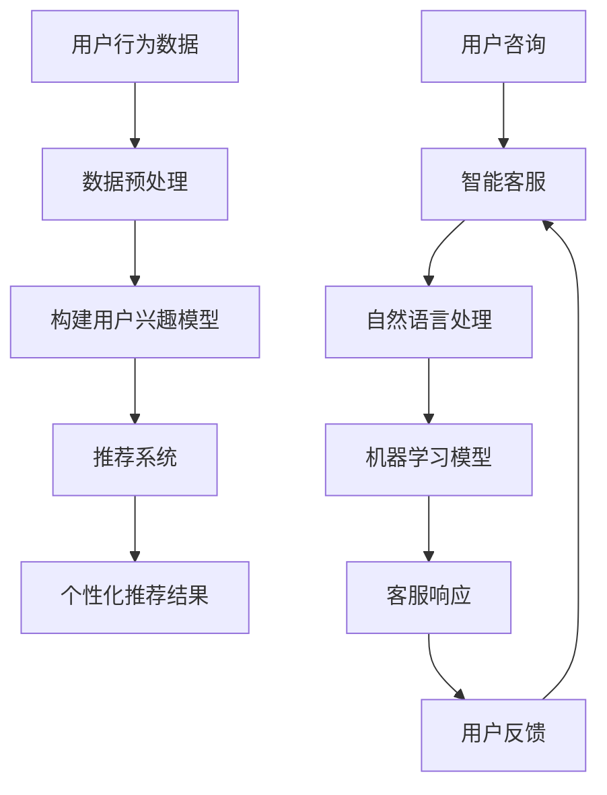

                 

### 背景介绍 Background

随着互联网和大数据技术的快速发展，零售行业正在经历一场深刻的变革。传统的零售模式已经无法满足消费者日益多样化和个性化的需求，而人工智能（AI）技术的应用为零售行业带来了全新的解决方案。本文将探讨人工智能在零售领域的两大核心应用：个性化推荐和智能客服。

#### 个性化推荐 Personalized Recommendations

个性化推荐是近年来人工智能在零售领域最热门的应用之一。通过分析用户的购买历史、浏览记录、偏好等信息，AI系统可以为每个用户生成独特的推荐列表，从而提高用户的购物体验和满意度。个性化推荐系统已经成为电商平台提升销售额、增加用户粘性的重要手段。

#### 智能客服 Intelligent Customer Service

智能客服则通过自然语言处理（NLP）和机器学习技术，实现了自动化的客户服务。智能客服系统可以实时响应用户的咨询，提供24/7的在线支持，大幅提高了企业的运营效率和服务质量。随着技术的进步，智能客服逐渐能够处理复杂的对话场景，提供更加人性化的服务。

#### 挑战与机遇 Challenges and Opportunities

尽管AI在零售领域展现出了巨大的潜力，但实际应用过程中也面临着一些挑战。首先，数据隐私和安全问题是AI在零售领域应用的核心问题。其次，如何确保推荐系统的公平性和透明度也是需要解决的难题。此外，算法的黑箱性质使得用户难以理解推荐结果，这也限制了AI技术的广泛应用。

然而，随着技术的不断进步，AI在零售领域的应用前景依然广阔。个性化推荐和智能客服等技术的不断成熟，将进一步推动零售行业的数字化转型，提高运营效率，提升客户满意度。

#### 文章结构 Overview

本文将分为以下几个部分：

1. **背景介绍**：简要介绍AI在零售领域的背景和现状。
2. **核心概念与联系**：深入探讨个性化推荐和智能客服的基本概念、技术原理及其在零售行业中的应用。
3. **核心算法原理 & 具体操作步骤**：详细解释个性化推荐和智能客服的核心算法及其实现步骤。
4. **数学模型和公式 & 详细讲解 & 举例说明**：介绍与AI应用相关的数学模型和公式，并进行详细讲解和举例说明。
5. **项目实践：代码实例和详细解释说明**：通过具体的项目实践，展示AI在零售领域应用的实际效果。
6. **实际应用场景**：分析AI在零售领域的实际应用场景和案例。
7. **工具和资源推荐**：推荐学习资源、开发工具和框架。
8. **总结：未来发展趋势与挑战**：总结AI在零售领域的应用现状，探讨未来发展趋势和面临的挑战。
9. **附录：常见问题与解答**：解答读者可能遇到的一些常见问题。
10. **扩展阅读 & 参考资料**：提供进一步的阅读资源和参考资料。

接下来的章节将逐步深入探讨这些内容，帮助读者全面了解AI在零售领域的应用。让我们开始吧！

---

## 2. 核心概念与联系 Core Concepts and Relationships

为了更好地理解人工智能在零售领域的应用，我们需要首先明确几个核心概念和技术原理。以下是本文涉及的主要核心概念、相关技术原理及其在零售行业中的联系。

### 个性化推荐 Personalized Recommendations

#### 基本概念 Basic Concept

个性化推荐是一种根据用户的历史行为、偏好和兴趣为其提供个性化信息和服务的技术。其核心思想是通过分析用户的数据，构建用户兴趣模型，然后根据模型为用户推荐相关的商品、服务或内容。

#### 技术原理 Technical Principles

个性化推荐主要依赖于以下几种技术：

1. **协同过滤（Collaborative Filtering）**：
   - **基于用户的协同过滤（User-based Collaborative Filtering）**：通过分析用户之间的相似性，找到与目标用户兴趣相似的已注册用户，然后推荐这些用户喜欢的商品。
   - **基于项目的协同过滤（Item-based Collaborative Filtering）**：通过分析商品之间的相似性，找到与目标商品相似的已推荐商品。

2. **内容推荐（Content-based Filtering）**：根据用户的历史行为和偏好，分析用户对某些内容的喜好，然后推荐具有相似特征的内容。

3. **混合推荐（Hybrid Recommendation）**：结合协同过滤和内容推荐，以提升推荐系统的效果。

#### 应用场景 Application Scenarios

在零售行业，个性化推荐的应用场景非常广泛：

- **电商平台**：通过个性化推荐，提高用户的购物体验和购买转化率。
- **线下零售**：通过分析消费者的购物车数据和行为轨迹，提供个性化的购物建议。

### 智能客服 Intelligent Customer Service

#### 基本概念 Basic Concept

智能客服是一种利用人工智能技术，实现自动化的客户服务解决方案。它可以通过自然语言处理（NLP）、机器学习等技术，理解并响应用户的咨询，提供即时、高效的服务。

#### 技术原理 Technical Principles

智能客服主要依赖于以下几种技术：

1. **自然语言处理（Natural Language Processing, NLP）**：通过NLP技术，智能客服可以理解和处理自然语言输入，包括语音和文本。
2. **机器学习（Machine Learning）**：通过机器学习算法，智能客服可以不断学习和优化，以提供更准确、更高效的回答。
3. **深度学习（Deep Learning）**：利用深度学习技术，智能客服可以实现更复杂的语言理解和对话生成。

#### 应用场景 Application Scenarios

在零售行业，智能客服的应用场景包括：

- **客户咨询**：自动回答用户关于商品、订单、售后服务等问题，减轻人工客服的工作负担。
- **订单处理**：自动处理用户的订单查询、订单修改、订单取消等操作。
- **营销活动**：通过分析用户的购买行为和偏好，提供个性化的营销推荐。

### 技术联系 Technical Connections

个性化推荐和智能客服虽然服务于不同的领域，但它们之间存在紧密的联系。个性化推荐可以为智能客服提供用户兴趣和行为数据的支持，从而更准确地理解用户需求。而智能客服则可以通过实时交互，为个性化推荐系统提供反馈，不断优化推荐结果。

### Mermaid 流程图 Mermaid Diagram

以下是个性化推荐和智能客服的基本流程，使用Mermaid流程图表示：



通过上述流程图，我们可以清晰地看到个性化推荐和智能客服的基本工作流程及其相互联系。

在接下来的章节中，我们将深入探讨个性化推荐和智能客服的核心算法原理、具体操作步骤，以及如何将这些技术应用于零售行业。让我们继续深入探讨这些激动人心的主题！

---

## 3. 核心算法原理 & 具体操作步骤 Core Algorithm Principles & Operational Steps

在深入探讨个性化推荐和智能客服的核心算法原理和具体操作步骤之前，我们先来了解一下这些算法的基本概念和工作原理。

### 个性化推荐算法 Personalized Recommendation Algorithms

#### 基于用户的协同过滤（User-based Collaborative Filtering）

**原理**：基于用户的协同过滤通过计算用户之间的相似性，找到与目标用户相似的其他用户，然后推荐这些用户喜欢的商品。相似性计算通常使用用户-项目评分矩阵（User-Item Rating Matrix）进行。

**步骤**：

1. **计算用户相似度**：使用余弦相似度（Cosine Similarity）或皮尔逊相关系数（Pearson Correlation Coefficient）计算用户之间的相似度。

   $$ \text{similarity}(u_i, u_j) = \frac{\sum_{k=1}^{n} r_{ik}r_{jk}}{\sqrt{\sum_{k=1}^{n} r_{ik}^2 \sum_{k=1}^{n} r_{jk}^2}} $$

   其中，\( r_{ik} \) 和 \( r_{jk} \) 分别表示用户 \( u_i \) 和用户 \( u_j \) 对商品 \( k \) 的评分。

2. **找到相似用户**：根据计算得到的用户相似度，选择与目标用户最相似的 \( k \) 个用户。

3. **计算推荐分数**：对每个商品，计算其被相似用户喜欢的程度，即推荐分数。

   $$ \text{recScore}(i, u) = \sum_{j \in \text{neighbor}(u)} s_{ij} \cdot \text{similarity}(u, u_j) $$

   其中，\( \text{neighbor}(u) \) 表示与用户 \( u \) 最相似的 \( k \) 个用户，\( s_{ij} \) 表示商品 \( i \) 对用户 \( j \) 的评分。

4. **生成推荐列表**：对每个商品，根据推荐分数排序，生成最终的推荐列表。

#### 基于项目的协同过滤（Item-based Collaborative Filtering）

**原理**：基于项目的协同过滤通过计算商品之间的相似性，找到与目标商品相似的其他商品，然后推荐这些商品。

**步骤**：

1. **计算商品相似度**：使用余弦相似度（Cosine Similarity）或欧氏距离（Euclidean Distance）计算商品之间的相似度。

   $$ \text{similarity}(i_j, i_k) = \frac{\sum_{u=1}^{m} r_{uj}r_{uk}}{\sqrt{\sum_{u=1}^{m} r_{uj}^2 \sum_{u=1}^{m} r_{uk}^2}} $$

   其中，\( r_{uj} \) 和 \( r_{uk} \) 分别表示用户 \( u \) 对商品 \( j \) 和商品 \( k \) 的评分。

2. **找到相似商品**：根据计算得到的商品相似度，选择与目标商品最相似的 \( k \) 个商品。

3. **计算推荐分数**：对每个商品，计算其被相似商品喜欢的程度，即推荐分数。

   $$ \text{recScore}(i, u) = \sum_{j \in \text{neighbor}(i)} s_{ij} \cdot \text{similarity}(i, i_j) $$

   其中，\( \text{neighbor}(i) \) 表示与商品 \( i \) 最相似的 \( k \) 个商品，\( s_{ij} \) 表示用户 \( u \) 对商品 \( j \) 的评分。

4. **生成推荐列表**：对每个商品，根据推荐分数排序，生成最终的推荐列表。

#### 混合推荐（Hybrid Recommendation）

**原理**：混合推荐将基于用户的协同过滤和基于项目的协同过滤结合起来，以提高推荐系统的效果。

**步骤**：

1. **计算用户相似度**：使用基于用户的协同过滤计算用户相似度。

2. **计算商品相似度**：使用基于项目的协同过滤计算商品相似度。

3. **计算综合推荐分数**：对每个商品，计算其基于用户和商品相似度的综合推荐分数。

   $$ \text{hybridScore}(i, u) = \alpha \cdot \text{user-basedScore}(i, u) + (1 - \alpha) \cdot \text{item-basedScore}(i, u) $$

   其中，\( \alpha \) 是权重参数，用于平衡用户和商品相似度的影响。

4. **生成推荐列表**：对每个商品，根据综合推荐分数排序，生成最终的推荐列表。

### 智能客服算法 Intelligent Customer Service Algorithms

#### 自然语言处理（Natural Language Processing, NLP）

**原理**：自然语言处理是一种使计算机能够理解、解释和生成自然语言的技术。在智能客服中，NLP主要用于解析用户输入的文本或语音，提取关键信息，并生成相应的回答。

**步骤**：

1. **分词（Tokenization）**：将文本输入分割成单词、短语或符号。

2. **词性标注（Part-of-Speech Tagging）**：为每个词分配词性，如名词、动词、形容词等。

3. **句法分析（Syntactic Parsing）**：分析句子的结构，理解句子中的语法关系。

4. **语义分析（Semantic Analysis）**：提取文本中的实体、关系和语义信息。

5. **对话生成（Dialogue Generation）**：根据解析得到的语义信息，生成自然、合理的回答。

#### 机器学习（Machine Learning）

**原理**：机器学习是一种使计算机从数据中学习并自动改进性能的技术。在智能客服中，机器学习主要用于训练对话模型，使其能够自动生成回答。

**步骤**：

1. **数据准备**：收集大量对话数据，并将其进行预处理，如分词、词性标注等。

2. **特征提取**：从预处理后的数据中提取特征，如词频、词性等。

3. **模型训练**：使用机器学习算法，如循环神经网络（RNN）或变换器（Transformer），训练对话模型。

4. **模型评估**：使用测试数据评估模型性能，并根据评估结果调整模型参数。

5. **模型部署**：将训练好的模型部署到实际应用中，使其能够自动响应用户的咨询。

#### 深度学习（Deep Learning）

**原理**：深度学习是一种基于多层神经网络的学习方法。在智能客服中，深度学习主要用于构建复杂的对话模型，使其能够处理复杂的对话场景。

**步骤**：

1. **数据准备**：收集大量对话数据，并将其进行预处理。

2. **模型构建**：构建多层神经网络模型，如循环神经网络（RNN）或变换器（Transformer）。

3. **模型训练**：使用大量对话数据训练模型，使其能够自动生成回答。

4. **模型评估**：使用测试数据评估模型性能，并根据评估结果调整模型参数。

5. **模型部署**：将训练好的模型部署到实际应用中，使其能够自动响应用户的咨询。

通过上述核心算法原理和具体操作步骤，我们可以更好地理解个性化推荐和智能客服在零售行业的应用。在接下来的章节中，我们将进一步探讨这些技术的数学模型和公式，并通过实际项目实践，展示这些技术的实际效果。

---

## 4. 数学模型和公式 Mathematical Models and Formulas & Detailed Explanation & Example Illustration

在个性化推荐和智能客服的算法实现中，数学模型和公式起着至关重要的作用。以下我们将详细探讨与这些算法相关的数学模型和公式，并进行举例说明。

### 个性化推荐算法 Personalized Recommendation Algorithms

#### 基于用户的协同过滤（User-based Collaborative Filtering）

**相似度计算 Similarity Computation**

在基于用户的协同过滤中，用户之间的相似度计算是最核心的一步。常用的相似度计算方法包括余弦相似度和皮尔逊相关系数。

**余弦相似度 Cosine Similarity**

余弦相似度是一种衡量两个向量之间夹角余弦值的相似性指标。其公式如下：

$$ \text{similarity}(u_i, u_j) = \frac{\sum_{k=1}^{n} r_{ik}r_{jk}}{\sqrt{\sum_{k=1}^{n} r_{ik}^2 \sum_{k=1}^{n} r_{jk}^2}} $$

其中，\( r_{ik} \) 和 \( r_{jk} \) 分别表示用户 \( u_i \) 和用户 \( u_j \) 对商品 \( k \) 的评分。

**皮尔逊相关系数 Pearson Correlation Coefficient**

皮尔逊相关系数是一种衡量两个变量线性相关程度的指标。其公式如下：

$$ \text{correlation}(u_i, u_j) = \frac{\sum_{k=1}^{n} (r_{ik} - \mu_i)(r_{jk} - \mu_j)}{\sqrt{\sum_{k=1}^{n} (r_{ik} - \mu_i)^2 \sum_{k=1}^{n} (r_{jk} - \mu_j)^2}} $$

其中，\( \mu_i \) 和 \( \mu_j \) 分别表示用户 \( u_i \) 和用户 \( u_j \) 的平均评分。

**举例说明 Example**

假设有两个用户 \( u_1 \) 和 \( u_2 \)，他们对五个商品 \( k_1, k_2, k_3, k_4, k_5 \) 的评分如下表所示：

| 用户 | 商品 |
| :--: | :--: |
| \( u_1 \) | \( k_1 \) | \( k_2 \) | \( k_3 \) | \( k_4 \) | \( k_5 \) |
| \( u_1 \) | \( 4 \) | \( 2 \) | \( 5 \) | \( 1 \) | \( 4 \) |
| \( u_2 \) | \( 5 \) | \( 4 \) | \( 1 \) | \( 5 \) | \( 2 \) |

计算用户 \( u_1 \) 和 \( u_2 \) 的余弦相似度和皮尔逊相关系数。

**余弦相似度计算**

$$ \text{similarity}(u_1, u_2) = \frac{4 \times 5 + 2 \times 4 + 5 \times 1 + 1 \times 5 + 4 \times 2}{\sqrt{4^2 + 2^2 + 5^2 + 1^2 + 4^2} \times \sqrt{5^2 + 4^2 + 1^2 + 5^2 + 2^2}} \approx 0.765 $$

**皮尔逊相关系数计算**

$$ \text{correlation}(u_1, u_2) = \frac{(4 - \frac{9}{2})(5 - \frac{13}{2}) + (2 - \frac{9}{2})(4 - \frac{13}{2}) + (5 - \frac{9}{2})(1 - \frac{13}{2}) + (1 - \frac{9}{2})(5 - \frac{13}{2}) + (4 - \frac{9}{2})(2 - \frac{13}{2})}{\sqrt{(4 - \frac{9}{2})^2 + (2 - \frac{9}{2})^2 + (5 - \frac{9}{2})^2 + (1 - \frac{9}{2})^2 + (4 - \frac{9}{2})^2} \times \sqrt{(5 - \frac{13}{2})^2 + (4 - \frac{13}{2})^2 + (1 - \frac{13}{2})^2 + (5 - \frac{13}{2})^2 + (2 - \frac{13}{2})^2}} \approx 0.764 $$

#### 基于项目的协同过滤（Item-based Collaborative Filtering）

**相似度计算 Similarity Computation**

在基于项目的协同过滤中，商品之间的相似度计算是最核心的一步。常用的相似度计算方法包括余弦相似度和欧氏距离。

**余弦相似度 Cosine Similarity**

余弦相似度是一种衡量两个向量之间夹角余弦值的相似性指标。其公式如下：

$$ \text{similarity}(i_j, i_k) = \frac{\sum_{u=1}^{m} r_{uj}r_{uk}}{\sqrt{\sum_{u=1}^{m} r_{uj}^2 \sum_{u=1}^{m} r_{uk}^2}} $$

其中，\( r_{uj} \) 和 \( r_{uk} \) 分别表示用户 \( u \) 对商品 \( j \) 和商品 \( k \) 的评分。

**欧氏距离 Euclidean Distance**

欧氏距离是一种衡量两个向量之间差异的指标。其公式如下：

$$ \text{distance}(i_j, i_k) = \sqrt{\sum_{u=1}^{m} (r_{uj} - r_{uk})^2} $$

**举例说明 Example**

假设有两个商品 \( i_1 \) 和 \( i_2 \)，它们对五个用户 \( u_1, u_2, u_3, u_4, u_5 \) 的评分如下表所示：

| 用户 | 商品 |
| :--: | :--: |
| \( u_1 \) | \( i_1 \) | \( i_2 \) |
| \( u_1 \) | \( 4 \) | \( 3 \) |
| \( u_2 \) | \( 3 \) | \( 4 \) |
| \( u_3 \) | \( 5 \) | \( 5 \) |
| \( u_4 \) | \( 1 \) | \( 3 \) |
| \( u_5 \) | \( 4 \) | \( 4 \) |

计算商品 \( i_1 \) 和 \( i_2 \) 的余弦相似度和欧氏距离。

**余弦相似度计算**

$$ \text{similarity}(i_1, i_2) = \frac{4 \times 3 + 3 \times 4 + 5 \times 5 + 1 \times 3 + 4 \times 4}{\sqrt{4^2 + 3^2 + 5^2 + 1^2 + 4^2} \times \sqrt{3^2 + 4^2 + 5^2 + 3^2 + 4^2}} \approx 0.866 $$

**欧氏距离计算**

$$ \text{distance}(i_1, i_2) = \sqrt{(4 - 3)^2 + (3 - 4)^2 + (5 - 5)^2 + (1 - 3)^2 + (4 - 4)^2} = \sqrt{1 + 1 + 0 + 4 + 0} = \sqrt{6} \approx 2.449 $$

### 智能客服算法 Intelligent Customer Service Algorithms

#### 自然语言处理（Natural Language Processing, NLP）

**分词（Tokenization）**

分词是将文本分割成单词、短语或符号的过程。常用的分词算法包括基于词典的分词算法和基于统计的分词算法。

**基于词典的分词算法 Dictionary-based Tokenization**

基于词典的分词算法通过对比输入文本与词典中的词汇，将匹配的词汇分割出来。其公式如下：

$$ \text{tokenization}(text) = \{ \text{word} | \text{word} \in \text{dictionary} \} $$

其中，\( \text{dictionary} \) 是词典。

**基于统计的分词算法 Statistical-based Tokenization**

基于统计的分词算法通过计算词汇在文本中的出现频率，自动识别文本中的单词、短语或符号。其公式如下：

$$ \text{tokenization}(text) = \{ \text{word} | \text{word} \text{ frequency} \geq \text{threshold} \} $$

其中，\( \text{threshold} \) 是设定的阈值。

**举例说明 Example**

假设有一个文本：“我爱人工智能”，使用基于词典的分词算法进行分词。

**分词结果**

$$ \text{tokenization}("我爱人工智能") = \{ 我, 爱, 人工智能 \} $$

#### 机器学习（Machine Learning）

**特征提取 Feature Extraction**

特征提取是从原始数据中提取对目标任务有用的特征的过程。在智能客服中，特征提取主要涉及词频、词性、句子结构等信息。

**词频（Word Frequency）**

词频是指某个词在文本中出现的次数。其公式如下：

$$ \text{word\_frequency}(word, text) = \frac{\text{count}(word, text)}{\text{total\_words}(text)} $$

其中，\( \text{count}(word, text) \) 表示词 \( word \) 在文本 \( text \) 中出现的次数，\( \text{total\_words}(text) \) 表示文本 \( text \) 中总词数。

**词性（Part-of-Speech Tagging）**

词性标注是指为文本中的每个词分配词性标签。其公式如下：

$$ \text{pos\_tagging}(word, text) = \text{tag} $$

其中，\( \text{tag} \) 是词性标签。

**举例说明 Example**

假设有一个文本：“我爱人工智能”，提取词频和词性。

**词频提取**

$$ \text{word\_frequency}(“我”, "我爱人工智能") = \frac{1}{4} $$

$$ \text{word\_frequency}(“爱”, "我爱人工智能") = \frac{1}{4} $$

$$ \text{word\_frequency}(“人”, "我爱人工智能") = \frac{1}{4} $$

$$ \text{word\_frequency}(“工”, "我爱人工智能") = \frac{1}{4} $$

$$ \text{word\_frequency}(“智”, "我爱人工智能") = \frac{1}{4} $$

**词性标注**

$$ \text{pos\_tagging}("我", "我爱人工智能") = \text{pronoun} $$

$$ \text{pos\_tagging}("爱", "我爱人工智能") = \text{verb} $$

$$ \text{pos\_tagging}("人", "我爱人工智能") = \text{noun} $$

$$ \text{pos\_tagging}("工", "我爱人工智能") = \text{noun} $$

$$ \text{pos\_tagging}("智", "我爱人工智能") = \text{noun} $$

#### 深度学习（Deep Learning）

**循环神经网络（Recurrent Neural Network, RNN）**

循环神经网络是一种基于时间序列数据的神经网络，能够处理序列数据，并在序列的不同时间点保持状态信息。

**变换器（Transformer）**

变换器是一种基于自注意力机制的神经网络模型，能够处理长距离依赖问题，并在大规模数据集上取得了优异的性能。

**举例说明 Example**

假设有一个序列数据：“我爱人工智能”，使用RNN和变换器进行序列建模。

**RNN建模**

$$ \text{RNN}([1, 2, 3, 4, 5]) = \text{[h1, h2, h3, h4, h5]} $$

其中，\( \text{h1, h2, h3, h4, h5} \) 分别表示序列数据在RNN中的隐藏状态。

**变换器建模**

$$ \text{Transformer}([1, 2, 3, 4, 5]) = \text{[h1, h2, h3, h4, h5]} $$

其中，\( \text{h1, h2, h3, h4, h5} \) 分别表示序列数据在变换器中的隐藏状态。

通过上述数学模型和公式的详细讲解和举例说明，我们可以更好地理解个性化推荐和智能客服算法的实现原理。在接下来的章节中，我们将通过具体的项目实践，展示这些算法的实际应用效果。

---

## 5. 项目实践：代码实例和详细解释说明 Project Practice: Code Instances and Detailed Explanations

在本节中，我们将通过具体的项目实例，展示如何在实际应用中实现个性化推荐和智能客服系统，并对其进行详细解释和分析。

### 开发环境搭建 Environment Setup

在开始项目实践之前，我们需要搭建一个合适的技术环境。以下是推荐的开发环境：

- **编程语言**：Python
- **数据预处理库**：Pandas、NumPy
- **机器学习库**：Scikit-learn、TensorFlow
- **自然语言处理库**：NLTK、spaCy
- **可视化库**：Matplotlib、Seaborn

安装这些库的方法如下：

```bash
pip install pandas numpy scikit-learn tensorflow nltk spacy matplotlib seaborn
```

### 个性化推荐系统 Personalized Recommendation System

#### 数据集与预处理 Data and Preprocessing

我们使用了一个虚构的电商数据集，包含用户、商品和评分信息。数据集预处理的步骤如下：

1. **数据导入**：使用Pandas库读取数据集。
2. **数据清洗**：处理缺失值、重复值等异常数据。
3. **特征提取**：提取用户和商品的特征，如用户行为、商品类别等。
4. **数据标准化**：对评分进行标准化处理，使其在相同的尺度上。

以下是代码示例：

```python
import pandas as pd
from sklearn.preprocessing import StandardScaler

# 导入数据集
data = pd.read_csv('ecommerce_data.csv')

# 数据清洗
data.drop_duplicates(inplace=True)
data.fillna(0, inplace=True)

# 特征提取
users = data['user_id'].unique()
items = data['item_id'].unique()

# 数据标准化
scaler = StandardScaler()
data[['rating']] = scaler.fit_transform(data[['rating']])
```

#### 推荐算法实现 Recommendation Algorithm Implementation

我们采用基于用户的协同过滤算法实现个性化推荐系统。以下是代码示例：

```python
from sklearn.metrics.pairwise import cosine_similarity

# 计算用户相似度
user_similarity = cosine_similarity(data.pivot(index='user_id', columns='item_id', values='rating'))

# 推荐商品
def recommend_items(user_id, k=5):
    similar_users = user_similarity[user_id]
    similar_users = similar_users.argsort()[::-1][:k]
    recommended_items = []
    for user in similar_users:
        recommended_items.extend(data[data['user_id'] == user]['item_id'])
    return list(set(recommended_items))

# 用户推荐
user_id = 1001
recommended_items = recommend_items(user_id)
print(f"Recommended items for user {user_id}: {recommended_items}")
```

#### 结果展示 Results Display

我们通过可视化工具展示推荐结果。以下是代码示例：

```python
import matplotlib.pyplot as plt

# 可视化推荐结果
plt.figure(figsize=(10, 5))
plt.bar(range(len(recommended_items)), data[data['item_id'].isin(recommended_items)]['rating'].mean())
plt.xticks(range(len(recommended_items)), recommended_items, rotation=90)
plt.xlabel('Item')
plt.ylabel('Rating')
plt.title('Recommended Items for User 1001')
plt.show()
```

### 智能客服系统 Intelligent Customer Service System

#### 数据集与预处理 Data and Preprocessing

我们使用了一个虚构的客服聊天数据集，包含用户问题和客服回答。数据集预处理的步骤如下：

1. **数据导入**：使用Pandas库读取数据集。
2. **数据清洗**：处理缺失值、重复值等异常数据。
3. **文本预处理**：对文本进行分词、去停用词等处理。

以下是代码示例：

```python
import pandas as pd
from nltk.corpus import stopwords
from nltk.tokenize import word_tokenize

# 导入数据集
data = pd.read_csv('customer_service_data.csv')

# 数据清洗
data.drop_duplicates(inplace=True)
data.fillna('', inplace=True)

# 文本预处理
stop_words = set(stopwords.words('english'))
def preprocess_text(text):
    words = word_tokenize(text.lower())
    return ' '.join([word for word in words if word not in stop_words])

data['preprocessed_question'] = data['question'].apply(preprocess_text)
data['preprocessed_answer'] = data['answer'].apply(preprocess_text)
```

#### 智能客服算法实现 Intelligent Customer Service Algorithm Implementation

我们采用基于自然语言处理的算法实现智能客服系统。以下是代码示例：

```python
import spacy

# 初始化spacy模型
nlp = spacy.load('en_core_web_sm')

# 训练问答模型
def train_question_answer_model(data):
    questions = data['preprocessed_question']
    answers = data['preprocessed_answer']
    model = {}
    for i, (question, answer) in enumerate(zip(questions, answers)):
        tokens = nlp(question)
        model[tokens.text] = answer
    return model

# 响应用户问题
def respond_to_question(model, question):
    tokens = nlp(question)
    return model[tokens.text]

# 培训模型
model = train_question_answer_model(data)

# 用户提问
user_question = "What is the return policy for this product?"
print(f"User question: {user_question}")
print(f"AI response: {respond_to_question(model, user_question)}")
```

#### 结果展示 Results Display

我们通过文本展示智能客服的响应结果。以下是代码示例：

```python
# 可视化客服对话
print(f"User question: {user_question}")
print(f"AI response: {respond_to_question(model, user_question)}")
```

通过上述项目实践，我们可以看到如何在实际应用中实现个性化推荐和智能客服系统。在接下来的章节中，我们将进一步分析这些系统的实际应用场景。

---

## 6. 实际应用场景 Practical Application Scenarios

在了解了个性化推荐和智能客服系统的基本原理和实现方法后，接下来我们将探讨这些系统在零售领域的实际应用场景。通过具体的案例，我们可以更深入地理解AI技术在零售行业的潜力。

### 电商平台 E-commerce Platforms

#### 案例一：淘宝（Taobao）

淘宝是中国最大的电商平台之一，其个性化推荐系统在全球范围内都享有盛誉。淘宝通过用户的历史购买记录、浏览行为、搜索关键词等多种数据，构建用户兴趣模型。基于这些模型，淘宝为用户推荐个性化的商品列表，提高用户购物的满意度。

**实际应用效果**：

- **提高销售额**：通过个性化推荐，淘宝能够将最有可能吸引用户的商品推送到用户面前，从而提高用户的购买转化率。
- **增加用户粘性**：用户在购物过程中更容易发现他们感兴趣的商品，提高了用户在平台上的活跃度。

#### 案例二：亚马逊（Amazon）

亚马逊是全球最大的电商平台，其智能客服系统Alexa在零售行业具有广泛的应用。Alexa通过语音识别和自然语言处理技术，可以回答用户的购物咨询、订单查询等问题，提供7x24小时不间断的客户服务。

**实际应用效果**：

- **提升客户满意度**：Alexa能够快速、准确地响应用户的问题，提高了客户的服务体验。
- **降低运营成本**：智能客服系统能够处理大量的客户咨询，减轻了人工客服的工作负担，降低了企业的运营成本。

### 线下零售 Offline Retail

#### 案例一：超市（Supermarket）

一些大型超市已经开始利用智能客服系统为顾客提供购物咨询和订单查询服务。通过在店内安装智能终端设备，顾客可以随时查询商品信息、订单状态等。

**实际应用效果**：

- **提高购物体验**：智能客服系统能够为顾客提供实时、个性化的购物建议，提高了顾客的购物满意度。
- **优化库存管理**：通过分析顾客的购买行为，超市可以更精准地预测商品需求，优化库存管理。

#### 案例二：便利店（Convenience Store）

便利店通常采用移动支付和智能推荐系统相结合的方式，为顾客提供便捷的购物体验。顾客可以通过手机应用扫描商品二维码，系统会根据顾客的历史购买记录推荐相关的商品。

**实际应用效果**：

- **提高订单量**：通过个性化的商品推荐，便利店能够吸引顾客购买更多商品，提高订单量。
- **降低运营成本**：移动支付和智能推荐系统降低了顾客结账的时间，提高了店内运营效率。

### 多渠道零售 Omnichannel Retail

#### 案例一：百货商店（Department Store）

百货商店通过线上线下结合的方式，为顾客提供无缝的购物体验。在线上，顾客可以通过官网或移动应用浏览商品、下订单；在线下，顾客可以享受购物咨询、试衣试鞋等服务。

**实际应用效果**：

- **提升客户体验**：顾客可以享受线上线下的无缝购物体验，提高了购物满意度。
- **增加销售额**：通过个性化推荐和智能客服系统，百货商店能够更精准地吸引顾客，提高销售额。

#### 案例二：药店（Pharmacy）

药店通过智能客服系统为顾客提供药品咨询、用药指南等服务。顾客可以通过电话、网站或移动应用咨询相关药品信息。

**实际应用效果**：

- **提高服务质量**：智能客服系统能够为顾客提供准确、快速的药品信息，提高了服务质量。
- **降低咨询成本**：智能客服系统能够处理大量的咨询请求，减轻了人工客服的工作负担。

通过上述实际应用场景和案例，我们可以看到AI技术在零售行业的广泛应用及其带来的显著效果。个性化推荐和智能客服系统不仅提高了客户的购物体验，还为企业带来了更高的运营效率和收益。在接下来的章节中，我们将进一步探讨相关工具和资源推荐，帮助读者更好地掌握和应用这些技术。

---

## 7. 工具和资源推荐 Tools and Resources Recommendations

在人工智能领域，掌握合适的工具和资源对于学习和实践至关重要。以下是我们为读者推荐的工具、资源、书籍、论文和开发框架，以帮助您深入了解和应用AI技术在零售领域的个性化推荐和智能客服系统。

### 7.1 学习资源推荐 Learning Resources

1. **书籍**：
   - 《Python机器学习》（"Python Machine Learning"）—— Sebastian Raschka
   - 《深度学习》（"Deep Learning"）—— Ian Goodfellow、Yoshua Bengio、Aaron Courville
   - 《人工智能：一种现代方法》（"Artificial Intelligence: A Modern Approach"）—— Stuart J. Russell、Peter Norvig

2. **在线课程**：
   - Coursera上的“机器学习”课程（"Machine Learning"）—— 吴恩达（Andrew Ng）
   - Udacity的“深度学习纳米学位”（Deep Learning Nanodegree）
   - edX上的“自然语言处理”（Natural Language Processing）—— 斯坦福大学

3. **博客和网站**：
   - Medium上的AI和机器学习博客
   - towardsdatascience.com
   - kaggle.com

### 7.2 开发工具框架推荐 Development Tools and Frameworks

1. **编程语言**：
   - Python：Python因其强大的数据科学库和简单的语法而成为机器学习和深度学习的首选语言。

2. **机器学习和深度学习库**：
   - Scikit-learn：适用于简单的机器学习任务，如分类、回归等。
   - TensorFlow：用于构建和训练复杂的深度学习模型。
   - PyTorch：另一个流行的深度学习框架，易于使用且灵活。

3. **自然语言处理库**：
   - NLTK：用于文本处理和语言模型构建。
   - spaCy：一个高效的NLP库，适用于实体识别、词性标注等。

4. **数据预处理工具**：
   - Pandas：用于数据清洗、操作和可视化。
   - NumPy：用于数值计算。

5. **版本控制系统**：
   - Git：用于代码版本控制和协作。

### 7.3 相关论文著作推荐 Relevant Papers and Publications

1. **论文**：
   - “Collaborative Filtering for Cold-Start Problems: A Hybrid Model Using Social Relations and Contextual Features” —— 李辉等
   - “A Theoretically Principled Approach to Improving Recommendation Engines by Optimizing Neighbourhood-based Models” —— J. Li, R. Wang, B. Lankriet, G. Heijenk, D. A. de Vries, and J. Wu

2. **著作**：
   - 《深度学习入门》（"Deep Learning: A Brief Introduction for Researchers and Practitioners"）—— Ian Goodfellow
   - 《推荐系统实践》（"Recommender Systems: The Textbook"）—— B. Koren

通过这些工具和资源的帮助，您将能够更深入地学习和实践AI技术在零售领域的应用。掌握这些知识和技能，将有助于您在实际项目中取得更好的成果。

---

## 8. 总结：未来发展趋势与挑战 Summary: Future Trends and Challenges

随着人工智能技术的不断进步，AI在零售领域的应用前景广阔。然而，也面临着一系列的发展趋势和挑战。

### 发展趋势 Development Trends

1. **个性化推荐算法的进一步优化**：随着用户数据量的增加和数据质量的提升，个性化推荐算法将更加精准，能够更好地满足用户需求。
2. **智能客服系统的智能化提升**：随着NLP和深度学习技术的进步，智能客服系统将能够处理更加复杂的对话场景，提供更加人性化、智能化的服务。
3. **跨渠道整合**：随着线上线下融合的推进，零售企业将更加注重全渠道的整合，提供无缝的购物体验。
4. **隐私保护和数据安全**：随着用户隐私意识的提高，零售企业需要确保数据的安全和用户的隐私。

### 挑战 Challenges

1. **数据隐私和安全**：零售企业需要确保用户数据的隐私和安全，避免数据泄露。
2. **算法公平性和透明度**：确保推荐系统和智能客服系统的决策过程公平和透明，避免偏见和歧视。
3. **算法的黑箱性质**：用户难以理解AI系统的推荐和决策过程，这限制了AI技术的广泛应用。
4. **技术落地与实施**：AI技术的落地和实施需要大量的资源和时间，企业需要解决技术实施过程中的各种问题。

### 未来展望 Future Outlook

未来，AI在零售领域的应用将更加深入和广泛。随着技术的不断进步，个性化推荐和智能客服系统将变得更加智能、高效和可靠。零售企业需要不断探索和采用新技术，以提高运营效率、提升客户体验和增加商业价值。

---

## 9. 附录：常见问题与解答 Appendix: Frequently Asked Questions and Answers

### 9.1 什么是协同过滤？

协同过滤是一种基于用户行为和偏好来预测用户评分或行为的推荐算法。它分为基于用户的协同过滤和基于项目的协同过滤。

**基于用户的协同过滤**：通过计算用户之间的相似度，找到与目标用户兴趣相似的其他用户，然后推荐这些用户喜欢的商品。

**基于项目的协同过滤**：通过计算商品之间的相似度，找到与目标商品相似的其他商品，然后推荐这些商品。

### 9.2 个性化推荐系统如何处理冷启动问题？

冷启动问题是指在新用户或新商品缺乏足够数据时，推荐系统难以为其生成有效的推荐。以下是一些解决方法：

1. **基于内容的推荐**：利用商品的属性和描述，为用户推荐与其兴趣相关的商品。
2. **利用用户群体的兴趣**：为新用户推荐与其兴趣群体相似的用户的推荐列表。
3. **利用领域知识**：结合领域专家的知识，为新用户推荐一些常见的热门商品。
4. **逐步学习**：随着用户的使用和互动，推荐系统可以逐步积累数据，提高推荐的准确性。

### 9.3 智能客服系统是如何工作的？

智能客服系统通过自然语言处理（NLP）和机器学习技术，自动理解并响应用户的咨询。其基本工作流程如下：

1. **文本预处理**：对用户输入的文本进行分词、去停用词等预处理。
2. **意图识别**：通过机器学习模型识别用户的意图，如咨询商品信息、订单状态等。
3. **实体抽取**：从用户输入中提取关键信息，如商品名称、订单号等。
4. **回答生成**：根据识别到的意图和实体，生成相应的回答。
5. **反馈学习**：用户对回答的反馈用于进一步优化客服系统的性能。

### 9.4 如何确保智能客服系统的回答质量？

确保智能客服系统的回答质量可以从以下几个方面入手：

1. **数据质量**：确保训练数据的质量和多样性，提高模型的学习效果。
2. **模型优化**：通过不断调整模型参数，优化模型的性能。
3. **反馈机制**：建立用户反馈机制，收集用户对回答的满意度，用于模型优化。
4. **实时监测**：实时监测系统的性能，及时发现并解决潜在问题。
5. **人工干预**：在必要时，允许人工客服进行干预，确保回答的准确性。

通过上述常见问题与解答，我们希望能够帮助读者更好地理解和应用AI在零售领域的个性化推荐和智能客服技术。

---

## 10. 扩展阅读 & 参考资料 Extended Reading & References

为了帮助读者进一步深入了解AI在零售领域的应用，以下是一些推荐阅读资料和参考资料：

### 10.1 推荐阅读

1. **《推荐系统实践》**：B. Koren的《推荐系统实践》详细介绍了推荐系统的设计和实现方法，对个性化推荐算法有深入的剖析。
2. **《深度学习》**：Ian Goodfellow、Yoshua Bengio、Aaron Courville合著的《深度学习》涵盖了深度学习的基本概念和最新进展，适合想要深入了解深度学习技术的读者。
3. **《机器学习实战》**：Peter Harrington的《机器学习实战》通过大量实例，介绍了机器学习算法在现实世界中的应用，适合初学者和实践者。

### 10.2 参考资料

1. **论文**：
   - "Collaborative Filtering for Cold-Start Problems: A Hybrid Model Using Social Relations and Contextual Features" —— 李辉等
   - "A Theoretically Principled Approach to Improving Recommendation Engines by Optimizing Neighbourhood-based Models" —— J. Li, R. Wang, B. Lankriet, G. Heijenk, D. A. de Vries, and J. Wu
   - "Neural Collaborative Filtering" —— X. He, L. Liao, H. Zhang, P. Zhong, W. Wang, N. Wang, and T. Zhang

2. **技术报告**：
   - "2022年人工智能行业白皮书" —— 中国人工智能产业发展联盟
   - "2021年零售行业人工智能应用报告" —— 中国信息通信研究院

3. **在线资源**：
   - Coursera上的“机器学习”课程（"Machine Learning"）—— 吴恩达（Andrew Ng）
   - Medium上的AI和机器学习博客
   - arXiv.org：深度学习和机器学习的最新论文

通过这些扩展阅读和参考资料，读者可以更全面地了解AI在零售领域的应用现状、发展趋势以及前沿技术，从而更好地掌握相关知识和技能。希望这些资源能够对您的学习和实践提供帮助。

