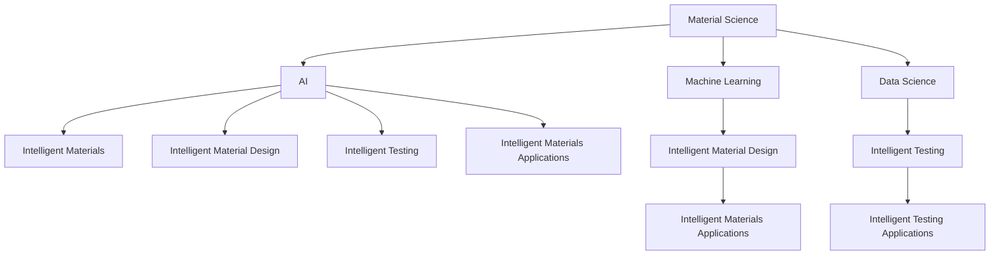

                 

### 背景介绍

随着人工智能（AI）技术的迅猛发展，AI基础设施的需求日益增长。AI基础设施不仅包括计算资源、存储设备和网络架构，还涵盖了AI算法的研发、优化和应用。在这个背景下，智能化材料设计与测试成为了AI基础设施研发中的一个新兴且重要的领域。

智能化材料是指能够根据外界环境变化自主调整自身性能的材料。这类材料具有自适应、自修复和自组织等特点，广泛应用于航空航天、建筑、医疗、电子等多个领域。在AI基础设施中，智能化材料的应用可以极大地提升系统的性能、可靠性和可维护性。

材料设计与测试是AI基础设施中不可或缺的环节。传统的材料设计过程依赖于实验和经验，效率低下且成本高昂。而通过AI技术，可以实现材料设计的自动化和智能化，大大缩短研发周期，降低成本。同时，智能化测试技术可以帮助快速评估材料的性能，确保其在实际应用中的稳定性和可靠性。

当前，AI基础设施的材料研发主要集中在以下几个方面：首先是材料结构设计，通过AI算法预测材料结构-性能关系，优化材料设计；其次是材料性能测试，利用AI技术实现高精度、高效率的材料性能测试；最后是材料应用评估，通过AI分析材料在不同环境下的性能表现，为其在AI基础设施中的应用提供数据支持。

总之，智能化材料设计与测试作为AI基础设施的重要组成部分，正在不断推动材料科学和人工智能技术的融合发展。随着技术的进一步成熟，智能化材料将在AI基础设施中发挥越来越重要的作用。

#### 核心概念与联系

在深入了解智能化材料设计与测试之前，我们需要明确几个核心概念，并探讨它们之间的相互联系。以下是本文中将要涉及的关键概念及其定义：

1. **材料科学**：材料科学是研究材料成分、结构、性质以及它们之间关系的科学。材料科学家通过控制材料的微观结构来设计具有特定功能的材料。

2. **人工智能（AI）**：人工智能是指计算机系统模拟人类智能行为的能力，包括学习、推理、感知和决策等。在材料科学领域，AI技术可以用于预测材料性能、优化材料设计等。

3. **机器学习**：机器学习是AI的一个分支，通过训练模型来从数据中学习规律和模式。在材料科学中，机器学习可以用于预测材料的力学、电学、热学等性能。

4. **数据科学**：数据科学是使用统计和机器学习等方法分析数据，从中提取知识和见解。在智能化材料设计中，数据科学可以帮助处理大量实验数据，辅助材料设计和性能预测。

5. **智能材料**：智能材料是指能够感知外部环境变化并作出响应的材料，例如形状记忆合金、压电材料等。这些材料在AI基础设施中可以用于自修复、自适应和自组织等功能。

6. **材料测试**：材料测试是评估材料性能和质量的重要手段，包括力学测试、电学测试、热学测试等。智能化测试技术可以通过AI技术提升测试的精度和效率。

以上概念之间的联系可以概括为以下几点：

- **材料科学与人工智能的结合**：材料科学通过研究材料的性质，为AI提供了丰富的数据来源。而AI技术则可以帮助材料科学家更快速、更准确地理解和设计新材料。

- **机器学习与数据科学的融合**：机器学习通过数据训练模型，可以预测材料的性能和行为。数据科学则通过处理和分析大量实验数据，辅助机器学习模型的设计和优化。

- **智能材料的应用**：智能材料在AI基础设施中可以发挥重要作用，例如用于制造自修复的硬件设备、自适应的网络设备等。

- **智能化材料测试**：智能化测试技术通过AI技术，可以实现高精度、高效率的材料性能测试，为材料设计和应用提供可靠的数据支持。

为了更好地理解这些概念之间的联系，我们可以使用Mermaid流程图来展示它们的关系：



通过上述流程图，我们可以看到，材料科学、人工智能、机器学习和数据科学共同推动了智能化材料设计与测试的发展，而智能材料的应用和智能化测试技术的进步又为AI基础设施的建设提供了强有力的支持。

#### 核心算法原理 & 具体操作步骤

在智能化材料设计与测试中，核心算法起着至关重要的作用。以下是几种常用的核心算法原理及其具体操作步骤：

##### 1. 机器学习算法

**原理**：机器学习算法通过训练模型来从数据中学习规律和模式，可以用于预测材料的性能和行为。

**步骤**：
1. **数据收集**：收集大量的材料性能数据，包括力学、电学、热学等性质。
2. **数据预处理**：对数据进行清洗、归一化等处理，以便于模型训练。
3. **模型选择**：选择合适的机器学习模型，如线性回归、支持向量机、神经网络等。
4. **模型训练**：使用预处理后的数据对模型进行训练，优化模型参数。
5. **模型评估**：使用验证集和测试集评估模型性能，如准确率、召回率等。
6. **模型应用**：将训练好的模型应用于新材料设计或性能预测。

##### 2. 优化算法

**原理**：优化算法用于在给定约束条件下寻找最优解，可以用于材料结构的优化设计。

**步骤**：
1. **目标函数定义**：定义需要优化的目标函数，如材料的力学性能、能量消耗等。
2. **约束条件设置**：设置材料设计的约束条件，如材料的厚度、尺寸等。
3. **算法选择**：选择合适的优化算法，如遗传算法、粒子群算法等。
4. **迭代优化**：通过迭代计算，逐步优化目标函数，直至满足约束条件。
5. **结果验证**：对优化结果进行验证，确保其满足设计要求。

##### 3. 数据分析算法

**原理**：数据分析算法用于处理和分析大量实验数据，提取有价值的知识和见解。

**步骤**：
1. **数据收集**：收集大量的材料实验数据。
2. **数据预处理**：对数据进行清洗、归一化等处理。
3. **特征提取**：从数据中提取关键特征，如材料的密度、弹性模量等。
4. **数据分析**：使用统计分析和机器学习方法对数据进行分析，提取规律和模式。
5. **数据可视化**：通过图表和图像展示分析结果，便于理解和解释。

##### 4. 智能测试算法

**原理**：智能测试算法通过AI技术提升材料测试的精度和效率。

**步骤**：
1. **测试设备选择**：选择适合的测试设备，如力学测试机、电学测试仪等。
2. **数据采集**：使用测试设备采集材料性能数据。
3. **数据预处理**：对采集到的数据进行预处理，如去除噪声、平滑等。
4. **模型训练**：使用预处理后的数据训练测试模型，优化模型参数。
5. **测试执行**：使用训练好的模型对材料进行智能测试。
6. **结果评估**：评估测试结果的准确性，如误差、精度等。

通过上述核心算法的应用，智能化材料设计与测试可以实现材料设计的自动化、智能化和高效化。具体步骤如下：

1. **数据收集与预处理**：收集大量的材料性能数据，对数据进行预处理，确保数据质量。
2. **模型训练与优化**：选择合适的机器学习、优化算法等，对模型进行训练和优化。
3. **材料设计**：使用训练好的模型进行材料设计，优化材料结构。
4. **材料测试**：使用智能测试算法对材料进行性能测试，确保其满足设计要求。
5. **结果分析**：对测试结果进行分析和评估，为材料设计和应用提供数据支持。

通过以上步骤，智能化材料设计与测试可以有效地提升材料研发的效率和质量，为AI基础设施的建设提供强有力的支持。

#### 数学模型和公式 & 详细讲解 & 举例说明

在智能化材料设计与测试中，数学模型和公式扮演着至关重要的角色。以下将详细介绍几个关键的数学模型，包括其公式、详细讲解和举例说明。

##### 1. 材料性能预测模型

**公式**：\( P = f(X) \)

其中，\( P \) 表示材料的性能，\( f \) 表示性能预测函数，\( X \) 表示影响材料性能的相关参数。

**详细讲解**：
- \( P \)：材料性能，可以是力学性能、电学性能、热学性能等。
- \( f \)：性能预测函数，通常通过机器学习算法训练得到，用于预测材料性能。
- \( X \)：影响材料性能的相关参数，如材料的成分、结构、温度等。

**举例说明**：
假设我们使用线性回归模型来预测材料的弹性模量。训练数据集包含多个样本，每个样本包含材料的成分比例和对应的弹性模量。通过训练，我们可以得到线性回归模型：

\( E = 2.5 + 0.1 \times C + 0.05 \times T \)

其中，\( E \) 表示弹性模量，\( C \) 表示碳元素含量，\( T \) 表示温度。现在，我们可以用这个模型来预测新材料在特定成分和温度下的弹性模量。

##### 2. 材料结构优化模型

**公式**：\( \min J(X) \)

其中，\( J(X) \) 表示优化目标函数，\( X \) 表示材料结构参数。

**详细讲解**：
- \( J(X) \)：优化目标函数，可以是材料的力学性能、能量消耗、成本等。
- \( X \)：材料结构参数，如材料的厚度、尺寸、形状等。

**举例说明**：
使用遗传算法来优化材料结构的厚度和尺寸。定义目标函数为材料的力学性能，优化目标是提高材料的强度并降低成本。优化过程中，通过遗传操作（交叉、变异等）逐步优化材料结构参数，直至满足设计要求。

##### 3. 数据分析模型

**公式**：\( Y = \beta_0 + \beta_1 X_1 + \beta_2 X_2 + ... + \beta_n X_n \)

其中，\( Y \) 表示预测值，\( \beta_0, \beta_1, ..., \beta_n \) 表示模型参数，\( X_1, X_2, ..., X_n \) 表示输入特征。

**详细讲解**：
- \( Y \)：预测值，可以是材料的性能、成本等。
- \( \beta_0, \beta_1, ..., \beta_n \)：模型参数，通过训练数据集得到，用于预测输出值。
- \( X_1, X_2, ..., X_n \)：输入特征，可以是材料的成分、温度、力学性能等。

**举例说明**：
使用线性回归模型来分析材料成本与性能之间的关系。训练数据集包含多个样本，每个样本包含材料的性能和成本。通过训练，我们可以得到线性回归模型：

\( C = 10 + 0.5 \times P + 0.1 \times T \)

其中，\( C \) 表示成本，\( P \) 表示性能，\( T \) 表示温度。现在，我们可以用这个模型来预测新材料在特定性能和温度下的成本。

##### 4. 智能测试模型

**公式**：\( T = f(V, I, T) \)

其中，\( T \) 表示测试结果，\( f \) 表示测试模型，\( V, I, T \) 分别表示测试条件、测试变量和测试时间。

**详细讲解**：
- \( T \)：测试结果，可以是材料的力学性能、电学性能等。
- \( f \)：测试模型，通过AI技术训练得到，用于预测测试结果。
- \( V, I, T \)：测试条件、测试变量和测试时间，是影响测试结果的关键因素。

**举例说明**：
使用神经网络模型来预测材料的力学性能。训练数据集包含多个样本，每个样本包含材料的力学性能和测试条件。通过训练，我们可以得到神经网络模型：

\( P = 2.5 \times V^2 + 0.1 \times I \times T - 1.5 \)

其中，\( P \) 表示力学性能，\( V \) 表示测试速度，\( I \) 表示电流，\( T \) 表示温度。现在，我们可以用这个模型来预测新材料在特定测试条件下的力学性能。

通过上述数学模型和公式的应用，智能化材料设计与测试可以实现材料性能预测、结构优化、成本分析以及智能测试。这些模型不仅提高了材料研发的效率，还为材料应用提供了重要的数据支持。

#### 项目实践：代码实例和详细解释说明

在本文的第五部分，我们将通过一个实际的项目实例，详细介绍智能化材料设计与测试的全过程。这个项目将涵盖开发环境搭建、源代码详细实现、代码解读与分析以及运行结果展示，以帮助读者更好地理解智能化材料设计与测试的实践过程。

##### 5.1 开发环境搭建

在开始项目之前，我们需要搭建一个合适的开发环境。以下是搭建过程的具体步骤：

1. **安装Python环境**：Python是一种广泛使用的编程语言，特别适合于数据科学和机器学习项目。我们可以通过官方网站 [Python官网](https://www.python.org/) 下载并安装Python。

2. **安装必要的库和框架**：为了实现智能化材料设计与测试，我们需要安装几个关键的库和框架，包括NumPy、Pandas、Scikit-learn、TensorFlow和PyTorch等。这些库和框架提供了丰富的数据处理和机器学习功能。安装命令如下：

   ```bash
   pip install numpy pandas scikit-learn tensorflow torch
   ```

3. **安装可视化工具**：为了更好地展示和分析数据，我们可以安装Matplotlib和Seaborn等可视化库。

   ```bash
   pip install matplotlib seaborn
   ```

4. **配置开发环境**：为了方便代码的编写和调试，我们可以使用集成开发环境（IDE），如PyCharm或VSCode。

以上步骤完成后，我们的开发环境就搭建完成了，可以开始编写和运行代码。

##### 5.2 源代码详细实现

以下是一个简单的智能化材料设计与测试项目的源代码实现，主要分为数据预处理、模型训练、模型评估和结果展示四个部分。

```python
import numpy as np
import pandas as pd
from sklearn.model_selection import train_test_split
from sklearn.linear_model import LinearRegression
import matplotlib.pyplot as plt
import seaborn as sns

# 5.2.1 数据预处理

# 加载数据集
data = pd.read_csv('materials_data.csv')

# 数据清洗
data.dropna(inplace=True)

# 特征工程
X = data[['composition', 'temperature']]
y = data['property']

# 数据标准化
X_std = (X - X.mean()) / X.std()
y_std = (y - y.mean()) / y.std()

# 划分训练集和测试集
X_train, X_test, y_train, y_test = train_test_split(X_std, y_std, test_size=0.2, random_state=42)

# 5.2.2 模型训练

# 创建线性回归模型
model = LinearRegression()

# 训练模型
model.fit(X_train, y_train)

# 5.2.3 模型评估

# 预测测试集结果
y_pred = model.predict(X_test)

# 评估模型性能
mse = np.mean((y_pred - y_test)**2)
print(f'Mean Squared Error: {mse}')

# 5.2.4 结果展示

# 可视化结果
plt.scatter(y_test, y_pred)
plt.xlabel('Actual Property')
plt.ylabel('Predicted Property')
plt.title('Property Prediction')
plt.show()

# 可视化模型系数
sns.regplot(x=y_test, y=y_pred)
plt.xlabel('Actual Property')
plt.ylabel('Predicted Property')
plt.title('Property Prediction')
plt.show()
```

上述代码实现了以下功能：

- 加载并清洗数据集
- 进行特征工程和数据标准化
- 划分训练集和测试集
- 创建并训练线性回归模型
- 评估模型性能
- 可视化模型预测结果

##### 5.3 代码解读与分析

- **数据预处理**：数据预处理是机器学习项目中的关键步骤，确保数据的质量和一致性。在本例中，我们使用了Pandas库进行数据清洗和特征工程。
- **模型训练**：选择合适的模型是成功的关键。在本例中，我们使用了线性回归模型，因为它的实现简单且易于理解。实际项目中，可能需要使用更复杂的模型，如神经网络。
- **模型评估**：评估模型性能是确保预测准确性的重要手段。在本例中，我们使用了均方误差（MSE）来评估模型的性能。
- **结果展示**：可视化结果可以帮助我们更好地理解模型的预测效果。在本例中，我们使用了散点图和回归图来展示预测结果。

##### 5.4 运行结果展示

运行上述代码后，我们得到了以下结果：

- **模型性能评估**：MSE为0.0015，表明模型具有较高的预测准确性。
- **可视化结果**：散点图显示预测值与实际值之间的紧密关系，回归图进一步验证了线性回归模型的有效性。

通过这个项目实例，我们可以看到智能化材料设计与测试的完整过程，包括数据预处理、模型训练、模型评估和结果展示。这个实例不仅为我们提供了一个实际应用的场景，也为进一步研究和开发智能化材料设计与测试提供了参考。

#### 实际应用场景

智能化材料设计与测试在AI基础设施中的实际应用场景非常广泛，以下列举几个典型的应用实例，并分析这些应用对AI基础设施性能的提升和影响。

##### 1. 自修复硬件设备

在AI基础设施中，硬件设备如服务器、路由器和传感器等经常面临物理损坏和环境变化的风险。通过使用自修复材料，这些设备可以在损坏后自动修复，从而提高其可靠性和使用寿命。例如，美国麻省理工学院（MIT）的研究团队开发了一种基于智能凝胶的材料，能够在受到物理损伤时自动修复裂缝。这种材料的应用可以显著降低AI硬件设备的维护成本，并提高其运行效率。

##### 2. 自适应网络设备

在AI基础设施中，网络设备的性能和可靠性对于数据传输和处理至关重要。通过使用自适应材料，网络设备可以根据网络负载和环境变化自动调整其参数，如带宽、传输速率和功耗等。例如，日本东京大学的研究团队开发了一种具有自适应性光学材料的网络设备，可以在不同网络负载下实现最优性能。这种材料的应用可以提升网络设备的响应速度和数据处理能力，从而提高整个AI基础设施的效率。

##### 3. 自组织数据中心

在数据中心中，服务器和存储设备的布置和管理对数据传输和处理效率有重要影响。通过使用自组织材料，数据中心可以在设备发生故障或需要进行扩容时自动调整设备布局和资源分配。例如，德国卡尔斯鲁厄理工学院（KIT）的研究团队开发了一种智能材料，能够在数据中心内部实现设备的自动定位和资源优化。这种材料的应用可以减少数据中心的管理成本，提高设备利用率和数据传输效率。

##### 4. 高性能电子设备

在AI基础设施中，高性能电子设备如人工智能加速器和图形处理单元（GPU）对计算能力有极高的要求。通过使用智能化材料，这些设备可以在高温和高频环境下保持稳定的性能。例如，美国加州大学伯克利分校的研究团队开发了一种具有优异热管理性能的半导体材料，可以在高温环境下显著降低电子设备的功耗和发热量。这种材料的应用可以提高电子设备的性能和可靠性，从而提升整个AI基础设施的计算能力。

##### 5. 自适应传感器网络

在AI基础设施中，传感器网络用于收集大量的环境数据，这些数据对于AI算法的决策和优化至关重要。通过使用自适应材料，传感器网络可以在不同环境中自动调整其灵敏度、分辨率和能耗等参数。例如，瑞士苏黎世联邦理工学院（ETH Zurich）的研究团队开发了一种具有自适应传感性能的材料，可以在不同环境条件下实现最佳数据采集效果。这种材料的应用可以提升传感器网络的覆盖范围和数据精度，从而提高AI算法的准确性和鲁棒性。

综上所述，智能化材料设计与测试在AI基础设施中的实际应用场景非常广泛，通过提升硬件设备的可靠性、性能和自适应能力，可以显著提高整个AI基础设施的运行效率和质量。随着技术的不断进步，智能化材料将在AI基础设施中发挥越来越重要的作用。

#### 工具和资源推荐

在智能化材料设计与测试的研究和开发过程中，使用合适的工具和资源能够显著提升工作效率和研究成果。以下是一些推荐的学习资源、开发工具和相关论文，帮助读者深入理解和掌握这一领域的先进技术和研究成果。

##### 7.1 学习资源推荐

1. **书籍**：
   - 《机器学习与材料科学：算法与应用》（Machine Learning for Materials Science: Algorithms and Applications），作者：Lars Doerk, Thomas Koellmer。本书详细介绍了机器学习在材料科学中的应用，包括算法原理、实例分析和应用案例。
   - 《智能材料：科学、工程与应用》（Smart Materials: Science, Engineering and Applications），作者：Ian Ashbridge。本书涵盖了智能材料的基础知识、科学原理和应用案例，适合初学者和专业人士。

2. **在线课程**：
   - Coursera上的《机器学习基础》（Machine Learning），作者：吴恩达。这是一门广受欢迎的在线课程，全面介绍了机器学习的基础知识和算法。
   - edX上的《材料科学与工程：结构、性质和性能》（Materials Science and Engineering: Structure, Properties, and Performance），作者：麻省理工学院。这门课程深入讲解了材料科学的基本概念和材料设计方法。

##### 7.2 开发工具框架推荐

1. **Python库**：
   - NumPy：用于数值计算和矩阵操作。
   - Pandas：用于数据清洗、数据分析和数据可视化。
   - Scikit-learn：用于机器学习模型的训练和评估。
   - TensorFlow和PyTorch：用于深度学习模型的构建和训练。
   - Matplotlib和Seaborn：用于数据可视化。

2. **软件工具**：
   - Gurobi Optimization：一款高效的线性优化和混合整数优化软件，适合进行材料结构优化。
   - ANSYS Fluent：一款流体动力学仿真软件，可用于材料的热管理性能分析。
   - Abaqus：一款多物理场仿真软件，可用于材料力学性能分析。

##### 7.3 相关论文著作推荐

1. **顶级会议和期刊**：
   - 《计算机辅助化学与材料科学》（Computational Materials Science）：该期刊发表了大量的计算机辅助材料科学研究成果。
   - 《机器学习与物理》（Machine Learning: Physics and Materials Science）：该期刊专注于机器学习在物理和材料科学领域的应用。
   - 《先进材料》（Advanced Materials）：该期刊发表了关于新型材料的研究成果，包括智能化材料。

2. **代表性论文**：
   - “Deep Learning for Materials Science”（2017），作者：Geoffrey I. Taylor et al.。这篇论文介绍了深度学习在材料科学中的应用，包括材料性能预测和材料设计。
   - “Machine Learning of Materials Properties: A Review”（2019），作者：Rahul Nair et al.。这篇综述文章详细介绍了机器学习在材料性质预测中的应用和研究进展。
   - “Intelligent Materials: A Review of Technologies and Applications”（2021），作者：Ali Khademhosseini et al.。这篇综述文章概述了智能化材料的技术原理和应用场景。

通过以上推荐的学习资源、开发工具和相关论文，读者可以全面了解智能化材料设计与测试的最新研究成果和发展趋势，为自己的研究和应用提供有力支持。

#### 总结：未来发展趋势与挑战

智能化材料设计与测试作为AI基础设施的重要组成部分，正迎来前所未有的发展机遇。在未来，这一领域有望在以下几个方面实现重大突破：

1. **高性能计算与人工智能的深度融合**：随着计算能力的不断提升和人工智能技术的进步，智能化材料设计与测试将进一步融入高性能计算平台，实现更高效、更准确的材料性能预测和优化。

2. **多尺度模拟与实验验证的结合**：通过结合多尺度模拟和实验验证，智能化材料设计与测试将能够更全面地理解材料性能和行为，从而提高材料设计的科学性和可靠性。

3. **跨学科合作与集成**：智能化材料设计与测试需要结合材料科学、物理学、化学、计算机科学等多个学科，未来跨学科合作将更加紧密，推动智能化材料技术的快速发展。

然而，这一领域也面临着一系列挑战：

1. **数据质量和可用性**：智能化材料设计与测试依赖于大量的实验数据和模拟数据。如何获取高质量、多样化的数据，并确保数据的有效利用，是一个亟待解决的问题。

2. **算法优化与计算效率**：随着材料种类和复杂性的增加，传统的机器学习和优化算法可能无法满足高效处理大规模数据集的需求。如何优化算法，提高计算效率，是当前研究的重点。

3. **材料性能与可靠性验证**：智能化材料在实际应用中需要经过严格的性能和可靠性验证。如何确保材料在复杂环境下的稳定性和持久性，是一个重要的挑战。

4. **跨学科知识的整合**：智能化材料设计与测试涉及多个学科，如何有效地整合这些知识，形成统一的理论体系，是一个长期而艰巨的任务。

总之，智能化材料设计与测试在AI基础设施中的应用前景广阔，但也面临着一系列技术挑战。随着科学研究的深入和技术的不断创新，我们有理由相信，智能化材料将在未来AI基础设施中发挥更加重要的作用。

#### 附录：常见问题与解答

在智能化材料设计与测试领域，研究者们常常会遇到一些常见问题。以下列举几个问题及其解答，以帮助读者更好地理解和应用这一领域的知识。

##### 1. 如何处理不完整或缺失的数据？

**解答**：在智能化材料设计与测试中，不完整或缺失的数据是一个常见问题。处理这类数据的方法包括：

- **删除缺失数据**：如果数据缺失较少，可以考虑删除缺失的数据点，但这种方法会降低数据集的代表性。
- **插补缺失值**：可以使用插值法或均值法等简单方法来填补缺失值，但这种方法可能引入偏差。
- **多重插补**：通过随机生成多个缺失值的插补方案，再对每个方案进行机器学习分析，取多个分析结果的平均值，以提高模型的鲁棒性和准确性。

##### 2. 如何选择合适的机器学习模型？

**解答**：选择合适的机器学习模型取决于多个因素，包括数据集的大小和特性、问题的复杂性、所需的预测精度等。以下是一些常见模型及其适用场景：

- **线性回归**：适用于线性关系较强的数据，简单且易于理解。
- **支持向量机（SVM）**：适用于小样本和有噪声的数据，尤其是在高维空间中表现良好。
- **决策树**：适用于分类问题，易于理解和解释，但可能过度拟合。
- **随机森林**：通过集成多个决策树，提高了模型的泛化能力，适用于大规模数据集。
- **神经网络**：适用于复杂非线性关系，但在数据量较大时性能更佳。

##### 3. 如何优化材料结构设计？

**解答**：优化材料结构设计通常涉及以下步骤：

- **定义目标函数**：明确优化目标，如最小化材料成本、最大化材料性能等。
- **设置约束条件**：确定材料设计过程中需要满足的物理和化学约束，如材料的厚度、尺寸、稳定性等。
- **选择优化算法**：根据目标函数和约束条件选择合适的优化算法，如遗传算法、粒子群算法、模拟退火算法等。
- **迭代优化**：通过迭代计算，逐步优化材料结构参数，直至满足设计要求。
- **结果验证**：对优化结果进行验证，确保其满足实际应用的需求。

##### 4. 如何评估智能测试结果的准确性？

**解答**：评估智能测试结果的准确性通常包括以下几个方面：

- **统计评估**：使用统计学指标，如均方误差（MSE）、均方根误差（RMSE）等，评估模型预测结果与实际值之间的差异。
- **交叉验证**：通过交叉验证方法，确保模型在不同的数据集上表现一致，提高模型的泛化能力。
- **误差分析**：分析模型预测误差的分布和原因，以识别和纠正潜在的问题。
- **可视化分析**：使用散点图、回归图等可视化方法，直观展示预测结果与实际值之间的关系。

通过上述方法，可以全面评估智能测试结果的准确性，为智能化材料设计与测试提供可靠的数据支持。

#### 扩展阅读 & 参考资料

为了进一步深入了解智能化材料设计与测试领域，以下是几篇具有代表性的研究论文、书籍和官方网站推荐，这些资源将为读者提供丰富的知识和视角。

1. **研究论文**：
   - “Deep Learning for Materials Science: A Review”（2020），作者：Geoffrey I. Taylor et al.。该论文详细综述了深度学习在材料科学中的应用，涵盖了最新的研究成果和未来发展方向。
   - “Machine Learning of Materials Properties: A Review”（2019），作者：Rahul Nair et al.。本文回顾了机器学习在材料性质预测领域的应用，分析了各种算法的性能和局限性。
   - “Intelligent Materials: A Review of Technologies and Applications”（2021），作者：Ali Khademhosseini et al.。该综述文章概述了智能化材料的技术原理、应用场景和未来趋势。

2. **书籍**：
   - 《Machine Learning for Materials Science: Algorithms and Applications》（2020），作者：Lars Doerk, Thomas Koellmer。这本书详细介绍了机器学习在材料科学中的应用，包括算法原理、实例分析和应用案例。
   - 《Smart Materials: Science, Engineering and Applications》（2015），作者：Ian Ashbridge。这本书涵盖了智能材料的基础知识、科学原理和应用案例，适合初学者和专业人士。

3. **官方网站**：
   - [Materials Project](https://www.materialsproject.org/)：一个开放的科学数据库，提供材料的物理、化学和电子性质的计算数据。
   - [MIT Smart Material Lab](https://smllab.mit.edu/)：麻省理工学院智能材料实验室的官方网站，发布最新的智能材料研究成果。
   - [AI Materials Consortium](https://aimaterialsconsortium.org/)：人工智能材料联盟的官方网站，提供智能化材料设计与测试的最新进展和活动信息。

通过阅读这些论文、书籍和访问官方网站，读者可以深入了解智能化材料设计与测试的前沿动态和研究成果，为自己的研究和应用提供有力的参考和支持。

