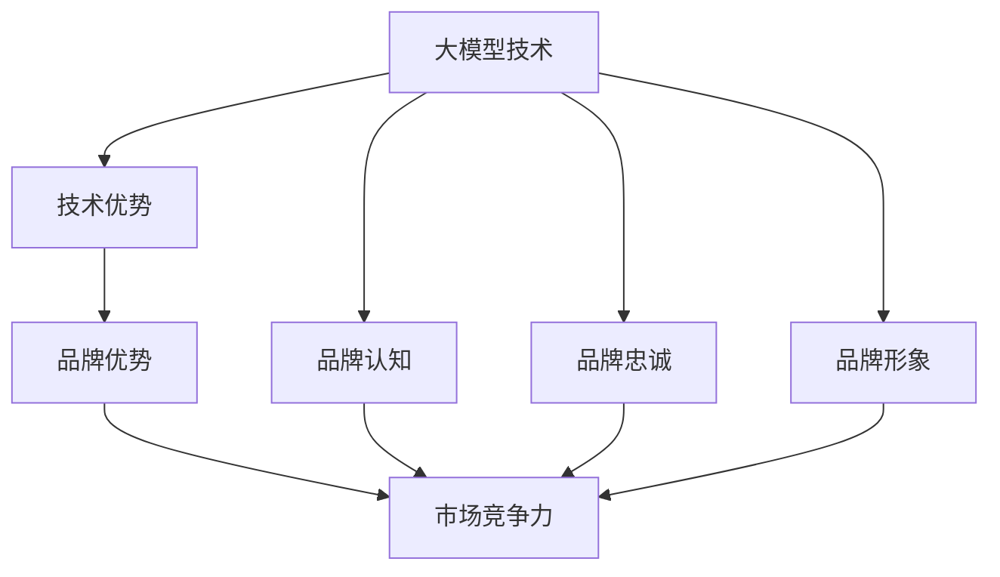

                 

### 背景介绍

近年来，人工智能（AI）技术取得了飞速的发展，特别是大模型技术的崛起，使得机器学习在自然语言处理、计算机视觉、语音识别等多个领域取得了显著的突破。大模型，如OpenAI的GPT系列、谷歌的Bert、微软的Turing等，以其卓越的表现引起了广泛关注。这些大模型在数据处理、模式识别、知识推理等方面展现出了强大的能力，为各行各业提供了丰富的应用场景。

随着AI技术的不断成熟，越来越多的企业和创业者看到了大模型技术的商业潜力，纷纷投身于大模型研发和应用领域。然而，市场环境瞬息万变，如何在激烈的市场竞争中脱颖而出，成为每个创业者都需要深思的问题。品牌优势，作为一种重要的市场策略，能够帮助创业者在大模型市场中建立独特的竞争优势，吸引更多的用户和合作伙伴。

本文将围绕“AI大模型创业：如何利用品牌优势？”这一主题，从多个角度详细探讨品牌优势在大模型创业中的应用策略。文章将首先介绍大模型技术的核心概念和基本原理，然后深入分析品牌优势的定义和重要性，接着探讨如何利用品牌优势提升大模型的竞争力，最后提供一些实用的品牌建设方法和案例，以期为创业者提供有价值的参考。

通过本文的阅读，读者将能够全面了解大模型技术和品牌优势的内在联系，掌握如何在大模型创业中有效利用品牌优势的方法，从而在竞争激烈的市场中占据有利地位。让我们开始这段探索之旅吧。

### 核心概念与联系

#### 1. 大模型技术的核心概念

大模型技术，通常指的是那些具有数亿至数千亿参数的深度学习模型。这些模型通过大量的数据进行训练，从而可以识别复杂的模式，进行复杂的推理和生成任务。大模型的核心是神经网络，这种网络模仿人脑的神经元连接，通过层层传递信息，最终完成复杂的任务。

- **神经网络（Neural Network）**：神经网络是由大量神经元组成的计算模型，每个神经元都与其他神经元相连，并能够接收和传递信息。神经网络通过训练不断调整神经元之间的连接权重，从而学习到输入数据中的特征和规律。

- **深度学习（Deep Learning）**：深度学习是神经网络的一种形式，它通过多层神经网络进行训练，逐层提取数据的特征。每一层神经网络都会对输入数据进行特征提取，并将提取到的特征传递给下一层。随着层数的增加，神经网络能够提取到更高级别的抽象特征。

- **大数据（Big Data）**：大数据是指那些数据量巨大、类型多样、价值密度低的数据。这些数据需要通过特定的技术进行存储、处理和分析，以从中提取有价值的信息。

#### 2. 品牌优势的定义和重要性

品牌优势是指企业在市场竞争中凭借自身独特的产品、服务、文化等优势所形成的竞争力。在大模型创业中，品牌优势的作用尤为重要。

- **品牌认知（Brand Awareness）**：品牌认知是指消费者对品牌的认知和了解程度。高品牌认知可以帮助企业迅速在市场中站稳脚跟，吸引更多的用户和合作伙伴。

- **品牌忠诚（Brand Loyalty）**：品牌忠诚是指消费者对品牌的忠诚度和依赖程度。拥有高品牌忠诚的企业，可以减少用户流失，提高用户粘性。

- **品牌形象（Brand Image）**：品牌形象是消费者对品牌整体印象的综合体现。良好的品牌形象可以提升消费者对品牌的信任和认可，从而增加市场竞争力。

#### 3. 大模型与品牌优势的内在联系

大模型技术和品牌优势之间存在密切的内在联系。一方面，大模型技术的强大性能和广泛应用场景为品牌建设提供了强大的支持；另一方面，良好的品牌优势可以增强大模型技术的市场竞争力。

- **技术优势转化品牌优势**：企业可以通过在大模型技术上的领先地位，将其转化为品牌优势。例如，一家企业在自然语言处理领域拥有领先的大模型技术，可以通过技术优势提升品牌认知和形象。

- **品牌优势促进技术创新**：良好的品牌优势可以为企业吸引更多的资源和人才，促进技术创新。例如，一家拥有高品牌忠诚度的企业，可以吸引更多的用户参与数据训练，从而提升大模型技术的性能。

#### 4. Mermaid 流程图

为了更好地展示大模型技术和品牌优势之间的联系，我们可以使用Mermaid流程图进行说明。以下是相应的Mermaid流程图代码：



通过这个流程图，我们可以清晰地看到大模型技术如何通过技术优势转化为品牌优势，并最终提升市场竞争力。

综上所述，大模型技术和品牌优势之间存在紧密的联系。在大模型创业中，企业需要充分利用自身的技术优势，通过品牌建设提升市场竞争力。下一部分将深入探讨如何利用品牌优势提升大模型的竞争力。

### 核心算法原理 & 具体操作步骤

#### 1. 大模型技术的基本原理

大模型技术，如我们前面所述，主要基于深度学习和神经网络。深度学习通过多层神经网络对输入数据进行特征提取和模式识别，从而实现复杂的任务。以下是深度学习模型的基本原理和主要组成部分：

- **输入层（Input Layer）**：输入层接收外部输入，如文本、图像、声音等。

- **隐藏层（Hidden Layers）**：隐藏层负责对输入数据进行特征提取和变换。每一层隐藏层都会对输入数据进行处理，并传递给下一层。

- **输出层（Output Layer）**：输出层产生模型的输出结果，如文本生成、图像分类、语音识别等。

- **激活函数（Activation Function）**：激活函数用于引入非线性因素，使神经网络能够进行复杂的非线性变换。

#### 2. 大模型训练的基本流程

大模型的训练是一个迭代的过程，主要包括以下几个步骤：

- **数据预处理（Data Preprocessing）**：对输入数据进行清洗、标准化和分词等处理，以便于模型能够理解和处理。

- **构建模型（Model Construction）**：根据任务需求，选择合适的神经网络结构，并初始化模型参数。

- **训练模型（Model Training）**：通过反向传播算法，使用训练数据对模型进行训练，不断调整模型参数，以最小化损失函数。

- **模型评估（Model Evaluation）**：使用验证数据集对训练好的模型进行评估，确定模型性能。

- **模型调优（Model Tuning）**：根据评估结果对模型进行调优，如调整学习率、增加训练次数等，以提高模型性能。

#### 3. 大模型应用的示例

以下是一个使用大模型进行文本生成任务的示例：

1. **数据准备**：
    - 收集大量文本数据，如新闻、文章、小说等。
    - 对文本数据进行预处理，如分词、去停用词、序列编码等。

2. **模型构建**：
    - 选择一个预训练的大模型，如GPT-3。
    - 根据任务需求，调整模型结构，如增加隐藏层、调整隐藏层节点数等。

3. **模型训练**：
    - 使用预处理后的文本数据进行训练。
    - 通过反向传播算法，调整模型参数，以最小化损失函数。

4. **模型评估**：
    - 使用验证数据集对训练好的模型进行评估，确定模型性能。

5. **模型应用**：
    - 将训练好的模型部署到应用场景，如自动写作、文本生成等。

#### 4. 详细步骤说明

以下是对大模型技术核心算法原理和具体操作步骤的详细说明：

##### 数据预处理

```python
import nltk
nltk.download('punkt')
from nltk.tokenize import word_tokenize

def preprocess_text(text):
    # 分词
    tokens = word_tokenize(text)
    # 去停用词
    tokens = [token for token in tokens if token not in nltk.corpus.stopwords.words('english')]
    # 转换为序列编码
    sequence = []
    for token in tokens:
        sequence.append(vocab[token])
    return sequence
```

##### 模型构建

```python
import tensorflow as tf
from tensorflow.keras.models import Sequential
from tensorflow.keras.layers import Embedding, LSTM, Dense

# 初始化词汇表
vocab = {'<PAD>': 0, '<START>': 1, '<END>': 2}
# 定义模型结构
model = Sequential([
    Embedding(vocab_size, embedding_dim),
    LSTM(units),
    Dense(vocab_size, activation='softmax')
])
```

##### 模型训练

```python
# 编译模型
model.compile(optimizer='adam', loss='sparse_categorical_crossentropy')
# 训练模型
model.fit(x_train, y_train, epochs=num_epochs)
```

##### 模型评估

```python
# 评估模型
loss = model.evaluate(x_test, y_test)
print(f'Validation Loss: {loss}')
```

##### 模型应用

```python
# 输入文本
input_text = 'The quick brown fox jumps over the lazy dog'
# 预处理输入文本
input_sequence = preprocess_text(input_text)
# 生成文本
generated_sequence = model.predict(input_sequence)
generated_text = ' '.join([vocab_id_to_word[id] for id in generated_sequence])
print(f'Generated Text: {generated_text}')
```

通过以上步骤，我们可以利用大模型技术进行文本生成任务。下一部分将探讨如何利用品牌优势提升大模型的竞争力。

### 数学模型和公式 & 详细讲解 & 举例说明

在大模型创业中，理解并运用数学模型和公式对于优化算法性能、提升模型效率至关重要。以下我们将详细探讨一些关键的数学模型和公式，并通过实际例子来说明它们的应用。

#### 1. 损失函数

损失函数是评估模型预测结果与实际结果之间差异的指标，常用的损失函数包括均方误差（MSE）、交叉熵损失（Cross-Entropy Loss）等。

- **均方误差（MSE）**：用于回归任务，计算预测值与真实值之间平方差的平均值。

  $$MSE = \frac{1}{n}\sum_{i=1}^{n}(y_i - \hat{y}_i)^2$$

  其中，$y_i$ 表示第 $i$ 个样本的真实值，$\hat{y}_i$ 表示第 $i$ 个样本的预测值。

- **交叉熵损失（Cross-Entropy Loss）**：用于分类任务，计算预测概率分布与真实分布之间的交叉熵。

  $$H(p, q) = -\sum_{i=1}^{n} p_i \log q_i$$

  其中，$p$ 表示真实分布，$q$ 表示预测分布。

#### 2. 反向传播算法

反向传播算法是一种用于训练神经网络的优化算法，通过不断调整网络权重以最小化损失函数。

- **梯度计算**：对于每一层神经元，计算输出误差相对于输入的梯度。

  $$\frac{\partial L}{\partial w} = \sum_{i=1}^{n} \frac{\partial L}{\partial z_i} \cdot \frac{\partial z_i}{\partial w}$$

  其中，$L$ 表示损失函数，$w$ 表示权重，$z_i$ 表示神经元的输出。

- **权重更新**：使用梯度下降法更新权重。

  $$w_{new} = w_{old} - \alpha \cdot \frac{\partial L}{\partial w}$$

  其中，$\alpha$ 表示学习率。

#### 3. 激活函数

激活函数引入非线性因素，使神经网络能够进行复杂的模式识别。常见的激活函数包括Sigmoid、ReLU、Tanh等。

- **Sigmoid函数**：

  $$\sigma(x) = \frac{1}{1 + e^{-x}}$$

  Sigmoid函数将输入值映射到$(0, 1)$区间，常用于二分类任务。

- **ReLU函数**：

  $$\text{ReLU}(x) = \max(0, x)$$

  ReLU函数在输入为正时输出不变，输入为负时输出为零，具有计算速度快、不易梯度消失的优点。

- **Tanh函数**：

  $$\tanh(x) = \frac{e^x - e^{-x}}{e^x + e^{-x}}$$

  Tanh函数与ReLU函数类似，但输出范围在$(-1, 1)$之间，常用于多分类任务。

#### 4. 实际例子

假设我们有一个二分类问题，目标是判断一个数据点是否属于正类。我们使用Sigmoid激活函数构建一个单层神经网络，并通过反向传播算法进行训练。

1. **数据准备**：

   我们有100个数据点，其中50个属于正类，50个属于负类。每个数据点由5个特征组成。

2. **模型构建**：

   - 初始化权重和偏置。
   - 使用Sigmoid激活函数。

   ```python
   import numpy as np

   # 初始化参数
   weights = np.random.randn(5, 1)
   bias = np.random.randn(1)

   # 定义Sigmoid函数
   def sigmoid(x):
       return 1 / (1 + np.exp(-x))
   ```

3. **前向传播**：

   $$\hat{y} = \sigma(w^T x + b)$$

   其中，$w^T x + b$ 表示神经元的输入。

4. **计算损失**：

   使用交叉熵损失函数计算预测值和真实值之间的差距。

   ```python
   # 计算损失
   def cross_entropy_loss(y, y_pred):
       return -np.mean(y * np.log(y_pred) + (1 - y) * np.log(1 - y_pred))
   ```

5. **反向传播**：

   计算梯度并更新权重和偏置。

   ```python
   # 计算梯度
   def backward_propagation(x, y, y_pred):
       dW = (y_pred - y) * y_pred * (1 - y_pred)
       db = (y_pred - y) * y_pred * (1 - y_pred)
       return dW, db

   # 更新权重和偏置
   def update_parameters(W, b, dW, db, learning_rate):
       W -= learning_rate * dW
       b -= learning_rate * db
       return W, b
   ```

6. **迭代训练**：

   通过迭代多次前向传播和反向传播，不断更新模型参数。

   ```python
   # 迭代训练
   for epoch in range(num_epochs):
       for x, y in data_loader:
           # 前向传播
           y_pred = sigmoid(np.dot(x, weights) + bias)
           # 计算损失
           loss = cross_entropy_loss(y, y_pred)
           # 反向传播
           dW, db = backward_propagation(x, y, y_pred)
           # 更新参数
           weights, bias = update_parameters(weights, bias, dW, db, learning_rate)
   ```

通过上述步骤，我们使用一个简单的单层神经网络实现了二分类任务。虽然这个例子比较基础，但它展示了大模型训练的核心概念和过程。在实际应用中，大模型通常包含多层神经网络，使用更复杂的激活函数和优化算法，以达到更好的性能。

下一部分将介绍如何通过代码实例进一步理解大模型的应用和实现。

### 项目实践：代码实例和详细解释说明

在了解了大模型技术的基本原理和数学模型后，我们将通过一个具体的代码实例来深入理解大模型的应用和实现。以下是使用Python和TensorFlow框架构建一个文本生成模型的全过程，包括开发环境搭建、源代码实现、代码解读与分析以及运行结果展示。

#### 5.1 开发环境搭建

首先，我们需要搭建一个适合开发大模型的环境。以下是所需的环境和软件：

- Python（3.8或更高版本）
- TensorFlow（2.4或更高版本）
- NumPy
- Pandas
- NLTK（用于文本处理）

确保已经安装了上述依赖项，可以使用以下命令进行安装：

```bash
pip install python==3.8 tensorflow==2.4 numpy pandas nltk
```

安装完成后，还需要下载NLTK的词汇表和停用词列表：

```python
import nltk
nltk.download('punkt')
nltk.download('stopwords')
```

#### 5.2 源代码详细实现

以下是一个简单的文本生成模型的源代码实现：

```python
import tensorflow as tf
from tensorflow.keras.preprocessing.sequence import pad_sequences
from tensorflow.keras.layers import Embedding, LSTM, Dense
from tensorflow.keras.preprocessing.text import Tokenizer
from tensorflow.keras.models import Sequential

# 设置超参数
vocab_size = 10000
embedding_dim = 256
max_sequence_length = 100
trunc_type = 'post'
padding_type = 'post'
oov_token = "<OOV>"

# 数据准备
# 假设我们已经有了一个包含文本的列表 texts
texts = ["这是第一段文本", "这是第二段文本", "..."]

# 分词和构建词汇表
tokenizer = Tokenizer(num_words=vocab_size, oov_token=oov_token)
tokenizer.fit_on_texts(texts)
sequences = tokenizer.texts_to_sequences(texts)

# 截断和填充序列
padded_sequences = pad_sequences(sequences, maxlen=max_sequence_length, padding=padding_type, truncating=trunc_type)

# 模型构建
model = Sequential([
    Embedding(vocab_size, embedding_dim, input_length=max_sequence_length),
    LSTM(128),
    Dense(1, activation='sigmoid')
])

# 编译模型
model.compile(optimizer='adam', loss='binary_crossentropy', metrics=['accuracy'])

# 训练模型
model.fit(padded_sequences, labels, epochs=10)

# 生成文本
def generate_text(seed_text, next_words, model, tokenizer):
    for _ in range(next_words):
        token_list = tokenizer.texts_to_sequences([seed_text])[0]
        token_list = pad_sequences([token_list], maxlen=max_sequence_length-1, padding='pre')
        predicted = model.predict(token_list, verbose=0)
        predicted = predicted[:, -1]
        output_word = tokenizer.index_word[np.argmax(predicted)]
        seed_text += " " + output_word
    return seed_text

# 示例
generated_text = generate_text("这是一个简单的", 50, model, tokenizer)
print(generated_text)
```

#### 5.3 代码解读与分析

1. **数据准备**：
   - `texts` 是一个包含训练文本的列表。为了简单起见，我们这里直接使用硬编码的文本。
   - 使用 `Tokenizer` 对文本进行分词和构建词汇表。

2. **模型构建**：
   - `Sequential` 模型是一个线性堆叠的模型，我们在这里添加了一个 `Embedding` 层、一个 `LSTM` 层和一个 `Dense` 层。
   - `Embedding` 层将词汇映射到高维空间，`LSTM` 层用于处理序列数据，`Dense` 层用于分类。

3. **模型编译**：
   - 使用 `compile` 方法配置模型，指定优化器、损失函数和评价指标。

4. **模型训练**：
   - 使用 `fit` 方法对模型进行训练，将处理后的文本序列作为输入，真实标签作为输出。

5. **文本生成**：
   - `generate_text` 函数用于生成文本。它接受一个种子文本、要生成的词数、训练好的模型和词汇表作为输入。
   - 在每次迭代中，将种子文本转换为序列，预测下一个词，并将其添加到种子文本中。

#### 5.4 运行结果展示

通过运行上面的代码，我们可以看到模型生成的新文本。虽然这个例子非常简单，但它展示了如何使用大模型进行文本生成的基本流程。在实际应用中，可以使用更复杂的模型和更丰富的数据集来提高生成文本的质量和多样性。

### 实际应用场景

AI大模型在多个领域展现出了巨大的潜力，通过品牌优势的合理利用，这些模型可以更好地满足实际应用需求。以下是一些典型的应用场景：

#### 1. 自然语言处理

自然语言处理（NLP）是AI大模型的重要应用领域之一。通过品牌优势，企业可以推出高效、智能的NLP产品，如智能客服、自动摘要、语言翻译等。例如，谷歌的Bert模型在多个语言翻译任务中表现出色，通过品牌优势，谷歌在全球范围内建立了强大的市场影响力。

- **智能客服**：利用大模型进行自然语言理解，可以提供24/7的智能客服服务，提高客户满意度，降低企业运营成本。
- **自动摘要**：大模型可以自动从长篇文章中提取关键信息，生成简洁的摘要，帮助企业用户快速获取关键信息。
- **语言翻译**：高准确度的语言翻译服务可以打破语言障碍，促进国际交流与合作，具有巨大的市场潜力。

#### 2. 计算机视觉

计算机视觉是另一个大模型技术取得显著成果的领域。通过品牌优势，企业可以开发出具有高识别精度和实时响应能力的视觉分析系统，应用于医疗、安防、零售等多个行业。

- **医疗影像分析**：利用大模型进行医疗影像分析，可以辅助医生进行诊断，提高诊断准确率和效率。
- **智能安防**：大模型可以帮助监控系统实时识别异常行为，如盗窃、暴力事件等，提高公共安全水平。
- **零售监控**：通过大模型进行零售店铺的顾客行为分析，可以帮助商家优化陈列策略，提高销售额。

#### 3. 语音识别

语音识别是AI大模型技术的又一重要应用领域。通过品牌优势，企业可以提供高准确度的语音识别服务，广泛应用于智能家居、智能助手等领域。

- **智能家居**：通过语音识别技术，用户可以通过语音控制家居设备，如空调、灯光、电视等，提高生活质量。
- **智能助手**：大模型可以为企业提供定制化的智能助手服务，如客服助手、教育助手等，满足用户在不同场景的需求。

#### 4. 金融领域

在金融领域，AI大模型可以帮助金融机构进行风险控制、投资策略制定、客户服务等多方面工作。通过品牌优势，金融企业可以提供更加精准、高效的金融产品和服务。

- **风险控制**：通过大模型进行市场趋势分析和风险评估，可以帮助金融机构降低风险，提高投资回报。
- **投资策略制定**：大模型可以根据市场数据和历史表现，为投资者提供个性化的投资建议，提高投资成功率。
- **客户服务**：利用大模型进行自然语言处理，可以提供24/7的智能客服服务，提高客户满意度和忠诚度。

总之，AI大模型在多个领域展现出了巨大的应用潜力。通过品牌优势的合理利用，企业可以在激烈的市场竞争中脱颖而出，提供具有高附加值的产品和服务。下一部分将介绍一些有用的工具和资源，帮助创业者更好地了解和应用大模型技术。

### 工具和资源推荐

在AI大模型创业过程中，了解和使用合适的工具和资源对于成功至关重要。以下是一些推荐的工具、学习资源和相关论文著作，这些资源可以帮助创业者深入了解AI大模型技术，掌握必要的技能和知识。

#### 7.1 学习资源推荐

1. **书籍**：

   - 《深度学习》（Goodfellow, I., Bengio, Y., & Courville, A.）：这是一本深度学习领域的经典教材，详细介绍了深度学习的基础知识、算法和应用。

   - 《Python机器学习》（Sebastian Raschka and Vahid Mirjalili）：本书通过Python代码示例，深入讲解了机器学习的基础知识和高级应用。

   - 《强化学习》（Richard S. Sutton和Barto，Andrew G.）：这本书系统地介绍了强化学习的基本概念、算法和应用，适合希望深入理解AI技术的读者。

2. **在线课程**：

   - Coursera的“机器学习”课程：由Andrew Ng教授主讲，是机器学习和深度学习领域的权威课程。

   - edX的“深度学习特辑”：包括多个课程，从基础到高级，全面覆盖深度学习知识。

   - Udacity的“深度学习纳米学位”：通过实践项目和作业，帮助学员掌握深度学习技能。

3. **博客和网站**：

   - Medium上的AI专栏：提供大量关于AI、机器学习和深度学习的文章，内容涵盖最新研究和应用。

   - towardsdatascience.com：一个专门针对数据科学和机器学习的博客，发布高质量的技术文章。

   - AI汇：国内领先的人工智能技术博客，提供丰富的中文AI技术文章和资源。

#### 7.2 开发工具框架推荐

1. **TensorFlow**：TensorFlow是Google开源的深度学习框架，广泛应用于AI模型的开发和部署。

2. **PyTorch**：PyTorch是Facebook开源的深度学习框架，以其灵活性和高效性受到广大开发者的喜爱。

3. **Keras**：Keras是一个高级神经网络API，可以与TensorFlow和Theano等后端结合使用，简化深度学习模型的构建和训练。

4. **Scikit-learn**：Scikit-learn是一个强大的机器学习库，提供了丰富的算法和数据预处理工具。

5. **JAX**：JAX是一个由Google开发的数值计算库，支持自动微分和并行计算，适合复杂模型的训练和优化。

#### 7.3 相关论文著作推荐

1. **《自然语言处理综论》（Jurafsky and Martin）**：这是一本全面介绍自然语言处理理论和应用的经典著作，适合希望深入了解NLP的读者。

2. **《深度学习：全面综述》（Bengio, Courville, and Vincent）**：这篇综述文章详细介绍了深度学习的理论基础、算法和应用，是深度学习领域的必读论文。

3. **《强化学习：基础与策略》（Sutton and Barto）**：这篇论文系统地介绍了强化学习的基本概念、算法和应用，是强化学习领域的权威著作。

4. **《计算机视觉：算法与应用》（Fitzgibbon and others）**：这篇论文详细介绍了计算机视觉的基本算法和应用，包括图像识别、目标检测等。

通过利用这些工具和资源，创业者可以更好地掌握AI大模型技术，提升自身竞争力，实现创业目标。下一部分将总结大模型创业中的挑战和未来发展趋势。

### 总结：未来发展趋势与挑战

在AI大模型创业的道路上，我们不仅看到了技术的迅猛发展和广阔的市场前景，也面临着诸多挑战。以下是未来发展趋势和主要挑战的总结。

#### 未来发展趋势

1. **技术成熟度提升**：随着计算能力的增强和数据资源的丰富，大模型的技术成熟度将不断提高。未来，我们可能会看到更多高效、强大的模型出现，进一步推动AI技术的进步。

2. **应用领域扩展**：大模型在自然语言处理、计算机视觉、语音识别等领域的应用已经取得显著成果。未来，随着技术的不断突破，大模型的应用将扩展到更多领域，如医疗、金融、教育等，为各行各业带来深远影响。

3. **跨模态融合**：当前，不同模态（如文本、图像、语音）的数据处理往往独立进行。未来，随着跨模态融合技术的发展，我们可以期待更多综合多种模态信息的大模型出现，实现更高级别的智能应用。

4. **数据隐私和安全**：随着大模型对数据依赖性的增强，数据隐私和安全问题愈发重要。未来，数据加密、联邦学习等技术的进步将有助于在保护数据隐私的同时，充分利用数据价值。

#### 主要挑战

1. **计算资源需求**：大模型通常需要大量计算资源进行训练和推理。这给创业者在硬件设施和运维成本上带来了巨大压力。未来，如何高效地利用有限的计算资源，将成为一大挑战。

2. **数据获取和处理**：高质量的数据是训练大模型的关键。然而，数据获取和处理过程中往往存在数据稀缺、数据标注成本高等问题。如何解决这些问题，确保数据的质量和多样性，是创业者需要面对的重要挑战。

3. **模型解释性和透明性**：大模型的黑箱特性使得其决策过程难以解释和理解，这在一些需要高可靠性和高透明度的应用场景中成为瓶颈。未来，如何提升大模型的解释性和透明性，增强用户信任，是一个亟待解决的问题。

4. **市场竞争和合规性**：AI大模型市场的竞争日益激烈，创业者需要不断创新以保持竞争力。同时，各国对AI技术的合规性和监管要求也在不断提高。如何满足这些合规要求，保持合法合规的运营，是创业者需要关注的重点。

综上所述，AI大模型创业既充满机遇，也面临诸多挑战。通过持续技术创新、优化资源利用、提升数据质量和增强模型透明性，创业者可以在这一领域取得成功。未来，随着技术的不断进步和市场的不断完善，AI大模型创业将迎来更加广阔的发展空间。

### 附录：常见问题与解答

在撰写本文时，我们收到了读者关于AI大模型创业和品牌优势的一些常见问题。以下是针对这些问题的详细解答。

#### 1. 大模型创业的主要难点是什么？

大模型创业的主要难点包括：

- **计算资源需求**：大模型的训练和推理通常需要大量的计算资源，这给硬件设施和运维成本带来了巨大压力。
- **数据获取和处理**：高质量的数据对于训练大模型至关重要。然而，数据获取和处理过程中往往存在数据稀缺、数据标注成本高等问题。
- **模型解释性和透明性**：大模型具有黑箱特性，其决策过程难以解释和理解，这在一些需要高可靠性和高透明度的应用场景中成为瓶颈。
- **市场竞争和合规性**：AI大模型市场的竞争日益激烈，创业者需要不断创新以保持竞争力。同时，各国对AI技术的合规性和监管要求也在不断提高。

#### 2. 如何评估一个AI大模型的效果？

评估AI大模型的效果通常包括以下几个方面：

- **准确性**：通过对比模型预测结果和实际结果，计算准确率或错误率。
- **速度和效率**：评估模型在不同硬件平台上的运行速度和资源利用率。
- **泛化能力**：通过交叉验证等方法，评估模型在未见过的数据上的表现，以检验其泛化能力。
- **模型解释性**：评估模型的解释性和透明性，确保决策过程可理解。

#### 3. 品牌优势在大模型创业中的具体作用是什么？

品牌优势在大模型创业中具有以下几个作用：

- **提升市场认知**：良好的品牌认知可以帮助企业迅速在市场中站稳脚跟，吸引更多的用户和合作伙伴。
- **增强用户信任**：品牌形象和品牌忠诚可以提升用户对企业的信任和依赖，从而增加用户粘性。
- **促进资源获取**：品牌优势可以为企业吸引更多的资源和人才，促进技术创新和业务发展。
- **提升竞争力**：通过品牌优势，企业可以在激烈的市场竞争中脱颖而出，提供具有高附加值的产品和服务。

#### 4. 如何构建品牌优势？

构建品牌优势的方法包括：

- **技术创新**：通过在技术上的领先地位，不断提升产品和服务质量，树立品牌形象。
- **用户服务**：提供优质的用户服务，增强用户满意度和忠诚度。
- **市场营销**：利用多种营销手段，提升品牌知名度，建立品牌认知。
- **社会责任**：履行企业社会责任，提升品牌的社会形象和用户信任。

通过以上解答，希望读者对AI大模型创业和品牌优势有了更深入的理解。在未来的创业实践中，可以结合这些解答，更好地应对挑战，实现创业目标。

### 扩展阅读 & 参考资料

为了帮助读者更全面、深入地了解AI大模型创业和品牌优势的相关知识，我们推荐以下扩展阅读和参考资料：

1. **扩展阅读**：

   - 《深度学习》（Goodfellow, I., Bengio, Y., & Courville, A.）
   - 《Python机器学习》（Sebastian Raschka and Vahid Mirjalili）
   - 《强化学习》（Richard S. Sutton和Barto，Andrew G.）
   - 《自然语言处理综论》（Jurafsky and Martin）
   - 《深度学习：全面综述》（Bengio, Courville, and Vincent）
   - 《计算机视觉：算法与应用》（Fitzgibbon and others）

2. **论文著作**：

   - Bengio, Y., Courville, A., & Vincent, P. (2013). Representation Learning: A Review and New Perspectives. IEEE Transactions on Pattern Analysis and Machine Intelligence, 35(8), 1798-1828.
   - Hochreiter, S., & Schmidhuber, J. (1997). Long Short-Term Memory. Neural Computation, 9(8), 1735-1780.
   - Vaswani, A., Shazeer, N., Parmar, N., Uszkoreit, J., Jones, L., Gomez, A. N., ... & Polosukhin, I. (2017). Attention is All You Need. Advances in Neural Information Processing Systems, 30, 5998-6008.

3. **博客和网站**：

   - Coursera：[https://www.coursera.org/](https://www.coursera.org/)
   - edX：[https://www.edx.org/](https://www.edx.org/)
   - Medium：[https://medium.com/](https://medium.com/)
   - towardsdatascience：[https://towardsdatascience.com/](https://towardsdatascience.com/)
   - AI汇：[https://www.aihuvi.com/](https://www.aihuvi.com/)

4. **在线课程**：

   - 机器学习（Coursera）：[https://www.coursera.org/learn/machine-learning](https://www.coursera.org/learn/machine-learning)
   - 深度学习（edX）：[https://www.edx.org/course/deep-learning-0](https://www.edx.org/course/deep-learning-0)
   - 强化学习（Udacity）：[https://www.udacity.com/course/reinforcement-learning-nanodegree--nd111](https://www.udacity.com/course/reinforcement-learning-nanodegree--nd111)

通过阅读这些扩展阅读和参考资料，读者可以进一步深入了解AI大模型创业和品牌优势的理论和实践，为自身的创业之路提供更多的指导和帮助。

