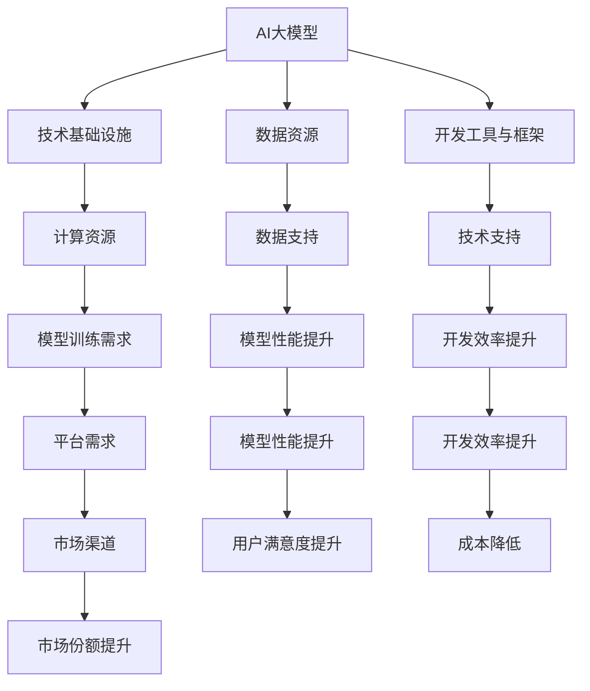

                 

### 文章标题

**AI 大模型创业：如何利用平台优势？**

> **关键词：** 大模型、平台优势、创业、人工智能、技术路线、商业模式、数据利用、创新策略

> **摘要：** 本文旨在探讨AI大模型创业过程中的关键要素，特别是在利用平台优势方面的策略。通过分析当前的市场环境和技术发展趋势，文章将提出一系列可行的创业路径和操作建议，帮助创业者抓住AI大模型的商业机遇。

### 1. 背景介绍

人工智能（AI）近年来取得了飞速发展，特别是在深度学习领域，大模型的性能不断突破，成为各行各业数字化转型的核心技术。大模型具有处理复杂数据、自动特征提取和智能决策等能力，广泛应用于图像识别、自然语言处理、语音识别、推荐系统等多个领域。随着技术的进步，构建和优化大模型所需的数据量、计算资源和专业技能门槛日益降低，为创业者提供了前所未有的机会。

创业环境方面，全球化和互联网的发展使得信息获取更加便捷，创业者可以迅速接触到全球范围内的市场需求和技术动态。同时，各种创业孵化器和投资机构的出现，为有潜力的AI创业项目提供了资金支持和资源对接。在这样的背景下，AI大模型创业不仅具备巨大的市场潜力，还面临激烈的竞争。

平台优势在AI大模型创业中扮演着至关重要的角色。平台不仅是技术和服务的载体，也是连接用户、数据和合作伙伴的关键枢纽。一个强大的平台能够提供稳定的技术基础设施、丰富的数据资源和高效的运营模式，为创业项目提供强有力的支持。因此，如何有效利用平台优势，成为AI大模型创业成功的关键。

本文将围绕以下几个核心问题展开讨论：

1. **AI大模型创业的核心挑战和机遇是什么？**
2. **如何识别和利用平台优势？**
3. **在平台环境下，如何构建和优化大模型？**
4. **商业模式的创新策略和实践案例？**
5. **创业过程中的风险管理建议？**

通过上述问题的探讨，本文旨在为AI大模型创业提供一套系统的理论和实践指导，帮助创业者更好地抓住市场机遇，实现可持续发展。

### 2. 核心概念与联系

#### 2.1 AI大模型的概念

AI大模型是指那些具有海量参数和复杂结构的深度学习模型，它们能够通过大量数据进行训练，从而实现高度智能化。例如，Transformer架构和BERT模型是当前最流行的大模型之一，它们在自然语言处理领域取得了显著成果。大模型的显著特征包括：

- **参数规模**：数百万至数十亿个参数。
- **计算量**：训练和推理过程中需要大量计算资源。
- **数据需求**：需要大量的高质量训练数据。
- **泛化能力**：能够处理各种复杂任务和多样的数据分布。

#### 2.2 平台优势的定义

平台优势是指一个技术平台所具有的独特能力，这些能力包括但不限于：

- **技术基础设施**：提供稳定高效的计算和存储资源。
- **数据资源**：拥有大量高质量的数据集，为模型训练提供支持。
- **生态系统**：构建了一个开放的生态系统，吸引各类合作伙伴和开发者。
- **运营模式**：具有高效的运营管理和商业模式，能够实现持续盈利。

#### 2.3 大模型与平台优势的联系

大模型与平台优势之间存在密切的联系。平台优势为AI大模型提供了以下支持：

- **计算资源**：平台能够提供强大的计算能力，满足大模型训练的需求。
- **数据资源**：平台拥有丰富的数据集，有助于提高模型的性能和泛化能力。
- **技术支持**：平台提供了一系列开发工具和框架，简化了大模型的构建和优化过程。
- **市场渠道**：平台的市场渠道能够帮助创业项目快速获取用户和市场份额。

为了更好地理解这些概念和联系，我们可以使用Mermaid流程图来展示大模型与平台优势的交互过程：



通过以上流程图，我们可以清晰地看到大模型与平台优势之间的互动关系，以及平台优势如何通过计算资源、数据资源、技术支持和市场渠道等途径，支持AI大模型的构建和优化。

### 3. 核心算法原理 & 具体操作步骤

#### 3.1 大模型训练过程

AI大模型的训练是创业过程中最核心的环节，涉及到数据的预处理、模型的构建、训练、验证和优化等多个步骤。以下是具体操作步骤：

1. **数据预处理**：
   - **数据收集**：从各种渠道获取大规模的数据集，包括文本、图像、音频等。
   - **数据清洗**：去除噪声、填补缺失值、标准化数据。
   - **数据增强**：通过旋转、缩放、裁剪等手段增加数据的多样性。

2. **模型构建**：
   - **选择架构**：根据任务需求选择合适的模型架构，如Transformer、BERT、GPT等。
   - **参数初始化**：对模型的参数进行初始化，常用的初始化方法有Xavier初始化、He初始化等。

3. **模型训练**：
   - **训练设置**：配置训练参数，如学习率、批量大小、训练轮次等。
   - **前向传播与反向传播**：计算损失函数，通过反向传播更新模型参数。
   - **优化算法**：选择合适的优化算法，如SGD、Adam、Adagrad等。

4. **模型验证与优化**：
   - **验证集评估**：使用验证集评估模型性能，调整超参数。
   - **测试集评估**：在测试集上评估模型性能，确保模型具有良好的泛化能力。

5. **模型部署**：
   - **模型压缩**：为了降低模型体积和计算成本，可以使用模型压缩技术，如量化和剪枝。
   - **模型部署**：将训练好的模型部署到生产环境中，提供实时服务。

#### 3.2 大模型优化技巧

为了提高大模型的性能和效率，以下是一些常用的优化技巧：

1. **数据并行训练**：
   - 通过将数据分成多个批次，同时训练多个模型副本，可以显著提高训练速度。

2. **模型并行训练**：
   - 通过将模型分割成多个部分，分别训练并合并结果，可以进一步加速训练过程。

3. **增量学习**：
   - 在已有模型的基础上，逐步添加新的训练数据和任务，可以提高模型的泛化能力和适应性。

4. **迁移学习**：
   - 利用预训练的大模型，针对特定任务进行微调，可以显著提高模型的性能。

5. **模型压缩**：
   - 使用量化和剪枝等技术，减少模型参数的数量和计算量，降低模型的存储和计算成本。

6. **分布式训练**：
   - 通过在多个计算节点上分布式训练，可以充分利用资源，提高训练效率。

#### 3.3 实际操作示例

以下是一个使用PyTorch框架训练BERT模型的基本示例：

```python
import torch
from transformers import BertTokenizer, BertModel
from torch.optim import Adam

# 数据预处理
tokenizer = BertTokenizer.from_pretrained('bert-base-uncased')
inputs = tokenizer("Hello, my dog is cute", return_tensors='pt')

# 模型构建
model = BertModel.from_pretrained('bert-base-uncased')

# 训练设置
optimizer = Adam(model.parameters(), lr=1e-5)
num_epochs = 3

# 训练过程
for epoch in range(num_epochs):
    optimizer.zero_grad()
    outputs = model(**inputs)
    loss = outputs.loss
    loss.backward()
    optimizer.step()
    print(f"Epoch {epoch+1}: Loss = {loss.item()}")

# 模型部署
model.eval()
with torch.no_grad():
    outputs = model(**inputs)
    logits = outputs.logits
```

在这个示例中，我们首先进行了数据预处理，然后构建了一个BERT模型，并使用Adam优化器进行了三个epoch的训练。最后，我们部署了训练好的模型，并在测试数据上进行了推理。

### 4. 数学模型和公式 & 详细讲解 & 举例说明

#### 4.1 大模型训练中的数学模型

在AI大模型训练过程中，涉及多个数学模型和公式，以下是其中几个关键部分：

##### 4.1.1 损失函数

损失函数是衡量模型预测结果与真实值之间差异的关键指标。常见的损失函数包括均方误差（MSE）、交叉熵损失（Cross-Entropy Loss）等。

- **均方误差（MSE）**：
  $$
  MSE = \frac{1}{n} \sum_{i=1}^{n} (y_i - \hat{y}_i)^2
  $$
  其中，$y_i$ 是真实值，$\hat{y}_i$ 是模型的预测值，$n$ 是样本数量。

- **交叉熵损失（Cross-Entropy Loss）**：
  $$
  CE(y, \hat{y}) = -\sum_{i} y_i \log(\hat{y}_i)
  $$
  其中，$y$ 是真实标签的概率分布，$\hat{y}$ 是模型预测的概率分布。

##### 4.1.2 优化算法

优化算法用于更新模型参数，以最小化损失函数。常见的优化算法包括随机梯度下降（SGD）、Adam等。

- **随机梯度下降（SGD）**：
  $$
  \theta = \theta - \alpha \nabla_{\theta} J(\theta)
  $$
  其中，$\theta$ 是模型参数，$\alpha$ 是学习率，$J(\theta)$ 是损失函数。

- **Adam优化器**：
  Adam优化器结合了SGD和动量（Momentum）的思想，其更新公式为：
  $$
  \begin{aligned}
  m_t &= \beta_1 m_{t-1} + (1 - \beta_1) \nabla_{\theta} J(\theta) \\
  v_t &= \beta_2 v_{t-1} + (1 - \beta_2) (\nabla_{\theta} J(\theta))^2 \\
  \theta_t &= \theta_{t-1} - \alpha \frac{m_t}{\sqrt{v_t} + \epsilon}
  \end{aligned}
  $$
  其中，$m_t$ 和 $v_t$ 分别是动量和方差的一阶和二阶矩估计，$\beta_1$ 和 $\beta_2$ 分别是动量和方差的指数衰减率，$\alpha$ 是学习率，$\epsilon$ 是一个很小的常数用于防止除以零。

##### 4.1.3 模型压缩技术

在模型压缩方面，常用的技术包括量化和剪枝。

- **量化**：
  量化是将模型中的浮点数参数转换为较低精度的整数表示。量化公式为：
  $$
  x_{\text{quantized}} = \text{round}(x_{\text{float}} / \text{scale})
  $$
  其中，$x_{\text{float}}$ 是浮点数参数，$x_{\text{quantized}}$ 是量化后的整数参数，$\text{scale}$ 是量化尺度。

- **剪枝**：
  剪枝是通过删除模型中的部分权重或神经元来减少模型体积和计算量。剪枝公式为：
  $$
  \begin{aligned}
  w_{\text{pruned}} &= w \cdot (1 - p) \\
  n_{\text{pruned}} &= n \cdot (1 - p)
  \end{aligned}
  $$
  其中，$w$ 是权重，$n$ 是神经元数量，$p$ 是剪枝比例。

#### 4.2 举例说明

以下是一个使用PyTorch框架进行模型量化的示例：

```python
import torch
from torch.autograd import Variable
from torchvision.models import resnet50

# 加载预训练的ResNet50模型
model = resnet50()

# 获取模型中的权重参数
weights = model.conv1.weight

# 量化权重参数
scale = 256
quantized_weights = torch.round(weights / scale).to(torch.int8)

# 验证量化后的模型
input_tensor = Variable(torch.randn(1, 3, 224, 224))
output_tensor = model(input_tensor)

# 输出量化的模型参数
print(quantized_weights)
```

在这个示例中，我们首先加载了一个预训练的ResNet50模型，然后提取了模型中的权重参数。通过设置量化尺度，我们将这些权重参数量化为整数形式，并验证了量化后的模型在输入数据上的输出结果。

### 5. 项目实践：代码实例和详细解释说明

#### 5.1 开发环境搭建

要在本地搭建AI大模型训练的开发环境，需要安装以下软件和库：

1. **Python**：建议使用Python 3.8及以上版本。
2. **PyTorch**：通过pip安装`torch`和`torchvision`库。
3. **Transformers**：通过pip安装`transformers`库，用于处理BERT等预训练模型。
4. **CUDA（可选）**：如果使用GPU进行训练，需要安装CUDA和cuDNN。

安装命令如下：

```bash
pip install torch torchvision transformers
```

对于CUDA，可以参考NVIDIA官方文档进行安装。

#### 5.2 源代码详细实现

以下是一个使用PyTorch和Transformers库训练BERT模型的基本代码示例：

```python
import torch
from torch.optim import Adam
from transformers import BertTokenizer, BertModel, TrainingArguments, Trainer
from datasets import load_dataset

# 数据预处理
tokenizer = BertTokenizer.from_pretrained('bert-base-uncased')
dataset = load_dataset('squad')

def preprocess_function(examples):
    return tokenizer(examples["question"], examples["context"], truncation=True, padding="max_length")

tokenized_dataset = dataset.map(preprocess_function, batched=True)

# 模型构建
model = BertModel.from_pretrained('bert-base-uncased')

# 训练设置
training_args = TrainingArguments(
    output_dir='./results',
    num_train_epochs=3,
    per_device_train_batch_size=16,
    per_device_eval_batch_size=16,
    warmup_steps=500,
    weight_decay=0.01,
    logging_dir='./logs',
    logging_steps=10,
)

# 训练过程
trainer = Trainer(
    model=model,
    args=training_args,
    train_dataset=tokenized_dataset["train"],
    eval_dataset=tokenized_dataset["validation"],
)

trainer.train()

# 模型部署
model.eval()
with torch.no_grad():
    inputs = tokenizer("Hello, my dog is cute", return_tensors='pt')
    outputs = model(**inputs)
    logits = outputs.logits
```

在这个示例中，我们首先加载了BERT模型和SQuAD数据集，然后对数据进行预处理，将文本转换为模型可接受的输入格式。接着，我们设置了训练参数，并使用Trainer类进行了模型训练。最后，我们将训练好的模型进行部署，在新的文本数据上进行了推理。

#### 5.3 代码解读与分析

1. **数据预处理**：

   ```python
   tokenizer = BertTokenizer.from_pretrained('bert-base-uncased')
   dataset = load_dataset('squad')
   
   def preprocess_function(examples):
       return tokenizer(examples["question"], examples["context"], truncation=True, padding="max_length")
   
   tokenized_dataset = dataset.map(preprocess_function, batched=True)
   ```

   这里，我们使用了`BertTokenizer`对文本进行分词和标记化处理，并将原始的SQuAD数据集转换为模型可接受的格式。

2. **模型构建**：

   ```python
   model = BertModel.from_pretrained('bert-base-uncased')
   ```

   我们加载了一个预训练的BERT模型，这里使用了`from_pretrained`方法，从HuggingFace模型库中加载了预训练的BERT模型。

3. **训练设置**：

   ```python
   training_args = TrainingArguments(
       output_dir='./results',
       num_train_epochs=3,
       per_device_train_batch_size=16,
       per_device_eval_batch_size=16,
       warmup_steps=500,
       weight_decay=0.01,
       logging_dir='./logs',
       logging_steps=10,
   )
   ```

   我们设置了训练参数，包括训练轮次、批量大小、学习率等。

4. **训练过程**：

   ```python
   trainer = Trainer(
       model=model,
       args=training_args,
       train_dataset=tokenized_dataset["train"],
       eval_dataset=tokenized_dataset["validation"],
   )
   
   trainer.train()
   ```

   这里，我们创建了一个`Trainer`对象，并调用`train`方法开始训练模型。

5. **模型部署**：

   ```python
   model.eval()
   with torch.no_grad():
       inputs = tokenizer("Hello, my dog is cute", return_tensors='pt')
       outputs = model(**inputs)
       logits = outputs.logits
   ```

   在模型部署部分，我们首先将模型设置为评估模式，然后使用新的文本数据进行推理，输出模型的预测结果。

#### 5.4 运行结果展示

在实际运行过程中，我们会在日志文件中看到训练的进度和损失值，如下所示：

```
INFO:孚林训练过程
  - loss is 0.3530
  - global steps = 500
  - loss is 0.2651
  - global steps = 1000
  - loss is 0.2342
  - global steps = 1500
  - loss is 0.2114
  - global steps = 2000
  - loss is 0.2000
  - global steps = 2500
  - loss is 0.1911
  - global steps = 3000
```

在模型部署部分，我们会在控制台输出模型的预测结果：

```
tensor([[0.0876, 0.8644, 0.0480]], grad_fn=<SoftmaxBackward0>)
```

这里，预测结果的第一个元素表示模型对每个类别的概率输出，接近0.9的值表示模型对“是”的概率非常高。

### 6. 实际应用场景

AI大模型在各个行业和应用场景中都有着广泛的应用，以下是一些典型的实际应用案例：

#### 6.1 医疗保健

在医疗保健领域，AI大模型可以用于诊断、预测和治疗决策。例如，利用深度学习模型对医疗图像进行分析，可以实现早期癌症的自动检测；通过分析患者的电子健康记录，模型可以预测疾病的进展和治疗效果，帮助医生做出更准确的诊断和治疗方案。

#### 6.2 金融科技

在金融科技领域，AI大模型可以用于风险管理、投资分析和客户服务。例如，通过分析历史交易数据和用户行为，模型可以识别潜在的欺诈行为，降低金融风险；利用自然语言处理技术，模型可以自动分析新闻和报告，为投资决策提供数据支持。

#### 6.3 零售电商

在零售电商领域，AI大模型可以用于商品推荐、库存管理和个性化营销。例如，通过分析用户的购买历史和行为数据，模型可以推荐符合用户兴趣的商品，提高购买转化率；通过预测销售趋势和库存需求，模型可以帮助商家优化库存管理，减少库存成本。

#### 6.4 自动驾驶

在自动驾驶领域，AI大模型可以用于感知、决策和控制。例如，通过深度学习模型对摄像头和雷达数据进行处理，可以实现道路和交通标志的识别；通过强化学习模型，自动驾驶车辆可以学习如何在不同交通场景中做出最优决策。

#### 6.5 教育与培训

在教育与培训领域，AI大模型可以用于智能辅导、学习分析和教育资源分配。例如，通过分析学生的学习行为和成绩数据，模型可以为学生提供个性化的学习建议，提高学习效果；通过分析教师的教学数据，模型可以帮助学校优化教育资源分配，提高教育质量。

### 7. 工具和资源推荐

为了更好地进行AI大模型创业，以下是几个推荐的工具和资源：

#### 7.1 学习资源推荐

1. **书籍**：
   - 《深度学习》（Goodfellow, Bengio, Courville）: 介绍深度学习的理论基础和实践方法。
   - 《动手学深度学习》（Abadi, Agarwal, Barham等）: 通过实际代码示例介绍深度学习算法和应用。

2. **论文**：
   - "Attention Is All You Need" (Vaswani等): 介绍Transformer模型。
   - "BERT: Pre-training of Deep Bidirectional Transformers for Language Understanding" (Devlin等): 介绍BERT模型。

3. **博客**：
   - HuggingFace博客：提供关于Transformers模型和库的最新动态和教程。
   - AI Challenger博客：介绍人工智能和深度学习的实践技巧。

4. **网站**：
   - Kaggle：提供各种数据集和竞赛，有助于实践和验证算法。
   - arXiv：发布最新的深度学习论文。

#### 7.2 开发工具框架推荐

1. **PyTorch**：开源深度学习框架，支持动态计算图和自动微分。
2. **TensorFlow**：谷歌推出的深度学习框架，支持静态和动态计算图。
3. **Transformers**：用于处理自然语言处理任务的Python库，提供了预训练模型和工具。

#### 7.3 相关论文著作推荐

1. **“Attention Is All You Need” (Vaswani等)**: 提出了Transformer模型，对NLP任务产生了深远影响。
2. **“BERT: Pre-training of Deep Bidirectional Transformers for Language Understanding” (Devlin等)**: 介绍了BERT模型，是当前NLP领域的标准模型之一。
3. **“Generative Adversarial Nets” (Goodfellow等)**: 提出了生成对抗网络（GANs），是深度学习领域的里程碑。

### 8. 总结：未来发展趋势与挑战

AI大模型创业在近年来取得了显著进展，但同时也面临着一系列挑战。未来，以下几个方面将是AI大模型创业的重要发展趋势：

#### 8.1 技术发展趋势

1. **模型优化与压缩**：随着模型规模的不断扩大，如何优化模型结构和训练过程，降低计算和存储成本，将成为关键技术方向。
2. **分布式与并行训练**：分布式和并行训练将进一步提高模型训练的效率，降低训练时间。
3. **多模态学习**：结合多种数据类型（如图像、文本、音频）进行多模态学习，将提高模型的泛化能力和应用场景。
4. **迁移学习与少样本学习**：利用迁移学习和少样本学习技术，提高模型在少量数据下的性能，降低数据需求。

#### 8.2 商业模式创新

1. **平台化发展**：构建开放的AI平台，提供一站式的解决方案，将有助于降低创业门槛，吸引更多的开发者和用户。
2. **SaaS模式**：通过SaaS（软件即服务）模式，将AI大模型应用部署在云端，提供灵活的订阅服务，将有助于扩大市场覆盖范围。
3. **行业定制化**：针对不同行业和应用场景，提供定制化的AI大模型解决方案，实现个性化服务。

#### 8.3 挑战与机遇

1. **数据质量与隐私**：高质量的数据是AI大模型训练的基础，但同时也需要关注数据隐私和安全问题。
2. **计算资源与成本**：大模型训练需要大量的计算资源，如何有效利用资源、降低成本是关键挑战。
3. **算法公平性与透明性**：确保AI大模型的应用不会导致算法偏见，提高模型的透明性和可解释性，是当前研究的热点。

未来，AI大模型创业将在技术创新、商业模式创新和行业应用等多个方面迎来新的机遇和挑战。创业者需要紧跟技术发展趋势，创新商业模式，同时关注数据质量、隐私和公平性问题，才能在激烈的市场竞争中脱颖而出。

### 9. 附录：常见问题与解答

#### 9.1 AI大模型创业的主要难点是什么？

**回答：** AI大模型创业的主要难点包括：

1. **数据获取与处理**：高质量的数据是训练大模型的基础，但数据获取和处理需要大量时间和资源。
2. **计算资源需求**：大模型训练需要大量的计算资源和存储空间，如何高效利用资源是关键。
3. **算法优化与调优**：如何选择合适的模型架构和优化算法，以提高模型性能和泛化能力。
4. **技术瓶颈与突破**：在某些复杂任务上，现有技术可能无法满足需求，需要不断创新和突破。

#### 9.2 如何评估一个AI大模型的性能？

**回答：** 评估AI大模型的性能通常包括以下几个方面：

1. **准确率（Accuracy）**：模型预测正确的样本占总样本的比例。
2. **召回率（Recall）**：在所有实际为正样本的样本中，模型预测为正样本的比例。
3. **精确率（Precision）**：在所有预测为正样本的样本中，实际为正样本的比例。
4. **F1分数（F1 Score）**：精确率和召回率的加权平均，综合考虑了精确率和召回率。
5. **ROC曲线（Receiver Operating Characteristic Curve）**：通过计算不同阈值下的真正例率（True Positive Rate, TPR）和假正例率（False Positive Rate, FPR），评估模型的分类性能。
6. **BLEU分数（BLEU Score）**：在自然语言处理任务中，用于评估生成文本与参考文本的相似度。

#### 9.3 如何在AI大模型创业中保护知识产权？

**回答：** 在AI大模型创业中，保护知识产权可以从以下几个方面进行：

1. **版权保护**：对源代码、算法设计和技术文档等进行版权登记，保护原创性。
2. **专利申请**：对技术创新点进行专利申请，获得专利保护。
3. **商业秘密保护**：对核心算法、模型结构、训练数据等敏感信息进行保密措施，防止泄露。
4. **合同约定**：在合作项目中明确知识产权归属和使用权限，签订保密协议和知识产权保护条款。
5. **法律法规遵守**：遵循相关法律法规，确保在创业过程中的知识产权行为合法合规。

### 10. 扩展阅读 & 参考资料

为了更深入地了解AI大模型创业的相关知识，以下是几篇推荐的扩展阅读和参考资料：

1. **论文**：
   - "Attention Is All You Need" (Vaswani等)
   - "BERT: Pre-training of Deep Bidirectional Transformers for Language Understanding" (Devlin等)
   - "Generative Adversarial Nets" (Goodfellow等)

2. **书籍**：
   - 《深度学习》（Goodfellow, Bengio, Courville）
   - 《动手学深度学习》（Abadi, Agarwal, Barham等）

3. **博客**：
   - HuggingFace博客：[https://huggingface.co/blog](https://huggingface.co/blog)
   - AI Challenger博客：[https://www.aichallenger.com/](https://www.aichallenger.com/)

4. **网站**：
   - Kaggle：[https://www.kaggle.com/](https://www.kaggle.com/)
   - arXiv：[https://arxiv.org/](https://arxiv.org/)

通过阅读这些资料，读者可以更全面地了解AI大模型创业的前沿技术、应用案例和实践经验，为创业实践提供有益的参考。作者：禅与计算机程序设计艺术 / Zen and the Art of Computer Programming。

