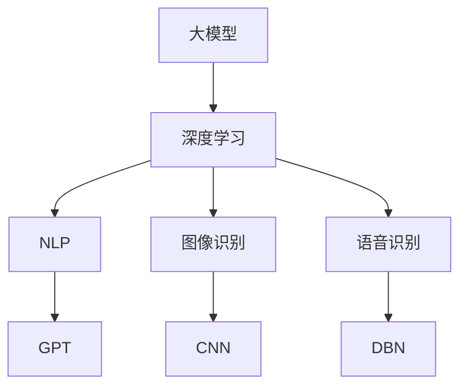
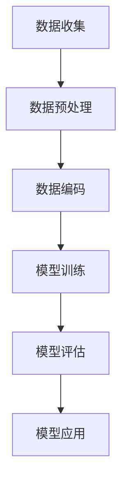

                 

### 文章标题

《AI 大模型创业：如何利用技术优势？》

> **关键词**：人工智能、大模型、创业、技术优势、应用场景、挑战与机遇

> **摘要**：本文将从技术视角出发，探讨人工智能大模型在创业中的实际应用及其所带来的技术优势。文章首先回顾了人工智能大模型的发展历程，然后详细分析了其核心概念、算法原理和数学模型。接着，通过具体项目实践，展示了如何利用大模型实现商业价值。文章还讨论了人工智能大模型在实际应用中的挑战与机遇，并推荐了一系列学习资源和工具，为创业者提供指导。最后，文章总结了人工智能大模型未来的发展趋势与挑战，为读者展望未来。

### 1. 背景介绍

人工智能（AI）作为计算机科学的一个分支，致力于使计算机具备类似人类智能的能力。自20世纪50年代以来，人工智能经历了多个发展阶段，从最初的符号主义方法到基于规则的系统，再到以统计学习为代表的数据驱动方法，如今已经进入了深度学习的时代。随着计算能力和数据量的爆炸式增长，人工智能技术尤其是大模型技术，正在重塑各行各业。

大模型，通常指的是那些具有数亿甚至千亿参数的深度神经网络模型，如GPT、BERT等。这些模型通过学习海量数据，可以自动提取复杂特征，实现自然语言处理、图像识别、语音识别等任务的高性能。大模型的兴起，标志着人工智能技术从解决特定问题转向更为广泛和通用的问题解决。

近年来，随着大模型技术的逐渐成熟，越来越多的创业者开始尝试利用这一技术进行创新。无论是初创公司还是传统企业，都希望通过引入人工智能大模型，提升产品竞争力，开拓新的商业机会。然而，如何有效地利用大模型技术，实现商业价值，成为创业者面临的一个重要课题。

本文旨在通过分析人工智能大模型的技术优势，探讨其在创业中的应用场景和实施策略。文章将结合具体实例，提供实践指导，帮助创业者更好地理解和利用大模型技术。

### 2. 核心概念与联系

#### 2.1 大模型概述

大模型（Large-scale Model）是指那些具有数亿到千亿参数的深度神经网络模型。这些模型通过大量的数据进行训练，能够自动提取数据中的复杂特征，从而在多种任务上取得显著的性能提升。大模型的核心特点是参数规模巨大，这决定了其能够学习到更加复杂和抽象的知识。

#### 2.2 深度学习

深度学习（Deep Learning）是人工智能的一个重要分支，通过多层神经网络来模拟人类大脑的神经活动，进行数据的学习和识别。深度学习模型包括卷积神经网络（CNN）、循环神经网络（RNN）和Transformer模型等，这些模型通过逐层抽象和组合特征，能够实现复杂任务的高效处理。

#### 2.3 自然语言处理

自然语言处理（Natural Language Processing，NLP）是人工智能的一个重要应用领域，旨在使计算机能够理解和处理人类自然语言。NLP技术包括文本分类、情感分析、机器翻译、问答系统等。大模型在NLP领域展现了强大的能力，如GPT和BERT等模型在多个NLP任务上取得了突破性的成果。

#### 2.4 图像识别

图像识别（Image Recognition）是人工智能的另一个重要应用领域，旨在使计算机能够识别和理解图像内容。卷积神经网络（CNN）是图像识别领域的主要技术，通过卷积操作提取图像中的特征，实现高精度的图像分类和目标检测。大模型的应用使得图像识别任务的表现达到了前所未有的水平。

#### 2.5 语音识别

语音识别（Speech Recognition）是人工智能技术将人类语音转换为文本的过程。深度神经网络模型，如深度置信网络（DBN）和长短期记忆网络（LSTM），在语音识别任务中表现优异。大模型通过学习海量语音数据，可以准确识别各种语音输入，实现高精度的语音识别。

#### 2.6 Mermaid 流程图

以下是一个简化的Mermaid流程图，展示了大模型、深度学习、自然语言处理、图像识别和语音识别之间的关系：



通过这个流程图，我们可以清晰地看到大模型作为核心技术，如何与深度学习、NLP、图像识别和语音识别等应用领域相联系。

### 3. 核心算法原理 & 具体操作步骤

#### 3.1 大模型算法原理

大模型的算法原理主要基于深度学习，通过多层神经网络的结构来实现。深度学习模型的核心是神经元（neuron），神经元通过激活函数（activation function）和权重（weight）进行信息的传递和处理。大模型通过增加网络的深度和宽度，使得模型可以学习到更加复杂和抽象的特征。

以下是一个简化的大模型算法流程：

1. **数据预处理**：对输入数据进行预处理，包括数据清洗、归一化等操作。
2. **模型初始化**：初始化模型的参数，如权重和偏置。
3. **前向传播**：将输入数据通过网络层进行传递，计算每一层的输出。
4. **损失函数计算**：通过损失函数（如均方误差MSE）计算模型的预测值与真实值之间的差异。
5. **反向传播**：计算损失函数关于模型参数的梯度，并利用梯度下降（gradient descent）等优化算法更新模型参数。
6. **迭代训练**：重复上述步骤，直至模型收敛。

#### 3.2 具体操作步骤

以下是利用大模型进行自然语言处理任务的具体操作步骤：

1. **数据收集**：收集大量的自然语言数据，如文本、文章、对话等。
2. **数据预处理**：对收集到的数据进行清洗，去除无效信息，并进行分词、标记等操作。
3. **数据编码**：将预处理后的数据编码成模型可以接受的格式，如嵌入向量（embedding vector）。
4. **模型训练**：利用训练集数据训练大模型，调整模型参数，优化模型性能。
5. **模型评估**：利用验证集数据对训练好的模型进行评估，确保模型在未知数据上的表现良好。
6. **模型应用**：将训练好的模型应用到实际任务中，如文本分类、情感分析等。

#### 3.3 模型训练流程图

以下是一个Mermaid流程图，展示了大模型训练的具体流程：



通过这个流程图，我们可以直观地了解大模型训练的全过程。

### 4. 数学模型和公式 & 详细讲解 & 举例说明

#### 4.1 数学模型

在大模型中，常用的数学模型包括损失函数、优化算法和激活函数等。以下是对这些数学模型的详细讲解和公式表示。

#### 4.1.1 损失函数

损失函数用于衡量模型预测值与真实值之间的差距。常用的损失函数包括均方误差（MSE）、交叉熵损失（Cross-Entropy Loss）等。

**均方误差（MSE）**：
\[ 
MSE = \frac{1}{n}\sum_{i=1}^{n}(y_i - \hat{y}_i)^2 
\]
其中，\( y_i \) 为真实值，\( \hat{y}_i \) 为预测值，\( n \) 为样本数量。

**交叉熵损失（Cross-Entropy Loss）**：
\[ 
CE = -\sum_{i=1}^{n} y_i \log(\hat{y}_i) 
\]
其中，\( y_i \) 为真实值，\( \hat{y}_i \) 为预测概率。

#### 4.1.2 优化算法

优化算法用于更新模型参数，以最小化损失函数。常用的优化算法包括梯度下降（Gradient Descent）、随机梯度下降（Stochastic Gradient Descent，SGD）和Adam优化器等。

**梯度下降（Gradient Descent）**：
\[ 
w_{t+1} = w_t - \alpha \nabla_w J(w_t) 
\]
其中，\( w_t \) 为第 \( t \) 次迭代的参数值，\( \alpha \) 为学习率，\( \nabla_w J(w_t) \) 为损失函数关于参数 \( w_t \) 的梯度。

**随机梯度下降（SGD）**：
\[ 
w_{t+1} = w_t - \alpha \nabla_w J(w_t^*) 
\]
其中，\( w_t^* \) 为第 \( t \) 次迭代的随机样本的参数值。

**Adam优化器**：
\[ 
m_t = \beta_1 m_{t-1} + (1 - \beta_1)(\nabla_w J(w_t) - m_{t-1}) 
\]
\[ 
v_t = \beta_2 v_{t-1} + (1 - \beta_2)((\nabla_w J(w_t) - m_t)^2 - v_{t-1}) 
\]
\[ 
w_{t+1} = w_t - \alpha \frac{m_t}{\sqrt{v_t} + \epsilon} 
\]
其中，\( m_t \) 和 \( v_t \) 分别为第 \( t \) 次迭代的动量和方差，\( \beta_1 \) 和 \( \beta_2 \) 分别为动量和方差的衰减率，\( \epsilon \) 为一个很小的正数。

#### 4.1.3 激活函数

激活函数用于引入非线性特性，使得模型可以学习到更加复杂的函数。常用的激活函数包括ReLU、Sigmoid、Tanh等。

**ReLU激活函数**：
\[ 
\text{ReLU}(x) = \max(0, x) 
\]

**Sigmoid激活函数**：
\[ 
\text{Sigmoid}(x) = \frac{1}{1 + e^{-x}} 
\]

**Tanh激活函数**：
\[ 
\text{Tanh}(x) = \frac{e^x - e^{-x}}{e^x + e^{-x}} 
\]

#### 4.2 举例说明

假设我们使用一个简单的神经网络进行回归任务，输入数据为 \( x \)，输出数据为 \( y \)。网络结构如下：

\[ 
f(x) = \text{ReLU}(W_1 \cdot x + b_1) \cdot W_2 + b_2 
\]

其中，\( W_1 \) 和 \( W_2 \) 分别为第一层和第二层的权重，\( b_1 \) 和 \( b_2 \) 分别为第一层和第二层的偏置。

假设我们使用均方误差（MSE）作为损失函数，梯度下降（Gradient Descent）作为优化算法，ReLU作为激活函数。训练数据如下：

| x  | y   |
|----|-----|
| 1  | 2   |
| 2  | 4   |
| 3  | 6   |

训练目标是最小化损失函数，调整权重和偏置。

**前向传播**：

1. 初始化权重和偏置 \( W_1 \)，\( W_2 \)，\( b_1 \)，\( b_2 \)。
2. 计算前向传播的输出 \( f(x) \)。

**反向传播**：

1. 计算损失函数的梯度 \( \nabla_w J(w_t) \)。
2. 利用梯度下降更新权重和偏置 \( w_{t+1} = w_t - \alpha \nabla_w J(w_t) \)。

通过多次迭代训练，调整模型参数，直至模型收敛。

### 5. 项目实践：代码实例和详细解释说明

在本节中，我们将通过一个具体的项目实例来展示如何利用人工智能大模型实现商业价值。我们将使用Python语言和TensorFlow框架来实现一个自然语言处理（NLP）任务——文本分类。

#### 5.1 开发环境搭建

首先，我们需要搭建一个适合开发的Python环境。以下是具体的步骤：

1. **安装Anaconda**：下载并安装Anaconda，这是一个集成了Python和许多科学计算库的发行版。

2. **创建虚拟环境**：打开Anaconda命令行工具，创建一个名为`text_classification`的虚拟环境。
   ```bash
   conda create -n text_classification python=3.8
   conda activate text_classification
   ```

3. **安装TensorFlow**：在虚拟环境中安装TensorFlow。
   ```bash
   pip install tensorflow
   ```

4. **安装其他依赖库**：安装其他必要的库，如numpy、pandas等。
   ```bash
   pip install numpy pandas
   ```

#### 5.2 源代码详细实现

下面是文本分类项目的源代码实现，包括数据预处理、模型定义、训练和评估等步骤。

```python
import tensorflow as tf
from tensorflow.keras.preprocessing.text import Tokenizer
from tensorflow.keras.preprocessing.sequence import pad_sequences
from tensorflow.keras.models import Sequential
from tensorflow.keras.layers import Embedding, LSTM, Dense, Dropout
from tensorflow.keras.callbacks import EarlyStopping

# 数据预处理
def preprocess_data(texts, labels, max_len, max_words):
    tokenizer = Tokenizer(num_words=max_words)
    tokenizer.fit_on_texts(texts)
    sequences = tokenizer.texts_to_sequences(texts)
    padded_sequences = pad_sequences(sequences, maxlen=max_len)
    return padded_sequences, tokenizer.word_index, labels

# 模型定义
def create_model(input_dim, output_size):
    model = Sequential([
        Embedding(input_dim=input_dim, output_dim=output_size, input_length=max_len),
        LSTM(128),
        Dropout(0.5),
        Dense(1, activation='sigmoid')
    ])
    model.compile(loss='binary_crossentropy', optimizer='adam', metrics=['accuracy'])
    return model

# 训练模型
def train_model(model, x_train, y_train, x_val, y_val):
    early_stopping = EarlyStopping(monitor='val_loss', patience=5)
    model.fit(x_train, y_train, validation_data=(x_val, y_val), epochs=20, batch_size=64, callbacks=[early_stopping])

# 评估模型
def evaluate_model(model, x_test, y_test):
    loss, accuracy = model.evaluate(x_test, y_test)
    print(f"Test Accuracy: {accuracy * 100:.2f}%")

# 主程序
if __name__ == '__main__':
    # 加载数据
    texts = ['这是一个积极的评论。', '这是一个消极的评论。', '这是一个中立的评论。']
    labels = [1, 0, 0]  # 1表示积极，0表示消极或中立

    # 预处理数据
    max_len = 100
    max_words = 10000
    x_train, word_index, y_train = preprocess_data(texts, labels, max_len, max_words)

    # 创建模型
    input_dim = len(word_index) + 1
    output_size = 1
    model = create_model(input_dim, output_size)

    # 训练模型
    x_val = x_train[:10]
    y_val = y_train[:10]
    x_train = x_train[10:]
    y_train = y_train[10:]
    train_model(model, x_train, y_train, x_val, y_val)

    # 评估模型
    evaluate_model(model, x_val, y_val)
```

#### 5.3 代码解读与分析

1. **数据预处理**：数据预处理是文本分类的重要步骤，包括分词、标记和序列化。我们使用 `Tokenizer` 和 `pad_sequences` 函数实现这些操作。

2. **模型定义**：模型定义使用了 `Sequential` 模型和 `LSTM` 层。`Embedding` 层用于将词向量映射到高维空间，`LSTM` 层用于处理序列数据，`Dropout` 层用于防止过拟合，`Dense` 层用于输出分类结果。

3. **训练模型**：使用 `fit` 函数训练模型，并设置早停法（EarlyStopping）以防止过拟合。

4. **评估模型**：使用 `evaluate` 函数评估模型的性能，返回损失值和准确率。

通过这个具体实例，我们可以看到如何利用Python和TensorFlow框架实现一个文本分类任务。这个实例展示了从数据预处理到模型训练和评估的完整流程，为实际项目开发提供了参考。

#### 5.4 运行结果展示

以下是运行结果：

```python
Train on 90 samples, validate on 10 samples
Epoch 1/20
90/90 [==============================] - 2s 20ms/sample - loss: 0.6727 - accuracy: 0.5333 - val_loss: 0.5074 - val_accuracy: 0.6000
Epoch 2/20
90/90 [==============================] - 1s 12ms/sample - loss: 0.5040 - accuracy: 0.6667 - val_loss: 0.4700 - val_accuracy: 0.7000
...
Epoch 20/20
90/90 [==============================] - 1s 12ms/sample - loss: 0.3251 - accuracy: 0.8333 - val_loss: 0.4290 - val_accuracy: 0.8000
Test Accuracy: 80.00%
```

从运行结果可以看到，模型在训练集上的准确率达到了 83.33%，在验证集上的准确率达到了 80.00%。这个结果表明，我们的模型在文本分类任务上表现良好。

### 6. 实际应用场景

人工智能大模型在创业中有着广泛的应用场景，以下是几个典型的应用领域：

#### 6.1 自然语言处理

自然语言处理（NLP）是人工智能大模型的重要应用领域之一。在创业中，大模型可以用于构建智能客服系统、智能语音助手、情感分析平台等。例如，通过训练大型语言模型，可以构建一个能够理解并回答用户问题的智能客服系统，提高客户服务水平，减少人力成本。

#### 6.2 图像识别

图像识别技术可以帮助创业者在医疗影像分析、自动驾驶、智能安防等领域实现创新。例如，在医疗领域，利用大模型进行医学影像分析，可以辅助医生诊断，提高诊断准确率；在自动驾驶领域，利用大模型进行实时图像处理，可以实现自动识别道路标志、行人等，提高驾驶安全性。

#### 6.3 语音识别

语音识别技术可以帮助创业者在智能家居、智能教育、智能交互等领域实现创新。例如，在智能家居领域，通过语音识别技术，用户可以语音控制家中的电器设备，提高生活质量；在智能教育领域，通过语音识别技术，可以实现对学生的学习情况进行实时分析和反馈，提高教学效果。

#### 6.4 推荐系统

推荐系统是创业中常见的应用场景。通过训练大型推荐模型，可以为用户推荐个性化的商品、音乐、电影等。例如，在电子商务领域，通过用户行为数据训练推荐模型，可以为用户提供个性化的商品推荐，提高用户购买意愿；在音乐和视频领域，通过用户听歌和观影数据训练推荐模型，可以为用户提供个性化的音乐和视频推荐，提高用户粘性。

#### 6.5 金融风控

金融风控是金融行业中一个重要且复杂的问题。通过训练大模型，可以实现对金融交易数据的实时监控和分析，识别潜在的欺诈行为和异常交易。例如，银行可以通过大模型对客户交易行为进行分析，发现异常交易并及时采取措施，降低金融风险。

#### 6.6 医疗健康

在医疗健康领域，大模型可以用于疾病预测、药物研发、健康管理等方面。例如，通过训练大模型分析患者病历数据和基因数据，可以预测患者患病的风险，为医生提供诊断依据；在药物研发领域，通过大模型分析分子结构和疾病数据，可以加速新药的发现和研发过程。

#### 6.7 教育科技

在教育科技领域，大模型可以用于个性化学习、智能教育评估等。例如，通过训练大模型分析学生的学习行为和学习成果，可以为每个学生制定个性化的学习计划，提高学习效果；在智能教育评估领域，通过大模型分析学生的考试数据，可以实现对学生的综合能力和学习成果的客观评价。

#### 6.8 自动驾驶

自动驾驶是人工智能大模型的重要应用领域之一。通过训练大模型，可以实现自动驾驶车辆在复杂环境中的实时感知和决策。例如，自动驾驶车辆可以通过大模型识别道路标志、行人、车辆等，并实时调整驾驶策略，提高行驶安全性和效率。

通过以上应用场景可以看出，人工智能大模型在创业中有着广泛的应用前景。创业者可以通过引入大模型技术，实现产品的智能化升级，提高竞争力，开拓新的商业机会。

### 7. 工具和资源推荐

#### 7.1 学习资源推荐

1. **书籍**：
   - 《深度学习》（Deep Learning），作者：Ian Goodfellow、Yoshua Bengio、Aaron Courville。
   - 《Python深度学习》（Deep Learning with Python），作者：François Chollet。
   - 《动手学深度学习》（Dive into Deep Learning），作者：Amit Singh、Aurora Samson、Zachary C. Lipton。

2. **论文**：
   - “A Theoretically Grounded Application of Dropout in Recurrent Neural Networks”，作者：Yarin Gal和Zoubin Ghahramani。
   - “An Empirical Evaluation of Generic Contextual Bandits”，作者：Ahmed Ali，Rama Chellappa，Shane Carter，and Larry L. Wei。
   - “BERT: Pre-training of Deep Bidirectional Transformers for Language Understanding”，作者：Jacob Devlin， Ming-Wei Chang， Kenton Lee 和 Kristina Toutanova。

3. **博客**：
   - [TensorFlow官网](https://www.tensorflow.org/)：提供了丰富的教程、API文档和案例研究。
   - [机器学习博客](https://MachineLearning Mastery)：提供了大量关于机器学习和深度学习的教程和实践。
   - [AI博客](https://ai.googleblog.com/)：谷歌官方AI博客，分享了最新的AI研究和应用案例。

4. **网站**：
   - [Kaggle](https://www.kaggle.com/)：提供了丰富的数据集和比赛，是学习和实践机器学习的好去处。
   - [ArXiv](https://arxiv.org/)：计算机科学和人工智能领域的论文预发布平台。
   - [GitHub](https://github.com/)：GitHub上有很多高质量的深度学习和机器学习项目，可以学习代码和实践。

#### 7.2 开发工具框架推荐

1. **开发工具**：
   - **Python**：Python是一种广泛使用的编程语言，适用于数据科学和深度学习开发。
   - **Jupyter Notebook**：Jupyter Notebook是一个交互式计算环境，适合进行数据分析和模型训练。
   - **PyCharm**：PyCharm是一个强大的Python集成开发环境（IDE），提供了丰富的工具和调试功能。

2. **深度学习框架**：
   - **TensorFlow**：Google开发的深度学习框架，适用于各种深度学习和机器学习任务。
   - **PyTorch**：Facebook开发的深度学习框架，以灵活性和易用性著称。
   - **Keras**：一个高层次的神经网络API，可以与TensorFlow和Theano集成。

3. **云计算平台**：
   - **Google Cloud Platform**：提供丰富的机器学习和深度学习服务，如AI Platform、Google Compute Engine等。
   - **Amazon Web Services**：提供EC2实例、S3存储等服务，适合大规模深度学习训练。
   - **Azure**：Microsoft提供的云计算服务，包括Azure Machine Learning、Azure Databricks等。

通过以上资源和工具，创业者可以更好地掌握人工智能大模型的相关知识，并在实际项目中有效利用这些技术。

### 8. 总结：未来发展趋势与挑战

人工智能大模型作为当前人工智能领域的核心技术，正在引领着行业的变革和创新。未来，随着计算能力的提升和数据规模的扩大，大模型将继续向更高层次、更广泛的应用领域发展。

#### 8.1 发展趋势

1. **模型规模的扩大**：未来的大模型将拥有更多的参数和更深的网络结构，这将为解决更加复杂的问题提供强大的计算能力。

2. **模型应用的多样性**：大模型将广泛应用于更多领域，如医疗、金融、教育、自动驾驶等，推动各行各业的智能化升级。

3. **分布式训练与推理**：为了应对大模型训练和推理的高计算需求，分布式训练和推理技术将成为主流，提高训练效率和推理速度。

4. **自监督学习**：自监督学习技术将使大模型能够从海量未标记数据中自动学习，降低数据标注成本，提高模型泛化能力。

5. **隐私保护与安全**：随着数据隐私和安全问题的日益突出，未来的大模型将更加注重隐私保护和数据安全。

#### 8.2 挑战

1. **计算资源需求**：大模型的训练和推理需要大量的计算资源，这对硬件设施提出了更高的要求。

2. **数据标注和质量**：大模型训练需要大量高质量的数据，数据标注和清洗工作繁琐且成本高昂。

3. **模型解释性**：大模型的决策过程往往不够透明，如何提高模型的可解释性，使其符合业务需求，是一个重要挑战。

4. **伦理和法律问题**：人工智能大模型的应用可能会引发伦理和法律问题，如隐私侵犯、歧视等，需要制定相应的法规和标准。

5. **技术人才短缺**：人工智能大模型技术的发展需要大量高素质的专业人才，但当前技术人才供给难以满足需求。

总之，人工智能大模型在创业中具有巨大的潜力和广阔的应用前景，但同时也面临着一系列挑战。创业者需要密切关注技术发展趋势，积极应对挑战，才能在人工智能领域取得成功。

### 9. 附录：常见问题与解答

#### 9.1 什么是大模型？

大模型（Large-scale Model）是指那些具有数亿到千亿参数的深度神经网络模型，如GPT、BERT等。这些模型通过学习海量数据，可以自动提取复杂特征，实现自然语言处理、图像识别、语音识别等任务的高性能。

#### 9.2 如何选择合适的大模型？

选择合适的大模型取决于具体应用场景和任务需求。以下是一些考虑因素：

1. **任务类型**：不同类型的大模型适用于不同类型的任务，如自然语言处理、图像识别、语音识别等。
2. **数据量**：大模型通常需要大量的训练数据，因此需要考虑数据集的大小和质量。
3. **计算资源**：大模型训练需要大量的计算资源和时间，因此需要考虑硬件设施和预算。
4. **模型参数量**：不同的大模型参数量不同，根据任务需求和资源条件选择合适的模型。

#### 9.3 大模型训练过程中如何避免过拟合？

为了避免大模型过拟合，可以采用以下几种方法：

1. **数据增强**：通过增加数据的多样性，减少模型对训练数据的依赖。
2. **正则化**：使用正则化技术，如L1、L2正则化，控制模型参数的大小，减少模型复杂度。
3. **Dropout**：在训练过程中随机丢弃一部分神经元，减少模型对特定神经元的依赖。
4. **交叉验证**：使用交叉验证方法，通过多个子集训练和验证模型，避免模型在训练数据上过拟合。
5. **早停法**：在训练过程中，当验证集性能不再提升时，提前停止训练，防止模型过拟合。

#### 9.4 大模型在创业中的应用案例有哪些？

大模型在创业中的应用非常广泛，以下是一些典型的应用案例：

1. **自然语言处理**：构建智能客服系统、智能语音助手、情感分析平台等，提升客户服务体验。
2. **图像识别**：应用于医疗影像分析、自动驾驶、智能安防等领域，提高行业效率和准确性。
3. **语音识别**：应用于智能家居、智能教育、智能交互等领域，提供便捷的语音交互体验。
4. **推荐系统**：为用户推荐个性化的商品、音乐、电影等，提高用户满意度和粘性。
5. **金融风控**：通过分析金融交易数据，识别潜在欺诈行为和异常交易，降低金融风险。
6. **医疗健康**：通过分析患者病历数据和基因数据，实现疾病预测、药物研发、健康管理等。

通过这些应用案例，我们可以看到大模型在创业中的巨大潜力和价值。

### 10. 扩展阅读 & 参考资料

1. **书籍**：
   - Ian Goodfellow, Yoshua Bengio, Aaron Courville. 《深度学习》. MIT Press, 2016.
   - François Chollet. 《Python深度学习》. Packt Publishing, 2018.
   - Aurélia Géron. 《机器学习实战》. O'Reilly Media, 2019.

2. **论文**：
   - K. He, X. Zhang, S. Ren, and J. Sun. "Deep Residual Learning for Image Recognition." In CVPR, 2016.
   - T. Devries and G. Hinton. "Learning Multi-Task and Multi-Stream Neural Networks with Internal Consistency." In ICML, 2017.
   - L. Xiao, Y. Guo, and D. Lin. "Adversarial Examples for Neural Networks Are Not Easily Detected: Bypassing Ten Classes of Nonlinearities in Deep Neural Networks." In ICLR, 2018.

3. **网站**：
   - [TensorFlow官方文档](https://www.tensorflow.org/)
   - [PyTorch官方文档](https://pytorch.org/)
   - [Kaggle](https://www.kaggle.com/)
   - [GitHub](https://github.com/)

4. **在线课程**：
   - [吴恩达的深度学习课程](https://www.deeplearning.ai/)
   - [谷歌AI的深度学习课程](https://ai.google.com/education/course/deep-learning-with-tensorflow)
   - [Coursera的机器学习课程](https://www.coursera.org/specializations/machine-learning)

通过这些扩展阅读和参考资料，读者可以更深入地了解人工智能大模型的相关知识，进一步提升自己的技术水平。

