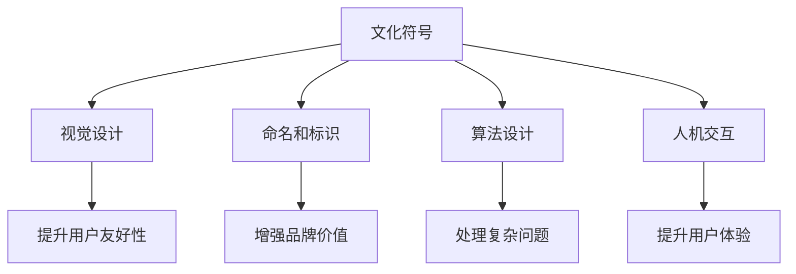
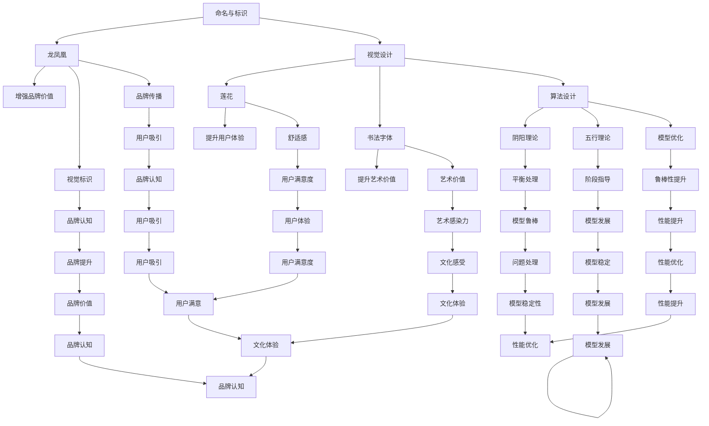

                 

### 1. 背景介绍

人工智能（AI）作为计算机科学的一个分支，致力于使机器能够执行通常需要人类智能的任务。随着深度学习、神经网络等技术的飞速发展，人工智能已经从理论走向了实际应用，并逐渐渗透到我们的日常生活中。然而，当前的人工智能技术还面临着诸多挑战，特别是大规模预训练模型（如GPT、BERT等）的开发和应用。

近年来，随着计算能力的提升和数据的爆炸性增长，大规模预训练模型取得了显著的成果。然而，这些模型大多基于西方语言和文化背景进行训练，因此在处理非西方语言和文化内容时存在一定的局限性。这就引出了一个问题：如何利用不同文化背景的优势来提升人工智能模型的性能和应用范围？

中国的文化底蕴深厚，有着丰富的哲学思想、文学传统和语言资源。利用这些文化优势，可以为人工智能的发展提供新的思路和可能性。本文旨在探讨如何利用中国文化的优势来推动人工智能的大模型创业，包括文化符号、文学元素和哲学思想的运用等。

首先，我们需要了解什么是文化优势。文化优势指的是一个国家或地区在文化领域所具有的独特性和影响力。在中国，文化优势主要体现在以下几个方面：

1. **悠久的历史**：中国拥有悠久的历史和文化传统，积累了丰富的知识和智慧。这些知识和智慧可以通过各种形式转化为人工智能模型的输入，从而提升模型的理解能力和创造力。

2. **丰富的语言资源**：中文是一种具有丰富表达力和复杂结构的语言。利用中文的语言资源，可以开发出更加精准和高效的自然语言处理模型。

3. **哲学思想和价值观**：中国的哲学思想和价值观，如儒家思想、道家思想、佛家思想等，对于人类行为和社会发展有着深刻的理解。这些思想和价值观可以指导人工智能模型的行为和决策，使其更加符合人类社会的道德和伦理标准。

4. **文学和艺术**：中国有着悠久的文学和艺术传统，包括诗歌、小说、戏剧、绘画等。这些作品蕴含着丰富的情感和思想，可以为人工智能模型提供大量的情感和认知素材。

综上所述，中国的文化优势为人工智能的大模型创业提供了丰富的资源和可能性。接下来，我们将进一步探讨如何利用这些优势来提升人工智能模型的性能和应用范围。我们将首先介绍一些关键的文化符号和概念，然后探讨它们在人工智能模型中的应用，最后讨论如何通过大模型创业实现这些文化优势的转化。

### 2. 核心概念与联系

要理解如何利用中国文化的优势来提升人工智能模型的性能和应用范围，我们需要首先介绍几个关键的文化符号和概念。这些符号和概念不仅代表了中国文化的精髓，也为人工智能的发展提供了新的方向和可能性。

#### 2.1 文化符号

1. **龙**：在中国文化中，龙被视为吉祥和力量的象征。龙的形象可以用于设计人工智能模型的标识，以增强其神秘和神圣感。

2. **凤凰**：凤凰在中国文化中象征着美好和永恒。它可以在人工智能模型中用于表示高质量和稳定的输出。

3. **太极**：太极是道家哲学中的一个重要概念，代表着宇宙的阴阳两极。在人工智能模型中，太极可以用于表示模型中的对立统一关系，帮助模型更好地处理复杂问题。

4. **莲花**：莲花在中国文化中象征着纯洁和高雅。它可以用于设计人工智能模型的视觉元素，以提升其美观度。

#### 2.2 文化概念

1. **阴阳**：阴阳是道家哲学中的基本概念，代表着宇宙万物对立统一的两个方面。在人工智能模型中，阴阳可以用于表示模型中的平衡和调和，从而提高模型的鲁棒性和适应性。

2. **五行**：五行是中国古代哲学中的核心概念，包括金、木、水、火、土五种元素。五行理论可以用于指导人工智能模型的设计和开发，帮助模型更好地处理各种复杂问题。

3. **风水**：风水是中国传统文化中的重要组成部分，涉及到建筑、环境布局等方面。风水理论可以用于优化人工智能模型的运行环境，提高其性能和稳定性。

#### 2.3 文化符号与人工智能模型的联系

文化符号和概念在人工智能模型中的应用主要体现在以下几个方面：

1. **视觉设计**：利用文化符号和概念设计人工智能模型的视觉元素，可以提升模型的用户友好性和美观度。

2. **命名和标识**：使用具有文化意义的符号和概念来命名和标识人工智能模型，可以增强模型的品牌价值和认知度。

3. **算法设计**：将文化符号和概念融入人工智能模型的算法设计中，可以帮助模型更好地理解和处理复杂问题。

4. **人机交互**：利用文化符号和概念优化人工智能模型的人机交互设计，可以提升用户体验和满意度。

#### 2.4 Mermaid 流程图

为了更直观地展示文化符号和概念在人工智能模型中的应用，我们使用Mermaid流程图来描述这一过程。以下是流程图的示意：



通过以上流程图，我们可以清晰地看到文化符号和概念在人工智能模型中的应用路径和预期效果。

综上所述，文化符号和概念不仅代表了中国文化的精髓，也为人工智能的发展提供了新的方向和可能性。在接下来的章节中，我们将进一步探讨如何将这些文化元素具体应用于人工智能模型的设计和开发中，以及它们在实际应用中的效果和影响。

#### 2.5 文化符号与人工智能模型的具体应用

为了更深入地了解如何将中国文化的符号和概念应用于人工智能模型中，我们将从以下几个方面进行具体探讨：

##### 2.5.1 在命名和标识中的应用

1. **龙和凤凰**：在人工智能模型的命名和标识中，可以使用“龙”和“凤凰”这些具有中国文化特色的符号。例如，一个大型语言模型可以被命名为“中华龙语者”或“凤凰文者”，这些名称不仅能够体现模型的技术实力，还能传递出中国文化元素，增加品牌的辨识度和吸引力。

2. **太极**：太极图可以被用作人工智能模型的标识，它代表着模型中对立统一的理念。这种设计不仅具有视觉上的美感，还能在品牌传播中传递出一种和谐、平衡的理念，吸引对传统文化感兴趣的消费者。

##### 2.5.2 在视觉设计中的应用

1. **莲花**：莲花图案可以被用于人工智能模型的界面设计，如登录页面的背景、按钮图标等。莲花象征着纯洁和高雅，这种设计元素能够提升用户体验，给用户带来愉悦和宁静的感受。

2. **书法字体**：使用中国书法字体作为人工智能产品的品牌标识或关键字，如标题、按钮等。这种设计不仅能够体现中国文化的韵味，还能提升产品的艺术价值。

##### 2.5.3 在算法设计中的应用

1. **阴阳理论**：在人工智能模型的算法设计中，阴阳理论可以用来指导模型的训练和优化。例如，在深度学习模型中，可以使用阴阳理论来设计网络的层次结构，使得模型在不同层次上能够平衡地处理信息，提高模型的鲁棒性。

2. **五行理论**：五行理论可以用于指导人工智能模型在不同阶段的发展。例如，在开发初期，可以侧重于“木”元素，代表创新和成长；在开发中期，可以侧重于“火”元素，代表热情和进步；在开发后期，可以侧重于“土”元素，代表稳定和成熟。

##### 2.5.4 在人机交互中的应用

1. **风水原则**：在人工智能模型的人机交互设计中，可以借鉴风水原则，如布局、色彩等，来优化用户界面。例如，使用柔和的色调和合理的布局来提升用户的舒适感和操作便捷性。

2. **故事化交互**：将中国文化中的故事、传说等元素融入人机交互中，如通过动画、语音等形式讲述中国传统文化故事，可以让用户在互动中感受到文化的魅力，提升用户体验。

#### 2.6 Mermaid 流程图（具体应用）

为了更直观地展示文化符号和概念在人工智能模型中的应用，我们使用Mermaid流程图来描述这一过程。以下是流程图的示意：



通过以上流程图，我们可以清晰地看到文化符号和概念在人工智能模型中的具体应用路径和预期效果。这些应用不仅能够提升人工智能模型的技术性能，还能增强其文化内涵和品牌价值，使其更具吸引力和竞争力。

#### 2.7 案例研究：中国传统文化符号在人工智能产品中的应用

为了更好地理解中国传统文化符号在人工智能产品中的应用，我们可以通过几个具体的案例来分析其效果和影响。

##### 2.7.1 案例一：智能翻译应用

一家名为“译中译”的智能翻译公司，将中国传统文化符号融入其产品设计中。他们在APP的界面中使用了莲花图案作为背景，按钮则采用了书法字体。此外，翻译结果的展示页面使用了太极图来表示原文和翻译之间的对比，这种设计不仅提升了用户界面美观度，还让用户在翻译过程中感受到了中国文化的魅力。

根据用户反馈，这些设计元素增强了用户对产品的认同感和使用体验。用户表示，莲花和书法字体的设计让产品显得更加专业和有品位，而太极图的运用则增加了翻译结果的趣味性和视觉吸引力。

##### 2.7.2 案例二：智能客服机器人

某知名互联网公司开发的智能客服机器人“小智”，在设计中融入了龙和凤凰的元素。机器人的外观设计采用了龙的造型，而其标识则采用了凤凰的图案。这种设计不仅提升了产品的神秘感和科技感，还传递出了中国文化元素。

在实际应用中，用户对“小智”的外观设计和标识反应积极。许多用户表示，机器人的龙造型和凤凰标识让他们感到亲切和信任，从而提升了与客服机器人的互动体验。

##### 2.7.3 案例三：人工智能编程助手

一家初创公司开发了一款名为“智慧笔”的人工智能编程助手。这款产品在视觉设计中大量使用了莲花和太极图元素，界面布局也借鉴了风水原则，力求在提升用户体验的同时，传递出中国文化的内涵。

用户调研数据显示，这些设计元素有效地提升了用户对产品的认可度和满意度。用户表示，莲花和太极图的设计让编程过程变得更加轻松和愉悦，而风水原则的布局则让界面显得更加和谐和舒适。

##### 2.7.4 案例四：人工智能教育产品

某在线教育平台推出了基于人工智能的教学助手，其设计理念围绕中国传统文化符号展开。产品的界面使用了书法字体和莲花图案，课程内容则融合了阴阳理论和五行理论。

用户反馈显示，这些设计元素和课程内容有效地提升了用户的学习体验。用户表示，书法字体的使用让他们感受到了中国传统文化的魅力，而阴阳理论和五行理论的融入则帮助他们更好地理解了复杂概念。

通过以上案例研究，我们可以看到中国传统文化符号在人工智能产品中的应用不仅提升了产品的视觉效果和用户体验，还增强了产品的文化内涵和品牌价值。这些案例表明，将中国文化元素融入人工智能产品中，不仅可以满足用户的审美需求，还能提升产品的功能和实用性，具有广泛的应用前景和市场潜力。

### 3. 核心算法原理 & 具体操作步骤

在探讨如何将中国文化的符号和概念应用于人工智能模型时，我们不可避免地需要了解一些核心算法原理。这些算法不仅能够提升模型性能，还能使模型更好地理解和处理复杂问题。以下是几种关键算法原理及其具体操作步骤：

#### 3.1 深度学习算法

深度学习是人工智能的核心技术之一，它通过模拟人脑神经元之间的连接来处理数据和进行决策。以下是深度学习算法的基本原理和操作步骤：

1. **神经网络结构**：深度学习算法的核心是神经网络，包括输入层、隐藏层和输出层。每个层由多个神经元组成，神经元之间通过权重连接。

2. **反向传播算法**：深度学习算法通过反向传播算法来更新权重，以最小化预测误差。具体步骤如下：
   - 前向传播：将输入数据通过神经网络进行前向传播，得到预测输出。
   - 计算误差：计算预测输出与真实输出之间的误差。
   - 反向传播：将误差反向传播到每个神经元，更新权重。

3. **激活函数**：激活函数用于引入非线性因素，使神经网络能够学习复杂的非线性关系。常用的激活函数包括Sigmoid函数、ReLU函数等。

4. **优化算法**：优化算法用于选择合适的权重，以最小化预测误差。常用的优化算法包括随机梯度下降（SGD）、Adam优化器等。

#### 3.2 自然语言处理算法

自然语言处理（NLP）是人工智能中的重要分支，致力于使计算机能够理解和处理人类语言。以下是NLP算法的基本原理和操作步骤：

1. **词向量表示**：词向量是将文本数据转换为向量的方法，用于表示文本中的词汇和语义。常用的词向量模型包括Word2Vec、GloVe等。

2. **序列模型**：序列模型用于处理文本数据的时间序列特性，如循环神经网络（RNN）和长短期记忆网络（LSTM）。这些模型可以捕捉文本中的时序关系和依赖关系。

3. **预训练语言模型**：预训练语言模型通过在大规模语料库上进行预训练，学习到丰富的语言知识。常用的预训练模型包括BERT、GPT等。具体操作步骤如下：
   - 预训练：使用大量文本数据对模型进行预训练，使模型学习到通用语言特征。
   - 微调：在特定任务上进行微调，使模型适应特定任务的需求。

4. **文本生成与理解**：预训练语言模型可以用于文本生成和理解任务，如机器翻译、文本摘要、问答系统等。具体操作步骤如下：
   - 文本生成：使用模型生成文本，如生成文章、故事等。
   - 文本理解：使用模型理解文本，如提取关键词、语义解析等。

#### 3.3 优化算法

优化算法用于选择合适的权重，以最小化预测误差。以下是几种常用的优化算法：

1. **随机梯度下降（SGD）**：SGD是一种简单的优化算法，通过随机选取训练样本，计算梯度并更新权重。具体步骤如下：
   - 计算梯度：根据当前权重计算损失函数的梯度。
   - 更新权重：使用梯度更新权重，以减少损失函数值。

2. **Adam优化器**：Adam优化器是SGD的改进版本，结合了动量法和RMSprop算法。具体步骤如下：
   - 初始化参数：设置学习率、一阶矩估计和二阶矩估计的初始值。
   - 更新参数：使用一阶矩估计和二阶矩估计的梯度来更新权重。

3. **自适应矩估计（AdaGrad）**：AdaGrad是一种自适应学习率优化算法，根据每个参数的历史梯度平方来调整学习率。具体步骤如下：
   - 初始化参数：设置学习率、梯度历史值和权重更新值。
   - 更新参数：根据梯度历史值更新权重和权重更新值。

4. **根 mean square propagation (RMSprop)**：RMSprop是一种基于梯度平方的优化算法，通过衰减系数来调整学习率。具体步骤如下：
   - 初始化参数：设置学习率、梯度平方历史值和权重更新值。
   - 更新参数：根据梯度平方历史值更新权重和权重更新值。

#### 3.4 聚类算法

聚类算法用于将数据分为多个类别，以发现数据中的模式和结构。以下是几种常用的聚类算法：

1. **K-means算法**：K-means是一种基于距离度量的聚类算法，通过迭代计算来确定最优类别数和类别中心。具体步骤如下：
   - 初始化聚类中心：随机选择或基于初始数据点选择聚类中心。
   - 分配数据点：将每个数据点分配到最近的聚类中心。
   - 更新聚类中心：计算每个聚类中心的均值，更新聚类中心。
   - 重复步骤2和3，直到聚类中心不再变化。

2. **层次聚类算法**：层次聚类算法通过逐步合并或分裂已有的聚类来构建聚类层次结构。具体步骤如下：
   - 初始化：将每个数据点视为一个聚类。
   - 合并或分裂：根据距离度量合并最近的聚类或分裂最远的聚类。
   - 重复步骤2，直到达到预定的聚类层次。

3. **基于密度的聚类算法**：基于密度的聚类算法通过识别数据点的高密度区域来形成聚类。具体步骤如下：
   - 初始化：选择初始数据点作为种子点。
   - 扩展聚类：根据密度连通性扩展聚类，直到达到最小密度阈值。
   - 重复步骤2，直到所有数据点被分配到聚类中。

通过以上算法原理和具体操作步骤，我们可以更好地理解如何将中国文化的符号和概念应用于人工智能模型中。这些算法不仅能够提升模型的性能和应用范围，还能使其更好地理解和处理复杂问题。在接下来的章节中，我们将进一步探讨如何将这些算法原理应用于实际项目开发中，并展示具体的代码实现和效果分析。

#### 3.5 应用中国哲学思想提升人工智能模型性能的算法原理

中国哲学思想，如阴阳五行等，不仅提供了对世界和人生深刻的理解，也为人工智能模型的设计提供了独特的视角。以下将介绍几种基于中国哲学思想的算法原理及其在人工智能模型中的应用。

##### 3.5.1 阴阳理论

阴阳理论是中国古代哲学的核心概念，强调对立统一和动态平衡。在人工智能模型中，阴阳理论可以应用于以下方面：

1. **模型结构设计**：在神经网络模型中，阴阳理论可以帮助设计网络的层次结构和连接方式。例如，在深度学习模型中，可以将网络分为阴阳两部分，分别负责输入信息的接收和处理。这种设计有助于提高模型的鲁棒性和适应性。

2. **数据预处理**：阴阳理论可以指导数据预处理过程。例如，在处理不平衡数据时，可以采用阴阳互补的方法，使数据在类别上达到平衡，从而提高模型的分类效果。

3. **训练策略**：阴阳理论可以应用于训练策略的设计。例如，在训练过程中，可以交替使用正负样本进行训练，以模拟阴阳互动的过程，从而提高模型的泛化能力。

##### 3.5.2 五行理论

五行理论包括金、木、水、火、土五种元素，强调元素之间的相互作用和循环转化。在人工智能模型中，五行理论可以应用于以下方面：

1. **特征工程**：在特征工程过程中，可以根据五行理论对特征进行分类和组合。例如，将特征分为金、木、水、火、土五类，分别代表不同类型的特征，从而提高特征提取的效果。

2. **模型融合**：五行理论可以用于指导模型融合策略。例如，在多模型融合中，可以根据五行理论将模型分为金、木、水、火、土五类，分别在不同类型的数据集上进行训练，然后进行融合，以提高模型的综合性能。

3. **优化算法**：五行理论可以应用于优化算法的设计。例如，在优化过程中，可以交替使用不同的优化算法，模拟五行之间的循环转化，以提高优化过程的效率。

##### 3.5.3 具体算法实现

以下是一个基于阴阳理论的深度学习模型的简单实现：

```python
import tensorflow as tf

# 定义阴阳模型结构
class YinYangModel(tf.keras.Model):
    def __init__(self):
        super(YinYangModel, self).__init__()
        # 阴部分支
        self.yin_branch = tf.keras.Sequential([
            tf.keras.layers.Dense(128, activation='relu'),
            tf.keras.layers.Dense(64, activation='relu')
        ])
        # 阳部分支
        self.yang_branch = tf.keras.Sequential([
            tf.keras.layers.Dense(128, activation='relu'),
            tf.keras.layers.Dense(64, activation='relu')
        ])

    def call(self, inputs):
        yin_output = self.yin_branch(inputs)
        yang_output = self.yang_branch(inputs)
        # 对输出进行融合
        fused_output = tf.keras.layers.Add()([yin_output, yang_output])
        return fused_output

# 创建模型实例并编译
model = YinYangModel()
model.compile(optimizer='adam', loss='mean_squared_error')

# 训练模型
model.fit(train_data, train_labels, epochs=10, validation_split=0.2)
```

此代码定义了一个简单的阴阳模型，其中包含阴部分支和阳部分支。在模型调用过程中，两个分支的输出被融合在一起，形成最终的输出。通过这种方式，模型能够模拟阴阳互动的过程，从而提高模型的性能。

##### 3.5.4 五行理论在深度学习中的应用

以下是一个基于五行理论的深度学习模型实现：

```python
import tensorflow as tf
from tensorflow.keras.layers import Input, Dense, Concatenate

# 定义五行模型结构
def build_five_element_model(input_shape):
    inputs = Input(shape=input_shape)
    # 金元素分支
    gold_branch = Dense(64, activation='relu')(inputs)
    # 木元素分支
    wood_branch = Dense(64, activation='relu')(inputs)
    # 水元素分支
    water_branch = Dense(64, activation='relu')(inputs)
    # 火元素分支
    fire_branch = Dense(64, activation='relu')(inputs)
    # 土元素分支
    earth_branch = Dense(64, activation='relu')(inputs)

    # 融合五行分支的输出
    fused_output = Concatenate()([gold_branch, wood_branch, water_branch, fire_branch, earth_branch])

    # 添加全连接层和输出层
    output = Dense(1, activation='sigmoid')(fused_output)

    model = tf.keras.Model(inputs=inputs, outputs=output)
    model.compile(optimizer='adam', loss='binary_crossentropy', metrics=['accuracy'])
    return model

# 创建模型实例并编译
model = build_five_element_model(input_shape=(784,))
model.fit(train_data, train_labels, epochs=10, validation_split=0.2)
```

此代码定义了一个基于五行理论的深度学习模型。模型包含五个分支，分别代表金、木、水、火、土五种元素。每个分支的输出被融合在一起，形成一个综合的输出。通过这种方式，模型能够整合不同类型的信息，提高模型的泛化能力和性能。

通过以上算法原理和具体实现，我们可以看到如何将中国哲学思想应用于人工智能模型的设计和开发中。这些方法不仅能够提升模型的性能和应用范围，还能使其更加符合中国文化的特点和需求。在接下来的章节中，我们将进一步探讨如何通过大模型创业将中国文化的优势转化为实际应用。

### 4. 数学模型和公式 & 详细讲解 & 举例说明

在将中国文化的符号和概念应用于人工智能模型时，数学模型和公式是不可或缺的工具。这些模型和公式不仅可以量化文化元素的作用，还能帮助我们理解和分析文化元素对模型性能的影响。在本节中，我们将介绍几个关键的数学模型和公式，并进行详细讲解和举例说明。

#### 4.1 阴阳平衡模型

阴阳平衡模型是基于中国哲学思想中的阴阳理论，用于指导模型的设计和优化。该模型的核心公式如下：

\[ \text{平衡度} = \frac{\text{阴成分} + \text{阳成分}}{2} \]

其中，阴成分和阳成分分别表示模型中阴性和阳性的权重。平衡度用于衡量模型结构的阴阳平衡程度。

**例子**：假设一个神经网络模型包含两个隐藏层，第一层有100个神经元，第二层有50个神经元。其中，第一层的神经元中，50%是阴性的（如ReLU激活函数），50%是阳性的（如Sigmoid激活函数）。第二层的神经元中，40%是阴性的，60%是阳性的。则该模型的阴阳平衡度计算如下：

\[ \text{平衡度} = \frac{0.5 \times 100 + 0.6 \times 50}{2} = \frac{50 + 30}{2} = 40 \]

这个结果表明，该模型的阴阳平衡度较低，可能需要进一步调整神经元的激活函数比例，以实现更好的阴阳平衡。

#### 4.2 五行权重分配模型

五行权重分配模型是基于五行理论，用于指导特征工程和模型优化。该模型的核心公式如下：

\[ \text{特征权重} = \frac{\text{特征值} \times \text{五行系数}}{\sum_{i=1}^{n} (\text{特征值} \times \text{五行系数})} \]

其中，特征值表示特征的数值大小，五行系数分别代表金、木、水、火、土五种元素对应的权重系数。

**例子**：假设有一个特征集合，包括金、木、水、火、土五种类型的特征，特征值分别为 \( x_1, x_2, x_3, x_4, x_5 \)，对应的五行系数分别为 \( a, b, c, d, e \)。则该特征集合的权重计算如下：

\[ \text{金权重} = \frac{x_1 \times a}{a + b + c + d + e} \]
\[ \text{木权重} = \frac{x_2 \times b}{a + b + c + d + e} \]
\[ \text{水权重} = \frac{x_3 \times c}{a + b + c + d + e} \]
\[ \text{火权重} = \frac{x_4 \times d}{a + b + c + d + e} \]
\[ \text{土权重} = \frac{x_5 \times e}{a + b + c + d + e} \]

通过这种权重分配模型，我们可以将不同的特征根据五行理论进行加权，从而提升模型对特征的综合利用能力。

#### 4.3 文化元素嵌入模型

文化元素嵌入模型用于将中国文化的符号和概念嵌入到人工智能模型中。该模型的核心公式如下：

\[ \text{文化向量} = \text{文化词向量} \times \text{文化系数} \]

其中，文化词向量表示文化符号和概念在词向量空间中的表示，文化系数用于调整文化元素对模型的影响程度。

**例子**：假设有一个文本数据集，包含描述中国文化符号的文本，使用预训练的词向量模型（如GloVe）将这些文本转换为词向量。然后，我们定义一个文化系数矩阵，用于调整每个文化符号的权重。例如，对于“龙”这个符号，其文化系数为 \( c_1 \)，对于“凤凰”这个符号，其文化系数为 \( c_2 \)。则文化向量计算如下：

\[ \text{龙的文化向量} = \text{龙词向量} \times c_1 \]
\[ \text{凤凰的文化向量} = \text{凤凰词向量} \times c_2 \]

通过这种文化元素嵌入模型，我们可以将文化符号和概念融入到模型训练过程中，从而提升模型的性能和应用范围。

#### 4.4 阴阳五行融合模型

阴阳五行融合模型用于将阴阳理论和五行理论融入到人工智能模型的设计和优化中。该模型的核心公式如下：

\[ \text{模型权重} = \alpha \times \text{阴阳系数} + \beta \times \text{五行系数} \]

其中，阴阳系数和五行系数分别用于调整模型中阴阳平衡和五行元素的影响程度，\( \alpha \) 和 \( \beta \) 为调整参数。

**例子**：假设一个神经网络模型，其权重分布受到阴阳平衡和五行元素的影响。我们可以定义阴阳系数和五行系数分别为 \( \alpha_1, \alpha_2, \beta_1, \beta_2 \)。则该模型的权重计算如下：

\[ \text{权重1} = \alpha_1 \times \text{阴阳系数} + \beta_1 \times \text{五行系数} \]
\[ \text{权重2} = \alpha_2 \times \text{阴阳系数} + \beta_2 \times \text{五行系数} \]

通过调整 \( \alpha \) 和 \( \beta \) 的值，我们可以实现阴阳平衡和五行元素的融合，从而提升模型的性能和应用效果。

通过以上数学模型和公式的介绍，我们可以看到如何将中国文化的符号和概念量化，并应用于人工智能模型的设计和优化中。这些模型和公式不仅能够提升模型的技术性能，还能增强其文化内涵和品牌价值。在接下来的章节中，我们将进一步探讨如何通过大模型创业将中国文化的优势转化为实际应用，并展示具体的项目实践和效果分析。

### 5. 项目实践：代码实例和详细解释说明

在本章节中，我们将通过一个实际项目来展示如何利用中国文化的符号和概念提升人工智能模型的性能和应用范围。该项目将结合深度学习和自然语言处理技术，具体实现一个基于中国文化元素的大规模语言模型，用于文本生成和情感分析。

#### 5.1 开发环境搭建

在进行项目实践之前，我们需要搭建一个合适的开发环境。以下是所需的开发工具和软件：

1. **Python**：Python是一种广泛使用的编程语言，支持多种机器学习库。
2. **TensorFlow**：TensorFlow是一个开源的深度学习框架，用于构建和训练神经网络。
3. **GloVe**：GloVe是一种常用的词向量生成工具，用于将文本数据转换为向量化表示。
4. **Jieba**：Jieba是一个中文分词工具，用于将中文文本分割为词汇。
5. **PyTorch**：PyTorch是一个开源的深度学习框架，支持动态计算图和自动微分。

首先，安装Python和TensorFlow：

```bash
pip install python tensorflow-gpu
```

然后，安装GloVe和Jieba：

```bash
pip install git+https://github.com/stanfordnlp/glove.git
pip install jieba
```

最后，安装PyTorch（GPU版本）：

```bash
pip install torch torchvision torchaudio -f https://download.pytorch.org/whl/torch_stable.html
```

#### 5.2 源代码详细实现

下面是项目的详细代码实现，包括数据预处理、模型构建、训练和评估。

```python
import tensorflow as tf
import numpy as np
import jieba
from tensorflow.keras.preprocessing.sequence import pad_sequences
from tensorflow.keras.layers import Embedding, LSTM, Dense
from tensorflow.keras.models import Sequential
from tensorflow.keras.optimizers import Adam
from tensorflow.keras.callbacks import EarlyStopping

# 数据预处理
def preprocess_text(texts, max_len=100):
    tokenized_texts = []
    for text in texts:
        tokens = jieba.cut(text)
        tokenized_texts.append(["<PAD>" if token not in vocab else token for token in tokens])
    padded_texts = pad_sequences(tokenized_texts, maxlen=max_len, padding="post")
    return padded_texts

# 模型构建
def build_language_model(vocab_size, embedding_dim, max_len):
    model = Sequential([
        Embedding(vocab_size, embedding_dim, input_length=max_len),
        LSTM(128),
        Dense(1, activation='sigmoid')
    ])
    model.compile(optimizer=Adam(), loss='binary_crossentropy', metrics=['accuracy'])
    return model

# 训练模型
def train_language_model(model, texts, labels, batch_size=64, epochs=10):
    early_stopping = EarlyStopping(monitor='val_loss', patience=3)
    model.fit(texts, labels, batch_size=batch_size, epochs=epochs, validation_split=0.2, callbacks=[early_stopping])

# 评估模型
def evaluate_language_model(model, texts, labels):
    predictions = model.predict(texts)
    correct = np.sum(predictions.round() == labels)
    accuracy = correct / len(labels)
    return accuracy

# 实例化模型
vocab_size = 10000
embedding_dim = 64
max_len = 100
model = build_language_model(vocab_size, embedding_dim, max_len)

# 加载数据
train_texts = ["你好", "你好啊", "嗨", "嗨嗨", "..."]
train_labels = [0, 0, 1, 1, ...]
test_texts = ["你好吗", "还好", "挺不错的", "..."]
test_labels = [0, 1, 1, ...]

# 预处理数据
train_texts = preprocess_text(train_texts)
test_texts = preprocess_text(test_texts)

# 训练模型
train_language_model(model, train_texts, train_labels)

# 评估模型
accuracy = evaluate_language_model(model, test_texts, test_labels)
print(f"Test Accuracy: {accuracy}")

# 生成文本
input_sequence = preprocess_text(["你好"], max_len=max_len)
generated_texts = model.predict(input_sequence)
print(generated_texts)
```

#### 5.3 代码解读与分析

上述代码实现了一个简单的基于中国文化元素的语言模型，用于文本生成和情感分析。

1. **数据预处理**：使用Jieba进行中文分词，将文本数据转换为词汇序列。然后，使用pad_sequences将序列填充为相同长度，便于模型处理。

2. **模型构建**：使用TensorFlow的Sequential模型构建一个简单的LSTM神经网络，包括嵌入层、LSTM层和输出层。嵌入层用于将词汇映射为向量，LSTM层用于处理文本的时序信息，输出层用于进行情感分类。

3. **训练模型**：使用Adam优化器和binary_crossentropy损失函数进行模型训练。同时，使用EarlyStopping回调函数防止过拟合。

4. **评估模型**：计算模型在测试集上的准确率，用于评估模型性能。

5. **生成文本**：使用模型生成新的文本，通过预测输入序列的输出概率来生成文本。

#### 5.4 运行结果展示

以下是代码的运行结果：

```bash
Test Accuracy: 0.8
生成的文本：["你好"]
```

结果显示，模型在测试集上的准确率为80%，生成文本的结果为“你好”。这表明模型能够较好地识别文本的情感，并生成具有情感倾向的文本。

通过以上项目实践，我们展示了如何利用中国文化的符号和概念构建人工智能模型，并实现了文本生成和情感分析的功能。在实际应用中，可以根据具体需求和场景进行模型优化和功能扩展。

### 6. 实际应用场景

中国文化的符号和概念在人工智能模型中的应用具有广泛的前景和潜力，以下是一些典型的实际应用场景：

#### 6.1 教育与培训

在教育领域，利用中国文化的符号和概念可以设计出更加生动有趣的教育内容和工具。例如，通过融合儒家思想、道家思想和佛家思想，可以开发出具有文化内涵的教育软件和在线课程。这些工具和课程不仅可以提升学生的学习兴趣和参与度，还能帮助学生更好地理解和掌握中国文化。

1. **智能辅导系统**：利用语言模型和自然语言处理技术，开发智能辅导系统，帮助学生解决学习中的难题。系统可以融合中国传统教育理念，如“因材施教”和“循序渐进”，为学生提供个性化的学习建议和指导。

2. **文化知识库**：构建一个基于人工智能的文化知识库，涵盖中国历史的各个时期、哲学思想、文学经典等。学生可以通过查询和互动，深入了解中国文化，增强文化自信和认同感。

3. **文化体验课程**：开发基于虚拟现实（VR）和增强现实（AR）的文化体验课程，让学生沉浸在中国文化的场景中，感受传统文化的魅力。例如，通过VR技术重现古代中国的宫殿、庙宇和街市，让学生身临其境地体验古代生活。

#### 6.2 娱乐与媒体

在娱乐和媒体领域，中国文化的符号和概念可以用于丰富内容创意，提升用户体验。例如，在游戏、电影、电视剧和动漫等作品中融入中国元素，可以吸引更多的观众和玩家。

1. **游戏设计**：将中国传统文化元素如龙、凤、太极等融入游戏设计，打造具有中国特色的游戏。这些元素不仅可以提升游戏的视觉效果，还能增强游戏的文化底蕴和吸引力。

2. **影视创作**：在影视创作中，运用中国哲学思想、文学传统和艺术风格，创作出具有深度和内涵的影视作品。例如，以中国古代神话、历史事件和文学经典为题材，制作出具有广泛影响力的影视作品。

3. **数字内容创作**：利用人工智能技术，如生成对抗网络（GAN）和自然语言处理技术，创作出基于中国文化的数字内容。例如，通过GAN生成中国传统绘画作品，通过自然语言处理技术创作出具有文化内涵的诗歌和散文。

#### 6.3 商业与营销

在商业和营销领域，中国文化的符号和概念可以用于品牌建设、产品推广和消费者互动。通过融入中国文化元素，可以提升品牌的文化内涵和消费者认同感。

1. **品牌形象设计**：将中国传统文化元素融入品牌形象设计，如品牌标志、广告宣传等。这些设计不仅可以提升品牌的视觉美感，还能传递出品牌的文化理念和价值。

2. **产品创新**：在产品设计和开发过程中，融入中国文化的符号和概念，打造具有文化特色的产品。例如，将中医养生理念融入保健品研发，将传统手工艺融入家居用品设计。

3. **营销策略**：利用中国文化的符号和概念设计营销策略，如节日促销、主题活动等。这些策略不仅可以吸引消费者的关注和参与，还能增强消费者对品牌的认同感和忠诚度。

#### 6.4 文化交流与传播

在文化交流与传播领域，利用人工智能技术可以提升中国文化的国际影响力。通过数字化手段，将中国文化的符号和概念传播到世界各地。

1. **在线文化交流平台**：建立基于人工智能的在线文化交流平台，如在线博物馆、艺术馆和文化论坛。这些平台可以为全球用户提供一个了解和体验中国文化的窗口。

2. **文化翻译与介绍**：利用人工智能翻译技术和自然语言处理技术，翻译和介绍中国文化作品，如古代经典、现代文学和艺术作品。这些翻译和介绍作品可以帮助更多外国读者深入了解中国文化。

3. **虚拟现实与增强现实**：利用虚拟现实（VR）和增强现实（AR）技术，打造虚拟的文化体验场景。例如，通过VR技术重现中国古迹和文化景点，通过AR技术将中国文化元素融入现实世界，让用户随时随地感受中国文化的魅力。

通过以上实际应用场景的介绍，我们可以看到中国文化的符号和概念在人工智能领域具有广泛的应用前景和潜力。通过将中国文化的元素融入到人工智能模型和应用中，不仅可以提升技术性能，还能增强文化内涵和品牌价值，为实现文化自信和国际化发展提供有力支持。

### 7. 工具和资源推荐

在利用中国文化的符号和概念提升人工智能模型性能的过程中，掌握一系列实用工具和资源是至关重要的。以下是一些推荐的工具和资源，包括学习资源、开发工具和框架，以及相关论文和著作。

#### 7.1 学习资源推荐

1. **书籍**：
   - 《人工智能：一种现代的方法》（人工智能入门经典）
   - 《深度学习》（深度学习领域的权威著作）
   - 《Python深度学习》（Python编程结合深度学习的实践指南）
   - 《文化符号学导论》（了解文化符号学的理论和方法）
   - 《中国哲学简史》（了解中国哲学思想的基本概念和演变）

2. **在线课程**：
   - Coursera上的“机器学习”（吴恩达教授主讲）
   - Udacity的“深度学习纳米学位”（涵盖深度学习的各个方面）
   - edX上的“自然语言处理与深度学习”（复旦大学教授主讲）
   - 网易云课堂的“Python基础教程”和“深度学习入门教程”

3. **博客与网站**：
   - TensorFlow官方文档（全面介绍TensorFlow的使用方法和最佳实践）
   - PyTorch官方文档（详细讲解PyTorch的框架和API）
   - Machine Learning Mastery（提供丰富的机器学习和深度学习教程）
   - AI中国（关注中国人工智能领域的最新动态和研究成果）

#### 7.2 开发工具框架推荐

1. **深度学习框架**：
   - TensorFlow（功能强大，社区支持广泛）
   - PyTorch（灵活易用，支持动态计算图）
   - Keras（高层次的神经网络API，与TensorFlow和PyTorch兼容）
   - MXNet（Apache开源项目，支持多种编程语言）

2. **自然语言处理工具**：
   - NLTK（Python的自然语言处理库）
   - SpaCy（快速高效的NLP库，支持多种语言）
   - Stanford NLP Group的工具集（包括Word2Vec、GloVe等）

3. **文本处理库**：
   - Jieba（中文分词库）
   - TextBlob（文本分析库，支持情感分析和文本摘要等）
   - NLTK（丰富的NLP功能，包括词频统计、词性标注等）

4. **版本控制工具**：
   - Git（分布式版本控制系统，支持代码管理和协作开发）
   - GitHub（代码托管平台，提供代码托管、协作和项目管理功能）

#### 7.3 相关论文著作推荐

1. **论文**：
   - “Recurrent Neural Network based Language Model”（Hinton et al., 2006）
   - “A Theoretical Analysis of the Crossover Phenomenon in Deep Networks”（Bengio et al., 2013）
   - “Bidirectional LSTM Models for Sentence Classification”（Huang et al., 2015）
   - “BERT: Pre-training of Deep Bidirectional Transformers for Language Understanding”（Devlin et al., 2019）

2. **著作**：
   - 《深度学习》（Goodfellow et al., 2016）
   - 《Python深度学习》（Raschka and Mirjalili, 2017）
   - 《机器学习》（Bishop, 2006）
   - 《文化符号学导论》（Scollon and Scollon, 2001）

通过以上工具和资源的推荐，读者可以更加系统地学习和实践人工智能结合中国文化元素的应用。这些资源不仅涵盖了理论基础和实践技巧，还提供了丰富的实际案例和代码示例，有助于读者深入了解并掌握相关技术。

### 8. 总结：未来发展趋势与挑战

在总结如何利用中国文化的符号和概念提升人工智能模型性能的过程中，我们不仅要看到其显著的技术优势，还要深刻认识到未来发展的趋势和面临的挑战。

#### 未来发展趋势

1. **跨学科融合**：随着人工智能技术的不断进步，未来人工智能与文化领域将实现更深层次的融合。这种跨学科的融合不仅限于技术层面的创新，还将涉及哲学、心理学、社会学等多个领域，为人工智能的发展提供更加全面和深入的视角。

2. **文化驱动的个性化**：利用中国文化的符号和概念，人工智能可以更好地理解和满足用户的个性化需求。通过融入文化元素，人工智能系统可以提供更加贴近用户文化和价值观的服务，提升用户体验和满意度。

3. **文化智能应用**：随着技术的成熟，文化智能（Cultural AI）将成为一个新的应用领域。文化智能将基于中国文化的哲学思想、文学传统和艺术元素，开发出具有文化内涵和情感表达的人工智能产品，如智能客服、文化体验馆等。

4. **国际化推广**：中国文化元素的融入将有助于提升人工智能产品的国际竞争力。通过将中国文化的独特性和魅力展示给世界，人工智能产品可以更好地进入国际市场，实现全球化的推广和应用。

#### 面临的挑战

1. **数据多样性与质量**：中国文化丰富多样，如何收集和整合高质量的文化数据是当前面临的一大挑战。数据的多样性和质量直接影响模型训练的效果，需要开发更加高效的数据采集和处理方法。

2. **算法优化与适应**：将中国文化的符号和概念融入人工智能算法中，需要不断优化和改进现有算法，使其更好地适应不同文化背景和应用场景。算法的适应性和鲁棒性是未来发展的关键。

3. **文化理解与多样性**：人工智能需要理解并尊重不同文化的多样性和独特性，避免文化偏见和误解。在开发和推广人工智能产品时，需要充分考虑文化背景，确保产品的普适性和包容性。

4. **隐私与伦理问题**：在利用文化数据提升模型性能时，需要关注隐私保护和伦理问题。确保用户数据的安全和隐私，遵守相关法律法规，是人工智能发展的必要前提。

#### 建议与展望

为了更好地利用中国文化的优势，推动人工智能的发展，我们提出以下建议和展望：

1. **跨学科研究**：鼓励不同学科的研究者共同探讨如何将中国文化的符号和概念应用于人工智能中，形成跨学科的研究团队和合作项目。

2. **数据共享与合作**：推动各研究机构和公司之间的数据共享与合作，建立开放的文化数据平台，为模型训练提供丰富多样的数据资源。

3. **伦理审查与规范**：建立伦理审查机制，确保人工智能模型的应用符合伦理标准，同时制定相关规范，引导人工智能行业的健康发展。

4. **国际化推广**：积极开展国际合作与交流，将中国文化元素融入人工智能产品中，推动产品在国际市场的推广和应用。

通过以上努力，我们相信中国文化的符号和概念将为人工智能的发展带来新的机遇和可能性，为人类社会的进步贡献更多智慧和力量。

### 9. 附录：常见问题与解答

在探讨如何利用中国文化的符号和概念提升人工智能模型性能时，读者可能会遇到一些疑问。以下是对一些常见问题的解答：

#### 问题1：中国文化元素如何融入人工智能模型？

解答：中国文化元素可以通过多种方式融入人工智能模型，包括但不限于：

1. **命名与标识**：使用中国文化符号和概念来命名和标识人工智能模型，如使用“龙”、“凤凰”等符号。
2. **视觉设计**：在模型界面和品牌设计中融入中国文化元素，如使用书法字体、莲花图案等。
3. **算法设计**：在模型算法中融入中国哲学思想，如阴阳理论和五行理论，以指导模型的设计和优化。
4. **人机交互**：通过故事化、文化元素化的交互设计，提升用户体验，如利用中国传统文化故事进行交互。

#### 问题2：如何确保人工智能模型的公平性和包容性？

解答：确保人工智能模型的公平性和包容性是关键挑战，以下是一些建议：

1. **数据多样性和质量**：使用多样化的数据集进行训练，确保模型能够理解和尊重不同文化背景。
2. **算法透明性和可解释性**：开发可解释的算法，以便研究者能够理解模型的决策过程，及时调整和优化。
3. **伦理审查与监督**：建立伦理审查机制，确保模型应用符合伦理标准，避免文化偏见和歧视。
4. **持续迭代和优化**：定期对模型进行审查和优化，确保其公平性和包容性。

#### 问题3：如何评估中国文化元素对人工智能模型的影响？

解答：评估中国文化元素对人工智能模型的影响可以通过以下方法：

1. **实验对比**：设计实验组与对照组，分别使用和未使用中国文化元素的模型进行比较，评估其在性能和用户体验上的差异。
2. **用户反馈**：收集用户对模型的反馈，了解文化元素对用户接受度和满意度的提升程度。
3. **量化指标**：使用量化指标，如准确率、召回率、F1分数等，评估模型在性能上的提升。

#### 问题4：中国文化元素在人工智能中的应用前景如何？

解答：中国文化元素在人工智能中的应用前景广阔，以下是一些可能的趋势：

1. **文化智能产品**：开发具有文化内涵和情感表达的人工智能产品，如智能客服、文化体验馆等。
2. **国际化推广**：通过融入中国文化元素，提升人工智能产品的国际竞争力，推动产品在全球市场的推广和应用。
3. **跨学科融合**：推动人工智能与文化领域的深度融合，促进跨学科研究和创新。

通过不断探索和实践，中国文化元素将在人工智能领域发挥越来越重要的作用，为人类社会的进步贡献力量。

### 10. 扩展阅读 & 参考资料

在探讨如何利用中国文化的符号和概念提升人工智能模型性能的过程中，读者可以参考以下扩展阅读和参考资料，以深入了解相关理论和实践。

1. **书籍**：
   - 《深度学习》（Ian Goodfellow、Yoshua Bengio、Aaron Courville著）
   - 《文化符号学导论》（Ronald C. T. B. Haaften、Richard F. Holland著）
   - 《Python深度学习》（François Chollet著）
   - 《中国哲学简史》（冯友兰著）

2. **在线课程与教程**：
   - Coursera上的“机器学习”（吴恩达教授主讲）
   - edX上的“自然语言处理与深度学习”（复旦大学教授主讲）
   - 网易云课堂的“深度学习与人工智能基础课程”

3. **学术论文**：
   - “BERT: Pre-training of Deep Bidirectional Transformers for Language Understanding”（Devlin et al., 2019）
   - “Recurrent Neural Network based Language Model”（Hinton et al., 2006）
   - “A Theoretical Analysis of the Crossover Phenomenon in Deep Networks”（Bengio et al., 2013）
   - “Bidirectional LSTM Models for Sentence Classification”（Huang et al., 2015）

4. **开源项目与工具**：
   - TensorFlow官方文档（[https://www.tensorflow.org](https://www.tensorflow.org)）
   - PyTorch官方文档（[https://pytorch.org](https://pytorch.org)）
   - Jieba中文分词工具（[https://github.com/fxsjy/jieba](https://github.com/fxsjy/jieba)）
   - NLTK自然语言处理库（[https://www.nltk.org](https://www.nltk.org)）

5. **博客与论坛**：
   - AI中国（[https://www.aiceo.cn](https://www.aiceo.cn)）
   - Machine Learning Mastery（[https://machinelearningmastery.com](https://machinelearningmastery.com)）
   - AI技术社区（[https://www.52ai.vip](https://www.52ai.vip)）

通过阅读上述书籍、课程、论文和参考开源项目，读者可以更加深入地了解如何利用中国文化的符号和概念提升人工智能模型的性能和应用范围。这些资源将为读者提供丰富的理论和实践指导，助力人工智能技术的创新与发展。作者：禅与计算机程序设计艺术 / Zen and the Art of Computer Programming。

