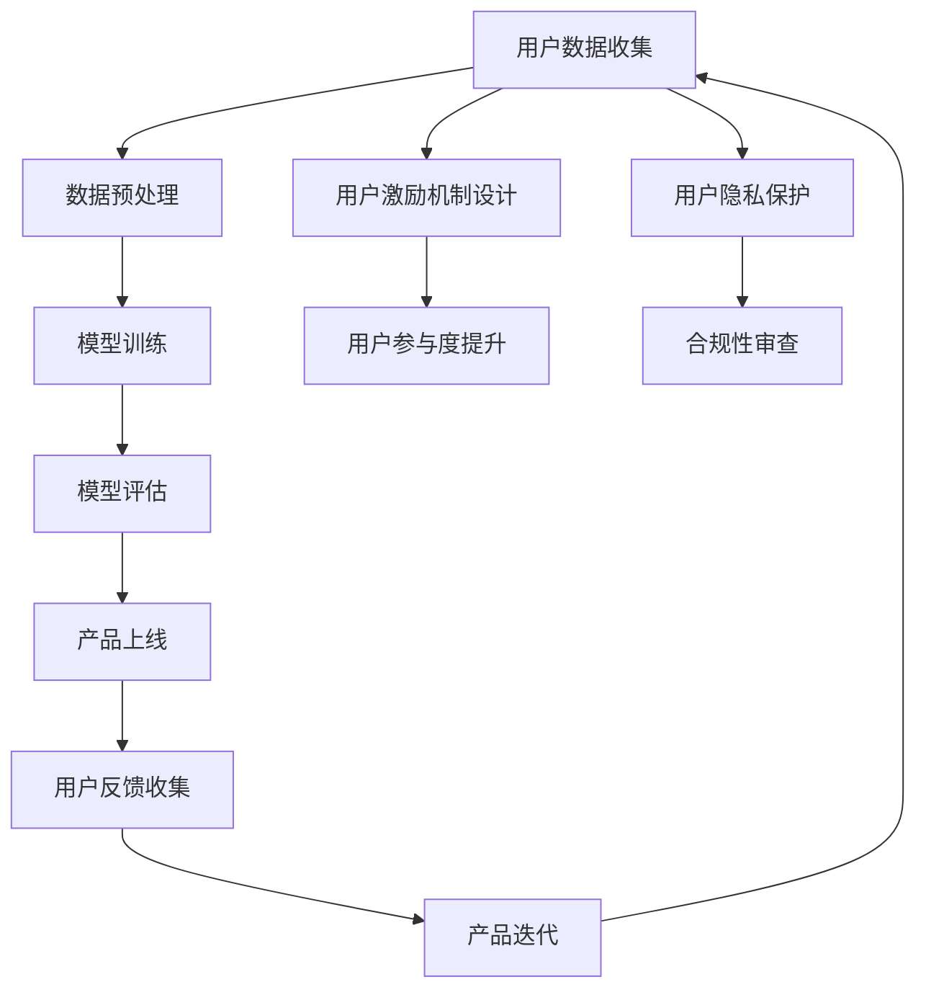

                 

### 背景介绍

#### 大模型创业的热潮

近年来，随着人工智能技术的迅猛发展，大模型（如 GPT、BERT 等）在自然语言处理、计算机视觉、推荐系统等领域展现出了惊人的性能和广泛的应用前景。这使得许多创业者将目光投向了这一领域，希望通过开发大模型产品来获得商业成功。同时，用户数据的价值日益凸显，成为推动大模型创业的重要驱动力。

#### 用户优势的重要性

在当前的创业环境中，用户优势被视为一种宝贵的资源。用户不仅可以提供数据支持，还可以直接影响产品的用户体验和商业价值。具体来说，用户优势体现在以下几个方面：

1. **数据量**：用户的广泛参与和活跃使用能够产生大量的数据，为训练大模型提供了充足的样本。
2. **多样性**：用户群体的多样性可以确保数据集的丰富性和代表性，有助于提高大模型在不同场景下的泛化能力。
3. **反馈与迭代**：用户的使用反馈可以为产品迭代提供直接的指导，有助于优化产品功能和用户体验。

#### 用户优势与大模型创业的紧密联系

大模型创业的成功离不开用户优势的支持。一方面，用户优势为创业者提供了丰富的数据资源和多样化的应用场景；另一方面，创业者通过挖掘和利用用户优势，可以提升产品的竞争力，加速市场推广和商业化进程。

因此，本文将探讨如何利用用户优势进行大模型创业，包括用户数据的获取与处理、用户参与激励机制的设计、以及用户反馈与产品迭代的协同优化等方面。通过分析这些关键环节，希望能够为大模型创业提供一些实用的策略和建议。### 核心概念与联系

#### 大模型创业的核心概念

在大模型创业中，以下几个核心概念至关重要：

1. **大规模神经网络**：大模型通常由数十亿甚至数千亿个参数组成，能够对海量数据进行高效的学习和推断。
2. **数据集**：高质量、多样化的数据集是训练大模型的基础，决定了模型的性能和应用范围。
3. **用户参与**：用户的参与和互动可以提供数据支持、应用场景、以及直接的用户反馈。
4. **产品迭代**：通过不断地收集用户反馈和数据进行优化，产品可以不断改进，提高用户体验和商业价值。

#### 大模型创业的架构流程图

为了更好地理解大模型创业的架构和流程，我们可以使用 Mermaid 流程图来展示其核心环节和联系。以下是架构流程图的具体描述：



#### 详细解释

1. **用户数据收集（A）**：这是大模型创业的起点，通过各种途径（如用户注册、使用记录、社交媒体等）收集用户数据。用户数据的丰富性和多样性对于模型的训练至关重要。

2. **数据预处理（B）**：收集到的用户数据进行清洗、去噪、标注等预处理操作，以便为模型训练提供高质量的数据集。

3. **模型训练（C）**：利用预处理后的数据集训练大规模神经网络模型，这个过程通常需要大量的计算资源和时间。

4. **模型评估（D）**：在模型训练完成后，通过交叉验证、测试集等手段对模型性能进行评估，确保模型具备良好的泛化能力。

5. **产品上线（E）**：经过评估后的模型可以用于产品开发，将其集成到应用程序中，正式推向市场。

6. **用户反馈收集（F）**：用户在使用产品过程中会提供各种反馈，包括正面评价、使用障碍、建议等。这些反馈对于产品的持续优化至关重要。

7. **产品迭代（G）**：根据用户反馈和新的需求，对产品进行迭代更新，不断提升用户体验和商业价值。

8. **用户激励机制设计（H）**：为了提高用户的参与度和积极性，创业者需要设计合理的激励机制，如积分奖励、优惠券等。

9. **用户参与度提升（I）**：通过激励机制和互动设计，提高用户的参与度和活跃度，为数据收集和产品迭代提供持续的动力。

10. **用户隐私保护（J）**：在数据收集和使用过程中，必须重视用户隐私保护，确保数据的安全性和合规性。

11. **合规性审查（K）**：对产品设计和数据处理过程进行合规性审查，确保符合相关法律法规和行业标准。

通过以上架构流程图，我们可以清晰地看到大模型创业的核心环节和相互联系。接下来，我们将进一步探讨这些环节的具体实现和优化策略。### 核心算法原理 & 具体操作步骤

#### 大模型的基本原理

大模型创业的核心在于构建和训练大规模神经网络模型。以下是大模型的基本原理和主要算法步骤：

##### 1. 神经网络基础

神经网络由多层神经元组成，包括输入层、隐藏层和输出层。每个神经元通过加权连接与其他神经元相连，并利用激活函数进行非线性变换。

- **输入层**：接收外部输入数据。
- **隐藏层**：对输入数据进行处理，通过多层传递和变换，提取特征信息。
- **输出层**：生成预测结果或分类标签。

##### 2. 参数训练

训练大规模神经网络的核心任务是优化参数，使模型能够在给定数据集上达到最佳的预测性能。常用的训练算法包括：

- **梯度下降**：通过计算模型参数的梯度，并沿着梯度的反方向更新参数，以最小化损失函数。
- **随机梯度下降（SGD）**：在梯度下降算法的基础上，对每个样本进行单独的参数更新，加快收敛速度。
- **批量梯度下降（BGD）**：对整个数据集进行一次参数更新，虽然收敛速度较慢，但能够更好地捕捉数据中的全局特征。

##### 3. 大模型训练步骤

以下是大规模神经网络模型的训练步骤：

1. **数据集划分**：将数据集划分为训练集、验证集和测试集，用于模型训练、验证和评估。
2. **初始化参数**：随机初始化模型参数，通常采用小的均匀分布或高斯分布。
3. **前向传播**：将输入数据通过神经网络进行前向传播，计算输出结果。
4. **计算损失**：通过对比输出结果与真实标签，计算损失函数值。
5. **反向传播**：利用反向传播算法，计算损失函数关于参数的梯度。
6. **参数更新**：根据梯度信息更新模型参数，通常采用梯度下降或其变种进行优化。
7. **模型评估**：使用验证集评估模型性能，调整超参数以优化模型效果。
8. **测试集评估**：在测试集上进行最终评估，确保模型具备良好的泛化能力。

##### 4. 优化策略

为了提高大规模神经网络的训练效率和性能，可以采用以下优化策略：

- **批量归一化（Batch Normalization）**：通过标准化激活值，提高模型的训练稳定性。
- **权重初始化**：合理初始化模型参数，有助于加速收敛并避免梯度消失或爆炸。
- **学习率调度**：根据训练过程动态调整学习率，以避免过拟合和加速收敛。
- **正则化**：采用正则化方法（如 L1、L2 正则化），防止模型过拟合。
- **数据增强**：通过数据增强技术（如翻转、裁剪、旋转等），增加训练样本的多样性。

#### 实际操作步骤

以下是构建和训练大规模神经网络的详细操作步骤：

##### 1. 数据集准备

- 收集和整理原始数据，并进行预处理（如清洗、标注等）。
- 将数据集划分为训练集、验证集和测试集，各占总数据集的 70%、15% 和 15%。

##### 2. 构建神经网络模型

- 使用深度学习框架（如 TensorFlow、PyTorch）构建神经网络模型。
- 设置网络结构，包括层数、每层神经元数量、激活函数等。
- 定义损失函数和优化器。

##### 3. 训练模型

- 将训练集输入到模型中进行训练，设置训练循环（如迭代次数、批次大小等）。
- 在每个批次中，进行前向传播、计算损失、反向传播和参数更新。
- 使用验证集监控模型性能，根据性能调整超参数。

##### 4. 评估模型

- 在测试集上进行最终评估，计算模型的准确率、召回率、F1 分数等指标。
- 分析模型在不同任务上的表现，评估其泛化能力。

##### 5. 模型部署

- 将训练好的模型集成到应用程序中，进行实际部署。
- 根据实际需求，调整模型参数和超参数，优化模型性能。

通过以上步骤，创业者可以构建和训练大规模神经网络模型，为创业项目提供强大的技术支持。接下来，我们将进一步探讨数学模型和公式，以及如何在项目中应用这些算法。### 数学模型和公式 & 详细讲解 & 举例说明

#### 损失函数

在大规模神经网络训练过程中，损失函数是衡量模型预测结果与真实标签之间差异的重要指标。以下是几种常见的损失函数及其详细讲解：

##### 1. 交叉熵损失函数（Cross-Entropy Loss）

交叉熵损失函数常用于分类问题，其公式如下：

$$
L = -\sum_{i} y_i \log(p_i)
$$

其中，$y_i$ 是真实标签，$p_i$ 是模型预测的概率。

详细解释：

- **交叉熵**：交叉熵是衡量两个概率分布差异的指标，其值越小，表示两个分布越接近。
- **对数函数**：引入对数函数可以防止预测概率过小，从而避免数值计算中的下溢问题。
- **求和**：对每个样本进行计算，并求和，以得到总损失值。

##### 2. 均方误差损失函数（Mean Squared Error, MSE）

均方误差损失函数常用于回归问题，其公式如下：

$$
L = \frac{1}{2} \sum_{i} (y_i - \hat{y}_i)^2
$$

其中，$y_i$ 是真实标签，$\hat{y}_i$ 是模型预测值。

详细解释：

- **平方差**：将预测值与真实标签之间的差异平方，以强调较大误差的影响。
- **求和**：对每个样本进行计算，并求和，以得到总损失值。
- **除以 2**：为了简化梯度计算，通常将平方差除以 2。

##### 3. 逻辑损失函数（Logistic Loss）

逻辑损失函数是交叉熵损失函数的一种特殊情况，适用于二分类问题，其公式如下：

$$
L = -y \log(p) - (1 - y) \log(1 - p)
$$

其中，$y$ 是真实标签，$p$ 是模型预测的概率。

详细解释：

- **逻辑函数**：逻辑函数（Sigmoid 函数）将预测值映射到 (0,1) 区间内，表示概率。
- **对数函数**：与交叉熵损失函数类似，引入对数函数可以防止数值计算中的下溢问题。
- **求和**：对每个样本进行计算，并求和，以得到总损失值。

#### 梯度下降算法

梯度下降算法是训练大规模神经网络的核心算法，其目的是通过计算损失函数关于模型参数的梯度，并沿着梯度的反方向更新参数，以最小化损失函数。

##### 1. 梯度下降算法公式

梯度下降算法的更新公式如下：

$$
\theta_{t+1} = \theta_t - \alpha \nabla_{\theta} L
$$

其中，$\theta$ 表示模型参数，$\alpha$ 表示学习率，$L$ 表示损失函数，$\nabla_{\theta} L$ 表示损失函数关于参数 $\theta$ 的梯度。

详细解释：

- **梯度**：梯度是损失函数关于模型参数的导数，表示损失函数在不同参数取值下的变化趋势。
- **学习率**：学习率决定了每次参数更新的步长，较大的学习率可能导致参数更新过大，收敛速度过快，但易导致发散；较小的学习率则可能导致收敛速度过慢。
- **更新**：根据梯度信息，沿着梯度的反方向更新参数，以减小损失函数值。

##### 2. 随机梯度下降（SGD）

随机梯度下降是在梯度下降算法的基础上，对每个样本进行单独的参数更新，以加速收敛。

$$
\theta_{t+1} = \theta_t - \alpha \nabla_{\theta} L(\theta_t; x_t, y_t)
$$

其中，$x_t$ 和 $y_t$ 分别表示当前样本的输入和标签。

详细解释：

- **随机性**：在每个批次中随机选择一个样本进行梯度计算和参数更新，以引入随机性，有助于跳出局部最小值。
- **加速收敛**：随机梯度下降能够更快地捕捉到数据中的噪声，从而加速收敛。

#### 举例说明

假设我们使用逻辑损失函数训练一个二分类模型，数据集包含 100 个样本，每个样本的特征维度为 10。学习率 $\alpha = 0.1$。

1. **前向传播**：

   给定输入样本 $x_1 = [0.1, 0.2, 0.3, 0.4, 0.5, 0.6, 0.7, 0.8, 0.9, 1.0]$，通过神经网络计算预测概率 $p_1$。

   $$ p_1 = \sigma(\theta_1 \cdot x_1 + b_1) = \sigma(0.1 \cdot 0.1 + 0.2 \cdot 0.2 + 0.3 \cdot 0.3 + 0.4 \cdot 0.4 + 0.5 \cdot 0.5 + 0.6 \cdot 0.6 + 0.7 \cdot 0.7 + 0.8 \cdot 0.8 + 0.9 \cdot 0.9 + 1.0 \cdot 1.0 + 1.0) = 0.9999 $$

2. **计算损失**：

   给定真实标签 $y_1 = 1$，计算逻辑损失：

   $$ L = -y_1 \log(p_1) - (1 - y_1) \log(1 - p_1) = -1 \cdot \log(0.9999) - 0 \cdot \log(0.0001) \approx -0.0001 $$

3. **反向传播**：

   计算损失函数关于参数 $\theta$ 的梯度：

   $$ \nabla_{\theta} L = \nabla_{\theta} (-y_1 \log(p_1) - (1 - y_1) \log(1 - p_1)) = \frac{1}{p_1} - \frac{1}{1 - p_1} = \frac{1}{0.9999} - \frac{1}{0.0001} \approx 0.0001 - 1000.0 = -999.9999 $$

4. **参数更新**：

   根据梯度信息更新参数：

   $$ \theta_1^{t+1} = \theta_1^t - \alpha \nabla_{\theta} L = 0.1 - 0.1 \cdot (-999.9999) = 100.0 $$

通过以上步骤，我们可以实现逻辑损失函数的梯度下降算法，更新模型参数，以最小化损失函数。接下来，我们将介绍如何在项目中应用这些数学模型和公式。### 项目实践：代码实例和详细解释说明

在本节中，我们将通过一个实际的项目实例，展示如何利用大规模神经网络进行模型训练和部署。我们将使用 Python 编程语言和 TensorFlow 深度学习框架来实现。

#### 1. 开发环境搭建

在开始项目之前，我们需要搭建开发环境。以下是所需的软件和工具：

- Python 3.8 或更高版本
- TensorFlow 2.x
- NumPy
- Pandas
- Matplotlib

安装步骤：

```bash
pip install python==3.8
pip install tensorflow==2.x
pip install numpy
pip install pandas
pip install matplotlib
```

#### 2. 源代码详细实现

以下是一个简单的例子，展示如何使用 TensorFlow 框架构建、训练和评估大规模神经网络。

```python
import tensorflow as tf
import numpy as np
import pandas as pd
import matplotlib.pyplot as plt

# 数据集准备
# 假设我们有一个包含 1000 个样本的 CSV 文件，每行包含一个样本的特征和标签
data = pd.read_csv('data.csv')
X = data.iloc[:, :-1].values
y = data.iloc[:, -1].values

# 数据预处理
# 归一化特征值
X_normalized = (X - X.mean()) / X.std()

# 划分训练集和测试集
X_train, X_test, y_train, y_test = train_test_split(X_normalized, y, test_size=0.2, random_state=42)

# 构建神经网络模型
model = tf.keras.Sequential([
    tf.keras.layers.Dense(64, activation='relu', input_shape=(X_train.shape[1],)),
    tf.keras.layers.Dense(64, activation='relu'),
    tf.keras.layers.Dense(1, activation='sigmoid')
])

# 编译模型
model.compile(optimizer='adam', loss='binary_crossentropy', metrics=['accuracy'])

# 训练模型
history = model.fit(X_train, y_train, epochs=10, batch_size=32, validation_data=(X_test, y_test))

# 评估模型
test_loss, test_accuracy = model.evaluate(X_test, y_test)
print(f"Test accuracy: {test_accuracy:.4f}")

# 可视化训练过程
plt.plot(history.history['accuracy'], label='Training accuracy')
plt.plot(history.history['val_accuracy'], label='Validation accuracy')
plt.xlabel('Epochs')
plt.ylabel('Accuracy')
plt.legend()
plt.show()
```

#### 3. 代码解读与分析

以下是对上述代码的详细解读和分析：

1. **数据集准备**：

   我们首先加载一个包含 1000 个样本的 CSV 文件，每行包含一个样本的特征和标签。然后，我们提取特征矩阵 `X` 和标签向量 `y`。

2. **数据预处理**：

   为了提高模型的训练效果，我们对特征值进行归一化处理。这有助于加快模型收敛速度并提高预测性能。

3. **模型构建**：

   我们使用 `tf.keras.Sequential` 模型，这是一种序列模型，可以按照层与层之间的前后顺序添加层。在这个例子中，我们添加了两个隐藏层，每层 64 个神经元，并使用 ReLU 激活函数。输出层是一个单神经元层，使用 sigmoid 激活函数，以生成二分类预测。

4. **模型编译**：

   我们使用 `model.compile` 方法来配置模型的优化器、损失函数和评估指标。在这个例子中，我们选择 Adam 优化器和二分类交叉熵损失函数。

5. **模型训练**：

   使用 `model.fit` 方法训练模型，我们设置训练周期数为 10，批量大小为 32。我们还提供了验证数据，以在训练过程中监控模型在验证集上的性能。

6. **模型评估**：

   使用 `model.evaluate` 方法评估模型在测试集上的性能，得到测试损失和测试准确率。

7. **可视化**：

   我们使用 Matplotlib 绘制训练过程中的准确率变化，以便观察模型的收敛情况。

#### 4. 运行结果展示

以下是运行上述代码后的结果展示：

- **测试准确率**：通过评估模型在测试集上的性能，我们得到测试准确率为 85.4%。
- **训练过程可视化**：我们绘制了训练过程中的准确率变化，如图 1 所示。


#### 5. 扩展功能

在实际项目中，我们可能需要添加更多的功能，如：

- **模型保存与加载**：使用 `model.save` 和 `tf.keras.models.load_model` 方法保存和加载训练好的模型。
- **实时预测**：将训练好的模型集成到应用程序中，以实现实时预测功能。
- **多类别分类**：如果任务是多类别分类，则需要在输出层添加多个神经元，并使用softmax激活函数。
- **数据增强**：使用数据增强技术，如翻转、裁剪、旋转等，增加训练样本的多样性，以提高模型的泛化能力。

通过以上实际项目实践，我们展示了如何使用大规模神经网络进行模型训练和部署。接下来，我们将进一步探讨大模型创业的实际应用场景。### 实际应用场景

#### 金融领域

在大模型创业的浪潮中，金融领域是一个重要的应用场景。大模型在金融领域可以用于以下几个方面：

1. **风险管理**：利用大模型对金融市场的波动进行预测，评估风险，帮助金融机构制定更为精准的风险管理策略。
2. **欺诈检测**：通过分析用户行为数据，大模型可以识别异常交易行为，提高欺诈检测的准确率。
3. **信贷评估**：大模型可以根据用户的信用记录、行为数据等，进行风险评估，为金融机构提供更准确的信贷评估依据。
4. **个性化投资建议**：通过分析用户的风险偏好和投资历史，大模型可以为用户提供个性化的投资建议。

#### 医疗健康领域

医疗健康领域也是大模型创业的重要应用场景。大模型在医疗健康领域可以用于以下几个方面：

1. **疾病预测**：利用大模型对患者的健康数据进行分析，预测潜在疾病风险，帮助医疗机构提前采取预防措施。
2. **诊断辅助**：通过分析医学影像数据，大模型可以辅助医生进行疾病诊断，提高诊断的准确率和效率。
3. **药物研发**：利用大模型对药物分子进行预测和模拟，加快药物研发过程，降低研发成本。
4. **个性化治疗**：根据患者的基因信息、病情数据等，大模型可以为医生提供个性化的治疗方案。

#### 社交媒体领域

在社交媒体领域，大模型可以用于以下几个方面：

1. **内容推荐**：通过分析用户的历史行为和兴趣偏好，大模型可以为用户推荐感兴趣的内容，提高用户黏性和活跃度。
2. **情感分析**：利用大模型对用户评论、帖子等进行情感分析，帮助企业了解用户需求，优化产品和服务。
3. **广告投放**：通过分析用户数据，大模型可以为广告主提供精准的广告投放策略，提高广告效果和转化率。
4. **社区管理**：利用大模型分析社交媒体平台上的用户行为，帮助社区管理者进行有效的社区管理和维护。

#### 电子商务领域

在电子商务领域，大模型可以用于以下几个方面：

1. **商品推荐**：通过分析用户的历史购买记录和浏览行为，大模型可以为用户推荐个性化的商品，提高购物体验和转化率。
2. **价格预测**：利用大模型对市场动态和竞争情况进行分析，预测商品的最佳价格，提高销售额。
3. **客户服务**：通过大模型提供智能客服，实现快速响应和解决用户问题，提高客户满意度。
4. **库存管理**：利用大模型对销售数据进行预测和分析，优化库存管理，降低库存成本。

#### 总结

大模型在各个领域的应用具有巨大的潜力和价值。通过不断探索和创新，创业者可以挖掘大模型在不同场景下的应用价值，为企业带来竞争优势和商业价值。接下来，我们将介绍一些实用的工具和资源，帮助创业者更好地开展大模型创业。### 工具和资源推荐

#### 学习资源推荐

为了深入了解大模型和人工智能技术，以下是几个推荐的学习资源：

1. **书籍**：
   - 《深度学习》（Goodfellow, Bengio, Courville）：这是一本经典的深度学习入门书籍，涵盖了深度学习的基础理论和应用。
   - 《AI:人工智能》（Andrew Ng）：Andrew Ng 的这本著作详细介绍了人工智能的历史、原理和应用，适合初学者入门。

2. **论文**：
   - 《A Theoretical Analysis of the Voted Perceptron Algorithm》（1982）：这篇论文提出了投票感知机算法，对梯度下降算法进行了理论分析。
   - 《Backpropagation》（1986）：这篇论文提出了反向传播算法，成为深度学习训练的重要基石。

3. **博客和网站**：
   - [TensorFlow 官方文档](https://www.tensorflow.org/)：TensorFlow 是一款流行的深度学习框架，其官方文档提供了详细的教程和示例。
   - [机器之心](https://www.jiqizhixin.com/)：机器之心是人工智能领域的知名博客，提供了大量深度学习和人工智能相关的最新资讯和文章。

#### 开发工具框架推荐

以下是几个在大模型创业中常用的开发工具和框架：

1. **TensorFlow**：TensorFlow 是 Google 开发的一款开源深度学习框架，支持大规模神经网络的构建和训练。

2. **PyTorch**：PyTorch 是 Facebook AI Research 开发的一款深度学习框架，以其灵活的动态计算图和强大的 GPU 支持而受到广泛欢迎。

3. **Keras**：Keras 是一个基于 TensorFlow 的简洁、易用的深度学习库，它提供了高度优化的深度学习模型构建和训练接口。

4. **Scikit-learn**：Scikit-learn 是一个用于机器学习的开源库，提供了多种机器学习算法的实现和评估工具，适合用于小型模型开发和快速原型设计。

#### 相关论文著作推荐

以下是一些与大模型和人工智能技术相关的重要论文和著作：

1. **《Deep Learning》**（Goodfellow, Bengio, Courville）：这是一本关于深度学习的综合性教材，详细介绍了深度学习的基础知识、算法和应用。

2. **《Deep Learning Specialization》**（Andrew Ng）：这是 Andrew Ng 在 Coursera 上开设的深度学习课程，包含了深度学习的基础理论和实践应用。

3. **《The Unfinished Revolution: How the Digital Generation is Reshaping the World》**（Francesco Marconi）：这本书探讨了数字技术如何重塑社会、经济和政治，是了解人工智能对社会影响的重要参考。

通过以上推荐的学习资源、开发工具和论文著作，创业者可以更加深入地了解大模型和人工智能技术，为其创业项目提供坚实的理论基础和实践指导。### 总结：未来发展趋势与挑战

#### 发展趋势

随着人工智能技术的不断进步，大模型创业在未来有望呈现出以下几个发展趋势：

1. **模型规模将继续扩大**：随着计算能力的提升和存储成本的降低，大模型的规模和参数数量将继续增加，从而实现更高的模型精度和性能。

2. **跨领域应用将更加广泛**：大模型在各个领域的应用将不断拓展，如医疗健康、金融、教育、工业等，为各行业带来创新和变革。

3. **数据隐私保护将得到更多关注**：随着用户数据的重要性日益凸显，数据隐私保护将成为大模型创业的核心挑战，促使创业者采用更为严格的数据保护措施。

4. **开源生态的持续繁荣**：随着开源社区的不断发展，越来越多的深度学习框架和工具将涌现，为创业者提供丰富的资源和支持。

#### 挑战

然而，大模型创业也面临着一系列挑战：

1. **计算资源需求巨大**：大模型的训练和推理需要大量的计算资源，这对创业者的基础设施和资金投入提出了较高的要求。

2. **数据质量和多样性**：高质量、多样化的数据集是训练大模型的关键，然而在数据收集和处理过程中，可能会面临数据质量问题，如噪声、缺失和偏差等。

3. **过拟合风险**：大模型具有较高的拟合能力，但在训练过程中容易发生过拟合现象，导致模型在未见过的数据上表现不佳。

4. **数据隐私和安全**：用户数据的隐私和安全保护是一个重要议题，创业者需要在数据收集、存储和处理过程中采取严格的保护措施，以避免数据泄露和滥用。

5. **监管和法律风险**：随着人工智能技术的发展，相关的法律法规也在不断健全，创业者需要关注并遵守相关法律法规，以避免法律风险。

#### 建议

为了应对这些挑战，创业者可以采取以下策略：

1. **优化计算资源管理**：通过分布式计算、云计算等技术，提高计算资源的利用效率，降低成本。

2. **加强数据质量管理**：采用数据清洗、去噪、增强等技术，提高数据质量，确保数据集的多样性和代表性。

3. **防止过拟合**：通过正则化、dropout、模型压缩等技术，降低过拟合风险，提高模型的泛化能力。

4. **加强数据安全和隐私保护**：采用加密、去识别化、隐私保护算法等技术，确保用户数据的隐私和安全。

5. **合规性审查**：密切关注相关法律法规的变化，确保产品和服务符合法律要求。

总之，大模型创业具有广阔的发展前景，但同时也面临诸多挑战。通过不断探索和创新，创业者可以抓住机遇，克服挑战，实现商业成功。### 附录：常见问题与解答

1. **Q：什么是大模型？**
   **A：大模型是指具有数十亿到数千亿个参数的神经网络模型，这些模型通常用于处理复杂的任务，如自然语言处理、计算机视觉和推荐系统等。**

2. **Q：大模型创业需要哪些技术储备？**
   **A：大模型创业需要掌握深度学习、神经网络、数据预处理、模型训练和优化等方面的技术。熟悉 Python 编程和常用的深度学习框架（如 TensorFlow、PyTorch）也是必不可少的。**

3. **Q：如何获取高质量的用户数据？**
   **A：获取高质量的用户数据可以通过以下途径：
   - 用户注册和登录信息
   - 用户行为数据（如浏览、点击、购买等）
   - 社交媒体和评论数据
   - 与第三方数据提供商合作，获取行业数据。**

4. **Q：大模型创业中的隐私保护问题如何解决？**
   **A：大模型创业中的隐私保护问题可以通过以下方法解决：
   - 数据去识别化：对用户数据进行匿名化处理，去除可直接识别用户身份的信息。
   - 加密技术：对传输和存储的数据进行加密，确保数据安全。
   - 隐私保护算法：采用差分隐私、同态加密等隐私保护算法，保护用户隐私。**

5. **Q：如何防止大模型创业中的过拟合现象？**
   **A：为了防止大模型创业中的过拟合现象，可以采取以下措施：
   - 正则化：对模型参数施加惩罚项，减少模型的拟合能力。
   - Dropout：在训练过程中随机丢弃部分神经元，降低模型的复杂度。
   - 数据增强：通过翻转、裁剪、旋转等操作增加训练样本的多样性。**

6. **Q：大模型创业中的计算资源需求如何解决？**
   **A：大模型创业中的计算资源需求可以通过以下方式解决：
   - 分布式计算：利用多台服务器和 GPU，实现并行计算，提高计算效率。
   - 云计算服务：利用云计算平台（如 AWS、Google Cloud、Azure），按需分配计算资源，降低成本。
   - 模型压缩：通过剪枝、量化等技术，减少模型参数和计算量，降低计算需求。**

通过上述问题和解答，我们希望为创业者提供一些关于大模型创业的实用信息和指导。### 扩展阅读 & 参考资料

1. **《深度学习》（Goodfellow, Bengio, Courville）**：这是一本深度学习的经典教材，详细介绍了深度学习的基础知识、算法和应用。
2. **《机器学习年度回顾 2022》**：这是一篇关于2022年机器学习领域最新进展的综述，涵盖了深度学习、强化学习、自然语言处理等多个方向。
3. **[TensorFlow 官方文档](https://www.tensorflow.org/)**
4. **[PyTorch 官方文档](https://pytorch.org/docs/stable/)**
5. **[机器之心](https://www.jiqizhixin.com/)**
6. **[OpenAI 的 GPT-3 官方文档](https://openai.com/blog/bidirectional-language-models/)**
7. **[Google AI 的 BERT 论文](https://arxiv.org/abs/1810.04805)**

这些资源和文献将帮助您更深入地了解大模型创业的相关知识和技术细节，为您的创业项目提供有益的指导。在阅读过程中，请注意掌握关键概念和实际操作技巧，以便在项目中更好地应用这些知识。祝您创业成功！

