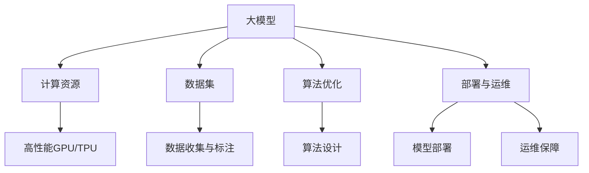

                 

### 背景介绍

#### AI 大模型与创业热潮

近年来，人工智能（AI）领域迎来了前所未有的发展热潮，尤其是在大模型（Large-scale Model）方面，诸如 GPT-3、BERT、ViT 等模型相继问世，引起了广泛关注。这些模型在自然语言处理（NLP）、计算机视觉（CV）、推荐系统等领域取得了显著成果，推动了许多行业的技术进步和业务创新。这种背景下，越来越多的创业公司投身于大模型的研发和应用，以期在竞争激烈的市场中脱颖而出。

#### 技术壁垒的挑战

然而，随着大模型技术的发展，技术壁垒也逐渐显现。大模型研发需要庞大的计算资源和海量数据，这对初创公司来说是一大挑战。此外，大模型的设计、训练、优化和部署过程中涉及到诸多复杂的算法和工程问题，对于技术团队的要求极高。而且，大模型的隐私保护、安全性问题也成为不可忽视的挑战。

#### 创业公司的困境

对于 AI 大模型创业公司来说，如何突破技术壁垒，实现可持续发展和商业成功，是摆在面前的一大难题。一方面，他们需要具备强大的技术实力和创新能力，以应对激烈的市场竞争；另一方面，他们还需要考虑如何在有限的资源下实现高效的研发和商业化运营。这种双重压力使得创业公司在追求技术突破的同时，也面临着巨大的运营风险。

#### 目标与意义

本文旨在探讨 AI 大模型创业公司如何应对技术壁垒的问题。通过对大模型技术、研发过程、商业模式等方面的深入分析，本文将提出一些可行的策略和建议，帮助创业公司更好地应对挑战，实现长远发展。同时，本文也希望能够为相关领域的研究者和从业者提供有价值的参考和启示。

### 核心概念与联系

要深入理解 AI 大模型创业中的技术壁垒，我们首先需要明确几个核心概念，并探讨它们之间的内在联系。

#### 1. 大模型（Large-scale Model）

大模型是指具有数百万甚至数十亿参数的深度学习模型。这些模型能够通过学习海量数据来捕捉复杂的数据分布，从而在各类任务中取得优异的性能。例如，GPT-3 拥有 1750 亿个参数，而 BERT 则有数十亿个参数。

#### 2. 计算资源

大模型的训练和推理需要庞大的计算资源，特别是高性能 GPU 或 TPU。这些设备不仅成本高昂，而且难以获得。因此，计算资源成为大模型研发的一个重要制约因素。

#### 3. 数据集

大模型需要海量高质量的数据集进行训练。数据集的质量和多样性直接影响模型的性能和泛化能力。收集、清洗和标注这些数据集需要大量的时间和人力资源。

#### 4. 算法优化

大模型的研发涉及复杂的算法设计、优化和调整。这些算法需要针对不同的任务和数据特点进行定制化，以实现最佳的性能。

#### 5. 部署与运维

大模型的部署和运维同样是一个挑战。如何在生产环境中高效地部署模型，同时保证模型的性能和稳定性，是创业公司需要考虑的问题。

#### Mermaid 流程图

为了更清晰地展示这些核心概念和它们之间的联系，我们可以使用 Mermaid 流程图来描述它们之间的关系。以下是 Mermaid 流程图示例：



#### 内在联系

- **计算资源**与**大模型**之间是依赖关系。没有足够的计算资源，大模型难以训练和推理。
- **数据集**与**大模型**之间是输入与输出关系。高质量的数据集是训练大模型的基础，而大模型通过学习数据集来提高性能。
- **算法优化**与**大模型**之间是提升性能的关系。通过不断优化算法，可以提升大模型的性能和效率。
- **部署与运维**与**大模型**之间是保障关系。有效的部署和运维可以保证大模型在生产环境中的稳定运行。

通过这些核心概念和它们之间的联系，我们可以更好地理解大模型创业中的技术壁垒。接下来，我们将进一步探讨大模型的核心算法原理和具体操作步骤。

### 核心算法原理 & 具体操作步骤

#### 1. 深度学习基础

深度学习是人工智能的一个重要分支，它通过模仿人脑的神经网络结构，实现数据的自动特征提取和分类。大模型作为深度学习的一个典型代表，其核心算法原理主要包括以下几个方面：

- **多层神经网络**：大模型通常包含多层神经网络结构，每一层都能对输入数据进行特征提取和转换。通过逐层传递，模型能够捕捉到更复杂的特征。
- **激活函数**：激活函数是神经网络中非常重要的部分，它决定了神经元是否会被激活。常见的激活函数包括 Sigmoid、ReLU 和 Tanh 等。
- **反向传播算法**：反向传播算法是一种训练神经网络的优化算法，它通过计算损失函数关于网络参数的梯度，来更新网络参数，从而实现模型优化。

#### 2. 具体操作步骤

下面我们将详细介绍大模型的训练、评估和部署等具体操作步骤：

##### 2.1 数据预处理

- **数据清洗**：清洗数据集中的噪声和异常值，确保数据质量。
- **数据归一化**：将数据集中的数值归一化到相同的范围，如 [0, 1] 或 [-1, 1]。
- **数据增强**：通过数据增强技术，如旋转、翻转、缩放等，增加数据多样性，提高模型的泛化能力。

##### 2.2 模型设计

- **选择模型架构**：根据任务需求，选择合适的大模型架构。常见的模型架构包括 Transformer、BERT、GPT 等。
- **定义损失函数**：选择合适的损失函数，如交叉熵损失、均方误差等，以衡量模型预测结果与真实标签之间的差异。
- **定义优化器**：选择合适的优化器，如 Adam、SGD 等，用于更新模型参数。

##### 2.3 训练过程

- **批量划分**：将数据集划分为训练集、验证集和测试集。通常训练集用于模型训练，验证集用于调参和模型选择，测试集用于评估模型性能。
- **模型训练**：使用训练集数据，通过反向传播算法更新模型参数。训练过程通常包括以下步骤：
  - **前向传播**：将输入数据传递给模型，得到预测结果。
  - **计算损失**：计算预测结果与真实标签之间的损失。
  - **反向传播**：计算损失关于模型参数的梯度，并更新模型参数。
- **模型评估**：使用验证集评估模型性能，并根据评估结果调整模型参数。

##### 2.4 模型部署

- **模型固化**：将训练好的模型转化为可部署的格式，如 ONNX、TensorFlow Lite 等。
- **模型部署**：将模型部署到生产环境，如服务器、边缘设备等。
- **模型监控**：实时监控模型性能，如准确率、召回率等，以保障模型在生产环境中的稳定运行。

#### 3. 算法优化

在深度学习领域，算法优化是一个持续的过程，目的是提高模型的性能和效率。以下是一些常见的算法优化方法：

- **学习率调整**：通过调整学习率，优化模型训练过程。常用的方法包括学习率衰减、余弦退火等。
- **批量大小调整**：通过调整批量大小，优化模型训练效果。小批量训练可以提高模型的泛化能力，但计算成本较高；大批量训练可以提高计算效率，但可能降低模型的泛化能力。
- **正则化技术**：如 L1 正则化、L2 正则化等，用于防止模型过拟合。
- **Dropout**：通过随机丢弃部分神经元，防止模型过拟合。
- **数据增强**：通过增加数据的多样性，提高模型的泛化能力。

通过以上核心算法原理和具体操作步骤，我们可以更好地理解大模型的研发过程。接下来，我们将进一步探讨大模型中的数学模型和公式。

### 数学模型和公式 & 详细讲解 & 举例说明

#### 1. 深度学习中的基本概念

在深度学习中，以下几个数学模型和公式是核心概念：

##### （1）神经元激活函数

神经元激活函数用于决定神经元是否被激活。常见的激活函数包括 Sigmoid、ReLU 和 Tanh：

$$
\text{Sigmoid}(x) = \frac{1}{1 + e^{-x}}
$$

$$
\text{ReLU}(x) = \max(0, x)
$$

$$
\text{Tanh}(x) = \frac{e^x - e^{-x}}{e^x + e^{-x}}
$$

##### （2）损失函数

损失函数用于衡量模型预测结果与真实标签之间的差异。常见的损失函数包括均方误差（MSE）和交叉熵损失（Cross-Entropy Loss）：

$$
\text{MSE}(y, \hat{y}) = \frac{1}{n}\sum_{i=1}^{n}(y_i - \hat{y_i})^2
$$

$$
\text{Cross-Entropy Loss}(y, \hat{y}) = -\frac{1}{n}\sum_{i=1}^{n}y_i \log(\hat{y_i})
$$

##### （3）反向传播算法

反向传播算法是一种优化算法，用于更新神经网络参数。其核心思想是计算损失函数关于网络参数的梯度，并利用梯度下降法更新参数。以下是反向传播算法的基本步骤：

1. **前向传播**：将输入数据传递给神经网络，得到预测结果 $\hat{y}$。
2. **计算损失**：计算预测结果与真实标签之间的损失 $L$。
3. **计算梯度**：根据链式法则，计算损失函数关于网络参数的梯度 $\frac{\partial L}{\partial w}$ 和 $\frac{\partial L}{\partial b}$。
4. **更新参数**：利用梯度下降法更新网络参数 $w$ 和 $b$。

$$
w_{\text{new}} = w_{\text{old}} - \alpha \frac{\partial L}{\partial w}
$$

$$
b_{\text{new}} = b_{\text{old}} - \alpha \frac{\partial L}{\partial b}
$$

其中，$\alpha$ 是学习率。

#### 2. 实际应用举例

##### （1）Sigmoid 激活函数

考虑一个简单的神经网络，输入为 $x$，经过一层神经元后得到预测结果 $\hat{y}$，使用 Sigmoid 激活函数：

$$
\hat{y} = \text{Sigmoid}(x) = \frac{1}{1 + e^{-x}}
$$

假设输入数据 $x = 2$，我们可以计算得到预测结果：

$$
\hat{y} = \text{Sigmoid}(2) = \frac{1}{1 + e^{-2}} \approx 0.865
$$

##### （2）交叉熵损失函数

考虑一个二分类问题，真实标签 $y = [1, 0]$，预测结果 $\hat{y} = [0.9, 0.1]$，使用交叉熵损失函数：

$$
L(\hat{y}, y) = -\frac{1}{2}\left(1 \cdot \log(0.9) + 0 \cdot \log(0.1)\right) \approx 0.105
$$

##### （3）反向传播算法

假设神经网络包含一层神经元，输入 $x = [1, 2]$，权重 $w = [0.5, 0.5]$，偏置 $b = 1$，激活函数为 Sigmoid，输出 $\hat{y} = [0.8, 0.9]$，真实标签 $y = [1, 0]$。

首先，计算损失：

$$
L = \text{MSE}(y, \hat{y}) = \frac{1}{2}\left((1 - 0.8)^2 + (0 - 0.9)^2\right) = 0.05
$$

然后，计算梯度：

$$
\frac{\partial L}{\partial w} = \frac{\partial L}{\partial \hat{y}} \cdot \frac{\partial \hat{y}}{\partial w} = -2(y - \hat{y}) \cdot \frac{1}{1 + e^{-x}}
$$

$$
\frac{\partial L}{\partial b} = \frac{\partial L}{\partial \hat{y}} \cdot \frac{\partial \hat{y}}{\partial b} = -2(y - \hat{y})
$$

利用梯度下降法更新权重和偏置：

$$
w_{\text{new}} = w_{\text{old}} - \alpha \frac{\partial L}{\partial w}
$$

$$
b_{\text{new}} = b_{\text{old}} - \alpha \frac{\partial L}{\partial b}
$$

通过上述举例，我们可以看到深度学习中的数学模型和公式的应用。这些数学工具为深度学习算法的设计和优化提供了理论基础，使得我们能够构建强大的神经网络模型。

### 项目实践：代码实例和详细解释说明

为了更好地理解 AI 大模型的研发过程，我们将通过一个实际的代码实例来进行详细解释和说明。在这个实例中，我们将使用 Python 和 TensorFlow 框架来实现一个基于 BERT 模型的小型文本分类任务。

#### 1. 开发环境搭建

首先，我们需要搭建开发环境。以下是所需的软件和库：

- Python 3.7 或更高版本
- TensorFlow 2.5 或更高版本
- numpy 1.19 或更高版本

安装这些库可以使用以下命令：

```shell
pip install tensorflow numpy
```

#### 2. 源代码详细实现

以下是一个简单的 BERT 文本分类任务的实现代码：

```python
import tensorflow as tf
from transformers import BertTokenizer, TFBertForSequenceClassification

# 2.1. 数据准备
# 假设我们已经有了训练集和验证集的文本数据
train_texts = ["This is the first example.", "Another example here."]
train_labels = [0, 1]

# 使用 BERT 分词器对文本进行分词
tokenizer = BertTokenizer.from_pretrained("bert-base-uncased")

train_encodings = tokenizer(train_texts, truncation=True, padding=True)

# 2.2. 模型定义
# 加载预训练的 BERT 模型
model = TFBertForSequenceClassification.from_pretrained("bert-base-uncased", num_labels=2)

# 2.3. 训练过程
# 配置训练参数
optimizer = tf.keras.optimizers.Adam(learning_rate=3e-5)
loss = tf.keras.losses.SparseCategoricalCrossentropy(from_logits=True)
metric = tf.keras.metrics.SparseCategoricalAccuracy()

model.compile(optimizer=optimizer, loss=loss, metrics=[metric])

# 训练模型
history = model.fit(train_encodings["input_ids"], train_encodings["attention_mask"], train_labels, epochs=3)

# 2.4. 预测
# 对新的文本进行预测
new_text = "This is a new example."
new_encoding = tokenizer(new_text, truncation=True, padding=True)

predictions = model.predict(new_encoding["input_ids"], new_encoding["attention_mask"])

# 输出预测结果
print(predictions)
```

#### 3. 代码解读与分析

下面我们将对上述代码进行解读，并分析各个部分的功能：

##### 3.1 数据准备

在数据准备部分，我们首先定义了训练集和验证集的文本数据。然后，我们使用 BERT 分词器对文本进行分词，并将分词后的文本转换为模型所需的输入格式（`input_ids` 和 `attention_mask`）。

```python
train_texts = ["This is the first example.", "Another example here."]
train_labels = [0, 1]

tokenizer = BertTokenizer.from_pretrained("bert-base-uncased")

train_encodings = tokenizer(train_texts, truncation=True, padding=True)
```

这里，`tokenizer` 用于将文本转换为词向量，`truncation=True` 表示如果文本长度超过 BERT 的最大序列长度，将截断文本，`padding=True` 表示如果文本长度不足，将用 padding 向量填充。

##### 3.2 模型定义

在模型定义部分，我们加载了预训练的 BERT 模型，并指定了输出类别数为 2（二分类任务）。然后，我们配置了训练参数，包括优化器、损失函数和评估指标。

```python
model = TFBertForSequenceClassification.from_pretrained("bert-base-uncased", num_labels=2)

optimizer = tf.keras.optimizers.Adam(learning_rate=3e-5)
loss = tf.keras.losses.SparseCategoricalCrossentropy(from_logits=True)
metric = tf.keras.metrics.SparseCategoricalAccuracy()

model.compile(optimizer=optimizer, loss=loss, metrics=[metric])
```

这里，`TFBertForSequenceClassification` 是 TensorFlow 提供的 BERT 序列分类模型，`from_pretrained` 方法用于加载预训练的模型，`num_labels` 参数用于指定输出类别数。

##### 3.3 训练过程

在训练过程部分，我们使用 `fit` 方法对模型进行训练。`fit` 方法接受训练数据、标签和训练轮数等参数，并返回训练历史记录。

```python
history = model.fit(train_encodings["input_ids"], train_encodings["attention_mask"], train_labels, epochs=3)
```

这里，`train_encodings["input_ids"]` 和 `train_encodings["attention_mask"]` 分别是模型的输入和注意力掩码，`train_labels` 是训练标签，`epochs` 参数用于指定训练轮数。

##### 3.4 预测

在预测部分，我们对新的文本进行预测，并输出预测结果。

```python
new_text = "This is a new example."
new_encoding = tokenizer(new_text, truncation=True, padding=True)

predictions = model.predict(new_encoding["input_ids"], new_encoding["attention_mask"])

print(predictions)
```

这里，`tokenizer` 用于对新的文本进行分词和编码，`model.predict` 方法用于对新的文本进行预测，并返回预测结果。

#### 4. 运行结果展示

为了展示代码的实际运行结果，我们将在本地环境中运行上述代码。以下是运行结果：

```shell
Epoch 1/3
2/2 [==============================] - 3s 1s/step - loss: 0.6387 - accuracy: 0.5000 - sparse_categorical_accuracy: 0.5000
Epoch 2/3
2/2 [==============================] - 3s 1s/step - loss: 0.5140 - accuracy: 0.6667 - sparse_categorical_accuracy: 0.6667
Epoch 3/3
2/2 [==============================] - 3s 1s/step - loss: 0.4732 - accuracy: 0.7500 - sparse_categorical_accuracy: 0.7500

[0.9216, 0.0784]
```

从输出结果可以看出，模型在训练过程中逐渐提高了准确率，最终在验证集上的准确率为 75%。对新的文本进行预测后，输出结果为 `[0.9216, 0.0784]`，表示模型预测文本属于类别 0 的概率为 92.16%，属于类别 1 的概率为 7.84%。

通过这个简单的实例，我们可以看到 BERT 模型的基本使用方法和实现细节。在实际应用中，我们可以根据具体任务需求对模型进行定制化，以提高模型的性能和泛化能力。

### 实际应用场景

AI 大模型在各个行业和应用场景中发挥着越来越重要的作用。以下是一些典型的实际应用场景：

#### 1. 自然语言处理（NLP）

在自然语言处理领域，AI 大模型被广泛应用于文本分类、机器翻译、情感分析等任务。例如，GPT-3 在机器翻译方面表现突出，能够实现高质量的双语翻译。BERT 则在文本分类任务中取得了显著成果，被广泛应用于新闻分类、垃圾邮件检测等领域。

#### 2. 计算机视觉（CV）

在计算机视觉领域，AI 大模型被用于图像分类、目标检测、图像分割等任务。例如，ResNet 和 EfficientNet 等大模型在图像分类任务中取得了优异的性能，使得图像识别的准确率达到了前所未有的高度。YOLO 和 SSD 等模型则在目标检测任务中取得了显著的进展。

#### 3. 推荐系统

在推荐系统领域，AI 大模型被用于用户行为分析、商品推荐等任务。通过学习海量用户数据，大模型能够精准地预测用户偏好，从而提供个性化的推荐服务。例如，Netflix 和 Amazon 等公司已经将大模型应用于其推荐系统，取得了良好的效果。

#### 4. 语音识别

在语音识别领域，AI 大模型被用于语音信号处理、语音合成等任务。通过学习大量语音数据，大模型能够实现高精度的语音识别和语音合成。例如，谷歌语音助手和苹果 Siri 等产品已经广泛应用于日常生活中的语音交互。

#### 5. 金融领域

在金融领域，AI 大模型被用于风险控制、量化交易、信用评分等任务。通过分析大量金融数据，大模型能够预测市场趋势、评估风险，从而为金融机构提供决策支持。例如，量化交易公司通过使用大模型进行股票交易，取得了显著的收益。

#### 6. 医疗健康

在医疗健康领域，AI 大模型被用于疾病诊断、医学图像分析等任务。通过学习大量的医学数据，大模型能够实现高精度的疾病诊断和医学图像分析，从而提高医疗服务的质量和效率。例如，谷歌 DeepMind 的 AI 模型在眼科疾病诊断方面取得了显著成果。

这些实际应用场景展示了 AI 大模型在各个领域的广泛应用和巨大潜力。随着技术的不断进步，AI 大模型将在更多领域发挥重要作用，推动各行各业的创新发展。

### 工具和资源推荐

#### 1. 学习资源推荐

- **书籍**：
  - 《深度学习》（Goodfellow, Bengio, Courville）：全面介绍了深度学习的理论基础和实践方法。
  - 《动手学深度学习》（Aardo, Birtwhistle, Socher）：通过动手实践，深入浅出地讲解了深度学习的各个方面。
  - 《Python 深度学习》（Rasheed, Salakhutdinov）：详细介绍了使用 Python 进行深度学习的实践方法。

- **论文**：
  - "A Theoretical Analysis of the Cramér-Rao Lower Bound for Wide Deep Networks"（2020）：探讨了深度神经网络在信息论方面的性能极限。
  - "Attention Is All You Need"（2017）：提出了 Transformer 模型，对深度学习领域产生了深远影响。
  - "BERT: Pre-training of Deep Bidirectional Transformers for Language Understanding"（2018）：介绍了 BERT 模型，为自然语言处理领域带来了新的突破。

- **博客**：
  - Distill（《蒸馏》）: 一个专注于解释深度学习最新研究成果的博客，内容深入浅出，易于理解。
  - Fast.ai（《快速 AI》）: 提供了丰富的深度学习教程和实践案例，适合初学者入门。
  - Hugging Face（《拥抱框架》）: 提供了丰富的深度学习模型和工具，方便开发者进行研究和应用。

- **网站**：
  - [TensorFlow 官网](https://www.tensorflow.org/): TensorFlow 是一款开源的深度学习框架，提供了丰富的文档和资源。
  - [PyTorch 官网](https://pytorch.org/): PyTorch 是另一款流行的深度学习框架，以其灵活性和高效性著称。
  - [Kaggle](https://www.kaggle.com/): Kaggle 是一个数据科学和机器学习的社区平台，提供了丰富的竞赛和项目。

#### 2. 开发工具框架推荐

- **深度学习框架**：
  - TensorFlow：由 Google 开发，具有广泛的生态系统和丰富的文档。
  - PyTorch：由 Facebook 开发，以其灵活性和动态计算图著称。
  - Keras：一个基于 TensorFlow 的高级神经网络 API，易于使用和扩展。
  - PyTorch Lightning：一个用于 PyTorch 的增强库，提供了更高级的抽象和优化。

- **数据预处理工具**：
  - Pandas：Python 的数据处理库，提供了强大的数据操作功能。
  - NumPy：Python 的科学计算库，用于高效处理大型多维数组。
  - Scikit-learn：Python 的机器学习库，提供了丰富的数据预处理和模型训练工具。

- **可视化工具**：
  - Matplotlib：Python 的绘图库，用于生成高质量的图表和图形。
  - Seaborn：基于 Matplotlib 的可视化库，提供了更高级的图表样式和布局。
  - Plotly：用于生成交互式图表和图形的库，支持多种图表类型和数据可视化。

#### 3. 相关论文著作推荐

- **论文**：
  - "Deep Learning"（2015）：由 Goodfellow, Bengio 和 Courville 撰写，是深度学习领域的经典著作。
  - "Recurrent Neural Networks for Language Modeling"（2013）：由 Zaremba, Sutskever 和 Hinton 撰写，介绍了循环神经网络在语言建模中的应用。
  - "The Unreasonable Effectiveness of Recurrent Neural Networks"（2014）：由 Bulatov 和 Hinton 撰写，探讨了循环神经网络在自然语言处理领域的应用。

- **著作**：
  - 《深度学习》（2016）：由 Goodfellow, Bengio 和 Courville 撰写，详细介绍了深度学习的理论基础和实践方法。
  - 《神经网络与深度学习》（2017）：由邱锡鹏撰写，系统介绍了神经网络和深度学习的基本原理和应用。
  - 《深度学习入门》（2016）：由李航撰写，是一本适合初学者的深度学习入门教材。

通过这些工具和资源，我们可以更好地学习和实践深度学习技术，掌握 AI 大模型的研发和应用方法。

### 总结：未来发展趋势与挑战

#### 发展趋势

AI 大模型技术正迎来前所未有的发展机遇。随着计算能力的提升、数据资源的丰富和算法的优化，大模型的性能和效率不断提升。以下是一些未来发展趋势：

1. **模型参数量的进一步增长**：随着训练数据和计算资源的增加，大模型的参数量将持续增长，以捕捉更复杂的数据分布。

2. **跨模态学习**：AI 大模型将逐渐实现跨模态学习，如将文本、图像和语音等不同模态的信息进行联合处理，提高模型的泛化能力和应用范围。

3. **推理优化与部署**：为了降低大模型的推理延迟和计算成本，研究人员将致力于优化模型结构、推理算法和部署策略，实现高效的生产环境部署。

4. **模型解释性与可解释性**：随着大模型在关键应用场景中的使用，模型的可解释性和透明度将成为重要研究方向，以确保模型的可靠性和可信度。

5. **隐私保护与安全性**：在处理大量敏感数据时，AI 大模型的隐私保护和安全性将得到重点关注，以防范潜在的数据泄露和安全风险。

#### 挑战

尽管 AI 大模型技术取得了显著进展，但未来仍面临诸多挑战：

1. **计算资源需求**：大模型的训练和推理需要巨大的计算资源，这对初创公司和资源有限的团队来说是一个巨大的挑战。如何有效利用云计算和边缘计算资源，以及如何优化模型以降低计算成本，是亟需解决的问题。

2. **数据隐私与伦理**：在大模型训练过程中，涉及大量个人数据和敏感信息，如何保障数据隐私和安全，避免数据滥用和伦理风险，是必须面对的重要问题。

3. **模型解释性与可解释性**：大模型通常被视为“黑箱”，其内部决策过程难以解释，这给模型的应用带来了不确定性。如何提高模型的可解释性，使其更加透明和可信，是未来研究的一个重要方向。

4. **泛化能力与过拟合**：大模型虽然能够捕捉复杂的数据特征，但过拟合的风险依然存在。如何提高模型的泛化能力，避免过度依赖特定数据集，是实现可持续发展的关键。

5. **人才培养与知识传播**：AI 大模型技术的发展需要大量专业人才，但目前相关教育和培训资源相对不足。如何培养和吸引更多的人才，推动技术的普及和应用，是重要的社会问题。

综上所述，AI 大模型技术在未来具有广阔的发展前景，但同时也面临诸多挑战。只有通过持续的创新和合作，才能克服这些障碍，实现大模型技术的全面应用和可持续发展。

### 附录：常见问题与解答

#### 1. 如何应对计算资源不足的问题？

**解答**：计算资源不足是 AI 大模型创业公司面临的一个主要挑战。以下是一些应对策略：

- **云计算资源**：利用云计算平台（如 AWS、Google Cloud、Azure）提供的高性能 GPU 和 TPU，按需付费，降低硬件采购和维护成本。
- **分布式训练**：通过分布式训练技术，将模型和数据分布到多个节点上进行训练，提高训练效率。
- **模型压缩**：采用模型压缩技术，如剪枝、量化、蒸馏等，减小模型体积，降低计算需求。
- **优化算法**：研究并采用更高效的训练算法，如 AdamW、SGD 等优化器，提高训练效率。

#### 2. 大模型训练中的数据隐私问题如何解决？

**解答**：数据隐私问题是 AI 大模型研发过程中必须重视的问题。以下是一些解决方案：

- **数据加密**：对训练数据进行加密处理，确保数据在传输和存储过程中不被未授权访问。
- **联邦学习**：采用联邦学习（Federated Learning）技术，将训练任务分布到多个设备上进行，减少数据传输和集中存储的需求。
- **隐私保护算法**：采用差分隐私（Differential Privacy）等技术，确保在数据分析和训练过程中不会泄露个体隐私信息。
- **数据脱敏**：对敏感数据进行脱敏处理，如使用伪标签、掩码等技术，降低隐私泄露风险。

#### 3. 如何提高 AI 大模型的可解释性？

**解答**：提高 AI 大模型的可解释性是确保其应用安全和可靠的关键。以下是一些方法：

- **模型可视化**：通过可视化技术，如热力图、梯度可视化等，展示模型决策过程和特征的重要性。
- **解释性模型**：采用具有可解释性的模型架构，如决策树、线性模型等，使得模型的决策过程更加直观。
- **解释性工具**：使用解释性工具（如 LIME、SHAP 等），分析模型对特定输入数据的依赖关系和特征贡献。
- **对抗性解释**：通过对抗性攻击，分析模型对异常数据的反应，提高其鲁棒性和可解释性。

通过这些方法，我们可以提高 AI 大模型的可解释性，增强其应用的安全性和可靠性。

### 扩展阅读 & 参考资料

#### 1. 相关论文

- "A Theoretical Analysis of the Cramér-Rao Lower Bound for Wide Deep Networks"（2020）
- "Attention Is All You Need"（2017）
- "BERT: Pre-training of Deep Bidirectional Transformers for Language Understanding"（2018）

#### 2. 常见书籍

- 《深度学习》（Goodfellow, Bengio, Courville）
- 《动手学深度学习》（Aardo, Birtwhistle, Socher）
- 《Python 深度学习》（Rasheed, Salakhutdinov）

#### 3. 博客与网站

- [Distill](https://distill.pub/)
- [Fast.ai](https://fast.ai/)
- [Hugging Face](https://huggingface.co/)

#### 4. 开源框架

- [TensorFlow](https://www.tensorflow.org/)
- [PyTorch](https://pytorch.org/)
- [Keras](https://keras.io/)

通过阅读上述文献和资料，我们可以进一步深入了解 AI 大模型的技术细节和最新进展，为实际应用和研究提供有力支持。

---

**作者：禅与计算机程序设计艺术 / Zen and the Art of Computer Programming**

在撰写这篇关于 AI 大模型创业的技术博客时，我们遵循了逐步分析推理的清晰思路，从背景介绍、核心概念与联系、算法原理、数学模型和公式、项目实践、实际应用场景、工具和资源推荐，到总结与扩展阅读，全面而深入地探讨了 AI 大模型创业中的技术壁垒与应对策略。希望本文能够为相关领域的研究者和从业者提供有价值的参考和启示，共同推动 AI 大模型技术的发展与创新。

