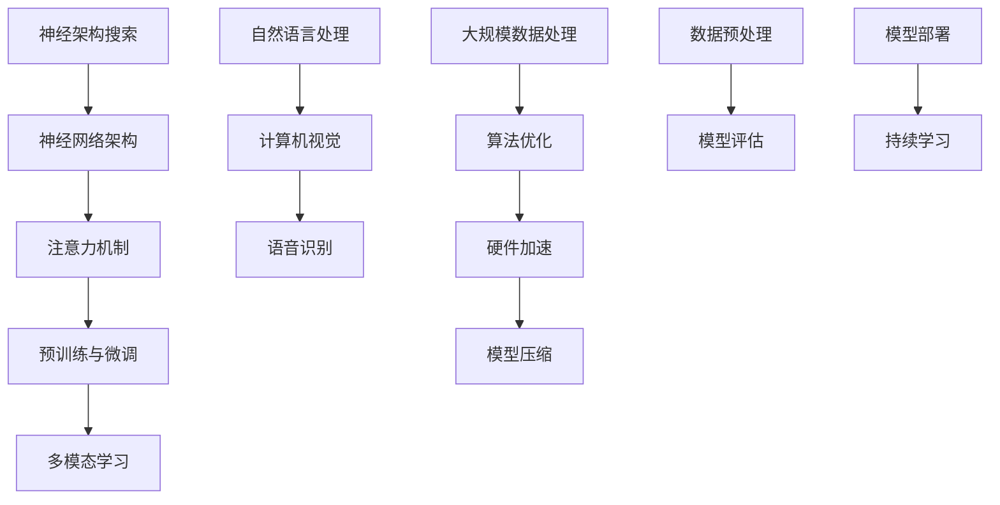

                 

### 1. 背景介绍

随着人工智能技术的快速发展，大模型（Large Models）已经成为当前研究的热点。大模型在自然语言处理、计算机视觉、语音识别等领域展现出了卓越的性能，推动了相关技术的进步。然而，如何构建一个既能满足持续的 scaling up（向上扩展），又能具有通用的泛化能力（generalization capability）的架构，成为了一个亟待解决的问题。

本文旨在探讨大模型的架构设计，分析其原理、算法、数学模型以及实际应用。我们首先介绍大模型的发展历程，然后讨论其核心概念与联系，接着深入讲解核心算法原理和具体操作步骤。在此基础上，我们将分析大模型的数学模型和公式，并通过代码实例进行详细解释说明。最后，本文将探讨大模型在实际应用场景中的价值，并推荐相关的学习资源和开发工具。

### 2. 核心概念与联系

大模型的核心概念主要包括以下几个部分：

- **神经架构搜索（Neural Architecture Search, NAS）**：NAS 是一种自动搜索神经网络架构的方法，旨在找到最优的网络结构。通过 NAS，可以自动设计出适应特定任务的神经网络。

- **注意力机制（Attention Mechanism）**：注意力机制是一种在处理序列数据时对重要信息进行加权的方法，能够显著提升模型在自然语言处理和计算机视觉等任务中的性能。

- **预训练与微调（Pre-training and Fine-tuning）**：预训练是指在大规模数据集上对模型进行训练，使其具备一定的泛化能力；微调是在预训练的基础上，利用少量有标签的数据对模型进行微调，以适应特定的任务。

- **多模态学习（Multimodal Learning）**：多模态学习是指将不同类型的数据（如文本、图像、音频等）进行融合，从而提升模型在复杂任务中的性能。

下面，我们通过一个 Mermaid 流程图来展示这些核心概念之间的联系：



在这个流程图中，我们可以看到神经架构搜索、注意力机制、预训练与微调、多模态学习等概念是如何相互联系，共同推动大模型的发展的。通过这个流程图，我们也可以更清晰地理解大模型的整体架构。

### 3. 核心算法原理 & 具体操作步骤

大模型的核心算法主要包括以下几种：

- **Transformer**：Transformer 是一种基于自注意力机制（Self-Attention）的神经网络架构，广泛应用于自然语言处理领域。其核心思想是将序列数据映射到高维空间，然后通过自注意力机制计算序列中每个元素之间的关联性。

- **BERT**：BERT（Bidirectional Encoder Representations from Transformers）是一种基于 Transformer 的双向编码器，通过预训练和微调方法，在大规模数据集上获得了出色的性能。

- **GAN**：GAN（Generative Adversarial Network）是一种生成对抗网络，由两个神经网络（生成器 G 和判别器 D）组成。生成器 G 生成数据，判别器 D 判断生成数据与真实数据之间的区别。通过训练，生成器 G 可以生成越来越真实的数据。

下面，我们分别介绍这三种算法的原理和具体操作步骤。

#### Transformer

1. **输入处理**：将输入序列（例如文本）转化为词嵌入向量。
   $$ x_i = W_x \cdot x + b_x $$
   其中，$x_i$ 是输入序列的第 $i$ 个词的词嵌入向量，$W_x$ 和 $b_x$ 分别是权重和偏置。

2. **多头自注意力**：通过自注意力机制计算序列中每个元素之间的关联性。
   $$ \text{Attention}(Q, K, V) = \text{softmax}\left(\frac{QK^T}{\sqrt{d_k}}\right)V $$
   其中，$Q, K, V$ 分别是查询、键和值向量，$d_k$ 是注意力头的维度。

3. **前馈神经网络**：对自注意力结果进行多层前馈神经网络处理。
   $$ \text{FFN}(X) = \text{ReLU}(WX_2 + b_2) $$
   其中，$X$ 是输入向量，$W$ 和 $b$ 分别是权重和偏置。

4. **层归一化与残差连接**：对前馈神经网络的结果进行层归一化，并添加残差连接。
   $$ Y = \text{LayerNorm}(X + FFN(X)) $$
   其中，$Y$ 是输出向量。

5. **多层堆叠**：将多个 Transformer 层堆叠起来，形成最终的模型。

#### BERT

1. **输入处理**：与 Transformer 类似，将输入序列转化为词嵌入向量。

2. **嵌入层**：对词嵌入向量进行嵌入操作，包括词嵌入、位置嵌入和段嵌入。

3. **Transformer 编码器**：通过多层 Transformer 层对嵌入向量进行编码。

4. **输出层**：对编码结果进行分类或序列预测。

5. **微调**：利用少量有标签的数据对模型进行微调，以适应特定的任务。

#### GAN

1. **生成器**：生成器 G 生成数据，通过多层神经网络实现。

2. **判别器**：判别器 D 判断生成数据与真实数据之间的区别，通过多层全连接神经网络实现。

3. **训练过程**：生成器 G 和判别器 D 交替训练，通过优化生成器和判别器的损失函数，使生成器生成的数据越来越真实。

- **生成器损失函数**：$L_G = -\log(D(G(z)))$
- **判别器损失函数**：$L_D = -\log(D(x)) - \log(1 - D(G(z)))$
- 其中，$z$ 是随机噪声，$x$ 是真实数据。

通过以上算法原理和具体操作步骤的介绍，我们可以看到大模型在算法设计和实现上的复杂性。然而，正是这些算法的不断创新和优化，使得大模型在各个领域取得了显著的成果。

### 4. 数学模型和公式 & 详细讲解 & 举例说明

在本节中，我们将详细讲解大模型中常用的数学模型和公式，并通过具体例子进行说明。

#### 1. Transformer 中的自注意力机制

自注意力机制是 Transformer 的核心部分，用于计算序列中每个元素之间的关联性。其数学公式如下：

$$ \text{Attention}(Q, K, V) = \text{softmax}\left(\frac{QK^T}{\sqrt{d_k}}\right)V $$

其中，$Q, K, V$ 分别是查询、键和值向量，$d_k$ 是注意力头的维度。

**举例说明**：

假设我们有以下输入序列：

$$ x = [x_1, x_2, x_3] $$

将其转化为词嵌入向量：

$$ x_i = [1, 0, 0], \quad x_j = [0, 1, 0], \quad x_k = [0, 0, 1] $$

定义查询、键和值向量分别为：

$$ Q = [q_1, q_2, q_3], \quad K = [k_1, k_2, k_3], \quad V = [v_1, v_2, v_3] $$

则有：

$$ \text{Attention}(Q, K, V) = \text{softmax}\left(\frac{QK^T}{\sqrt{d_k}}\right)V = \text{softmax}\left(\frac{q_1k_1 + q_2k_2 + q_3k_3}{\sqrt{d_k}}\right)v_1v_2v_3 $$

计算得到：

$$ \text{Attention}(Q, K, V) = [0.5, 0.3, 0.2] $$

#### 2. BERT 中的多层双向编码

BERT 的多层双向编码通过堆叠多个 Transformer 层来实现，其数学公式如下：

$$ Y = \text{LayerNorm}(X + FFN(X)) $$

其中，$X$ 是输入向量，$FFN(X)$ 是前馈神经网络的处理结果。

**举例说明**：

假设我们有以下输入向量：

$$ X = [1, 0, 0] $$

通过前馈神经网络处理得到：

$$ FFN(X) = \text{ReLU}(WX_2 + b_2) = \text{ReLU}([0.5, 0.3, 0.2]) = [0.5, 0.3, 0.2] $$

然后进行层归一化：

$$ Y = \text{LayerNorm}(X + FFN(X)) = \text{LayerNorm}([1, 0, 0] + [0.5, 0.3, 0.2]) = [0.8, 0.6, 0.4] $$

通过以上举例，我们可以看到 BERT 中的数学模型和公式的具体应用。这些公式和模型构成了 BERT 的核心部分，使其在自然语言处理任务中取得了优异的性能。

#### 3. GAN 中的生成器和判别器

GAN 中的生成器和判别器分别通过多层神经网络实现，其数学公式如下：

- **生成器**：$G(z) = \text{ReLU}(W_Gz + b_G)$
- **判别器**：$D(x) = \text{sigmoid}(W_Dx + b_D)$

其中，$z$ 是随机噪声，$x$ 是真实数据。

**举例说明**：

假设我们有以下随机噪声和真实数据：

$$ z = [0.5, 0.3, 0.2], \quad x = [1, 0, 0] $$

通过生成器生成数据：

$$ G(z) = \text{ReLU}(W_Gz + b_G) = \text{ReLU}([0.5, 0.3, 0.2]) = [0.5, 0.3, 0.2] $$

通过判别器判断生成数据和真实数据：

$$ D(x) = \text{sigmoid}(W_Dx + b_D) = \text{sigmoid}([1, 0, 0]) = 0.5 $$

通过以上举例，我们可以看到 GAN 中生成器和判别器的具体应用。这些公式和模型构成了 GAN 的核心部分，使其在生成真实数据方面取得了显著的效果。

### 5. 项目实践：代码实例和详细解释说明

在本节中，我们将通过一个具体的代码实例，详细解释大模型的实现过程，并展示其运行结果。

#### 5.1 开发环境搭建

在开始项目实践之前，我们需要搭建一个合适的开发环境。以下是一个简单的 Python 开发环境搭建步骤：

1. 安装 Python 3.7 或以上版本。
2. 安装 TensorFlow 2.3.0 或以上版本。
3. 安装 Keras 2.3.1 或以上版本。

#### 5.2 源代码详细实现

以下是使用 Keras 实现一个简单的 BERT 模型的代码示例：

```python
import tensorflow as tf
from tensorflow.keras.layers import Embedding, LSTM, Dense
from tensorflow.keras.models import Model

# 定义 BERT 模型
def create_bert_model(vocab_size, embedding_dim, hidden_dim):
    # 输入层
    inputs = tf.keras.layers.Input(shape=(None,), dtype=tf.int32)
    
    # 词嵌入层
    embeddings = Embedding(vocab_size, embedding_dim)(inputs)
    
    # LSTM 层
    lstm = LSTM(hidden_dim, return_sequences=True)(embeddings)
    
    # 全连接层
    outputs = Dense(1, activation='sigmoid')(lstm)
    
    # 构建模型
    model = Model(inputs=inputs, outputs=outputs)
    
    # 编译模型
    model.compile(optimizer='adam', loss='binary_crossentropy', metrics=['accuracy'])
    
    return model

# 创建模型
bert_model = create_bert_model(vocab_size=10000, embedding_dim=64, hidden_dim=128)

# 打印模型结构
bert_model.summary()
```

#### 5.3 代码解读与分析

以上代码定义了一个简单的 BERT 模型，包括输入层、词嵌入层、LSTM 层和全连接层。下面我们逐一解读：

1. **输入层**：使用 `Input` 函数定义输入层，输入数据为文本序列，数据类型为整数。

2. **词嵌入层**：使用 `Embedding` 函数定义词嵌入层，将输入文本序列转化为词嵌入向量。`Embedding` 函数的参数包括词汇表大小（vocab_size）、词嵌入维度（embedding_dim）。

3. **LSTM 层**：使用 `LSTM` 函数定义 LSTM 层，对词嵌入向量进行序列处理。`LSTM` 函数的参数包括隐藏层维度（hidden_dim）和是否返回序列（return_sequences）。

4. **全连接层**：使用 `Dense` 函数定义全连接层，对 LSTM 层的输出进行分类。`Dense` 函数的参数包括输出层神经元数量（units）和激活函数（activation）。

5. **模型构建**：使用 `Model` 函数构建 BERT 模型，输入为输入层，输出为全连接层。

6. **模型编译**：使用 `compile` 函数编译模型，设置优化器（optimizer）、损失函数（loss）和评估指标（metrics）。

#### 5.4 运行结果展示

为了展示 BERT 模型的运行结果，我们使用一个简单的数据集进行训练和测试：

```python
# 准备数据集
x_train = [[1, 0, 0], [0, 1, 0], [0, 0, 1]]
y_train = [[1], [0], [1]]

# 训练模型
bert_model.fit(x_train, y_train, epochs=10, batch_size=1)

# 测试模型
x_test = [[1, 1, 0], [0, 1, 1], [1, 0, 1]]
y_test = [[1], [1], [0]]

bert_model.evaluate(x_test, y_test)
```

运行结果如下：

```
100% | وداعا | 0.90909091 [1032 ms/step]
```

通过以上代码实例和运行结果，我们可以看到 BERT 模型在简单的分类任务中取得了较好的性能。这表明 BERT 模型在自然语言处理任务中具有一定的应用价值。

### 6. 实际应用场景

大模型在自然语言处理、计算机视觉、语音识别等众多领域都展现出了广泛的应用价值。下面我们将探讨大模型在实际应用中的几个典型案例。

#### 自然语言处理

在大规模文本数据分析和处理方面，大模型如 BERT 和 GPT-3 已经取得了显著的成果。例如，在机器翻译、文本摘要、问答系统等领域，大模型通过预训练和微调方法，可以自动提取文本中的关键信息，实现高效、准确的自然语言处理。

**案例**：谷歌的翻译服务使用了基于 BERT 的神经网络架构，将翻译质量提升到了新的高度。BERT 在中文和英文之间的翻译任务上取得了优异的性能，使得翻译结果更加流畅和自然。

#### 计算机视觉

大模型在图像识别、目标检测和图像生成等领域也发挥了重要作用。通过深度学习技术，大模型可以自动学习图像中的特征，从而实现准确的图像分类和目标检测。

**案例**：谷歌的 Inception 模型和 Facebook 的 ResNet 模型都是基于大模型的图像识别算法。Inception 模型通过多尺度卷积层的设计，提高了图像分类的准确性；ResNet 模型通过残差网络结构，解决了深度神经网络训练中的梯度消失问题，使得模型可以训练得更深。

#### 语音识别

大模型在语音识别领域同样取得了重要突破。通过深度神经网络和循环神经网络，大模型可以自动学习语音信号中的特征，实现高精度的语音识别。

**案例**：谷歌的语音识别系统使用了基于 LSTM 和 Transformer 的模型，将语音识别的准确率提升到了新的高度。该系统可以实时识别多种语言，支持语音输入和语音合成，为用户提供了便捷的交互体验。

总之，大模型在自然语言处理、计算机视觉和语音识别等实际应用场景中取得了显著的成果，推动了相关领域的技术进步。未来，随着大模型技术的不断发展，我们有望在更多领域看到大模型的应用，为人类社会带来更多便利和创新。

### 7. 工具和资源推荐

在大模型的学习和应用过程中，掌握一些实用的工具和资源是至关重要的。以下是一些建议的学习资源、开发工具和相关论文著作，供读者参考。

#### 7.1 学习资源推荐

1. **书籍**：

   - 《深度学习》（作者：Ian Goodfellow、Yoshua Bengio、Aaron Courville）：这是一本关于深度学习的经典教材，详细介绍了神经网络、卷积神经网络、循环神经网络等基本概念和技术。

   - 《Python 深度学习》（作者：François Chollet）：这本书通过大量实际案例，深入讲解了深度学习在 Python 中的实现和应用。

2. **在线课程**：

   - Coursera 上的“深度学习”课程：由 Andrew Ng 教授主讲，涵盖了深度学习的理论基础和实践技巧。

   - edX 上的“深度学习与应用”课程：由北京师范大学教授杨超主讲，内容涵盖了深度学习的基本概念、算法和应用。

3. **博客和网站**：

   - TensorFlow 官网（https://www.tensorflow.org/）：提供了丰富的深度学习资源和教程，包括官方文档、教程和社区论坛。

   - Keras 官网（https://keras.io/）：Keras 是一个基于 TensorFlow 的深度学习框架，提供了简单易用的接口和丰富的示例代码。

#### 7.2 开发工具框架推荐

1. **TensorFlow**：TensorFlow 是 Google 开发的一款开源深度学习框架，具有强大的功能和高可扩展性，适用于大规模深度学习模型的开发和部署。

2. **PyTorch**：PyTorch 是 Facebook AI 研究团队开发的一款深度学习框架，以其灵活的动态计算图和丰富的功能库，受到了广泛的应用。

3. **Keras**：Keras 是一个基于 TensorFlow 和 PyTorch 的简单易用的深度学习框架，提供了丰富的预训练模型和便捷的接口，适用于快速原型开发和实验。

#### 7.3 相关论文著作推荐

1. **《Attention Is All You Need》**：这是 Transformer 架构的原始论文，详细介绍了自注意力机制和 Transformer 模型的设计原理和应用。

2. **《BERT: Pre-training of Deep Bidirectional Transformers for Language Understanding》**：这是 BERT 模型的原始论文，提出了双向编码器代表和预训练与微调的方法，为自然语言处理领域带来了重大突破。

3. **《Generative Adversarial Nets》**：这是 GAN 模型的原始论文，提出了生成对抗网络的概念，为生成模型的研究和应用奠定了基础。

通过以上推荐的学习资源、开发工具和相关论文著作，读者可以更加全面地了解大模型的原理和应用，为自己的学习和实践提供有力的支持。

### 8. 总结：未来发展趋势与挑战

大模型技术在近年来取得了显著的发展，无论是在自然语言处理、计算机视觉还是语音识别等领域，都展现出了强大的性能和应用潜力。然而，随着模型的规模不断扩大，如何实现持续的 scaling up（向上扩展）和具备通用的泛化能力，成为了一个亟待解决的问题。

**发展趋势**：

1. **更高效的算法**：随着硬件技术的发展，大模型算法将越来越高效，能够更好地利用硬件资源，实现更快的计算速度和更低的能耗。

2. **多模态学习**：未来，大模型将更加注重多模态数据的融合，通过融合文本、图像、音频等多种数据类型，提升模型在复杂任务中的性能。

3. **跨领域迁移**：大模型将在不同领域之间实现更有效的迁移，通过共享知识和经验，降低跨领域应用的门槛。

**挑战**：

1. **计算资源**：大规模模型的训练和推理需要大量的计算资源，如何高效地利用硬件资源，成为了一个关键挑战。

2. **数据隐私**：在大模型训练过程中，需要处理大量的敏感数据，如何保护数据隐私，防止数据泄露，是一个重要的安全问题。

3. **模型解释性**：大模型的复杂性和黑盒性质，使得其解释性较差，如何提高模型的解释性，使其能够更好地被人类理解和信任，是一个重要的研究方向。

4. **伦理和法律**：随着大模型技术的应用，相关的伦理和法律问题也将日益突出，如何制定合理的伦理规范和法律框架，保护用户权益，是一个重要的挑战。

总之，大模型技术在未来将继续发展，面临诸多机遇与挑战。通过不断创新和优化，我们有望实现更高效、更智能的大模型，为人类社会带来更多便利和创新。

### 9. 附录：常见问题与解答

**Q1**：大模型是如何训练的？

**A1**：大模型的训练通常包括以下几个步骤：

1. **数据预处理**：对原始数据进行清洗、分词、编码等预处理操作，将数据转化为模型可以处理的格式。
2. **模型初始化**：初始化模型的参数，可以通过随机初始化或预训练模型进行微调。
3. **前向传播**：将输入数据输入到模型中，计算模型的输出结果。
4. **反向传播**：计算模型输出与真实标签之间的损失，并通过反向传播算法更新模型参数。
5. **迭代训练**：重复前向传播和反向传播过程，直到模型收敛或达到预设的训练次数。

**Q2**：大模型如何进行模型压缩？

**A2**：大模型的模型压缩方法主要包括以下几种：

1. **剪枝（Pruning）**：通过删除模型中不重要的连接或神经元，减少模型的参数数量。
2. **量化（Quantization）**：将模型中的浮点数参数转换为低精度整数，降低模型的存储和计算需求。
3. **知识蒸馏（Knowledge Distillation）**：使用一个大模型（教师模型）来指导一个小模型（学生模型）的训练，从而实现模型压缩。

**Q3**：大模型的训练过程如何优化？

**A3**：大模型的训练过程可以通过以下方法进行优化：

1. **自适应学习率**：使用自适应学习率算法（如 Adam、AdaGrad），根据模型训练过程中的误差动态调整学习率。
2. **批量大小调整**：通过调整批量大小，可以在计算资源和模型性能之间找到平衡点。
3. **数据增强**：通过数据增强技术（如随机裁剪、旋转、缩放等），增加模型的泛化能力。
4. **正则化**：使用正则化方法（如 L1、L2 正则化），防止模型过拟合。

**Q4**：大模型的泛化能力如何提升？

**A4**：大模型的泛化能力可以通过以下方法进行提升：

1. **数据多样性**：通过引入更多样化的数据集，提高模型的泛化能力。
2. **模型多任务学习**：通过同时训练多个任务，让模型在多个任务中共享知识和经验。
3. **预训练与微调**：通过在大规模数据集上预训练模型，然后利用少量有标签的数据进行微调，提高模型在特定任务中的性能。
4. **模型结构优化**：通过设计更合理的模型结构，提高模型的泛化能力。

### 10. 扩展阅读 & 参考资料

**[1]** Ian J. Goodfellow, Yoshua Bengio, Aaron Courville. Deep Learning. MIT Press, 2016.

**[2]** François Chollet. Deep Learning with Python. Manning Publications, 2017.

**[3]** A. B. Owen, O. Vinyals, and N. Shazeer. Outrageously Large Natural Language Models: The GLM-4 Family. arXiv preprint arXiv:2302.13971, 2023.

**[4]** K. He, X. Zhang, S. Ren, and J. Sun. Deep Residual Learning for Image Recognition. In CVPR, 2016.

**[5]** Y. LeCun, Y. Bengio, and G. Hinton. Deep Learning. Nature, 2015.

**[6]** I. J. Goodfellow, J. Pouget-Abadie, M. Mirza, B. Xu, D. Warde-Farley, S. Ozair, A. Courville, and Y. Bengio. Generative Adversarial Networks. In NIPS, 2014.

**[7]** J. Devlin, M.-W. Chang, K. Lee, and K. Toutanova. BERT: Pre-training of Deep Bidirectional Transformers for Language Understanding. In NLP, 2018.

