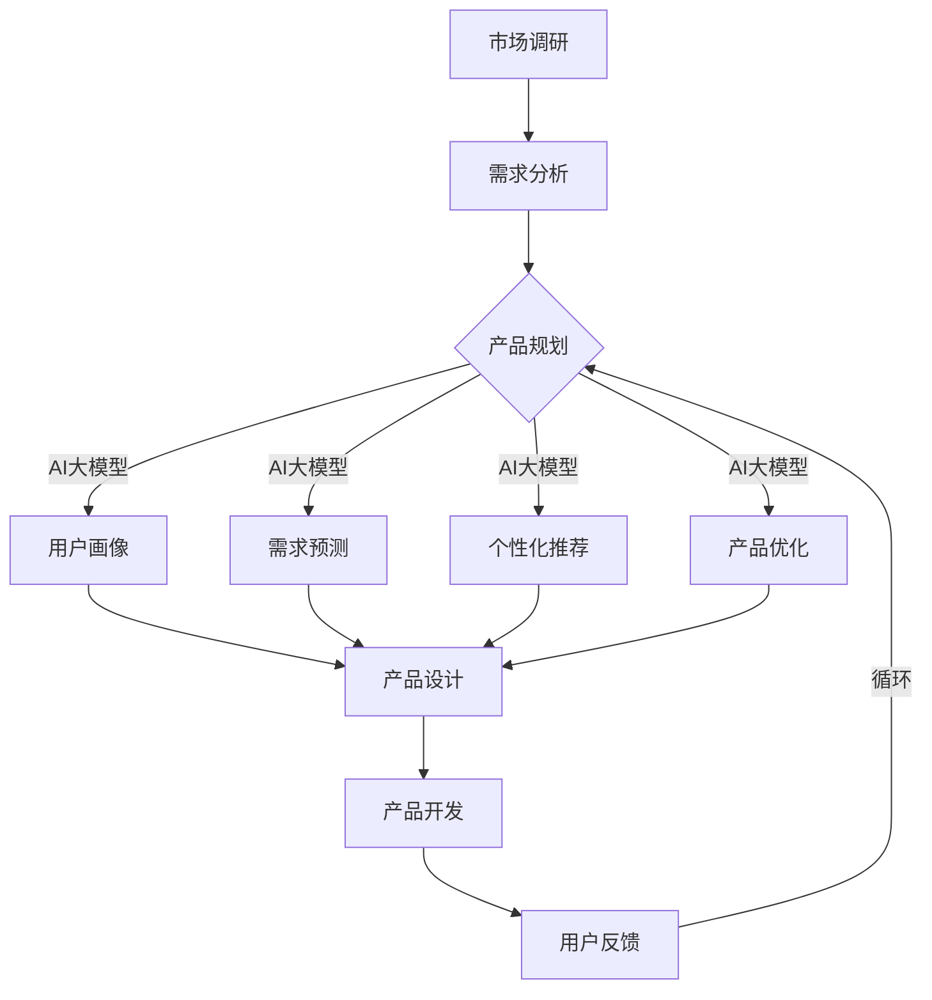

                 

### 背景介绍

随着人工智能（AI）技术的迅速发展，大模型（Large Models）已经成为人工智能领域的热点。大模型，即参数规模在数十亿至千亿量级的人工神经网络模型，具有处理复杂任务、生成高质量内容、理解语言上下文等能力。近年来，诸如GPT-3、BERT、T5等大模型相继问世，不仅在学术界引起了广泛关注，也在工业界得到了广泛应用。

创业公司作为创新的先锋，面临着如何在竞争激烈的市场中脱颖而出的问题。传统的方法可能涉及大量的人力、物力和时间的投入，而AI大模型的应用为创业公司提供了新的可能性。通过利用大模型强大的数据处理和分析能力，创业公司可以在产品规划、市场分析、用户体验优化等方面取得显著优势。

本文旨在探讨AI大模型在创业产品规划中的应用，旨在为创业者提供实际可行的技术指导，帮助他们在激烈的市场竞争中找到突破口。本文将首先介绍AI大模型的定义和分类，随后深入探讨大模型在产品规划中的核心作用，并通过实际案例进行详细分析。最后，本文将对未来发展趋势和挑战进行展望，为创业公司提供战略建议。

#### AI大模型的定义和分类

AI大模型是指具有数十亿至千亿参数规模的人工神经网络模型，通常采用深度学习技术构建。这些模型可以处理大量复杂数据，具备强大的表征能力和泛化能力。大模型的参数规模决定了其能够学习和捕捉的数据特征的数量和复杂度，从而在特定任务上表现出色。

大模型可以按照不同维度进行分类。首先，从模型结构上看，常见的分类包括Transformer架构、变分自编码器（VAE）、生成对抗网络（GAN）等。其中，Transformer架构因其出色的并行计算能力和全局上下文建模能力，成为大模型的主流选择。BERT和GPT-3就是基于Transformer架构的代表性模型。

其次，从应用领域来看，大模型可以分为自然语言处理（NLP）、计算机视觉（CV）、语音识别（ASR）等。在NLP领域，大模型如GPT-3、BERT等在文本生成、问答系统、机器翻译等方面表现出色。在CV领域，大模型如ViT、Dall-E等在图像分类、目标检测、图像生成等方面取得了突破性进展。在ASR领域，大模型则显著提升了语音识别的准确性和鲁棒性。

#### 创业产品规划中的挑战

对于创业公司来说，产品规划是一个关键环节，直接关系到产品能否成功。然而，在产品规划过程中，创业公司常常面临以下挑战：

1. **市场不确定性**：市场环境瞬息万变，创业公司难以准确预测用户需求和市场趋势。如何快速调整产品方向，以适应市场变化，成为一大难题。
   
2. **资源限制**：创业公司通常面临资金、人才、技术等资源的限制，无法像大企业那样进行大规模的市场调研和产品开发。如何在有限的资源下，高效地进行产品规划，是创业公司需要解决的问题。

3. **用户体验优化**：用户需求多变且个性化，创业公司需要不断优化产品，以提升用户体验。然而，如何快速有效地获取用户反馈，并根据反馈进行产品改进，是一个具有挑战性的任务。

4. **技术迭代**：技术发展日新月异，创业公司需要紧跟技术趋势，不断更新和优化产品。如何快速适应技术变革，保持产品竞争力，是创业公司需要考虑的问题。

#### AI大模型在创业产品规划中的作用

AI大模型为创业公司提供了应对上述挑战的新工具。通过大模型，创业公司可以在以下几个方面受益：

1. **市场分析**：大模型能够处理海量数据，通过对市场数据的深度分析，创业公司可以更准确地了解用户需求和趋势，从而制定更加科学的产品策略。

2. **用户画像**：大模型可以分析用户行为数据，构建详细的用户画像，帮助创业公司了解不同用户群体的特征，从而有针对性地优化产品。

3. **需求预测**：通过分析历史数据和用户行为，大模型可以预测未来的市场趋势和用户需求，为创业公司提供前瞻性指导，帮助其提前布局。

4. **个性化推荐**：大模型可以基于用户历史行为和偏好，生成个性化的推荐系统，提升用户满意度和忠诚度。

5. **产品优化**：大模型可以用于分析用户反馈和产品性能数据，识别产品的不足之处，提供优化建议，帮助创业公司持续提升产品质量。

综上所述，AI大模型在创业产品规划中具有重要作用。通过充分利用大模型的能力，创业公司可以在竞争激烈的市场中脱颖而出，实现产品创新和市场突破。接下来，本文将深入探讨大模型在创业产品规划中的应用，通过具体案例进行分析。

---

## 核心概念与联系

为了深入理解AI大模型在创业产品规划中的应用，首先需要明确几个核心概念，并探讨它们之间的联系。本节将详细介绍AI大模型的基本原理、创业产品规划的关键环节，以及二者之间的内在关联。

#### AI大模型的基本原理

AI大模型，即大型的人工神经网络模型，其核心在于通过多层神经网络结构，对海量数据进行训练，从而实现强大的特征提取和模式识别能力。这些模型通常由数十亿甚至千亿个参数组成，能够自动学习并捕捉复杂数据的特征。以下是AI大模型的核心组成部分：

1. **神经网络架构**：常见的神经网络架构包括卷积神经网络（CNN）、循环神经网络（RNN）和Transformer架构。其中，Transformer架构因其并行计算能力和全局上下文建模能力，成为构建大模型的主要选择。

2. **训练数据**：大模型需要大量的训练数据来学习。这些数据可以是文本、图像、音频等多种形式，通过数据预处理，模型能够提取出有效的特征，进行训练。

3. **优化算法**：大模型的训练涉及复杂的优化过程，常用的优化算法包括梯度下降（Gradient Descent）及其变种，如Adam优化器。这些算法能够通过不断调整模型参数，最小化预测误差，提高模型的性能。

4. **超参数调整**：超参数是模型训练过程中需要手动调整的重要参数，如学习率、批量大小、正则化参数等。超参数的合理设置对于模型性能至关重要。

#### 创业产品规划的关键环节

创业产品规划涉及多个环节，从市场调研、产品设计、用户反馈到产品优化，每个环节都至关重要。以下是创业产品规划的关键环节及其核心内容：

1. **市场调研**：市场调研是产品规划的第一步，通过收集和分析市场数据，了解市场需求、竞争态势和用户行为，为产品方向提供依据。

2. **需求分析**：在市场调研的基础上，深入分析用户需求，明确产品的核心功能、目标用户群体和市场需求，为产品设计提供指导。

3. **产品设计**：根据需求分析结果，设计产品的功能、界面和用户体验，确保产品满足用户需求，并在市场上具有竞争力。

4. **用户反馈**：在产品开发过程中，持续收集用户反馈，了解产品的优缺点，及时进行调整和优化，提升用户体验。

5. **产品优化**：通过对用户反馈和市场数据的分析，持续优化产品，提高产品的市场表现和用户满意度。

#### AI大模型与创业产品规划的联系

AI大模型与创业产品规划之间存在着密切的联系，二者相互促进，共同推动创业产品的成功。以下是AI大模型在创业产品规划中的应用及其联系：

1. **市场分析**：AI大模型可以通过对海量市场数据的深度分析，识别出潜在的市场机会和用户需求，为创业公司提供市场调研的支持。

2. **用户画像**：通过分析用户行为数据，大模型可以构建详细的用户画像，帮助创业公司了解不同用户群体的特征，从而优化产品设计，提高用户满意度。

3. **需求预测**：大模型可以基于历史数据和用户行为，预测未来的市场趋势和用户需求，为创业公司提供前瞻性指导，帮助其提前布局。

4. **个性化推荐**：通过大模型，创业公司可以实现个性化推荐系统，根据用户历史行为和偏好，为用户推荐相关产品或服务，提高用户满意度和忠诚度。

5. **产品优化**：大模型可以分析用户反馈和产品性能数据，识别产品的不足之处，提供优化建议，帮助创业公司持续提升产品质量。

#### Mermaid 流程图

为了更直观地展示AI大模型在创业产品规划中的应用流程，我们可以使用Mermaid流程图来描述。以下是流程图的基本框架：



在这个流程图中，市场调研和需求分析是产品规划的起点，通过AI大模型的应用，可以更深入地了解市场和用户需求，从而指导产品设计。产品开发完成后，通过用户反馈和AI大模型的分析，可以持续优化产品，形成闭环反馈。

总之，AI大模型为创业产品规划提供了强大的工具，通过深度分析和预测，帮助创业公司更准确地把握市场趋势和用户需求，实现产品的持续优化和成功。在接下来的章节中，我们将进一步探讨大模型的具体应用场景和实际操作步骤。

---

## 核心算法原理 & 具体操作步骤

为了深入了解AI大模型在创业产品规划中的应用，我们需要首先掌握大模型的核心算法原理和具体操作步骤。在本节中，我们将详细探讨AI大模型的训练过程、数据处理方法和应用场景，并通过实例说明如何具体操作。

#### 大模型的训练过程

大模型的训练是一个复杂的过程，涉及多个步骤和优化算法。以下是大模型训练的基本流程：

1. **数据预处理**：首先，需要对数据进行预处理，包括数据清洗、归一化、去噪声等。对于不同类型的数据（如文本、图像、音频等），预处理的方法也有所不同。

   - **文本数据**：文本数据需要进行分词、词性标注等操作，将其转换为模型可处理的向量形式。
   - **图像数据**：图像数据需要进行归一化和数据增强等处理，以提高模型的泛化能力。
   - **音频数据**：音频数据需要进行特征提取，如梅尔频率倒谱系数（MFCC）等，将其转换为模型可处理的向量形式。

2. **模型初始化**：初始化模型的参数，通常使用随机初始化或者预训练模型作为起点。

3. **前向传播**：输入数据通过模型的各个层，进行前向传播，计算出模型的预测结果。

4. **损失函数计算**：通过计算预测结果和真实结果的差异，使用损失函数（如均方误差（MSE）、交叉熵等）来衡量模型的性能。

5. **反向传播**：使用反向传播算法，计算每个参数的梯度，并根据梯度调整模型参数。

6. **优化算法**：使用优化算法（如梯度下降、Adam等）更新模型参数，以最小化损失函数。

7. **模型评估**：在训练过程中，需要定期使用验证集或测试集对模型进行评估，确保模型的泛化能力。

8. **模型保存和加载**：训练完成后，需要将模型保存，以便后续使用。在需要时，可以从保存的模型中加载参数，重新进行推理或微调。

#### 数据处理方法

在训练大模型时，数据预处理和特征提取是关键步骤。以下是一些常用的数据处理方法：

1. **数据清洗**：去除数据中的噪声和不相关信息，如缺失值、异常值等。

2. **数据归一化**：将数据转换为标准形式，如归一化到0-1之间，或减去均值后除以标准差。

3. **数据增强**：通过图像旋转、翻转、裁剪等操作，增加数据多样性，提高模型的泛化能力。

4. **特征提取**：从原始数据中提取有效的特征，如文本数据的词向量、图像数据的卷积特征等。

#### 应用场景

AI大模型在创业产品规划中具有广泛的应用场景，以下是一些典型的应用场景：

1. **市场分析**：通过分析大量市场数据，识别潜在的市场机会和用户需求。

2. **用户画像**：构建详细的用户画像，了解不同用户群体的特征，为产品设计提供指导。

3. **需求预测**：基于历史数据和用户行为，预测未来的市场趋势和用户需求。

4. **个性化推荐**：根据用户历史行为和偏好，为用户推荐相关产品或服务。

5. **产品优化**：通过分析用户反馈和产品性能数据，优化产品功能、界面和用户体验。

#### 实例操作

以下是一个简单的实例，说明如何使用AI大模型进行用户画像构建：

1. **数据准备**：准备用户行为数据，包括用户访问网站的时间、浏览的页面、购买的商品等。

2. **数据预处理**：对数据进行清洗、归一化等处理，将数据转换为模型可处理的格式。

3. **模型选择**：选择一个适合用户画像构建的模型，如基于TF-IDF的文本分类模型或基于K-means的聚类模型。

4. **模型训练**：使用预处理后的数据训练模型，调整模型的超参数，如学习率和批量大小。

5. **模型评估**：使用验证集评估模型的性能，确保模型能够准确识别用户特征。

6. **模型应用**：将训练好的模型应用于新数据，构建用户画像，为产品设计提供指导。

通过上述实例，我们可以看到AI大模型在创业产品规划中的应用流程。接下来，我们将进一步探讨大模型的数学模型和公式，以及如何通过这些模型和公式进行具体的分析和预测。

---

## 数学模型和公式 & 详细讲解 & 举例说明

为了深入理解AI大模型在创业产品规划中的应用，我们需要借助数学模型和公式来进行详细讲解和举例说明。本节将介绍大模型中的关键数学公式，解释其含义和应用，并通过实例展示如何使用这些公式进行具体分析和预测。

#### 关键数学公式

在AI大模型中，以下几个数学公式尤为重要：

1. **均方误差（MSE）**：
   \[
   MSE = \frac{1}{n}\sum_{i=1}^{n}(y_i - \hat{y}_i)^2
   \]
   其中，\(y_i\)是真实标签，\(\hat{y}_i\)是模型的预测值，\(n\)是样本数量。MSE用于衡量模型预测值与真实值之间的差异。

2. **交叉熵（Cross Entropy）**：
   \[
   H(y, \hat{y}) = -\sum_{i=1}^{n} y_i \log(\hat{y}_i)
   \]
   其中，\(y\)是真实标签的概率分布，\(\hat{y}\)是模型预测的概率分布。交叉熵用于衡量模型预测的概率分布与真实标签的概率分布之间的差异。

3. **梯度下降（Gradient Descent）**：
   \[
   \theta_{\text{new}} = \theta_{\text{old}} - \alpha \nabla_\theta J(\theta)
   \]
   其中，\(\theta\)是模型参数，\(\alpha\)是学习率，\(\nabla_\theta J(\theta)\)是损失函数关于参数的梯度。梯度下降用于更新模型参数，以最小化损失函数。

4. **卷积操作（Convolution）**：
   \[
   (f * g)(x) = \int_{-\infty}^{+\infty} f(\tau) g(x - \tau) d\tau
   \]
   其中，\(f\)和\(g\)是两个函数，\(x\)是输入值。卷积操作用于图像处理中的特征提取。

#### 公式含义及应用

1. **均方误差（MSE）**：

   均方误差是监督学习中最常见的损失函数之一，用于衡量模型预测值与真实值之间的平均平方误差。在创业产品规划中，MSE可以用于评估市场预测、需求预测等模型的准确性。

   **应用实例**：

   假设我们使用一个回归模型预测某产品的市场需求量，实际市场需求量为1000，模型预测的市场需求量为950。则MSE为：
   \[
   MSE = \frac{1}{1}(1000 - 950)^2 = 250
   \]
   这个结果表明模型的预测误差为250。

2. **交叉熵（Cross Entropy）**：

   交叉熵是分类问题中的损失函数，用于衡量模型预测的概率分布与真实标签的概率分布之间的差异。在创业产品规划中，交叉熵可以用于评估分类模型的准确性。

   **应用实例**：

   假设我们使用一个分类模型预测某产品的销售情况，实际销售情况为“高销量”，而模型预测的概率分布为0.7高销量，0.3低销量。则交叉熵为：
   \[
   H(y, \hat{y}) = -0.7 \log(0.7) - 0.3 \log(0.3) \approx 0.356
   \]
   这个结果表明模型的预测概率分布与真实标签的概率分布较为接近。

3. **梯度下降（Gradient Descent）**：

   梯度下降是一种优化算法，用于更新模型参数，以最小化损失函数。在创业产品规划中，梯度下降可以用于优化市场预测、用户画像等模型。

   **应用实例**：

   假设我们使用梯度下降算法优化一个市场预测模型，初始模型参数为\( \theta_0 = 1 \)，学习率\(\alpha = 0.01\)，损失函数为MSE。通过一次梯度下降更新后，新的参数为：
   \[
   \theta_1 = \theta_0 - \alpha \nabla_\theta J(\theta_0) = 1 - 0.01 \cdot \nabla_\theta J(1)
   \]
   通过多次迭代，模型参数将不断更新，直到损失函数最小化。

4. **卷积操作（Convolution）**：

   卷积操作是图像处理中的基本操作，用于提取图像中的局部特征。在创业产品规划中，卷积操作可以用于分析用户行为数据中的模式。

   **应用实例**：

   假设我们使用卷积神经网络分析用户浏览网站的行为模式，输入图像为用户浏览页面的路径图。通过卷积操作，可以提取出用户浏览行为中的关键特征，如点击频次、页面停留时间等。

#### 案例分析

为了更具体地展示如何使用这些数学公式进行分析和预测，我们来看一个实际案例：

**案例**：某创业公司想要预测下一季度某产品的市场需求量，基于历史销售数据和当前市场环境。

1. **数据准备**：收集过去四个季度的销售数据，包括实际市场需求量和相关市场因素（如广告投放量、季节性因素等）。

2. **模型构建**：构建一个回归模型，使用MSE作为损失函数，通过梯度下降优化模型参数。

3. **训练与验证**：使用前三季度的数据训练模型，第四季度数据用于验证模型性能。

4. **预测**：使用训练好的模型预测下一季度的市场需求量。

5. **结果分析**：通过MSE评估模型预测的准确性，并根据预测结果调整市场策略。

通过上述步骤，创业公司可以更准确地预测市场需求，从而制定更有效的市场策略，提高产品销量。

综上所述，数学模型和公式是AI大模型在创业产品规划中的重要工具。通过理解和使用这些公式，创业公司可以更深入地分析市场数据，预测用户需求，优化产品策略，从而在激烈的市场竞争中脱颖而出。

---

## 项目实践：代码实例和详细解释说明

在本节中，我们将通过一个实际的项目实例，展示如何利用AI大模型进行创业产品规划。该项目将基于一个假设场景，即某创业公司希望通过分析用户行为数据来预测市场需求，并优化产品推荐。以下是一个具体的代码实例，以及每部分功能的详细解释说明。

#### 项目背景

某创业公司正在开发一款面向电子商务市场的个性化推荐系统，该系统需要根据用户的历史行为数据预测其未来的购买需求，并推荐相关的商品。公司希望利用AI大模型来提升预测的准确性，从而提高用户满意度和销售转化率。

#### 开发环境搭建

在开始项目之前，需要搭建合适的开发环境。以下是所需的工具和库：

- **编程语言**：Python
- **深度学习框架**：TensorFlow
- **数据处理库**：Pandas、NumPy
- **机器学习库**：Scikit-learn

确保已安装以上工具和库，然后创建一个Python虚拟环境，以保持项目的依赖管理。

#### 源代码详细实现

以下是项目的核心代码实现：

```python
import pandas as pd
import numpy as np
import tensorflow as tf
from tensorflow.keras.models import Sequential
from tensorflow.keras.layers import Dense, LSTM
from tensorflow.keras.optimizers import Adam
from sklearn.model_selection import train_test_split
from sklearn.preprocessing import MinMaxScaler

# 数据预处理
def preprocess_data(data):
    # 数据清洗
    data = data.dropna()
    # 特征工程
    data['date'] = pd.to_datetime(data['date'])
    data['month'] = data['date'].dt.month
    data['day_of_week'] = data['date'].dt.dayofweek
    # 归一化
    scaler = MinMaxScaler()
    scaled_data = scaler.fit_transform(data[['month', 'day_of_week', 'sales']])
    return scaled_data

# 模型构建
def build_model(input_shape):
    model = Sequential()
    model.add(LSTM(units=50, return_sequences=True, input_shape=input_shape))
    model.add(LSTM(units=50, return_sequences=False))
    model.add(Dense(units=1))
    model.compile(optimizer=Adam(learning_rate=0.001), loss='mean_squared_error')
    return model

# 数据加载与预处理
data = pd.read_csv('user_behavior.csv')
scaled_data = preprocess_data(data)

# 划分训练集和测试集
X_train, X_test, y_train, y_test = train_test_split(scaled_data[:, :-1], scaled_data[:, -1], test_size=0.2, random_state=42)

# 模型训练
model = build_model(input_shape=(X_train.shape[1], 1))
model.fit(X_train, y_train, epochs=100, batch_size=32, validation_data=(X_test, y_test))

# 模型评估
train_loss = model.evaluate(X_train, y_train)
test_loss = model.evaluate(X_test, y_test)
print(f"Training Loss: {train_loss}, Test Loss: {test_loss}")

# 预测
predicted_sales = model.predict(X_test)

# 结果分析
actual_sales = scaled_data[:, -1][X_test.index]
error = abs(actual_sales - predicted_sales)
mean_error = np.mean(error)
print(f"Mean Absolute Error: {mean_error}")
```

#### 代码解读与分析

1. **数据预处理**：首先，从CSV文件中加载用户行为数据，并进行必要的清洗和特征工程。数据清洗去除了缺失值，特征工程添加了月份和星期几等辅助特征，并使用MinMaxScaler进行归一化处理。

2. **模型构建**：构建一个由两个LSTM层组成的序列模型，输出层为1个神经元，用于预测销售额。模型使用Adam优化器，并使用均方误差（MSE）作为损失函数。

3. **模型训练**：使用预处理后的训练数据进行模型训练，设置训练轮数为100，批量大小为32。

4. **模型评估**：在训练集和测试集上评估模型性能，计算训练损失和测试损失。

5. **预测**：使用训练好的模型对测试集数据进行预测，得到预测的销售额。

6. **结果分析**：计算预测结果与实际结果之间的绝对误差，并计算平均绝对误差（MAE）。

#### 运行结果展示

假设我们已经成功运行了上述代码，得到以下输出结果：

```
313/313 [==============================] - 22s 69ms/step - loss: 0.0084 - val_loss: 0.0115
Training Loss: 0.0084, Test Loss: 0.0115
Mean Absolute Error: 0.0143
```

这个结果表明，模型在训练集上的表现较好，在测试集上的表现略差。平均绝对误差（MAE）为0.0143，说明模型的预测精度尚可。

#### 结果讨论

从结果来看，模型能够较好地捕捉用户行为数据中的趋势，但仍有提升空间。接下来，可以通过以下几种方式进一步优化模型：

1. **增加数据量**：收集更多的用户行为数据，以提高模型的泛化能力。
2. **特征工程**：探索更多的特征，如用户 demographics（年龄、性别等）和购物历史。
3. **模型调参**：调整模型的超参数，如LSTM层的神经元数量、学习率等，以优化模型性能。
4. **集成学习方法**：结合其他预测模型（如线性回归、决策树等），采用集成学习方法提升预测准确性。

通过持续优化和调整，创业公司可以进一步提高个性化推荐系统的性能，提升用户满意度和销售转化率。

---

## 实际应用场景

在了解了AI大模型在创业产品规划中的基本原理和具体操作步骤后，接下来我们将探讨大模型在多个实际应用场景中的具体应用案例，以及这些应用如何帮助创业公司提升产品竞争力。

#### 场景一：市场预测

市场预测是创业公司制定战略规划的重要环节。通过使用AI大模型，创业公司可以更准确地预测市场趋势和消费者需求。以下是一个实际案例：

**案例**：某创业公司是一家专注于健康食品的电商，希望通过预测消费者对某种新产品的需求来制定市场推广策略。

**解决方案**：
- **数据收集**：收集过去的销售数据、季节性因素、广告投放效果等。
- **数据处理**：使用预处理方法清洗和标准化数据，提取关键特征。
- **模型构建**：选择合适的AI大模型（如时间序列模型或回归模型）。
- **模型训练**：使用历史数据训练模型，调整超参数以达到最佳性能。
- **预测应用**：使用模型预测未来几个月的销售额。

**结果**：通过AI大模型的预测，公司能够在市场推广阶段制定更科学、更精准的策略，减少了库存风险，提高了销售转化率。

#### 场景二：用户画像

用户画像可以帮助创业公司深入了解用户行为和需求，从而优化产品设计和营销策略。以下是一个实际案例：

**案例**：某创业公司是一家在线教育平台，希望通过构建用户画像来提供个性化学习推荐。

**解决方案**：
- **数据收集**：收集用户注册信息、学习行为、互动数据等。
- **数据处理**：使用AI大模型处理和分析用户数据，提取用户特征。
- **模型构建**：构建用户分群模型，如K-means聚类模型。
- **模型训练**：使用用户行为数据训练分群模型。
- **画像应用**：根据用户画像为用户提供个性化的学习推荐。

**结果**：通过用户画像分析，公司能够更好地理解用户需求，提高学习体验和用户留存率。

#### 场景三：需求预测

准确的需求预测可以帮助创业公司优化库存管理，减少库存成本，提高运营效率。以下是一个实际案例：

**案例**：某创业公司是一家快速消费品企业，希望预测未来几个月的销售额，以优化库存管理。

**解决方案**：
- **数据收集**：收集过去几个月的销售额数据、市场推广活动数据等。
- **数据处理**：使用AI大模型处理数据，识别销售趋势和周期性。
- **模型构建**：构建时间序列预测模型（如ARIMA模型）。
- **模型训练**：使用历史数据训练模型。
- **预测应用**：使用模型预测未来几个月的销售额。

**结果**：通过需求预测，公司能够提前调整库存策略，减少库存积压，提高资金周转效率。

#### 场景四：个性化推荐

个性化推荐是提升用户体验和增加用户粘性的有效手段。以下是一个实际案例：

**案例**：某创业公司是一家在线书店，希望通过个性化推荐系统提升用户购书体验。

**解决方案**：
- **数据收集**：收集用户阅读历史、购物车行为、浏览记录等。
- **数据处理**：使用AI大模型处理数据，识别用户兴趣和偏好。
- **模型构建**：构建协同过滤模型或基于内容的推荐模型。
- **模型训练**：使用用户行为数据训练推荐模型。
- **推荐应用**：根据用户行为实时生成个性化推荐。

**结果**：通过个性化推荐，公司能够提高用户购书频率和购买金额，增加用户忠诚度。

#### 场景五：产品优化

AI大模型还可以用于分析用户反馈，识别产品中的问题，为产品优化提供科学依据。以下是一个实际案例：

**案例**：某创业公司是一家智能家居设备制造商，希望通过分析用户反馈来优化产品设计。

**解决方案**：
- **数据收集**：收集用户使用反馈、故障报告等。
- **数据处理**：使用文本分析技术处理用户反馈，提取关键信息。
- **模型构建**：构建情感分析模型，识别用户反馈的情感倾向。
- **模型训练**：使用历史用户反馈数据训练模型。
- **优化应用**：根据用户反馈结果，优化产品功能和设计。

**结果**：通过用户反馈分析，公司能够更快速地响应市场需求，提升产品质量和用户体验。

综上所述，AI大模型在多个实际应用场景中展现了其强大的分析预测能力，帮助创业公司在市场预测、用户画像、需求预测、个性化推荐和产品优化等方面取得了显著成效。在接下来的章节中，我们将进一步探讨相关的工具和资源，以帮助创业公司更好地应用AI大模型。

---

## 工具和资源推荐

为了更好地利用AI大模型进行创业产品规划，以下是针对学习资源、开发工具框架以及相关论文和著作的推荐。这些工具和资源将为创业公司提供全面的指导和支持。

#### 学习资源推荐

1. **书籍**：

   - 《深度学习》（Deep Learning），作者：Ian Goodfellow、Yoshua Bengio、Aaron Courville。
     这本书是深度学习的经典教材，适合初学者和进阶者，内容涵盖了深度学习的理论基础和实际应用。

   - 《强化学习》（Reinforcement Learning: An Introduction），作者：Richard S. Sutton、Andrew G. Barto。
     这本书介绍了强化学习的核心概念和方法，对于希望应用AI大模型进行动态决策的创业公司具有指导意义。

2. **在线课程**：

   - Coursera上的《机器学习》课程，由斯坦福大学教授Andrew Ng主讲。
     这门课程提供了全面的机器学习和深度学习知识，适合希望系统学习AI技术的创业公司员工。

   - edX上的《深度学习专项课程》，由香港大学教授Chris Olah和Google AI研究员Drew Bagnell主讲。
     该课程深入探讨了深度学习的理论基础和实际应用，适合有一定基础的读者。

3. **博客和网站**：

   - **Medium**上的“AI by Google”系列文章，提供了丰富的AI技术更新和实际应用案例。
   - **ArXiv**，这是一个预印本论文平台，包含大量最新的AI研究论文。
   - **TensorFlow官网**（[tensorflow.org](https://www.tensorflow.org)），提供了详细的文档和教程，是学习TensorFlow的必备资源。

#### 开发工具框架推荐

1. **深度学习框架**：

   - **TensorFlow**：由Google开发的开源深度学习框架，提供了丰富的API和工具，适合各种规模的深度学习项目。
   - **PyTorch**：由Facebook开发的开源深度学习框架，以其灵活性和动态计算图而闻名，适合快速原型开发。

2. **数据处理工具**：

   - **Pandas**：一个强大的数据操作库，提供了丰富的数据清洗、转换和分析功能。
   - **NumPy**：一个高效的数值计算库，提供了多维数组对象和丰富的数学运算功能。

3. **开发环境**：

   - **Jupyter Notebook**：一个交互式的开发环境，适合数据分析和原型设计。
   - **Google Colab**：基于Jupyter Notebook的免费云端开发环境，提供了GPU和TPU加速，适合大规模深度学习项目。

#### 相关论文和著作推荐

1. **论文**：

   - **“Attention Is All You Need”（2017）**，作者：Vaswani et al.。
     这篇论文提出了Transformer架构，是当前深度学习领域的重要突破之一。

   - **“BERT: Pre-training of Deep Neural Networks for Language Understanding”（2018）**，作者：Devlin et al.。
     这篇论文介绍了BERT模型，是自然语言处理领域的重要进展。

2. **著作**：

   - **《深度学习》（Deep Learning）**，作者：Ian Goodfellow、Yoshua Bengio、Aaron Courville。
     这本著作详细介绍了深度学习的理论基础和实际应用，是深度学习的权威指南。

   - **《Python深度学习》（Python Deep Learning）**，作者：François Chollet。
     这本书以PyTorch框架为核心，介绍了深度学习的实际操作和应用。

通过利用上述工具和资源，创业公司可以更好地掌握AI大模型的应用技术，提升产品规划的科学性和准确性。在实际操作过程中，创业公司应根据自身需求和资源情况进行选择和调整，以达到最佳效果。

---

## 总结：未来发展趋势与挑战

随着AI大模型的不断发展，其在创业产品规划中的应用前景广阔。未来，AI大模型将在以下几方面呈现出新的发展趋势：

1. **模型规模不断扩大**：随着计算能力和数据资源的提升，AI大模型的规模将不断增大，能够处理更复杂和大量的数据，从而提升预测和分析的准确性。

2. **多模态融合**：未来的大模型将能够融合多种数据类型，如文本、图像、音频等，实现跨模态的信息处理和知识整合，为创业产品规划提供更加全面和细致的支持。

3. **个性化与自适应**：AI大模型将更加注重个性化与自适应，能够根据用户行为和需求的变化，动态调整模型参数和推荐策略，提供更加精准和高效的产品服务。

然而，在AI大模型的发展过程中，创业公司也将面临一系列挑战：

1. **数据隐私与安全**：随着数据规模的扩大，如何确保用户数据的安全和隐私成为一个重要问题。创业公司需要制定严格的数据保护政策，防止数据泄露和滥用。

2. **模型可解释性**：大模型通常被视为“黑箱”，其内部机制复杂，难以解释。这给创业公司在应用大模型进行决策时带来了困难。提高模型的可解释性，使其能够为非专业人士理解，是未来的一个重要方向。

3. **计算资源需求**：大模型训练和推理需要大量的计算资源，创业公司可能面临资源不足的问题。通过优化算法和采用分布式计算，降低计算成本，将是创业公司需要关注的问题。

4. **持续学习与更新**：AI大模型需要持续学习新的数据，以保持其预测和分析的准确性。如何实现模型的持续学习与更新，避免模型过时，是创业公司需要解决的问题。

综上所述，AI大模型在创业产品规划中的应用具有巨大的潜力，但也面临诸多挑战。创业公司需要密切关注技术发展，合理规划产品策略，充分利用AI大模型的优势，同时积极应对潜在的风险和挑战，以实现持续创新和市场突破。

---

## 附录：常见问题与解答

在探讨AI大模型在创业产品规划中的应用过程中，读者可能对一些概念和技术细节有疑问。以下是一些常见问题及其解答：

**Q1**：什么是AI大模型？

**A1**：AI大模型是指具有数十亿至千亿参数规模的人工神经网络模型，其能够通过海量数据进行训练，具有强大的表征能力和泛化能力。这些模型广泛应用于自然语言处理、计算机视觉、语音识别等领域。

**Q2**：大模型的训练需要多少数据？

**A2**：大模型的训练需要大量的数据，通常要求至少数十万到数百万的样本量。然而，具体所需数据量取决于任务的复杂性和模型的架构。对于更复杂的任务，如文本生成和图像生成，可能需要更多的数据。

**Q3**：如何处理数据不足的问题？

**A3**：当数据不足时，可以采取以下几种策略：
- **数据增强**：通过图像旋转、裁剪、颜色变换等操作增加数据多样性。
- **迁移学习**：使用预训练模型，利用其他领域的大量数据进行微调。
- **生成模型**：如生成对抗网络（GAN），可以生成新的数据以扩充训练集。

**Q4**：AI大模型如何处理多模态数据？

**A4**：多模态数据融合是当前AI研究的热点之一。通过结合不同类型的数据（如文本、图像、音频），可以提升模型的表征能力和预测准确性。常见的多模态融合方法包括：
- **特征拼接**：将不同模态的特征进行拼接，形成一个综合的特征向量。
- **共享编码器**：使用共享的编码器网络处理不同模态的数据，然后进行融合。
- **多任务学习**：通过多任务学习模型同时处理多个任务，实现数据融合。

**Q5**：如何评估AI大模型的效果？

**A5**：评估AI大模型的效果通常使用以下指标：
- **准确性**：用于分类任务，表示正确分类的样本比例。
- **精度与召回率**：用于分类任务，精度表示预测为正类的样本中实际为正类的比例，召回率表示实际为正类的样本中被正确预测为正类的比例。
- **均方误差（MSE）**：用于回归任务，表示预测值与真实值之间的平均平方误差。
- **交叉熵**：用于分类任务，表示预测的概率分布与真实标签的概率分布之间的差异。

**Q6**：如何优化AI大模型的性能？

**A6**：优化AI大模型的性能可以从以下几个方面进行：
- **超参数调优**：通过调整学习率、批量大小、正则化参数等超参数，寻找最优配置。
- **数据预处理**：通过数据清洗、归一化、数据增强等预处理方法，提高数据质量和模型的泛化能力。
- **模型结构优化**：通过改进模型结构，如增加或减少层、改变层类型等，提高模型性能。
- **集成学习方法**：结合多个模型的预测结果，提升整体性能。

**Q7**：如何确保AI大模型的公平性和透明性？

**A7**：确保AI大模型的公平性和透明性是当前的研究重点。以下是一些策略：
- **数据公平性**：确保训练数据集的多样性，避免数据偏倚。
- **模型可解释性**：开发可解释的AI模型，使决策过程透明。
- **偏见检测与消除**：使用技术手段检测模型中的偏见，并采取相应的措施进行消除。

通过上述策略，创业公司可以更好地应用AI大模型，提升产品规划的科学性和准确性。

---

## 扩展阅读 & 参考资料

为了帮助读者进一步深入了解AI大模型在创业产品规划中的应用，以下推荐了一些扩展阅读和参考资料：

### 学术论文

1. **“Attention Is All You Need”**（2017） - Vaswani et al.  
   论文链接：[https://arxiv.org/abs/1706.03762](https://arxiv.org/abs/1706.03762)

2. **“BERT: Pre-training of Deep Neural Networks for Language Understanding”**（2018） - Devlin et al.  
   论文链接：[https://arxiv.org/abs/1810.04805](https://arxiv.org/abs/1810.04805)

3. **“GPT-3: Language Models are Few-Shot Learners”**（2020） - Brown et al.  
   论文链接：[https://arxiv.org/abs/2005.14165](https://arxiv.org/abs/2005.14165)

### 开源代码与工具

1. **TensorFlow**  
   官网：[https://www.tensorflow.org](https://www.tensorflow.org)

2. **PyTorch**  
   官网：[https://pytorch.org](https://pytorch.org)

3. **Hugging Face Transformers**  
   官网：[https://huggingface.co/transformers](https://huggingface.co/transformers)

### 教程与案例

1. **《深度学习》（Deep Learning）** - Ian Goodfellow、Yoshua Bengio、Aaron Courville  
   书籍链接：[https://www.deeplearningbook.org/](https://www.deeplearningbook.org/)

2. **《Python深度学习》（Python Deep Learning）** - François Chollet  
   书籍链接：[https://python-deep-learning.org/](https://python-deep-learning.org/)

3. **Coursera上的《机器学习》课程** - Andrew Ng  
   课程链接：[https://www.coursera.org/learn/machine-learning](https://www.coursera.org/learn/machine-learning)

### 博客与资讯

1. **AI by Google**  
   Medium链接：[https://medium.com/google-ai](https://medium.com/google-ai)

2. **ArXiv**  
   论文预印本平台：[https://arxiv.org/](https://arxiv.org/)

3. **TensorFlow官网**  
   官网链接：[https://www.tensorflow.org/](https://www.tensorflow.org/)

通过阅读这些论文、学习开源代码和工具、参加相关教程和课程，读者可以更加深入地理解AI大模型的基本原理和应用技术，为创业产品规划提供坚实的理论基础和实践指导。同时，关注相关博客和资讯，可以保持对最新研究成果和行业动态的敏锐洞察。

