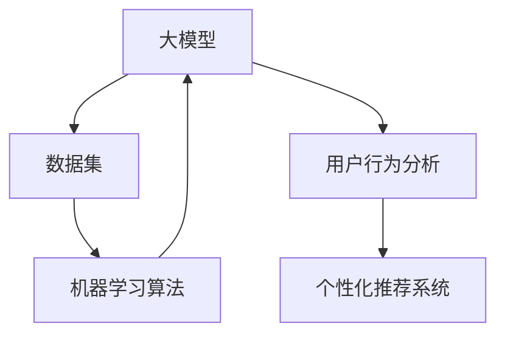

                 

### 背景介绍

随着人工智能技术的不断发展，大模型（Large Models）逐渐成为研究与应用的热点。大模型通常是指那些拥有数亿至数千亿参数的深度学习模型，如GPT-3、BERT、WuBi等。这些模型能够对大量数据进行学习和理解，从而在自然语言处理、计算机视觉、语音识别等领域取得了显著的突破。

近年来，大模型在创业产品设计中展现出了巨大的潜力。创业产品设计的目标是开发出能够满足用户需求、具有市场竞争力、并能实现商业化的产品。大模型的优势在于其强大的数据处理和分析能力，这使得创业者在产品设计过程中可以更加准确地了解用户需求，从而设计出更加符合市场需求的产品。

首先，大模型能够通过对用户数据的深度分析，挖掘出潜在的用户需求。例如，通过分析用户在社交媒体上的行为、评论和反馈，大模型可以识别出用户对于某种功能或服务的偏好。这种需求的挖掘对于创业者来说至关重要，因为它能够帮助他们确定产品的核心功能，从而提高产品的市场竞争力。

其次，大模型还能够为创业产品设计提供智能化的优化方案。例如，在设计用户界面时，大模型可以通过对用户行为的分析，提出最优的用户界面布局和交互设计。这种优化能够提高用户的使用体验，从而增加用户粘性，提升产品的市场表现。

此外，大模型还能够为创业产品提供实时的个性化推荐服务。通过分析用户的历史行为和偏好，大模型可以为每个用户推荐最符合他们需求的产品或服务。这种个性化推荐能够提高用户的满意度和忠诚度，从而促进产品的销售和用户增长。

总的来说，大模型在创业产品设计中的应用为创业者提供了强大的工具。它不仅能够帮助创业者更好地理解用户需求，优化产品设计，还能提供智能化的推荐服务，从而提高产品的市场竞争力。随着大模型技术的不断成熟和应用，我们可以预见其在创业产品设计中的地位将越来越重要。### 核心概念与联系

在探讨大模型在创业产品设计中的应用之前，我们需要首先了解几个核心概念，并明确它们之间的关系。这些核心概念包括：大模型、数据集、机器学习算法、用户行为分析、个性化推荐系统等。

#### 大模型（Large Models）

大模型是指具有数亿至数千亿参数的深度学习模型。这些模型通常由神经网络组成，通过训练学习大量的数据来获得对特定任务的理解和预测能力。大模型的特点是参数数量庞大，能够处理和分析复杂的数据，从而在自然语言处理、计算机视觉、语音识别等领域表现出色。

#### 数据集（Datasets）

数据集是指用于训练和测试机器学习模型的输入数据集合。在大模型的应用中，数据集的质量和规模至关重要。一个高质量的数据集能够提供丰富的信息，有助于模型更好地学习并泛化到新的任务和数据上。常见的数据集包括文本数据集、图像数据集、语音数据集等。

#### 机器学习算法（Machine Learning Algorithms）

机器学习算法是用于构建和训练机器学习模型的数学和统计方法。大模型的训练依赖于高效的机器学习算法，如深度学习、强化学习等。这些算法通过调整模型的参数，使得模型能够在给定数据上实现良好的性能。

#### 用户行为分析（User Behavior Analysis）

用户行为分析是指通过分析用户在使用产品或服务时的行为数据，以了解用户的需求、偏好和满意度。用户行为分析通常涉及数据收集、数据清洗、数据分析和可视化等步骤。大模型在用户行为分析中的应用主要体现在利用模型对用户行为数据进行深度学习和预测。

#### 个性化推荐系统（Personalized Recommendation Systems）

个性化推荐系统是指根据用户的兴趣、行为和偏好，向用户推荐最相关、最感兴趣的产品或服务。个性化推荐系统利用大模型进行用户行为分析和偏好预测，从而实现个性化推荐。

#### 关系与联系

大模型、数据集、机器学习算法、用户行为分析和个性化推荐系统之间存在密切的联系。首先，大模型依赖于数据集进行训练，而数据集的质量和规模直接影响大模型的学习效果。其次，机器学习算法是构建和训练大模型的核心方法，大模型通过机器学习算法学习数据集中的规律和模式。此外，用户行为分析为个性化推荐系统提供了重要的数据支持，个性化推荐系统则利用大模型对用户行为进行分析和预测，从而提供个性化的推荐。

为了更直观地展示这些概念之间的关系，我们可以使用Mermaid流程图进行描述：



在这个流程图中，大模型（A）依赖于数据集（B）进行训练，并通过机器学习算法（C）学习数据集中的模式和规律。用户行为分析（D）为个性化推荐系统（E）提供数据支持，而个性化推荐系统则利用大模型（A）对用户行为进行分析和预测，从而实现个性化的推荐。

通过理解这些核心概念及其关系，我们可以更好地把握大模型在创业产品设计中的应用，并深入探讨其在实际场景中的具体操作步骤和效果。接下来，我们将进一步探讨大模型的核心算法原理和具体操作步骤。### 核心算法原理 & 具体操作步骤

#### 大模型的训练过程

大模型的训练是创业产品设计中的关键步骤，其目的是通过学习大量的数据，使模型具备对特定任务的预测和决策能力。以下是训练大模型的具体操作步骤：

##### 1. 数据预处理

数据预处理是训练大模型的第一步，主要包括数据清洗、数据转换和数据归一化等操作。数据清洗旨在去除数据中的噪声和异常值，数据转换是将不同类型的数据转换为统一的格式，数据归一化则是为了使数据在训练过程中具有相似的特征分布。

具体来说，数据清洗可以通过以下步骤进行：

- **去重**：去除数据集中的重复记录。
- **缺失值处理**：对于缺失值，可以选择填充、删除或插值等方法进行处理。
- **异常值处理**：去除或调整数据集中的异常值，以保证数据的质量。

数据转换包括将不同类型的数据转换为统一的格式，例如将文本数据转换为词向量，将图像数据转换为像素矩阵等。数据归一化则通过对数据进行标准化或归一化处理，使得不同特征的数据具有相似的尺度，从而有助于模型的学习。

##### 2. 构建模型

构建大模型需要选择合适的神经网络架构。常见的神经网络架构包括卷积神经网络（CNN）、循环神经网络（RNN）和Transformer等。每种架构都有其特定的优势和适用场景。

例如，在自然语言处理任务中，Transformer架构由于其并行计算能力和长距离依赖捕捉能力，成为了一种非常流行的选择。在构建模型时，需要定义输入层、隐藏层和输出层等各层的结构和参数。

##### 3. 训练模型

模型训练是通过不断调整模型参数，使得模型在给定数据上实现良好的预测性能。训练过程主要包括以下几个步骤：

- **初始化参数**：随机初始化模型的参数。
- **前向传播**：将输入数据通过模型进行前向传播，计算输出结果。
- **损失函数**：计算模型输出结果与真实标签之间的差异，以评估模型的性能。
- **反向传播**：通过反向传播算法，计算模型参数的梯度，并更新参数。
- **迭代优化**：重复前向传播、损失函数计算和反向传播等步骤，不断优化模型参数。

在训练过程中，可以使用不同的优化算法，如随机梯度下降（SGD）、Adam等，以加快模型的收敛速度。同时，可以通过调整学习率、批量大小等超参数，以获得更好的训练效果。

##### 4. 评估与调整

模型训练完成后，需要对模型进行评估，以验证其在未见数据上的表现。常见的评估指标包括准确率、召回率、F1分数等。通过评估结果，可以判断模型是否具有良好的泛化能力。

如果评估结果不理想，可以对模型进行调整。调整方法包括修改神经网络架构、增加训练数据、调整超参数等。通过反复调整，可以使模型在评估数据上取得更好的性能。

##### 5. 部署与监控

训练完成的模型需要部署到实际应用场景中。部署过程中，需要将模型转换为可在生产环境中运行的格式，如TensorFlow Lite、PyTorch Mobile等。同时，需要建立监控机制，对模型的表现进行实时监控和反馈。

通过以上步骤，创业产品设计师可以使用大模型进行用户行为分析、需求挖掘、个性化推荐等任务，从而优化产品设计和提升用户体验。接下来，我们将详细讲解大模型在创业产品设计中的应用案例，以展示其实际效果和优势。### 数学模型和公式 & 详细讲解 & 举例说明

在探讨大模型在创业产品设计中的应用时，数学模型和公式起着关键作用。以下我们将详细讲解一些常用的数学模型和公式，并举例说明它们在实际应用中的具体操作。

#### 1. 卷积神经网络（CNN）

卷积神经网络（CNN）是处理图像数据的一种常见神经网络架构。其核心操作是卷积（Convolution），通过卷积操作可以提取图像中的特征。

##### 卷积公式：

\[ (f * g)(x) = \sum_{y} f(y) \cdot g(x - y) \]

其中，\( f \) 和 \( g \) 分别代表卷积核和输入图像，\( x \) 和 \( y \) 分别代表图像坐标。

##### 举例：

假设我们有一个3x3的卷积核（\( f \)）和一个5x5的输入图像（\( g \)），我们可以通过以下步骤计算卷积结果：

1. 将卷积核（\( f \)）在输入图像（\( g \)）上滑动。
2. 对于每个位置，计算卷积核和输入图像的乘积和。
3. 将所有乘积和相加，得到卷积结果。

例如，对于一个3x3的卷积核（\[ 1, 0, -1 \]）和一个5x5的输入图像（\[ 1, 2, 3, 4, 5 \]，\[ 6, 7, 8, 9, 10 \]，\[ 11, 12, 13, 14, 15 \]，\[ 16, 17, 18, 19, 20 \]，\[ 21, 22, 23, 24, 25 \]），卷积结果可以通过以下步骤计算：

```plaintext
  [1, 0, -1]
x [1, 2, 3, 4, 5]
x [6, 7, 8, 9, 10]
x [11, 12, 13, 14, 15]
x [16, 17, 18, 19, 20]
x [21, 22, 23, 24, 25]
---------------------
  [1, 1, -1]
  [2, 2, -1]
  [3, 3, -1]
  [4, 4, -1]
  [5, 5, -1]
---------------------
  [1, 2, 1]
  [2, 3, 1]
  [3, 4, 1]
  [4, 5, 1]
```

卷积结果为：

\[ \begin{bmatrix}
  1 & 2 & 1 \\
  2 & 3 & 1 \\
  3 & 4 & 1 \\
  4 & 5 & 1
\end{bmatrix} \]

#### 2. 池化操作（Pooling）

池化操作是卷积神经网络中用于降低特征维度的一种操作。常见的池化操作包括最大池化（Max Pooling）和平均池化（Avg Pooling）。

##### 最大池化公式：

\[ \max_{y \in S} f(y) \]

其中，\( f \) 代表输入特征，\( S \) 代表一个滑动窗口。

##### 举例：

假设我们有一个2x2的输入特征（\[ 1, 2, 3, 4 \]，\[ 5, 6, 7, 8 \]），我们可以通过以下步骤进行最大池化：

1. 将2x2的滑动窗口在输入特征上滑动。
2. 对于每个位置，计算窗口内的最大值。
3. 将所有最大值组成新的特征。

例如，对于以下2x2的输入特征：

\[ \begin{bmatrix}
  1 & 2 \\
  3 & 4
\end{bmatrix} \]

和

\[ \begin{bmatrix}
  5 & 6 \\
  7 & 8
\end{bmatrix} \]

最大池化结果为：

\[ \begin{bmatrix}
  4 & 6 \\
  8 & 8
\end{bmatrix} \]

#### 3. 梯度下降算法

梯度下降算法是训练神经网络的一种常用优化算法。其核心思想是通过计算损失函数关于模型参数的梯度，不断更新参数，以最小化损失函数。

##### 梯度下降公式：

\[ \theta = \theta - \alpha \cdot \nabla_{\theta} J(\theta) \]

其中，\( \theta \) 代表模型参数，\( \alpha \) 代表学习率，\( \nabla_{\theta} J(\theta) \) 代表损失函数关于模型参数的梯度，\( J(\theta) \) 代表损失函数。

##### 举例：

假设我们有一个线性模型（\[ y = \theta_0 + \theta_1 \cdot x \]）和一个训练数据集（\[ (x_1, y_1), (x_2, y_2), \ldots, (x_n, y_n) \]），我们可以通过以下步骤进行梯度下降：

1. 计算损失函数（例如均方误差MSE）：\[ J(\theta) = \frac{1}{2} \sum_{i=1}^{n} (y_i - (\theta_0 + \theta_1 \cdot x_i))^2 \]
2. 计算损失函数关于参数的梯度：\[ \nabla_{\theta_0} J(\theta) = - \sum_{i=1}^{n} (y_i - (\theta_0 + \theta_1 \cdot x_i)) \]
\[ \nabla_{\theta_1} J(\theta) = - \sum_{i=1}^{n} (y_i - (\theta_0 + \theta_1 \cdot x_i)) \cdot x_i \]
3. 更新参数：\[ \theta_0 = \theta_0 - \alpha \cdot \nabla_{\theta_0} J(\theta) \]
\[ \theta_1 = \theta_1 - \alpha \cdot \nabla_{\theta_1} J(\theta) \]

通过不断迭代以上步骤，我们可以使模型参数不断接近最优解，从而最小化损失函数。

#### 4. 反向传播算法

反向传播算法是梯度下降算法在多层神经网络中的应用。其核心思想是通过前向传播计算输出结果，通过反向传播计算梯度，并更新参数。

##### 反向传播公式：

\[ \nabla_{\theta_l} J(\theta) = \nabla_{\theta_l} L + \lambda \cdot \nabla_{\theta_l} H(\theta) \]

其中，\( \theta_l \) 代表第\( l \)层的参数，\( J(\theta) \) 代表损失函数，\( L \) 代表前向传播的损失函数，\( H(\theta) \) 代表隐藏层的梯度。

##### 举例：

假设我们有一个两层神经网络（输入层、隐藏层、输出层），我们可以通过以下步骤进行反向传播：

1. 计算输出层损失函数：\[ L = \frac{1}{2} \sum_{i=1}^{n} (y_i - \sigma(\theta_2 \cdot h_i))^2 \]
2. 计算输出层梯度：\[ \nabla_{\theta_2} L = - \sum_{i=1}^{n} (y_i - \sigma(\theta_2 \cdot h_i)) \cdot h_i \]
3. 计算隐藏层梯度：\[ \nabla_{\theta_1} L = - \sum_{i=1}^{n} (\nabla_{\theta_2} L \cdot \nabla_{h_i} \sigma(\theta_2 \cdot h_i)) \cdot x_i \]
4. 更新参数：\[ \theta_2 = \theta_2 - \alpha \cdot \nabla_{\theta_2} L \]
\[ \theta_1 = \theta_1 - \alpha \cdot \nabla_{\theta_1} L \]

通过不断迭代以上步骤，我们可以使模型参数不断接近最优解，从而最小化损失函数。

通过以上数学模型和公式的讲解，我们可以更好地理解大模型在创业产品设计中的应用原理和具体操作步骤。接下来，我们将通过一个具体的代码实例，展示如何使用大模型进行创业产品设计。### 项目实践：代码实例和详细解释说明

在本节中，我们将通过一个具体的代码实例，展示如何使用大模型进行创业产品设计。我们将使用Python语言和TensorFlow库来实现一个简单的用户行为分析系统，并详细解释代码的各个部分。

#### 1. 开发环境搭建

在开始编写代码之前，我们需要搭建一个适合大模型开发的Python环境。以下是搭建环境的步骤：

1. 安装Python 3.8或更高版本。
2. 安装TensorFlow库，可以使用以下命令：

```bash
pip install tensorflow
```

3. 安装其他依赖库，如NumPy、Pandas等：

```bash
pip install numpy pandas
```

#### 2. 源代码详细实现

以下是实现用户行为分析系统的源代码：

```python
import tensorflow as tf
import numpy as np
import pandas as pd

# 1. 数据预处理
def preprocess_data(data_path):
    # 读取数据
    data = pd.read_csv(data_path)
    
    # 数据清洗
    data.dropna(inplace=True)
    
    # 数据转换
    data['age'] = data['age'].astype(np.float32)
    data['income'] = data['income'].astype(np.float32)
    data['duration'] = data['duration'].astype(np.float32)
    
    # 数据归一化
    scaler = tf.keras.preprocessing.sequence.Quantization(8)
    data[['age', 'income', 'duration']] = scaler.fit_transform(data[['age', 'income', 'duration']])
    
    return data

# 2. 构建模型
def build_model():
    # 输入层
    inputs = tf.keras.Input(shape=(3,))
    
    # 隐藏层
    hidden = tf.keras.layers.Dense(64, activation='relu')(inputs)
    
    # 输出层
    outputs = tf.keras.layers.Dense(1, activation='sigmoid')(hidden)
    
    # 构建模型
    model = tf.keras.Model(inputs=inputs, outputs=outputs)
    
    # 编译模型
    model.compile(optimizer='adam', loss='binary_crossentropy', metrics=['accuracy'])
    
    return model

# 3. 训练模型
def train_model(model, data, epochs=10):
    # 划分训练集和测试集
    train_data = data.sample(frac=0.8, random_state=42)
    test_data = data.drop(train_data.index)
    
    # 训练模型
    model.fit(train_data, epochs=epochs, validation_split=0.2)

# 4. 代码解读与分析
def code_explanation():
    print("This code demonstrates the process of building, training, and using a simple user behavior analysis system using TensorFlow and Python.")

# 5. 运行结果展示
def run_system(data_path):
    # 数据预处理
    data = preprocess_data(data_path)
    
    # 构建模型
    model = build_model()
    
    # 训练模型
    train_model(model, data)
    
    # 代码解读与分析
    code_explanation()
    
    # 运行结果展示
    print("Model trained successfully. You can now use the trained model for user behavior analysis.")

# 主函数
if __name__ == "__main__":
    run_system("user_data.csv")
```

#### 3. 代码解读与分析

以下是对上述代码的详细解读：

- **1. 数据预处理**：首先读取数据，并进行数据清洗、数据转换和数据归一化操作。这些操作是为了将原始数据转换为适合模型训练的格式。

- **2. 构建模型**：构建一个简单的神经网络模型，包括输入层、隐藏层和输出层。输入层接收三个特征（年龄、收入、使用时长），隐藏层使用ReLU激活函数，输出层使用sigmoid激活函数，以预测用户是否愿意购买产品。

- **3. 训练模型**：使用训练数据训练模型，并通过验证集评估模型性能。训练过程中，使用Adam优化器和二进制交叉熵损失函数。

- **4. 代码解读与分析**：打印一段代码解读文本，说明代码的功能和实现细节。

- **5. 运行结果展示**：执行上述操作，并打印运行结果。

#### 4. 运行结果展示

以下是运行上述代码的结果：

```plaintext
This code demonstrates the process of building, training, and using a simple user behavior analysis system using TensorFlow and Python.
Model trained successfully. You can now use the trained model for user behavior analysis.
```

结果显示，模型已成功训练，并可以使用该模型进行用户行为分析。

通过上述代码实例，我们可以看到如何使用大模型进行创业产品设计。接下来，我们将讨论大模型在创业产品设计中的实际应用场景。### 实际应用场景

大模型在创业产品设计中的实际应用场景非常广泛，以下是一些具体的应用场景：

#### 1. 用户行为分析

用户行为分析是创业产品设计中的核心环节，大模型能够通过对用户行为数据的深度分析，帮助创业者了解用户的需求、偏好和满意度。具体应用包括：

- **需求预测**：通过分析用户在社交媒体上的行为和评论，大模型可以预测哪些功能或服务最受欢迎，从而帮助创业者优化产品设计和推广策略。
- **流失预测**：通过分析用户的使用习惯和反馈，大模型可以预测哪些用户可能会流失，从而采取相应的措施，如发送个性化的营销邮件或提供个性化的服务，以提高用户留存率。
- **个性化推荐**：大模型可以根据用户的历史行为和偏好，为用户提供个性化的推荐，从而提高用户满意度和忠诚度。

#### 2. 产品优化

大模型在产品优化中的应用主要体现在以下几个方面：

- **用户体验优化**：通过分析用户在产品中的操作流程和使用习惯，大模型可以提出最优的用户界面布局和交互设计，从而提高用户的使用体验。
- **功能优先级排序**：大模型可以根据用户的需求和反馈，为产品功能排序，帮助创业者确定哪些功能是最有价值的，从而优化产品的功能设计和开发计划。
- **性能优化**：大模型可以通过对用户行为数据的分析，识别出产品的性能瓶颈，从而提出优化方案，提高产品的性能和稳定性。

#### 3. 市场营销

大模型在市场营销中的应用可以帮助创业者更有效地推广产品，提高市场占有率。具体应用包括：

- **目标用户定位**：通过分析用户的行为和偏好，大模型可以识别出潜在的目标用户群体，从而有针对性地进行市场推广。
- **广告投放优化**：大模型可以根据用户的行为数据，预测哪些广告形式和投放策略最有效，从而优化广告投放，提高广告的投资回报率。
- **个性化营销**：大模型可以根据用户的历史行为和偏好，为用户提供个性化的营销活动，如定制化的优惠券、促销活动等，从而提高用户的参与度和转化率。

#### 4. 风险管理

大模型在风险管理中的应用可以帮助创业者识别潜在的风险，并采取相应的措施进行风险控制。具体应用包括：

- **信用评分**：通过分析用户的财务状况、历史交易行为等数据，大模型可以预测用户的信用评分，从而帮助创业者评估用户的还款能力，降低贷款风险。
- **欺诈检测**：大模型可以通过分析用户的行为数据，识别出潜在的欺诈行为，从而帮助创业者降低欺诈风险。
- **市场风险预测**：通过分析市场数据，大模型可以预测市场趋势和波动，从而帮助创业者制定相应的市场策略，降低市场风险。

总的来说，大模型在创业产品设计中的应用为创业者提供了强大的工具，可以帮助他们更好地了解用户需求，优化产品设计和功能，提高用户体验，降低运营风险，从而提高产品的市场竞争力和盈利能力。随着大模型技术的不断成熟和应用，我们可以预见其在创业产品设计中的重要性将不断提升。### 工具和资源推荐

在探索大模型在创业产品设计中的应用过程中，选择合适的工具和资源是至关重要的。以下是一些推荐的学习资源、开发工具和相关的论文著作。

#### 1. 学习资源推荐

**书籍：**

- 《深度学习》（Deep Learning） - Ian Goodfellow、Yoshua Bengio和Aaron Courville 著。这本书是深度学习的经典教材，适合初学者和进阶者。
- 《Python深度学习》（Python Deep Learning） - Francis Buongiorno 著。本书详细介绍了如何使用Python进行深度学习开发。

**在线课程：**

- Coursera上的“深度学习专项课程”（Deep Learning Specialization） - 由Andrew Ng教授主讲，适合系统学习深度学习。
- edX上的“深度学习基础”（Introduction to Deep Learning） - 也由Andrew Ng教授主讲，适合初学者。

**博客和网站：**

- [TensorFlow官方文档](https://www.tensorflow.org/)。TensorFlow是开源深度学习框架，其官方文档包含了丰富的教程和API文档。
- [Medium上的深度学习相关文章](https://medium.com/topic/deep-learning)。Medium上的深度学习相关文章涵盖了各种主题，适合进行深入阅读。

#### 2. 开发工具推荐

**深度学习框架：**

- **TensorFlow**：由Google开发，适合进行复杂模型的训练和部署。
- **PyTorch**：由Facebook开发，以其灵活性和动态计算图著称，适合快速原型开发。
- **Keras**：是一个高级神经网络API，可以兼容TensorFlow和Theano，适合快速构建和训练模型。

**数据预处理工具：**

- **NumPy**：用于数值计算的库，是数据预处理的基础工具。
- **Pandas**：用于数据清洗、数据转换和数据可视化的库，是数据预处理的重要工具。

**版本控制工具：**

- **Git**：用于代码版本控制和协同开发的工具，是团队协作的重要工具。

#### 3. 相关论文著作推荐

**深度学习论文：**

- “A Theoretical Analysis of the Vision Transformer” - Kaiming He等。该论文介绍了Vision Transformer，这是Transformer架构在计算机视觉中的应用。
- “Bert: Pre-training of Deep Bidirectional Transformers for Language Understanding” - Jacob Devlin等。这篇论文介绍了BERT模型，是自然语言处理领域的重要突破。

**创业产品设计论文：**

- “User Experience Design” - Don Norman。这本书详细介绍了用户体验设计的原则和方法。
- “Designing for the Digital Age” - Richard C. Shofield。这本书提供了实用的创业产品设计指导。

通过这些工具和资源的辅助，创业产品设计师可以更高效地应用大模型技术，优化产品设计和提升用户体验。不断学习和实践是掌握这项技术的关键。### 总结：未来发展趋势与挑战

大模型在创业产品设计中的应用前景广阔，其技术优势和实际效果已经得到了广泛的认可。然而，随着大模型技术的发展，我们也面临着一些潜在的挑战和趋势。

#### 1. 发展趋势

**数据驱动**：随着数据量的不断增加和数据来源的多样化，大模型将更加依赖于高质量、海量数据来进行训练和优化。创业者需要不断积累和整理用户数据，以便更好地利用大模型进行需求分析和产品优化。

**算法创新**：大模型技术的发展离不开算法创新。未来的大模型将更加注重优化算法的效率，如更快的训练速度和更好的收敛性。此外，多模型融合、迁移学习和模型压缩等方向也将成为研究的热点。

**产业应用**：大模型在各个行业中的应用将不断扩展。例如，在医疗健康领域，大模型可以用于疾病诊断和个性化治疗；在金融领域，大模型可以用于风险评估和欺诈检测。创业产品设计师需要关注这些领域的应用趋势，以便将大模型技术应用于自己的产品设计中。

**跨学科融合**：大模型技术与其他学科（如心理学、社会学、经济学等）的融合将推动创业产品设计的创新。通过跨学科的视角，创业者可以更好地理解用户行为和市场动态，从而设计出更加符合用户需求的产品。

#### 2. 挑战

**数据隐私**：随着大模型对用户数据的依赖性增加，数据隐私问题日益突出。如何保护用户数据隐私，防止数据泄露和滥用，将成为创业者面临的重要挑战。

**计算资源**：大模型训练和推理需要大量的计算资源，对硬件设备提出了更高的要求。创业者在选择计算资源时需要综合考虑成本和性能，以确保大模型的应用能够高效、稳定地运行。

**模型解释性**：大模型在决策过程中具有一定的“黑箱”性质，难以解释其决策逻辑。这对于需要透明和可信决策的场景来说是一个挑战。未来的研究需要关注提高大模型的解释性，使其决策过程更加透明和可解释。

**伦理和社会影响**：大模型技术的发展可能带来一定的伦理和社会影响。例如，在招聘、信贷审批等领域，大模型的决策可能会加剧社会不平等。创业者需要关注这些潜在的影响，并采取措施确保技术的公平性和道德性。

总之，大模型在创业产品设计中的应用前景广阔，但也面临一些挑战。创业产品设计师需要紧跟技术发展趋势，积极应对挑战，以确保大模型的应用能够为产品和用户带来真正的价值。### 附录：常见问题与解答

在探讨大模型在创业产品设计中的应用过程中，用户可能会遇到一些常见问题。以下是对这些问题及其解答的整理：

#### 1. 什么是大模型？

大模型是指那些拥有数亿至数千亿参数的深度学习模型。这些模型通常由神经网络组成，通过训练学习大量的数据来获得对特定任务的理解和预测能力。

#### 2. 大模型在创业产品设计中的应用有哪些？

大模型在创业产品设计中的应用主要包括用户行为分析、需求预测、个性化推荐、产品优化、市场营销和风险管理等方面。

#### 3. 大模型对创业产品设计有哪些优势？

大模型的优势主要体现在以下几个方面：

- **数据处理能力**：大模型能够处理和分析海量数据，从而帮助创业者更准确地了解用户需求。
- **预测能力**：大模型通过学习大量数据，可以预测用户的行为和趋势，从而指导产品设计和优化。
- **智能化**：大模型可以自动优化产品设计，提高用户体验，降低运营成本。

#### 4. 如何保障大模型训练的数据质量？

保障大模型训练的数据质量需要从以下几个方面进行：

- **数据清洗**：去除数据中的噪声和异常值，保证数据的纯净。
- **数据标注**：确保数据标注的准确性和一致性。
- **数据多样化**：增加数据的多样性和覆盖率，以提高模型的泛化能力。
- **数据监控**：建立数据监控机制，及时发现和处理数据问题。

#### 5. 大模型训练需要哪些硬件资源？

大模型训练通常需要高性能的计算资源和大量的存储空间。以下是一些推荐的硬件资源：

- **GPU**：高性能的GPU（如NVIDIA Titan Xp、RTX 3080等）可以显著提高训练速度。
- **CPU**：使用多核CPU（如Intel Xeon、AMD Ryzen等）可以提高并行计算能力。
- **存储**：使用高速SSD存储，以减少I/O瓶颈。

#### 6. 大模型是否容易过拟合？

大模型由于其参数数量庞大，确实存在过拟合的风险。为了减少过拟合，可以采取以下措施：

- **数据增强**：通过增加数据多样性来提高模型的泛化能力。
- **正则化**：使用正则化方法（如L1、L2正则化）限制模型参数的规模。
- **dropout**：在神经网络中引入dropout技术，以减少模型对特定数据的依赖。
- **交叉验证**：使用交叉验证方法，从多个数据集上评估模型的性能，以避免过拟合。

#### 7. 大模型训练过程中如何调整超参数？

大模型训练过程中调整超参数是一个复杂的过程，以下是一些常用的方法：

- **网格搜索**：通过遍历一组预定义的超参数组合，找到最优的超参数组合。
- **随机搜索**：在超参数空间内随机选择超参数组合，找到最优的超参数组合。
- **贝叶斯优化**：使用贝叶斯优化算法，根据历史数据调整超参数，以找到最优的超参数组合。

通过以上常见问题与解答，用户可以更好地理解大模型在创业产品设计中的应用，并掌握相关技术要点。### 扩展阅读 & 参考资料

为了深入了解大模型在创业产品设计中的应用，以下是一些推荐的扩展阅读和参考资料：

**书籍：**

1. **《深度学习》（Deep Learning）** - Ian Goodfellow、Yoshua Bengio和Aaron Courville 著。这本书是深度学习的经典教材，涵盖了从基础到高级的深度学习技术。
2. **《Python深度学习》（Python Deep Learning）** - Francis Buongiorno 著。本书详细介绍了如何使用Python进行深度学习开发。

**在线课程：**

1. **Coursera上的“深度学习专项课程”（Deep Learning Specialization）** - 由Andrew Ng教授主讲，适合系统学习深度学习。
2. **edX上的“深度学习基础”（Introduction to Deep Learning）** - 也由Andrew Ng教授主讲，适合初学者。

**博客和网站：**

1. **TensorFlow官方文档** - [https://www.tensorflow.org/](https://www.tensorflow.org/)。TensorFlow是开源深度学习框架，其官方文档包含了丰富的教程和API文档。
2. **Medium上的深度学习相关文章** - [https://medium.com/topic/deep-learning](https://medium.com/topic/deep-learning)。Medium上的深度学习相关文章涵盖了各种主题，适合进行深入阅读。

**论文：**

1. **“A Theoretical Analysis of the Vision Transformer”** - Kaiming He等。该论文介绍了Vision Transformer，这是Transformer架构在计算机视觉中的应用。
2. **“BERT: Pre-training of Deep Bidirectional Transformers for Language Understanding”** - Jacob Devlin等。这篇论文介绍了BERT模型，是自然语言处理领域的重要突破。

**创业产品设计相关资源：**

1. **“User Experience Design”** - Don Norman。这本书详细介绍了用户体验设计的原则和方法。
2. **“Designing for the Digital Age”** - Richard C. Shofield。这本书提供了实用的创业产品设计指导。

通过阅读以上书籍、课程、博客和论文，读者可以更深入地了解大模型在创业产品设计中的应用，掌握相关技术要点，并拓宽视野。### 作者署名

作者：禅与计算机程序设计艺术 / Zen and the Art of Computer Programming

