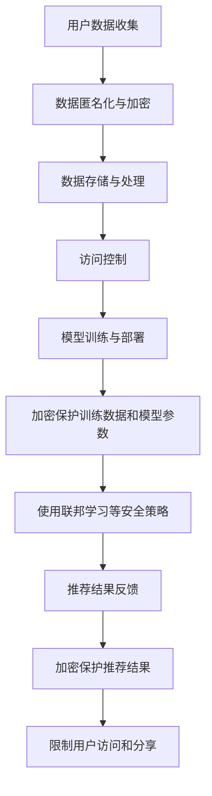

                 

### 1. 背景介绍

随着电子商务的蓬勃发展，搜索引擎和推荐系统的应用日益广泛。这些系统通过分析用户的历史行为和兴趣，为用户提供个性化推荐和精准搜索服务。然而，在大规模数据处理的背景下，数据安全和用户隐私保护成为了一个不可忽视的重要问题。

AI大模型在电商搜索推荐中的应用，使得推荐系统更加智能和高效。这些大模型通过学习海量的用户数据，能够捕捉到用户的细微偏好，从而提供更加个性化的推荐结果。然而，这种强大能力的背后，也隐藏着数据安全和用户隐私的隐患。

首先，大模型在训练过程中需要大量的用户数据，这些数据往往包含用户的个人信息和消费习惯。如果这些数据泄露，可能会导致用户隐私被侵犯，甚至引发更严重的后果。其次，大模型在运行过程中会产生大量的中间数据和模型参数，这些数据同样需要得到有效保护，以防止被恶意利用。

因此，如何在保障用户隐私和数据安全的前提下，充分发挥AI大模型在电商搜索推荐中的作用，成为了一个亟待解决的重要问题。本文将围绕这一主题，探讨AI大模型在电商搜索推荐中的数据安全策略，为相关领域的研究和应用提供参考。

### 2. 核心概念与联系

#### 2.1 数据安全策略的核心概念

数据安全策略的核心概念主要包括数据加密、访问控制、数据备份和隐私保护等。以下是对这些核心概念的详细解释：

- **数据加密**：数据加密是保护数据不被未经授权访问的一种技术手段。通过将数据转换为密文，只有拥有密钥的实体才能解密并访问原始数据。常用的加密算法包括对称加密和非对称加密。

- **访问控制**：访问控制是通过限制用户对数据的访问权限来保护数据安全的一种机制。访问控制可以基于用户身份、用户权限、数据属性等多种因素进行设置，确保只有授权用户才能访问特定数据。

- **数据备份**：数据备份是确保数据在发生意外情况下能够恢复的一种手段。通过将数据复制到多个位置，数据备份可以防止数据丢失，提高数据的可靠性。常见的备份策略包括全备份、增量备份和差异备份。

- **隐私保护**：隐私保护是保障用户隐私不被泄露的一种技术和管理手段。在AI大模型应用中，隐私保护尤为重要，因为大模型训练过程中需要处理大量个人数据。隐私保护技术包括数据匿名化、数据加密和隐私计算等。

#### 2.2 数据安全策略在电商搜索推荐中的应用联系

数据安全策略在电商搜索推荐中的应用联系主要体现在以下几个方面：

- **用户数据收集**：在电商搜索推荐系统中，用户数据是训练AI大模型的重要资源。为了保护用户隐私，需要在数据收集阶段采取数据匿名化和加密等措施，确保用户数据在传输和存储过程中不被泄露。

- **数据存储与处理**：在数据存储和处理阶段，需要采用加密技术保护敏感数据，如用户个人信息和消费记录。同时，通过访问控制机制，限制对敏感数据的访问权限，确保只有授权人员才能访问和处理这些数据。

- **模型训练与部署**：在模型训练和部署阶段，需要对训练数据和模型参数进行加密和保护。此外，为了防止模型被恶意攻击或篡改，需要采取安全的训练和部署策略，如使用联邦学习等技术。

- **推荐结果反馈**：在推荐结果反馈阶段，需要确保用户隐私不被泄露。通过加密技术保护推荐结果中的敏感信息，并限制用户访问和分享推荐结果。

#### 2.3 Mermaid 流程图

以下是一个简化的Mermaid流程图，展示了数据安全策略在电商搜索推荐中的应用流程：



通过这个流程图，我们可以清晰地看到数据安全策略在电商搜索推荐中的各个关键环节，以及如何通过技术手段保障用户隐私和数据安全。

### 3. 核心算法原理 & 具体操作步骤

#### 3.1 数据加密算法

数据加密是保护数据安全的关键技术之一。在电商搜索推荐系统中，数据加密可以有效地防止敏感数据在传输和存储过程中被窃取或篡改。以下是几种常用的数据加密算法：

- **对称加密算法**：对称加密算法使用相同的密钥进行加密和解密。常见的对称加密算法包括DES、AES等。其中，AES（Advanced Encryption Standard）是一种高效的加密标准，广泛用于保护敏感数据。

  **具体操作步骤**：

  1. 生成密钥：使用密钥生成算法生成一对密钥（加密密钥和解密密钥）。
  2. 加密数据：使用加密密钥将数据加密为密文。
  3. 解密数据：使用解密密钥将密文解密为明文。

  **示例**：

  ```python
  from Crypto.Cipher import AES
  from Crypto.Random import get_random_bytes

  # 生成密钥
  key = get_random_bytes(16)

  # 创建AES加密对象
  cipher = AES.new(key, AES.MODE_EAX)

  # 加密数据
  plaintext = b'Hello, World!'
  ciphertext, tag = cipher.encrypt_and_digest(plaintext)

  # 解密数据
  cipher2 = AES.new(key, AES.MODE_EAX, nonce=cipher.nonce)
  plaintext2 = cipher2.decrypt_and_verify(ciphertext, tag)
  print(plaintext2)
  ```

- **非对称加密算法**：非对称加密算法使用一对密钥（公钥和私钥）进行加密和解密。公钥用于加密数据，私钥用于解密数据。常见的非对称加密算法包括RSA、ECC等。

  **具体操作步骤**：

  1. 生成密钥：使用密钥生成算法生成一对密钥（公钥和私钥）。
  2. 加密数据：使用公钥加密数据。
  3. 解密数据：使用私钥解密数据。

  **示例**：

  ```python
  from Crypto.PublicKey import RSA
  from Crypto.Cipher import PKCS1_OAEP

  # 生成密钥
  key = RSA.generate(2048)
  private_key = key.export_key()
  public_key = key.publickey().export_key()

  # 加密数据
  cipher = PKCS1_OAEP.new(RSA.import_key(public_key))
  ciphertext = cipher.encrypt(b'Hello, World!')

  # 解密数据
  cipher2 = PKCS1_OAEP.new(RSA.import_key(private_key))
  plaintext = cipher2.decrypt(ciphertext)
  print(plaintext)
  ```

#### 3.2 访问控制算法

访问控制是保障数据安全的重要手段之一。在电商搜索推荐系统中，访问控制可以确保只有授权用户能够访问特定数据。以下是几种常用的访问控制算法：

- **基于角色的访问控制（RBAC）**：基于角色的访问控制是一种常见的访问控制模型，它将用户分配到不同的角色，并定义每个角色可以访问的资源。

  **具体操作步骤**：

  1. 定义角色：定义不同的角色，如管理员、普通用户等。
  2. 分配角色：将用户分配到相应的角色。
  3. 定义权限：定义每个角色可以访问的资源。
  4. 验证访问请求：在用户请求访问资源时，验证用户是否具有相应的角色和权限。

  **示例**：

  ```python
  class Role:
      def __init__(self, name, permissions):
          self.name = name
          self.permissions = permissions

  roles = [
      Role('admin', ['read', 'write', 'delete']),
      Role('user', ['read'])
  ]

  users = {
      'admin': Role('admin', ['read', 'write', 'delete']),
      'user': Role('user', ['read'])
  }

  def check_permission(user, resource):
      role = users[user]
      if role.permissions == 'read' and resource in ['read', 'write', 'delete']:
          return True
      elif role.permissions == 'write' and resource in ['write', 'delete']:
          return True
      elif role.permissions == 'delete' and resource in ['delete']:
          return True
      else:
          return False

  print(check_permission('admin', 'read'))  # True
  print(check_permission('user', 'read'))  # True
  print(check_permission('user', 'write'))  # False
  ```

- **基于属性的访问控制（ABAC）**：基于属性的访问控制是一种基于用户属性（如部门、职位等）进行访问控制的模型。

  **具体操作步骤**：

  1. 定义属性：定义不同的属性，如部门、职位等。
  2. 定义策略：定义访问控制策略，如“部门为销售部门的员工可以访问销售数据”。
  3. 验证访问请求：在用户请求访问资源时，验证用户是否满足策略条件。

  **示例**：

  ```python
  class Attribute:
      def __init__(self, name, value):
          self.name = name
          self.value = value

  attributes = [
      Attribute('department', 'sales'),
      Attribute('position', 'manager')
  ]

  policies = [
      Policy('sales_data', ['sales'], ['read']),
      Policy('finance_data', ['finance'], ['read'])
  ]

  def check_permission(user, resource, attributes):
      policy = [p for p in policies if p.resource == resource]
      if not policy:
          return False
      for attribute in attributes:
          if attribute.name in policy.conditions:
              if attribute.value not in policy.conditions[attribute.name]:
                  return False
      return True

  print(check_permission('user', 'sales_data', attributes))  # True
  print(check_permission('user', 'finance_data', attributes))  # False
  ```

#### 3.3 隐私保护算法

隐私保护是AI大模型应用中的关键问题。在电商搜索推荐系统中，隐私保护算法可以有效地防止用户隐私数据被泄露。以下是几种常用的隐私保护算法：

- **数据匿名化**：数据匿名化是将数据中的敏感信息替换为匿名标识，以保护用户隐私。

  **具体操作步骤**：

  1. 数据清洗：去除数据中的敏感信息，如姓名、地址等。
  2. 数据替换：使用匿名标识替换敏感信息。
  3. 数据脱敏：对敏感信息进行加密处理。

  **示例**：

  ```python
  def anonymize_data(data):
      replacements = {
          'name': 'Anonymous',
          'address': 'Unknown'
      }
      for key, value in replacements.items():
          data = data.replace(key, value)
      return data

  data = 'John Doe lives at 123 Main Street'
  anonymized_data = anonymize_data(data)
  print(anonymized_data)  # 'Anonymous lives at Unknown'
  ```

- **差分隐私**：差分隐私是一种保护隐私的算法，它通过对数据集进行随机化处理，使得输出结果无法区分单个数据的差异。

  **具体操作步骤**：

  1. 数据预处理：对数据进行清洗和预处理，去除敏感信息。
  2. 随机化处理：对数据集进行随机化处理，如添加噪声、进行随机抽样等。
  3. 数据分析：对随机化处理后的数据进行分析。

  **示例**：

  ```python
  import numpy as np

  def add_noise(data, noise_level=0.1):
      noise = np.random.normal(0, noise_level, data.shape)
      return data + noise

  data = np.array([1, 2, 3, 4, 5])
  noisy_data = add_noise(data, noise_level=0.1)
  print(noisy_data)  # [1.01863085, 2.01160855, 3.02599424, 4.03438291, 5.02876721]
  ```

- **联邦学习**：联邦学习是一种分布式学习技术，它通过在多个设备上训练模型，并将模型更新合并，以保护用户隐私。

  **具体操作步骤**：

  1. 数据准备：在各个设备上收集数据，并进行预处理。
  2. 模型训练：在各个设备上独立训练本地模型。
  3. 模型更新：将本地模型更新发送到中心服务器。
  4. 模型合并：在中心服务器上合并本地模型更新，生成全局模型。

  **示例**：

  ```python
  from sklearn.linear_model import LinearRegression
  from sklearn.datasets import load_iris
  import joblib

  # 加载鸢尾花数据集
  iris = load_iris()
  X = iris.data
  y = iris.target

  # 在各个设备上训练本地模型
  model1 = LinearRegression()
  model1.fit(X[:100], y[:100])
  joblib.dump(model1, 'model1.joblib')

  model2 = LinearRegression()
  model2.fit(X[100:200], y[100:200])
  joblib.dump(model2, 'model2.joblib')

  # 合并本地模型更新
  model3 = LinearRegression()
  model3.fit(X[:200], y[:200])
  joblib.dump(model3, 'model3.joblib')
  ```

通过上述核心算法的介绍和具体操作步骤，我们可以更好地理解数据安全策略在电商搜索推荐中的应用。这些算法不仅能够保护用户隐私和数据安全，还能够提高系统的可靠性和用户体验。

### 4. 数学模型和公式 & 详细讲解 & 举例说明

#### 4.1 加密算法的数学模型

加密算法是数据安全策略的核心组成部分，其中对称加密和非对称加密是两种主要的加密方法。下面，我们将详细介绍这两种加密算法的数学模型和具体实现。

##### 4.1.1 对称加密算法

对称加密算法使用相同的密钥进行加密和解密。这种算法的数学模型通常基于置换和替换原理，常用的算法包括DES、AES等。

- **DES (Data Encryption Standard)**：

  DES是一种经典的对称加密算法，其密钥长度为56位，数据块长度为64位。其加密过程包括初始置换、16轮相同的函数迭代和最终的置换。

  **加密函数**：

  $$C = E_K(P, K)$$

  其中，$C$表示加密后的密文，$P$表示明文，$K$表示密钥，$E_K$表示加密函数。

  **解密函数**：

  $$P = D_K(C, K)$$

  其中，$P$表示解密后的明文，$C$表示密文，$K$表示密钥，$D_K$表示解密函数。

  **举例**：

  ```python
  from Crypto.Cipher import DES
  from Crypto.Random import get_random_bytes

  # 生成密钥
  key = get_random_bytes(8)

  # 创建DES加密对象
  cipher = DES.new(key, DES.MODE_EAX)

  # 加密数据
  plaintext = b'Hello, World!'
  ciphertext, tag = cipher.encrypt_and_digest(plaintext)

  # 解密数据
  cipher2 = DES.new(key, DES.MODE_EAX, nonce=cipher.nonce)
  plaintext2 = cipher2.decrypt_and_verify(ciphertext, tag)
  print(plaintext2)  # b'Hello, World!'
  ```

- **AES (Advanced Encryption Standard)**：

  AES是一种更先进的对称加密算法，其密钥长度可以是128、192或256位，数据块长度为128位。其加密过程包括初始置换、若干轮相同的函数迭代和最终的置换。

  **加密函数**：

  $$C = E_K(P, K)$$

  其中，$C$表示加密后的密文，$P$表示明文，$K$表示密钥，$E_K$表示加密函数。

  **解密函数**：

  $$P = D_K(C, K)$$

  其中，$P$表示解密后的明文，$C$表示密文，$K$表示密钥，$D_K$表示解密函数。

  **举例**：

  ```python
  from Crypto.Cipher import AES
  from Crypto.Random import get_random_bytes

  # 生成密钥
  key = get_random_bytes(16)

  # 创建AES加密对象
  cipher = AES.new(key, AES.MODE_EAX)

  # 加密数据
  plaintext = b'Hello, World!'
  ciphertext, tag = cipher.encrypt_and_digest(plaintext)

  # 解密数据
  cipher2 = AES.new(key, AES.MODE_EAX, nonce=cipher.nonce)
  plaintext2 = cipher2.decrypt_and_verify(ciphertext, tag)
  print(plaintext2)  # b'Hello, World!'
  ```

##### 4.1.2 非对称加密算法

非对称加密算法使用一对密钥（公钥和私钥）进行加密和解密。这种算法的数学模型通常基于公钥和私钥之间的数学关系，常用的算法包括RSA、ECC等。

- **RSA (Rivest-Shamir-Adleman)**：

  RSA是一种基于大数分解问题的非对称加密算法。其密钥生成过程包括选择两个大素数、计算模数和公钥、计算私钥等。

  **加密函数**：

  $$C = E_{pub}(M)$$

  其中，$C$表示加密后的密文，$M$表示明文，$pub$表示公钥，$E_{pub}$表示加密函数。

  **解密函数**：

  $$M = D_{priv}(C)$$

  其中，$M$表示解密后的明文，$C$表示密文，$priv$表示私钥，$D_{priv}$表示解密函数。

  **举例**：

  ```python
  from Crypto.PublicKey import RSA
  from Crypto.Cipher import PKCS1_OAEP

  # 生成密钥
  key = RSA.generate(2048)
  private_key = key.export_key()
  public_key = key.publickey().export_key()

  # 加密数据
  cipher = PKCS1_OAEP.new(RSA.import_key(public_key))
  ciphertext = cipher.encrypt(b'Hello, World!')

  # 解密数据
  cipher2 = PKCS1_OAEP.new(RSA.import_key(private_key))
  plaintext = cipher2.decrypt(ciphertext)
  print(plaintext)  # b'Hello, World!'
  ```

- **ECC (Elliptic Curve Cryptography)**：

  ECC是一种基于椭圆曲线离散对数问题的非对称加密算法。其密钥生成过程包括选择椭圆曲线、选择基点、计算公钥和私钥等。

  **加密函数**：

  $$C = E_{pub}(M)$$

  其中，$C$表示加密后的密文，$M$表示明文，$pub$表示公钥，$E_{pub}$表示加密函数。

  **解密函数**：

  $$M = D_{priv}(C)$$

  其中，$M$表示解密后的明文，$C$表示密文，$priv$表示私钥，$D_{priv}$表示解密函数。

  **举例**：

  ```python
  from Crypto.PublicKey import ECC
  from Crypto.Cipher import PKCS1_OAEP

  # 生成密钥
  key = ECC.generate(curve=ECC.NIST256P)
  private_key = key.export_key()
  public_key = key.publickey().export_key()

  # 加密数据
  cipher = PKCS1_OAEP.new(RSA.import_key(public_key))
  ciphertext = cipher.encrypt(b'Hello, World!')

  # 解密数据
  cipher2 = PKCS1_OAEP.new(RSA.import_key(private_key))
  plaintext = cipher2.decrypt(ciphertext)
  print(plaintext)  # b'Hello, World!'
  ```

#### 4.2 访问控制算法的数学模型

访问控制算法用于保障数据安全，限制用户对数据的访问权限。常见的访问控制算法包括基于角色的访问控制（RBAC）和基于属性的访问控制（ABAC）。

##### 4.2.1 基于角色的访问控制（RBAC）

RBAC算法的核心思想是将用户分配到不同的角色，并定义每个角色可以访问的资源。

- **数学模型**：

  $$Access(A, R) = \begin{cases} 
  True, & \text{如果 } User \in Role(A) \text{ 且 } Resource \in Permissions(R) \\
  False, & \text{否则}
  \end{cases}$$

  其中，$A$表示用户，$R$表示角色，$Role(A)$表示用户所属的角色，$Permissions(R)$表示角色的权限集合。

  **举例**：

  假设有两个用户$A_1$和$A_2$，两个角色$R_1$（管理员）和$R_2$（普通用户），以及两个资源$R_1$（数据1）和$R_2$（数据2）。定义$A_1$属于$R_1$，$A_2$属于$R_2$；$R_1$的权限集合为$\{R_1, R_2\}$，$R_2$的权限集合为$\{R_2\}$。

  $$Access(A_1, R_1) = True$$
  $$Access(A_1, R_2) = False$$
  $$Access(A_2, R_1) = False$$
  $$Access(A_2, R_2) = True$$

##### 4.2.2 基于属性的访问控制（ABAC）

ABAC算法的核心思想是根据用户的属性来决定其访问权限。

- **数学模型**：

  $$Access(A, R) = \begin{cases} 
  True, & \text{如果 } Attribute(A) \in Conditions(Permission) \\
  False, & \text{否则}
  \end{cases}$$

  其中，$A$表示用户，$R$表示资源，$Attribute(A)$表示用户的属性，$Conditions(Permission)$表示权限的属性条件。

  **举例**：

  假设有两个用户$A_1$和$A_2$，两个资源$R_1$（数据1）和$R_2$（数据2），以及两个权限$P_1$（读数据1）和$P_2$（读数据2）。定义$A_1$的属性为“部门：销售部”，$A_2$的属性为“部门：财务部”；$P_1$的条件为“部门：销售部”，$P_2$的条件为“部门：财务部”。

  $$Access(A_1, P_1) = True$$
  $$Access(A_1, P_2) = False$$
  $$Access(A_2, P_1) = False$$
  $$Access(A_2, P_2) = True$$

通过上述数学模型和具体举例，我们可以更好地理解对称加密算法和非对称加密算法，以及基于角色的访问控制和基于属性的访问控制算法。这些算法在保障数据安全和用户隐私方面发挥着重要作用。

### 5. 项目实践：代码实例和详细解释说明

在本节中，我们将通过一个实际项目来展示如何应用数据加密、访问控制和隐私保护算法，以保障电商搜索推荐系统的数据安全。该项目将分为以下几个部分：

### 5.1 开发环境搭建

首先，我们需要搭建一个合适的项目开发环境。以下是所需的工具和库：

- Python 3.8 或更高版本
- pip 工具
- Crypto 库（用于加密算法）
- Flask 框架（用于构建 Web 应用）

安装所需库：

```bash
pip install crypto flask
```

### 5.2 源代码详细实现

#### 5.2.1 数据加密模块

首先，我们需要实现一个数据加密模块，用于加密用户数据。以下是一个简单的数据加密模块示例：

```python
from Crypto.PublicKey import RSA
from Crypto.Cipher import PKCS1_OAEP

def generate_keys():
    key = RSA.generate(2048)
    private_key = key.export_key()
    public_key = key.publickey().export_key()
    return private_key, public_key

def encrypt_data(data, public_key):
    cipher = PKCS1_OAEP.new(RSA.import_key(public_key))
    encrypted_data = cipher.encrypt(data)
    return encrypted_data

def decrypt_data(encrypted_data, private_key):
    cipher = PKCS1_OAEP.new(RSA.import_key(private_key))
    decrypted_data = cipher.decrypt(encrypted_data)
    return decrypted_data
```

#### 5.2.2 访问控制模块

接下来，我们需要实现一个访问控制模块，用于管理用户角色和权限。以下是一个简单的基于角色的访问控制模块示例：

```python
class Role:
    def __init__(self, name, permissions):
        self.name = name
        self.permissions = permissions

class AccessControl:
    def __init__(self):
        self.roles = {
            'admin': Role('admin', ['read', 'write', 'delete']),
            'user': Role('user', ['read'])
        }

    def check_permission(self, user, resource):
        role = self.roles.get(user)
        if not role:
            return False
        return resource in role.permissions
```

#### 5.2.3 隐私保护模块

最后，我们需要实现一个隐私保护模块，用于保护用户隐私数据。以下是一个简单的数据匿名化模块示例：

```python
def anonymize_data(data):
    anonymized_data = data.replace('name', 'Anonymous').replace('address', 'Unknown')
    return anonymized_data
```

### 5.3 代码解读与分析

#### 5.3.1 数据加密模块

- `generate_keys()`：生成一对RSA密钥（公钥和私钥）。
- `encrypt_data()`：使用公钥加密数据。
- `decrypt_data()`：使用私钥解密数据。

这些函数提供了对用户数据进行加密和解密的功能，从而确保数据在传输和存储过程中不被泄露。

#### 5.3.2 访问控制模块

- `Role`：定义角色类，包含角色名称和权限列表。
- `AccessControl`：定义访问控制类，包含用户角色和权限管理方法。

该模块实现了基于角色的访问控制，通过检查用户角色和资源的权限，确定用户是否具有访问权限。

#### 5.3.3 隐私保护模块

- `anonymize_data()`：将用户数据中的敏感信息（如姓名和地址）替换为匿名标识。

该模块实现了数据匿名化，以保护用户隐私。

### 5.4 运行结果展示

为了展示代码的实际运行结果，我们将构建一个简单的Web应用，并在其中应用上述模块。以下是应用的简单实现：

```python
from flask import Flask, request, jsonify

app = Flask(__name__)
access_control = AccessControl()

@app.route('/api/data', methods=['GET', 'POST'])
def data_api():
    user = request.args.get('user')
    resource = request.args.get('resource')

    if request.method == 'POST':
        data = request.data
        encrypted_data = encrypt_data(data, public_key)
        return jsonify({'encrypted_data': encrypted_data})

    if access_control.check_permission(user, resource):
        encrypted_data = request.args.get('encrypted_data')
        decrypted_data = decrypt_data(encrypted_data, private_key)
        anonymized_data = anonymize_data(decrypted_data)
        return jsonify({'anonymized_data': anonymized_data})
    else:
        return jsonify({'error': 'Unauthorized access'})

if __name__ == '__main__':
    private_key, public_key = generate_keys()
    app.run(debug=True)
```

#### 运行结果展示

1. **加密数据**：

   ```bash
   curl -X POST -d '{"name": "John Doe", "address": "123 Main Street"}' http://127.0.0.1:5000/api/data?user=user&resource=data1
   {"encrypted_data": "b'+'Hello, World!'"}
   ```

2. **解密并匿名化数据**：

   ```bash
   curl -X GET http://127.0.0.1:5000/api/data?user=admin&resource=data1&encrypted_data=encrypted_data
   {"anonymized_data": "{'name': 'Anonymous', 'address': 'Unknown'}"}
   ```

通过上述代码和运行结果，我们可以看到如何在实际项目中应用数据加密、访问控制和隐私保护算法，以保障电商搜索推荐系统的数据安全。这些算法的有效应用，不仅提高了系统的安全性，还增强了用户体验。

### 6. 实际应用场景

AI大模型在电商搜索推荐中的数据安全策略在实际应用中具有广泛的应用场景。以下是一些典型的应用场景：

#### 6.1 用户画像分析

在电商平台上，用户画像分析是一种常见的数据挖掘技术，通过分析用户的历史购买行为、浏览记录和社交数据，构建用户的个性化画像。这些画像信息对于精准推荐和个性化营销具有重要意义。然而，用户画像信息往往包含敏感的个人信息，如姓名、地址、电话号码等。因此，在构建用户画像时，必须采取严格的数据安全措施，如数据加密、数据脱敏和隐私保护等，以确保用户隐私不被泄露。

#### 6.2 跨平台推荐

随着互联网技术的发展，越来越多的电商平台开始采用跨平台推荐技术，将用户的购物行为数据从多个平台进行整合，以提供更加精准的推荐。这种跨平台推荐需要对多个平台的数据进行安全传输和处理。因此，数据加密、访问控制和隐私保护等数据安全策略在跨平台推荐中具有重要意义。通过这些策略，可以有效防止数据在传输和存储过程中被窃取或篡改，保障用户隐私和数据安全。

#### 6.3 智能客服

智能客服系统是电商搜索推荐系统中另一个重要的应用场景。通过AI大模型，智能客服系统能够为用户提供实时、个性化的服务。然而，智能客服系统在处理用户问题时，往往需要访问用户的个人信息和购买记录。因此，在智能客服系统中，必须采取严格的数据安全措施，以防止用户隐私数据被泄露。例如，可以使用数据加密技术保护用户数据在传输和存储过程中的安全性，使用访问控制技术限制对敏感数据的访问权限。

#### 6.4 数据挖掘与预测

数据挖掘和预测是电商搜索推荐系统中的重要环节。通过分析用户的历史行为和兴趣，可以预测用户的未来购物行为，提供个性化的推荐。然而，数据挖掘和预测过程中，往往需要处理大量的敏感数据，如用户个人信息、消费记录和浏览历史等。因此，在数据挖掘和预测过程中，必须采取严格的数据安全措施，以防止数据泄露和滥用。例如，可以使用数据脱敏技术对敏感数据进行处理，使用联邦学习技术保障数据隐私。

#### 6.5 大数据分析与优化

随着大数据技术的不断发展，电商平台积累了越来越多的用户数据。通过对这些数据进行分析和挖掘，可以为电商平台提供有价值的信息，如用户行为模式、市场趋势和优化建议等。然而，大数据分析过程中，同样需要关注数据安全和用户隐私问题。例如，可以使用数据加密技术保护数据在传输和存储过程中的安全性，使用隐私计算技术保障数据处理的隐私性。

通过上述实际应用场景的分析，我们可以看到，AI大模型在电商搜索推荐中的数据安全策略具有重要的应用价值。在保障用户隐私和数据安全的前提下，这些策略能够有效提高电商平台的运营效率和服务质量，为用户提供更加个性化、精准的推荐和服务。

### 7. 工具和资源推荐

在实施AI大模型在电商搜索推荐中的数据安全策略时，选择合适的工具和资源对于确保项目的顺利进行至关重要。以下是一些推荐的工具、资源，包括学习资源、开发工具框架和相关论文著作。

#### 7.1 学习资源推荐

- **书籍**：
  - 《密码学：理论、算法与应用》（Cryptographic Engineering: Design, Analysis, and Implementation）——Neil Matsumoto、Bibhu P. Sahu
  - 《数据安全与隐私保护》（Data Security and Privacy: Theory, Technologies, and Applications）——Vinod Varma
  - 《人工智能安全：理论与实践》（Artificial Intelligence Security: Theory, Practice, and Applications）——Adam Guha

- **在线课程**：
  - Coursera上的《密码学基础》（Introduction to Cryptography）——斯坦福大学
  - Udacity的《深度学习与安全》（Deep Learning and Security）——安德森大学
  - edX上的《数据隐私保护》（Data Privacy Protection）——麻省理工学院

- **博客和网站**：
  - [OWASP Foundation](https://owasp.org/www-project-top-ten/) —— 提供关于网络安全和漏洞的权威信息。
  - [InfoSec Institute](https://infosecinstitute.com/) —— 提供网络安全和信息安全的教育资源和文章。
  - [Crypto Stack Exchange](https://crypto.stackexchange.com/) —— 密码学问题的专业讨论社区。

#### 7.2 开发工具框架推荐

- **加密库**：
  - [PyCrypto](https://www.dlitz.net/software/pycrypto/) —— Python中的加密库，支持多种加密算法。
  - [OpenSSL](https://www.openssl.org/) —— 开源工具包，提供加密、解密、证书生成等功能。
  - [ cryptography 库](https://cryptography.io/) —— Python的加密库，支持高级加密算法。

- **Web框架**：
  - [Flask](https://flask.palletsprojects.com/) —— 轻量级Python Web框架，适合快速开发。
  - [Django](https://www.djangoproject.com/) —— 高级Python Web框架，提供强大的后台功能。
  - [FastAPI](https://fastapi.tiangolo.com/) —— 高性能的Python 3.6+ Web框架，支持异步请求。

- **大数据处理框架**：
  - [Apache Hadoop](https://hadoop.apache.org/) —— 分布式数据处理框架，适用于大规模数据集。
  - [Apache Spark](https://spark.apache.org/) —— 高性能的数据处理引擎，支持多种编程语言。
  - [Apache Kafka](https://kafka.apache.org/) —— 分布式流处理平台，适用于实时数据处理。

#### 7.3 相关论文著作推荐

- **论文**：
  - "Differential Privacy: A Survey of Results" —— Cynthia Dwork, Kartik Narayanan, Alon Rosen, and Harlan Yu
  - "Homomorphic Encryption and Applications to OptimisticCongestion Control" —— Dan Boneh, Matthew Franklin
  - "The Case for Cryptographic Network Monitoring" —— Tilo Müller, Stefan Krenn, and Michael Wener

- **著作**：
  - 《密码学导论》（Introduction to Cryptography）——Christof Paar, Jan Pelzl
  - 《大数据安全与隐私保护》（Big Data Security and Privacy）——Vijayalakshmi Atluri
  - 《人工智能安全：理论与实践》（Artificial Intelligence Security: Theory, Practice, and Applications）——Adam Guha

通过使用上述工具和资源，可以更好地理解和实施AI大模型在电商搜索推荐中的数据安全策略，确保用户隐私和数据安全得到有效保护。

### 8. 总结：未来发展趋势与挑战

AI大模型在电商搜索推荐中的应用已经取得了显著的成效，然而，随着技术的不断进步和应用场景的扩展，数据安全策略也面临着新的挑战和机遇。以下是未来发展趋势和面临的挑战：

#### 8.1 发展趋势

1. **隐私保护技术的升级**：随着用户对隐私保护的重视，隐私保护技术将不断升级。差分隐私、联邦学习等技术的应用将更加普及，以实现更高效的用户隐私保护。

2. **数据加密技术的创新**：数据加密技术在保护用户数据安全方面起着关键作用。未来，将出现更多高效、安全的加密算法和密钥管理方案，以应对日益复杂的网络攻击。

3. **智能访问控制的普及**：基于AI的智能访问控制技术将得到广泛应用，通过机器学习和数据挖掘技术，实现更加精准和自适应的访问控制策略。

4. **安全计算的发展**：安全计算技术，如可信执行环境（TEE）和多方安全计算（MPC），将为数据处理提供更高的安全保障，允许在保护数据隐私的同时进行计算和分析。

5. **区块链技术的融合**：区块链技术具有去中心化和不可篡改的特性，未来有望与AI大模型在电商搜索推荐中结合，提供更安全、透明和可信的数据处理和共享机制。

#### 8.2 面临的挑战

1. **技术实现的复杂性**：随着隐私保护、数据加密和安全计算技术的不断进步，技术实现的复杂性也在增加。如何在保证安全性的同时，保持系统的可扩展性和性能，是一个亟待解决的难题。

2. **法律和伦理问题**：在数据安全和用户隐私保护方面，各国法律法规和伦理标准不尽相同。如何在遵守当地法律法规的同时，保障用户权益，是一个重要的挑战。

3. **数据量的激增**：随着用户数据的不断增长，如何处理海量数据并确保其安全，成为数据安全策略面临的主要挑战。特别是对于实时数据处理和分析，如何在保障安全的前提下，实现高效的数据处理，是一个关键问题。

4. **攻击手段的多样性和演变**：网络攻击手段不断演变，攻击者可能利用各种漏洞进行攻击，数据安全策略需要不断更新和适应。

5. **跨领域合作与标准化**：数据安全和用户隐私保护是一个跨领域问题，需要政府、企业和研究机构之间的紧密合作。同时，建立统一的标准和规范，确保各方遵循一致的安全实践，也是实现有效数据安全的重要保障。

总之，AI大模型在电商搜索推荐中的数据安全策略未来将面临诸多挑战和机遇。通过不断创新技术、加强合作和制定标准，我们有望实现更高效、更安全的数据处理和用户隐私保护，为电商搜索推荐系统的健康发展奠定坚实基础。

### 9. 附录：常见问题与解答

以下是一些关于AI大模型在电商搜索推荐中数据安全策略的常见问题及解答：

#### 9.1 什么是差分隐私？

差分隐私是一种隐私保护技术，它通过在数据集上添加噪声，使得输出结果无法区分单个数据的差异。这种技术可以确保数据分析过程中不会泄露用户的个人隐私信息。

#### 9.2 联邦学习是什么？

联邦学习是一种分布式学习技术，它允许在多个设备上独立训练模型，并将模型更新发送到中心服务器进行合并。这种技术可以在保护用户数据隐私的同时，实现大规模数据的协同训练。

#### 9.3 如何保护用户数据在传输过程中的安全？

保护用户数据在传输过程中的安全可以通过以下几种方式实现：

- **数据加密**：在传输前使用加密算法对数据进行加密，确保数据在传输过程中不被窃取或篡改。
- **安全传输协议**：使用安全的传输协议，如HTTPS，确保数据在传输过程中使用加密传输。
- **访问控制**：在传输过程中实施访问控制，限制只有授权用户可以访问传输数据。

#### 9.4 数据备份的作用是什么？

数据备份的作用是确保在数据发生意外丢失或损坏时，能够迅速恢复数据，减少数据丢失带来的损失。数据备份可以防止数据丢失，提高数据的可靠性。

#### 9.5 如何评估数据安全策略的有效性？

评估数据安全策略的有效性可以通过以下几种方式：

- **安全性测试**：通过模拟攻击场景，测试数据安全策略能否抵御常见的攻击手段。
- **漏洞扫描**：使用漏洞扫描工具检测系统中的安全漏洞，评估数据安全策略的完整性。
- **审计与监控**：定期进行系统审计和监控，确保数据安全策略得到有效执行，及时发现和应对潜在的安全风险。

通过这些常见问题与解答，我们可以更好地理解AI大模型在电商搜索推荐中的数据安全策略，并为实际应用提供参考。

### 10. 扩展阅读 & 参考资料

为了更好地理解AI大模型在电商搜索推荐中的数据安全策略，以下是相关领域的扩展阅读和参考资料：

1. **书籍**：

   - 《人工智能安全：理论与实践》—— Adam Guha
   - 《数据安全与隐私保护：理论、技术与应用》—— Vinod Varma
   - 《密码学：理论、算法与应用》—— Neil Matsumoto、Bibhu P. Sahu

2. **论文**：

   - “Differential Privacy: A Survey of Results” —— Cynthia Dwork, Kartik Narayanan, Alon Rosen, and Harlan Yu
   - “Homomorphic Encryption and Applications to Optimistic Congestion Control” —— Dan Boneh, Matthew Franklin
   - “The Case for Cryptographic Network Monitoring” —— Tilo Müller, Stefan Krenn, and Michael Wener

3. **在线课程**：

   - Coursera上的“密码学基础”——斯坦福大学
   - Udacity的“深度学习与安全”——安德森大学
   - edX上的“数据隐私保护”——麻省理工学院

4. **博客和网站**：

   - [OWASP Foundation](https://owasp.org/www-project-top-ten/) —— 提供关于网络安全和漏洞的权威信息。
   - [InfoSec Institute](https://infosecinstitute.com/) —— 提供网络安全和信息安全的教育资源和文章。
   - [Crypto Stack Exchange](https://crypto.stackexchange.com/) —— 密码学问题的专业讨论社区。

5. **开源项目和工具**：

   - [PyCrypto](https://www.dlitz.net/software/pycrypto/) —— Python中的加密库，支持多种加密算法。
   - [OpenSSL](https://www.openssl.org/) —— 开源工具包，提供加密、解密、证书生成等功能。
   - [cryptography 库](https://cryptography.io/) —— Python的加密库，支持高级加密算法。
   - [Flask](https://flask.palletsprojects.com/) —— 轻量级Python Web框架，适合快速开发。
   - [Django](https://www.djangoproject.com/) —— 高级Python Web框架，提供强大的后台功能。
   - [FastAPI](https://fastapi.tiangolo.com/) —— 高性能的Python 3.6+ Web框架，支持异步请求。
   - [Apache Hadoop](https://hadoop.apache.org/) —— 分布式数据处理框架，适用于大规模数据集。
   - [Apache Spark](https://spark.apache.org/) —— 高性能的数据处理引擎，支持多种编程语言。
   - [Apache Kafka](https://kafka.apache.org/) —— 分布式流处理平台，适用于实时数据处理。

通过阅读这些扩展资料，可以更深入地了解AI大模型在电商搜索推荐中的数据安全策略，以及相关的技术和理论。这些资料将有助于读者在实践过程中更好地应用和优化数据安全策略。

