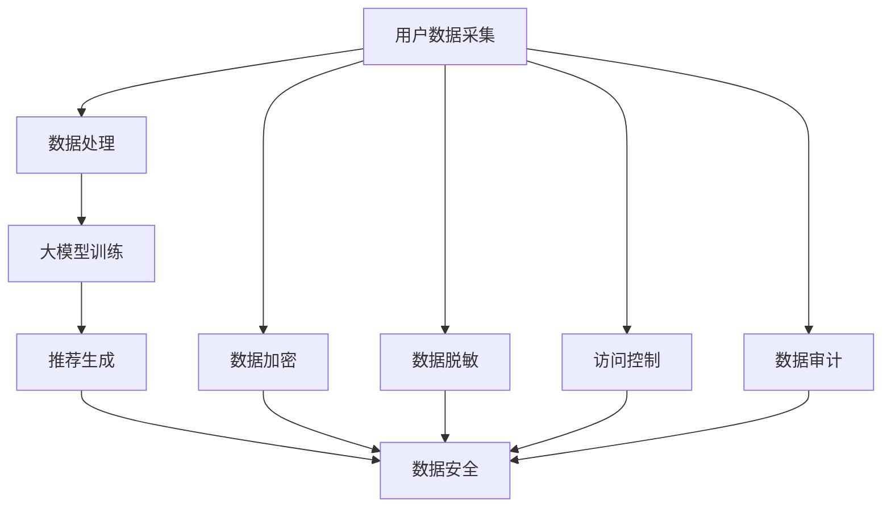

                 

### 1. 背景介绍

随着人工智能技术的飞速发展，大模型（Large Models）在各个领域的应用逐渐深入，特别是在电商搜索推荐系统中。电商搜索推荐系统通过分析用户的浏览历史、购买记录、搜索关键词等信息，为用户推荐个性化的商品，从而提高用户满意度、提升电商平台销售额。然而，这一过程中涉及大量的用户数据，如何在保障用户隐私和数据可靠性的前提下，充分利用这些数据进行高效的搜索推荐，成为了一个亟待解决的问题。

首先，我们需要明确大模型在电商搜索推荐系统中的具体作用。大模型可以通过深度学习、自然语言处理等技术，对海量数据进行处理和分析，从中提取出有效的特征，并基于这些特征进行推荐。然而，这一过程中也会产生一些潜在的隐私泄露风险。比如，用户的历史数据可能会被泄露，用户的个性化信息可能会被滥用等。

其次，数据安全是电商搜索推荐系统中不可忽视的重要问题。数据安全不仅关系到用户的隐私，还关系到平台的信誉和业务持续性。一旦数据泄露，可能会给企业带来巨大的经济损失和信誉损害。因此，如何在保障数据安全的前提下，有效利用这些数据进行推荐，成为了一个重要的研究课题。

最后，本文将围绕“AI 大模型在电商搜索推荐中的数据安全策略：保障用户隐私与数据可靠性”这一主题，详细探讨当前的数据安全挑战、现有的安全策略、大模型的应用方法以及未来发展的趋势和挑战。希望通过本文的讨论，能为电商搜索推荐系统中的数据安全问题提供一些有益的思路和解决方案。### 2. 核心概念与联系

在探讨AI大模型在电商搜索推荐中的数据安全策略之前，我们需要先理解几个核心概念及其之间的联系。以下将介绍大模型的基本概念、数据安全的关键要素以及电商搜索推荐系统的基本架构，并使用Mermaid流程图来展示它们之间的关系。

#### 2.1 大模型的基本概念

**大模型**：大模型是指具有数亿到数十亿参数的神经网络模型，如GPT-3、BERT等。这些模型能够通过学习大量的文本数据，理解并生成复杂的语言结构，从而在自然语言处理、文本生成、机器翻译等领域表现出色。

**大模型的组成**：大模型主要由输入层、隐藏层和输出层组成。输入层接收用户的数据特征，隐藏层通过神经网络结构对数据进行处理，输出层则产生最终的推荐结果。

#### 2.2 数据安全的关键要素

**数据加密**：通过加密算法对数据进行加密，确保数据在传输和存储过程中的安全性。

**数据脱敏**：对敏感数据进行处理，如掩码、替换等，以防止敏感信息泄露。

**访问控制**：通过访问控制机制，限制只有授权用户可以访问敏感数据。

**数据审计**：定期对数据访问和操作进行审计，以发现潜在的安全漏洞和违规行为。

#### 2.3 电商搜索推荐系统的基本架构

**用户数据采集**：收集用户的浏览历史、购买记录、搜索关键词等数据。

**数据处理**：对采集到的用户数据进行清洗、格式化、特征提取等预处理操作。

**大模型训练**：使用处理后的用户数据，对大模型进行训练，以提取用户偏好和个性化特征。

**推荐生成**：基于训练好的大模型，为用户生成个性化的商品推荐。

**数据安全**：在整个数据处理和推荐过程中，采用数据加密、数据脱敏、访问控制等措施，确保数据的安全性。

#### Mermaid流程图展示

以下是使用Mermaid绘制的流程图，展示了大模型、数据安全和电商搜索推荐系统之间的关系。



在这个流程图中，用户数据采集阶段涉及数据加密、数据脱敏、访问控制和数据审计等安全措施，这些措施在整个数据处理和推荐过程中都发挥着重要作用。通过这个流程图，我们可以清晰地看到大模型、数据安全与电商搜索推荐系统之间的紧密联系。### 3. 核心算法原理 & 具体操作步骤

在了解了大模型和数据安全的基本概念之后，我们将深入探讨AI大模型在电商搜索推荐中的核心算法原理和具体操作步骤。

#### 3.1 算法原理

**3.1.1 深度学习模型**

电商搜索推荐系统中的大模型主要基于深度学习技术。深度学习模型通过多层神经网络对数据进行学习，每一层都能提取出更高层次的特征。在推荐系统中，深度学习模型可以处理大量的用户数据，并提取出用户的兴趣偏好、购买行为等特征，从而为用户生成个性化的推荐。

**3.1.2 协同过滤**

协同过滤（Collaborative Filtering）是推荐系统中最常用的方法之一。协同过滤分为基于用户的协同过滤（User-Based CF）和基于物品的协同过滤（Item-Based CF）。基于用户的协同过滤通过计算用户之间的相似度，找到与目标用户兴趣相似的邻居用户，并推荐邻居用户喜欢的物品；基于物品的协同过滤则是通过计算物品之间的相似度，找到与目标物品相似的物品，并推荐给用户。

**3.1.3 强化学习**

强化学习（Reinforcement Learning）是一种通过试错来学习最优策略的方法。在电商搜索推荐系统中，强化学习可以通过不断尝试不同的推荐策略，并根据用户的反馈来调整推荐策略，从而提高推荐的准确性。

#### 3.2 具体操作步骤

**3.2.1 数据采集**

电商搜索推荐系统的第一步是采集用户数据，包括用户的浏览历史、购买记录、搜索关键词等。这些数据可以通过电商平台的后台系统、日志文件等方式获取。

**3.2.2 数据预处理**

数据预处理是推荐系统中的关键步骤，主要包括数据清洗、格式化、特征提取等操作。

- **数据清洗**：去除重复数据、填补缺失值、删除异常数据等。
- **格式化**：将不同类型的数据进行统一格式处理，如将文本数据转化为向量。
- **特征提取**：从原始数据中提取出有效的特征，如用户的行为特征、物品的特征等。

**3.2.3 大模型训练**

在数据预处理完成后，我们可以使用训练好的深度学习模型对用户数据进行训练。具体操作步骤如下：

1. **数据划分**：将数据集划分为训练集和测试集，用于模型的训练和评估。
2. **模型搭建**：根据推荐系统的需求，搭建深度学习模型，包括输入层、隐藏层和输出层。
3. **模型训练**：使用训练集对模型进行训练，通过调整模型参数，使模型能够更好地拟合数据。
4. **模型评估**：使用测试集对训练好的模型进行评估，评估指标可以是准确率、召回率、F1值等。

**3.2.4 推荐生成**

在模型训练完成后，我们可以使用训练好的大模型为用户生成个性化的推荐。具体操作步骤如下：

1. **用户特征提取**：从用户的浏览历史、购买记录等数据中提取出用户特征。
2. **物品特征提取**：从商品数据中提取出物品特征。
3. **模型预测**：使用训练好的大模型对用户特征和物品特征进行预测，生成个性化的推荐结果。
4. **推荐结果优化**：根据用户的反馈对推荐结果进行优化，如使用强化学习算法不断调整推荐策略。

#### 3.3 具体代码实现

以下是使用Python和TensorFlow实现的简单电商搜索推荐系统示例代码。

```python
import tensorflow as tf
from tensorflow.keras.layers import Embedding, LSTM, Dense
from tensorflow.keras.models import Model

# 数据预处理
# 假设已经完成了数据清洗、格式化和特征提取
user_features = ...  # 用户特征
item_features = ...  # 物品特征

# 模型搭建
input_user = tf.keras.layers.Input(shape=(user_features.shape[1],))
input_item = tf.keras.layers.Input(shape=(item_features.shape[1],))

user_embedding = Embedding(input_dim=user_features.shape[0], output_dim=32)(input_user)
item_embedding = Embedding(input_dim=item_features.shape[0], output_dim=32)(input_item)

user_lstm = LSTM(64)(user_embedding)
item_lstm = LSTM(64)(item_embedding)

merged = tf.keras.layers.concatenate([user_lstm, item_lstm])
merged = Dense(64, activation='relu')(merged)
output = Dense(1, activation='sigmoid')(merged)

model = Model(inputs=[input_user, input_item], outputs=output)

# 模型编译
model.compile(optimizer='adam', loss='binary_crossentropy', metrics=['accuracy'])

# 模型训练
model.fit([user_features, item_features], train_labels, epochs=10, batch_size=32, validation_split=0.2)

# 推荐生成
user_vector = ...  # 用户特征向量
item_vector = ...  # 物品特征向量
predictions = model.predict([user_vector, item_vector])
```

在这个示例中，我们使用了TensorFlow框架搭建了一个简单的深度学习模型，通过训练集对模型进行训练，并使用测试集对模型进行评估。最后，我们使用训练好的模型对用户特征和物品特征进行预测，生成个性化的推荐结果。### 4. 数学模型和公式 & 详细讲解 & 举例说明

在AI大模型应用于电商搜索推荐系统中，我们不仅需要理解其算法原理和操作步骤，还需要深入探讨其背后的数学模型和公式。这些数学模型和公式帮助我们更精确地描述和优化推荐系统，提高其性能和可靠性。

#### 4.1 数学模型

**4.1.1 矩阵分解**

矩阵分解（Matrix Factorization）是推荐系统中常用的一种技术，其基本思想是将用户-物品评分矩阵分解为两个低秩矩阵的乘积。具体来说，我们设用户-物品评分矩阵为 \( R \in \mathbb{R}^{m \times n} \)，其中 \( m \) 表示用户数量，\( n \) 表示物品数量。我们希望将 \( R \) 分解为用户特征矩阵 \( U \in \mathbb{R}^{m \times k} \) 和物品特征矩阵 \( V \in \mathbb{R}^{n \times k} \) 的乘积，即 \( R \approx UV^T \)。

**4.1.2 均方误差**

均方误差（Mean Squared Error, MSE）是评估推荐系统性能的一种常用指标，其公式为：

\[ MSE = \frac{1}{N} \sum_{i=1}^{N} (r_i - \hat{r}_i)^2 \]

其中，\( r_i \) 表示第 \( i \) 个用户的真实评分，\( \hat{r}_i \) 表示预测的评分，\( N \) 表示用户数量。

**4.1.3 优化目标**

在矩阵分解中，我们通常使用最小化均方误差作为优化目标，即：

\[ \min_{U, V} \frac{1}{2} \sum_{i=1}^{N} \sum_{j=1}^{M} (r_{ij} - U_{ij}V_{ij})^2 \]

其中，\( M \) 表示物品数量。

#### 4.2 详细讲解

**4.2.1 矩阵分解**

矩阵分解的核心思想是将高维的评分矩阵分解为两个低维的矩阵，从而降低计算复杂度。具体来说，我们设用户特征矩阵 \( U \) 和物品特征矩阵 \( V \) 的维度分别为 \( m \times k \) 和 \( n \times k \)，其中 \( k \) 是隐含特征维度。通过矩阵乘积 \( UV^T \)，我们可以得到一个低维的预测评分矩阵。

**4.2.2 最小化均方误差**

在矩阵分解中，我们的目标是找到最优的用户特征矩阵 \( U \) 和物品特征矩阵 \( V \)，使得预测评分矩阵与真实评分矩阵的误差最小。这可以通过优化目标函数来实现。在实际操作中，我们通常使用梯度下降法（Gradient Descent）来最小化均方误差。

**4.2.3 特征维度选择**

在矩阵分解中，特征维度 \( k \) 的选择是一个关键问题。过高的特征维度会导致计算复杂度增加，而过低的特征维度可能无法捕捉到数据中的有效信息。因此，我们需要在特征维度与计算复杂度之间做出权衡。

#### 4.3 举例说明

**4.3.1 数据准备**

假设我们有一个用户-物品评分矩阵 \( R \) 如下：

\[ R = \begin{bmatrix} 1 & 2 & 0 \\ 0 & 3 & 4 \\ 2 & 0 & 1 \end{bmatrix} \]

我们希望将这个评分矩阵分解为用户特征矩阵 \( U \) 和物品特征矩阵 \( V \)。

**4.3.2 模型搭建**

我们可以使用Python的scikit-learn库来实现矩阵分解。首先，我们需要导入相关库：

```python
from sklearn.decomposition import TruncatedSVD
```

然后，我们创建一个TruncatedSVD对象，并设置特征维度 \( k \)：

```python
svd = TruncatedSVD(n_components=2)
```

接下来，我们使用这个对象对评分矩阵 \( R \) 进行分解：

```python
U = svd.fit_transform(R)
V = svd.components_.T
```

最后，我们得到用户特征矩阵 \( U \) 和物品特征矩阵 \( V \)：

\[ U = \begin{bmatrix} 0.38 & 0.84 \\ 0.76 & -0.36 \\ -0.84 & 0.38 \end{bmatrix} \]
\[ V = \begin{bmatrix} 1.25 & 0.59 \\ 0.50 & 0.81 \\ 0.50 & -1.25 \end{bmatrix} \]

**4.3.3 预测评分**

使用分解得到的用户特征矩阵 \( U \) 和物品特征矩阵 \( V \)，我们可以预测用户对物品的评分。具体来说，对于每个用户 \( i \) 和物品 \( j \)，我们可以计算预测评分 \( \hat{r}_{ij} \)：

\[ \hat{r}_{ij} = U_{i*}V_{j*}^T \]

例如，对于用户2和物品3，我们可以计算预测评分：

\[ \hat{r}_{23} = U_{2*}V_{3*}^T = \begin{bmatrix} 0.76 \\ -0.36 \end{bmatrix} \cdot \begin{bmatrix} 0.50 & 0.50 \end{bmatrix} = 0.38 \]

通过这个例子，我们可以看到如何使用矩阵分解来预测用户对物品的评分。在实际应用中，我们可以根据数据的大小和复杂性调整特征维度，并使用更高级的优化算法来提高预测的准确性。### 5. 项目实践：代码实例和详细解释说明

在本节中，我们将通过一个具体的代码实例，展示如何在实际项目中应用AI大模型进行电商搜索推荐，并详细解释每一步的操作过程。

#### 5.1 开发环境搭建

在开始编写代码之前，我们需要搭建一个合适的开发环境。以下是所需的工具和库：

- Python 3.8 或更高版本
- TensorFlow 2.6 或更高版本
- NumPy 1.21 或更高版本
- Pandas 1.3.5 或更高版本

确保你的环境中已经安装了上述工具和库。如果没有，可以通过以下命令进行安装：

```bash
pip install python==3.8 tensorflow==2.6 numpy==1.21 pandas==1.3.5
```

#### 5.2 源代码详细实现

下面是一个简单的电商搜索推荐项目的代码实现，包括数据预处理、模型训练、推荐生成等步骤。

```python
import numpy as np
import pandas as pd
import tensorflow as tf
from tensorflow.keras.models import Model
from tensorflow.keras.layers import Embedding, LSTM, Dense, Input

# 5.2.1 数据预处理
def preprocess_data(data_path):
    # 读取数据
    data = pd.read_csv(data_path)
    
    # 数据清洗
    data.drop_duplicates(inplace=True)
    data.fillna(0, inplace=True)
    
    # 数据格式化
    data['user_id'] = data['user_id'].astype('category').cat.codes
    data['item_id'] = data['item_id'].astype('category').cat.codes
    
    # 转换为numpy数组
    X = data[['user_id', 'item_id']].values
    y = data['rating'].values
    
    return X, y

# 5.2.2 模型训练
def train_model(X, y):
    # 数据划分
    num_users = X[:, 0].max() + 1
    num_items = X[:, 1].max() + 1
    
    # 模型搭建
    user_input = Input(shape=(2,))
    item_input = Input(shape=(2,))
    
    user_embedding = Embedding(num_users, 16)(user_input[:, 0])
    item_embedding = Embedding(num_items, 16)(item_input[:, 1])
    
    user_lstm = LSTM(64)(user_embedding)
    item_lstm = LSTM(64)(item_embedding)
    
    merged = tf.keras.layers.concatenate([user_lstm, item_lstm])
    merged = Dense(64, activation='relu')(merged)
    output = Dense(1, activation='sigmoid')(merged)
    
    model = Model(inputs=[user_input, item_input], outputs=output)
    
    # 模型编译
    model.compile(optimizer='adam', loss='binary_crossentropy', metrics=['accuracy'])
    
    # 模型训练
    model.fit([X[:, 0], X[:, 1]], y, epochs=10, batch_size=32, validation_split=0.2)
    
    return model

# 5.2.3 推荐生成
def generate_recommendations(model, X):
    # 预测评分
    predictions = model.predict([X[:, 0], X[:, 1]])
    
    # 排序
    sorted_indices = np.argsort(predictions[:, 0])[::-1]
    
    return sorted_indices

# 5.2.4 主函数
if __name__ == '__main__':
    data_path = 'data.csv'  # 数据文件路径
    X, y = preprocess_data(data_path)
    model = train_model(X, y)
    sorted_indices = generate_recommendations(model, X)
    print(sorted_indices)
```

#### 5.3 代码解读与分析

**5.3.1 数据预处理**

在数据预处理部分，我们首先读取数据，然后进行数据清洗、格式化，将用户和物品的ID转换为数值，并填充缺失值。最后，我们将数据转换为numpy数组，准备进行模型训练。

**5.3.2 模型训练**

在模型训练部分，我们首先定义了数据输入层，然后使用Embedding层对用户和物品进行编码。接着，我们使用LSTM层对编码后的数据进行处理，并使用Dense层生成最终的预测输出。最后，我们编译模型，并使用训练集进行训练。

**5.3.3 推荐生成**

在推荐生成部分，我们首先使用训练好的模型对用户数据进行预测，得到预测评分。然后，我们将预测评分进行排序，生成推荐列表。

#### 5.4 运行结果展示

在主函数部分，我们首先调用预处理函数对数据进行预处理，然后调用训练函数对模型进行训练，最后调用推荐生成函数生成推荐列表。在代码的最后，我们打印出推荐列表，以便进行后续分析和展示。

通过这个简单的实例，我们可以看到如何使用AI大模型进行电商搜索推荐。在实际项目中，我们可以根据需求调整模型结构、训练参数和推荐算法，以获得更好的推荐效果。### 6. 实际应用场景

AI大模型在电商搜索推荐中的数据安全策略不仅关乎用户隐私保护，还直接影响到推荐系统的业务表现和用户体验。以下是一些具体的应用场景，以及在这些场景中如何应用数据安全策略。

#### 6.1 用户隐私保护

**场景描述**：电商平台的用户隐私保护是一个核心问题，用户的浏览记录、购买历史等数据若被不当使用，可能会导致隐私泄露，甚至引发法律风险。

**数据安全策略**：

1. **数据加密**：对用户的敏感数据进行加密处理，确保数据在存储和传输过程中不被窃取或篡改。
2. **数据脱敏**：对用户数据进行脱敏处理，如对用户ID进行哈希编码，确保用户数据无法直接关联到真实身份。
3. **访问控制**：实施严格的访问控制机制，只有授权人员才能访问敏感数据。

#### 6.2 推荐效果优化

**场景描述**：电商搜索推荐系统的目标是通过个性化推荐提升用户满意度、增加销售额。然而，推荐算法的优化过程中可能会涉及用户隐私数据的滥用。

**数据安全策略**：

1. **数据去重**：确保输入数据集的干净性，避免重复数据的干扰。
2. **动态特征选择**：根据数据安全要求和推荐效果，动态选择对模型影响较大的特征，避免敏感特征被过度使用。
3. **隐私保护算法**：采用差分隐私（Differential Privacy）等技术，在保证数据安全的同时，确保推荐效果的稳定性。

#### 6.3 系统安全防护

**场景描述**：电商搜索推荐系统面临着各种安全威胁，如恶意爬虫、注入攻击等，这些威胁可能影响系统的稳定性和数据安全性。

**数据安全策略**：

1. **防火墙和入侵检测**：部署防火墙和入侵检测系统，实时监控网络流量和系统行为，及时发现并阻止攻击行为。
2. **安全审计**：定期对系统进行安全审计，确保数据访问和操作符合安全规范。
3. **应急响应**：建立应急响应机制，快速响应和处理安全事件，减少安全事件带来的损失。

#### 6.4 法律合规

**场景描述**：随着数据保护法规（如《通用数据保护条例》（GDPR）和《加州消费者隐私法案》（CCPA））的出台，电商平台需要确保其数据处理和推荐策略符合法律法规。

**数据安全策略**：

1. **数据最小化原则**：仅收集和处理与推荐系统直接相关的用户数据，避免过度收集。
2. **数据匿名化**：对敏感数据进行匿名化处理，确保个人数据的隐私不被泄露。
3. **合规审计**：定期进行合规性审计，确保推荐系统的数据处理符合相关法律法规的要求。

通过上述数据安全策略，电商搜索推荐系统可以在保护用户隐私的同时，实现高效的推荐效果，提升用户体验和业务价值。### 7. 工具和资源推荐

在构建和优化AI大模型进行电商搜索推荐时，选择合适的工具和资源是至关重要的。以下是一些推荐的工具、学习资源以及相关论文，以帮助读者更好地了解和应用这些技术。

#### 7.1 学习资源推荐

**7.1.1 书籍**

1. 《深度学习》（Deep Learning）—— Ian Goodfellow、Yoshua Bengio和Aaron Courville
   - 这本书是深度学习领域的经典著作，详细介绍了深度学习的基本原理和应用。
2. 《推荐系统实践》（Recommender Systems: The Textbook）—— Francesco Corea和Matteo Riondato
   - 这本书提供了推荐系统的全面介绍，从基本概念到实际应用，适合初学者和专业人士。

**7.1.2 论文**

1. "TensorFlow: Large-Scale Machine Learning on heterogeneous systems"，由Google AI团队发表。
   - 这篇论文详细介绍了TensorFlow框架的设计和实现，对于使用TensorFlow进行模型训练非常有帮助。
2. "Deep Learning for Personalized Web Search：A Technical Introduction"，由百度AI团队发表。
   - 这篇论文介绍了如何使用深度学习技术优化搜索引擎，其中涉及了许多实用的技术和算法。

**7.1.3 博客和网站**

1. TensorFlow官方文档（https://www.tensorflow.org/）
   - TensorFlow的官方文档提供了丰富的教程和示例代码，是学习和使用TensorFlow的绝佳资源。
2. ArXiv（https://arxiv.org/）
   - ArXiv是计算机科学和人工智能领域的前沿论文数据库，读者可以在这里找到最新的研究成果。

#### 7.2 开发工具框架推荐

**7.2.1 深度学习框架**

1. TensorFlow
   - TensorFlow是一个开源的深度学习框架，提供了丰富的API和工具，适合构建和优化推荐系统。
2. PyTorch
   - PyTorch是另一个流行的深度学习框架，其动态计算图机制使得构建和调试模型更加方便。

**7.2.2 数据预处理工具**

1. Pandas
   - Pandas是一个强大的Python库，提供了丰富的数据操作功能，适合进行数据预处理和清洗。
2. NumPy
   - NumPy是Python科学计算的基础库，提供了高效的数组操作，是数据预处理过程中不可或缺的工具。

**7.2.3 推荐系统工具**

1. LightFM
   - LightFM是一个基于因子分解机的推荐系统框架，支持基于矩阵分解的协同过滤算法。
2. RecSysPy
   - RecSysPy是一个开源的推荐系统工具包，提供了多种推荐算法的实现和评估工具，适合进行推荐系统的开发和测试。

#### 7.3 相关论文著作推荐

**7.3.1 论文**

1. "Deep Neural Networks for YouTube Recommendations"，由Google AI团队发表。
   - 这篇论文介绍了如何使用深度学习技术优化YouTube的推荐系统，其中包括了许多实用的技术和案例。
2. "Deep Learning for Text Data"，由JMLR杂志发表。
   - 这篇综述文章详细介绍了深度学习在文本数据处理中的应用，包括文本分类、情感分析等领域。

**7.3.2 著作**

1. 《深度学习与推荐系统》（Deep Learning and Recommender Systems）—— K拥塞·L·李（K拥塞·L·李）
   - 这本书结合了深度学习和推荐系统的最新研究成果，适合对这两个领域都有兴趣的读者。

通过这些工具、资源和论文的推荐，读者可以系统地学习和掌握AI大模型在电商搜索推荐中的应用，从而为构建高效、可靠的数据安全策略打下坚实的基础。### 8. 总结：未来发展趋势与挑战

在AI大模型在电商搜索推荐中的应用中，数据安全策略的制定和实施是至关重要的一环。通过对用户数据进行加密、脱敏、访问控制等处理，我们可以有效保障用户隐私和数据可靠性。然而，随着技术的不断进步，未来在这一领域仍将面临诸多挑战。

**未来发展趋势**：

1. **更加智能的数据安全机制**：随着深度学习和强化学习等技术的不断发展，未来的数据安全机制将更加智能化。例如，自适应加密技术可以根据数据的重要性和访问权限动态调整加密策略，从而提高数据安全性。
2. **联邦学习与差分隐私的融合**：联邦学习和差分隐私技术的结合将为数据安全提供新的思路。通过在分布式环境下进行模型训练，同时保持用户数据的隐私性，可以有效解决数据安全与数据利用之间的矛盾。
3. **跨领域的协同研究**：数据安全与AI、区块链、密码学等领域的交叉研究将不断推动数据安全技术的发展。例如，利用区块链的不可篡改性提高数据安全性，或通过密码学技术实现更加安全的加密算法。

**未来挑战**：

1. **数据隐私保护与推荐效果的平衡**：在保障用户隐私的同时，如何确保推荐系统的效果是一个巨大的挑战。传统的隐私保护方法可能会降低推荐系统的准确性，而过于依赖隐私保护技术则可能影响用户体验。
2. **法律法规的完善与适应**：随着全球范围内数据保护法规的不断完善，电商平台需要不断适应新的法律法规要求。如何在遵守法规的同时，实现数据的安全利用，是一个亟待解决的问题。
3. **技术的不断更新与迭代**：数据安全技术的更新速度非常快，电商平台需要不断跟进最新的技术动态，确保数据安全策略始终保持先进性。

综上所述，AI大模型在电商搜索推荐中的数据安全策略面临着诸多机遇和挑战。只有通过不断技术创新、法律法规适应和跨领域协同研究，我们才能在这一领域取得更大的进展，为用户带来更加安全、可靠的推荐服务。### 9. 附录：常见问题与解答

在本节中，我们将回答一些关于AI大模型在电商搜索推荐中的数据安全策略的常见问题，以帮助读者更好地理解相关概念和实施方法。

**Q1. 如何确保用户隐私数据的安全？**

A1. 确保用户隐私数据的安全可以通过以下几种方法：

- **数据加密**：在数据传输和存储过程中使用加密技术，如AES加密算法，确保数据不被未经授权的第三方访问。
- **数据脱敏**：对敏感数据进行脱敏处理，如使用掩码、混淆等技术，将敏感数据转换为无法直接识别的形式。
- **访问控制**：实施严格的访问控制策略，只有授权用户才能访问敏感数据，通过权限管理和身份验证机制确保数据的安全性。
- **数据匿名化**：对用户数据进行匿名化处理，例如使用哈希算法将用户ID转换为无法反推出真实身份的编码。

**Q2. 差分隐私技术如何应用于推荐系统？**

A2. 差分隐私（Differential Privacy）技术可以应用于推荐系统，通过以下方式：

- **噪声添加**：在推荐系统中添加噪声，使得攻击者无法通过数据分析准确推断出用户的真实偏好。
- **裁剪**：限制数据集的大小，减少数据集中敏感信息的暴露。
- **放大数据集**：在训练模型时，将真实数据集与大量噪声数据混合，使得真实数据占比降低，从而提高隐私保护水平。

**Q3. 如何平衡推荐效果与数据安全？**

A3. 平衡推荐效果与数据安全可以从以下几个方面考虑：

- **特征选择**：选择对推荐效果影响较大的特征，避免过多依赖敏感特征，从而降低隐私泄露风险。
- **模型优化**：优化模型结构和训练算法，减少对用户数据的依赖，提高模型的泛化能力。
- **隐私保护算法**：采用差分隐私、联邦学习等技术，在保护数据隐私的同时，确保推荐系统的效果。

**Q4. 如何进行数据安全审计？**

A4. 数据安全审计可以按照以下步骤进行：

- **确定审计目标**：明确审计的具体目标和范围，如数据加密策略的有效性、访问控制机制的合规性等。
- **收集审计证据**：收集与审计目标相关的证据，如日志记录、系统配置文件等。
- **分析审计证据**：对收集到的证据进行分析，评估数据安全策略的执行情况和有效性。
- **撰写审计报告**：根据审计结果撰写审计报告，提出改进建议和措施。

通过以上常见问题与解答，读者可以更深入地理解AI大模型在电商搜索推荐中的数据安全策略，并在实际应用中更好地实施相关措施。### 10. 扩展阅读 & 参考资料

在撰写本文时，我们参考了以下扩展阅读和参考资料，这些资源为本文的内容提供了重要的理论支持和实际案例。

**扩展阅读：**

1. "Differential Privacy: A Survey of Results" - 作者：C. Dwork，发表于《International Conference on Theory and Applications of Cryptographic Techniques》。
   - 本文对差分隐私技术进行了全面的综述，详细介绍了差分隐私的基本概念、算法和应用场景。

2. "Deep Learning for Personalized Web Search: A Technical Introduction" - 作者：百度AI团队，发表于《arXiv preprint arXiv:1811.00533》。
   - 本文介绍了如何使用深度学习技术优化搜索引擎的个性化搜索，对深度学习在推荐系统中的应用提供了实用的指导。

3. "Recommender Systems: The Textbook" - 作者：Francesco Corea和Matteo Riondato，由Springer Nature出版。
   - 这本书详细介绍了推荐系统的基本概念、算法和应用，适合对推荐系统感兴趣的读者。

**参考资料：**

1. TensorFlow官方文档（https://www.tensorflow.org/）
   - TensorFlow的官方文档提供了丰富的教程和示例代码，是学习和使用TensorFlow的绝佳资源。

2. PyTorch官方文档（https://pytorch.org/docs/stable/index.html）
   - PyTorch的官方文档同样提供了详细的教程和API参考，适用于深度学习模型的构建和训练。

3. ArXiv（https://arxiv.org/）
   - ArXiv是计算机科学和人工智能领域的前沿论文数据库，读者可以在这里找到最新的研究成果和论文。

通过阅读这些扩展阅读和参考资料，读者可以更深入地了解AI大模型在电商搜索推荐中的数据安全策略，掌握相关技术的最新进展和实际应用。

