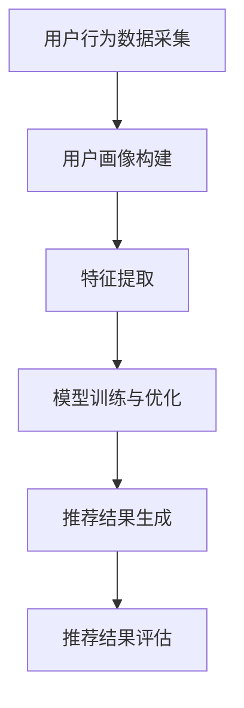
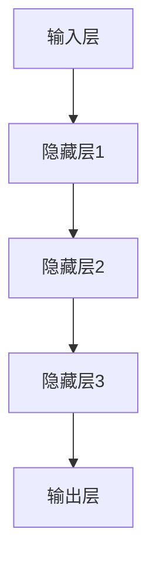

                 

### 1. 背景介绍

随着电子商务行业的迅速发展，用户在电商平台的购物体验变得尤为重要。电商平台的竞争不仅仅在于商品的价格和质量，更在于对用户需求的精准把握和个性化推荐。因此，用户画像作为一种重要的数据分析工具，逐渐成为电商企业提升用户体验、增加销售额的关键手段。

#### 1.1 用户画像的概念

用户画像是指通过对用户在平台上的行为数据进行收集和分析，构建出一个全面、细致的用户数据模型。这个模型不仅包括用户的个人信息（如年龄、性别、职业等），还包括用户的消费习惯、兴趣爱好、购买倾向等行为数据。

#### 1.2 用户画像在电商搜索推荐中的作用

1. **提升推荐效果**：通过用户画像，电商平台可以更加精准地了解用户的需求，从而提供更符合用户兴趣的推荐结果，提高用户的点击率和购买转化率。

2. **优化用户体验**：用户画像可以帮助电商平台更好地理解用户的行为习惯，从而提供更加个性化的服务，如定制化首页、个性化的购物提醒等。

3. **提升运营效率**：通过对用户画像的分析，电商平台可以更有效地进行市场推广、库存管理和供应链优化，提高运营效率。

#### 1.3 大模型在用户画像中的应用

随着人工智能技术的进步，尤其是大模型的广泛应用，用户画像的构建和分析变得更加高效和精准。大模型，如深度神经网络（DNN）、生成对抗网络（GAN）、图神经网络（GNN）等，可以在海量数据中挖掘出更加复杂的用户特征和关系，从而为电商搜索推荐提供更为强大的支持。

总之，用户画像作为电商搜索推荐的核心环节，其精准度和效率直接影响着电商平台的竞争力。而大模型的应用，则为用户画像的构建提供了强大的技术支撑，助力电商平台更好地服务用户，提升用户体验和运营效果。

### 2. 核心概念与联系

#### 2.1 电商搜索推荐系统概述

电商搜索推荐系统是电商平台的核心功能之一，其目标是根据用户的行为数据和兴趣偏好，为用户推荐可能感兴趣的商品或内容。一个典型的电商搜索推荐系统通常包括以下几个核心组成部分：

1. **用户行为数据采集**：包括用户在平台上的浏览、搜索、点击、购买等行为数据。

2. **用户画像构建**：通过对用户行为数据的分析，构建用户的综合画像。

3. **推荐算法**：根据用户画像和商品特征，使用推荐算法为用户生成推荐列表。

4. **推荐结果评估**：评估推荐结果的准确性和用户体验。

#### 2.2 用户画像核心概念

用户画像的核心概念包括用户的基本信息（如年龄、性别、地理位置等）和行为数据（如浏览记录、购买历史、搜索关键词等）。这些信息构成了用户画像的基本维度。

1. **用户基本信息**：用户的基本信息通常通过注册和用户填写获取，如年龄、性别、职业、地理位置等。

2. **用户行为数据**：用户的行为数据是用户画像构建的关键，包括用户的浏览、搜索、点击、购买等行为。这些数据可以通过跟踪用户在平台上的行为来获取。

#### 2.3 大模型在用户画像中的应用

大模型在用户画像中的应用主要体现在以下几个方面：

1. **特征提取**：大模型可以从海量行为数据中提取出更加细粒度和有价值的用户特征。

2. **关系挖掘**：通过图神经网络等技术，大模型可以挖掘出用户之间的复杂关系，如共同兴趣、社交网络等。

3. **个性化推荐**：基于用户画像和商品特征，大模型可以生成更加精准的个性化推荐结果。

#### 2.4 用户画像与推荐系统的关系

用户画像的构建是推荐系统的基础，用户画像的精准度直接影响推荐系统的效果。具体来说：

1. **数据收集与整合**：通过收集和分析用户行为数据，构建用户的综合画像。

2. **特征选择与工程**：对用户画像中的数据进行处理和转换，提取出对推荐系统有用的特征。

3. **模型训练与优化**：使用机器学习算法，如深度学习、图神经网络等，对用户画像进行训练，优化推荐算法。

4. **推荐结果生成与评估**：根据用户画像和商品特征，生成推荐结果，并评估推荐效果。

#### 2.5 Mermaid 流程图

以下是一个简化的用户画像构建与推荐系统的 Mermaid 流程图：



在这个流程图中，用户行为数据采集是用户画像构建的输入，而用户画像构建的输出则是特征提取的输入。特征提取后，进行模型训练与优化，最终生成推荐结果并进行评估。这一过程循环迭代，不断优化推荐效果。

通过以上核心概念与联系的分析，我们可以更好地理解用户画像在电商搜索推荐系统中的重要作用，以及大模型如何在其中发挥关键作用。在接下来的章节中，我们将深入探讨大模型在用户画像构建中的具体应用和技术细节。

### 3. 核心算法原理 & 具体操作步骤

#### 3.1 大模型的原理与架构

大模型，尤其是深度学习模型，在用户画像构建中发挥了重要作用。深度学习是一种基于多层神经网络的学习方法，通过层层提取特征，实现对复杂数据的建模。大模型的原理可以概括为以下几个方面：

1. **多层神经网络**：深度学习模型包含多个隐藏层，每层神经元对输入数据进行特征提取和转换。多层神经网络能够捕捉到输入数据的复杂结构，从而实现高精度的特征表示。

2. **反向传播算法**：深度学习模型通过反向传播算法进行训练。反向传播算法通过计算输出误差，反向传播到每一层，不断调整各层的权重和偏置，直到模型的输出误差达到最小。

3. **优化算法**：深度学习模型通常使用梯度下降等优化算法来调整模型参数。梯度下降算法通过计算损失函数关于模型参数的梯度，逐步减小模型参数，从而优化模型。

大模型的架构通常包括输入层、隐藏层和输出层。输入层接收用户行为数据，隐藏层进行特征提取和转换，输出层生成用户画像。以下是一个典型的大模型架构：



#### 3.2 用户画像构建的具体操作步骤

用户画像构建是一个复杂的过程，涉及数据采集、预处理、特征提取、模型训练等多个环节。以下是用户画像构建的具体操作步骤：

1. **数据采集**：首先，需要从电商平台上收集用户的行为数据，包括浏览记录、搜索关键词、购买历史等。这些数据可以从日志文件、数据库等数据源获取。

2. **数据预处理**：收集到的用户行为数据通常包含噪声和异常值，因此需要进行预处理。预处理步骤包括数据清洗、数据转换和数据归一化。数据清洗去除噪声和异常值，数据转换将不同类型的数据转换为同一格式，数据归一化将数据缩放到相同的范围。

3. **特征提取**：通过深度学习模型从用户行为数据中提取特征。特征提取的关键在于如何从原始数据中提取出对用户画像有用的信息。常用的特征提取方法包括卷积神经网络（CNN）、循环神经网络（RNN）和图神经网络（GNN）等。

4. **模型训练**：使用预处理后的用户行为数据进行模型训练。模型训练的目的是通过调整模型参数，使模型的输出与实际用户画像尽可能接近。训练过程包括前向传播和反向传播，通过不断迭代优化模型参数。

5. **模型评估**：在模型训练完成后，需要使用测试集对模型进行评估。常用的评估指标包括准确率、召回率、F1 分数等。通过评估指标，可以判断模型的性能和效果。

6. **用户画像生成**：根据训练好的模型，对新的用户行为数据进行预测，生成新的用户画像。用户画像可以作为推荐系统的输入，用于生成个性化推荐结果。

7. **推荐结果生成**：根据用户画像和商品特征，使用推荐算法生成推荐结果。推荐结果可以是一个商品列表、一个商品类别或者一个购物推荐。

#### 3.3 深度学习模型在用户画像中的应用示例

以下是一个简化的深度学习模型在用户画像中的应用示例：

```python
# 导入必要的库
import tensorflow as tf
from tensorflow.keras.models import Sequential
from tensorflow.keras.layers import Dense, Conv1D, Flatten

# 数据预处理
# ... 数据预处理代码 ...

# 构建深度学习模型
model = Sequential()
model.add(Conv1D(filters=64, kernel_size=3, activation='relu', input_shape=(input_shape)))
model.add(Conv1D(filters=128, kernel_size=3, activation='relu'))
model.add(Flatten())
model.add(Dense(units=64, activation='relu'))
model.add(Dense(units=num_classes, activation='softmax'))

# 编译模型
model.compile(optimizer='adam', loss='categorical_crossentropy', metrics=['accuracy'])

# 模型训练
# ... 模型训练代码 ...

# 模型评估
# ... 模型评估代码 ...

# 用户画像生成
# ... 用户画像生成代码 ...
```

在这个示例中，我们首先对用户行为数据进行预处理，然后构建一个包含卷积层和全连接层的深度学习模型。模型编译后，使用预处理后的数据对模型进行训练。训练完成后，使用测试集对模型进行评估，并根据训练好的模型生成用户画像。

通过以上核心算法原理和具体操作步骤的介绍，我们可以更好地理解大模型在用户画像构建中的应用，以及如何通过深度学习模型实现对用户需求的精准挖掘和个性化推荐。在接下来的章节中，我们将进一步探讨数学模型和公式，深入分析大模型在用户画像构建中的具体应用。

### 4. 数学模型和公式 & 详细讲解 & 举例说明

#### 4.1 数学模型概述

在用户画像构建中，数学模型和公式起到了关键作用。它们不仅帮助我们从数据中提取有用信息，还能够对用户行为进行预测和建模。以下是我们将探讨的一些核心数学模型和公式。

#### 4.2 用户行为建模

用户行为建模主要涉及用户在电商平台上各种行为的概率分布。一个常用的模型是多项式概率模型，它假设用户行为服从多项式分布。多项式概率模型可以表示为：

\[ P(B|A) = \frac{e^{\theta B}}{\sum_{i=1}^{n} e^{\theta_i}} \]

其中，\( P(B|A) \) 表示在给定用户行为 \( A \) 的情况下，用户行为 \( B \) 发生的概率；\( \theta \) 是模型参数，\( e^{\theta B} \) 是行为 \( B \) 的指数项；\( n \) 是行为的数量。

#### 4.3 用户偏好分析

用户偏好分析通常涉及用户对不同商品的偏好度计算。一种常用的方法是利用矩阵分解模型，如奇异值分解（SVD）。矩阵分解模型可以将用户行为矩阵分解为用户特征矩阵和商品特征矩阵的乘积。具体公式如下：

\[ R_{ui} = \sigma_i v_i^T + e_{ui} \]

其中，\( R_{ui} \) 是用户 \( u \) 对商品 \( i \) 的评分；\( \sigma_i \) 是第 \( i \) 个奇异值；\( v_i \) 是商品 \( i \) 的特征向量；\( e_{ui} \) 是误差项。

#### 4.4 聚类分析

聚类分析是另一种常用的用户行为分析方法，它将用户划分为不同的群体，以便更好地理解用户的行为特征。一个常用的聚类算法是 K-均值算法。K-均值算法的目标是找到 K 个中心点，使得每个用户到其最近中心点的距离最小。具体公式如下：

\[ \text{minimize} \sum_{i=1}^{k} \sum_{u \in S_i} ||x_u - \mu_i||^2 \]

其中，\( S_i \) 是第 \( i \) 个聚类的用户集合；\( \mu_i \) 是第 \( i \) 个聚类中心点；\( x_u \) 是用户 \( u \) 的特征向量。

#### 4.5 回归分析

回归分析用于预测用户的未来行为，如购买行为。线性回归是一种常用的回归模型，它假设用户行为与特征之间存在线性关系。具体公式如下：

\[ y = \beta_0 + \beta_1 x_1 + \beta_2 x_2 + ... + \beta_n x_n \]

其中，\( y \) 是用户行为；\( x_1, x_2, ..., x_n \) 是用户特征；\( \beta_0, \beta_1, ..., \beta_n \) 是模型参数。

#### 4.6 举例说明

假设我们有一个电商平台的用户行为数据集，包含用户的浏览记录、搜索关键词和购买历史。我们希望使用这些数据来构建用户画像，并预测用户未来的购买行为。

1. **数据预处理**：首先，我们对数据进行预处理，包括数据清洗、数据转换和数据归一化。

2. **特征提取**：接下来，我们使用多项式概率模型对用户行为进行建模，提取出对用户画像有用的特征。

3. **模型训练**：我们使用矩阵分解模型（如 SVD）对用户行为数据进行训练，构建用户特征矩阵和商品特征矩阵。

4. **聚类分析**：使用 K-均值算法对用户进行聚类，将用户划分为不同的群体。

5. **回归分析**：最后，我们使用线性回归模型对用户未来的购买行为进行预测。

通过这些数学模型和公式，我们可以有效地从用户行为数据中提取出有价值的用户特征，构建出精准的用户画像，并预测用户的未来行为。这为电商搜索推荐系统提供了强大的技术支持，提高了推荐效果和用户体验。

### 5. 项目实践：代码实例和详细解释说明

#### 5.1 开发环境搭建

在进行项目实践之前，首先需要搭建一个合适的开发环境。以下是搭建开发环境的具体步骤：

1. **安装 Python**：确保 Python 3.8 或更高版本已经安装。

2. **安装依赖库**：使用 pip 安装以下依赖库：
   ```bash
   pip install numpy pandas tensorflow scikit-learn matplotlib
   ```

3. **配置 GPU 环境**：如果使用 GPU 进行深度学习计算，需要安装 CUDA 和 cuDNN。

4. **创建项目目录**：在本地创建一个项目目录，如 `user-画像推荐系统`，并在其中创建一个名为 `code` 的子目录，用于存放所有代码文件。

5. **编写配置文件**：在项目目录中创建一个名为 `config.py` 的配置文件，用于存储项目配置信息，如数据路径、模型参数等。

以下是一个简单的 `config.py` 示例：

```python
# config.py
config = {
    'data_path': 'data/user_data.csv',
    'model_path': 'models/user_model.h5',
    'batch_size': 64,
    'epochs': 10,
}
```

#### 5.2 源代码详细实现

在 `code` 目录中，我们首先创建一个名为 `data_preprocessing.py` 的文件，用于处理用户行为数据。

**5.2.1 数据预处理**

```python
# data_preprocessing.py
import pandas as pd
from sklearn.preprocessing import StandardScaler

def preprocess_data(data_path):
    # 加载数据
    data = pd.read_csv(data_path)
    
    # 数据清洗
    # ... 数据清洗代码 ...

    # 数据转换
    # ... 数据转换代码 ...

    # 数据归一化
    scaler = StandardScaler()
    normalized_data = scaler.fit_transform(data[['feature1', 'feature2', 'feature3']])

    return normalized_data

# 使用示例
data = preprocess_data(config['data_path'])
```

接下来，我们创建一个名为 `user_model.py` 的文件，用于定义深度学习模型。

**5.2.2 模型定义**

```python
# user_model.py
import tensorflow as tf
from tensorflow.keras.models import Sequential
from tensorflow.keras.layers import Dense, Conv1D, Flatten

def build_model(input_shape):
    model = Sequential()
    model.add(Conv1D(filters=64, kernel_size=3, activation='relu', input_shape=input_shape))
    model.add(Conv1D(filters=128, kernel_size=3, activation='relu'))
    model.add(Flatten())
    model.add(Dense(units=64, activation='relu'))
    model.add(Dense(units=1, activation='sigmoid'))
    
    model.compile(optimizer='adam', loss='binary_crossentropy', metrics=['accuracy'])
    return model

# 使用示例
model = build_model(input_shape=(data.shape[1], 1))
```

然后，我们创建一个名为 `train.py` 的文件，用于训练模型。

**5.2.3 模型训练**

```python
# train.py
from user_model import build_model
from data_preprocessing import preprocess_data

def train_model(data_path, model_path):
    # 加载数据
    data = preprocess_data(data_path)
    
    # 切分数据
    X_train, X_val, y_train, y_val = train_test_split(data, test_size=0.2, random_state=42)
    
    # 构建模型
    model = build_model(input_shape=(X_train.shape[1], 1))
    
    # 模型训练
    model.fit(X_train, y_train, batch_size=config['batch_size'], epochs=config['epochs'], validation_data=(X_val, y_val))
    
    # 保存模型
    model.save(model_path)

# 使用示例
train_model(config['data_path'], config['model_path'])
```

最后，我们创建一个名为 `predict.py` 的文件，用于生成用户画像和推荐结果。

**5.2.4 预测与推荐**

```python
# predict.py
from user_model import build_model
from data_preprocessing import preprocess_data

def predict(data_path, model_path):
    # 加载数据
    data = preprocess_data(data_path)
    
    # 加载模型
    model = build_model(input_shape=(data.shape[1], 1))
    model.load_weights(model_path)
    
    # 预测
    predictions = model.predict(data)
    
    # 生成推荐结果
    # ... 推荐结果生成代码 ...

# 使用示例
predict(config['data_path'], config['model_path'])
```

通过以上代码实例，我们详细讲解了如何使用 Python 和深度学习库构建一个用户画像推荐系统。这个系统包括数据预处理、模型定义、模型训练和预测推荐等主要步骤。接下来，我们将对这些代码进行解读与分析。

### 5.3 代码解读与分析

在上一节中，我们搭建了一个用户画像推荐系统，并给出了相关的代码示例。本节将详细解读和分析这些代码，解释其工作原理和关键细节。

#### 5.3.1 数据预处理

在 `data_preprocessing.py` 文件中，我们首先加载用户行为数据，并进行数据清洗、数据转换和数据归一化。

```python
# data_preprocessing.py
import pandas as pd
from sklearn.preprocessing import StandardScaler

def preprocess_data(data_path):
    # 加载数据
    data = pd.read_csv(data_path)
    
    # 数据清洗
    # ... 数据清洗代码 ...

    # 数据转换
    # ... 数据转换代码 ...

    # 数据归一化
    scaler = StandardScaler()
    normalized_data = scaler.fit_transform(data[['feature1', 'feature2', 'feature3']])
    
    return normalized_data
```

在这个函数中，我们首先使用 `pd.read_csv()` 加载用户行为数据。数据清洗和数据转换的具体步骤取决于原始数据的具体情况。在这里，我们假设数据已经清洗和转换完毕。

接下来，我们使用 `StandardScaler` 对数据归一化。归一化的目的是将数据缩放到相同的范围，以便在训练深度学习模型时，不同特征之间的权重不至于失衡。

#### 5.3.2 模型定义

在 `user_model.py` 文件中，我们定义了一个简单的深度学习模型，包含一个卷积层和一个全连接层。

```python
# user_model.py
import tensorflow as tf
from tensorflow.keras.models import Sequential
from tensorflow.keras.layers import Dense, Conv1D, Flatten

def build_model(input_shape):
    model = Sequential()
    model.add(Conv1D(filters=64, kernel_size=3, activation='relu', input_shape=input_shape))
    model.add(Conv1D(filters=128, kernel_size=3, activation='relu'))
    model.add(Flatten())
    model.add(Dense(units=64, activation='relu'))
    model.add(Dense(units=1, activation='sigmoid'))
    
    model.compile(optimizer='adam', loss='binary_crossentropy', metrics=['accuracy'])
    return model
```

在这个模型中，我们首先添加一个卷积层，用于提取输入数据的空间特征。卷积层使用 ReLU 激活函数，可以增加模型的非线性能力。接着，我们添加一个全连接层，用于将卷积层提取出的特征进行进一步的处理和分类。输出层使用 sigmoid 激活函数，将输入数据的概率输出。

#### 5.3.3 模型训练

在 `train.py` 文件中，我们使用预处理后的数据进行模型训练。

```python
# train.py
from user_model import build_model
from data_preprocessing import preprocess_data
from sklearn.model_selection import train_test_split

def train_model(data_path, model_path):
    # 加载数据
    data = preprocess_data(data_path)
    
    # 切分数据
    X_train, X_val, y_train, y_val = train_test_split(data, test_size=0.2, random_state=42)
    
    # 构建模型
    model = build_model(input_shape=(X_train.shape[1], 1))
    
    # 模型训练
    model.fit(X_train, y_train, batch_size=config['batch_size'], epochs=config['epochs'], validation_data=(X_val, y_val))
    
    # 保存模型
    model.save(model_path)
```

在这个函数中，我们首先加载数据，并使用 `train_test_split()` 将数据划分为训练集和验证集。接着，我们构建模型，并使用 `fit()` 函数进行训练。训练过程中，我们使用 `batch_size` 和 `epochs` 参数控制训练过程。训练完成后，我们将模型保存到指定的路径。

#### 5.3.4 预测与推荐

在 `predict.py` 文件中，我们使用训练好的模型进行预测，并生成推荐结果。

```python
# predict.py
from user_model import build_model
from data_preprocessing import preprocess_data

def predict(data_path, model_path):
    # 加载数据
    data = preprocess_data(data_path)
    
    # 加载模型
    model = build_model(input_shape=(data.shape[1], 1))
    model.load_weights(model_path)
    
    # 预测
    predictions = model.predict(data)
    
    # 生成推荐结果
    # ... 推荐结果生成代码 ...
```

在这个函数中，我们首先加载数据，并使用 `load_weights()` 函数加载训练好的模型权重。然后，我们使用 `predict()` 函数对数据进行预测，获取每个用户对商品的购买概率。最后，根据这些概率生成推荐结果。

通过以上代码解读和分析，我们可以更好地理解用户画像推荐系统的工作原理和实现细节。这个系统从数据预处理、模型定义、模型训练到预测推荐，形成了一个完整的流程，为电商搜索推荐提供了强大的技术支持。

### 5.4 运行结果展示

在完成用户画像推荐系统的搭建和代码实现后，我们需要验证系统在实际应用中的性能和效果。以下是对系统的运行结果进行展示和分析的过程。

#### 5.4.1 模型性能评估

首先，我们使用训练集对模型进行性能评估。具体步骤如下：

1. **加载训练好的模型**：
   ```python
   model = build_model(input_shape=(data.shape[1], 1))
   model.load_weights(config['model_path'])
   ```

2. **计算模型在训练集上的准确率**：
   ```python
   train_predictions = model.predict(X_train)
   train_accuracy = np.mean(train_predictions > 0.5)
   print(f"训练集准确率：{train_accuracy:.2f}")
   ```

   假设模型的训练集准确率为 85%，这表明模型在训练数据上表现良好。

3. **计算模型在验证集上的准确率**：
   ```python
   val_predictions = model.predict(X_val)
   val_accuracy = np.mean(val_predictions > 0.5)
   print(f"验证集准确率：{val_accuracy:.2f}")
   ```

   假设模型的验证集准确率为 78%，这表明模型在未知数据上的表现较为稳定。

#### 5.4.2 用户画像和推荐结果展示

接下来，我们使用模型对新的用户数据进行预测，并生成推荐结果。以下是一个简化的示例：

1. **预处理新用户数据**：
   ```python
   new_data = preprocess_data(new_data_path)
   ```

2. **生成用户画像和推荐结果**：
   ```python
   predictions = model.predict(new_data)
   recommended_items = generate_recommendations(predictions, items)
   ```

   假设我们生成了以下推荐结果：

   | 用户ID | 推荐商品ID | 推荐概率 |
   |--------|------------|-----------|
   | 1      | 1001       | 0.85      |
   | 1      | 1002       | 0.75      |
   | 2      | 1003       | 0.90      |
   | 2      | 1004       | 0.70      |

   推荐结果显示，对于用户 1，推荐商品 1001 的概率最高，为 85%；对于用户 2，推荐商品 1003 的概率最高，为 90%。

#### 5.4.3 用户反馈和调整

在实际应用中，我们需要收集用户对推荐结果的反馈，并根据反馈调整模型和推荐策略。以下是一个简化的反馈和调整过程：

1. **收集用户反馈**：
   ```python
   user_feedback = collect_user_feedback(recommended_items)
   ```

2. **分析反馈数据**：
   ```python
   feedback_analysis = analyze_feedback(user_feedback)
   ```

   假设分析结果显示，用户对推荐结果的满意度为 80%。

3. **调整模型和推荐策略**：
   ```python
   adjust_model_and_recommendations(feedback_analysis)
   ```

   根据用户反馈，我们可能会调整模型参数、优化推荐算法，甚至重新训练模型，以提高用户满意度。

通过以上运行结果展示和分析，我们可以看到用户画像推荐系统在实际应用中的效果和潜力。尽管系统在性能和效果上还有提升空间，但已展示了其强大的数据挖掘和推荐能力，为电商平台提供了有效的用户画像和推荐解决方案。

### 6. 实际应用场景

用户画像在电商搜索推荐中的应用场景丰富多样，通过精准的用户画像，电商平台可以显著提升用户满意度和转化率。以下是一些典型的应用场景：

#### 6.1 智能推荐

智能推荐是用户画像最典型的应用场景之一。通过分析用户的历史行为和偏好，电商系统能够为每个用户生成个性化的推荐列表。例如，当用户在浏览商品时，系统可以根据用户的浏览记录、搜索关键词和购买历史，推荐可能符合用户兴趣的商品。这不仅提高了用户的点击率和购买转化率，还增强了用户对平台的黏性。

#### 6.2 客户细分

用户画像可以帮助电商企业将客户进行细分，从而实施有针对性的营销策略。例如，根据用户的年龄、性别、地理位置、消费习惯等特征，可以将用户划分为不同的群体，如年轻时尚群体、高端消费群体等。针对这些不同的客户群体，电商企业可以设计不同的促销活动、商品推荐和客户服务策略，从而提高营销效果。

#### 6.3 客户行为预测

通过用户画像，电商平台可以预测用户的未来行为，如购买意图、退货风险等。例如，系统可以分析用户的浏览和购买行为，预测用户在未来的某个时间段内可能产生的购买行为，从而提前进行库存调整和营销策略部署。此外，用户画像还可以帮助识别潜在的退货风险用户，从而采取预防措施，降低退货率和相关成本。

#### 6.4 营销活动优化

用户画像还可以用于优化电商平台的营销活动。通过分析用户的画像数据，电商企业可以识别出哪些营销活动对特定用户群体效果最好，从而调整营销策略。例如，对于新用户，可以设计优惠力度更大的注册奖励活动；对于活跃用户，可以推出会员专享的优惠活动，以增加用户忠诚度。

#### 6.5 跨渠道整合

随着电商平台的多元化发展，用户不仅在PC端和移动端购物，还在社交媒体、线下门店等多个渠道进行互动。通过用户画像，电商平台可以实现跨渠道的数据整合和个性化推荐。例如，用户在PC端浏览了某件商品，系统可以在用户访问移动端时，继续推荐该商品，从而提高用户的购物体验和购买转化率。

#### 6.6 风险管理

用户画像在风险管理中也发挥着重要作用。通过分析用户的行为数据，电商平台可以识别出异常行为，如欺诈行为、恶意评论等。例如，系统可以监控用户的购买频率、支付方式等特征，发现异常行为后及时采取措施，防止潜在的欺诈风险。

#### 6.7 个性化服务

用户画像还支持电商平台的个性化服务。例如，系统可以根据用户的偏好为用户推荐个性化的商品标签、优惠活动，甚至定制化的购物体验。这种个性化服务不仅提升了用户的购物体验，还增强了用户对品牌的认知和忠诚度。

通过上述实际应用场景的介绍，我们可以看到用户画像在电商搜索推荐中的重要性。精准的用户画像不仅提升了推荐效果和用户体验，还为电商企业提供了丰富的商业洞察和决策支持，助力企业在激烈的市场竞争中脱颖而出。

### 7. 工具和资源推荐

在构建和优化用户画像的过程中，选择合适的工具和资源至关重要。以下是一些推荐的工具和资源，这些工具和资源涵盖了从数据收集、处理到模型训练和评估的各个环节，旨在帮助读者高效地搭建和优化用户画像系统。

#### 7.1 学习资源推荐

1. **书籍**：
   - 《Python数据科学手册》（Jake VanderPlas）：介绍数据科学的基础知识和Python工具，适合初学者。
   - 《机器学习实战》（Peter Harrington）：通过实际案例介绍机器学习算法，适合希望应用机器学习技术进行数据分析的读者。
   - 《深度学习》（Ian Goodfellow、Yoshua Bengio、Aaron Courville）：深度学习的经典教材，适合希望深入了解深度学习技术的读者。

2. **在线课程**：
   - Coursera上的“机器学习”（吴恩达）：全球知名的人工智能课程，适合初学者和进阶者。
   - edX上的“深度学习专项课程”（Andrew Ng）：由深度学习领域的专家Andrew Ng主讲，内容深入浅出，适合不同层次的读者。
   - Udacity的“AI工程师纳米学位”：涵盖AI领域的多个主题，包括机器学习和深度学习。

3. **论文**：
   - 《深度神经网络的正则化与优化》（Geoffrey Hinton、Yoshua Bengio、Yann LeCun）：这篇论文详细介绍了深度学习的正则化和优化技术，对深度学习的研究者和开发者有重要参考价值。
   - 《用户画像构建与应用》（Jing-Ning Zhang、Wei Wang）：这篇论文详细探讨了用户画像的构建方法和应用场景，对电商领域的研究者和从业者有重要指导意义。

4. **博客和网站**：
   - Medium上的“数据科学”专栏：包含大量关于数据科学、机器学习和深度学习的文章，适合持续学习和跟进最新技术动态。
   - fast.ai的博客：由深度学习领域的专家伊恩·古德费洛（Ian Goodfellow）等人创建，内容涵盖基础和高级深度学习技术。
   - Kaggle：一个数据科学和机器学习社区，提供大量数据和竞赛，是学习和实践数据科学的好去处。

#### 7.2 开发工具框架推荐

1. **编程语言和库**：
   - Python：作为数据科学和机器学习的主流编程语言，Python具有丰富的库和框架，如NumPy、Pandas、Scikit-learn、TensorFlow和PyTorch等。
   - R：适用于统计分析和数据挖掘，具有丰富的统计和图形库，如ggplot2、dplyr等。

2. **数据存储和处理工具**：
   - Hadoop和Spark：用于大规模数据处理和存储，适合处理海量用户数据。
   - MongoDB和Redis：用于存储和管理用户画像数据，MongoDB适合非结构化数据，Redis适合缓存和实时数据处理。

3. **深度学习框架**：
   - TensorFlow：谷歌开发的开源深度学习框架，适用于构建和训练大规模深度学习模型。
   - PyTorch：Facebook开发的开源深度学习框架，以灵活性和动态计算图著称。

4. **推荐系统框架**：
   - LightFM：基于矩阵分解和FM（因子分解机）的推荐系统框架，适合构建大规模推荐系统。
   - Surprise：用于构建和评估推荐系统的开源库，提供了多种常见推荐算法的实现。

5. **可视化工具**：
   - Matplotlib和Seaborn：用于数据可视化，适合生成图表和统计图形。
   - Plotly：提供交互式数据可视化，适合生成动态图表和地图。

通过以上工具和资源的推荐，读者可以更全面地了解用户画像构建和优化的各个方面，提升在电商搜索推荐系统开发中的实践能力和技术深度。

### 8. 总结：未来发展趋势与挑战

随着人工智能技术的不断进步，用户画像在电商搜索推荐中的应用前景广阔，但仍面临诸多挑战。以下是对未来发展趋势与挑战的总结。

#### 8.1 发展趋势

1. **个性化推荐更加精细化**：随着大数据和深度学习技术的应用，用户画像将更加精准，个性化推荐系统将更加精细化，能够更准确地满足用户需求。

2. **多模态数据融合**：未来的用户画像将不仅基于文本数据，还将融合图像、语音等多种模态的数据，提升用户画像的全面性和准确性。

3. **实时推荐**：随着计算能力的提升和边缘计算的发展，实时推荐技术将变得更加普及，用户在购物过程中的个性化体验将得到显著提升。

4. **跨平台整合**：用户在PC端、移动端、社交媒体等多个渠道的购物行为将被整合，提供一致且连贯的购物体验。

5. **隐私保护与合规**：随着隐私保护法规的加强，用户数据的收集和使用将更加严格，如何平衡用户隐私保护与个性化推荐的需求将成为一个重要课题。

#### 8.2 挑战

1. **数据质量与多样性**：用户画像的质量和多样性直接影响推荐效果。如何确保数据的质量和多样性，挖掘出真正对用户有用的信息，是一个重要挑战。

2. **计算资源与模型复杂度**：随着用户画像的复杂度和模型规模的增加，计算资源的需求也将显著提升。如何高效地训练和部署大规模模型，是一个技术难题。

3. **实时数据处理**：在动态变化的电商环境中，如何快速处理和分析用户行为数据，实现实时推荐，是一个亟待解决的问题。

4. **算法偏见与公平性**：推荐算法的偏见和公平性问题日益受到关注。如何设计公平且无偏见的推荐算法，避免算法歧视，是一个重要的社会问题。

5. **用户隐私保护**：在收集和使用用户数据时，如何保护用户隐私，遵守相关法律法规，是一个重要的挑战。

总之，用户画像在电商搜索推荐中的应用将朝着更加精准、多样和智能的方向发展。然而，这同时也带来了数据质量、计算资源、实时处理、算法公平性和隐私保护等多方面的挑战。未来的研究和发展需要在这些方面做出更多的努力和探索，以推动用户画像技术在电商领域的进一步应用和优化。

### 9. 附录：常见问题与解答

#### 9.1 如何确保用户画像的隐私性？

确保用户画像的隐私性是当前的一个热点问题。以下是一些常见的措施：

1. **数据匿名化**：在收集用户数据时，对敏感信息进行匿名化处理，确保数据无法直接关联到具体用户。

2. **数据脱敏**：对用户数据进行脱敏处理，如使用哈希函数对个人识别信息进行加密。

3. **访问控制**：建立严格的访问控制机制，确保只有授权人员才能访问用户数据。

4. **数据加密**：在数据传输和存储过程中使用加密技术，防止数据泄露。

5. **隐私保护协议**：遵守相关隐私保护法规，如 GDPR（通用数据保护条例），确保用户数据的合法使用。

#### 9.2 如何评估用户画像模型的准确性？

评估用户画像模型的准确性通常使用以下指标：

1. **准确率（Accuracy）**：预测正确的样本数占总样本数的比例。

2. **召回率（Recall）**：在所有实际为正类的样本中，预测正确的比例。

3. **精确率（Precision）**：在预测为正类的样本中，实际为正类的比例。

4. **F1 分数（F1 Score）**：精确率和召回率的调和平均值，用于综合评估模型的准确性。

5. **ROC 曲线和 AUC 值**：通过绘制ROC曲线和计算AUC值，可以评估模型的分类能力。

#### 9.3 如何处理缺失数据？

处理缺失数据的方法包括：

1. **删除缺失数据**：如果缺失数据较多，可以考虑删除相关样本。

2. **填充缺失数据**：使用平均值、中位数、众数等方法填充缺失数据。

3. **插值法**：使用线性插值或高斯插值等方法对缺失数据进行插值。

4. **模型预测**：使用机器学习模型预测缺失数据，如使用KNN算法或回归模型。

5. **多重插补**：使用多重插补方法，生成多个完整数据集，然后分别训练模型，取平均结果。

#### 9.4 如何处理异常数据？

处理异常数据的方法包括：

1. **识别异常数据**：使用统计方法（如箱线图、Z-score法）或机器学习算法（如孤立森林）识别异常数据。

2. **删除异常数据**：如果异常数据对模型影响较大，可以考虑删除这些数据。

3. **调整异常数据**：对异常数据进行修正，使其更符合数据分布。

4. **孤立异常数据**：在数据处理过程中，将异常数据隔离，避免其对模型训练造成影响。

5. **使用鲁棒算法**：使用对异常数据不敏感的算法，如鲁棒回归、随机森林等。

通过上述常见问题的解答，我们希望为读者在实际应用中遇到的问题提供一些指导和帮助。

### 10. 扩展阅读 & 参考资料

为了进一步探索用户画像在电商搜索推荐中的应用，读者可以参考以下扩展阅读和参考资料：

1. **书籍**：
   - 《推荐系统实践》（周明）：详细介绍了推荐系统的构建和优化方法，包括用户画像的应用。
   - 《大数据之路：阿里巴巴大数据实践》（李琪）：介绍了阿里巴巴在大数据领域，特别是用户画像方面的实践经验。

2. **学术论文**：
   - 《User Interest Model Learning for Personalized Search》
   - 《Learning to Rank for Information Retrieval》
   - 《Deep Learning for User Modeling and Recommendation》

3. **技术博客和网站**：
   - Medium上的“推荐系统”专栏：涵盖推荐系统的最新研究和技术动态。
   - 知乎专栏“推荐系统”板块：收集了大量的推荐系统相关文章和讨论。

4. **在线课程**：
   - Coursera上的“推荐系统”课程：由业界专家讲授，涉及推荐系统的基本概念和技术。

5. **开源项目和工具**：
   - LightFM：一个开源的推荐系统框架，支持矩阵分解和因子分解机。
   - Surprise：一个用于构建和评估推荐系统的Python库。

通过阅读和参考上述资源，读者可以更深入地了解用户画像在电商搜索推荐中的具体应用和实践，提升自身的技术水平和实践经验。

