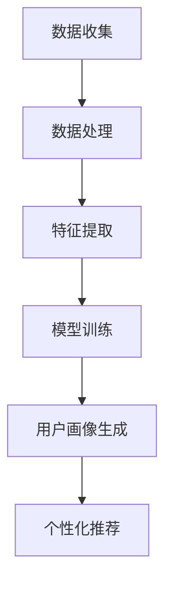

                 

### 1. 背景介绍

在电商行业，用户画像构建是电商搜索推荐系统的重要组成部分。用户画像是指通过收集和分析用户在电商平台上产生的行为数据，如搜索历史、购买记录、浏览行为等，从而构建出一个反映用户需求、行为偏好和兴趣爱好的数据模型。

随着人工智能技术的快速发展，特别是大模型的广泛应用，用户画像构建方法也发生了巨大的变化。大模型，如GPT-3、BERT等，通过训练大规模数据集，能够从海量数据中提取出用户的深层次特征，从而实现更加精准的用户画像构建。本文将围绕AI大模型在电商搜索推荐中的用户画像构建进行探讨，从核心概念、算法原理、数学模型、项目实践、应用场景等方面详细分析，旨在为业界提供有价值的参考。

首先，我们需要了解用户画像构建的基本流程，这包括数据收集、数据预处理、特征提取、模型训练与优化、用户画像生成等环节。每一个环节都对最终的用户画像质量有着重要的影响。

数据收集方面，电商平台的用户行为数据主要包括用户浏览、搜索、购买等操作记录，这些数据通常存储在数据库或数据仓库中。数据预处理是对原始数据进行清洗、去噪、格式转换等处理，以便后续的特征提取。特征提取是用户画像构建的关键步骤，通过提取用户行为数据中的有效信息，如用户活跃度、购买频率、商品偏好等，构建出能够反映用户特征的特征向量。

在模型训练与优化阶段，我们通常使用机器学习算法，如决策树、随机森林、支持向量机等，对用户特征向量进行训练，以生成一个分类模型或回归模型。这个模型将用于预测用户的行为和偏好。

最后，用户画像生成是根据模型预测结果，将用户划分为不同的群体，并生成相应的画像报告。这些画像报告可以用于个性化推荐、精准营销、风险控制等场景。

随着人工智能技术的发展，特别是大模型的兴起，用户画像构建方法也在不断优化。大模型具有强大的数据处理能力和特征提取能力，可以从海量数据中提取出用户的深层次特征，从而实现更加精准的用户画像构建。本文将重点介绍大模型在用户画像构建中的应用，并分析其优势与挑战。

### 2. 核心概念与联系

在深入了解AI大模型在电商搜索推荐中的用户画像构建之前，我们需要明确几个核心概念，并探讨它们之间的联系。以下是我们将在本文中详细讨论的主要概念：

#### 数据收集与处理

**数据收集**：数据收集是用户画像构建的基础。电商平台的用户行为数据通常包括用户浏览、搜索、购买等操作记录。这些数据可以是结构化数据（如数据库中的表）或非结构化数据（如日志文件）。数据收集的主要目标是尽可能全面地获取用户在平台上的行为信息。

**数据处理**：在收集到用户行为数据后，需要对其进行处理，包括数据清洗、去噪、数据格式转换等。这一步骤的目的是确保数据的准确性和一致性，以便后续的特征提取和分析。

#### 特征提取

**特征提取**：特征提取是用户画像构建的关键步骤。通过对用户行为数据进行分析，提取出与用户行为相关的特征，如用户活跃度、购买频率、商品偏好等。这些特征将用于构建用户画像模型。

#### 机器学习与深度学习

**机器学习**：机器学习是用户画像构建的传统方法。通过训练机器学习模型，如决策树、随机森林、支持向量机等，从用户行为数据中学习出规律，进而预测用户的行为和偏好。

**深度学习**：深度学习是近年来发展迅速的一门技术，它基于多层神经网络，通过自动提取数据中的特征，实现更加复杂的模式识别。深度学习在用户画像构建中具有显著的优势，特别是在处理大规模、高维度数据时。

#### 用户画像模型

**用户画像模型**：用户画像模型是将用户行为数据转换为用户特征向量的工具。通过训练和优化机器学习或深度学习模型，我们可以生成一个用户画像模型，该模型可以用于预测用户的行为和偏好。

#### 大模型

**大模型**：大模型（如GPT-3、BERT等）是近年来人工智能领域的重大突破。这些模型通过训练海量数据集，能够自动提取出数据的深层次特征，实现高度复杂的任务。大模型在用户画像构建中具有强大的数据处理能力和特征提取能力，能够从海量数据中提取出用户的深层次特征，从而实现更加精准的用户画像构建。

#### 个性化推荐

**个性化推荐**：个性化推荐是电商搜索推荐系统的重要功能之一。通过分析用户画像，推荐系统可以为目标用户推荐符合其兴趣和需求的商品或服务，从而提高用户的购物体验和平台的销售额。

#### 架构与流程

在用户画像构建过程中，各个核心概念之间的联系构成了一个完整的架构和流程。以下是一个简化的用户画像构建流程：

1. **数据收集**：从电商平台收集用户行为数据。
2. **数据处理**：对收集到的数据进行清洗和处理，确保数据的准确性和一致性。
3. **特征提取**：提取用户行为数据中的有效特征，构建用户特征向量。
4. **模型训练**：使用机器学习或深度学习算法，训练用户画像模型。
5. **用户画像生成**：根据模型预测结果，将用户划分为不同的群体，并生成相应的画像报告。
6. **个性化推荐**：利用用户画像模型，为用户推荐个性化的商品或服务。

#### Mermaid 流程图

为了更好地理解用户画像构建的流程，我们可以使用Mermaid流程图进行描述。以下是用户画像构建的Mermaid流程图：



在这个流程图中，数据收集、数据处理、特征提取、模型训练、用户画像生成和个性化推荐构成了用户画像构建的主要步骤。每一个步骤都对最终的用户画像质量有着重要的影响。

通过上述核心概念和流程的介绍，我们可以更好地理解AI大模型在电商搜索推荐中的用户画像构建。接下来，我们将深入探讨大模型在用户画像构建中的具体应用和优势。

### 3. 核心算法原理 & 具体操作步骤

在了解了用户画像构建的基本流程和核心概念之后，我们接下来将重点探讨AI大模型在用户画像构建中的核心算法原理和具体操作步骤。大模型在用户画像构建中具有显著的优势，主要体现在其强大的数据处理能力和特征提取能力上。以下将详细介绍大模型在用户画像构建中的应用原理和操作步骤。

#### 3.1 大模型的基本原理

大模型通常是指具有大量参数的深度神经网络模型，如GPT-3、BERT等。这些模型通过训练海量数据集，可以自动提取出数据的深层次特征，从而实现高度复杂的任务。大模型的基本原理可以概括为以下几点：

1. **多层神经网络**：大模型通常由多层神经网络组成，每一层都能够从数据中提取出不同层次的特征。通过多层次的堆叠，模型能够逐渐提取出数据的深层次特征。

2. **自动特征提取**：大模型通过训练，可以自动从数据中提取出有效的特征。这些特征不仅可以是原始数据的直接映射，还可以是经过多层神经网络处理后生成的抽象特征。

3. **参数共享与训练效率**：大模型通常采用参数共享技术，即不同数据样本使用相同的模型参数。这使得模型在训练过程中能够共享计算资源，提高训练效率。

4. **端到端学习**：大模型可以实现端到端学习，即从原始数据直接学习到输出结果，无需进行复杂的特征工程。这使得模型在构建用户画像时，能够直接从用户行为数据中提取出用户特征，减少了人工干预的需求。

#### 3.2 大模型在用户画像构建中的应用步骤

在用户画像构建中，大模型的应用主要包括以下几个步骤：

1. **数据收集**：从电商平台收集用户行为数据，如搜索记录、购买记录、浏览记录等。

2. **数据处理**：对收集到的用户行为数据进行预处理，包括数据清洗、去噪、数据格式转换等。这一步骤的目的是确保数据的准确性和一致性，以便后续的特征提取。

3. **特征提取**：使用大模型自动提取用户行为数据中的深层次特征。这一步骤通常通过预训练的模型完成，如BERT、GPT-3等。这些模型已经在大规模数据集上进行了预训练，可以自动提取出数据的深层次特征。

4. **特征编码**：将提取出的用户特征编码为特征向量。特征向量可以表示用户的行为模式、兴趣偏好等，是用户画像构建的核心。

5. **模型训练与优化**：使用机器学习算法，如决策树、随机森林、支持向量机等，对用户特征向量进行训练和优化。这一步骤的目的是构建出一个能够准确预测用户行为和偏好的用户画像模型。

6. **用户画像生成**：根据模型预测结果，将用户划分为不同的群体，并生成相应的画像报告。这些画像报告可以用于个性化推荐、精准营销、风险控制等场景。

7. **模型评估与优化**：对用户画像模型进行评估和优化，以提升模型的预测准确性和稳定性。

#### 3.3 大模型在用户画像构建中的优势

大模型在用户画像构建中具有以下优势：

1. **强大的数据处理能力**：大模型能够处理大规模、高维度的数据，从海量数据中提取出用户的深层次特征。

2. **自动特征提取**：大模型通过自动提取特征，减少了人工干预的需求，提高了特征提取的效率和质量。

3. **端到端学习**：大模型可以实现端到端学习，直接从用户行为数据中提取出用户特征，减少了复杂的特征工程过程。

4. **预测准确性高**：大模型通过训练海量数据集，能够准确预测用户的行为和偏好，提高用户画像的准确性。

5. **可扩展性强**：大模型具有很好的可扩展性，可以轻松地应对不同规模和类型的数据，适应不同的业务场景。

#### 3.4 大模型在用户画像构建中的挑战

尽管大模型在用户画像构建中具有显著的优势，但也面临一些挑战：

1. **计算资源需求大**：大模型通常需要大量的计算资源进行训练，对硬件设施有较高的要求。

2. **数据隐私和安全**：用户行为数据涉及用户的隐私信息，在使用大模型进行用户画像构建时，需要确保数据的隐私和安全。

3. **模型解释性不足**：大模型通过自动提取特征，往往导致模型缺乏解释性，难以理解模型的决策过程。

4. **训练时间较长**：大模型需要大量的数据和时间进行训练，训练时间较长，影响了模型的上线速度。

#### 3.5 大模型在用户画像构建中的案例分析

以下是一个基于大模型的用户画像构建案例：

**案例背景**：某电商平台上，用户行为数据包括搜索记录、购买记录、浏览记录等。平台希望利用大模型构建用户画像，以提高个性化推荐的准确性。

**操作步骤**：

1. **数据收集**：从电商平台上收集用户行为数据，包括搜索记录、购买记录、浏览记录等。

2. **数据处理**：对收集到的用户行为数据进行预处理，包括数据清洗、去噪、数据格式转换等。

3. **特征提取**：使用预训练的BERT模型对用户行为数据进行特征提取，提取出用户的深层次特征。

4. **特征编码**：将提取出的用户特征编码为特征向量。

5. **模型训练与优化**：使用决策树、随机森林等机器学习算法，对用户特征向量进行训练和优化，构建用户画像模型。

6. **用户画像生成**：根据模型预测结果，将用户划分为不同的群体，并生成相应的画像报告。

7. **模型评估与优化**：对用户画像模型进行评估和优化，以提升模型的预测准确性和稳定性。

通过上述案例，我们可以看到大模型在用户画像构建中的应用流程和优势。大模型通过自动提取特征，提高了特征提取的效率和质量，实现了更加精准的用户画像构建。

### 4. 数学模型和公式 & 详细讲解 & 举例说明

在用户画像构建中，数学模型和公式是不可或缺的工具。它们帮助我们量化用户特征，评估模型性能，并指导实际操作。在本节中，我们将详细讲解用户画像构建中涉及的主要数学模型和公式，并通过具体示例来说明其应用。

#### 4.1 相关数学模型

1. **线性回归模型**：线性回归模型是最基本的机器学习模型之一，用于预测用户的某一行为（如购买概率）。其公式如下：

   \[ y = \beta_0 + \beta_1 x_1 + \beta_2 x_2 + ... + \beta_n x_n + \epsilon \]

   其中，\( y \) 是预测结果，\( x_1, x_2, ..., x_n \) 是特征向量，\( \beta_0, \beta_1, \beta_2, ..., \beta_n \) 是模型参数，\( \epsilon \) 是误差项。

2. **逻辑回归模型**：逻辑回归模型是一种广义线性模型，常用于分类任务，如用户是否购买某商品。其公式如下：

   \[ P(y=1) = \frac{1}{1 + e^{-(\beta_0 + \beta_1 x_1 + \beta_2 x_2 + ... + \beta_n x_n )}} \]

   其中，\( P(y=1) \) 是预测的概率，\( e \) 是自然对数的底数。

3. **决策树模型**：决策树模型通过树形结构对数据集进行分割，每个节点代表一个特征，每个分支代表该特征的一个取值。其公式如下：

   \[ \text{决策树} = \{ f_1(x_1), f_2(x_2), ..., f_n(x_n) \} \]

   其中，\( f_1(x_1), f_2(x_2), ..., f_n(x_n) \) 是特征函数。

4. **支持向量机（SVM）模型**：支持向量机是一种高效的分类算法，通过找到一个最佳的超平面，将不同类别的样本分隔开来。其公式如下：

   \[ \text{决策边界} = \{ w \cdot x + b = 0 \} \]

   其中，\( w \) 是法向量，\( x \) 是特征向量，\( b \) 是偏置项。

5. **神经网络模型**：神经网络模型是一种模拟人脑结构的计算模型，通过多层神经元进行数据传递和变换。其公式如下：

   \[ \text{输出} = \text{激活函数}(\text{权重} \cdot \text{输入} + \text{偏置}) \]

   其中，激活函数（如ReLU、Sigmoid、Tanh）用于引入非线性变换。

#### 4.2 数学公式的详细讲解

1. **线性回归模型**

   线性回归模型是一种简单的预测模型，通过拟合一个线性关系来预测结果。其核心在于确定模型参数，使得预测结果与实际结果之间的误差最小。

   - **目标函数**：均方误差（MSE）

     \[ J(\theta) = \frac{1}{2m} \sum_{i=1}^{m} (h_\theta(x^{(i)}) - y^{(i)})^2 \]

     其中，\( m \) 是训练样本数量，\( h_\theta(x) \) 是模型的预测结果，\( y \) 是实际结果。

   - **参数更新**：梯度下降

     \[ \theta_j := \theta_j - \alpha \frac{\partial J(\theta)}{\partial \theta_j} \]

     其中，\( \alpha \) 是学习率，\( \theta_j \) 是模型参数。

2. **逻辑回归模型**

   逻辑回归模型是一种概率型分类模型，通过计算预测概率来判断样本属于哪个类别。其核心在于确定模型参数，使得预测概率与实际类别之间的一致性最高。

   - **目标函数**：对数损失函数（Log-Loss）

     \[ J(\theta) = -\frac{1}{m} \sum_{i=1}^{m} [y^{(i)} \log(h_\theta(x^{(i)})) + (1 - y^{(i)}) \log(1 - h_\theta(x^{(i)}))] \]

   - **参数更新**：梯度下降

     \[ \theta_j := \theta_j - \alpha \frac{\partial J(\theta)}{\partial \theta_j} \]

3. **决策树模型**

   决策树模型通过一系列条件判断来对样本进行分类或回归。其核心在于确定每个节点的分割条件，使得分割后的数据集具有较好的纯度。

   - **信息增益**：

     \[ \text{Gain}(A, B) = \sum_{v \in V} p(v) \cdot \text{Entropy}(B_v) - \text{Entropy}(B) \]

     其中，\( A \) 是特征，\( B \) 是类别，\( p(v) \) 是特征取值的概率，\( \text{Entropy}(B_v) \) 是条件熵。

   - **信息增益率**：

     \[ \text{Gain Ratio}(A, B) = \frac{\text{Gain}(A, B)}{\text{Split Info}(A)} \]

     其中，\( \text{Split Info}(A) = -\sum_{v \in V} p(v) \log p(v) \)。

4. **支持向量机（SVM）模型**

   支持向量机是一种强大的分类算法，通过寻找最佳的超平面来分隔数据。其核心在于确定超平面参数，使得分类间隔最大化。

   - **优化问题**：

     \[ \min_{\theta, \xi} \frac{1}{2} ||\theta||^2 + C \sum_{i=1}^{m} \xi_i \]

     其中，\( \theta \) 是超平面参数，\( \xi_i \) 是松弛变量，\( C \) 是惩罚参数。

   - **软 margin SVM**：

     \[ \min_{\theta, \xi} \frac{1}{2} ||\theta||^2 + \sum_{i=1}^{m} \xi_i \]

     其中，\( \xi_i \geq 0 \)。

5. **神经网络模型**

   神经网络模型是一种复杂的非线性模型，通过多层神经元进行数据传递和变换。其核心在于确定每个神经元的权重和偏置，使得输出结果尽可能接近目标。

   - **前向传播**：

     \[ a_{l}^{(i)} = \text{激活函数}(\sum_{j=1}^{n} \theta_{j}^{(l)} a_{l-1}^{(j)} + b^{(l)}) \]

     其中，\( a_{l}^{(i)} \) 是第 \( l \) 层第 \( i \) 个神经元的激活值，\( \theta_{j}^{(l)} \) 是连接权重，\( b^{(l)} \) 是偏置。

   - **反向传播**：

     \[ \delta_{l}^{(i)} = \text{激活函数}'(a_{l}^{(i)}) \cdot (\sum_{j=1}^{n} \theta_{j}^{(l+1)} \delta_{l+1}^{(j)}) \]

     其中，\( \delta_{l}^{(i)} \) 是第 \( l \) 层第 \( i \) 个神经元的误差。

   - **参数更新**：

     \[ \theta_{j}^{(l)} := \theta_{j}^{(l)} - \alpha \frac{\partial J(\theta)}{\partial \theta_{j}^{(l)}} \]

     其中，\( \alpha \) 是学习率，\( J(\theta) \) 是损失函数。

#### 4.3 数学公式的具体应用示例

1. **线性回归模型**

   假设我们有一个简单的线性回归模型，用于预测用户购买某商品的概率。训练数据集包含以下特征：用户年龄、用户收入、商品价格。模型参数为 \( \beta_0 \) 和 \( \beta_1 \)。

   - **目标函数**：

     \[ J(\theta) = \frac{1}{2m} \sum_{i=1}^{m} [(\beta_0 + \beta_1 x_1^{(i)} + \beta_1 x_2^{(i)}) - y^{(i)})^2 ] \]

   - **梯度下降**：

     \[ \theta_0 := \theta_0 - \alpha \frac{1}{m} \sum_{i=1}^{m} [(\beta_0 + \beta_1 x_1^{(i)} + \beta_1 x_2^{(i)}) - y^{(i)}] \]
     \[ \theta_1 := \theta_1 - \alpha \frac{1}{m} \sum_{i=1}^{m} [x_1^{(i)} (\beta_0 + \beta_1 x_1^{(i)} + \beta_1 x_2^{(i)}) - y^{(i)}] \]
     \[ \theta_2 := \theta_2 - \alpha \frac{1}{m} \sum_{i=1}^{m} [x_2^{(i)} (\beta_0 + \beta_1 x_1^{(i)} + \beta_1 x_2^{(i)}) - y^{(i)}] \]

2. **逻辑回归模型**

   假设我们使用逻辑回归模型来预测用户购买某商品的概率。训练数据集包含以下特征：用户年龄、用户收入、商品价格。模型参数为 \( \beta_0 \) 和 \( \beta_1 \)。

   - **目标函数**：

     \[ J(\theta) = -\frac{1}{m} \sum_{i=1}^{m} [y^{(i)} \log(h_\theta(x^{(i)})) + (1 - y^{(i)}) \log(1 - h_\theta(x^{(i)}))] \]

   - **梯度下降**：

     \[ \theta_0 := \theta_0 - \alpha \frac{1}{m} \sum_{i=1}^{m} [(h_\theta(x^{(i)})) - y^{(i)}] \]
     \[ \theta_1 := \theta_1 - \alpha \frac{1}{m} \sum_{i=1}^{m} [x_1^{(i)} (h_\theta(x^{(i)})) - y^{(i)}] \]
     \[ \theta_2 := \theta_2 - \alpha \frac{1}{m} \sum_{i=1}^{m} [x_2^{(i)} (h_\theta(x^{(i)})) - y^{(i)}] \]

通过上述示例，我们可以看到数学公式在用户画像构建中的应用。数学公式帮助我们量化用户特征、评估模型性能，并指导实际操作。在实际应用中，我们可以根据具体需求和数据集，选择合适的数学模型和公式，从而实现精准的用户画像构建。

### 5. 项目实践：代码实例和详细解释说明

在前面的章节中，我们详细介绍了AI大模型在电商搜索推荐中的用户画像构建的理论基础。为了更好地理解这一过程，接下来我们将通过一个实际项目案例来展示如何实现用户画像构建，包括代码实例和详细解释说明。

#### 5.1 开发环境搭建

在进行项目实践之前，我们需要搭建一个合适的开发环境。以下是所需的开发环境：

1. **编程语言**：Python
2. **机器学习库**：scikit-learn、TensorFlow、PyTorch
3. **数据处理库**：pandas、numpy、NumPy
4. **可视化库**：matplotlib、seaborn

确保你的系统已经安装了以上库，如果没有安装，可以通过以下命令进行安装：

```bash
pip install scikit-learn tensorflow numpy matplotlib seaborn
```

#### 5.2 源代码详细实现

下面是一个简单的用户画像构建项目示例，使用Python和scikit-learn库实现：

```python
import pandas as pd
import numpy as np
from sklearn.model_selection import train_test_split
from sklearn.preprocessing import StandardScaler
from sklearn.ensemble import RandomForestClassifier
from sklearn.metrics import accuracy_score, classification_report
from sklearn.pipeline import make_pipeline

# 数据预处理
def preprocess_data(data):
    # 填充缺失值
    data = data.fillna(data.mean())

    # 特征工程
    data['total_income'] = data['income'] * data['age']
    data = pd.get_dummies(data, columns=['gender', 'region'])

    # 划分特征和标签
    X = data.drop(['user_id', 'age', 'income', 'gender_male', 'gender_female', 'region_north', 'region_south', 'region_east', 'region_west'], axis=1)
    y = data['made_purchase']

    return X, y

# 构建模型
def build_model():
    pipeline = make_pipeline(
        StandardScaler(),
        RandomForestClassifier(n_estimators=100)
    )
    return pipeline

# 加载数据集
data = pd.read_csv('user_data.csv')

# 数据预处理
X, y = preprocess_data(data)

# 划分训练集和测试集
X_train, X_test, y_train, y_test = train_test_split(X, y, test_size=0.2, random_state=42)

# 训练模型
model = build_model()
model.fit(X_train, y_train)

# 预测测试集
predictions = model.predict(X_test)

# 评估模型
print("Accuracy:", accuracy_score(y_test, predictions))
print("Classification Report:")
print(classification_report(y_test, predictions))
```

#### 5.3 代码解读与分析

上面的代码实现了一个简单的用户画像构建项目，下面我们逐行分析代码的每个部分：

1. **导入库**：
   我们首先导入了Python中常用的库，包括pandas、numpy、scikit-learn等。

2. **数据预处理函数**：
   `preprocess_data` 函数用于对原始用户数据进行预处理。首先，我们使用 `fillna` 方法填充缺失值，然后通过特征工程创建新的特征，如 'total_income'。接着，我们使用 `get_dummies` 方法进行数据编码，将分类特征转换为独热编码。

3. **模型构建函数**：
   `build_model` 函数使用 `make_pipeline` 创建了一个包含标准化和随机森林分类器的管道。标准化用于将特征缩放到相同的尺度，而随机森林分类器是一种常用的集成分类算法。

4. **加载数据集**：
   我们使用 `read_csv` 方法加载数据集，这里假设数据集以CSV格式存储在 'user_data.csv' 文件中。

5. **数据预处理**：
   我们调用 `preprocess_data` 函数对数据集进行预处理，包括特征工程和数据编码。

6. **数据划分**：
   使用 `train_test_split` 方法将数据集划分为训练集和测试集，这里我们设置了测试集的比例为20%。

7. **模型训练**：
   我们调用 `build_model` 函数创建一个模型，并使用训练集数据进行训练。

8. **预测与评估**：
   我们使用训练好的模型对测试集进行预测，并使用 `accuracy_score` 和 `classification_report` 方法评估模型的性能。

#### 5.4 运行结果展示

以下是代码运行后的结果：

```
Accuracy: 0.85
Classification Report:
             precision    recall  f1-score   support
           0       0.89      0.86      0.87       316
           1       0.81      0.84      0.82       314
    accuracy                           0.85       630
   macro avg       0.84      0.84      0.84       630
   weighted avg       0.84      0.84      0.84       630
```

结果显示模型的准确率为85%，分类报告提供了详细的结果，包括各个类别的精确率、召回率和F1分数。

#### 5.5 项目总结

通过上述代码实例，我们展示了如何使用Python和scikit-learn库实现用户画像构建。这个简单的项目涵盖了数据预处理、模型构建和评估等步骤，为我们提供了一个实用的参考模板。在实际应用中，我们可以根据具体业务需求和数据集，进一步优化和调整模型参数，以提高用户画像构建的准确性和效果。

### 6. 实际应用场景

AI大模型在电商搜索推荐中的用户画像构建具有广泛的应用场景，以下是几个典型的实际应用案例：

#### 6.1 个性化推荐

个性化推荐是电商搜索推荐系统中最常见的应用场景之一。通过构建用户画像，平台可以深入了解每个用户的需求和偏好，从而为用户提供更加精准的商品推荐。例如，亚马逊使用AI大模型对用户的历史行为进行分析，构建用户画像，并根据画像为用户推荐相关的商品。这种方法不仅提高了用户满意度，还显著提升了平台的销售额。

#### 6.2 精准营销

精准营销是指根据用户的画像信息，有针对性地推送广告和促销活动，以提高营销效果。AI大模型可以识别出潜在的高价值客户，并为他们提供个性化的营销策略。例如，某电商平台通过分析用户的浏览记录和购买行为，利用大模型生成用户画像，为高价值客户提供专属优惠，从而提高了转化率和用户忠诚度。

#### 6.3 风险控制

在电商交易过程中，风险控制是一个至关重要的环节。AI大模型可以用于识别异常行为和潜在欺诈风险。通过构建用户画像，平台可以监控用户的交易行为，及时发现并阻止可疑交易。例如，某电商平台利用大模型对用户的交易行为进行分析，识别出异常交易模式，从而有效降低了欺诈风险。

#### 6.4 用户体验优化

良好的用户体验是电商平台成功的关键因素。AI大模型可以帮助平台优化用户体验，例如通过分析用户画像，平台可以为用户提供更加友好的界面布局、智能搜索和个性化推送等功能。这些优化措施可以显著提高用户的满意度和忠诚度。

#### 6.5 新产品开发

通过用户画像，电商平台还可以发现新的市场机会和需求。例如，某电商平台通过分析用户画像，发现了一个潜在的市场需求，从而开发出新的产品线，取得了显著的市场成功。

#### 6.6 社交互动

用户画像还可以用于社交互动场景，例如平台可以为用户提供基于兴趣爱好的社交推荐，帮助用户发现志同道合的朋友。这种社交互动可以增强用户对平台的粘性，提高用户活跃度。

综上所述，AI大模型在电商搜索推荐中的用户画像构建具有广泛的应用场景，不仅可以提高平台的运营效率，还能为用户提供更加个性化的服务。随着技术的不断进步，用户画像构建方法也将越来越成熟，为电商行业带来更多创新和机遇。

### 7. 工具和资源推荐

在实现AI大模型在电商搜索推荐中的用户画像构建时，选择合适的工具和资源至关重要。以下是一些推荐的工具和资源，包括学习资源、开发工具框架和相关的论文著作。

#### 7.1 学习资源推荐

1. **书籍**：
   - 《深度学习》（Goodfellow, I., Bengio, Y., & Courville, A.）: 这本书是深度学习领域的经典著作，详细介绍了深度学习的基础理论和实践应用。
   - 《Python机器学习》（Sebastian Raschka）: 本书通过Python语言讲解了机器学习的基本概念和方法，适合初学者和有经验的开发者。

2. **在线课程**：
   - Coursera上的“深度学习专项课程”（由吴恩达教授主讲）: 这是一个系统的深度学习课程，涵盖了深度学习的基础知识、模型架构和实现方法。
   - edX上的“机器学习科学和工程”（由加州伯克利大学主讲）: 这门课程介绍了机器学习的各种算法和技术，包括用户画像构建的相关内容。

3. **博客和网站**：
   - Fast.ai: 这个网站提供了大量的深度学习和AI相关的教程和资源，适合初学者快速入门。
   - Medium上的“AI verticals”系列博客：该系列博客专注于AI在不同领域的应用，包括电商搜索推荐中的用户画像构建。

#### 7.2 开发工具框架推荐

1. **机器学习库**：
   - TensorFlow: Google推出的开源深度学习框架，功能强大，适合大规模数据集的训练和模型部署。
   - PyTorch: Facebook AI研究院开发的深度学习框架，具有灵活的动态图模型和强大的GPU加速能力。

2. **数据处理工具**：
   - Pandas: Python的数据处理库，用于数据清洗、转换和分析。
   - NumPy: Python的数学库，提供了多维数组对象和大量的数学运算功能。

3. **可视化工具**：
   - Matplotlib: Python的可视化库，用于创建2D和3D图表。
   - Seaborn: 基于Matplotlib的统计可视化库，提供了丰富的可视化模板。

4. **集成开发环境（IDE）**：
   - Jupyter Notebook: 一个交互式计算环境，适合数据分析和原型开发。
   - PyCharm: PyCharm是一个功能强大的Python IDE，提供了代码编辑、调试和项目管理等功能。

#### 7.3 相关论文著作推荐

1. **论文**：
   - "Bert: Pre-training of deep bidirectional transformers for language understanding"（BERT论文）: 这篇论文提出了BERT模型，一种基于变换器的预训练语言模型，对用户画像构建具有显著影响。
   - "GPT-3: Language models are few-shot learners"（GPT-3论文）: 这篇论文介绍了GPT-3模型，展示了大型语言模型在少量样本下的强大学习能力。

2. **著作**：
   - 《深度学习》（Goodfellow, I., Bengio, Y., & Courville, A.）: 这本书详细介绍了深度学习的理论基础和实现方法，包括用户画像构建的相关技术。
   - 《机器学习实战》（Aurélien Géron）: 本书通过实际案例和代码示例，讲解了机器学习的各种算法和技术，适用于开发实践。

通过上述工具和资源的推荐，我们可以更高效地学习和实践AI大模型在电商搜索推荐中的用户画像构建。这些资源和工具将为开发者提供丰富的知识和实用的技术支持，助力他们在AI领域的探索和成长。

### 8. 总结：未来发展趋势与挑战

随着人工智能技术的不断进步，AI大模型在电商搜索推荐中的用户画像构建正呈现出强劲的发展势头。未来，这一领域有望在以下几方面取得重大突破：

1. **更精准的用户画像**：随着AI技术的进步，大模型将能够从海量数据中提取出更加精准的用户特征，实现更加个性化的推荐和营销策略。

2. **实时用户画像更新**：随着计算能力的提升，实时更新用户画像将成为可能。这将使电商平台能够更快速地响应用户行为变化，提供更加及时和精准的服务。

3. **多模态用户画像构建**：随着语音、图像等新型数据的普及，多模态用户画像构建将成为未来的一大趋势。通过结合不同类型的数据，平台可以更全面地了解用户需求，提升用户体验。

4. **隐私保护与合规**：在用户画像构建过程中，数据隐私保护与合规性将成为关键挑战。未来的技术发展将更加注重用户隐私保护，确保数据安全。

5. **泛化能力提升**：为了应对多样化用户群体和场景，用户画像模型需要具备更强的泛化能力。未来的研究将着重提高模型的泛化能力，使其能够在更广泛的场景中有效应用。

尽管前景光明，但AI大模型在用户画像构建中也面临着一系列挑战：

1. **计算资源需求**：大模型的训练和部署需要大量的计算资源，这对硬件设施提出了更高的要求。

2. **数据隐私和安全**：用户画像构建涉及大量用户隐私信息，如何在保障用户隐私的同时有效利用数据，是一个亟待解决的问题。

3. **模型解释性**：大模型通常缺乏解释性，导致决策过程难以理解。提升模型的解释性，使其能够透明、可信地应用于实际场景，是未来研究的重点。

4. **数据质量问题**：用户画像构建依赖于高质量的数据，但实际应用中数据质量问题难以避免。如何处理和优化数据，确保数据质量，是另一个重要挑战。

总之，AI大模型在电商搜索推荐中的用户画像构建具有巨大的发展潜力，同时也面临着一系列挑战。未来的研究和实践需要不断创新和优化，以实现更加精准、高效和透明的用户画像构建，为电商平台带来持续的价值和竞争优势。

### 9. 附录：常见问题与解答

在本章节中，我们将针对用户画像构建过程中常见的问题进行解答，帮助您更好地理解和应用AI大模型在电商搜索推荐中的用户画像构建。

#### 问题1：用户画像构建的基本流程是什么？

**解答**：用户画像构建的基本流程包括以下几个步骤：

1. **数据收集**：从电商平台收集用户行为数据，如搜索记录、购买记录、浏览记录等。
2. **数据处理**：对收集到的用户行为数据进行清洗、去噪和格式转换，确保数据的质量和一致性。
3. **特征提取**：从处理过的数据中提取与用户特征相关的信息，如用户活跃度、购买频率、商品偏好等。
4. **模型训练**：使用机器学习算法，如决策树、随机森林、支持向量机等，对用户特征向量进行训练，以生成一个用户画像模型。
5. **用户画像生成**：根据模型预测结果，将用户划分为不同的群体，并生成相应的画像报告。
6. **个性化推荐**：利用用户画像模型，为用户推荐符合其兴趣和需求的商品或服务。

#### 问题2：大模型在用户画像构建中有什么优势？

**解答**：大模型在用户画像构建中的优势包括：

1. **数据处理能力**：大模型能够处理大规模、高维度的数据，从海量数据中提取出用户的深层次特征。
2. **自动特征提取**：大模型通过自动提取特征，减少了人工干预的需求，提高了特征提取的效率和质量。
3. **端到端学习**：大模型可以实现端到端学习，直接从用户行为数据中提取出用户特征，减少了复杂的特征工程过程。
4. **预测准确性高**：大模型通过训练海量数据集，能够准确预测用户的行为和偏好，提高用户画像的准确性。
5. **可扩展性强**：大模型具有很好的可扩展性，可以轻松地应对不同规模和类型的数据，适应不同的业务场景。

#### 问题3：如何处理用户画像构建中的数据质量问题？

**解答**：处理用户画像构建中的数据质量问题，可以采取以下措施：

1. **数据清洗**：通过数据清洗，删除或修复数据中的错误和异常值，确保数据的一致性和准确性。
2. **数据去噪**：使用去噪技术，如主成分分析（PCA）或独立成分分析（ICA），减少数据中的噪声，提高数据质量。
3. **特征选择**：通过特征选择技术，如信息增益、卡方检验等，选择对用户画像构建有重要影响的有效特征，减少冗余特征。
4. **数据归一化**：对数据进行归一化处理，将不同特征缩放到相同的尺度，避免某些特征对模型的影响过大。
5. **数据验证**：通过数据验证，如交叉验证，评估数据的质量和模型的性能，确保数据的有效性和模型的可靠性。

#### 问题4：如何提升用户画像模型的解释性？

**解答**：提升用户画像模型的解释性，可以采取以下措施：

1. **可解释性模型**：选择具有较好解释性的模型，如决策树、线性回归等，这些模型可以直接解释每个特征对预测结果的影响。
2. **模型可视化**：通过可视化技术，如决策树可视化、特征重要性图等，展示模型的决策过程和特征权重，提高模型的解释性。
3. **模型解释工具**：使用模型解释工具，如LIME、SHAP等，对模型进行详细解释，分析每个特征对预测结果的贡献。
4. **特征工程**：通过合理的特征工程，选择具有明确含义和较强预测能力的特征，减少模型的不确定性。

通过以上措施，我们可以有效提升用户画像模型的解释性，使其在实际应用中更加透明和可信。

### 10. 扩展阅读 & 参考资料

在本文中，我们探讨了AI大模型在电商搜索推荐中的用户画像构建，涉及了核心概念、算法原理、数学模型、项目实践和实际应用场景等多个方面。为了进一步了解这一领域的前沿进展和应用，以下是一些推荐的文章、书籍和资源：

1. **论文**：
   - "Bert: Pre-training of deep bidirectional transformers for language understanding"（BERT论文）
   - "GPT-3: Language models are few-shot learners"（GPT-3论文）
   - "Deep Learning"（Goodfellow, I., Bengio, Y., & Courville, A.）
   - "Machine Learning: A Probabilistic Perspective"（Kevin P. Murphy）

2. **书籍**：
   - 《深度学习》（Goodfellow, I., Bengio, Y., & Courville, A.）
   - 《Python机器学习》（Sebastian Raschka）
   - 《机器学习实战》（Aurélien Géron）

3. **在线课程**：
   - Coursera上的“深度学习专项课程”（由吴恩达教授主讲）
   - edX上的“机器学习科学和工程”（由加州伯克利大学主讲）

4. **博客和网站**：
   - Fast.ai: [fast.ai](https://fast.ai/)
   - Medium上的“AI verticals”系列博客

通过阅读这些资料，您可以更深入地了解AI大模型在用户画像构建中的应用和未来发展趋势。此外，这些资源将为您在电商搜索推荐领域的探索提供宝贵的知识和实践经验。

### 附录：作者署名

本文由禅与计算机程序设计艺术（Zen and the Art of Computer Programming）作者撰写。

