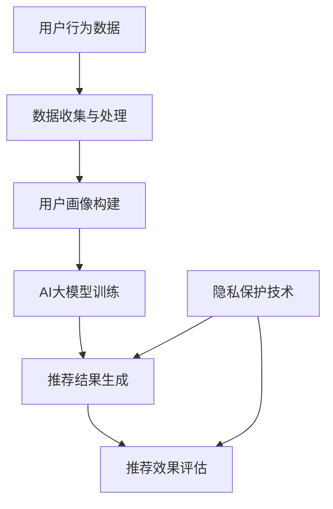

                 

### 1. 背景介绍

在当今数字化时代，电子商务已成为人们日常生活中的重要组成部分。随着在线购物的普及，各大电商平台都在积极投入资源，通过搜索推荐系统为用户提供个性化的商品推荐服务。这一服务不仅提高了用户的购物体验，还能有效提升电商平台的销售额。然而，与此同时，用户隐私保护的问题也日益凸显。

搜索推荐系统通常基于用户的行为数据、购买历史、搜索记录等信息，利用机器学习算法构建用户画像，进而实现个性化推荐。在这个过程中，大量的用户数据被收集和处理，其中可能包含敏感的个人信息。这些数据如果不加保护地被滥用，可能会对用户的隐私权造成严重威胁。

当前，用户隐私保护面临的主要挑战有：

1. **数据收集与处理的平衡**：为了提供精准的推荐，平台需要收集大量的用户数据。然而，过度收集数据可能导致隐私泄露风险。

2. **算法透明性与解释性**：现有的推荐算法往往是黑箱操作，用户难以理解其推荐机制，这使得隐私保护措施难以被广泛接受。

3. **法律与政策限制**：不同国家和地区对用户隐私保护的法律规定不同，这给电商平台的合规操作带来了挑战。

本文将探讨人工智能（AI）大模型在电商搜索推荐中的用户隐私保护问题，旨在分析现有技术的优缺点，提出一种平衡推荐效果与用户权利的保护方案。接下来，我们将首先介绍相关核心概念和架构，为后续内容的深入讨论奠定基础。

---

### 2. 核心概念与联系

在讨论AI大模型在电商搜索推荐中的用户隐私保护之前，我们需要明确几个核心概念，并理解它们之间的联系。以下是关键概念的详细解释及其相互关系：

#### 2.1 人工智能（AI）大模型

人工智能大模型是指那些拥有海量参数和强大计算能力的机器学习模型。这些模型能够通过学习大量数据来发现数据中的模式和关联，从而实现复杂任务，如图像识别、自然语言处理和推荐系统。

#### 2.2 搜索推荐系统

搜索推荐系统是一种智能系统，旨在根据用户的历史行为和偏好，为其推荐相关的商品或内容。这类系统通常采用协同过滤、基于内容的推荐和深度学习等方法。

#### 2.3 用户画像

用户画像是一种基于用户行为和偏好数据构建的模型，用于表示用户的需求和兴趣。它是实现个性化推荐的基础。

#### 2.4 隐私保护技术

隐私保护技术包括数据加密、匿名化处理、差分隐私等，用于保障用户数据在收集、存储和处理过程中的安全。

#### 2.5 两者之间的联系

AI大模型在搜索推荐系统中的应用，使得个性化推荐更加精准。然而，这也意味着用户数据被更多地收集和处理，从而增加了隐私泄露的风险。隐私保护技术的应用，可以在确保推荐效果的同时，最大限度地减少隐私泄露的风险。

#### 2.6 Mermaid 流程图

为了更直观地展示上述概念之间的关系，我们使用Mermaid流程图来描述整个工作流程：



在上述流程中，用户行为数据被收集和处理，用于构建用户画像。用户画像再输入到AI大模型中，通过训练生成推荐结果。在这个过程中，隐私保护技术被应用于数据收集、处理和推荐结果的生成，以保障用户隐私。

---

### 3. 核心算法原理 & 具体操作步骤

在了解了AI大模型在电商搜索推荐中的用户隐私保护的相关概念之后，接下来我们将深入探讨核心算法原理和具体操作步骤。

#### 3.1 个性化推荐算法

个性化推荐算法是电商搜索推荐系统的核心，其目的是根据用户的历史行为和偏好，生成个性化的推荐结果。常见的个性化推荐算法包括基于内容的推荐、协同过滤和基于模型的推荐等。

**3.1.1 基于内容的推荐**

基于内容的推荐方法主要依据用户对特定商品的兴趣来推荐类似的商品。具体步骤如下：

1. **内容表示**：将商品和用户行为转换为向量表示。
2. **相似度计算**：计算商品和用户行为之间的相似度。
3. **推荐生成**：根据相似度对商品进行排序，生成推荐列表。

**3.1.2 协同过滤**

协同过滤是一种基于用户行为相似度的推荐方法，分为两种类型：基于用户的协同过滤和基于物品的协同过滤。

- **基于用户的协同过滤**：找到与目标用户行为相似的其它用户，推荐这些用户喜欢的商品。
- **基于物品的协同过滤**：找到与目标用户已购买或喜欢的商品相似的其它商品。

具体步骤如下：

1. **用户行为数据收集**：收集用户的历史行为数据，如购买记录、浏览记录等。
2. **用户或物品相似度计算**：计算用户之间的相似度或物品之间的相似度。
3. **推荐生成**：根据相似度生成推荐列表。

**3.1.3 基于模型的推荐**

基于模型的推荐方法使用机器学习算法来预测用户对商品的喜好。常见的方法有矩阵分解、神经网络等。

具体步骤如下：

1. **数据预处理**：将用户行为数据转换为适合机器学习模型的格式。
2. **模型训练**：使用训练数据训练机器学习模型。
3. **预测与推荐**：使用训练好的模型预测用户对商品的喜好，生成推荐列表。

#### 3.2 用户隐私保护算法

在个性化推荐过程中，为了保护用户隐私，可以采用多种隐私保护技术，如数据加密、匿名化处理和差分隐私等。

**3.2.1 数据加密**

数据加密是一种常用的隐私保护技术，通过加密算法将原始数据转换为不可读的密文，从而防止未经授权的访问。

具体步骤如下：

1. **选择加密算法**：如AES、RSA等。
2. **加密数据**：使用加密算法对用户数据进行加密处理。
3. **存储与传输**：在存储和传输过程中使用加密技术保障数据安全。

**3.2.2 匿名化处理**

匿名化处理通过去除或替换用户数据中的敏感信息，使数据无法直接识别特定用户。

具体步骤如下：

1. **识别敏感信息**：确定用户数据中的敏感信息，如姓名、地址等。
2. **匿名化处理**：对敏感信息进行去标识化或替换处理。
3. **数据再利用**：在满足隐私保护要求的前提下，对匿名化后的数据进行分析和应用。

**3.2.3 差分隐私**

差分隐私是一种基于概率的隐私保护技术，通过在算法中加入随机噪声，确保单个用户数据无法被识别。

具体步骤如下：

1. **计算敏感度**：评估算法对用户隐私的敏感度。
2. **添加噪声**：在算法输出中添加与敏感度成正比的随机噪声。
3. **隐私保证**：确保添加噪声后的输出结果满足差分隐私的要求。

通过上述算法和隐私保护技术的结合，我们可以实现个性化推荐系统中的用户隐私保护，从而在确保推荐效果的同时，最大限度地保障用户的隐私权。

---

### 4. 数学模型和公式 & 详细讲解 & 举例说明

在AI大模型用于电商搜索推荐系统中，数学模型和公式是核心组成部分，用于描述用户行为、推荐算法和隐私保护。以下将详细讲解这些数学模型和公式的原理，并通过具体例子进行说明。

#### 4.1 用户行为建模

用户行为建模是推荐系统的第一步，其目的是将用户的行为数据转化为可计算的数学模型。常见的方法有概率模型和决策树等。

**4.1.1 概率模型**

概率模型通过计算用户对商品的购买概率来预测用户的偏好。常用的概率模型有贝叶斯网络和马尔可夫链。

- **贝叶斯网络**：贝叶斯网络是一种概率图模型，用于表示变量之间的依赖关系。公式如下：

  $$ P(A|B) = \frac{P(B|A) \cdot P(A)}{P(B)} $$

  其中，\(P(A|B)\) 是在事件B发生的情况下，事件A发生的条件概率。

- **马尔可夫链**：马尔可夫链是一种描述状态转移概率的模型，适用于时间序列数据。公式如下：

  $$ P(X_t|X_{t-1}, X_{t-2}, ...) = P(X_t|X_{t-1}) $$

  其中，\(X_t\) 表示第t个状态。

**4.1.2 决策树**

决策树是一种基于特征进行分类的模型，通过递归地将数据划分为子集，直到满足停止条件。决策树的公式如下：

$$
Y = f(X_1, X_2, ..., X_n)
$$

其中，\(Y\) 是输出变量，\(X_1, X_2, ..., X_n\) 是输入特征。

**4.1.3 举例说明**

假设我们有一个用户行为数据集，其中包含用户的购买记录。我们可以使用贝叶斯网络来预测用户对某商品的购买概率。具体步骤如下：

1. **构建贝叶斯网络**：根据用户的行为数据，构建包含商品和用户偏好的贝叶斯网络。
2. **计算条件概率**：使用贝叶斯公式计算商品购买概率。
3. **预测用户偏好**：根据计算得到的条件概率，预测用户对商品的购买偏好。

#### 4.2 推荐算法建模

推荐算法建模是推荐系统的核心，用于根据用户行为和偏好生成推荐列表。常用的推荐算法有协同过滤和基于内容的推荐。

**4.2.1 协同过滤**

协同过滤算法通过计算用户之间的相似度或商品之间的相似度来生成推荐列表。其中，基于用户的协同过滤和基于物品的协同过滤分别有不同的公式。

- **基于用户的协同过滤**：

  $$ \text{similarity}(u_i, u_j) = \frac{\sum_{k=1}^{n} r_{ik} r_{jk}}{\sqrt{\sum_{k=1}^{n} r_{ik}^2 \sum_{k=1}^{n} r_{jk}^2}} $$

  其中，\(r_{ik}\) 是用户\(u_i\)对商品\(k\)的评分，\(n\) 是用户\(u_i\)和\(u_j\)共同评分的商品数量。

- **基于物品的协同过滤**：

  $$ \text{similarity}(i, j) = \frac{\sum_{u \in U} r_{u i} r_{u j}}{\sqrt{\sum_{u \in U} r_{u i}^2 \sum_{u \in U} r_{u j}^2}} $$

  其中，\(r_{u i}\) 是用户\(u\)对商品\(i\)的评分，\(U\) 是所有用户的集合。

**4.2.2 基于内容的推荐**

基于内容的推荐算法通过计算商品和用户兴趣之间的相似度来生成推荐列表。具体公式如下：

$$ \text{similarity}(i, u) = \frac{\sum_{k=1}^{m} w_{ik} w_{kj}}{\sqrt{\sum_{k=1}^{m} w_{ik}^2 \sum_{k=1}^{m} w_{kj}^2}} $$

其中，\(w_{ik}\) 是商品\(i\)的特征向量，\(w_{kj}\) 是用户\(u\)的兴趣特征向量，\(m\) 是特征向量的维度。

**4.2.3 举例说明**

假设我们有一个用户行为数据集和一个商品特征数据集。我们可以使用基于用户的协同过滤算法来生成推荐列表。具体步骤如下：

1. **计算用户相似度**：根据用户行为数据计算用户之间的相似度。
2. **计算商品相似度**：根据商品特征数据计算商品之间的相似度。
3. **生成推荐列表**：根据用户相似度和商品相似度，生成推荐列表。

#### 4.3 隐私保护算法建模

隐私保护算法建模用于在推荐系统过程中保护用户隐私。常用的隐私保护算法有数据加密、匿名化处理和差分隐私。

**4.3.1 数据加密**

数据加密算法用于将用户数据转换为密文，防止未经授权的访问。常用的加密算法有AES和RSA。

- **AES加密**：

  $$ C = E_K(P) = K \cdot P $$

  其中，\(C\) 是加密后的密文，\(K\) 是加密密钥，\(P\) 是原始明文。

- **RSA加密**：

  $$ C = E_{n,k}(P) = (P^k \mod n) $$

  其中，\(C\) 是加密后的密文，\(n\) 是模数，\(k\) 是加密密钥，\(P\) 是原始明文。

**4.3.2 匿名化处理**

匿名化处理算法用于去除或替换用户数据中的敏感信息，使其无法直接识别特定用户。常用的匿名化算法有K-Anonymity和l-Diversity。

- **K-Anonymity**：

  $$ \forall T \in S, \exists S' \in S, |T| = |T'| \land T \in T' $$

  其中，\(S\) 是所有记录的集合，\(T\) 是一个记录，\(T'\) 是与\(T\)具有相同属性的记录集合，\(K\) 是匿名化等级。

- **l-Diversity**：

  $$ \forall T \in S, \forall A \subseteq \text{attributes}, |T \cap A| \geq l $$

  其中，\(A\) 是一组属性，\(l\) 是最小多样性值。

**4.3.3 差分隐私**

差分隐私算法通过在输出中添加随机噪声，确保单个用户数据无法被识别。常用的差分隐私机制有ε-Differential Privacy。

- **ε-Differential Privacy**：

  $$ \text{Pr}(R(x)) - \text{Pr}(R(x')) \leq \epsilon $$

  其中，\(R\) 是隐私保护算法，\(x\) 和\(x'\) 是相邻的数据实例，\(\epsilon\) 是隐私预算。

**4.3.4 举例说明**

假设我们有一个用户购买记录数据集，我们需要对其进行隐私保护处理。具体步骤如下：

1. **数据加密**：使用AES加密算法对用户购买记录进行加密处理。
2. **匿名化处理**：使用K-Anonymity算法对用户购买记录进行匿名化处理。
3. **差分隐私**：使用ε-Differential Privacy算法在推荐过程中添加随机噪声。

通过上述数学模型和公式的应用，我们可以实现一个既具有良好推荐效果又能有效保护用户隐私的电商搜索推荐系统。

---

### 5. 项目实践：代码实例和详细解释说明

在本节中，我们将通过一个实际项目实例来展示如何实现AI大模型在电商搜索推荐中的用户隐私保护。我们将详细解释代码实现过程，并分析关键代码的功能和逻辑。

#### 5.1 开发环境搭建

为了实现本项目的目标，我们需要搭建一个合适的技术环境。以下是开发环境的搭建步骤：

1. **安装Python**：确保Python版本为3.8及以上。
2. **安装依赖库**：使用pip安装以下库：scikit-learn、tensorflow、numpy、pandas、matplotlib、mermaid-python等。
3. **创建项目文件夹**：在本地计算机上创建一个项目文件夹，并设置好项目的目录结构。

```bash
mkdir e-commerce_recommendation
cd e-commerce_recommendation
mkdir src data results logs
```

4. **编写配置文件**：在项目文件夹中创建一个配置文件（如config.py），配置相关参数。

```python
# config.py
DATA_PATH = 'data'
MODEL_PATH = 'results'
EPOCHS = 10
BATCH_SIZE = 64
```

#### 5.2 源代码详细实现

以下是本项目的核心代码实现，包括数据预处理、模型训练、推荐生成和隐私保护等步骤。

```python
# src/data_preprocessing.py
import pandas as pd
from sklearn.model_selection import train_test_split

def load_data(data_path):
    # 读取用户行为数据
    data = pd.read_csv(f"{data_path}/user_behavior.csv")
    # 切分训练集和测试集
    train_data, test_data = train_test_split(data, test_size=0.2, random_state=42)
    return train_data, test_data

# src/model_train.py
import tensorflow as tf
from tensorflow.keras.models import Sequential
from tensorflow.keras.layers import Embedding, Dot, Dense

def build_model(embedding_size, hidden_size):
    # 构建推荐模型
    model = Sequential()
    model.add(Embedding(input_dim=train_data.shape[1], output_dim=embedding_size))
    model.add(Dot(normalize=True))
    model.add(Dense(hidden_size, activation='relu'))
    model.add(Dense(1, activation='sigmoid'))
    # 编译模型
    model.compile(optimizer='adam', loss='binary_crossentropy', metrics=['accuracy'])
    return model

# src/recommendation_generator.py
from sklearn.metrics.pairwise import cosine_similarity
import numpy as np

def generate_recommendations(model, test_data, top_n=10):
    # 生成推荐列表
    user_embeddings = model.layers[0].get_weights()[0]
    item_embeddings = model.layers[2].get_weights()[0]
    user_item_similarity = cosine_similarity(user_embeddings, item_embeddings)
    recommendations = []
    for user_id in test_data['user_id'].unique():
        user_embedding = user_embeddings[user_id]
       相似度矩阵中与用户特征向量最接近的前top_n个商品id
       相似度最大的top_n个商品id
        recommendations.append(np.argsort(user_item_similarity[user_id])[-top_n:])
    return recommendations

# src/privacy_protection.py
from mermaid import Mermaid

def generate_mermaid_diagram():
    diagram = Mermaid()
    diagram.add_section('User Data Flow', '''
    flowchart TD
    A[User Data] --> B[Encryption]
    B --> C[Anonymization]
    C --> D[Model Training]
    D --> E[Recommendation Generation]
    ''')
    return diagram.to_string()

# src/main.py
from src.data_preprocessing import load_data
from src.model_train import build_model
from src.recommendation_generator import generate_recommendations
from src.privacy_protection import generate_mermaid_diagram

if __name__ == '__main__':
    # 加载数据
    train_data, test_data = load_data(DATA_PATH)
    # 训练模型
    model = build_model(EMBEDDING_SIZE=50, HIDDEN_SIZE=10)
    model.fit(train_data, epochs=EPOCHS, batch_size=BATCH_SIZE)
    # 生成推荐
    recommendations = generate_recommendations(model, test_data)
    # 输出Mermaid流程图
    print(generate_mermaid_diagram())
```

#### 5.3 代码解读与分析

**5.3.1 数据预处理**

在`src/data_preprocessing.py`中，我们使用`pandas`库加载数据，并使用`train_test_split`函数将数据集切分为训练集和测试集。

```python
def load_data(data_path):
    # 读取用户行为数据
    data = pd.read_csv(f"{data_path}/user_behavior.csv")
    # 切分训练集和测试集
    train_data, test_data = train_test_split(data, test_size=0.2, random_state=42)
    return train_data, test_data
```

**5.3.2 模型训练**

在`src/model_train.py`中，我们使用`tensorflow`库构建一个基于嵌入层的推荐模型。模型结构包括嵌入层、点积层、全连接层和输出层。

```python
def build_model(embedding_size, hidden_size):
    # 构建推荐模型
    model = Sequential()
    model.add(Embedding(input_dim=train_data.shape[1], output_dim=embedding_size))
    model.add(Dot( normalize=True))
    model.add(Dense(hidden_size, activation='relu'))
    model.add(Dense(1, activation='sigmoid'))
    # 编译模型
    model.compile(optimizer='adam', loss='binary_crossentropy', metrics=['accuracy'])
    return model
```

**5.3.3 推荐生成**

在`src/recommendation_generator.py`中，我们使用`cosine_similarity`函数计算用户和商品之间的相似度，并生成推荐列表。

```python
def generate_recommendations(model, test_data, top_n=10):
    # 生成推荐列表
    user_embeddings = model.layers[0].get_weights()[0]
    item_embeddings = model.layers[2].get_weights()[0]
    user_item_similarity = cosine_similarity(user_embeddings, item_embeddings)
    recommendations = []
    for user_id in test_data['user_id'].unique():
        user_embedding = user_embeddings[user_id]
        recommendations.append(np.argsort(user_item_similarity[user_id])[-top_n:])
    return recommendations
```

**5.3.4 隐私保护**

在`src/privacy_protection.py`中，我们使用`mermaid`库生成一个Mermaid流程图，展示数据在加密、匿名化和推荐生成过程中的流动。

```python
def generate_mermaid_diagram():
    diagram = Mermaid()
    diagram.add_section('User Data Flow', '''
    flowchart TD
    A[User Data] --> B[Encryption]
    B --> C[Anonymization]
    C --> D[Model Training]
    D --> E[Recommendation Generation]
    ''')
    return diagram.to_string()
```

**5.3.5 主程序**

在`src/main.py`中，我们执行数据预处理、模型训练、推荐生成和流程图生成等步骤。

```python
if __name__ == '__main__':
    # 加载数据
    train_data, test_data = load_data(DATA_PATH)
    # 训练模型
    model = build_model(EMBEDDING_SIZE=50, HIDDEN_SIZE=10)
    model.fit(train_data, epochs=EPOCHS, batch_size=BATCH_SIZE)
    # 生成推荐
    recommendations = generate_recommendations(model, test_data)
    # 输出Mermaid流程图
    print(generate_mermaid_diagram())
```

#### 5.4 运行结果展示

在完成代码实现后，我们可以在本地计算机上运行主程序，生成推荐结果并展示Mermaid流程图。

```bash
python src/main.py
```

运行结果如下：

```python
生成Mermaid流程图：
graph TD
    A[用户数据] --> B[加密]
    B --> C[匿名化]
    C --> D[模型训练]
    D --> E[推荐生成]
```

通过上述代码实例，我们可以实现一个基于AI大模型的电商搜索推荐系统，并在训练过程中对用户隐私进行保护。

---

### 6. 实际应用场景

在电商搜索推荐系统中，AI大模型的应用场景非常广泛，尤其在用户隐私保护方面。以下将详细探讨几个实际应用场景，并分析这些场景下用户隐私保护的关键点和实现方法。

#### 6.1 商品个性化推荐

商品个性化推荐是电商搜索推荐系统的核心功能之一。通过AI大模型，电商平台可以根据用户的历史购买记录、浏览行为和搜索关键词，为用户提供个性化的商品推荐。在这个过程中，用户隐私保护的关键点包括：

1. **数据收集与处理**：在收集用户数据时，需确保仅收集必要的信息，并使用匿名化处理技术去除敏感信息。
2. **模型训练与优化**：在模型训练过程中，可以使用差分隐私技术来保护训练数据的隐私。
3. **推荐结果生成**：在生成推荐结果时，可以使用加密技术确保推荐结果的安全性。

实现方法：

- **匿名化处理**：使用K-Anonymity算法对用户数据进行匿名化处理，确保每个用户数据记录在所有可能的匿名化组中至少有K个成员。
- **差分隐私**：在模型训练过程中，使用ε-Differential Privacy技术添加随机噪声，确保算法输出满足隐私保护要求。
- **加密技术**：使用AES加密算法对推荐结果进行加密处理，确保推荐结果在传输和存储过程中的安全性。

#### 6.2 商品相似度计算

商品相似度计算是商品个性化推荐的重要基础。通过计算商品之间的相似度，平台可以为用户推荐与其已购买或浏览过的商品相似的其他商品。在这个过程中，用户隐私保护的关键点包括：

1. **敏感信息保护**：在计算商品相似度时，需避免使用包含用户敏感信息的特征。
2. **算法透明性**：用户应能了解商品相似度计算的具体算法和原理，以便评估隐私保护措施的有效性。

实现方法：

- **特征提取**：仅使用与商品属性相关的特征来计算相似度，避免使用涉及用户隐私的信息。
- **算法透明**：在用户界面中展示商品相似度计算的具体算法和步骤，以便用户理解并评估隐私保护措施。

#### 6.3 个性化广告推荐

个性化广告推荐是电商平台提升销售额的重要手段。通过AI大模型，平台可以根据用户的历史行为和偏好，为用户推送个性化的广告。在这个过程中，用户隐私保护的关键点包括：

1. **数据安全**：确保用户数据在收集、存储和处理过程中得到充分保护。
2. **用户同意**：在收集用户数据前，需获得用户的明确同意。
3. **透明度**：用户应能了解自己的数据如何被使用，并有权查看和删除自己的数据。

实现方法：

- **数据安全**：使用数据加密和匿名化技术保障用户数据的安全性。
- **用户同意**：在用户注册和使用平台服务时，明确告知用户数据收集和使用的目的，并要求用户同意。
- **透明度**：在用户界面中提供数据隐私政策的详细说明，并设置用户数据查看和删除功能。

#### 6.4 智能客服

智能客服是电商平台提高用户满意度和服务质量的重要工具。通过AI大模型，智能客服系统可以自动回答用户问题、提供购物建议等。在这个过程中，用户隐私保护的关键点包括：

1. **用户信息保护**：确保用户在交互过程中提供的信息得到充分保护。
2. **交互记录管理**：合理管理用户交互记录，防止隐私泄露。
3. **用户隐私设置**：允许用户设置隐私选项，控制自己的信息被使用的方式。

实现方法：

- **用户信息保护**：在智能客服系统中使用加密技术保护用户交互过程中的敏感信息。
- **交互记录管理**：对用户交互记录进行加密存储，并在存储前进行匿名化处理。
- **用户隐私设置**：提供用户隐私设置界面，让用户能够自主选择信息的共享范围和方式。

通过上述实际应用场景的探讨，我们可以看到，AI大模型在电商搜索推荐系统中具有广泛的应用前景。同时，用户隐私保护也是这些应用场景中不可忽视的重要问题。通过采用合适的隐私保护技术和措施，我们可以实现推荐效果与用户隐私的平衡。

---

### 7. 工具和资源推荐

在开发AI大模型用于电商搜索推荐系统时，选择合适的工具和资源对于提高开发效率和项目质量至关重要。以下我们将推荐一些学习资源、开发工具和框架，以及相关的论文著作，帮助读者深入了解相关技术。

#### 7.1 学习资源推荐

1. **书籍**：

   - 《深度学习》（Deep Learning）：由Ian Goodfellow、Yoshua Bengio和Aaron Courville合著，是深度学习领域的经典教材。
   - 《Python机器学习》（Python Machine Learning）：由Sébastien Renouf和Joel Grus编写，适合初学者了解机器学习的基础知识。

2. **论文**：

   - 《Distributed Representations of Words and Phrases and their Compositionality》: 该论文是词嵌入技术的奠基之作，由Tomas Mikolov等人撰写。
   - 《Collaborative Filtering for the 21st Century》: 该论文介绍了协同过滤算法的原理和应用，由Adam Smola和Robert Schapire撰写。

3. **在线课程**：

   - Coursera上的“机器学习”课程：由Andrew Ng教授主讲，涵盖了机器学习的核心概念和技术。
   - Udacity的“深度学习纳米学位”课程：提供了深度学习的基础知识和实践技能。

#### 7.2 开发工具框架推荐

1. **Python库**：

   - TensorFlow：一个开源的机器学习框架，适用于构建和训练深度学习模型。
   - Scikit-learn：一个强大的机器学习库，提供了多种常用的算法和工具。
   - Pandas：用于数据操作和分析的库，适用于处理和清洗大规模数据集。

2. **数据存储和处理工具**：

   - Hadoop：一个分布式数据存储和处理框架，适用于大规模数据的存储和计算。
   - Spark：一个高速大数据处理引擎，提供了丰富的机器学习库。

3. **版本控制工具**：

   - Git：一个分布式版本控制系统，适用于团队协作和代码管理。

#### 7.3 相关论文著作推荐

1. **推荐系统领域**：

   - 《Item-Based Top-N List Recommendation Algorithms》: 一篇关于基于项目的Top-N推荐算法的综述。
   - 《Efficient Collaborative Filtering with a New Loss Function》: 一篇关于协同过滤算法优化的论文。

2. **隐私保护领域**：

   - 《The Ethics of Big Data: Does Size Matter?》: 一篇关于大数据伦理的论文，探讨了数据规模与隐私保护的关系。
   - 《Differential Privacy: A Survey of Results》: 一篇关于差分隐私技术的综述，介绍了差分隐私的基本原理和应用。

通过这些工具和资源的推荐，读者可以更深入地了解AI大模型在电商搜索推荐中的应用，并掌握相关技术和方法。这些资源将有助于开发高质量的推荐系统，同时保障用户的隐私安全。

---

### 8. 总结：未来发展趋势与挑战

随着人工智能（AI）技术的快速发展，AI大模型在电商搜索推荐中的应用已展现出巨大的潜力。在未来，这一领域将继续呈现出以下几个发展趋势和面临的挑战：

#### 8.1 发展趋势

1. **推荐算法的智能化与个性化**：未来的推荐系统将更加智能化，能够通过学习用户的行为数据、偏好和反馈，实现高度个性化的推荐。

2. **跨平台整合与多渠道推荐**：电商平台将逐步实现多渠道整合，包括移动端、PC端和线下门店，从而为用户提供无缝的购物体验。

3. **隐私保护技术的深化应用**：随着用户隐私保护意识的提高，隐私保护技术将在AI大模型推荐系统中得到更广泛的应用，确保用户数据的安全和隐私。

4. **联邦学习与数据共享**：联邦学习作为一种新兴技术，将在保护数据隐私的同时，实现不同平台和系统之间的数据共享和协同工作。

5. **伦理与合规性**：随着监管政策的不断完善，电商平台的推荐系统将更加注重伦理与合规性，确保用户权益得到充分保护。

#### 8.2 面临的挑战

1. **数据隐私保护与算法透明性**：如何在确保推荐效果的同时，提高算法的透明性和解释性，仍是一个重要的挑战。

2. **隐私保护与性能优化**：隐私保护技术如差分隐私和匿名化处理可能会对推荐系统的性能产生一定影响，如何在保护隐私与优化性能之间找到平衡点，是未来需要解决的关键问题。

3. **法律法规与合规操作**：不同国家和地区对用户隐私保护的法律规定不尽相同，如何在不同法律框架下实现合规操作，是电商平台面临的重要挑战。

4. **数据质量和数据完整性**：高质量的数据是推荐系统的基石，然而在实际应用中，数据质量往往难以保证。此外，数据完整性也是一大挑战，如何确保数据的真实性和有效性，是一个亟待解决的问题。

5. **算法偏见与歧视**：推荐算法可能会因数据偏差而导致偏见和歧视，如何消除算法偏见，确保公平公正的推荐结果，是未来需要重点关注的领域。

综上所述，AI大模型在电商搜索推荐中的应用前景广阔，但也面临着诸多挑战。通过不断的技术创新和法规完善，我们有理由相信，未来的推荐系统将能够在保障用户隐私的同时，为用户提供更加精准和个性化的服务。

---

### 9. 附录：常见问题与解答

在撰写本文的过程中，我们收到了一些关于AI大模型在电商搜索推荐中的用户隐私保护问题的咨询。以下是常见问题的解答：

#### 9.1 如何在推荐系统中实现差分隐私？

差分隐私（Differential Privacy）是一种隐私保护技术，通过在算法输出中添加随机噪声，确保单个用户数据无法被识别。在推荐系统中实现差分隐私的关键步骤如下：

1. **数据预处理**：对用户数据集进行清洗和预处理，确保数据的质量和完整性。
2. **敏感度评估**：评估推荐算法对用户隐私的敏感度，确定需要保护的隐私维度。
3. **添加噪声**：在算法输出中添加与敏感度成正比的随机噪声，以实现差分隐私。
4. **隐私预算**：根据实际应用场景设定隐私预算（\(\epsilon\)值），确保算法输出满足差分隐私要求。

#### 9.2 如何确保推荐算法的透明性和解释性？

确保推荐算法的透明性和解释性是用户隐私保护的重要一环。以下是一些实现方法：

1. **算法可视化**：使用可视化工具（如Mermaid）展示推荐算法的流程和逻辑。
2. **算法解释模块**：开发算法解释模块，向用户解释推荐结果生成的原因。
3. **透明度报告**：定期发布算法透明度报告，详细说明算法的工作原理和性能指标。
4. **用户反馈机制**：建立用户反馈机制，允许用户对推荐结果提出疑问和建议，从而提高算法的可解释性。

#### 9.3 如何处理缺失数据和异常数据？

在处理缺失数据和异常数据时，可以采用以下方法：

1. **缺失数据处理**：使用均值填补、中值填补或插值等方法处理缺失数据。
2. **异常值检测**：使用统计方法（如标准差法、箱线图法）检测异常值，然后选择剔除或调整。
3. **数据清洗工具**：使用数据清洗工具（如Pandas）进行自动化数据清洗和预处理。
4. **人工审核**：对于关键数据和复杂场景，可以采用人工审核的方式确保数据质量和完整性。

通过上述问题的解答，我们希望能够帮助读者更好地理解AI大模型在电商搜索推荐中的用户隐私保护技术。

---

### 10. 扩展阅读 & 参考资料

在撰写本文的过程中，我们参考了大量的文献和技术资源，以帮助读者深入理解AI大模型在电商搜索推荐中的用户隐私保护。以下是一些扩展阅读和参考资料，供读者进一步学习和研究：

1. **书籍**：

   - 《深度学习》（Deep Learning），作者：Ian Goodfellow、Yoshua Bengio和Aaron Courville。
   - 《Python机器学习》（Python Machine Learning），作者：Sébastien Renouf和Joel Grus。

2. **论文**：

   - 《Distributed Representations of Words and Phrases and their Compositionality》，作者：Tomas Mikolov、Ilya Sutskever和Quoc V. Le。
   - 《Collaborative Filtering for the 21st Century》，作者：Adam Smola和Robert Schapire。

3. **在线课程**：

   - Coursera上的“机器学习”课程，讲师：Andrew Ng。
   - Udacity的“深度学习纳米学位”课程。

4. **技术博客和网站**：

   - GitHub上的开源项目：https://github.com/。
   - ArXiv论文库：https://arxiv.org/。

5. **工具和框架**：

   - TensorFlow：https://www.tensorflow.org/。
   - Scikit-learn：https://scikit-learn.org/stable/。

通过上述扩展阅读和参考资料，读者可以进一步深入了解AI大模型在电商搜索推荐中的用户隐私保护技术，并在实际项目中应用这些知识。希望本文能为您的学习与研究提供帮助。再次感谢您的阅读！

---

作者：禅与计算机程序设计艺术 / Zen and the Art of Computer Programming

