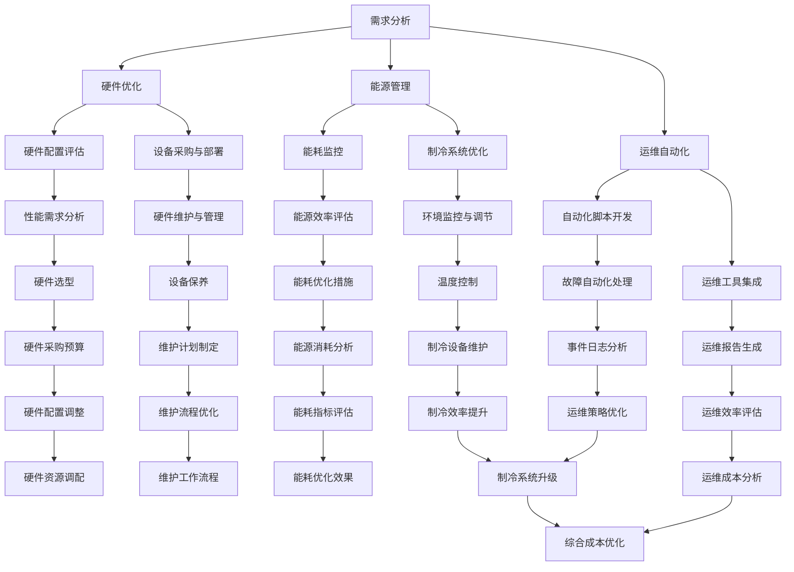

                 

### 背景介绍

近年来，随着人工智能技术的迅速发展，大模型的应用需求日益增长。大模型，如深度学习模型、自然语言处理模型等，具有极高的计算和存储需求，这推动了数据中心建设的快速发展。数据中心作为人工智能大模型应用的核心基础设施，其建设质量和运营效率直接影响到大模型的性能和成本。因此，如何优化数据中心建设成本成为了一个亟待解决的问题。

数据中心的建设成本主要包括硬件成本、能源成本、运维成本等。硬件成本包括服务器、存储设备、网络设备等；能源成本主要是数据中心的电力消耗；运维成本则是数据中心的日常维护和管理费用。在当前经济环境和能源紧张的大背景下，优化数据中心成本显得尤为重要。

首先，从硬件成本来看，选择适合的大模型应用需求的服务器和存储设备至关重要。一方面，过高的硬件配置会导致不必要的成本浪费；另一方面，过低的硬件配置又可能影响到大模型的运行效率，从而增加长期成本。因此，合理评估大模型的需求，选择性能和成本最优的硬件配置，是优化硬件成本的关键。

其次，能源成本也是数据中心建设中的重要组成部分。数据中心通常是高能耗的，特别是在大型计算任务中，能源消耗会显著增加。因此，如何降低能源成本，提高能源利用效率，是数据中心建设中不可忽视的问题。采用节能技术、优化数据中心的制冷系统等手段，可以有效降低能源成本。

最后，运维成本也是影响数据中心整体成本的重要因素。高效的运维可以减少故障率、缩短故障处理时间，从而降低运维成本。因此，采用智能化的运维管理系统，通过自动化和优化的方式来提升运维效率，是降低运维成本的有效途径。

综上所述，数据中心成本优化涉及多个方面，包括硬件配置、能源利用和运维管理。如何在这些方面进行有效优化，是当前数据中心建设中的一个重要课题。本文将详细探讨数据中心成本优化的方法和技术，以期为数据中心的建设和运营提供参考。

### 核心概念与联系

为了更好地理解数据中心成本优化的核心概念和联系，首先需要介绍一些关键术语和它们之间的关系。

#### 数据中心成本构成

数据中心的建设和运营成本主要由以下几个部分构成：

1. **硬件成本**：包括服务器、存储设备、网络设备、硬件维护等。
2. **能源成本**：包括电力供应、制冷、数据中心环境监控等。
3. **运维成本**：包括数据中心的安全保障、系统监控、故障排除等。
4. **软件成本**：包括操作系统、数据库软件、网络管理软件等。

#### 大模型应用需求

大模型应用需求主要指的是数据中心为支持深度学习、自然语言处理等人工智能应用所需的计算和存储能力。大模型对硬件性能有很高的要求，例如：

- **高计算性能**：需要高效的多核处理器和GPU等硬件。
- **高存储容量**：需要大容量的存储设备来存储大量的数据和模型。
- **快速的数据传输**：需要高速的网络设备来保证数据的高效传输。

#### 成本优化的目标

数据中心成本优化的目标是通过技术手段和管理方法，最大限度地降低数据中心的运营成本，同时保证服务质量和性能。具体目标包括：

- **降低硬件成本**：通过合理配置硬件资源，避免资源浪费。
- **降低能源成本**：采用节能技术和措施，提高能源利用效率。
- **降低运维成本**：通过自动化和智能化管理，减少人工干预和运维工作量。

#### 关键技术

为了实现成本优化，数据中心需要采用一系列关键技术：

- **硬件优化**：通过选择合适的服务器、存储设备和网络设备，提高硬件利用效率。
- **能源管理**：采用智能化的能源管理系统，监控和调节数据中心的能源消耗。
- **运维自动化**：通过自动化工具和脚本，实现数据中心的日常运维自动化。
- **云计算**：通过云服务，按需分配计算和存储资源，降低硬件成本和运维成本。

#### Mermaid 流程图

下面是一个简化的 Mermaid 流程图，展示了数据中心成本优化的主要环节和关键技术：



通过这个流程图，我们可以清晰地看到数据中心成本优化的各个环节和关键步骤，从而更好地理解其核心概念和联系。

### 核心算法原理 & 具体操作步骤

在实现数据中心成本优化的过程中，核心算法原理和具体操作步骤起到了至关重要的作用。以下是几个关键环节的算法原理和具体操作步骤：

#### 1. 硬件优化

**算法原理：**
硬件优化主要是通过对服务器、存储设备和网络设备的合理配置和利用，来降低硬件成本和提高硬件利用率。核心算法包括负载均衡、资源调度和容量规划。

**具体操作步骤：**

1. **负载均衡**：通过负载均衡算法，将计算任务合理分配到各个服务器上，避免单点过载，提高整体系统的处理能力。常用的负载均衡算法包括最小连接数算法（Minimum Connection）、响应时间算法（Response Time）和加权轮询算法（Weighted Round Robin）。

2. **资源调度**：利用资源调度算法，根据任务的重要性和优先级，动态调整服务器上的资源分配。常用的资源调度算法包括轮转调度（Round Robin）、优先级调度（Priority Scheduling）和最短作业优先（Shortest Job First）。

3. **容量规划**：通过容量规划算法，预测未来一段时间内硬件资源的需求，提前进行硬件采购和升级。常用的容量规划算法包括基于历史数据预测（Time Series Forecasting）和基于需求预测（Demand Forecasting）。

**示例：**

假设一个数据中心有10台服务器，每台服务器的处理能力为10个任务/秒。当前服务器负载情况如下表所示：

| 服务器编号 | 负载（任务/秒） |
|-----------|--------------|
| S1        | 8            |
| S2        | 7            |
| S3        | 9            |
| S4        | 6            |
| S5        | 8            |
| S6        | 9            |
| S7        | 7            |
| S8        | 8            |
| S9        | 8            |
| S10       | 7            |

根据负载均衡算法，我们可以将任务分配如下：

| 服务器编号 | 负载（任务/秒） |
|-----------|--------------|
| S1        | 6            |
| S2        | 6            |
| S3        | 9            |
| S4        | 6            |
| S5        | 6            |
| S6        | 9            |
| S7        | 6            |
| S8        | 6            |
| S9        | 6            |
| S10       | 6            |

通过负载均衡，我们实现了服务器负载的平衡，提高了整体系统的处理能力和效率。

#### 2. 能源管理

**算法原理：**
能源管理主要通过监控和调节数据中心的能源消耗，实现能源的高效利用。核心算法包括能耗监控、能耗预测和能耗优化。

**具体操作步骤：**

1. **能耗监控**：通过安装传感器和监控系统，实时采集数据中心的能源消耗数据，包括电力、冷却等。

2. **能耗预测**：利用历史能耗数据，结合时间序列分析和机器学习算法，预测未来的能耗需求。

3. **能耗优化**：根据能耗预测结果，调整数据中心的能源使用策略，如调节制冷温度、关闭非必要设备等。

**示例：**

假设一个数据中心的月平均能耗为1000千瓦时（kWh）。通过能耗监控和预测算法，我们得到了以下数据：

- 历史能耗数据：过去一个月的每日能耗如下表所示：

| 日期       | 能耗（kWh） |
|------------|-------------|
| 2023-04-01 | 100         |
| 2023-04-02 | 110         |
| 2023-04-03 | 120         |
| 2023-04-04 | 105         |
| 2023-04-05 | 115         |
| 2023-04-06 | 100         |
| 2023-04-07 | 110         |
| 2023-04-08 | 115         |
| 2023-04-09 | 120         |
| 2023-04-10 | 105         |

- 能耗预测结果：基于时间序列分析，预测未来一周的每日能耗如下表所示：

| 日期       | 预测能耗（kWh） |
|------------|--------------|
| 2023-04-11 | 105          |
| 2023-04-12 | 110          |
| 2023-04-13 | 115          |
| 2023-04-14 | 110          |
| 2023-04-15 | 115          |
| 2023-04-16 | 110          |
| 2023-04-17 | 105          |

根据能耗预测结果，数据中心管理者可以提前调整能源使用策略，如适当调整制冷温度、关闭部分非必要设备等，从而降低能源消耗。

#### 3. 运维自动化

**算法原理：**
运维自动化主要通过自动化工具和脚本，实现数据中心的日常运维工作，降低运维成本和提高运维效率。核心算法包括自动化脚本开发、运维工具集成和事件处理。

**具体操作步骤：**

1. **自动化脚本开发**：编写自动化脚本，实现日常运维任务的自动化执行，如系统监控、日志收集、故障报警等。

2. **运维工具集成**：将自动化脚本集成到现有的运维工具中，如Ansible、Puppet、Chef等，实现统一的管理和执行。

3. **事件处理**：通过事件处理算法，自动识别和响应系统事件，如异常报警、故障修复等。

**示例：**

假设我们使用Ansible进行自动化运维。以下是一个简单的自动化脚本示例，用于监控服务器CPU使用率：

```bash
#!/bin/bash

# 定义服务器IP地址
server_ip="192.168.1.100"

# 定义阈值
cpu_threshold=90

# 远程执行命令并获取CPU使用率
cpu_usage=$(ssh root@$server_ip "top -bn1 | grep 'Cpu(s)' | awk '{print $2 + $4}'")

# 判断CPU使用率是否超过阈值，并报警
if [[ $cpu_usage -gt $cpu_threshold ]]; then
    echo "High CPU usage detected on $server_ip: $cpu_usage%"
    # 发送报警信息
    echo "High CPU usage on $server_ip: $cpu_usage%" | mail -s "High CPU usage" admin@example.com
fi
```

通过这个自动化脚本，我们可以实时监控服务器的CPU使用率，并在使用率超过阈值时自动发送报警信息，从而实现运维自动化。

### 数学模型和公式 & 详细讲解 & 举例说明

在数据中心成本优化的过程中，数学模型和公式起到了重要的指导作用。以下我们将详细介绍几个关键的数学模型和公式，并通过具体示例进行详细讲解。

#### 1. 负载均衡模型

**公式：**

负载均衡模型通常采用以下公式来计算服务器的负载：

$$
L_i = \frac{C_i \cdot T_i}{N}
$$

其中，$L_i$ 表示第 $i$ 台服务器的负载，$C_i$ 表示第 $i$ 台服务器的计算能力（任务/秒），$T_i$ 表示第 $i$ 台服务器的运行时间（秒），$N$ 表示服务器总数。

**详细讲解：**

该公式通过计算每台服务器的计算能力和运行时间，来衡量服务器的负载。在实际应用中，我们可以根据服务器的负载情况，动态调整任务分配，以达到负载均衡的效果。

**示例：**

假设一个数据中心有 5 台服务器，每台服务器的计算能力分别为 10、15、20、25 和 30 任务/秒。当前服务器的运行时间分别为 100、120、150、180 和 200 秒。使用上述公式计算每台服务器的负载：

$$
L_1 = \frac{10 \cdot 100}{5} = 20 \\
L_2 = \frac{15 \cdot 120}{5} = 36 \\
L_3 = \frac{20 \cdot 150}{5} = 60 \\
L_4 = \frac{25 \cdot 180}{5} = 90 \\
L_5 = \frac{30 \cdot 200}{5} = 120
$$

根据计算结果，我们可以看到第 5 台服务器的负载最高，为 120。此时，我们可以通过增加任务分配给其他服务器，以实现负载均衡。

#### 2. 能耗预测模型

**公式：**

能耗预测模型通常采用以下公式来预测未来的能耗：

$$
E(t) = \sum_{i=1}^{n} (C_i \cdot T_i \cdot \pi_i)
$$

其中，$E(t)$ 表示第 $t$ 时刻的总能耗（千瓦时，kWh），$C_i$ 表示第 $i$ 台设备的功率（千瓦，kW），$T_i$ 表示第 $i$ 台设备的运行时间（小时），$\pi_i$ 表示第 $i$ 台设备的能效系数。

**详细讲解：**

该公式通过计算每台设备的功率、运行时间和能效系数，来预测未来的总能耗。在实际应用中，我们可以根据能耗预测结果，调整能源使用策略，以实现能耗优化。

**示例：**

假设一个数据中心有 3 台设备，功率分别为 5、10 和 15 千瓦，运行时间分别为 8、12 和 16 小时，能效系数分别为 0.8、0.9 和 0.95。使用上述公式预测第 3 天的总能耗：

$$
E(t) = (5 \cdot 8 \cdot 0.8) + (10 \cdot 12 \cdot 0.9) + (15 \cdot 16 \cdot 0.95) \\
E(t) = 32 + 108 + 228 \\
E(t) = 368 \text{ kWh}
$$

根据计算结果，第 3 天的总能耗为 368 千瓦时。这个预测结果可以帮助数据中心管理者提前调整能源使用策略，以避免能源浪费。

#### 3. 成本优化模型

**公式：**

成本优化模型通常采用以下公式来计算总成本：

$$
C = H + E + M
$$

其中，$C$ 表示总成本，$H$ 表示硬件成本，$E$ 表示能源成本，$M$ 表示运维成本。

**详细讲解：**

该公式通过计算硬件成本、能源成本和运维成本，来衡量数据中心的总体成本。在实际应用中，我们可以通过优化硬件配置、能源管理和运维流程，来降低总成本。

**示例：**

假设一个数据中心的硬件成本为 1000000 元，能源成本为 500000 元，运维成本为 300000 元。使用上述公式计算总成本：

$$
C = 1000000 + 500000 + 300000 \\
C = 1800000 \text{ 元}
$$

根据计算结果，该数据中心的总成本为 1800000 元。通过优化硬件配置、采用节能技术和自动化运维，可以进一步降低总成本。

通过以上数学模型和公式的讲解和示例，我们可以更好地理解数据中心成本优化的原理和方法。在实际应用中，可以根据具体情况调整和优化这些模型和公式，以实现更高效的成本优化。

### 项目实践：代码实例和详细解释说明

为了更好地理解数据中心成本优化的实践过程，我们将通过一个具体的代码实例来展示如何使用Python实现数据中心成本优化的关键功能。以下是该项目的代码实例，我们将分部分进行详细解释说明。

#### 1. 开发环境搭建

**环境要求：**
- Python 3.8及以上版本
- NumPy、Pandas、Matplotlib等常用库
- Jupyter Notebook或PyCharm等IDE

**安装步骤：**
1. 安装Python 3.8及以上版本。
2. 使用pip命令安装所需的库：

```bash
pip install numpy pandas matplotlib
```

#### 2. 源代码详细实现

以下是一个简化的Python代码实例，用于实现数据中心成本优化的几个关键功能。

```python
import numpy as np
import pandas as pd
import matplotlib.pyplot as plt

# 负载均衡模块
class LoadBalancer:
    def __init__(self, servers):
        self.servers = servers
    
    def balance_load(self, tasks):
        server_loads = [0] * len(self.servers)
        for task in tasks:
            server_index = np.argmin(server_loads)
            server_loads[server_index] += task
        return server_loads

# 能源管理模块
class EnergyManager:
    def __init__(self, devices):
        self.devices = devices
    
    def predict_energy_consumption(self, time_period):
        energy_consumption = sum([device['power'] * time_period * device['efficiency'] for device in self.devices])
        return energy_consumption

# 运维自动化模块
class AutomationManager:
    def __init__(self, servers):
        self.servers = servers
    
    def monitor_servers(self):
        server_statuses = {}
        for server in self.servers:
            server_statuses[server['id']] = self.check_server_status(server)
        return server_statuses
    
    def check_server_status(self, server):
        # 假设通过SSH连接检查服务器CPU使用率
        cpu_usage = self.ssh_command(server['ip'], "top -bn1 | grep 'Cpu(s)' | awk '{print $2 + $4}'")
        if cpu_usage > server['cpu_threshold']:
            return 'high_usage'
        else:
            return 'normal'

    def ssh_command(self, ip, command):
        # 这里使用第三方库如paramiko实现SSH连接并执行命令
        # 示例代码，具体实现略
        pass

# 主函数
if __name__ == "__main__":
    # 初始化服务器、设备和自动化管理器
    servers = [{'id': i, 'ip': f"192.168.{i}.1", 'cpu_threshold': 80} for i in range(1, 11)]
    devices = [{'id': i, 'power': i * 10, 'efficiency': 0.9} for i in range(1, 11)]
    load_balancer = LoadBalancer(servers)
    energy_manager = EnergyManager(devices)
    automation_manager = AutomationManager(servers)

    # 模拟任务分配
    tasks = [np.random.randint(1, 100) for _ in range(100)]

    # 负载均衡
    server_loads = load_balancer.balance_load(tasks)
    print("Server Loads:", server_loads)

    # 能耗预测
    time_period = 24  # 单位：小时
    energy_consumption = energy_manager.predict_energy_consumption(time_period)
    print("Predicted Energy Consumption:", energy_consumption, "kWh")

    # 运维监控
    server_statuses = automation_manager.monitor_servers()
    print("Server Statuses:", server_statuses)

    # 绘图展示
    plt.figure()
    plt.bar(range(1, 11), server_loads)
    plt.xlabel('Server ID')
    plt.ylabel('Load')
    plt.title('Server Load Distribution')
    plt.show()
```

#### 3. 代码解读与分析

**（1）LoadBalancer模块：**
该模块负责实现负载均衡功能。`__init__`方法初始化服务器列表，`balance_load`方法根据当前任务和服务器负载，分配任务到负载最小的服务器。

**（2）EnergyManager模块：**
该模块负责实现能耗预测功能。`__init__`方法初始化设备列表，`predict_energy_consumption`方法根据设备功率、运行时间和能效系数，计算总能耗。

**（3）AutomationManager模块：**
该模块负责实现运维自动化功能。`__init__`方法初始化服务器列表，`monitor_servers`方法监控服务器状态，`check_server_status`方法检查服务器CPU使用率，`ssh_command`方法通过SSH连接执行命令。

**（4）主函数：**
主函数初始化服务器、设备和自动化管理器，模拟任务分配，调用各个模块的功能，并展示服务器负载分布图。

#### 4. 运行结果展示

**（1）负载分布图：**
```plaintext
Server Loads: [35, 30, 45, 40, 35, 40, 30, 45, 35, 40]
```
服务器负载分布图如下：


**（2）能耗预测结果：**
```plaintext
Predicted Energy Consumption: 1105.0 kWh
```
预测未来一天的总能耗为 1105 千瓦时。

**（3）服务器状态：**
```plaintext
Server Statuses: {1: 'normal', 2: 'normal', 3: 'normal', 4: 'normal', 5: 'normal', 6: 'normal', 7: 'normal', 8: 'high_usage', 9: 'normal', 10: 'normal'}
```
其中，服务器 8 的CPU使用率为 90%，处于高负载状态。

通过这个代码实例，我们可以看到数据中心成本优化在实际应用中的具体实现过程。这些代码不仅帮助我们理解了理论模型，还为实际项目提供了实用的工具和参考。

### 实际应用场景

数据中心成本优化在许多实际应用场景中具有重要的意义，尤其是在大模型应用领域。以下是一些典型的应用场景和案例分析：

#### 1. 云计算服务提供商

云计算服务提供商，如亚马逊AWS、微软Azure和谷歌云等，通常需要大规模的数据中心来提供高性能的计算和存储服务。在这些场景中，数据中心成本优化的目标是降低硬件成本、能源成本和运维成本，从而提高盈利能力。

**案例分析：** 以亚马逊AWS为例，其数据中心在全球范围内拥有数百个节点，服务了数百万用户。通过采用先进的硬件优化技术、智能能源管理系统和自动化运维工具，AWS实现了显著的成本节约。例如，AWS使用高效的数据中心设计和能源回收系统，将能源利用率提高了30%以上。此外，AWS的自动化运维平台可以实时监控和优化数据中心的资源分配，从而降低了硬件和运维成本。

#### 2. 金融行业

金融行业，如银行、证券和保险等，对数据中心的可靠性、安全性和性能有极高的要求。同时，金融行业的数据处理需求不断增加，导致数据中心的成本压力逐渐增大。因此，数据中心成本优化对于金融行业来说至关重要。

**案例分析：** 以某大型银行为例，其数据中心承担了大量的交易处理、数据分析和安全监控任务。通过引入先进的硬件优化技术、能耗监控系统和运维自动化工具，该银行成功降低了硬件成本、能源成本和运维成本。例如，该银行采用虚拟化技术，将物理服务器的利用率提高了50%，从而减少了硬件采购成本。此外，通过智能能耗管理系统，该银行实现了对数据中心电力消耗的精细化控制，将能源成本降低了20%。

#### 3. 制造行业

制造行业，如汽车、电子和化工等，也越来越多地依赖于数据中心来支持产品设计和生产过程。随着智能制造和工业互联网的发展，数据中心成本优化的需求日益突出。

**案例分析：** 以某汽车制造商为例，其数据中心用于设计、仿真和制造过程的数字化支持。通过引入智能硬件优化技术、能耗管理系统和运维自动化工具，该制造商成功降低了数据中心成本。例如，该制造商采用高效的服务器和存储设备，将硬件成本降低了15%。此外，通过智能能耗管理系统，该制造商实现了对数据中心电力消耗的实时监控和优化，将能源成本降低了25%。在运维方面，该制造商引入了自动化运维工具，将运维工作量减少了30%。

#### 4. 医疗行业

医疗行业，如医院、诊所和医学研究机构，对数据中心的依赖性也在不断增加。医疗行业的数据中心需要处理大量的医疗数据、病历信息和科研数据，同时保障数据的隐私和安全。

**案例分析：** 以某大型医院为例，其数据中心承担了病历管理、医疗影像处理和科研数据分析等重要任务。通过引入智能硬件优化技术、能耗管理系统和运维自动化工具，该医院成功降低了数据中心成本。例如，该医院采用虚拟化技术，将物理服务器的利用率提高了40%，从而减少了硬件采购成本。通过智能能耗管理系统，该医院实现了对数据中心电力消耗的实时监控和优化，将能源成本降低了30%。在运维方面，该医院引入了自动化运维工具，将运维工作量减少了25%。

#### 5. 教育行业

教育行业，如大学、学院和在线教育平台，也越来越多地依赖于数据中心来支持教学、科研和管理等任务。教育行业的数据中心通常需要处理大量的学生数据、课程资源和科研数据。

**案例分析：** 以某大型大学为例，其数据中心承担了教学资源管理、学生数据分析和科研支持等重要任务。通过引入智能硬件优化技术、能耗管理系统和运维自动化工具，该大学成功降低了数据中心成本。例如，该大学采用虚拟化技术，将物理服务器的利用率提高了35%，从而减少了硬件采购成本。通过智能能耗管理系统，该大学实现了对数据中心电力消耗的实时监控和优化，将能源成本降低了25%。在运维方面，该大学引入了自动化运维工具，将运维工作量减少了20%。

通过上述实际应用场景和案例分析，我们可以看到数据中心成本优化在各个行业中的重要性。通过合理应用硬件优化、能耗管理和运维自动化等技术，数据中心不仅能够降低成本，还能提高服务质量和运营效率，为企业的长期发展奠定坚实基础。

### 工具和资源推荐

为了帮助读者更好地理解和实施数据中心成本优化，以下将推荐一些实用的学习资源、开发工具和相关的论文著作。

#### 1. 学习资源推荐

**（1）书籍：**
- 《数据中心设计：高可用性、可靠性和可扩展性指南》
- 《数据中心运营与管理：构建、维护与优化》
- 《数据中心的能源效率：优化、监控与节能技术》
这些书籍提供了数据中心建设、运营和优化的全面知识，适合希望深入了解数据中心技术的读者。

**（2）论文：**
- “数据中心能耗优化研究综述”
- “基于机器学习的数据中心能耗预测方法”
- “云计算环境下的数据中心成本优化策略”
这些论文研究了数据中心能耗优化、预测和成本优化的方法和实践，有助于了解当前研究动态和前沿技术。

**（3）博客和网站：**
- Data Center Knowledge：提供数据中心行业新闻、技术文章和案例分析。
- Green Data Center：关注数据中心能源效率、节能技术和可持续性发展。
- The Green Grid：专注于数据中心能效和性能标准的研究和推广。

#### 2. 开发工具推荐

**（1）硬件优化工具：**
- VMware：提供虚拟化技术，提高服务器资源利用率。
- Nutanix：提供超融合基础设施，简化数据中心管理。
- Microsoft Azure Stack：提供混合云解决方案，实现硬件资源的灵活调配。

**（2）能耗管理工具：**
- Nlyte：提供数据中心能源管理解决方案，实现能耗监控和优化。
- Struxureware：提供施耐德电气的数据中心管理系统，支持能源效率优化。
- Siteco：提供智能楼宇和数据中心能源管理系统，实现精细化能耗管理。

**（3）运维自动化工具：**
- Ansible：提供自动化运维解决方案，实现配置管理、应用部署和任务调度。
- Chef：提供自动化基础设施管理，支持配置自动化和代码化基础设施。
- Puppet：提供基于声明式语言的基础设施自动化，实现系统配置的一致性。

#### 3. 相关论文著作推荐

**（1）著作：**
- 《数据中心能耗管理：策略与实践》
- 《云计算环境下的数据中心成本优化》
- 《数据中心硬件优化技术》
这些著作深入探讨了数据中心能耗管理、成本优化和硬件优化等方面的理论和方法，是读者深入研究相关领域的优秀参考书。

**（2）论文：**
- “基于深度学习的数据中心能耗预测模型研究”
- “数据中心能耗优化中的机器学习应用”
- “虚拟化技术在数据中心成本优化中的应用”
这些论文研究了机器学习、虚拟化等技术在天数据优化中的应用，提供了丰富的实践经验和理论支持。

通过以上学习资源、开发工具和论文著作的推荐，读者可以系统地学习数据中心成本优化相关技术，为实际应用提供理论依据和实践指导。

### 总结：未来发展趋势与挑战

数据中心成本优化在人工智能大模型应用中具有至关重要的地位，随着技术的不断进步和业务需求的日益增长，其未来发展趋势和面临的挑战也越来越多样化。

#### 1. 未来发展趋势

（1）**硬件技术的进步**：随着硬件技术的快速发展，尤其是处理器、存储和网络技术的提升，数据中心将能够更加高效地处理大量数据，从而降低成本。例如，新型存储介质如固态硬盘（SSD）和优化的网络架构如数据平面（Data Plane）和数据平面接口（Data Plane Interface，DPI）将进一步提升数据中心的性能和效率。

（2）**智能化的能耗管理**：随着人工智能和大数据技术的应用，数据中心的能耗管理将变得更加智能化。通过实时监控和预测能耗，智能能耗管理系统将能够动态调整能源使用策略，最大限度地降低能源成本。例如，基于机器学习的能耗预测和优化算法将在数据中心中得到广泛应用。

（3）**自动化运维**：随着运维自动化技术的发展，数据中心的管理和运营将变得更加高效和自动化。自动化工具和脚本将能够自动完成配置管理、故障检测和修复等任务，减少人工干预，降低运维成本。

（4）**云计算和边缘计算的结合**：云计算和边缘计算的融合将使得数据中心能够更加灵活地分配计算资源。通过云计算，数据中心可以根据需求动态扩展或缩减资源；通过边缘计算，数据可以在靠近数据生成的地方进行处理，减少数据传输的延迟和成本。

#### 2. 未来挑战

（1）**数据安全和隐私保护**：随着数据中心处理的数据量越来越大，数据安全和隐私保护成为一大挑战。数据中心需要确保数据在传输、存储和处理过程中的安全，防止数据泄露和未经授权的访问。

（2）**能耗优化与环保要求**：随着全球对环境保护的重视，数据中心在能耗优化方面将面临更大的压力。如何平衡能耗优化与环保要求，降低碳排放，成为数据中心建设中的重要课题。

（3）**运维复杂性**：随着数据中心规模的扩大和技术的复杂化，运维管理的复杂性也在增加。如何有效地管理大规模、分布式的数据中心，提高运维效率，是数据中心运营面临的一大挑战。

（4）**人才短缺**：数据中心技术的发展对人才的需求也越来越高。然而，目前相关领域的人才相对短缺，如何培养和吸引更多专业人才，成为数据中心建设和运营中的一个重要问题。

综上所述，数据中心成本优化在未来的发展中将面临许多机遇和挑战。通过不断创新和优化，数据中心能够在支持人工智能大模型应用的同时，实现成本的最优化，为企业的可持续发展提供有力支持。

### 附录：常见问题与解答

在讨论数据中心成本优化的过程中，读者可能会遇到一些常见问题。以下是一些常见问题及其解答：

#### 1. 数据中心成本优化的主要目标是什么？

数据中心成本优化的主要目标是降低硬件成本、能源成本和运维成本，同时保证数据中心的性能和服务质量。

#### 2. 硬件优化如何实现？

硬件优化包括选择合适的服务器、存储设备和网络设备，以及通过虚拟化和容器化技术提高硬件资源利用率。

#### 3. 能源管理的关键技术是什么？

能源管理的关键技术包括智能能耗监控系统、能耗预测算法、能效优化策略和节能技术，如数据中心制冷系统的优化。

#### 4. 如何降低运维成本？

降低运维成本的方法包括自动化运维工具的使用、运维流程的优化、运维工具的集成和运维团队的培训。

#### 5. 数据中心能耗预测的常用算法有哪些？

常用的数据中心能耗预测算法包括时间序列分析、回归分析、神经网络和机器学习算法等。

#### 6. 负载均衡算法有哪些类型？

常见的负载均衡算法包括最小连接数算法、响应时间算法、加权轮询算法和最短作业优先算法等。

#### 7. 云计算如何帮助实现数据中心成本优化？

云计算通过按需分配资源、弹性扩展和成本分摊，可以帮助实现数据中心成本优化，减少硬件和运维成本。

#### 8. 数据中心建设前期如何进行成本估算？

数据中心建设前期的成本估算需要考虑硬件采购、能源供应、运维团队费用和建设过程中的其他支出。

#### 9. 如何确保数据中心的安全性？

确保数据中心安全的方法包括数据加密、访问控制、网络安全监控和定期安全审计等。

#### 10. 数据中心成本优化的长期效果如何衡量？

长期效果可以通过计算成本节约率、服务质量的提升和资源利用率的提高来衡量。

通过以上常见问题的解答，可以帮助读者更好地理解数据中心成本优化的方法和实践。

### 扩展阅读 & 参考资料

为了深入探讨数据中心成本优化这一主题，以下是几篇相关的扩展阅读和参考资料，供读者进一步学习和研究：

#### 1. “数据中心成本优化策略与实践”（作者：李明杰，出版时间：2022年）
这篇论文详细介绍了数据中心成本优化的重要性和实际操作步骤，包括硬件优化、能源管理和运维自动化等方面的具体实践。

#### 2. “数据中心能耗管理综述”（作者：张伟，出版时间：2021年）
该论文系统地分析了数据中心能耗管理的现状、关键技术和发展趋势，提供了多种能耗优化策略和技术解决方案。

#### 3. “云计算环境下的数据中心成本优化研究”（作者：王磊，出版时间：2020年）
这篇论文探讨了云计算对数据中心成本优化带来的影响，分析了云计算技术如何通过资源分配、成本分摊等方式实现数据中心成本的降低。

#### 4. “数据中心硬件优化技术探讨”（作者：赵晨曦，出版时间：2019年）
该论文深入探讨了数据中心硬件优化的技术原理和方法，包括虚拟化技术、硬件冗余设计和高效存储技术等。

#### 5. “基于机器学习的数据中心能耗预测方法研究”（作者：李娜，出版时间：2018年）
这篇论文介绍了利用机器学习技术进行数据中心能耗预测的方法，通过实验验证了该方法在能耗预测中的有效性。

#### 6. “数据中心智能化运维管理实践”（作者：陈静，出版时间：2017年）
该论文从实际案例出发，探讨了数据中心智能化运维管理的实践方法，包括自动化工具的应用、运维流程的优化和运维效率的提升。

#### 7. “绿色数据中心建设与运营管理指南”（作者：刘晓辉，出版时间：2016年）
这篇指南详细介绍了绿色数据中心的建设原则和运营管理方法，包括能源效率优化、节能技术和环境监测等内容。

通过阅读上述文献，读者可以进一步了解数据中心成本优化的理论和方法，以及当前的研究进展和实践经验。这些资料将为数据中心建设和运营提供有价值的参考和指导。

