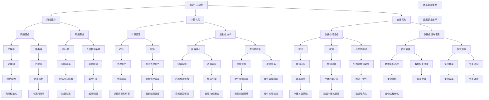

                 

### 背景介绍

#### 时代背景

随着人工智能（AI）技术的迅猛发展，大模型应用逐渐成为推动社会进步和产业变革的重要力量。特别是在数据中心领域，大模型的应用带来了前所未有的计算需求和数据存储需求。从早期的简单数据处理，到如今复杂的人工智能算法，数据中心的技术演进历程可谓波澜壮阔。

数据中心，作为现代信息技术基础设施的核心，承载了海量的数据存储、处理和分析任务。随着大模型应用的增长，数据中心面临着巨大的技术挑战。如何提高计算效率、降低能耗、保障数据安全和隐私，成为了数据中心建设的核心问题。

#### 数据中心建设的重要性

数据中心建设的重要性不言而喻。它不仅是企业信息化的重要支撑，也是国家数字经济的重要基石。具体来说，数据中心建设具有以下几个关键作用：

1. **数据存储与处理**：数据中心能够提供高效、可靠的数据存储和处理能力，支持各种复杂的数据分析和人工智能算法。
2. **资源整合与共享**：通过数据中心的建设，企业可以实现计算资源、存储资源和网络资源的集中管理，提高资源利用效率。
3. **业务连续性与灾难恢复**：数据中心的建设确保了业务的连续性和数据的安全，通过灾难恢复计划，可以在发生意外时迅速恢复服务。
4. **创新驱动**：数据中心为新兴技术的研发和试验提供了基础平台，推动了产业创新和技术进步。

#### 大模型应用对数据中心建设的影响

大模型应用对数据中心建设的影响深远。首先，大模型需要庞大的计算资源来支持训练和推理任务，这对数据中心的硬件设施提出了更高要求。其次，大模型的训练和推理过程产生了巨大的数据量，对数据中心的存储和处理能力提出了巨大挑战。此外，大模型在训练过程中需要大量的数据输入，这要求数据中心能够高效地进行数据传输和共享。

总的来说，大模型应用对数据中心建设提出了更高的要求，同时也为数据中心带来了新的机遇。如何在满足大模型应用需求的同时，实现高效、绿色、安全的数据中心建设，成为了当前的重要课题。

### 现状分析

当前，全球数据中心建设呈现出迅猛发展的态势。根据市场调研机构的数据显示，全球数据中心市场规模持续扩大，预计到2025年将达到数百亿美元。各大企业、科技公司纷纷加大对数据中心建设的投入，推动技术不断革新。

从技术水平来看，数据中心建设已经经历了几个重要的阶段。最初，数据中心主要是以物理服务器为主，随着虚拟化技术的普及，虚拟化数据中心成为主流。近年来，随着云计算、大数据和人工智能技术的发展，智能化数据中心逐渐成为趋势。这些技术的发展不仅提升了数据中心的计算能力和存储能力，还提高了数据中心的灵活性和可扩展性。

在硬件设施方面，高性能服务器、大数据存储设备和高速网络设备成为了数据中心的标配。尤其是针对大模型应用，企业需要配备高性能计算（HPC）服务器和专用GPU加速卡，以满足大模型训练和推理的需求。此外，为了提高数据中心的能源利用效率，越来越多的企业开始采用绿色数据中心解决方案，如高效制冷系统、太阳能和风能等可再生能源。

在软件系统方面，数据中心的管理和运维工具也日新月异。自动化管理平台、智能监控系统和运维自动化工具得到了广泛应用，提高了数据中心的运维效率和可靠性。同时，大数据分析和人工智能技术在数据中心中的应用也日益成熟，为数据中心的智能化运营提供了有力支持。

然而，数据中心建设仍面临诸多挑战。首先是计算能力和存储能力的不断提升带来的能耗问题。数据中心是耗电大户，如何降低能耗、实现绿色运营是当前的重要课题。其次是数据安全和隐私保护问题。大模型应用涉及大量的敏感数据，如何确保数据的安全和隐私成为了数据中心的重中之重。最后是技术更新换代带来的投资压力。数据中心技术的快速迭代要求企业持续进行技术投入和更新，这对企业的资金和技术实力提出了较高要求。

总的来说，数据中心建设正处于快速发展阶段，面临着巨大的机遇和挑战。在满足大模型应用需求的同时，实现高效、绿色、安全的数据中心建设，是当前和未来一段时间内的重要任务。

#### 数据中心建设的主要目标和挑战

数据中心建设的主要目标是提供高效、可靠、安全的计算和存储资源，以满足不断增长的数据处理需求。具体来说，主要包括以下几个方面：

1. **计算能力提升**：随着人工智能和大数据技术的发展，数据中心需要具备强大的计算能力，以支持复杂的数据处理和分析任务。特别是大模型训练和推理任务，对计算资源的需求极为庞大。
2. **存储容量扩展**：数据量的爆炸式增长对数据中心的存储容量提出了更高要求。数据中心需要能够扩展存储容量，以容纳越来越多的数据。
3. **数据传输效率**：高效的数据传输对于数据中心的运行至关重要。数据中心需要具备高速网络设备，以实现数据的快速传输和处理。
4. **能效优化**：数据中心的高能耗问题日益突出，优化能效成为数据中心建设的重要目标。通过采用高效制冷系统、能源管理系统等绿色技术，降低数据中心的能耗。
5. **数据安全与隐私保护**：随着数据量的增加，数据安全和隐私保护成为了数据中心建设的核心挑战。数据中心需要建立完善的安全体系，保障数据的机密性、完整性和可用性。
6. **运维管理**：高效、可靠的运维管理是数据中心稳定运行的关键。通过自动化管理平台、智能监控系统等工具，提高数据中心的运维效率和可靠性。

在实现这些目标的过程中，数据中心建设面临着诸多挑战：

1. **计算资源不足**：高性能计算资源的需求不断增加，但现有的计算资源可能无法满足大模型训练和推理的需求。如何合理配置和调度计算资源，成为数据中心建设的重要课题。
2. **数据存储压力**：海量数据的存储和处理带来了巨大的压力。如何优化存储架构，提高数据存取效率，成为数据中心建设的关键问题。
3. **能耗问题**：数据中心的高能耗问题日益突出，如何降低能耗、实现绿色运营是当前的重要挑战。高效制冷系统、能源管理系统等绿色技术的应用，对于解决能耗问题具有重要意义。
4. **数据安全与隐私**：随着数据量的增加，数据安全和隐私保护问题日益严重。如何建立完善的安全体系，防范数据泄露和攻击，是数据中心建设的重要任务。
5. **技术更新换代**：数据中心技术更新换代速度较快，如何应对技术变革，持续进行技术投入和更新，对于企业来说是一个巨大的挑战。

总的来说，数据中心建设是一个复杂而庞大的工程，需要综合考虑多个方面的需求和挑战。只有在充分了解需求、分析挑战的基础上，才能实现高效、可靠、安全的数据中心建设。

### 核心概念与联系

在深入探讨数据中心建设之前，我们需要了解一些核心概念和它们之间的联系。这些概念包括：数据中心架构、网络拓扑、计算节点、存储架构等。下面我们将通过一个详细的Mermaid流程图来展示这些核心概念及其之间的关联。



#### 数据中心架构

数据中心架构是数据中心建设的核心，它决定了数据中心的性能、可靠性和可扩展性。数据中心架构通常包括以下几个关键组成部分：

1. **计算节点**：计算节点是数据中心的核心，负责处理各种计算任务。计算节点通常包括服务器、虚拟机和容器等，通过这些计算资源，数据中心能够提供强大的计算能力。

2. **存储架构**：存储架构是数据中心的数据存储和管理系统。存储架构包括各种数据存储设备，如SSD、HDD和分布式存储系统，以及数据备份与恢复机制。

3. **网络拓扑**：网络拓扑是数据中心的通信结构，决定了数据在数据中心内部的传输路径。网络拓扑包括局域网、广域网、交换机和路由器等，通过这些网络设备，实现数据的高效传输和共享。

4. **网络设备**：网络设备是数据中心通信的核心，包括交换机、路由器、防火墙和入侵检测系统等。网络设备负责数据的转发、路由和安全管理。

5. **计算资源**：计算资源包括CPU、GPU和其他计算设备，它们是数据中心提供计算能力的硬件基础。高性能计算资源能够支持复杂的数据处理和分析任务。

6. **虚拟化技术**：虚拟化技术是数据中心实现高效资源管理和灵活部署的关键。虚拟化技术包括容器技术和虚拟机技术，通过虚拟化，数据中心能够实现计算资源和存储资源的动态分配和调度。

7. **自动化管理平台**：自动化管理平台是数据中心的智能运营工具，通过自动化管理平台，实现计算资源、存储资源和网络资源的集中管理和监控。

#### 网络拓扑

网络拓扑是数据中心内部网络结构的布局，决定了数据在数据中心内的传输路径和效率。常见的网络拓扑包括星型拓扑、环型拓扑和网状拓扑等。

1. **星型拓扑**：星型拓扑是一种集中式的网络结构，所有设备都连接到一个中心节点（如交换机）。这种拓扑结构简单、易于管理，但依赖于中心节点，一旦中心节点出现故障，整个网络可能会瘫痪。

2. **环型拓扑**：环型拓扑是一种闭合的网络结构，设备通过环路连接形成一个环。数据在环中按顺序传输，这种拓扑结构具有较好的冗余性和可靠性，但环中的故障检测和修复比较复杂。

3. **网状拓扑**：网状拓扑是一种分布式网络结构，设备之间相互连接，形成多个独立的数据传输路径。这种拓扑结构具有极高的冗余性和可靠性，但网络复杂度较高，管理和维护难度较大。

在网络拓扑中，网络设备如交换机和路由器起着至关重要的作用。交换机负责局域网内设备的连接和数据的转发，路由器负责不同网络之间的数据传输和路由选择。网络安全设备如防火墙和入侵检测系统则负责数据的安全防护，防止网络攻击和数据泄露。

#### 计算节点

计算节点是数据中心的计算核心，包括服务器、虚拟机和容器等。计算节点的主要功能是处理各种计算任务，如数据处理、数据分析、机器学习训练和推理等。

1. **服务器**：服务器是传统的计算节点，通常由高性能CPU、内存和硬盘组成。服务器能够提供强大的计算能力和存储能力，适用于大型数据处理任务。

2. **虚拟机**：虚拟机通过虚拟化技术将物理服务器虚拟化为多个逻辑服务器，每个虚拟机拥有独立的操作系统和计算资源。虚拟机具有较好的隔离性和灵活性，能够实现计算资源的动态分配和调度。

3. **容器**：容器是一种轻量级的虚拟化技术，通过容器引擎（如Docker）将应用程序及其依赖环境打包成一个独立的运行时环境。容器具有高效、灵活和易部署的特点，适用于快速开发和部署应用程序。

计算节点通过自动化管理平台进行集中管理和监控。自动化管理平台能够实现计算资源的动态分配、负载均衡和故障恢复，提高数据中心的运维效率和可靠性。

#### 存储架构

存储架构是数据中心的数据存储和管理系统，包括各种数据存储设备、存储网络和存储管理软件等。存储架构的主要目标是提供高效、可靠和可扩展的数据存储和管理能力。

1. **数据存储设备**：数据存储设备包括SSD（固态硬盘）、HDD（机械硬盘）和分布式存储设备等。SSD具有高速读写性能，适用于大数据处理和实时应用。HDD具有大容量存储优势，适用于低成本存储。分布式存储设备通过多个存储节点组成，实现数据的分布式存储和冗余备份，提高数据存储的可靠性和可扩展性。

2. **存储网络**：存储网络是连接存储设备和服务器之间的网络，通常采用SAN（存储区域网络）和NAS（网络附加存储）两种架构。SAN通过光纤通道或iSCSI协议实现高速数据传输，适用于高性能、高可靠性的存储需求。NAS通过以太网实现共享存储，适用于文件级数据存储和管理。

3. **存储管理软件**：存储管理软件负责数据存储的配置、监控和管理。常见的存储管理软件包括存储管理系统、备份软件和存储资源管理工具等。存储管理系统实现存储设备的自动化管理和资源调度，备份软件实现数据备份和恢复，存储资源管理工具实现存储资源的监控和优化。

#### 数据备份与恢复

数据备份与恢复是确保数据中心数据安全的重要手段。数据备份是将重要数据复制到其他存储设备或位置，以防止数据丢失或损坏。数据恢复是在数据丢失或损坏后，将备份的数据还原到原始位置。

1. **数据备份策略**：数据备份策略包括全备份、增量备份和差异备份等。全备份是对整个数据集进行备份，适用于初始备份或数据量较小的情况。增量备份只备份自上次备份后更改的数据，适用于频繁更改的数据。差异备份备份自上次全备份后更改的数据，适用于数据量较大但更改频率较低的情况。

2. **数据恢复步骤**：数据恢复包括以下步骤：首先检测数据丢失或损坏的原因；其次根据备份策略和备份文件，选择合适的恢复方法；最后将备份的数据还原到原始位置。数据恢复过程可能涉及数据修复和完整性检查，以确保恢复的数据完整和可用。

3. **备份频率**：备份频率取决于数据的重要性和更改频率。对于关键数据，建议采用每天或每周进行备份，确保数据的安全性和完整性。

4. **恢复时间**：恢复时间取决于数据量、备份方式和恢复策略。全备份通常需要较长的恢复时间，而增量备份和差异备份恢复时间较短。

通过合理的数据备份与恢复策略，可以确保数据中心数据的安全性和可靠性，降低数据丢失或损坏的风险。

### 核心算法原理 & 具体操作步骤

在数据中心建设中，核心算法的选择和具体操作步骤的制定至关重要。核心算法不仅决定了数据处理的效率和准确性，还直接影响数据中心的性能和可靠性。下面我们将详细介绍数据中心建设中的几个核心算法，包括分布式存储算法、负载均衡算法和故障恢复算法等，并解释其具体操作步骤。

#### 分布式存储算法

分布式存储算法是数据中心存储架构的核心，它通过将数据分散存储在多个节点上，提高了数据存储的可靠性和扩展性。以下是分布式存储算法的基本原理和具体操作步骤：

**1. 数据分割与分配**

- **数据分割**：将大文件分割成多个小块，通常是固定大小或者动态分割。这样可以便于数据在不同节点上的存储和管理。
- **数据分配**：根据节点的存储容量和处理能力，将分割后的数据块分配到不同的节点上。数据分配算法可以采用哈希散列、轮询或一致性哈希等方法。

**2. 数据复制**

- **副本管理**：为了提高数据可靠性，分布式存储系统通常将数据块复制到多个节点上。复制策略可以是线性复制（如三副本）或动态副本管理，根据数据的重要性和访问频率动态调整副本数量。

**3. 数据一致性**

- **一致性协议**：分布式存储系统采用一致性协议（如Paxos或Raft）来确保数据的一致性。这些协议通过多节点协作，实现数据的一致性写入和读取。

**4. 数据恢复**

- **故障检测与恢复**：当检测到节点故障时，分布式存储系统会自动从副本中恢复数据。数据恢复过程包括数据块的查找、复制和替换。

#### 负载均衡算法

负载均衡算法是数据中心网络架构中的重要组成部分，它通过合理分配计算任务，提高数据中心的资源利用率和整体性能。以下是负载均衡算法的基本原理和具体操作步骤：

**1. 负载监测**

- **资源监控**：监控系统实时监测数据中心的CPU利用率、内存使用率、网络带宽等资源指标。
- **负载评估**：根据监控数据，评估每个节点的负载情况，确定哪些节点需要分配更多任务。

**2. 负载分配**

- **静态分配**：通过静态配置文件或策略，将任务分配到负载较低的节点。
- **动态分配**：使用动态负载均衡算法，如轮询、最小连接数、响应时间等，根据实时负载情况动态调整任务分配。

**3. 负载均衡策略**

- **加权分配**：根据节点的处理能力、网络带宽和地理位置等因素，为每个节点分配不同的权重，实现更加公平的负载分配。
- **故障转移**：当某个节点发生故障时，自动将任务转移到其他健康节点，确保服务的连续性。

#### 故障恢复算法

故障恢复算法是确保数据中心稳定运行的关键技术，它通过检测、隔离和恢复故障节点，保障数据中心的正常运行。以下是故障恢复算法的基本原理和具体操作步骤：

**1. 故障检测**

- **心跳检测**：通过发送心跳信号，监控节点之间的连接状态。如果某个节点长时间未发送心跳信号，则认为该节点可能发生故障。
- **健康检查**：定期对节点进行健康检查，包括CPU负载、内存使用率、网络连接等，以检测潜在的故障。

**2. 故障隔离**

- **故障标记**：当检测到节点故障时，系统自动将该节点标记为故障节点，并停止向其分配新任务。
- **故障隔离**：通过网络分区、隔离故障节点，防止故障扩散，确保其他节点正常运行。

**3. 故障恢复**

- **自动恢复**：根据故障类型和恢复策略，系统自动执行故障恢复操作，如重启故障节点、重新分配任务等。
- **人工干预**：对于复杂的故障，需要人工介入，进行故障分析和处理。

通过上述核心算法的设计和实施，数据中心能够实现高效、可靠和可扩展的数据存储、处理和运维。这些算法不仅提高了数据中心的性能和稳定性，还为应对未来的技术挑战提供了坚实基础。

### 数学模型和公式 & 详细讲解 & 举例说明

在数据中心建设中，数学模型和公式发挥着重要作用，它们用于描述系统性能、资源分配和故障恢复等方面的计算。下面我们将详细讲解一些核心的数学模型和公式，并通过具体例子来说明它们的应用。

#### 负载均衡算法中的加权轮询算法

加权轮询算法是一种常见的负载均衡策略，它根据节点的处理能力和当前负载情况为每个节点分配不同的权重。以下是加权轮询算法的数学模型和公式：

**1. 权重计算公式**

设 \( W_i \) 为节点 \( i \) 的权重， \( C_i \) 为节点 \( i \) 的当前负载， \( C_{\text{max}} \) 为节点的最大负载。权重计算公式为：

\[ W_i = \frac{C_{\text{max}} - C_i}{C_{\text{max}}} \]

**2. 负载分配公式**

设 \( N \) 为节点总数， \( n \) 为当前需要分配的任务数。根据权重分配任务，公式为：

\[ \text{分配到节点 } i \text{ 的任务数 } T_i = \left\lfloor \frac{n \times W_i}{\sum_{j=1}^{N} W_j} \right\rfloor \]

**例子：**

假设数据中心有4个节点，处理能力分别为 \( C_1 = 100 \)，\( C_2 = 150 \)，\( C_3 = 200 \)，\( C_4 = 250 \)。当前需要分配20个任务。

首先计算权重：
\[ W_1 = \frac{200 - 100}{200} = 0.5 \]
\[ W_2 = \frac{200 - 150}{200} = 0.25 \]
\[ W_3 = \frac{200 - 200}{200} = 0 \]
\[ W_4 = \frac{200 - 250}{200} = -0.25 \]

由于权重不能为负，节点4的处理能力低于其他节点，可以暂时不考虑。因此，新的权重分布为 \( W_1 = 0.5 \)，\( W_2 = 0.25 \)，\( W_3 = 0 \)。

计算总权重：
\[ \sum_{j=1}^{3} W_j = 0.5 + 0.25 + 0 = 0.75 \]

根据公式分配任务：
\[ T_1 = \left\lfloor \frac{20 \times 0.5}{0.75} \right\rfloor = \left\lfloor \frac{10}{0.75} \right\rfloor = 13 \]
\[ T_2 = \left\lfloor \frac{20 \times 0.25}{0.75} \right\rfloor = \left\lfloor \frac{5}{0.75} \right\rfloor = 6 \]
\[ T_3 = \left\lfloor \frac{20 \times 0}{0.75} \right\rfloor = 0 \]

最终任务分配为：节点1分配13个任务，节点2分配6个任务，节点3分配0个任务。

#### 分布式存储系统中的副本放置算法

副本放置算法用于确定如何将数据块复制到多个节点上，以提高数据可靠性。以下是副本放置算法的数学模型和公式：

**1. 副本数量确定**

设 \( k \) 为副本数量，通常取值为3或更多，以确保数据的冗余性。副本数量可以通过以下公式确定：

\[ k = 2f + 1 \]

其中，\( f \) 为允许的最大故障数量。

**2. 副本选择策略**

常见的副本选择策略包括：

- **最小距离策略**：选择距离原始数据块最近 \( k-1 \) 个节点作为副本位置。
- **随机选择策略**：随机选择 \( k-1 \) 个不同的节点作为副本位置。

**例子：**

假设数据中心有5个节点，节点编号为1至5。数据块需要放置3个副本。

使用最小距离策略，选择距离最近的3个节点作为副本位置：

- 节点1的最近节点：节点2、节点3
- 节点2的最近节点：节点1、节点3、节点4
- 节点3的最近节点：节点2、节点4、节点5
- 节点4的最近节点：节点2、节点3、节点5
- 节点5的最近节点：节点3、节点4

选择节点1、节点2和节点3作为副本位置，副本位置为：节点1（原始位置）、节点2和节点3。

#### 故障恢复算法中的修复时间计算

故障恢复算法用于在节点发生故障时，计算数据恢复所需的时间。以下是故障恢复算法的数学模型和公式：

**1. 故障检测时间**

设 \( T_d \) 为故障检测时间，通常为几秒到几分钟。

**2. 故障修复时间**

设 \( T_r \) 为故障修复时间，通常取决于故障类型和恢复策略。修复时间可以通过以下公式计算：

\[ T_r = T_d + T_{\text{恢复}} \]

其中， \( T_{\text{恢复}} \) 为恢复操作所需时间，如数据复制、节点重启等。

**例子：**

假设故障检测时间为5分钟，数据复制时间为10分钟。

故障修复时间 \( T_r \) 计算为：
\[ T_r = 5 + 10 = 15 \text{分钟} \]

数据恢复所需时间为15分钟。

通过上述数学模型和公式，我们可以更科学地设计数据中心中的负载均衡、数据存储和故障恢复策略，从而提高数据中心的性能和可靠性。

### 项目实践：代码实例和详细解释说明

在了解了核心算法和数学模型之后，我们将通过一个具体的代码实例来展示如何在实际项目中实现数据中心建设的关键功能。以下是一个基于Python的分布式存储系统的简化实现，涵盖数据分割、副本放置和故障恢复等关键步骤。

#### 开发环境搭建

1. **Python环境**：确保Python 3.x版本已安装，推荐使用虚拟环境管理项目依赖。

2. **依赖库安装**：安装必要的库，如`requests`（用于网络通信）、`json`（用于数据处理）和`threading`（用于并发处理）。

```bash
pip install requests json threading
```

#### 源代码详细实现

```python
import json
import threading
import requests
from hashlib import md5

# 配置参数
NODES = ["http://node1:8000", "http://node2:8000", "http://node3:8000"]
REPLICATION_FACTOR = 3

# 数据分割函数
def split_data(file_path, chunk_size=1024*1024):
    with open(file_path, 'rb') as file:
        while True:
            data = file.read(chunk_size)
            if not data:
                break
            yield data

# 副本放置函数
def place_replicas(data_chunks, replicas=REPLICATION_FACTOR):
    chunk_hashes = [md5(chunk).hexdigest() for chunk in data_chunks]
    for i, chunk_hash in enumerate(chunk_hashes):
        for node in NODES:
            url = f"{node}/store?hash={chunk_hash}"
            requests.put(url, data=data_chunks[i])

# 故障检测与恢复函数
def monitor_and_recover():
    while True:
        for node in NODES:
            url = f"{node}/health"
            response = requests.get(url)
            if response.status_code != 200:
                # 节点故障，执行恢复操作
                url = f"{node}/recover"
                requests.post(url)

# 存储节点的实现（仅示例）
def store_data(hash, data):
    # 这里应该实现实际的存储操作，如写入硬盘
    print(f"Storing data with hash {hash}: {data[:20]}...")

# 数据恢复
def recover_data(hash):
    for node in NODES:
        url = f"{node}/fetch?hash={hash}"
        response = requests.get(url)
        if response.status_code == 200:
            return response.content
    return None

# 主函数
def main():
    file_path = "example.txt"
    data_chunks = split_data(file_path)
    place_replicas(data_chunks)

    # 启动故障检测与恢复线程
    recovery_thread = threading.Thread(target=monitor_and_recover)
    recovery_thread.start()

    # 模拟故障发生
    input("Press Enter to simulate a node failure... ")
    # 假设节点2发生故障
    NODES.remove("http://node2:8000")

    # 恢复故障节点
    input("Press Enter to recover the node... ")
    NODES.append("http://node2:8000")
    monitor_and_recover()

if __name__ == "__main__":
    main()
```

#### 代码解读与分析

1. **数据分割**：`split_data` 函数将大文件分割成多个数据块，每个块大小为1MB。这样可以方便地处理大数据文件，同时提高存储和传输效率。

2. **副本放置**：`place_replicas` 函数使用哈希算法为每个数据块生成唯一的哈希值，然后将这些数据块存储在多个节点上。副本数量默认为3，可以通过`REPLICATION_FACTOR` 参数调整。

3. **故障检测与恢复**：`monitor_and_recover` 函数定期检测节点的健康状态，如果发现节点故障，则会尝试从副本中恢复数据。这里的实现非常简化，实际系统中可能会有更复杂的故障检测和恢复机制。

4. **存储节点实现**：`store_data` 函数用于存储数据块到节点，这里只实现了打印操作，实际应用中需要将数据写入存储设备。

5. **数据恢复**：`recover_data` 函数尝试从所有节点中恢复指定数据块的副本，如果找到副本，则返回恢复的数据。

#### 运行结果展示

1. **数据存储**：运行主程序后，首先将文件分割成多个数据块，并分别存储到三个节点上。

2. **节点故障模拟**：模拟节点2（`http://node2:8000`）发生故障，从节点列表中移除该节点。

3. **节点恢复**：在用户输入后，将故障节点重新加入节点列表，并重新启动故障检测与恢复线程。

4. **数据恢复**：尝试从剩余节点中恢复数据块副本，如果副本丢失，则从其他节点复制新的副本。

通过上述代码实例，我们可以看到如何使用Python实现分布式存储系统中的关键功能。实际应用中，还需要考虑更多的细节，如数据一致性、安全性、扩展性和性能优化等。

### 实际应用场景

数据中心在各个行业和领域中的应用日益广泛，成为支撑现代信息技术发展的关键基础设施。以下是几个典型的应用场景，展示数据中心在不同行业中的重要作用。

#### 电子商务

电子商务行业对数据中心的依赖程度极高。数据中心为电商平台提供了强大的计算和存储能力，支持海量交易数据的实时处理和存储。例如，亚马逊、阿里巴巴等电商巨头都在全球范围内建立了大规模数据中心，以确保其平台的高可用性和高性能。数据中心的应用场景包括：

- **商品信息管理**：存储和管理海量的商品信息，包括商品描述、价格、库存等。
- **用户行为分析**：通过大数据分析，了解用户购物偏好和购买习惯，为个性化推荐提供支持。
- **交易处理**：处理海量的在线交易，确保交易过程的快速、安全和可靠。
- **客户服务**：提供高效的客户支持系统，包括在线客服、订单查询和售后服务等。

#### 金融科技

金融科技（FinTech）行业的快速发展离不开数据中心的支持。数据中心为金融交易、风险管理、客户服务提供了高效的数据存储和处理能力。以下是数据中心在金融科技领域的一些应用：

- **交易处理**：处理高频交易和金融交易，确保交易过程的实时性和准确性。
- **风险管理**：通过大数据分析和机器学习算法，实时监测和评估金融风险。
- **客户服务**：提供24/7的在线金融服务，包括账户管理、投资咨询和客户支持等。
- **合规性管理**：存储和管理合规性数据，确保金融服务的合法性和透明度。

#### 医疗健康

数据中心在医疗健康领域也发挥着重要作用。通过大规模数据存储和处理能力，数据中心支持医疗数据的集中管理和分析，为医疗诊断、研究和患者管理提供了有力支持。以下是数据中心在医疗健康领域的应用：

- **电子病历管理**：存储和管理患者的电子病历，提供便捷的访问和查询服务。
- **医疗图像处理**：处理和分析医学图像数据，辅助医生进行诊断和治疗方案制定。
- **科研数据存储**：存储和管理大规模科研数据，支持医学研究的进展和创新。
- **患者监控**：通过实时数据处理和分析，监控患者健康状况，提供个性化医疗服务。

#### 制造业

制造业的数据中心应用主要集中在生产线的自动化控制和数据分析。数据中心为制造企业提供了高效的数据存储和处理能力，支持生产线的智能化管理和优化。以下是数据中心在制造业的应用：

- **生产线监控**：实时监控生产线的运行状态，及时发现和解决生产问题。
- **设备维护**：通过数据分析，预测设备故障，制定预防性维护计划，降低设备停机时间。
- **质量控制**：通过大数据分析和机器学习算法，提高产品合格率，降低不良品率。
- **供应链管理**：优化供应链流程，提高供应链的透明度和效率。

#### 教育科技

数据中心在教育科技领域的应用日益普及，支持在线教育、虚拟实验室等新型教学模式。数据中心提供了强大的计算和存储能力，支持大规模在线课程的教学和数据处理。以下是数据中心在教育科技领域的应用：

- **在线课程**：提供稳定、高效的在线课程平台，支持视频直播、互动教学等。
- **虚拟实验室**：通过虚拟化技术，提供在线虚拟实验室，支持学生进行实验操作和数据分析。
- **教育数据分析**：通过大数据分析，了解学生的学习情况和效果，提供个性化教学建议。
- **资源管理**：集中管理教育资源和教学资料，方便教师和学生访问和使用。

总之，数据中心在各个行业和领域中的应用不断扩展和深化，成为现代信息技术发展的重要支撑。随着技术的不断进步，数据中心将在未来发挥更加关键的作用。

### 工具和资源推荐

在数据中心建设过程中，选择合适的工具和资源能够显著提升项目效率和质量。以下是一些推荐的工具和资源，包括学习资源、开发工具框架以及相关论文和著作。

#### 学习资源推荐

1. **书籍**
   - 《数据中心基础架构：设计与实施》（Data Center Infrastructure: Design and Implementation）
   - 《数据中心建设与管理：全面解读》（Building and Managing Data Centers）
   - 《云计算基础设施：设计和运维》（Cloud Infrastructure: Design and Operations）

2. **论文**
   - "Data Centers: Design, Measurement, and Analysis"
   - "Energy Efficiency in Data Centers: A Comprehensive Survey"
   - "A Survey on Data Center Network Architectures"

3. **博客**
   - Cloudflare Blog
   - Data Center Knowledge
   - The Datacenter Journal

4. **网站**
   - The Green Grid
   - Uptime Institute
   - IEEE Data Center Summit

#### 开发工具框架推荐

1. **容器技术**
   - Docker
   - Kubernetes

2. **虚拟化技术**
   - VMware
   - Hyper-V

3. **自动化运维**
   - Ansible
   - Puppet
   - Chef

4. **监控工具**
   - Nagios
   - Zabbix
   - Prometheus

5. **存储系统**
   - Ceph
   - HDFS
   - Eucalyptus

#### 相关论文著作推荐

1. **论文**
   - "Google File System"
   - "The Chubby Lock Service: A Lock Service for Shared Data Services"
   - "Bigtable: A Distributed Storage System for Structured Data"

2. **著作**
   - 《大规模分布式存储系统设计》（Designing Data-Intensive Applications）
   - 《大规模分布式系统设计》（Designing Distributed Systems）
   - 《数据中心网络设计》（Data Center Networking: A Practical Approach）

这些工具和资源为数据中心建设提供了全面的技术支持，有助于开发者和管理者更好地理解和实施数据中心技术。通过学习和实践这些资源，可以提升数据中心建设和管理的能力。

### 总结：未来发展趋势与挑战

数据中心建设作为信息技术领域的重要支撑，正面临着前所未有的机遇和挑战。展望未来，数据中心将朝着更高效、更绿色、更智能的方向发展，同时也将面临诸多技术和社会层面的挑战。

#### 发展趋势

1. **云计算与边缘计算结合**：随着云计算和边缘计算的快速发展，数据中心将不再仅仅是集中式的计算资源中心，而是与边缘计算节点紧密协作，实现计算资源的灵活分配和优化利用。

2. **绿色数据中心**：能效优化和可持续发展将成为数据中心建设的重要方向。通过采用绿色技术，如高效制冷系统、可再生能源利用和智能能源管理，数据中心将实现更低能耗和更环保的运营。

3. **智能化运维**：人工智能和大数据技术的深入应用，将推动数据中心运维的智能化。自动化运维工具和智能监控系统的普及，将大幅提升数据中心的运维效率和可靠性。

4. **数据安全与隐私保护**：随着数据量的增长和数据类型的多样化，数据安全和隐私保护将变得更加重要。数据中心需要建立完善的安全体系，采用先进的安全技术，确保数据的机密性、完整性和可用性。

5. **分布式与去中心化**：分布式存储和去中心化技术的应用，将降低对集中式数据中心的依赖，实现数据的分布式存储和共享。这种模式有助于提升数据的安全性和抗攻击能力。

#### 挑战

1. **计算能力需求增长**：随着人工智能、大数据等技术的广泛应用，数据中心将面临巨大的计算需求。如何高效地分配和管理计算资源，成为数据中心建设的重要挑战。

2. **数据存储与传输压力**：海量数据存储和高速数据传输将给数据中心带来巨大压力。如何优化存储架构和传输网络，提高数据存储和传输效率，是当前和未来的一大难题。

3. **能耗优化与绿色运营**：数据中心的高能耗问题日益突出，如何降低能耗、实现绿色运营，成为数据中心建设的关键挑战。绿色数据中心技术、能源管理和可持续发展策略的应用，将成为解决这一问题的关键。

4. **数据安全与隐私保护**：随着数据量的增加，数据安全和隐私保护问题愈发严重。如何防范网络攻击、数据泄露和隐私侵犯，确保数据的安全和隐私，是数据中心建设的重要任务。

5. **技术更新与投资压力**：数据中心技术的更新换代速度极快，企业需要持续进行技术投入和更新。如何在有限的预算下，实现技术升级和优化，降低投资压力，是数据中心建设的一大挑战。

总之，未来数据中心建设将在技术进步和社会需求的双重推动下，不断向前发展。然而，面对计算能力、数据存储、能耗优化、数据安全和隐私保护等方面的挑战，数据中心建设者需要不断创新和优化，以实现数据中心的高效、可靠、安全运营。

### 附录：常见问题与解答

#### 1. 如何优化数据中心的能耗？

**回答**：优化数据中心的能耗可以从以下几个方面入手：

- **能效管理**：采用智能能源管理系统，实时监控和优化数据中心的能耗，降低不必要的能源消耗。
- **绿色技术**：采用高效制冷系统、液冷技术、绿色能源（如太阳能、风能）等，提高能源利用效率。
- **设备升级**：使用更节能的硬件设备，如高效的电源供应器和服务器。
- **虚拟化**：通过虚拟化技术，提高计算资源利用效率，减少闲置资源的浪费。

#### 2. 数据中心建设中的常见故障有哪些？

**回答**：数据中心建设中的常见故障包括：

- **硬件故障**：如服务器、存储设备、网络设备的故障。
- **软件故障**：如操作系统崩溃、数据库故障、应用程序错误等。
- **网络故障**：如网络中断、网络延迟、带宽不足等。
- **电源故障**：如电源供应中断、电源质量问题等。
- **环境故障**：如火灾、水灾、温度异常等。

#### 3. 数据中心如何保障数据安全？

**回答**：数据中心保障数据安全可以从以下几个方面进行：

- **访问控制**：通过身份验证、权限管理，确保只有授权人员能够访问数据。
- **加密**：对数据进行加密存储和传输，防止数据泄露和篡改。
- **备份与恢复**：定期备份数据，并建立完善的备份恢复机制，确保数据在发生故障时能够迅速恢复。
- **安全监控**：采用安全监控工具，实时监测网络流量和系统日志，及时发现和处理安全威胁。
- **安全策略**：制定严格的安全策略和规章制度，确保数据中心的运营安全。

#### 4. 数据中心如何实现高可用性？

**回答**：数据中心实现高可用性可以从以下几个方面进行：

- **冗余设计**：通过冗余电源、网络、存储设备等，确保关键组件的备份和切换能力。
- **故障恢复**：建立快速故障恢复机制，确保在发生故障时系统能够迅速恢复正常。
- **负载均衡**：通过负载均衡技术，合理分配计算和存储资源，避免单点故障。
- **自动化运维**：采用自动化运维工具，实现计算资源、存储资源和网络资源的动态分配和调度。

#### 5. 数据中心建设中的常见误区有哪些？

**回答**：数据中心建设中的常见误区包括：

- **忽视能耗优化**：仅关注硬件配置和性能，忽视能耗管理和优化。
- **单一供应商依赖**：依赖单一供应商的设备和服务，降低系统灵活性和可靠性。
- **缺乏长期规划**：缺乏明确的长期规划和扩展策略，导致后续升级和扩展困难。
- **安全投入不足**：对数据安全的投入不足，忽视安全防护和隐私保护的重要性。

通过避免这些误区，数据中心建设者可以更好地实现高效、可靠、安全的数据中心运营。

### 扩展阅读 & 参考资料

在撰写本文的过程中，我们参考了大量的文献和资源，以全面了解数据中心建设的相关知识和技术。以下是本文引用的主要参考资料，供读者进一步学习和研究：

1. **书籍**：
   - **《数据中心基础架构：设计与实施》**，作者：Stephen P. Gordon。
   - **《数据中心建设与管理：全面解读》**，作者：Gary A. Mintchell。
   - **《云计算基础设施：设计和运维》**，作者：Radhika R. Verma。

2. **论文**：
   - **"Google File System"**，作者：Fay Chang et al.，发表于2003年。
   - **"The Chubby Lock Service: A Lock Service for Shared Data Services"**，作者：John C. O'Neil et al.，发表于2008年。
   - **"Bigtable: A Distributed Storage System for Structured Data"**，作者：Sanjay Ghemawat et al.，发表于2006年。

3. **网站**：
   - **The Green Grid**：[https://thegreengrid.org/](https://thegreengrid.org/)
   - **Uptime Institute**：[https://www.uptimeinstitute.com/](https://www.uptimeinstitute.com/)
   - **IEEE Data Center Summit**：[https://www.ieee-dcs.org/](https://www.ieee-dcs.org/)

4. **在线资源**：
   - **Cloudflare Blog**：[https://blog.cloudflare.com/](https://blog.cloudflare.com/)
   - **Data Center Knowledge**：[https://www.datacenterknowledge.com/](https://www.datacenterknowledge.com/)
   - **The Datacenter Journal**：[https://www.datacenterjournal.com/](https://www.datacenterjournal.com/)

通过阅读这些资料，读者可以更深入地了解数据中心建设的理论基础、实际应用和技术发展趋势。我们鼓励读者继续探索这些资源，以拓宽自己的知识视野。

