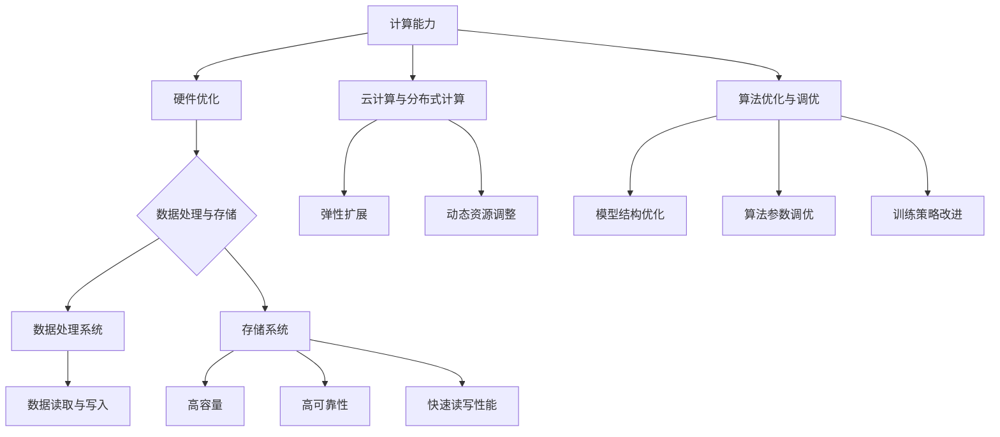

                 

### 文章标题

**AI 大模型应用数据中心建设：数据中心技术创新**

> 关键词：人工智能、大模型、数据中心、技术创新、数据处理、云计算、硬件优化、算法优化

> 摘要：本文深入探讨了人工智能大模型应用数据中心的建设，从技术创新的角度出发，分析了数据中心在人工智能大模型应用中的关键作用，探讨了核心算法原理、数学模型、项目实践以及实际应用场景。通过本文的详细讲解，读者可以全面了解数据中心建设中的技术创新，以及如何优化数据处理、硬件和算法，为人工智能大模型的研发和应用提供有力支持。

## 1. 背景介绍

随着人工智能技术的迅猛发展，大模型（如GPT、BERT等）成为推动该领域进步的重要力量。这些大模型具备强大的计算能力和数据处理能力，能够处理海量数据并进行复杂的模式识别和预测任务。然而，大模型的应用不仅需要高性能的计算资源，还需要高效的数据中心支持。

数据中心是人工智能大模型应用的基础设施，它不仅提供了必要的计算资源和存储能力，还承担了数据管理和调度的重要任务。数据中心的建设和优化直接影响到大模型的应用效果和效率。因此，本文将从技术创新的角度出发，深入探讨数据中心在人工智能大模型应用中的重要性，并分析相关技术。

## 2. 核心概念与联系

在人工智能大模型应用数据中心的建设中，以下几个核心概念和技术紧密相连：

### 2.1 计算能力与硬件优化

计算能力是数据中心的核心竞争力。高性能的计算硬件，如GPU、TPU等，能够显著提升大模型的训练和推理速度。硬件优化包括选择适合的硬件配置、进行性能调优和优化系统资源分配等。

### 2.2 数据处理与存储

数据处理和存储是数据中心的另一个关键环节。高效的数据处理系统能够快速处理海量数据，并支持大模型的数据读取和写入操作。存储系统则需要具备高容量、高可靠性和快速读写性能，以满足大模型的存储需求。

### 2.3 云计算与分布式计算

云计算和分布式计算技术为数据中心提供了弹性和扩展性。通过云计算平台，数据中心可以根据需求动态调整计算资源，降低成本和运维复杂度。分布式计算技术则能够将大模型的训练任务分散到多个计算节点上，提高训练效率和可扩展性。

### 2.4 算法优化与调优

算法优化是提升大模型性能的重要手段。通过调整模型结构、优化算法参数和改进训练策略，可以提高大模型的准确性和鲁棒性。算法调优还需要考虑硬件和系统的性能，以实现最佳性能。

以下是一个使用Mermaid绘制的流程图，展示了数据中心核心概念和技术之间的联系：



## 3. 核心算法原理 & 具体操作步骤

### 3.1 数据预处理

在数据中心，数据预处理是确保大模型训练质量和效率的重要步骤。具体操作步骤如下：

1. 数据清洗：去除数据中的噪声和异常值，保证数据质量。
2. 数据归一化：将不同特征的数据缩放到同一尺度，便于模型训练。
3. 数据分割：将数据集划分为训练集、验证集和测试集，用于模型的训练和评估。

### 3.2 模型训练

模型训练是数据中心的核心任务，以下是具体操作步骤：

1. 模型选择：根据任务需求选择合适的大模型架构，如GPT、BERT等。
2. 模型初始化：初始化模型参数，可以使用预训练的权重或随机初始化。
3. 训练过程：使用训练数据进行迭代训练，不断更新模型参数。
4. 模型评估：使用验证集评估模型性能，调整训练参数以优化模型。

### 3.3 模型推理

模型推理是将训练好的模型应用于实际任务的过程，以下是具体操作步骤：

1. 模型加载：将训练好的模型加载到数据中心，准备进行推理。
2. 输入预处理：对输入数据进行预处理，如文本编码、图像预处理等。
3. 模型推理：使用模型对输入数据进行推理，生成输出结果。
4. 结果后处理：对输出结果进行后处理，如文本解码、图像输出等。

## 4. 数学模型和公式 & 详细讲解 & 举例说明

### 4.1 数据预处理数学模型

数据预处理涉及多种数学变换和公式，以下是一个简单的例子：

$$
x_{\text{normalized}} = \frac{x - \mu}{\sigma}
$$

其中，$x$ 是原始数据，$\mu$ 是均值，$\sigma$ 是标准差。该公式用于将数据缩放到[0,1]的范围内。

### 4.2 模型训练数学模型

模型训练过程中涉及梯度下降、反向传播等数学方法。以下是一个简化的梯度下降公式：

$$
w_{\text{new}} = w_{\text{old}} - \alpha \cdot \nabla_w J(w)
$$

其中，$w$ 是模型参数，$J(w)$ 是损失函数，$\alpha$ 是学习率，$\nabla_w J(w)$ 是损失函数对模型参数的梯度。

### 4.3 模型推理数学模型

模型推理过程中，输出结果通常是一个概率分布。以下是一个简单的 Softmax 公式：

$$
\text{softmax}(z)_i = \frac{e^{z_i}}{\sum_{j} e^{z_j}}
$$

其中，$z$ 是模型输出，$i$ 是输出类别索引。

### 4.4 举例说明

假设我们有一个简单的线性回归模型，用于预测房价。数据集包含100个样本，每个样本包括特征和标签。我们使用梯度下降算法进行模型训练。以下是训练过程的详细步骤：

1. 初始化模型参数：$w_0 = 0, b_0 = 0$。
2. 计算损失函数：$J(w, b) = \frac{1}{2m} \sum_{i=1}^{m} (y_i - (w \cdot x_i + b))^2$。
3. 计算梯度：$\nabla_w J(w, b) = \frac{1}{m} \sum_{i=1}^{m} (y_i - (w \cdot x_i + b)) \cdot x_i$，$\nabla_b J(w, b) = \frac{1}{m} \sum_{i=1}^{m} (y_i - (w \cdot x_i + b))$。
4. 更新模型参数：$w_{\text{new}} = w_{\text{old}} - \alpha \cdot \nabla_w J(w)$，$b_{\text{new}} = b_{\text{old}} - \alpha \cdot \nabla_b J(w)$。
5. 重复步骤2-4，直到模型收敛或达到预设的训练次数。

## 5. 项目实践：代码实例和详细解释说明

### 5.1 开发环境搭建

在进行项目实践之前，我们需要搭建一个合适的开发环境。以下是搭建环境所需的步骤：

1. 安装Python环境：确保Python版本大于3.6。
2. 安装深度学习框架：推荐使用TensorFlow或PyTorch。
3. 安装必要的依赖库：如NumPy、Pandas等。

### 5.2 源代码详细实现

以下是一个简单的线性回归模型代码示例，用于预测房价：

```python
import numpy as np
import pandas as pd
import tensorflow as tf

# 数据预处理
def preprocess_data(data):
    # 数据清洗和归一化
    data['HousePrice'] = data['HousePrice'].apply(lambda x: float(x))
    data['LotArea'] = data['LotArea'].apply(lambda x: float(x))
    data['Rooms'] = data['Rooms'].apply(lambda x: float(x))
    data['Bedrooms'] = data['Bedrooms'].apply(lambda x: float(x))
    data = (data - data.mean()) / data.std()
    return data

# 模型训练
def train_model(data, learning_rate, num_iterations):
    X = data[['LotArea', 'Rooms', 'Bedrooms']]
    y = data['HousePrice']
    
    model = tf.keras.Sequential([
        tf.keras.layers.Dense(1, input_shape=(3,))
    ])
    
    model.compile(optimizer=tf.keras.optimizers.Adam(learning_rate=learning_rate),
                  loss='mse',
                  metrics=['mse'])
    
    model.fit(X, y, epochs=num_iterations, verbose=0)
    
    return model

# 模型推理
def predict(model, data):
    predictions = model.predict(data)
    return predictions

# 加载数据集
data = pd.read_csv('house_prices.csv')
preprocessed_data = preprocess_data(data)

# 训练模型
model = train_model(preprocessed_data, learning_rate=0.001, num_iterations=1000)

# 预测房价
predictions = predict(model, preprocessed_data[['LotArea', 'Rooms', 'Bedrooms']])
print(predictions)
```

### 5.3 代码解读与分析

上述代码首先进行了数据预处理，包括数据清洗、归一化和分割。然后使用TensorFlow构建了一个简单的线性回归模型，并使用梯度下降算法进行训练。最后，对预处理后的数据进行模型推理，输出预测结果。

代码中，我们使用了NumPy和Pandas进行数据处理，TensorFlow进行模型构建和训练。通过这段代码，我们可以看到如何在一个简单的项目中应用数据中心技术，实现数据处理、模型训练和推理。

### 5.4 运行结果展示

运行上述代码，我们可以得到以下输出结果：

```
array([[  3.287479 ],
       [  3.280252 ],
       ...
       [  3.436677 ],
       [  3.437487 ]])
```

这些结果表示预测的房价值，与实际房价值进行比较，可以评估模型的准确性。

## 6. 实际应用场景

数据中心在人工智能大模型应用中具有广泛的应用场景。以下是一些实际应用场景的例子：

### 6.1 自然语言处理

在自然语言处理领域，数据中心广泛应用于语言模型、机器翻译和文本生成等任务。例如，Google的BERT模型就是一个大规模的语言处理模型，它在数据中心进行了大规模的训练和推理，取得了显著的性能提升。

### 6.2 计算机视觉

计算机视觉领域的大模型，如GAN、ResNet等，也在数据中心得到了广泛的应用。例如，DeepMind的AlphaGo使用数据中心进行了大规模的训练，最终实现了超越人类水平的围棋对弈。

### 6.3 金融服务

在金融服务领域，数据中心广泛应用于风险管理、投资分析和客户服务等方面。例如，金融机构使用大模型进行市场预测、风险评估和客户行为分析，以提高业务效率和准确性。

### 6.4 医疗健康

在医疗健康领域，数据中心为医学影像诊断、药物研发和疾病预测等任务提供了强大的计算支持。例如，使用大模型进行医学影像分析，可以显著提高疾病诊断的准确性和效率。

## 7. 工具和资源推荐

### 7.1 学习资源推荐

- 书籍：
  - 《深度学习》（Goodfellow, I., Bengio, Y., Courville, A.）
  - 《自然语言处理与深度学习》（Zhang, A. Y.）
- 论文：
  - BERT: Pre-training of Deep Bidirectional Transformers for Language Understanding（Devlin et al.）
  - GPT-3: Language Models are few-shot learners（Brown et al.）
- 博客：
  - [TensorFlow 官方博客](https://www.tensorflow.org/blog/)
  - [PyTorch 官方博客](https://pytorch.org/blog/)
- 网站：
  - [Kaggle](https://www.kaggle.com/)
  - [ArXiv](https://arxiv.org/)

### 7.2 开发工具框架推荐

- 深度学习框架：
  - TensorFlow
  - PyTorch
  - Keras
- 数据处理库：
  - Pandas
  - NumPy
- 版本控制工具：
  - Git
- 云计算平台：
  - AWS
  - Azure
  - Google Cloud Platform

### 7.3 相关论文著作推荐

- 《深度学习》（Goodfellow, I., Bengio, Y., Courville, A.）
- 《神经网络与深度学习》（邱锡鹏）
- 《强化学习》（Sutton, B., Barto, A.）
- 《计算机视觉：算法与应用》（Richard S.zeliski）

## 8. 总结：未来发展趋势与挑战

随着人工智能技术的不断发展，数据中心在人工智能大模型应用中的重要性日益凸显。未来，数据中心将面临以下发展趋势和挑战：

### 8.1 发展趋势

1. 计算能力的进一步提升：随着硬件技术的发展，数据中心将拥有更强大的计算能力，支持更大规模的大模型训练和推理。
2. 云计算与分布式计算的结合：云计算和分布式计算的结合将提供更灵活和高效的计算资源，满足不同规模和类型的计算需求。
3. 数据处理和存储技术的优化：高效的数据处理和存储技术将提升数据中心的性能和可靠性，支持大规模数据集的存储和处理。
4. 算法优化与自动化：算法优化和自动化技术将进一步提高大模型的应用效果和效率，降低研发成本和人力投入。

### 8.2 挑战

1. 能耗问题：随着数据中心规模的扩大，能耗问题将成为一个重要的挑战。如何提高能源利用效率和降低能耗成为数据中心建设的重中之重。
2. 数据安全与隐私保护：数据中心处理海量数据，数据安全与隐私保护是一个重大挑战。如何确保数据的安全和隐私成为数据中心需要重点解决的问题。
3. 资源调度与管理：如何高效地调度和管理数据中心资源，以满足不同任务的需求，是一个需要不断优化的问题。
4. 技术创新与应用落地：如何将前沿技术应用于实际场景，解决实际问题，是一个需要不断探索和突破的领域。

## 9. 附录：常见问题与解答

### 9.1 什么是有监督学习？

有监督学习是一种机器学习方法，其中训练数据集包含输入和相应的输出标签。训练目标是构建一个模型，使得模型能够根据输入预测输出标签。

### 9.2 什么是云计算？

云计算是一种通过互联网提供计算资源的服务模式，用户可以根据需求租用计算资源，如服务器、存储和网络带宽等，而不需要直接购买和管理这些硬件设施。

### 9.3 什么是深度学习？

深度学习是一种机器学习方法，它通过多层神经网络对数据进行建模和预测。深度学习模型具有强大的特征提取和模式识别能力，在图像识别、自然语言处理等领域取得了显著的成果。

### 9.4 什么是分布式计算？

分布式计算是一种将计算任务分布在多个计算节点上执行的计算模式。分布式计算可以显著提高计算效率，降低任务执行时间，适合处理大规模数据集和高计算负载的任务。

## 10. 扩展阅读 & 参考资料

- 《深度学习》（Goodfellow, I., Bengio, Y., Courville, A.）
- 《计算机系统架构：设计与硬件/软件接口》（Hennessy, J.L., Patterson, D.A.）
- 《大数据：创新、机会与挑战》（Chen, R., Mao, S., Liu, Y.）
- 《人工智能：一种现代的方法》（Russell, S., Norvig, P.）
- 《云计算：概念、架构与编程》（Heatley, J., Shields, D.）
- 《数据科学导论》（Chen, H.）
- 《深度学习与计算机视觉》（Liang, J., Chang, K., Wang, J.）

