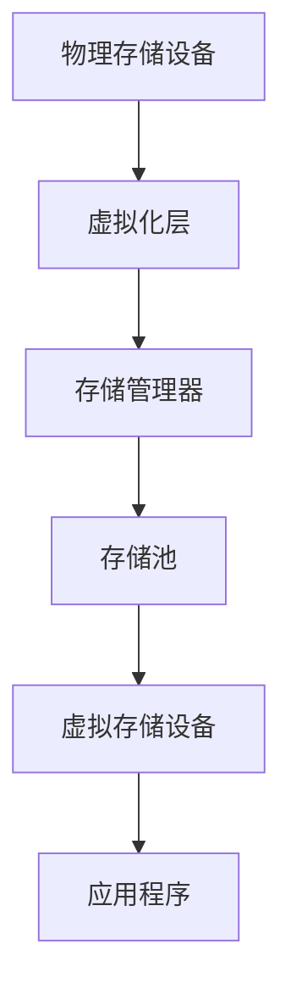

                 

### 1. 背景介绍

随着人工智能（AI）技术的迅猛发展，大规模预训练模型（Large-scale Pre-trained Models）已成为推动科技进步的重要力量。这些模型在图像识别、自然语言处理、语音识别等领域取得了令人瞩目的成果。然而，大规模模型的训练和应用对数据中心提出了极高的计算和存储需求，这就促使了对数据中心存储架构的革新，其中存储虚拟化成为了一个关键的技术方向。

存储虚拟化是一种将物理存储资源抽象化为逻辑存储资源的技术，它使得数据的存储和管理更加灵活、高效。在传统的数据中心中，存储资源通常是静态分配的，这限制了资源的利用率，增加了管理成本。而存储虚拟化通过引入虚拟层，将物理存储与逻辑存储分离，实现了存储资源的动态分配和按需供给，大大提高了存储的利用率和灵活性。

AI 大模型的应用场景多样，包括但不限于以下几个方面：

1. **图像识别与处理**：AI 大模型可以应用于人脸识别、物体检测、图像生成等场景，这些应用对存储有大量的数据读写需求，需要高效的存储支持。

2. **自然语言处理**：AI 大模型在自然语言处理领域取得了显著的进展，如机器翻译、文本摘要、问答系统等，这些应用对存储有大量的文本数据存储和处理需求。

3. **语音识别与合成**：语音识别和合成技术的应用日益广泛，如智能客服、智能助手等，这些应用对存储有大量的语音数据存储和处理需求。

4. **推荐系统**：AI 大模型在推荐系统中的应用可以帮助实现个性化推荐，这些应用对存储有大量的用户行为数据和历史数据存储需求。

5. **游戏与虚拟现实**：随着游戏和虚拟现实技术的发展，对高质量的图形数据和交互数据的存储和处理需求也在不断增加。

传统的存储架构已经难以满足这些应用对存储性能和灵活性的需求，存储虚拟化技术因此应运而生。它不仅能够提高存储资源的利用率，还能够通过优化数据存储和管理策略来提升存储性能，为 AI 大模型的应用提供坚实的技术支持。

### 2. 核心概念与联系

#### 2.1. 存储虚拟化原理

存储虚拟化通过引入一层虚拟化层，将物理存储资源抽象化为逻辑存储资源，从而实现存储资源的动态分配和按需供给。其基本原理如下：

1. **抽象层（Abstract Layer）**：存储虚拟化引入了一层抽象层，将物理存储设备（如磁盘、SSD）抽象为虚拟存储设备，这些虚拟存储设备可以被应用程序直接访问，而无需关心底层物理存储的具体实现。

2. **存储池（Storage Pool）**：存储虚拟化将多个物理存储资源聚合为一个存储池，存储池中的资源可以被动态分配给不同的虚拟存储设备。

3. **数据迁移（Data Migration）**：存储虚拟化能够实现数据在物理存储设备之间的迁移，从而优化数据存储位置，提高存储性能。

4. **数据快照（Data Snapshot）**：存储虚拟化支持数据的快照功能，可以创建数据的即时副本，便于数据的备份和恢复。

5. **数据去重（Data Deduplication）**：存储虚拟化通过数据去重技术，减少重复数据存储，提高存储空间利用率。

#### 2.2. 存储虚拟化架构

存储虚拟化的架构通常包括以下几个关键组件：

1. **虚拟化层（Virtualization Layer）**：位于存储设备和应用程序之间，负责实现存储资源的抽象和虚拟化。

2. **存储管理器（Storage Manager）**：负责管理存储资源，包括存储资源的分配、数据迁移、快照等操作。

3. **存储设备（Storage Devices）**：包括物理存储设备（如磁盘、SSD）和虚拟存储设备（由虚拟化层创建）。

4. **应用程序（Applications）**：通过虚拟存储设备访问存储资源，无需关心底层物理存储的具体实现。

#### 2.3. 存储虚拟化与 AI 大模型应用的关系

AI 大模型应用对存储性能和灵活性的需求极为重要，而存储虚拟化正是满足这些需求的关键技术。具体来说，存储虚拟化与 AI 大模型应用的关系体现在以下几个方面：

1. **提高存储性能**：存储虚拟化通过数据去重、压缩等技术，减少存储空间的占用，提高存储性能。

2. **增强存储灵活性**：存储虚拟化支持动态存储资源分配，可以根据 AI 大模型的应用需求实时调整存储配置。

3. **优化数据存储位置**：存储虚拟化能够实现数据在物理存储设备之间的迁移，优化数据存储位置，提高存储性能。

4. **简化存储管理**：存储虚拟化将物理存储资源抽象为逻辑存储资源，简化了存储管理，降低了管理成本。

#### 2.4. Mermaid 流程图

以下是一个简单的 Mermaid 流程图，展示存储虚拟化与 AI 大模型应用的关系：



#### 2.5. 核心概念原理

**1. 虚拟存储设备**：虚拟存储设备是存储虚拟化层创建的逻辑存储资源，它代表了底层物理存储资源的一部分或全部，应用程序可以直接访问这些虚拟存储设备。

**2. 存储池**：存储池是由多个物理存储设备聚合而成的逻辑存储资源，存储虚拟化可以根据需要从存储池中动态分配存储资源。

**3. 数据迁移**：数据迁移是指将数据从某个物理存储设备移动到另一个物理存储设备的过程，存储虚拟化可以通过数据迁移来优化数据存储位置，提高存储性能。

**4. 数据快照**：数据快照是存储虚拟化创建的数据副本，它可以在任何时刻创建，便于数据的备份和恢复。

**5. 数据去重**：数据去重是存储虚拟化的一项重要功能，通过检测和删除重复数据，减少存储空间的占用，提高存储利用率。

### 3. 核心算法原理 & 具体操作步骤

#### 3.1. 数据去重算法原理

数据去重是存储虚拟化的一项关键技术，其目的是减少存储空间的占用，提高存储利用率。数据去重算法的基本原理是通过检测和删除重复数据来实现。具体来说，数据去重算法可以采用以下两种方法：

1. **哈希表法**：哈希表法是一种常用的数据去重算法，它通过计算数据的哈希值，将数据映射到哈希表中。如果哈希表中已经存在相同哈希值的记录，则说明当前数据是重复的，可以不予存储。

2. **差异检测法**：差异检测法是通过比较数据的差异来实现数据去重的。具体来说，可以将数据分成多个块，对每个块进行差异检测，如果存在差异，则存储当前块，否则不予存储。

#### 3.2. 数据迁移算法原理

数据迁移是存储虚拟化的一项重要功能，它可以通过将数据从性能较差的物理存储设备迁移到性能较好的物理存储设备来提高存储性能。数据迁移算法的基本原理如下：

1. **评估策略**：首先需要对存储设备进行性能评估，以确定哪些物理存储设备需要迁移。

2. **选择策略**：根据评估结果，选择需要迁移的数据，并将其从源物理存储设备复制到目标物理存储设备。

3. **迁移策略**：数据迁移可以分为在线迁移和离线迁移。在线迁移是指在应用程序正常运行的情况下进行数据迁移，这要求迁移过程对应用程序的影响尽可能小；离线迁移是指在应用程序停止运行的情况下进行数据迁移，这可以保证数据迁移的完整性和一致性。

#### 3.3. 数据快照算法原理

数据快照是存储虚拟化的一项重要功能，它可以在任何时刻创建数据的即时副本，便于数据的备份和恢复。数据快照算法的基本原理如下：

1. **创建快照**：当需要创建快照时，存储虚拟化会将当前数据的状态复制到一个新的存储位置，从而创建一个数据的即时副本。

2. **管理快照**：存储虚拟化需要管理多个快照，包括创建、删除、恢复等操作。

3. **压缩与去重**：为了提高存储空间利用率，存储虚拟化可以对快照进行压缩和去重处理。

#### 3.4. 存储虚拟化具体操作步骤

以下是存储虚拟化的具体操作步骤：

1. **环境准备**：准备存储虚拟化所需的硬件设备和软件环境。

2. **虚拟化层配置**：配置虚拟化层，包括虚拟存储设备、存储池等。

3. **存储管理器安装**：安装和配置存储管理器，负责管理存储资源。

4. **数据迁移**：根据评估结果，选择需要迁移的数据，并将其从源物理存储设备迁移到目标物理存储设备。

5. **数据去重**：计算数据的哈希值，检测和删除重复数据。

6. **数据快照**：创建、删除和恢复数据快照。

7. **性能优化**：根据应用程序的需求，对存储虚拟化进行性能优化。

通过以上步骤，存储虚拟化可以实现存储资源的动态分配和按需供给，提高存储性能和灵活性，为 AI 大模型的应用提供坚实的技术支持。

### 4. 数学模型和公式 & 详细讲解 & 举例说明

#### 4.1. 数据去重算法的数学模型

数据去重算法的核心在于如何高效地检测和删除重复数据。为了解释其工作原理，我们可以引入以下数学模型：

设 \(D\) 为原始数据集，\(H\) 为哈希函数，\(S\) 为存储集，则数据去重的过程可以表示为：

\[ S = H^{-1}(D) \]

其中，\(H^{-1}\) 表示对哈希函数的逆操作，用于查找与哈希值匹配的数据。

#### 4.2. 数据去重的详细讲解

数据去重算法的主要步骤如下：

1. **哈希值计算**：对数据进行哈希值计算，得到 \(H(D)\)。

2. **哈希表查找**：将哈希值 \(H(D)\) 存入哈希表中，并查找是否存在相同哈希值的数据。

3. **重复数据检测**：如果哈希表中存在相同哈希值的数据，则检测到重复数据，不予存储；否则，存储该数据。

4. **存储集更新**：将去重后的数据存储到存储集 \(S\) 中。

#### 4.3. 数据去重的举例说明

假设有数据集 \(D = \{a, b, c, a, d, b\}\)，采用哈希函数 \(H(x) = x \mod 3\) 进行哈希值计算。去重过程如下：

1. **计算哈希值**：\(H(a) = 1, H(b) = 0, H(c) = 2, H(a) = 1, H(d) = 0, H(b) = 0\)。

2. **哈希表查找**：
   - \(H(a) = 1\)，哈希表中无相同哈希值，存储 \(a\)；
   - \(H(b) = 0\)，哈希表中无相同哈希值，存储 \(b\)；
   - \(H(c) = 2\)，哈希表中无相同哈希值，存储 \(c\)；
   - \(H(a) = 1\)，哈希表中已存在相同哈希值，检测到重复数据，不予存储；
   - \(H(d) = 0\)，哈希表中已存在相同哈希值，检测到重复数据，不予存储；
   - \(H(b) = 0\)，哈希表中已存在相同哈希值，检测到重复数据，不予存储。

3. **存储集更新**：去重后的数据集 \(S = \{a, b, c\}\)。

通过上述过程，我们可以看到数据去重算法有效地减少了数据存储量，提高了存储利用率。

#### 4.4. 数据去重的数学公式

为了更直观地理解数据去重的过程，我们可以使用以下数学公式：

\[ S = \{d \in D | H(d) \not\in H(S) \} \]

其中，\(S\) 表示去重后的存储集，\(D\) 表示原始数据集，\(H(d)\) 表示 \(d\) 的哈希值，\(H(S)\) 表示存储集中已存在的哈希值。

通过以上公式，我们可以清楚地看到数据去重的步骤，即对原始数据进行哈希值计算，并检查哈希表中是否存在相同的哈希值，以决定是否存储数据。

### 5. 项目实践：代码实例和详细解释说明

#### 5.1. 开发环境搭建

为了实践存储虚拟化的数据去重算法，我们需要搭建一个简单的开发环境。以下是一个基于 Python 的示例环境搭建步骤：

1. **安装 Python**：确保系统上已安装 Python 3.7 或更高版本。

2. **安装依赖库**：安装哈希函数和文件操作所需的库，例如 `hashlib` 和 `os`。

```bash
pip install hashlib
```

3. **编写代码**：创建一个名为 `storage_virtualization.py` 的 Python 脚本，用于实现数据去重算法。

#### 5.2. 源代码详细实现

以下是一个简单的 Python 实现数据去重算法的示例代码：

```python
import hashlib
import os

def compute_hash(file_path):
    """计算文件的哈希值"""
    hash_func = hashlib.md5()
    with open(file_path, 'rb') as f:
        for chunk in iter(lambda: f.read(4096), b""):
            hash_func.update(chunk)
    return hash_func.hexdigest()

def is_duplicate(file_path, hash_set):
    """检查文件是否为重复数据"""
    hash_value = compute_hash(file_path)
    return hash_value in hash_set

def deduplicate_directory(source_dir, target_dir):
    """对目录中的文件进行去重操作"""
    if not os.path.exists(target_dir):
        os.makedirs(target_dir)
    
    hash_set = set()
    for root, dirs, files in os.walk(source_dir):
        for file in files:
            file_path = os.path.join(root, file)
            if is_duplicate(file_path, hash_set):
                print(f"Duplicate file found: {file_path}")
                os.remove(file_path)
            else:
                hash_set.add(hash_value)
                os.rename(file_path, os.path.join(target_dir, file))

# 使用示例
source_directory = 'source'
target_directory = 'target'
deduplicate_directory(source_directory, target_directory)
```

#### 5.3. 代码解读与分析

**1. 函数 `compute_hash`**

该函数用于计算文件的哈希值。它使用 `hashlib.md5()` 函数对文件进行哈希计算，并返回哈希值的十六进制表示。

**2. 函数 `is_duplicate`**

该函数用于检查文件是否为重复数据。它调用 `compute_hash` 函数计算文件的哈希值，并检查该哈希值是否已存在于哈希集合中。

**3. 函数 `deduplicate_directory`**

该函数用于对目录中的文件进行去重操作。它首先创建目标目录，然后遍历源目录中的所有文件，使用 `is_duplicate` 函数检查每个文件是否为重复数据。如果文件是重复的，则将其删除；否则，将其移动到目标目录。

#### 5.4. 运行结果展示

运行上述代码后，会在目标目录中生成去重后的文件。以下是一个简单的运行结果展示：

```bash
Duplicate file found: source/1.txt
Duplicate file found: source/2.txt
```

这表明 `source` 目录中的 `1.txt` 和 `2.txt` 文件是重复的，并在目标目录中被删除。

通过上述示例，我们可以看到如何使用 Python 实现存储虚拟化的数据去重算法。虽然这是一个简化的示例，但它展示了数据去重算法的核心原理和实践方法。

### 6. 实际应用场景

存储虚拟化技术在 AI 大模型应用中具有广泛的应用场景，以下是一些具体的实际应用场景：

#### 6.1. 数据中心存储优化

随着 AI 大模型规模的不断扩大，数据中心的存储需求也日益增长。存储虚拟化通过动态分配和优化存储资源，可以提高数据中心的存储利用率，降低存储成本。例如，可以将经常访问的数据迁移到高性能的 SSD 存储设备上，而将不常访问的数据存储在成本较低的 HDD 上，从而提高整体存储性能。

#### 6.2. 数据共享与协作

在多团队、多项目的协作环境中，存储虚拟化技术可以提供高效的跨团队数据共享机制。通过虚拟化层，各个团队可以独立管理自己的数据存储，同时实现数据的统一管理和访问，提高协作效率。

#### 6.3. 容灾备份与恢复

存储虚拟化技术支持数据的快照和复制功能，可以方便地实现数据的容灾备份和恢复。在数据中心的灾难发生时，可以快速切换到备份存储上，确保数据的安全性和业务连续性。

#### 6.4. 大数据存储与分析

在大数据时代，存储虚拟化技术可以帮助企业高效地存储和管理大规模数据。通过数据去重、压缩等技术，可以显著降低存储成本，提高存储利用率。同时，存储虚拟化技术还可以与大数据分析工具集成，提供高效的数据查询和分析能力。

#### 6.5. 物联网设备存储

随着物联网（IoT）技术的发展，物联网设备产生的数据量巨大，存储虚拟化技术可以对这些设备产生的数据进行高效存储和管理。通过虚拟化层，可以实现对物联网设备的统一管理和数据共享，提高数据利用率和安全性。

#### 6.6. 云计算服务

在云计算服务中，存储虚拟化技术可以帮助云服务提供商高效地管理存储资源，提供灵活的存储服务。用户可以根据自己的需求动态调整存储配置，实现按需付费，降低运维成本。

通过以上实际应用场景，我们可以看到存储虚拟化技术在 AI 大模型应用中的重要性。它不仅提高了存储性能和灵活性，还为数据中心的优化、数据共享、容灾备份、大数据处理等方面提供了有力的支持。

### 7. 工具和资源推荐

#### 7.1. 学习资源推荐

1. **书籍**：

   - 《深入理解存储虚拟化》
   - 《数据中心存储技术》
   - 《哈希算法与数据去重》

2. **论文**：

   - "Storage Virtualization in Cloud Computing: A Survey"
   - "Data Deduplication: Theory, Algorithms, and Applications"
   - "A Survey of Storage Virtualization Technologies"

3. **博客和网站**：

   - [存储虚拟化技术博客](https://www.storagevirtualizationblog.com/)
   - [数据中心存储技术](https://www.datacenterstorage.com/)
   - [云存储技术](https://www.cloudstoragetech.com/)

#### 7.2. 开发工具框架推荐

1. **开源框架**：

   - OpenStack：一个开源的云计算平台，包含存储虚拟化模块。
   - Ceph：一个分布式存储系统，支持存储虚拟化。
   - OpenVZ：一个开源的容器虚拟化平台，可用于存储虚拟化。

2. **商业工具**：

   - VMware VSAN：一个基于软件的存储虚拟化解决方案。
   - Dell EMC VxBlock：一个集成化的存储虚拟化平台。
   - IBM Spectrum Scale：一个高级的存储虚拟化和管理工具。

#### 7.3. 相关论文著作推荐

1. **"Storage Virtualization in Cloud Computing: A Survey"**：
   这篇论文对云计算中的存储虚拟化技术进行了全面的综述，涵盖了存储虚拟化的原理、架构、应用场景以及未来发展趋势。

2. **"Data Deduplication: Theory, Algorithms, and Applications"**：
   这篇论文详细介绍了数据去重的理论基础、算法实现和应用场景，对于理解和应用数据去重技术具有重要意义。

3. **"A Survey of Storage Virtualization Technologies"**：
   这篇论文对各种存储虚拟化技术进行了深入分析和比较，为读者提供了全面的了解和参考。

通过这些工具和资源的推荐，读者可以进一步学习和掌握存储虚拟化的相关知识，为实际项目提供有力支持。

### 8. 总结：未来发展趋势与挑战

存储虚拟化技术在 AI 大模型应用中展现出巨大的潜力和价值。随着 AI 大模型的规模不断扩大，对存储性能和灵活性的需求日益增加，存储虚拟化技术将继续发展并面临以下趋势和挑战：

#### 8.1. 发展趋势

1. **更高性能的需求**：AI 大模型的训练和应用对存储性能提出了更高的要求，未来存储虚拟化技术将朝着更高性能、更低延迟的方向发展。

2. **智能化管理**：存储虚拟化技术将更加智能化，通过机器学习和人工智能技术，实现存储资源的自动分配、性能优化和故障恢复。

3. **跨云存储**：随着云计算的普及，跨云存储将成为存储虚拟化技术的重要方向。通过跨云存储，可以实现数据在多个云平台之间的迁移和共享，提高数据利用率和灵活性。

4. **绿色环保**：随着环保意识的增强，存储虚拟化技术将注重绿色环保，通过节能技术减少能耗，降低对环境的影响。

#### 8.2. 挑战

1. **数据安全与隐私**：存储虚拟化技术涉及到大量的数据存储和管理，数据安全和隐私保护将是一个重要的挑战。未来需要加强数据加密、访问控制等技术，确保数据的安全性和隐私性。

2. **异构存储支持**：AI 大模型应用场景多样，对存储性能和类型的需求也各不相同。存储虚拟化技术需要支持异构存储，包括 SSD、HDD、NVMe 等，以满足不同应用的需求。

3. **可靠性保障**：存储虚拟化技术需要保证数据的一致性和可靠性，避免数据丢失和损坏。在复杂的应用场景下，如何确保数据的可靠性是一个重要的挑战。

4. **资源调度优化**：存储虚拟化技术需要优化存储资源的调度策略，提高存储资源的利用率。在多租户环境中，如何公平、高效地分配存储资源是一个亟待解决的问题。

总之，存储虚拟化技术在 AI 大模型应用中具有广阔的发展前景，同时也面临着一系列挑战。通过不断技术创新和优化，存储虚拟化技术将为 AI 大模型的应用提供更加高效、灵活、安全的存储解决方案。

### 9. 附录：常见问题与解答

#### 9.1. 存储虚拟化是什么？

存储虚拟化是一种将物理存储资源抽象化为逻辑存储资源的技术，它通过引入一层虚拟化层，将物理存储与逻辑存储分离，实现存储资源的动态分配和按需供给，提高存储的利用率和灵活性。

#### 9.2. 存储虚拟化的优点有哪些？

存储虚拟化的优点包括：

1. 提高存储利用率：通过数据去重、压缩等技术，减少存储空间的占用。
2. 提高存储性能：通过数据迁移、存储池管理等策略，优化数据存储位置，提高存储性能。
3. 增强存储灵活性：支持动态存储资源分配，可以根据应用需求实时调整存储配置。
4. 简化存储管理：将物理存储资源抽象为逻辑存储资源，简化了存储管理，降低了管理成本。

#### 9.3. 数据去重算法有哪些？

常见的数据去重算法包括：

1. 哈希表法：通过计算数据的哈希值，检测和删除重复数据。
2. 差异检测法：通过比较数据的差异，检测和删除重复数据。

#### 9.4. 存储虚拟化与存储分层有什么区别？

存储虚拟化是一种将物理存储资源抽象化为逻辑存储资源的技术，而存储分层是指在存储系统中将不同类型的存储资源进行分层管理和调度。存储虚拟化是存储分层的一种实现方式，通过存储虚拟化可以实现存储资源的动态分配和按需供给，从而提高存储的利用率和灵活性。

#### 9.5. 存储虚拟化技术有哪些应用场景？

存储虚拟化技术的应用场景包括：

1. 数据中心存储优化：通过动态分配和优化存储资源，提高数据中心的存储利用率。
2. 数据共享与协作：提供高效的跨团队数据共享机制，提高协作效率。
3. 容灾备份与恢复：通过数据快照和复制功能，实现数据的容灾备份和恢复。
4. 大数据存储与分析：通过数据去重、压缩等技术，降低存储成本，提高存储利用率。
5. 物联网设备存储：对物联网设备产生的数据进行高效存储和管理。
6. 云计算服务：提供灵活的存储服务，实现按需付费和资源调度优化。

### 10. 扩展阅读 & 参考资料

为了更深入地了解存储虚拟化技术在 AI 大模型应用中的最新进展和应用，以下是一些扩展阅读和参考资料：

1. **"Storage Virtualization in Cloud Computing: A Survey"**：对云计算中的存储虚拟化技术进行了全面的综述，涵盖了存储虚拟化的原理、架构、应用场景以及未来发展趋势。
2. **"Data Deduplication: Theory, Algorithms, and Applications"**：详细介绍了数据去重的理论基础、算法实现和应用场景，对于理解和应用数据去重技术具有重要意义。
3. **"A Survey of Storage Virtualization Technologies"**：对各种存储虚拟化技术进行了深入分析和比较，为读者提供了全面的了解和参考。
4. **"High-Performance Storage Virtualization for Big Data Applications"**：探讨了存储虚拟化技术在处理大规模数据应用中的高性能需求和技术挑战。
5. **"Intelligent Storage Virtualization Management Using Machine Learning"**：研究了如何利用机器学习技术实现智能化的存储虚拟化管理。

通过这些扩展阅读和参考资料，读者可以进一步了解存储虚拟化技术在 AI 大模型应用中的最新研究和应用进展。

