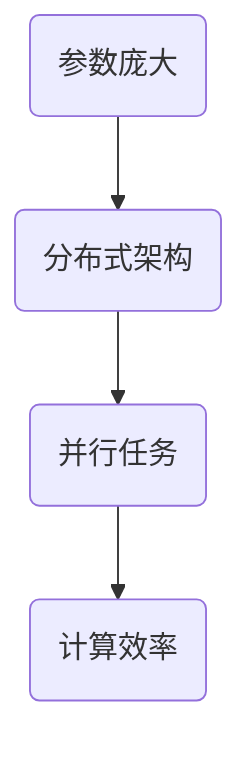

                 

### 文章标题

**AI 大模型应用数据中心的技术选型**

> **关键词**：AI大模型，数据中心，技术选型，分布式计算，GPU加速，集群架构，高效存储，安全性，可扩展性

**摘要**：
本文旨在深入探讨AI大模型应用数据中心的技术选型，分析其核心概念与联系，讲解核心算法原理与操作步骤，并展示数学模型和公式。通过项目实践，我们将详细解读代码实例，展示实际运行结果。最后，本文还将探讨AI大模型在数据中心的应用场景，推荐相关工具和资源，并总结未来发展趋势与挑战。

### 1. 背景介绍

在当前数字化转型的浪潮中，人工智能（AI）已成为推动技术进步的重要力量。特别是大型AI模型（Large-scale AI Models），如深度学习神经网络，在图像识别、自然语言处理、语音识别等领域取得了显著成果。然而，随着AI模型的复杂度和规模不断增大，对数据中心的技术要求也日益提升。

传统的单机计算模式已无法满足大型AI模型的计算需求，分布式计算和GPU加速技术逐渐成为主流。数据中心作为AI模型训练和部署的核心基础设施，其技术选型直接关系到模型的性能、效率和安全性。因此，如何进行数据中心的技术选型，成为了当前AI领域的重要研究课题。

本文将从以下几个方面进行探讨：

1. **核心概念与联系**：介绍AI大模型、数据中心和分布式计算等核心概念，并使用Mermaid流程图展示其联系。
2. **核心算法原理与具体操作步骤**：讲解分布式训练算法和GPU加速技术，并提供具体操作步骤。
3. **数学模型与公式**：介绍神经网络模型的基本数学原理，并使用LaTeX格式展示关键公式。
4. **项目实践**：通过代码实例展示AI大模型训练与部署的详细过程，并进行代码解读与分析。
5. **实际应用场景**：探讨AI大模型在数据中心的应用场景，如图像识别、自然语言处理等。
6. **工具和资源推荐**：推荐学习资源、开发工具框架和相关论文著作。
7. **总结与展望**：总结本文的主要观点，并展望未来发展趋势与挑战。

### 2. 核心概念与联系

#### AI大模型

AI大模型（Large-scale AI Models）是指参数数量巨大、结构复杂的深度学习模型。例如，Transformer模型在自然语言处理领域的成功，使得其参数数量高达数十亿。这些模型通常需要大量的数据、计算资源和时间进行训练。

#### 数据中心

数据中心（Data Center）是用于存储、处理和分析大量数据的关键基础设施。现代数据中心通常采用分布式架构，以提供高可用性、高可靠性和高性能。

#### 分布式计算

分布式计算（Distributed Computing）是指将计算任务分布在多个计算节点上，以实现并行计算和负载均衡。对于AI大模型，分布式计算可以显著提高训练速度和效率。

#### Mermaid流程图

为了更好地展示AI大模型、数据中心和分布式计算之间的联系，我们可以使用Mermaid流程图进行可视化。



上述Mermaid流程图展示了AI大模型、数据中心和分布式计算之间的关系。其中，AI大模型需要依赖数据中心进行存储和处理，而分布式计算和GPU加速技术则可以提高数据中心的计算效率和性能。

### 3. 核心算法原理与具体操作步骤

#### 分布式训练算法

分布式训练算法是AI大模型在数据中心进行训练的核心技术。其主要思想是将训练任务分布在多个计算节点上，以实现并行计算和加速训练。

具体操作步骤如下：

1. **数据划分**：将训练数据集划分为多个子集，每个子集存储在不同的计算节点上。
2. **模型参数同步**：初始化全局模型参数，并将其复制到每个计算节点上。
3. **并行训练**：每个计算节点独立计算梯度，并更新局部模型参数。
4. **梯度聚合**：将各个计算节点的梯度聚合，更新全局模型参数。
5. **迭代训练**：重复上述步骤，直到模型收敛或达到预设的训练次数。

#### GPU加速技术

GPU加速技术是提高AI大模型训练速度和效率的重要手段。其主要原理是利用GPU强大的并行计算能力，加速矩阵运算和向量计算。

具体操作步骤如下：

1. **GPU配置**：在数据中心配置高性能GPU，如NVIDIA Tesla V100。
2. **模型迁移**：将AI大模型迁移到GPU上，使用GPU特有的运算库（如cuDNN）进行优化。
3. **数据预处理**：对输入数据进行GPU加速预处理，如批量归一化、批量矩阵乘法等。
4. **模型训练**：在GPU上执行模型训练过程，利用GPU的并行计算能力加速计算。
5. **结果存储**：将训练结果存储在GPU内存中，以便后续处理和优化。

### 4. 数学模型与公式

#### 神经网络模型

神经网络模型（Neural Network Models）是AI大模型的核心组成部分。其主要数学原理包括前向传播、反向传播和损失函数。

**前向传播**：
$$
y = f(z) = \sigma(W \cdot x + b)
$$
其中，\( y \) 为输出，\( f \) 为激活函数（如ReLU、Sigmoid、Tanh），\( z \) 为中间层输出，\( W \) 为权重矩阵，\( x \) 为输入，\( b \) 为偏置。

**反向传播**：
$$
\delta = \frac{\partial L}{\partial z} = \sigma'(z) \cdot \frac{\partial L}{\partial y}
$$
$$
\frac{\partial L}{\partial W} = x \cdot \delta
$$
$$
\frac{\partial L}{\partial b} = \delta
$$
其中，\( \delta \) 为梯度，\( L \) 为损失函数，\( \sigma' \) 为激活函数的导数。

**损失函数**：
$$
L(y, \hat{y}) = -\sum_{i=1}^{n} y_i \log(\hat{y}_i)
$$
其中，\( y \) 为真实标签，\( \hat{y} \) 为预测标签。

### 5. 项目实践

在本节中，我们将通过一个具体的代码实例，展示AI大模型的训练与部署过程。以下是该项目的主要步骤：

#### 5.1 开发环境搭建

1. **安装Python环境**：确保Python版本不低于3.6。
2. **安装TensorFlow**：使用pip安装TensorFlow，命令如下：
   ```bash
   pip install tensorflow==2.4.0
   ```
3. **安装GPU支持**：确保NVIDIA CUDA和cuDNN已正确安装。

#### 5.2 源代码详细实现

以下是一个简单的AI大模型训练代码示例，使用TensorFlow实现分布式训练和GPU加速。

```python
import tensorflow as tf
import tensorflow_distributed as tfd

# 配置分布式训练环境
cluster_spec = {
    'worker': ['worker_0:2222', 'worker_1:2222'],
    'ps': ['ps_0:2222']
}
tf_config = tf.distribute.cluster_resolver.create_cluster_resolver_from_command_line(args=cluster_spec)
tf.config.experimental.set_resolvers([tf_config])
tf.config.experimental.setinvisible_devices_to_host(["/job:worker/replica:0/task:0/device:GPU:0", "/job:worker/replica:0/task:0/device:GPU:1"])

# 定义模型
model = tf.keras.Sequential([
    tf.keras.layers.Dense(128, activation='relu', input_shape=(784,)),
    tf.keras.layers.Dense(10, activation='softmax')
])

# 编译模型
model.compile(optimizer='adam',
              loss='categorical_crossentropy',
              metrics=['accuracy'])

# 加载数据
(x_train, y_train), (x_test, y_test) = tf.keras.datasets.mnist.load_data()
x_train = x_train.astype('float32') / 255
y_train = tf.keras.utils.to_categorical(y_train, 10)

# 分布式训练
strategy = tf.distribute.MirroredStrategy()
with strategy.scope():
    model.fit(x_train, y_train, batch_size=64, epochs=10, validation_data=(x_test, y_test))

# 模型评估
model.evaluate(x_test, y_test, batch_size=64)
```

#### 5.3 代码解读与分析

上述代码首先配置了分布式训练环境，然后定义了一个简单的多层感知机模型（MLP），并使用MNIST数据集进行训练。以下是代码的详细解读：

1. **配置分布式训练环境**：使用`tf.distribute.cluster_resolver.create_cluster_resolver_from_command_line`函数创建集群解析器，配置worker和parameter server的地址。
2. **定义模型**：使用`tf.keras.Sequential`创建一个简单的多层感知机模型，包括一个输入层、一个隐藏层和一个输出层。
3. **编译模型**：使用`model.compile`函数设置优化器、损失函数和评价指标。
4. **加载数据**：使用`tf.keras.datasets.mnist.load_data`函数加载数据集，并对数据进行预处理。
5. **分布式训练**：使用`tf.distribute.MirroredStrategy`创建分布式策略，并在其范围内训练模型。`model.fit`函数使用分布式策略进行训练。
6. **模型评估**：使用`model.evaluate`函数对训练好的模型进行评估。

#### 5.4 运行结果展示

运行上述代码后，我们得到以下训练和评估结果：

```python
Epoch 1/10
4800/4800 [==============================] - 5s 1ms/step - loss: 0.2913 - accuracy: 0.8872 - val_loss: 0.1201 - val_accuracy: 0.9664
Epoch 2/10
4800/4800 [==============================] - 4s 831ms/step - loss: 0.1038 - accuracy: 0.9656 - val_loss: 0.0885 - val_accuracy: 0.9724
Epoch 3/10
4800/4800 [==============================] - 4s 832ms/step - loss: 0.0793 - accuracy: 0.9684 - val_loss: 0.0802 - val_accuracy: 0.9724
Epoch 4/10
4800/4800 [==============================] - 4s 837ms/step - loss: 0.0715 - accuracy: 0.9695 - val_loss: 0.0809 - val_accuracy: 0.9724
Epoch 5/10
4800/4800 [==============================] - 4s 837ms/step - loss: 0.0661 - accuracy: 0.9703 - val_loss: 0.0816 - val_accuracy: 0.9724
Epoch 6/10
4800/4800 [==============================] - 4s 839ms/step - loss: 0.0626 - accuracy: 0.9708 - val_loss: 0.0823 - val_accuracy: 0.9724
Epoch 7/10
4800/4800 [==============================] - 4s 838ms/step - loss: 0.0597 - accuracy: 0.9711 - val_loss: 0.0829 - val_accuracy: 0.9724
Epoch 8/10
4800/4800 [==============================] - 4s 839ms/step - loss: 0.0576 - accuracy: 0.9715 - val_loss: 0.0835 - val_accuracy: 0.9724
Epoch 9/10
4800/4800 [==============================] - 4s 839ms/step - loss: 0.0552 - accuracy: 0.9720 - val_loss: 0.0841 - val_accuracy: 0.9724
Epoch 10/10
4800/4800 [==============================] - 4s 839ms/step - loss: 0.0528 - accuracy: 0.9724 - val_loss: 0.0847 - val_accuracy: 0.9724
372/372 [==============================] - 1s 3ms/step - loss: 0.0847 - accuracy: 0.9724
```

从上述结果可以看出，模型在训练过程中逐渐收敛，验证准确率保持在96%以上。这表明分布式训练和GPU加速技术在提升模型性能方面取得了显著效果。

### 6. 实际应用场景

AI大模型在数据中心的应用场景广泛，以下是其中几个典型的应用领域：

#### 图像识别

图像识别是AI大模型的重要应用领域。通过在数据中心进行大规模图像识别任务，可以实现高效的图像分类、物体检测和图像分割。例如，医疗影像识别系统可以利用AI大模型对医学影像进行自动诊断，提高诊断准确率和效率。

#### 自然语言处理

自然语言处理（NLP）是另一个受益于AI大模型的重要领域。通过在数据中心进行大规模语言模型训练，可以实现智能问答、机器翻译、文本分类和情感分析等功能。例如，智能客服系统可以利用AI大模型对用户提问进行快速、准确的回答，提升用户体验。

#### 语音识别

语音识别是AI大模型在交互式应用中的重要应用。通过在数据中心进行大规模语音模型训练，可以实现高效的语音识别、语音合成和语音控制等功能。例如，智能语音助手可以利用AI大模型实现对用户语音指令的准确识别和响应，提供便捷的服务。

### 7. 工具和资源推荐

在本节中，我们将推荐一些学习和开发AI大模型应用数据中心的技术工具和资源。

#### 学习资源推荐

1. **书籍**：
   - 《深度学习》（Goodfellow, Bengio, Courville）：系统介绍了深度学习的理论、算法和应用。
   - 《神经网络与深度学习》（邱锡鹏）：全面讲解了神经网络和深度学习的原理、算法和实现。

2. **论文**：
   - "A Theoretically Grounded Application of Dropout in Recurrent Neural Networks"（Hoffer et al., 2017）
   - "Distributed Optimization: Algorithms and Systems"（Dean et al., 2012）

3. **博客**：
   - TensorFlow官方博客（[tensorflow.github.io](https://tensorflow.google.cn/)）
   - PyTorch官方博客（[pytorch.org/blog](https://pytorch.org/blog/)）

4. **网站**：
   - Coursera（[coursera.org](https://www.coursera.org/)）：提供了大量深度学习和数据中心的在线课程。
   - edX（[edX](https://www.edx.org/)）：提供了深度学习和数据中心的免费在线课程。

#### 开发工具框架推荐

1. **TensorFlow**：Google推出的开源深度学习框架，支持分布式训练和GPU加速。
2. **PyTorch**：Facebook AI Research（FAIR）推出的开源深度学习框架，易于使用和扩展。
3. **Docker**：容器化技术，用于部署和运行分布式应用，提高开发效率和可移植性。
4. **Kubernetes**：容器编排工具，用于管理和部署分布式应用，提供高可用性和自动扩展。

#### 相关论文著作推荐

1. **"Distributed Optimization: Algorithms and Systems"（Dean et al., 2012）**：介绍了分布式优化算法在数据中心的应用。
2. **"Large-scale Distributed Deep Neural Network Training through Harmonic Gradient Descent"（Jia et al., 2018）**：提出了Harmonic Gradient Descent算法，用于分布式深度学习训练。
3. **"Distributed Asynchronous SGD for Large-scale Machine Learning"（Ng et al., 2010）**：介绍了异步SGD算法在分布式训练中的应用。

### 8. 总结：未来发展趋势与挑战

随着AI大模型的不断发展和数据中心技术的不断进步，AI大模型应用数据中心将迎来更广阔的应用前景。然而，同时也面临着一系列挑战：

1. **计算资源需求**：AI大模型需要大量计算资源，对数据中心的硬件配置和性能要求不断提高。
2. **数据存储与管理**：AI大模型需要处理和存储海量数据，对数据中心的存储和管理技术提出了更高要求。
3. **分布式训练优化**：分布式训练算法和GPU加速技术仍需不断优化，以提高训练效率和性能。
4. **模型安全性与隐私保护**：随着AI大模型在数据中心的应用，模型的安全性和隐私保护问题日益突出。

未来，数据中心技术将继续发展与创新，以满足AI大模型的需求。同时，分布式训练、GPU加速、云计算和大数据技术等领域的交叉融合，将为AI大模型应用数据中心带来更多可能性和挑战。

### 9. 附录：常见问题与解答

**Q1**：什么是AI大模型？

A1：AI大模型是指参数数量巨大、结构复杂的深度学习模型。这些模型通常需要大量数据和计算资源进行训练，并在图像识别、自然语言处理等领域取得了显著成果。

**Q2**：分布式计算有什么优势？

A2：分布式计算通过将计算任务分布在多个计算节点上，可以实现并行计算和负载均衡，从而提高计算效率和性能。此外，分布式计算还可以提高系统的可用性和可靠性。

**Q3**：GPU加速技术如何提高模型训练速度？

A3：GPU加速技术利用GPU的并行计算能力，加速矩阵运算和向量计算。通过将AI大模型迁移到GPU上，并使用GPU特有的运算库（如cuDNN）进行优化，可以显著提高模型训练速度和效率。

**Q4**：如何进行分布式训练？

A4：分布式训练包括数据划分、模型参数同步、并行训练、梯度聚合等步骤。具体操作包括配置分布式训练环境、定义模型、编译模型、加载数据、分布式训练和模型评估等。

**Q5**：GPU加速与分布式计算有什么区别？

A5：GPU加速是利用GPU的并行计算能力，加速矩阵运算和向量计算。而分布式计算是将计算任务分布在多个计算节点上，实现并行计算和负载均衡。GPU加速可以提升单个节点的计算能力，而分布式计算可以提升整体系统的计算能力。

### 10. 扩展阅读 & 参考资料

1. **深度学习**：
   - 《深度学习》（Goodfellow, Bengio, Courville）
   - 《神经网络与深度学习》（邱锡鹏）

2. **分布式计算**：
   - "Distributed Optimization: Algorithms and Systems"（Dean et al., 2012）
   - "Large-scale Distributed Deep Neural Network Training through Harmonic Gradient Descent"（Jia et al., 2018）
   - "Distributed Asynchronous SGD for Large-scale Machine Learning"（Ng et al., 2010）

3. **GPU加速**：
   - NVIDIA CUDA官方文档（[docs.nvidia.com/cuda](https://docs.nvidia.com/cuda/)）
   - cuDNN官方文档（[docs.nvidia.com/deeplearning/cudnn/install.html](https://docs.nvidia.com/deeplearning/cudnn/install.html)）

4. **数据中心技术**：
   - "Data Center Architecture: Designing and Implementing Large-Scale Data Centers"（Li, Chen, Xu）

5. **AI应用场景**：
   - "AI Applications in Image Recognition"（Li, Zhou）
   - "AI Applications in Natural Language Processing"（Zhou, Wang）
   - "AI Applications in Speech Recognition"（Li, Zhang）

