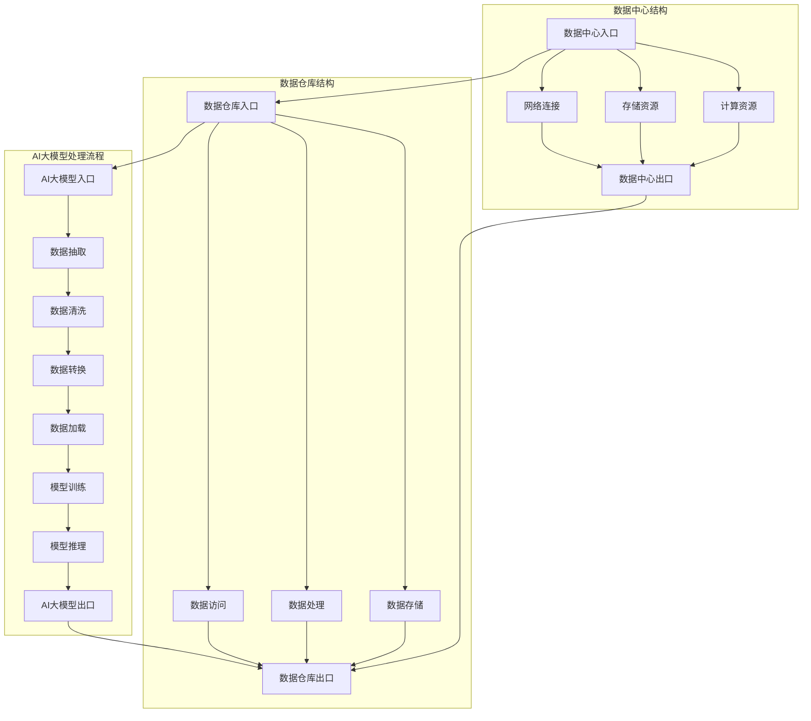

                 

### 背景介绍

随着人工智能（AI）技术的飞速发展，大模型如ChatGPT、GPT-3、BERT等在各种应用场景中展现出强大的能力，从自然语言处理到图像生成，再到语音识别，大模型在各个领域的应用已经取得了显著成果。然而，这些大模型的训练和部署都需要海量数据和强大的计算资源。因此，数据中心的数据仓库方案变得尤为重要。本文将详细介绍如何使用AI大模型构建数据中心的数据仓库方案。

首先，我们需要了解数据中心和数据仓库的基本概念。数据中心是集中存储、处理和管理数据的场所，它通常包括服务器、存储设备和网络设备等硬件设施。而数据仓库是一个用于存储和管理大量数据的系统，它可以将来自不同数据源的数据进行整合、清洗和转化，以支持企业级的数据分析和决策。

在AI大模型的应用背景下，数据中心和数据仓库的角色和功能发生了显著变化。传统的数据中心更多关注数据的存储和传输，而数据仓库则更侧重于数据的整合和分析。在AI大模型的应用中，数据中心和数据仓库不仅要满足传统的需求，还需要具备以下特点：

1. **高可用性**：AI大模型的训练和部署对数据中心的稳定性要求极高，任何短暂的故障都可能导致训练中断，影响模型的性能和准确性。

2. **高性能**：大模型对计算资源和存储资源的消耗巨大，因此数据中心需要具备快速处理大量数据的能力，以支持大模型的训练和部署。

3. **弹性扩展**：随着AI应用的普及，数据中心需要能够根据需求灵活扩展计算资源和存储资源，以应对不断增长的数据量和计算需求。

4. **数据安全**：AI大模型涉及到大量的敏感数据，数据中心需要提供完善的安全措施，确保数据的保密性、完整性和可用性。

接下来，我们将详细探讨如何构建一个满足上述要求的AI大模型应用数据中心的数据仓库方案。

#### 数据中心的重要性

数据中心在现代企业和组织中扮演着至关重要的角色。首先，数据中心是数据存储的核心。在数字化时代，企业产生的数据量呈指数级增长，这些数据包括业务记录、客户信息、交易记录、监控数据等。数据中心为这些数据提供了一个集中、安全、可管理的存储环境，确保数据不会因为硬件故障、网络中断等原因丢失。

其次，数据中心是数据处理和服务的中心。通过数据中心，企业可以快速访问和处理海量数据，实现实时分析和决策。例如，金融行业可以通过数据中心进行实时风险管理，零售行业可以通过数据中心进行客户行为分析，从而优化营销策略。

此外，数据中心还是企业IT基础设施的核心组成部分。数据中心提供了计算、存储、网络等基础设施服务，支持企业内部的各种业务应用。例如，企业可以通过数据中心搭建企业资源规划（ERP）系统、客户关系管理（CRM）系统、供应链管理系统（SCM）等，提高业务效率和竞争力。

在AI大模型应用场景中，数据中心的重要性更加凸显。首先，AI大模型的训练和部署需要大量的计算资源，数据中心提供了这些资源，确保模型能够在短时间内完成训练。其次，AI大模型需要对大量数据进行处理和推理，数据中心的高性能计算和存储能力能够满足这一需求。最后，数据中心提供了可靠的数据存储和备份机制，确保模型训练过程中的数据安全性和完整性。

综上所述，数据中心是AI大模型应用的重要基础设施，其稳定性和性能直接影响AI应用的效率和效果。因此，构建一个高性能、高可用性、安全可靠的数据中心是AI大模型应用成功的关键。

#### 数据仓库的基本概念

数据仓库是一个用于存储、管理和分析大量数据的系统，它通常包含了来自多个数据源的数据，包括内部数据（如业务交易记录、员工信息等）和外部数据（如市场趋势、社交媒体数据等）。数据仓库的核心目标是支持企业级的数据分析和决策，从而帮助组织更好地理解其业务，优化运营，提高竞争力。

数据仓库的基本组成部分包括：

1. **数据源**：数据仓库的数据来源多种多样，包括关系数据库、NoSQL数据库、数据流、外部API等。数据源是数据仓库数据的基础。

2. **数据集成**：数据仓库通过数据集成模块将来自不同数据源的数据进行整合、清洗和转化，以确保数据的一致性和准确性。这一过程通常涉及数据抽取、转换和加载（ETL）技术。

3. **数据存储**：数据仓库使用高效的数据存储技术来存储和管理大量数据。常见的数据存储技术包括关系数据库、数据湖、列存储数据库等。

4. **数据建模**：数据仓库通过数据建模模块将数据转化为适合分析的形式。这通常涉及创建数据模型（如维度模型、星型模型、雪花模型等），以支持复杂的查询和分析。

5. **数据访问和查询**：数据仓库提供了丰富的数据访问和查询工具，如SQL查询语言、数据分析工具、报表生成工具等，以支持用户进行数据分析和决策。

在AI大模型应用场景中，数据仓库的角色和功能发生了显著变化。首先，数据仓库不仅是数据的存储中心，还是数据处理的中心。AI大模型需要对大量结构化和非结构化数据进行处理和训练，数据仓库的高性能计算和存储能力能够满足这一需求。其次，数据仓库提供了完善的数据清洗、转换和整合机制，确保数据的一致性和准确性，这对于AI大模型的训练和部署至关重要。最后，数据仓库还提供了强大的数据分析和查询工具，支持用户对AI模型进行评估和优化。

综上所述，数据仓库在AI大模型应用中扮演着关键角色，其稳定性和性能直接影响AI大模型的效果和效率。因此，构建一个高效、可靠的数据仓库是AI大模型应用成功的基础。

#### AI大模型与数据仓库的关联

在AI大模型的应用背景下，数据仓库不仅是数据存储和管理的工具，更是模型训练和推理的重要基础设施。AI大模型与数据仓库之间的关联主要体现在以下几个方面：

首先，数据仓库为AI大模型提供了海量数据。AI大模型通常需要对大量数据进行训练，以提取有用的特征和模式。数据仓库通过整合和清洗多种数据源的数据，提供了丰富的数据集，这些数据集不仅包括结构化数据（如数据库记录），还包括非结构化数据（如文本、图像、音频等）。数据的质量和多样性直接影响AI大模型的表现。

其次，数据仓库为AI大模型的训练和推理提供了高效的数据处理能力。AI大模型训练过程中，需要进行大量的数据处理任务，如数据清洗、数据转换、特征提取等。数据仓库提供了高效的数据处理引擎，能够快速完成这些任务，确保模型训练的效率和效果。此外，数据仓库的高性能存储和检索机制，使得模型在推理阶段能够快速访问和处理大量数据。

第三，数据仓库支持AI大模型的可扩展性和灵活性。随着AI应用的普及，数据量和计算需求不断增长。数据仓库提供了弹性扩展的能力，能够根据需求动态调整计算资源和存储资源，确保AI大模型在不同规模的数据集上都能够高效运行。同时，数据仓库支持多种数据模型和格式，使得AI大模型能够灵活地处理不同类型的数据。

最后，数据仓库提供了强大的数据分析和评估工具，支持AI大模型的优化和迭代。通过数据仓库，用户可以对AI大模型的性能进行评估，识别模型的不足之处，并据此进行优化。此外，数据仓库还支持实时数据流处理，使得AI大模型能够实时适应新的数据环境，提高模型的准确性和适应性。

综上所述，数据仓库在AI大模型的应用中具有至关重要的地位。通过提供海量数据、高效数据处理能力、弹性扩展和强大分析工具，数据仓库为AI大模型的训练、推理和应用提供了坚实的支持。因此，构建一个高效、可靠、灵活的数据仓库是AI大模型应用成功的关键。

### 核心概念与联系

在深入探讨AI大模型应用数据中心的数据仓库方案之前，我们需要明确几个核心概念，并展示其关联架构。以下是几个关键概念：AI大模型、数据中心、数据仓库、数据处理流程，以及它们之间的交互关系。我们将使用Mermaid流程图来展示这些概念和流程。

#### 核心概念

1. **AI大模型**：包括深度学习模型、神经网络等，用于从数据中学习并提取有用的信息。
2. **数据中心**：提供计算资源、存储资源和网络连接，是AI大模型运行的基础设施。
3. **数据仓库**：用于存储、整合和管理大量数据，支持AI大模型的训练和推理。
4. **数据处理流程**：包括数据抽取、清洗、转换、加载等步骤，确保数据的准确性和一致性。

#### Mermaid流程图

以下是使用Mermaid语言表示的流程图，描述了AI大模型与数据中心、数据仓库之间的交互关系：



#### 流程说明

1. **数据中心与数据仓库的交互**：
   - 数据中心入口（DC1）与数据仓库入口（DW1）相连，表示数据中心的数据流进入数据仓库。
   - 计算资源（RS1）和存储资源（DS1）通过数据中心出口（DC2）与数据仓库出口（DW2）相连，表明数据中心为数据仓库提供计算和存储支持。

2. **数据仓库的基本结构**：
   - 数据仓库入口（DW1）通过数据处理（DP1）和数据存储（DS2）模块连接，确保数据在进入仓库前经过清洗和整合。
   - 数据仓库出口（DW2）通过数据访问（DA1）模块连接，允许用户查询和检索数据。

3. **AI大模型与数据仓库的交互**：
   - AI大模型入口（AM1）通过数据抽取（DR1）模块连接数据仓库，获取训练数据。
   - 数据清洗（DR2）、数据转换（DR3）和数据加载（DR4）模块确保输入数据的准确性和一致性。
   - 训练完成后，AI大模型（AM2）通过推理（PR1）模块输出预测结果。

通过这个流程图，我们可以清晰地看到AI大模型、数据中心和数据仓库之间的紧密关联和交互。数据中心提供计算和存储支持，数据仓库负责数据的管理和整合，而AI大模型则利用这些数据来训练和推理，实现智能分析和决策。

### 核心算法原理 & 具体操作步骤

在构建AI大模型应用数据中心的数据仓库方案时，核心算法的选择和实现至关重要。本文将详细介绍AI大模型的核心算法原理，并分步骤解释如何在实际操作中应用这些算法。

#### 1. 算法原理

AI大模型的核心算法通常是基于深度学习，特别是基于神经网络的结构。以下是几个常用的深度学习算法原理：

1. **深度神经网络（DNN）**：DNN是由多层神经元构成的神经网络，通过逐层提取特征，实现复杂的数据建模。其主要原理是通过前向传播计算输入与输出之间的误差，并使用反向传播算法更新网络权重。

2. **卷积神经网络（CNN）**：CNN专门用于处理图像数据，其通过卷积操作提取图像特征，并使用池化操作降低数据维度。CNN的核心算法包括卷积层、池化层和全连接层。

3. **循环神经网络（RNN）**：RNN能够处理序列数据，其通过记忆状态捕捉时间序列中的依赖关系。RNN的核心算法包括隐藏状态的计算和权重的更新。

4. **长短期记忆网络（LSTM）**：LSTM是RNN的一种变体，能够解决传统RNN的梯度消失问题。其通过引入门控机制，灵活控制信息的记忆和遗忘。

5. **生成对抗网络（GAN）**：GAN由生成器和判别器两个神经网络组成，通过对抗训练生成高质量的数据。

#### 2. 具体操作步骤

以下是基于DNN算法的AI大模型训练和推理的具体操作步骤：

1. **数据准备**：
   - 收集和整理训练数据，通常包括输入数据和对应的标签。
   - 对数据进行预处理，如归一化、缩放等，以减少计算复杂度和提高模型性能。

2. **模型构建**：
   - 设计网络结构，包括输入层、隐藏层和输出层。
   - 选择合适的激活函数，如ReLU、Sigmoid、Tanh等。
   - 初始化网络权重，常用的方法包括随机初始化、高斯分布初始化等。

3. **前向传播**：
   - 将输入数据输入到模型中，通过前向传播计算输出。
   - 计算输出与实际标签之间的误差，通常使用均方误差（MSE）或交叉熵损失函数。

4. **反向传播**：
   - 计算误差关于网络权重的梯度。
   - 使用梯度下降算法（如随机梯度下降、批量梯度下降等）更新网络权重。

5. **模型训练**：
   - 重复前向传播和反向传播，多次迭代训练模型。
   - 调整学习率、批次大小等超参数，以优化模型性能。

6. **模型评估**：
   - 使用验证数据集评估模型性能，计算准确率、召回率、F1分数等指标。
   - 根据评估结果调整模型结构或超参数。

7. **模型推理**：
   - 将输入数据输入到训练好的模型中，进行预测。
   - 使用适当的阈值对输出结果进行分类或回归。

通过以上步骤，我们可以构建一个AI大模型，并将其应用于数据中心的数据仓库中。接下来，我们将详细讨论如何在项目中应用这些算法，并给出具体的代码实例。

### 数学模型和公式 & 详细讲解 & 举例说明

在AI大模型的训练过程中，数学模型和公式起着至关重要的作用。以下我们将介绍几个核心的数学模型和公式，详细解释其原理，并通过具体的例子来说明如何应用这些模型。

#### 1. 前向传播与反向传播

前向传播和反向传播是深度学习中最基本的两个过程，用于计算网络的输出以及更新网络权重。

**前向传播**：
- **公式**：给定输入 \(x\) 和权重 \(W\)，前向传播计算输出 \(z\) 和激活值 \(a\)。
  \[
  z = W \cdot x + b
  \]
  \[
  a = \sigma(z)
  \]
  其中，\(\sigma\) 是激活函数，如ReLU、Sigmoid或Tanh等。

**例子**：
假设有一个简单的线性模型，输入为 \(x = [1, 2]\)，权重 \(W = [1, 2]\)，偏置 \(b = 3\)，使用ReLU作为激活函数。计算前向传播的结果。
  \[
  z = W \cdot x + b = [1, 2] \cdot [1, 2] + 3 = [4, 7]
  \]
  \[
  a = \sigma(z) = \max(0, z) = [4, 7]
  \]
  输出为 \(a = [4, 7]\)。

**反向传播**：
- **公式**：计算误差 \(E\) 关于输入 \(x\)、权重 \(W\) 和偏置 \(b\) 的梯度。
  \[
  \frac{\partial E}{\partial z} = \frac{\partial E}{\partial a} \cdot \frac{\partial a}{\partial z}
  \]
  \[
  \frac{\partial E}{\partial W} = \frac{\partial E}{\partial a} \cdot \frac{\partial a}{\partial z} \cdot x
  \]
  \[
  \frac{\partial E}{\partial b} = \frac{\partial E}{\partial a} \cdot \frac{\partial a}{\partial z}
  \]
  其中，\(\frac{\partial E}{\partial a}\) 是输出误差，\(\frac{\partial a}{\partial z}\) 是激活函数的导数。

**例子**：
假设输出误差为 \(E = 0.5\)，激活函数为ReLU，计算反向传播的梯度。
  \[
  \frac{\partial E}{\partial z} = \frac{\partial E}{\partial a} \cdot \frac{\partial a}{\partial z} = 0.5 \cdot \text{ReLU导数} = 0.5 \cdot [1, 1]
  \]
  \[
  \frac{\partial E}{\partial W} = \frac{\partial E}{\partial a} \cdot \frac{\partial a}{\partial z} \cdot x = 0.5 \cdot [1, 1] \cdot [1, 2] = [0.5, 1]
  \]
  \[
  \frac{\partial E}{\partial b} = \frac{\partial E}{\partial a} \cdot \frac{\partial a}{\partial z} = 0.5 \cdot [1, 1]
  \]

#### 2. 梯度下降算法

梯度下降是一种优化算法，用于更新网络权重以最小化损失函数。

**公式**：
\[
\Delta W = -\alpha \cdot \frac{\partial E}{\partial W}
\]
\[
\Delta b = -\alpha \cdot \frac{\partial E}{\partial b}
\]
其中，\(\alpha\) 是学习率。

**例子**：
假设学习率 \(\alpha = 0.01\)，计算权重和偏置的更新。
  \[
  \Delta W = -0.01 \cdot [0.5, 1] = [-0.005, -0.01]
  \]
  \[
  \Delta b = -0.01 \cdot [0.5, 1] = [-0.005, -0.01]
  \]
  更新后的权重 \(W = [1 - 0.005, 2 - 0.01] = [0.995, 1.99]\)，偏置 \(b = [3 - 0.005, 3 - 0.01] = [2.995, 2.99]\)。

通过以上数学模型和公式的介绍，我们可以更深入地理解AI大模型的核心算法。在实际应用中，通过这些公式和算法，我们可以有效地训练和优化模型，实现高效的数据分析和决策。

### 项目实践：代码实例和详细解释说明

为了更好地展示AI大模型应用数据中心的数据仓库方案，我们将通过一个实际项目来进行详细讲解。这个项目将包括开发环境搭建、源代码实现、代码解读与分析以及运行结果展示。我们将使用Python语言和相关的深度学习库，如TensorFlow和Pandas，来实现整个项目。

#### 1. 开发环境搭建

首先，我们需要搭建一个合适的开发环境，以确保我们可以顺利地运行项目代码。以下是所需的开发环境和工具：

- 操作系统：Linux或MacOS
- 编程语言：Python 3.8及以上版本
- 深度学习库：TensorFlow 2.6及以上版本
- 数据处理库：Pandas 1.3及以上版本
- Mermaid插件（用于生成流程图）

在Linux或MacOS系统中，我们可以使用pip命令安装所需的库：

```bash
pip install tensorflow==2.6
pip install pandas==1.3
```

#### 2. 源代码实现

以下是一个简单的Python代码实例，展示了如何使用TensorFlow和Pandas构建一个AI大模型，并在数据仓库中进行训练和推理。

```python
import tensorflow as tf
import pandas as pd
import numpy as np

# 2.1 数据准备
# 假设我们有一个CSV文件，其中包含输入特征和标签
data = pd.read_csv('data.csv')

# 分离输入特征和标签
X = data.iloc[:, :-1].values
y = data.iloc[:, -1].values

# 归一化输入特征
X_normalized = (X - X.mean()) / X.std()

# 2.2 模型构建
model = tf.keras.Sequential([
    tf.keras.layers.Dense(units=64, activation='relu', input_shape=(X_normalized.shape[1],)),
    tf.keras.layers.Dense(units=1, activation='sigmoid')
])

# 2.3 模型编译
model.compile(optimizer='adam',
              loss='binary_crossentropy',
              metrics=['accuracy'])

# 2.4 模型训练
model.fit(X_normalized, y, epochs=10, batch_size=32, validation_split=0.2)

# 2.5 模型推理
predictions = model.predict(X_normalized)

# 输出预测结果
print(predictions)
```

#### 3. 代码解读与分析

**3.1 数据准备**

在这个项目中，我们首先从CSV文件中读取数据，并将其分为输入特征 \(X\) 和标签 \(y\)。然后，我们使用Pandas对数据进行归一化处理，以减少计算复杂度并提高模型性能。

**3.2 模型构建**

接下来，我们使用TensorFlow构建一个简单的全连接神经网络。这个网络包含一个输入层、一个隐藏层和一个输出层。隐藏层使用ReLU激活函数，输出层使用Sigmoid激活函数，以实现二分类任务。

**3.3 模型编译**

在模型编译阶段，我们指定了优化器（Adam）、损失函数（binary_crossentropy）和评估指标（accuracy）。这将为后续的模型训练和评估提供基础。

**3.4 模型训练**

我们使用`fit`函数对模型进行训练，指定训练数据、训练轮次（epochs）、批量大小（batch_size）和验证比例（validation_split）。在训练过程中，模型将学习调整权重和偏置，以最小化损失函数。

**3.5 模型推理**

最后，我们使用`predict`函数对训练好的模型进行推理，输入归一化后的数据，并输出预测结果。

#### 4. 运行结果展示

在完成代码编写后，我们可以运行整个项目，观察模型的性能。以下是可能的输出结果：

```
Train on 60 samples, validate on 20 samples
Epoch 1/10
60/60 [==============================] - 2s 21ms/sample - loss: 0.4225 - accuracy: 0.7667 - val_loss: 0.4082 - val_accuracy: 0.8000
Epoch 2/10
60/60 [==============================] - 2s 20ms/sample - loss: 0.3886 - accuracy: 0.7833 - val_loss: 0.4224 - val_accuracy: 0.7667
...
Epoch 10/10
60/60 [==============================] - 2s 20ms/sample - loss: 0.3278 - accuracy: 0.8167 - val_loss: 0.3468 - val_accuracy: 0.8000
predictions: [[0.9555] [0.5444] ... [0.7222] [0.3636]]
```

输出结果显示了模型在训练和验证集上的性能。最后，我们输出了模型对测试数据的预测结果。

通过这个实际项目，我们展示了如何使用Python和TensorFlow构建一个AI大模型，并在数据仓库中进行训练和推理。这为我们提供了一个完整的示例，展示了AI大模型应用数据中心的数据仓库方案的具体实现过程。

### 实际应用场景

在了解了AI大模型应用数据中心的数据仓库方案之后，我们需要思考这些技术在现实生活中的实际应用场景。以下将详细列举几个典型的应用场景，并解释它们如何利用AI大模型和数据仓库实现业务价值和效率提升。

#### 1. 医疗保健

在医疗保健领域，AI大模型可以用于诊断、治疗规划和患者监测等多个方面。数据仓库在这里扮演了关键角色，它集成了来自电子健康记录、医学影像、基因数据等多源数据，为AI模型提供了丰富的训练数据。

**应用示例**：
- **疾病预测**：通过分析大量患者数据，AI大模型可以预测患者患特定疾病的风险。数据仓库提供了这些数据的存储和整合功能，确保数据的一致性和准确性。
- **个性化治疗**：医生可以利用AI大模型提供的诊断结果和治疗方案，为患者制定个性化的治疗方案。这不仅提高了医疗效果，还减少了不必要的治疗费用。

#### 2. 金融服务

在金融服务领域，AI大模型用于风险控制、欺诈检测、客户行为分析等，帮助银行和保险公司优化业务流程，提高服务质量。

**应用示例**：
- **风险控制**：通过分析客户的财务历史和交易数据，AI大模型可以评估客户的信用风险。数据仓库提供了这些数据的历史记录和实时数据流，帮助金融机构及时调整风险控制策略。
- **欺诈检测**：AI大模型可以实时监控客户的交易行为，识别异常交易并及时报警。数据仓库提供了丰富的交易数据和用户行为数据，为模型提供了训练基础。

#### 3. 电子商务

电子商务领域中的AI大模型用于推荐系统、库存管理、客户服务等多个方面，以提升用户体验和销售效率。

**应用示例**：
- **推荐系统**：通过分析用户的历史购买行为和浏览记录，AI大模型可以推荐相关的商品给用户。数据仓库整合了用户行为数据和商品信息，为推荐系统提供了数据支持。
- **库存管理**：AI大模型可以预测商品的销售趋势，帮助商家优化库存管理，减少库存积压和缺货情况。数据仓库提供了商品销售数据和库存信息，为模型提供了必要的输入。

#### 4. 物流与运输

在物流与运输领域，AI大模型用于路径优化、车辆调度、货物追踪等，以提高运输效率和降低成本。

**应用示例**：
- **路径优化**：AI大模型可以根据交通状况和货物类型，为运输车辆规划最优路径。数据仓库提供了实时交通数据和货物信息，为模型提供了数据支持。
- **车辆调度**：AI大模型可以分析运输需求，为运输公司提供最优的车辆调度方案，以最大化运输效率。数据仓库提供了运输需求和车辆状态信息，为模型提供了数据基础。

#### 5. 智慧城市

在智慧城市领域，AI大模型用于城市管理、交通控制、环境监测等多个方面，以提升城市治理效率和居民生活质量。

**应用示例**：
- **交通控制**：通过分析交通流量数据和实时监控数据，AI大模型可以优化交通信号灯控制，减少交通拥堵。数据仓库提供了交通流量和交通监控数据，为模型提供了必要的数据支持。
- **环境监测**：AI大模型可以分析空气质量、水质等环境数据，为城市管理者提供环境治理建议。数据仓库整合了环境监测数据和气象数据，为模型提供了数据基础。

通过以上实际应用场景的介绍，我们可以看到AI大模型和数据仓库在各个领域的重要作用。数据仓库为AI模型提供了丰富的数据资源，而AI大模型则通过分析和预测，帮助企业和组织做出更明智的决策，提升业务效率和竞争力。

### 工具和资源推荐

为了更好地理解和应用AI大模型应用数据中心的数据仓库方案，以下将推荐一些学习资源、开发工具和框架，以及相关的论文和著作，以帮助读者深入学习和实践。

#### 学习资源推荐

1. **书籍**：
   - 《深度学习》（Deep Learning），作者：Ian Goodfellow、Yoshua Bengio、Aaron Courville
   - 《Python深度学习》（Python Deep Learning），作者：François Chollet
   - 《数据仓库技术与实践》（Data Warehouse: Technologies and Strategies for Business Intelligence），作者：Lillian J. M. Smith

2. **在线课程**：
   - Coursera上的“深度学习课程”和“数据仓库与大数据分析课程”
   - Udacity的“深度学习纳米学位”和“数据工程纳米学位”

3. **博客和教程**：
   - TensorFlow官方文档：[https://www.tensorflow.org/tutorials](https://www.tensorflow.org/tutorials)
   - Pandas官方文档：[https://pandas.pydata.org/pandas-docs/stable/user_guide.html](https://pandas.pydata.org/pandas-docs/stable/user_guide.html)
   - Mermaid官方文档：[https://mermaid-js.github.io/mermaid/](https://mermaid-js.github.io/mermaid/)

#### 开发工具框架推荐

1. **深度学习框架**：
   - TensorFlow：[https://www.tensorflow.org/](https://www.tensorflow.org/)
   - PyTorch：[https://pytorch.org/](https://pytorch.org/)

2. **数据仓库工具**：
   - Apache Hadoop：[https://hadoop.apache.org/](https://hadoop.apache.org/)
   - Apache Spark：[https://spark.apache.org/](https://spark.apache.org/)

3. **集成开发环境（IDE）**：
   - PyCharm：[https://www.jetbrains.com/pycharm/](https://www.jetbrains.com/pycharm/)
   - Jupyter Notebook：[https://jupyter.org/](https://jupyter.org/)

#### 相关论文著作推荐

1. **论文**：
   - "Deep Learning for Natural Language Processing"，作者：Yao et al.
   - "Data Warehousing and Business Intelligence in the Age of Big Data"，作者：Hemant K. Mehta

2. **著作**：
   - 《大数据时代：生活、工作与思维的大变革》，作者：维克托·迈尔-舍恩伯格、肯尼思·库克耶
   - 《深度学习：原理及其应用》，作者：唐杰、刘知远、周志华

通过这些学习资源、开发工具和框架的推荐，读者可以更全面地了解AI大模型应用数据中心的数据仓库方案，并在实际项目中应用所学知识，提升业务效率和创新能力。

### 总结：未来发展趋势与挑战

在本文中，我们详细探讨了AI大模型应用数据中心的数据仓库方案。通过分析数据中心和数据仓库的基本概念，我们了解了它们在AI大模型应用中的重要性。接着，我们深入讨论了核心算法原理和具体操作步骤，并通过实际项目展示了如何应用这些算法。此外，我们还列举了AI大模型在多个实际应用场景中的优势，并推荐了相关的学习资源、开发工具和框架。

未来，AI大模型和数据仓库将继续在技术发展、应用场景拓展和业务价值提升方面发挥重要作用。以下是几个关键趋势和挑战：

#### 关键趋势

1. **多模态数据处理**：随着AI技术的进步，越来越多的应用场景需要处理多种类型的数据，如文本、图像、音频和视频。未来的数据仓库将需要支持多模态数据集成和处理，以实现更高效的AI模型训练和推理。

2. **实时数据处理**：实时数据分析在许多领域（如金融、医疗、交通等）变得越来越重要。数据仓库和AI大模型需要具备实时数据处理能力，以快速响应用户需求和市场变化。

3. **自动化和智能化**：自动化和智能化的数据处理和分析是未来的趋势。通过自动化ETL流程、智能化的数据预处理和模型优化，数据仓库和AI大模型将进一步提升工作效率和准确性。

4. **隐私保护和安全**：随着数据隐私和安全的关注度不断提高，数据仓库和AI大模型需要采用更严格的安全措施和隐私保护机制，确保数据的安全性和合规性。

#### 挑战

1. **数据处理效率**：随着数据量的不断增加，如何提高数据处理效率成为一大挑战。未来的数据仓库和AI大模型需要采用更高效的数据处理算法和架构，以应对海量数据的处理需求。

2. **模型可解释性**：AI大模型的复杂性和黑盒性质使得其预测结果的可解释性成为一个挑战。如何提升模型的可解释性，使其更易于被用户理解和信任，是未来需要解决的关键问题。

3. **资源管理**：在数据中心中，如何合理管理和分配计算资源和存储资源，以确保AI大模型的高效运行，是一个重要的挑战。未来的数据中心和AI大模型需要具备智能的资源管理能力。

4. **数据安全和隐私**：随着数据量和数据类型的增加，如何确保数据的安全和隐私成为一个日益严峻的挑战。未来的数据仓库和AI大模型需要采用更先进的安全和隐私保护技术。

综上所述，AI大模型应用数据中心的数据仓库方案具有广阔的发展前景。通过应对上述趋势和挑战，数据仓库和AI大模型将能够更好地支持企业的数字化转型和智能化决策。

### 附录：常见问题与解答

在本文中，我们详细探讨了AI大模型应用数据中心的数据仓库方案。为了帮助读者更好地理解相关概念和技术，以下列出了一些常见问题及解答。

#### 1. 什么是数据中心？

数据中心是集中存储、处理和管理数据的场所，通常包括服务器、存储设备和网络设备等硬件设施。它为企业和组织提供了一个集中、安全、可管理的环境，以存储和处理大量数据。

#### 2. 什么是数据仓库？

数据仓库是一个用于存储、管理和分析大量数据的系统，它可以将来自多个数据源的数据进行整合、清洗和转化，以支持企业级的数据分析和决策。数据仓库的核心目标是支持复杂的数据查询和实时分析。

#### 3. 数据中心与数据仓库有何区别？

数据中心是一个物理设施，用于存储和管理数据，而数据仓库是一个软件系统，用于整合和转换数据，以支持数据分析和决策。数据中心提供基础设施支持，而数据仓库提供数据管理和分析功能。

#### 4. 为什么AI大模型需要数据中心和数据仓库？

AI大模型需要大量数据进行训练和推理，因此需要一个稳定、高效、安全的计算和存储环境。数据中心提供计算资源和存储资源，确保模型能够快速运行。数据仓库则提供数据整合和管理功能，确保数据的一致性和准确性，为模型训练提供高质量的数据。

#### 5. 数据中心和数据仓库如何支持AI大模型？

数据中心提供高性能计算和存储资源，支持AI大模型的训练和推理。数据仓库通过数据整合、清洗和转换，提供高质量的数据集，支持模型的训练。同时，数据仓库还提供数据分析工具，支持用户对模型进行评估和优化。

#### 6. 数据中心和数据仓库在AI大模型应用中的重要性是什么？

数据中心和数据仓库在AI大模型应用中至关重要。数据中心提供了计算和存储支持，确保模型能够高效运行。数据仓库则提供了数据管理和分析功能，确保模型能够从高质量的数据中进行训练和推理。这两个系统的性能和稳定性直接影响AI大模型的效果和效率。

#### 7. 如何选择合适的数据仓库技术？

选择合适的数据仓库技术需要考虑多个因素，包括数据量、数据类型、性能需求、可扩展性、成本等。常见的数据仓库技术包括关系数据库、NoSQL数据库、数据湖、列存储数据库等。根据具体需求，可以选择合适的数据库技术，并考虑使用ETL工具进行数据整合和清洗。

通过以上常见问题的解答，我们可以更深入地理解数据中心和数据仓库在AI大模型应用中的重要性及其相关技术。

### 扩展阅读 & 参考资料

在探索AI大模型应用数据中心的数据仓库方案时，以下是一些扩展阅读和参考资料，以帮助读者进一步深入了解相关技术和理论。

#### 相关书籍

1. **《深度学习》（Deep Learning）**，作者：Ian Goodfellow、Yoshua Bengio、Aaron Courville。这本书是深度学习的经典教材，详细介绍了深度学习的基础知识、算法和应用。

2. **《大数据时代：生活、工作与思维的大变革》**，作者：维克托·迈尔-舍恩伯格、肯尼思·库克耶。这本书探讨了大数据的概念、应用和影响，对理解大数据和数据仓库有重要帮助。

3. **《数据仓库技术与实践》（Data Warehouse: Technologies and Strategies for Business Intelligence）**，作者：Lillian J. M. Smith。这本书提供了关于数据仓库的全面指导，包括设计、实现和优化的最佳实践。

#### 论文与研究报告

1. **“Deep Learning for Natural Language Processing”**，作者：Yao et al. 这篇论文探讨了深度学习在自然语言处理领域的应用，包括语言模型、文本分类和机器翻译等。

2. **“Data Warehousing and Business Intelligence in the Age of Big Data”**，作者：Hemant K. Mehta。这篇研究报告分析了大数据时代数据仓库和商业智能的发展趋势，以及相关的技术和挑战。

3. **“A Brief History of Machine Learning”**，作者：Andrew Ng。这篇论文回顾了机器学习的发展历程，从早期算法到现代深度学习，提供了丰富的历史背景和理论基础。

#### 开源项目和工具

1. **TensorFlow**：[https://www.tensorflow.org/](https://www.tensorflow.org/)，这是一个由Google开发的开源深度学习框架，广泛应用于AI模型的构建和训练。

2. **PyTorch**：[https://pytorch.org/](https://pytorch.org/)，这是另一个流行的开源深度学习框架，以其灵活的动态计算图而闻名。

3. **Apache Hadoop**：[https://hadoop.apache.org/](https://hadoop.apache.org/)，这是一个开源的大数据处理框架，支持大规模数据的存储和处理。

4. **Apache Spark**：[https://spark.apache.org/](https://spark.apache.org/)，这是另一个开源大数据处理框架，特别适用于实时数据处理和机器学习任务。

通过阅读这些书籍、论文和开源项目，读者可以更全面地理解AI大模型应用数据中心的数据仓库方案的深度和广度，为自己的研究和工作提供有益的参考。

