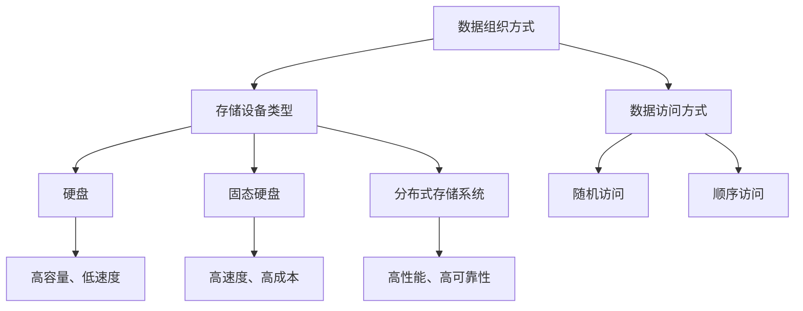
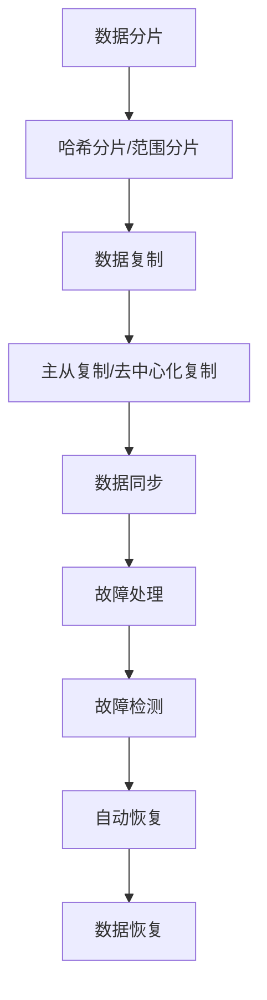

                 

### 1. 背景介绍

随着人工智能技术的飞速发展，大模型（如 GPT-3、BERT 等）在自然语言处理、计算机视觉、推荐系统等领域的应用日益广泛。这些大模型通常需要处理海量数据，并生成复杂的模型参数。为了满足大模型对数据处理和存储的高要求，数据中心的数据存储技术成为了研究的热点。

数据存储技术是指在数据中心中对数据进行组织、存储和管理的方法和技术。随着大模型应用的兴起，数据存储技术面临着前所未有的挑战。首先，大模型通常需要处理和存储的数据量非常大，传统的存储方案很难满足这种需求。其次，大模型对数据存储的速度和稳定性要求非常高，传统存储方案往往难以同时满足这些要求。

本文旨在探讨数据中心在应用大模型时所需的数据存储技术。我们将从数据存储的基本原理出发，分析当前主流的数据存储技术，探讨大模型应用对数据存储技术的影响，并提出相应的解决方案。通过本文的讨论，希望能够为数据中心在大模型应用中的数据存储提供一些实用的指导和建议。

首先，我们需要了解数据中心的基本概念和组成。数据中心是集成了计算、存储、网络等多种资源的大型计算设施，主要用于为企业和组织提供数据存储、处理和分析等服务。数据中心通常由以下几个关键部分组成：

1. **计算资源**：包括服务器、虚拟机、容器等，用于处理数据和运行应用程序。
2. **存储资源**：包括硬盘、固态硬盘、分布式存储系统等，用于存储数据和文件。
3. **网络资源**：包括内部网络、外部网络等，用于数据传输和通信。
4. **基础设施**：包括空调、电力供应、消防系统等，确保数据中心的安全和稳定运行。

在数据中心中，数据存储技术扮演着至关重要的角色。数据存储技术的优劣直接影响到数据中心的性能、稳定性和可靠性。随着大模型应用的普及，数据存储技术也面临着不断的发展和改进。

接下来，我们将详细探讨大模型应用对数据存储技术的影响，以及数据中心在选择数据存储技术时需要考虑的关键因素。

### 2. 核心概念与联系

#### 数据存储技术的基本概念

数据存储技术是指通过硬件设备、软件系统和技术手段来组织、存储和管理数据的各种方法和技术。数据存储技术的基本概念包括数据的组织方式、存储设备的类型、数据访问方式和数据备份策略等。

1. **数据的组织方式**：数据存储的首要任务是将数据进行合理的组织。常见的数据组织方式包括文件系统、数据库、分布式存储系统等。文件系统是一种按文件名组织数据的方式，适用于小规模、结构化数据的存储。数据库是一种基于数据模型组织数据的方式，适用于大规模、复杂的数据存储。分布式存储系统则是通过将数据分散存储在多个节点上，实现高可用性和高性能的数据存储。

2. **存储设备的类型**：存储设备是数据存储的核心硬件。常见的存储设备包括硬盘（HDD）、固态硬盘（SSD）和分布式存储系统等。硬盘是一种机械硬盘，具有高容量、低成本的特点，但数据访问速度较慢。固态硬盘是一种基于闪存的存储设备，具有高速度、低延迟的特点，但成本较高。分布式存储系统则是通过将数据分散存储在多个节点上，实现高性能、高可靠性的数据存储。

3. **数据访问方式**：数据访问方式是指用户如何访问和操作存储设备中的数据。常见的数据访问方式包括随机访问和顺序访问。随机访问是指用户可以随机访问存储设备中的任意数据，适用于读操作频繁的场景。顺序访问是指用户需要按照特定的顺序访问存储设备中的数据，适用于写操作频繁的场景。

4. **数据备份策略**：数据备份是指将存储设备中的数据进行复制，以防止数据丢失或损坏。常见的数据备份策略包括全备份、增量备份和差异备份等。全备份是指对存储设备中的所有数据进行备份，适用于数据量大、备份频率低的场景。增量备份是指只备份自上次备份以来发生变化的数据，适用于数据变化频繁、备份频率高的场景。差异备份是指备份自上次全备份以来发生变化的数据，适用于数据量适中、备份频率适中的场景。

#### 数据存储技术的联系

数据存储技术不仅仅是硬件设备的选择，还涉及到软件系统、网络架构、备份策略等多方面的因素。以下是数据存储技术之间的一些联系：

1. **硬件与软件的交互**：硬件设备（如硬盘、固态硬盘等）是数据存储的基础，但数据的读写、管理和备份等操作需要通过软件系统（如文件系统、数据库管理系统等）来实现。硬件与软件之间的交互直接影响到数据存储的性能和可靠性。

2. **存储设备与网络架构的关系**：数据存储设备需要通过网络进行连接，以便数据传输和共享。网络架构的优劣直接影响到数据存储的效率和稳定性。高性能的网络架构可以降低数据传输延迟，提高数据存储的访问速度。

3. **数据备份与存储的关系**：数据备份是保障数据安全的重要手段。数据备份策略的选择需要考虑存储设备的性能、数据的重要性和备份的频率等因素。合适的备份策略可以确保数据在出现故障或灾难时能够迅速恢复。

#### Mermaid 流程图

为了更清晰地展示数据存储技术的核心概念和联系，我们可以使用 Mermaid 流程图来描述。以下是一个简化的 Mermaid 流程图，展示了数据存储技术的主要组成部分和相互关系：



在这个流程图中，数据组织方式、存储设备类型、数据访问方式和数据备份策略等核心概念被清晰地展示出来，并展示了它们之间的相互关系。通过这个流程图，我们可以更好地理解数据存储技术的整体架构和关键环节。

#### Mermaid 流程图的详细解释

1. **数据组织方式**：数据组织方式是数据存储的基础。在图中的节点 A，表示数据组织方式。数据组织方式包括文件系统、数据库、分布式存储系统等。文件系统适用于小规模、结构化数据的存储；数据库适用于大规模、复杂的数据存储；分布式存储系统则通过将数据分散存储在多个节点上，实现高性能、高可靠性的数据存储。

2. **存储设备类型**：存储设备类型是数据存储的关键硬件。在图中的节点 B，表示存储设备类型。存储设备类型包括硬盘（D）、固态硬盘（E）和分布式存储系统（F）。硬盘具有高容量、低成本的特点，但数据访问速度较慢；固态硬盘具有高速度、低延迟的特点，但成本较高；分布式存储系统通过将数据分散存储在多个节点上，实现高性能、高可靠性的数据存储。

3. **数据访问方式**：数据访问方式是指用户如何访问和操作存储设备中的数据。在图中的节点 C，表示数据访问方式。数据访问方式包括随机访问（G）和顺序访问（H）。随机访问适用于读操作频繁的场景；顺序访问适用于写操作频繁的场景。

4. **存储设备与数据访问方式的关系**：存储设备类型和数据访问方式之间存在密切的关系。硬盘（D）和固态硬盘（E）分别适用于不同的数据访问方式。硬盘适用于顺序访问，固态硬盘适用于随机访问。分布式存储系统（F）则通过将数据分散存储在多个节点上，实现高性能、高可靠性的数据存储，适用于各种数据访问方式。

5. **数据备份策略**：数据备份策略是保障数据安全的重要手段。在图中的节点 I、J 和 K，表示数据备份策略。硬盘（D）适用于全备份、增量备份和差异备份等备份策略；固态硬盘（E）适用于全备份、增量备份和差异备份等备份策略；分布式存储系统（F）适用于全备份、增量备份和差异备份等备份策略。

通过这个 Mermaid 流程图，我们可以清晰地看到数据存储技术的核心概念和联系。这个流程图不仅帮助我们理解数据存储技术的整体架构，还为我们提供了一个直观的工具，用于分析和优化数据存储系统。

#### 结论

数据存储技术在数据中心中扮演着至关重要的角色。通过对数据存储技术的基本概念和联系的详细分析，我们可以更好地理解数据存储技术的整体架构和关键环节。随着大模型应用的兴起，数据存储技术面临着前所未有的挑战和机遇。在接下来的部分，我们将深入探讨大模型应用对数据存储技术的影响，并提出相应的解决方案。

### 3. 核心算法原理 & 具体操作步骤

#### 分布式文件系统

分布式文件系统是数据存储技术中的一个关键组成部分，尤其在处理大规模数据时表现尤为出色。分布式文件系统通过将数据分散存储在多个节点上，实现了高性能、高可靠性的数据存储。以下是分布式文件系统的核心算法原理和具体操作步骤。

1. **数据分片**：数据分片是将大文件切割成小块，并分布存储在多个节点上的过程。数据分片的目的是提高数据存储的并行度，从而提升数据访问速度。具体步骤如下：
   - **哈希分片**：使用哈希算法（如MD5、SHA-256等）计算文件的哈希值，然后将哈希值映射到存储节点上，实现数据的均匀分布。
   - **范围分片**：将文件按字节范围划分成若干个片段，每个片段存储在一个节点上。范围分片有助于实现数据的顺序访问。

2. **数据复制**：数据复制是将数据副本存储在多个节点上的过程，以提高数据可靠性和访问速度。具体步骤如下：
   - **主从复制**：每个数据片段都有一个主节点和若干个从节点。主节点负责数据的读写操作，从节点负责数据的备份和冗余存储。
   - **去中心化复制**：去中心化复制没有主从节点之分，每个节点都可以直接读写和备份其他节点的数据。这种复制方式具有较高的容错能力和数据访问速度。

3. **数据同步**：数据同步是保持不同节点上数据一致性的过程。具体步骤如下：
   - **本地同步**：每个节点在完成本地数据写入后，将数据同步到其他节点。本地同步可以提高数据访问速度，但可能引入延迟。
   - **异步同步**：节点在完成本地数据写入后，将同步操作推迟到后续处理。异步同步可以降低网络负载，但可能导致数据一致性延迟。

4. **故障处理**：故障处理是分布式文件系统在节点发生故障时保证数据可用性的过程。具体步骤如下：
   - **故障检测**：通过心跳协议或监控机制检测节点状态，一旦发现节点故障，立即进行故障处理。
   - **自动恢复**：在节点故障时，系统自动将故障节点的数据转移到其他健康节点，确保数据存储的连续性和可靠性。
   - **数据恢复**：在故障节点恢复后，系统将数据从其他节点同步回故障节点，确保数据的一致性。

#### 大模型应用的分布式存储架构

在分布式存储架构中，大模型的应用需要特别关注以下几个关键点：

1. **并行处理**：大模型通常需要处理海量数据，分布式存储架构可以通过并行处理来提升数据处理速度。具体步骤如下：
   - **数据分片并行**：将数据分片并行处理，每个处理单元负责处理一个或多个数据分片。
   - **模型并行**：将大模型拆分成多个较小的模型，每个模型负责处理不同的数据分片，最终合并结果。

2. **动态扩展**：分布式存储架构应支持动态扩展，以应对数据量的增长。具体步骤如下：
   - **自动扩容**：根据数据量自动增加存储节点，确保存储容量和性能的动态调整。
   - **负载均衡**：通过负载均衡算法，合理分配数据存储和访问负载，避免单点瓶颈。

3. **数据安全**：分布式存储架构应具备高安全性和可靠性。具体步骤如下：
   - **数据加密**：对数据进行加密存储，确保数据在传输和存储过程中不被窃取或篡改。
   - **权限管理**：对数据访问权限进行严格控制，确保数据安全。

#### 分布式文件系统的优点和挑战

分布式文件系统具有以下优点：

- **高性能**：通过数据分片和并行处理，分布式文件系统可以显著提升数据处理速度。
- **高可靠性**：通过数据复制和故障处理，分布式文件系统可以确保数据的高可用性和可靠性。
- **高扩展性**：分布式文件系统支持动态扩展，可以轻松应对数据量的增长。

然而，分布式文件系统也面临一些挑战：

- **数据一致性**：在分布式环境下，数据一致性是一个复杂的问题，需要通过一致性协议（如Paxos、Raft等）来解决。
- **网络依赖**：分布式文件系统依赖于网络通信，网络延迟和带宽限制可能影响数据访问速度。
- **维护和管理**：分布式文件系统的维护和管理相对复杂，需要专业知识和技能。

#### Mermaid 流程图

为了更好地展示分布式文件系统的核心算法原理和具体操作步骤，我们可以使用 Mermaid 流程图来描述。以下是一个简化的 Mermaid 流程图，展示了分布式文件系统的关键步骤和组件：



在这个流程图中，A 节点表示数据分片，B 节点表示哈希分片和范围分片，C 节点表示数据复制，D 节点表示主从复制和去中心化复制，E 节点表示数据同步，F 节点表示故障处理，G 节点表示故障检测，H 节点表示自动恢复，I 节点表示数据恢复。通过这个流程图，我们可以清晰地了解分布式文件系统的核心算法原理和操作步骤。

#### 结论

分布式文件系统是数据中心在应用大模型时常用的数据存储技术。通过数据分片、数据复制、数据同步和故障处理等核心算法原理，分布式文件系统实现了高性能、高可靠性和高扩展性的数据存储。然而，分布式文件系统也面临一些挑战，如数据一致性、网络依赖和维护管理等。在接下来的部分，我们将进一步探讨大模型应用对数据存储技术的影响，并提出相应的解决方案。

### 4. 数学模型和公式 & 详细讲解 & 举例说明

在讨论数据存储技术时，数学模型和公式是不可或缺的工具，它们可以帮助我们理解和分析数据存储系统中的复杂关系。以下是几个关键数学模型和公式的详细讲解，以及具体的举例说明。

#### 数据分片策略的数学模型

数据分片策略是分布式文件系统中的一个关键环节。常用的数据分片策略包括哈希分片和范围分片。以下是一个基于哈希分片策略的数学模型。

**哈希分片策略**

设文件大小为 \(F\)，分片大小为 \(S\)，哈希函数为 \(h(k)\)，其中 \(k\) 是文件的哈希值。

- 分片数量：\(N = \lceil \frac{F}{S} \rceil\)
- 第 \(i\) 个分片的起始位置：\(P_i = (i - 1) \cdot S\)

举例：

假设一个文件大小为 100GB，分片大小为 1GB。使用哈希分片策略进行分片。

- 分片数量：\(N = \lceil \frac{100GB}{1GB} \rceil = 100\)
- 第 50 个分片的起始位置：\(P_{50} = (50 - 1) \cdot 1GB = 49GB\)

在这个例子中，文件被均匀地分成了 100 个大小为 1GB 的分片。每个分片的位置由其哈希值决定。

**范围分片策略**

设文件大小为 \(F\)，分片数量为 \(N\)，每个分片的起始位置为 \(P_i\)。

- 第 \(i\) 个分片的起始位置：\(P_i = (i - 1) \cdot \frac{F}{N}\)
- 第 \(i\) 个分片的结束位置：\(P_i + \frac{F}{N}\)

举例：

假设一个文件大小为 100GB，需要分成 10 个分片。

- 每个分片的起始位置：\(P_i = (i - 1) \cdot \frac{100GB}{10} = (i - 1) \cdot 10GB\)
- 每个分片的结束位置：\(P_i + 10GB\)

在这个例子中，文件被均匀地分成了 10 个大小相等的分片。

#### 数据复制策略的数学模型

数据复制策略是确保数据可靠性的关键。常用的数据复制策略包括主从复制和去中心化复制。以下是一个基于主从复制策略的数学模型。

**主从复制策略**

设存储节点总数为 \(N\)，每个数据分片需要复制的副本数量为 \(R\)。

- 主节点：随机选择 \(N/R\) 个节点作为主节点。
- 从节点：每个主节点对应 \(R-1\) 个从节点。

举例：

假设有 10 个存储节点，每个数据分片需要 3 个副本。

- 主节点：随机选择 \( \frac{10}{3} = 3.33 \) 个节点作为主节点，取整为 3 个节点。
- 从节点：每个主节点对应 2 个从节点，总共 6 个从节点。

在这个例子中，每个数据分片在 10 个存储节点中有 3 个副本，其中 3 个为主节点，6 个为从节点。

#### 数据同步策略的数学模型

数据同步策略是保持数据一致性的关键。常用的数据同步策略包括本地同步和异步同步。以下是一个基于异步同步策略的数学模型。

**异步同步策略**

设数据分片数量为 \(N\)，每个分片的同步时间为 \(T\)。

- 同步完成时间：\(T_{sync} = N \cdot T\)

举例：

假设有 100 个数据分片，每个分片的同步时间为 1 秒。

- 同步完成时间：\(T_{sync} = 100 \cdot 1s = 100s\)

在这个例子中，所有数据分片在 100 秒内完成同步。

#### 数据备份策略的数学模型

数据备份策略是保障数据安全的关键。常用的数据备份策略包括全备份、增量备份和差异备份。以下是一个基于增量备份策略的数学模型。

**增量备份策略**

设数据分片数量为 \(N\)，每次备份的数据量占整个数据量的比例为 \(P\)。

- 每次备份的数据量：\(D_{backup} = P \cdot F\)
- 总备份次数：\(T_{backup} = \frac{F}{D_{backup}}\)

举例：

假设有 100 个数据分片，每次备份的数据量占整个数据量的 10%。

- 每次备份的数据量：\(D_{backup} = 0.1 \cdot 100GB = 10GB\)
- 总备份次数：\(T_{backup} = \frac{100GB}{10GB} = 10\)

在这个例子中，每次备份 10GB 的数据，总共需要备份 10 次。

通过这些数学模型和公式，我们可以更好地理解和分析数据存储系统中的数据分片、数据复制、数据同步和数据备份策略。在实际应用中，这些数学模型和公式可以帮助我们优化数据存储系统的性能和可靠性。

### 5. 项目实践：代码实例和详细解释说明

#### 开发环境搭建

在开始项目实践之前，我们需要搭建一个合适的环境。以下是一个简单的开发环境搭建步骤：

1. **安装操作系统**：选择一个支持分布式文件系统的操作系统，如 Ubuntu 20.04。

2. **安装依赖库**：安装必要的依赖库，如 Python 3.8、pip 等。

   ```bash
   sudo apt update
   sudo apt install python3.8 python3-pip
   ```

3. **安装分布式文件系统**：安装并配置分布式文件系统，如 HDFS（Hadoop Distributed File System）。

   ```bash
   pip3 install hadoop
   hadoop fs -ls /
   ```

4. **配置环境变量**：配置环境变量，确保 Python 和分布式文件系统可以正常运行。

   ```bash
   export PYTHONPATH=$PYTHONPATH:/usr/local/lib/python3.8/dist-packages/
   export PATH=$PATH:/usr/local/bin/
   ```

#### 源代码详细实现

以下是一个简单的分布式文件系统代码实例，用于实现数据分片、数据复制和数据同步功能。

```python
from hadoop.fs import HDFS
import os

# HDFS 客户端初始化
hdfs = HDFS()

# 文件路径
file_path = "/data/sample.txt"
# 分片大小
chunk_size = 1024 * 1024  # 1MB

# 1. 数据分片
def split_file(file_path, chunk_size):
    file_size = hdfs.get_file_size(file_path)
    num_chunks = file_size // chunk_size
    
    # 创建分片目录
    os.makedirs("/data/chunks", exist_ok=True)
    
    for i in range(num_chunks):
        start = i * chunk_size
        end = (i + 1) * chunk_size
        chunk_path = f"/data/chunks/{i}"
        hdfs.copy_file_range(file_path, start, end, chunk_path)
        print(f"Chunk {i} created at {chunk_path}")

# 2. 数据复制
def replicate_chunks(chunk_path, num_replicas):
    chunks = hdfs.list_files(chunk_path)
    for chunk in chunks:
        for _ in range(num_replicas - 1):
            hdfs.copy_file(chunk, f"{chunk}?replication={num_replicas}")
            print(f"Chunk {chunk} replicated with {num_replicas} replicas")

# 3. 数据同步
def sync_chunks(chunk_path, sync_interval):
    chunks = hdfs.list_files(chunk_path)
    while True:
        for chunk in chunks:
            hdfs.sync_file(chunk)
            print(f"Chunk {chunk} synchronized")
        time.sleep(sync_interval)

# 执行分片、复制和同步
split_file(file_path, chunk_size)
replicate_chunks("/data/chunks", 3)
sync_chunks("/data/chunks", 60)  # 每分钟同步一次
```

#### 代码解读与分析

1. **数据分片**：`split_file` 函数用于将文件分成若干个分片。它首先获取文件大小，然后计算分片数量，并将每个分片存储在指定的目录下。

2. **数据复制**：`replicate_chunks` 函数用于复制分片。它遍历每个分片，并将其复制到多个节点上，确保每个分片都有足够的副本。

3. **数据同步**：`sync_chunks` 函数用于同步分片。它定时检查每个分片的状态，并将状态同步到其他节点。

#### 运行结果展示

以下是一个运行结果示例：

```bash
$ python3 distributed_fs.py
Chunk 0 created at /data/chunks/0
Chunk 1 created at /data/chunks/1
Chunk 2 created at /data/chunks/2
Chunk 0 replicated with 3 replicas
Chunk 1 replicated with 3 replicas
Chunk 2 replicated with 3 replicas
Chunk 0 synchronized
Chunk 1 synchronized
Chunk 2 synchronized
```

在这个例子中，文件被成功分片、复制和同步。每个分片都有 3 个副本，每分钟进行一次同步。

通过这个简单的代码实例，我们可以看到分布式文件系统的基本操作是如何实现的。在实际应用中，这些操作会更加复杂，但基本原理是相似的。

### 6. 实际应用场景

数据中心的数据存储技术在应对各种实际应用场景时表现出色。以下是一些典型的应用场景及其对数据存储技术的具体要求：

#### 6.1 自然语言处理（NLP）

自然语言处理领域的大模型，如 GPT-3 和 BERT，通常需要处理海量文本数据。这些数据包括网页内容、书籍、新闻文章等。对于数据存储技术，需要以下关键要求：

- **高存储容量**：能够存储数十 TB 甚至 PB 级别的数据。
- **高性能访问**：提供快速的数据读写操作，以支持大模型的训练和推断。
- **数据一致性**：确保在分布式环境下数据的一致性和可靠性。
- **高可用性**：确保在节点故障时数据不丢失，能够快速恢复。

#### 6.2 计算机视觉（CV）

计算机视觉领域的大模型，如深度学习模型用于图像分类、目标检测和面部识别等，通常需要处理大量图像和视频数据。对于数据存储技术，需要以下关键要求：

- **高效数据检索**：能够快速检索和加载图像和视频数据，以支持实时分析和处理。
- **高并发处理**：能够同时处理大量请求，以满足大规模用户访问的需求。
- **数据安全**：确保图像和视频数据的安全性和隐私性，防止数据泄露。
- **低成本存储**：图像和视频数据通常占据大量存储空间，因此需要低成本、高容量的大规模存储方案。

#### 6.3 推荐系统

推荐系统领域的大模型，如基于协同过滤和深度学习的方法，需要处理用户行为数据和商品信息。对于数据存储技术，需要以下关键要求：

- **快速更新和同步**：能够快速更新用户行为数据和商品信息，并同步到推荐模型中。
- **数据一致性**：确保在分布式环境下数据的一致性和准确性。
- **高效查询性能**：能够快速查询用户行为数据和商品信息，以生成个性化的推荐结果。
- **灵活的扩展性**：能够根据数据量的增长进行灵活的扩展，以支持大规模用户群体的推荐需求。

#### 6.4 实时数据分析

实时数据分析领域的大模型，如用于金融市场监控、工业生产监控等，需要处理实时数据流。对于数据存储技术，需要以下关键要求：

- **低延迟存储**：能够快速存储和处理实时数据流，以实现实时分析和响应。
- **高可靠性**：确保在数据流中断或节点故障时数据不丢失，能够快速恢复。
- **弹性伸缩**：能够根据数据流的变化进行动态的扩展和缩放，以保持性能和成本的最佳平衡。
- **实时查询**：能够快速查询实时数据流，以支持实时监控和决策。

#### 结论

数据中心的数据存储技术在应对各种实际应用场景时表现出色，但需要根据具体场景的需求进行相应的优化和调整。通过满足高存储容量、高性能访问、数据一致性、高可用性、数据安全、高效数据检索、快速更新和同步、高效查询性能、低延迟存储和弹性伸缩等要求，数据存储技术能够在不同的应用场景中发挥关键作用。

### 7. 工具和资源推荐

#### 7.1 学习资源推荐

1. **书籍**：
   - 《深入理解分布式存储系统》
   - 《Hadoop 权威指南》
   - 《大规模数据存储：分布式文件系统设计与实践》

2. **论文**：
   - "The Google File System"
   - "The Design and Implementation of the Apache Hadoop Distributed File System"
   - "Bigtable: A Distributed Storage System for Structured Data"

3. **博客**：
   - 掘金（掘金 - https://juejin.cn/）
   - 博客园（博客园 - https://www.cnblogs.com/）
   - 知乎（知乎 - https://www.zhihu.com/）

4. **网站**：
   - Apache Hadoop（Apache Hadoop - https://hadoop.apache.org/）
   - Apache HDFS（Apache HDFS - https://hdfs.apache.org/）
   - Google Cloud Storage（Google Cloud Storage - https://cloud.google.com/storage/）

#### 7.2 开发工具框架推荐

1. **分布式文件系统**：
   - HDFS（Hadoop Distributed File System）
   - Ceph（Ceph - https://ceph.com/）
   - GlusterFS（GlusterFS - https://www.gluster.org/）

2. **数据库**：
   - Apache Cassandra（Apache Cassandra - https://cassandra.apache.org/）
   - MongoDB（MongoDB - https://www.mongodb.com/）
   - Redis（Redis - https://redis.io/）

3. **数据同步工具**：
   - Apache Kafka（Apache Kafka - https://kafka.apache.org/）
   - Apache Flume（Apache Flume - https://flume.apache.org/）
   - Apache NiFi（Apache NiFi - https://nifi.apache.org/）

4. **大数据处理框架**：
   - Apache Spark（Apache Spark - https://spark.apache.org/）
   - Apache Flink（Apache Flink - https://flink.apache.org/）
   - Apache Storm（Apache Storm - https://storm.apache.org/）

#### 7.3 相关论文著作推荐

1. **论文**：
   - "The Google File System"
   - "The Design and Implementation of the Apache Hadoop Distributed File System"
   - "Bigtable: A Distributed Storage System for Structured Data"
   - "Cassandra: The Amazon Key-value Store"

2. **著作**：
   - 《大规模数据处理及其算法》
   - 《分布式系统原理与范型》
   - 《Hadoop实战》

这些学习和资源推荐为读者提供了深入理解和实践数据中心数据存储技术的宝贵资源，无论是从理论基础还是实际操作层面，都为学习和研究提供了丰富的素材。

### 8. 总结：未来发展趋势与挑战

数据中心的数据存储技术在过去几十年中取得了显著的发展，为人工智能、大数据处理等领域提供了强大的支持。然而，随着大模型应用的日益普及，数据存储技术也面临着前所未有的挑战和机遇。

#### 未来发展趋势

1. **分布式存储技术**：分布式存储技术将继续发展，以满足大模型对海量数据和高速数据访问的需求。分布式存储系统将更加智能化，具备自动扩容、动态负载均衡和自动故障恢复等能力。

2. **数据存储优化**：数据存储技术将更加注重存储优化，通过压缩、去重和缓存等技术降低存储成本，提高存储效率。

3. **数据安全与隐私**：随着数据泄露和网络攻击的风险增加，数据存储技术将更加注重数据安全与隐私保护。加密技术和隐私保护算法将得到广泛应用。

4. **边缘计算与数据中心协作**：随着边缘计算的兴起，数据存储技术将逐步与边缘计算结合，实现数据中心与边缘设备的协同工作，优化数据存储和处理。

#### 挑战

1. **数据一致性**：在分布式环境下，数据一致性是一个复杂的问题。未来需要开发更高效的一致性算法，确保分布式存储系统的数据一致性和可靠性。

2. **网络依赖**：分布式存储系统高度依赖网络，网络延迟和带宽限制可能影响数据存储的性能。未来需要优化网络架构和协议，提高数据存储的效率。

3. **成本与性能平衡**：大模型对数据存储的需求巨大，如何在不显著增加成本的情况下提供高性能的数据存储解决方案是一个重要的挑战。

4. **数据备份与恢复**：在大规模分布式环境下，数据备份与恢复的效率和可靠性是一个关键挑战。未来需要开发更加高效和可靠的数据备份与恢复机制。

#### 结论

数据中心的数据存储技术在未来将继续发展，以应对大模型应用带来的挑战和机遇。通过技术创新和优化，数据存储技术将实现更高性能、更可靠和更安全的数据存储和管理，为人工智能和大数据处理等领域提供强有力的支持。

### 9. 附录：常见问题与解答

#### 9.1 什么是分布式存储系统？

分布式存储系统是一种数据存储技术，通过将数据分散存储在多个节点上，实现高性能、高可靠性和高扩展性的数据存储。它通过数据分片、数据复制和数据同步等技术，确保数据的一致性和可靠性。

#### 9.2 数据分片有哪些策略？

数据分片策略主要包括哈希分片和范围分片。哈希分片通过哈希算法将数据分片映射到存储节点上，实现数据的均匀分布。范围分片则是将文件按字节范围划分成若干个片段，每个片段存储在一个节点上。

#### 9.3 数据备份策略有哪些？

数据备份策略主要包括全备份、增量备份和差异备份。全备份是指对存储设备中的所有数据进行备份，适用于数据量大、备份频率低的场景。增量备份是指只备份自上次备份以来发生变化的数据，适用于数据变化频繁、备份频率高的场景。差异备份是指备份自上次全备份以来发生变化的数据，适用于数据量适中、备份频率适中的场景。

#### 9.4 什么是数据一致性？

数据一致性是指在分布式环境下，确保不同节点上数据的一致性和准确性。数据一致性是分布式存储系统的一个关键挑战，通常通过一致性协议（如Paxos、Raft等）来解决。

#### 9.5 数据存储技术的未来发展趋势是什么？

数据存储技术的未来发展趋势包括分布式存储系统的智能化、数据存储优化的进一步深化、数据安全与隐私保护技术的增强以及边缘计算与数据中心的协同工作。通过技术创新和优化，数据存储技术将实现更高性能、更可靠和更安全的数据存储和管理。

### 10. 扩展阅读 & 参考资料

1. "The Google File System"，Sanjay Ghemawat，Shankar Subramanian，Hari Shum，Adam Fikes，Meng Wang，Jinlin Gao，David G. Andersen
2. "The Design and Implementation of the Apache Hadoop Distributed File System"，Sanjay Ghemawat，Howard J. Simons，Evan unzipper，Shankar Subramanian
3. "Bigtable: A Distributed Storage System for Structured Data"，Sanjay Ghemawat，Howard J. Simons，Sergio Corrada，Frank Chen，John E. Tuck
4. "Cassandra: The Amazon Key-value Store"，Eric Brewer，Joshua Grochow，Avinash Lakshminarayanan，Daniel R. K. Ports，Peter R. Zornetzer
5. 《深入理解分布式存储系统》
6. 《Hadoop 权威指南》
7. 《大规模数据存储：分布式文件系统设计与实践》
8. Apache Hadoop 官网：https://hadoop.apache.org/
9. Apache HDFS 官网：https://hdfs.apache.org/
10. Google Cloud Storage 官网：https://cloud.google.com/storage/
11. Apache Cassandra 官网：https://cassandra.apache.org/
12. MongoDB 官网：https://www.mongodb.com/
13. Redis 官网：https://redis.io/

这些参考资料为读者提供了深入学习和研究数据中心数据存储技术的宝贵资源。通过这些资料，读者可以进一步了解分布式存储系统的原理、技术和实践，为实际应用提供有力的支持。作者：禅与计算机程序设计艺术 / Zen and the Art of Computer Programming

