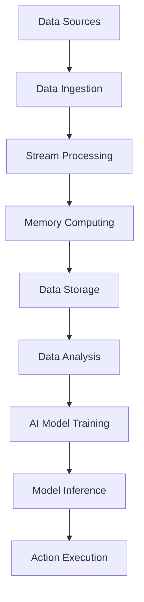

                 

### 背景介绍 Background

随着人工智能（AI）技术的飞速发展，大模型（Large-scale Models）的应用越来越广泛。大模型，通常指的是拥有数十亿、甚至千亿参数的深度学习模型，如Transformer模型家族中的BERT、GPT等。这些大模型在自然语言处理（NLP）、计算机视觉（CV）、语音识别等多个领域取得了显著的成果。然而，大模型的训练和推理都需要大量的计算资源和数据传输，这对数据中心的数据流处理提出了新的挑战。

数据中心的数据流处理涉及到数据的采集、存储、处理和分发等多个环节。在传统数据中心，数据流处理通常是通过批处理（Batch Processing）的方式进行的，即数据被定期批量处理，处理结果随后被存储或传输。这种方式在处理大规模数据时存在延迟和吞吐量瓶颈。随着AI大模型的应用，对实时性、低延迟和高吞吐量的数据处理需求日益增加，传统的批处理方式已经无法满足需求。

为了应对这一挑战，业界提出了一系列新的数据流处理技术，如流处理（Stream Processing）和内存计算（In-Memory Computing）。流处理技术可以实时处理数据流，提供低延迟的处理能力，但面临着复杂性和资源消耗的问题。内存计算技术则利用内存的快速读写特性，提供高速的数据处理能力，但受限于内存的容量。因此，如何高效地处理数据中心的大模型应用数据流，成为了一个亟待解决的问题。

本文将深入探讨AI大模型应用数据中心的数据流处理技术，包括其核心概念、算法原理、数学模型、实践案例和未来趋势。希望通过本文的阐述，能为读者提供全面而深入的理解，并为其在实际应用中提供指导。

---

#### 1.1 数据中心的数据流处理需求 Data Stream Processing Needs in Data Centers

在AI大模型的应用背景下，数据中心的数据流处理需求具有几个显著的特点：

首先是 **实时性和低延迟**。AI大模型的推理往往需要在极短的时间内完成，例如在自动驾驶系统中，实时处理来自摄像头和传感器的数据以做出快速反应。传统批处理方式由于需要等待数据集的完整收集和聚合，难以满足这种低延迟的要求。流处理技术的引入，使得数据中心能够实时处理数据流，及时响应。

其次是 **高吞吐量**。大模型的应用场景中，往往需要处理海量的数据。例如，在电商平台，实时分析数百万用户的购物行为以推荐商品，就需要高吞吐量的数据处理能力。流处理和内存计算技术的结合，可以大幅提升数据处理速度，满足大规模数据的高吞吐量需求。

第三是 **复杂性和多样性**。AI大模型的应用场景多样化，涉及多种数据类型和复杂的处理逻辑。例如，在医疗领域，AI模型需要处理结构化和非结构化数据，如病历记录、医疗影像和医生笔记，这要求数据中心的数据流处理系统具备高度灵活性和扩展性。

为了满足这些需求，数据中心的数据流处理面临以下挑战：

1. **数据规模和速度**：随着AI大模型的应用场景扩展，数据规模和速度不断增加。数据中心需要处理PB级别的数据，同时处理速度要求达到毫秒级。

2. **资源管理**：大模型的数据处理需要大量的计算资源和内存资源。如何高效地管理这些资源，最大化利用，是一个重要的挑战。

3. **数据处理流程优化**：数据流处理通常包括数据采集、清洗、转换、存储和分发等环节。如何优化这些流程，减少延迟，提高效率，是数据中心需要解决的问题。

4. **系统稳定性和可靠性**：在大规模数据流处理中，系统可能会面临各种异常情况，如数据丢失、延迟和网络故障等。如何保障系统的稳定性和可靠性，是数据中心必须面对的问题。

为了应对这些挑战，数据中心采用了多种技术手段，如分布式计算、分布式存储、流处理框架和内存计算等。这些技术不仅提高了数据处理能力，还增强了系统的灵活性和扩展性。然而，如何在实际应用中高效地应用这些技术，仍需要深入的研究和探索。

---

#### 1.2 AI大模型与数据流处理的紧密联系 The Close Connection Between Large-scale AI Models and Data Stream Processing

AI大模型与数据流处理之间的紧密联系，主要体现在以下几个方面：

首先是 **数据的依赖性**。AI大模型通常需要海量的训练数据来提高模型的性能和泛化能力。这些数据不仅包括结构化数据，如表格、数据库等，还包括非结构化数据，如图像、音频和文本等。数据流处理技术可以实时采集、传输和更新这些数据，为AI大模型提供充足和新鲜的数据资源。

其次是 **处理的需求**。AI大模型在训练和推理过程中，需要对数据进行复杂的计算和处理。例如，自然语言处理中的Transformer模型，需要处理大量的文本数据，进行词嵌入、上下文编码和解码等操作。数据流处理技术通过提供低延迟和高吞吐量的数据处理能力，可以满足AI大模型在实时性和效率方面的需求。

再次是 **优化的可能性**。数据流处理技术，如流处理框架和内存计算，提供了一种灵活且高效的数据处理方式。通过优化数据流处理流程，数据中心可以实现更快的模型训练和推理速度，提高AI大模型的性能和效率。例如，流处理框架可以利用并行处理和分布式计算的优势，加快数据处理速度；内存计算则可以利用内存的快速读写特性，减少数据访问延迟。

为了更好地理解AI大模型与数据流处理之间的联系，我们可以通过一个实际应用场景来具体分析。以自动驾驶系统为例，该系统需要实时处理来自摄像头、雷达和激光雷达等传感器的海量数据。这些数据包括道路情况、车辆位置、行人行为等，对于AI大模型的决策至关重要。

首先，数据流处理技术可以实时采集和传输传感器数据，确保AI大模型能够获取到最新的环境信息。通过流处理框架，数据中心可以快速处理传感器数据，提取关键特征，并将其传递给AI大模型。

其次，AI大模型利用这些实时数据，进行复杂的推理和决策。例如，通过深度学习算法，AI模型可以识别道路标志、交通信号灯和行人，并根据这些信息做出驾驶决策。这个过程需要高效的数据流处理技术来支撑，以确保模型能够在毫秒级内完成推理。

最后，AI大模型的处理结果，如驾驶建议和行动指令，需要被实时传输给车辆控制系统。数据流处理技术可以确保这些结果能够快速且准确地传递给车辆，从而实现自动驾驶的实时性。

综上所述，AI大模型与数据流处理之间的紧密联系，不仅体现在数据的依赖性和处理的需求上，还体现在优化的可能性上。通过合理利用数据流处理技术，数据中心可以大幅提升AI大模型的应用效果，推动人工智能在各个领域的深入发展。

---

#### 1.3 数据流处理的关键技术和挑战 Key Technologies and Challenges in Data Stream Processing

数据流处理是数据中心处理大规模实时数据的关键技术，它对AI大模型的应用起到了重要的支撑作用。以下是数据流处理的关键技术和面临的挑战：

首先是 **流处理框架**。流处理框架如Apache Kafka、Apache Flink和Apache Storm等，提供了一种高效、可靠的数据流处理解决方案。这些框架能够实时处理数据流，确保数据在传输和处理过程中的低延迟和高吞吐量。然而，流处理框架也面临着复杂性和资源消耗的问题。如何优化流处理框架，提高其性能和可扩展性，是一个重要的挑战。

其次是 **分布式计算**。分布式计算技术，如MapReduce和Hadoop，能够将数据处理任务分布到多个节点上进行并行处理，提高数据处理效率和吞吐量。在大规模AI模型应用中，分布式计算技术可以大幅减少单点故障的风险，提高系统的可靠性。然而，分布式计算也面临着数据一致性和容错性的挑战。如何保证数据的一致性，以及如何处理节点故障，是一个重要的技术难题。

第三是 **内存计算**。内存计算技术，如Apache Ignite和Memcached，利用内存的快速读写特性，提供高速的数据处理能力。与传统的磁盘存储相比，内存计算可以显著降低数据访问延迟，提高数据处理速度。在大规模AI模型应用中，内存计算技术可以大幅提升模型的推理速度和效率。然而，内存计算也面临着内存容量和成本的限制。如何优化内存管理，提高内存利用率，是一个重要的挑战。

除了上述关键技术，数据流处理还面临着其他挑战：

1. **数据质量管理**：数据流处理需要确保数据的质量，包括数据的完整性、准确性和一致性。然而，在实际应用中，数据往往存在噪声、缺失和不一致性等问题。如何有效地进行数据清洗和预处理，确保数据质量，是一个重要的挑战。

2. **实时性保障**：实时性是数据流处理的核心要求之一。如何保证数据在传输和处理过程中的实时性，确保数据在规定时间内得到处理和响应，是一个重要的挑战。特别是在处理大规模实时数据时，如何优化数据处理流程，减少延迟，是一个关键问题。

3. **系统扩展性**：随着数据规模的不断扩大，数据流处理系统需要具备良好的扩展性，能够动态调整计算资源和存储资源，以满足不断增长的数据处理需求。如何设计一个可扩展、灵活的数据流处理系统，是一个重要的技术挑战。

综上所述，数据流处理技术在AI大模型应用中具有重要意义，但同时也面临着复杂性和资源消耗的挑战。通过深入研究和应用这些关键技术，数据中心可以更好地应对这些挑战，实现高效、稳定和可靠的数据流处理。

---

### 核心概念与联系 Core Concepts and Connections

在深入探讨AI大模型应用数据中心的数据流处理之前，我们需要明确几个核心概念及其相互之间的联系。这些核心概念包括流处理、内存计算、分布式计算和大数据存储，它们共同构成了数据流处理技术的基础。

#### 流处理 (Stream Processing)

流处理是一种处理数据流的技术，能够实时分析数据，并快速产生结果。在流处理中，数据被视为一系列连续的事件，每个事件在时间上有序且不间断。流处理框架，如Apache Kafka、Apache Flink和Apache Storm，通过分布式架构和并行处理，确保数据在传输和处理过程中的低延迟和高吞吐量。

流处理与AI大模型应用之间的联系主要体现在以下几个方面：

1. **实时数据处理**：流处理技术能够实时捕获和更新数据，确保AI大模型能够获取到最新的环境信息，从而做出更加准确的决策。例如，自动驾驶系统需要实时处理来自传感器的高速数据流，以实现实时驾驶。

2. **低延迟响应**：流处理技术可以显著降低数据处理延迟，满足AI大模型在实时性和响应速度方面的需求。例如，在金融交易系统中，流处理可以实时分析交易数据，及时识别潜在的风险，并做出快速响应。

3. **大规模数据处理**：流处理框架具有高吞吐量处理能力，能够处理大规模数据流，为AI大模型提供充足的数据资源。例如，在电商平台，流处理可以实时处理数百万用户的购物行为数据，进行个性化推荐。

#### 内存计算 (In-Memory Computing)

内存计算是一种利用内存的快速读写特性，进行高速数据处理的计算技术。与传统的磁盘存储相比，内存具有更快的读写速度和更低的访问延迟。内存计算技术，如Apache Ignite和Memcached，通过将数据存储在内存中，提供了一种高效、快速的数据处理解决方案。

内存计算与流处理技术紧密相关，它们共同构成了高效数据流处理的基础：

1. **数据存储与访问**：内存计算可以将数据存储在内存中，显著降低数据访问延迟，提高数据处理速度。与流处理技术结合，内存计算可以提供更加快速的数据处理能力，满足AI大模型在实时性和效率方面的需求。

2. **数据缓存**：内存计算技术可以用于数据缓存，提高数据访问速度。在AI大模型应用中，数据缓存可以显著减少数据重复读取的次数，降低数据处理延迟，提高系统的整体性能。

3. **大数据处理**：内存计算具有高吞吐量处理能力，能够处理大规模数据流。与流处理技术结合，内存计算可以提供高效的数据处理解决方案，满足AI大模型在数据处理速度和吞吐量方面的需求。

#### 分布式计算 (Distributed Computing)

分布式计算是一种通过将计算任务分布在多个节点上进行并行处理的技术，以提高计算效率和扩展性。分布式计算框架，如MapReduce和Hadoop，通过分布式架构和并行处理，能够处理大规模数据，并提高系统的可靠性。

分布式计算与数据流处理技术密切相关，它们共同构成了高效、可靠的数据流处理系统：

1. **并行处理**：分布式计算通过将任务分布到多个节点上进行并行处理，可以显著提高数据处理速度。在AI大模型应用中，分布式计算可以并行处理海量数据，提高模型的训练和推理速度。

2. **容错性**：分布式计算通过多个节点并行处理，可以提供更高的容错性。在数据流处理过程中，节点可能会出现故障，分布式计算可以通过其他节点继续处理任务，确保系统的稳定性和可靠性。

3. **数据一致性**：分布式计算通过分布式存储和并行处理，可以实现数据的一致性。在AI大模型应用中，数据的一致性对于模型的训练和推理至关重要。分布式计算可以确保数据的一致性，提高模型的准确性和稳定性。

#### 大数据存储 (Big Data Storage)

大数据存储是一种用于存储海量数据的技术，能够处理PB级别甚至EB级别的大数据。大数据存储系统，如Hadoop Distributed File System (HDFS) 和 Apache Cassandra，通过分布式存储和并行处理，提供高效、可靠的数据存储解决方案。

大数据存储与数据流处理技术密切相关，它们共同构成了大数据处理的基础：

1. **海量数据存储**：大数据存储技术能够存储海量数据，为AI大模型提供充足的数据资源。在数据流处理过程中，大数据存储技术可以存储和检索大规模数据流，确保数据的完整性和可用性。

2. **数据持久化**：大数据存储技术可以将数据持久化，确保数据在系统故障或中断后仍然可用。在AI大模型应用中，数据持久化对于保障模型的训练和推理结果至关重要。

3. **数据一致性**：大数据存储技术通过分布式存储和并行处理，可以实现数据的一致性。在数据流处理过程中，数据的一致性对于模型的训练和推理至关重要。大数据存储技术可以确保数据的一致性，提高模型的准确性和稳定性。

#### Mermaid 流程图 (Mermaid Flowchart)

为了更直观地展示这些核心概念之间的联系，我们可以使用Mermaid流程图来表示。以下是一个简化的Mermaid流程图，展示了流处理、内存计算、分布式计算和大数据存储之间的相互关系：



在这个流程图中，数据源（A）通过数据采集（B）将数据传输到流处理（C），流处理再将数据传输到内存计算（D）进行高速处理。处理后数据存储到大数据存储（E）中，以便后续的数据分析和AI模型训练（G）。训练好的模型进行推理（H），最后将结果用于执行具体动作（I）。

通过这个流程图，我们可以更清晰地理解数据流处理技术在AI大模型应用中的关键作用和相互关系。在实际应用中，这些技术相互协作，共同支撑起高效、稳定和可靠的数据流处理系统。

---

### 核心算法原理 & 具体操作步骤 Core Algorithm Principles & Detailed Steps

在深入探讨AI大模型应用数据中心的数据流处理技术时，理解核心算法原理和具体操作步骤至关重要。以下将详细解释流处理、内存计算和分布式计算在数据流处理中的应用原理，并展示具体的操作步骤。

#### 流处理技术 (Stream Processing)

流处理技术是数据流处理的核心，它能够实时分析数据，并提供低延迟的响应。以下为流处理技术的基本原理和操作步骤：

**原理：**

流处理技术将数据视为一系列连续的事件流，通过对事件流进行实时处理，生成实时分析结果。流处理框架通常基于分布式计算模型，能够处理大规模数据流，并确保数据在传输和处理过程中的低延迟和高吞吐量。

**操作步骤：**

1. **数据采集**：数据采集是流处理的第一步，通过传感器、日志文件或其他数据源，将数据实时传输到流处理系统。例如，在自动驾驶系统中，摄像头、雷达和激光雷达等传感器可以实时捕获道路和车辆信息。

2. **数据传输**：采集到的数据通过流处理框架进行传输，例如Apache Kafka。Kafka是一种分布式消息队列系统，能够确保数据的可靠传输和实时性。

3. **数据处理**：数据到达流处理系统后，被实时处理。流处理框架通过并行处理和分布式计算，实现对数据流的快速分析。例如，Apache Flink 提供了丰富的数据处理操作，如过滤、转换、聚合和窗口操作。

4. **数据处理结果输出**：处理后的数据结果可以实时输出，用于进一步分析或决策。例如，在金融交易系统中，流处理可以实时分析交易数据，识别异常交易并进行风险控制。

**示例操作：**

以Apache Flink为例，以下是一个简单的流处理操作步骤：

1. **环境配置**：安装和配置Apache Flink环境，确保能够正常运行。

2. **编写数据处理代码**：使用Flink提供的API，编写数据处理程序，实现数据采集、传输和处理的逻辑。

3. **部署运行**：将数据处理程序部署到Flink集群，并启动运行。例如，可以使用Flink的命令行工具或编程接口（如Java/Scala）来启动程序。

4. **监控和调试**：在程序运行过程中，监控数据流和处理结果，进行实时调试和优化。

#### 内存计算技术 (In-Memory Computing)

内存计算技术通过将数据存储在内存中，提供高速的数据处理能力。以下为内存计算技术的基本原理和操作步骤：

**原理：**

内存计算技术利用内存的快速读写特性，显著降低数据访问延迟。内存计算系统通常包括内存存储、内存数据库和内存缓存，能够实现高速的数据读写和处理。

**操作步骤：**

1. **数据存储**：将数据存储在内存数据库或内存缓存中。例如，使用Apache Ignite作为内存数据库，将数据存储在内存中。

2. **数据读写**：通过内存数据库或缓存，实现数据的快速读写。例如，使用内存缓存进行数据查询，减少磁盘IO操作，提高查询速度。

3. **数据处理**：在内存中进行数据处理操作，如数据过滤、转换和聚合等。由于数据存储在内存中，数据处理速度显著提高。

4. **数据处理结果输出**：处理后的数据结果可以存储在内存中或其他存储系统中，用于进一步分析或决策。

**示例操作：**

以Apache Ignite为例，以下是一个简单的内存计算操作步骤：

1. **环境配置**：安装和配置Apache Ignite环境，确保能够正常运行。

2. **数据存储**：使用Ignite的Java API，将数据存储到内存数据库中。

3. **数据读写**：编写代码，通过Ignite进行数据读写操作，实现数据的快速访问和处理。

4. **数据处理**：使用Ignite提供的内存计算功能，进行数据处理操作，如数据过滤和聚合。

5. **数据处理结果输出**：将处理结果存储在内存数据库或其他存储系统中，用于进一步分析或决策。

#### 分布式计算技术 (Distributed Computing)

分布式计算技术通过将计算任务分布到多个节点上进行并行处理，提高计算效率和扩展性。以下为分布式计算技术的基本原理和操作步骤：

**原理：**

分布式计算技术将大规模计算任务分布到多个节点上进行并行处理，通过分布式架构和并行计算，实现高效的数据处理和计算。分布式计算框架，如MapReduce和Hadoop，提供了分布式存储和并行处理的能力，能够处理大规模数据。

**操作步骤：**

1. **任务分发**：将大规模计算任务分布到多个节点上，每个节点负责一部分计算任务。

2. **并行处理**：节点之间通过分布式计算框架进行并行计算，每个节点独立处理其分配的任务。

3. **数据聚合**：计算完成后，将各个节点的结果进行数据聚合，生成最终的计算结果。

4. **结果输出**：将最终的计算结果输出到存储系统或数据库中，用于进一步分析或决策。

**示例操作：**

以Hadoop为例，以下是一个简单的分布式计算操作步骤：

1. **环境配置**：安装和配置Hadoop环境，确保能够正常运行。

2. **数据存储**：使用Hadoop的分布式文件系统（HDFS），将数据存储到分布式存储系统中。

3. **编写MapReduce程序**：使用Java编写MapReduce程序，实现数据分片、映射和减少等操作。

4. **部署运行**：将MapReduce程序部署到Hadoop集群，并启动运行。

5. **监控和调试**：在程序运行过程中，监控计算任务的状态和进度，进行实时调试和优化。

通过上述核心算法原理和具体操作步骤，我们可以更好地理解数据流处理技术在AI大模型应用数据中心中的重要作用。在实际应用中，这些技术相互协作，共同支撑起高效、稳定和可靠的数据流处理系统。

---

### 数学模型和公式 Mathematical Models and Formulas

在数据流处理中，数学模型和公式起到了关键作用，能够帮助我们理解数据处理的本质和优化数据处理策略。以下将详细讲解流处理、内存计算和分布式计算中的常见数学模型和公式，并通过具体示例进行说明。

#### 流处理中的数学模型 Mathematical Models in Stream Processing

流处理技术中的数学模型主要用于描述数据流的特征、处理方法和优化策略。以下是一些常见的数学模型和公式：

1. **窗口函数 (Window Functions)**：
   窗口函数用于对数据流进行分组和聚合。常见的窗口函数包括滑动窗口（Sliding Window）和固定窗口（Fixed Window）。

   **滑动窗口公式**：
   $$ 
   w(t) = \{x \in S \mid x \in [t-w, t)\}
   $$
   其中，$w(t)$ 表示在时间 $t$ 的滑动窗口，$S$ 是数据流集合，$w$ 是窗口大小。

   **固定窗口公式**：
   $$ 
   w(t) = \{x \in S \mid x \in [t-w, t+w]\}
   $$
   其中，$w(t)$ 表示在时间 $t$ 的固定窗口。

2. **数据流统计模型 (Stream Statistical Models)**：
   数据流统计模型用于描述数据流的统计特性，如均值、方差和标准差。

   **均值公式**：
   $$ 
   \mu_t = \frac{1}{n} \sum_{i=1}^{n} x_i
   $$
   其中，$\mu_t$ 表示时间 $t$ 的数据流均值，$x_i$ 表示第 $i$ 个数据点，$n$ 是数据点数量。

   **方差公式**：
   $$ 
   \sigma^2_t = \frac{1}{n-1} \sum_{i=1}^{n} (x_i - \mu_t)^2
   $$
   其中，$\sigma^2_t$ 表示时间 $t$ 的数据流方差。

   **标准差公式**：
   $$ 
   \sigma_t = \sqrt{\sigma^2_t}
   $$

3. **时间序列模型 (Time Series Models)**：
   时间序列模型用于描述数据流的时序特性，如自回归模型（AR）、移动平均模型（MA）和自回归移动平均模型（ARMA）。

   **自回归模型公式**：
   $$ 
   x_t = c + \sum_{i=1}^{p} \phi_i x_{t-i}
   $$
   其中，$x_t$ 表示时间 $t$ 的数据点，$c$ 是常数项，$\phi_i$ 是自回归系数，$p$ 是滞后阶数。

   **移动平均模型公式**：
   $$ 
   x_t = c + \theta_1 x_{t-1} + \theta_2 x_{t-2} + \cdots + \theta_q x_{t-q}
   $$
   其中，$c$ 是常数项，$\theta_i$ 是移动平均系数，$q$ 是滞后阶数。

   **自回归移动平均模型公式**：
   $$ 
   x_t = c + \phi_1 x_{t-1} + \cdots + \phi_p x_{t-p} + \theta_1 x_{t-1} + \cdots + \theta_q x_{t-q}
   $$

#### 内存计算中的数学模型 Mathematical Models in In-Memory Computing

内存计算技术中的数学模型主要用于优化数据存储和访问策略，提高数据处理速度。以下是一些常见的数学模型和公式：

1. **缓存替换算法 (Cache Replacement Algorithms)**：
   缓存替换算法用于在有限的缓存容量内，选择最合适的数据进行缓存。常见的缓存替换算法包括最少使用（LRU）和最近最少使用（LFU）。

   **LRU公式**：
   $$ 
   LRU(t) = \arg\max_{x} \{ \text{last access time of } x \}
   $$
   其中，$LRU(t)$ 表示在时间 $t$ 时的最少使用缓存项。

   **LFU公式**：
   $$ 
   LFU(t) = \arg\max_{x} \{ \text{frequency of access of } x \}
   $$
   其中，$LFU(t)$ 表示在时间 $t$ 时的最少使用缓存项。

2. **数据分布模型 (Data Distribution Models)**：
   数据分布模型用于描述数据的分布特性，如正态分布（Normal Distribution）和指数分布（Exponential Distribution）。

   **正态分布公式**：
   $$ 
   f(x|\mu, \sigma^2) = \frac{1}{\sqrt{2\pi\sigma^2}} e^{-\frac{(x-\mu)^2}{2\sigma^2}}
   $$
   其中，$x$ 是数据点，$\mu$ 是均值，$\sigma^2$ 是方差。

   **指数分布公式**：
   $$ 
   f(x|\lambda) = \lambda e^{-\lambda x}
   $$
   其中，$x$ 是数据点，$\lambda$ 是分布参数。

3. **数据聚类模型 (Data Clustering Models)**：
   数据聚类模型用于将数据点划分为多个簇，常见的聚类算法包括K-Means和层次聚类。

   **K-Means公式**：
   $$ 
   \min_{C} \sum_{i=1}^{k} \sum_{x \in S_i} \|x - \mu_i\|^2
   $$
   其中，$C$ 是聚类结果，$k$ 是簇数量，$S_i$ 是第 $i$ 个簇，$\mu_i$ 是簇中心。

   **层次聚类公式**：
   $$ 
   \min_{C} \sum_{i=1}^{k} \sum_{x \in S_i} \|x - \mu_i\|^2
   $$
   其中，$C$ 是聚类结果，$k$ 是簇数量，$S_i$ 是第 $i$ 个簇，$\mu_i$ 是簇中心。

#### 分布式计算中的数学模型 Mathematical Models in Distributed Computing

分布式计算技术中的数学模型主要用于优化任务分配、负载均衡和容错策略。以下是一些常见的数学模型和公式：

1. **负载均衡模型 (Load Balancing Models)**：
   负载均衡模型用于在分布式计算中均衡分配计算任务，以避免资源浪费和提高计算效率。常见的负载均衡算法包括随机负载均衡和最小负载均衡。

   **随机负载均衡公式**：
   $$ 
   i = \text{rand}(0, N)
   $$
   其中，$i$ 是任务分配到的节点索引，$N$ 是节点总数。

   **最小负载均衡公式**：
   $$ 
   i = \arg\min_{j} \{ C_j \}
   $$
   其中，$i$ 是任务分配到的节点索引，$C_j$ 是第 $j$ 个节点的当前负载。

2. **容错模型 (Fault Tolerance Models)**：
   容错模型用于在分布式计算中应对节点故障，保证计算任务的持续执行。常见的容错策略包括副本机制和故障检测。

   **副本机制公式**：
   $$ 
   R_j = \{ x_j^1, x_j^2, \ldots, x_j^r \}
   $$
   其中，$R_j$ 是第 $j$ 个节点的数据副本集合，$r$ 是副本数量。

   **故障检测公式**：
   $$ 
   f_j(t) = \begin{cases} 
   0 & \text{if } j \text{ is working} \\
   1 & \text{if } j \text{ is faulty} 
   \end{cases}
   $$
   其中，$f_j(t)$ 表示在时间 $t$ 时，节点 $j$ 的故障状态。

3. **分布式一致性模型 (Distributed Consistency Models)**：
   分布式一致性模型用于在分布式系统中确保数据的一致性。常见的一致性模型包括强一致性（Strong Consistency）和最终一致性（ eventual Consistency）。

   **强一致性公式**：
   $$ 
   R_j = R_k \text{ for all } j, k
   $$
   其中，$R_j$ 和 $R_k$ 分别是节点 $j$ 和 $k$ 的数据状态。

   **最终一致性公式**：
   $$ 
   \forall x, \forall t > t_0, R_j(x) = R_k(x)
   $$
   其中，$t_0$ 是时间阈值，$R_j(x)$ 和 $R_k(x)$ 分别是节点 $j$ 和 $k$ 对数据 $x$ 的读取结果。

通过上述数学模型和公式，我们可以更好地理解和优化数据流处理、内存计算和分布式计算的技术。在实际应用中，这些模型和公式可以帮助我们设计高效、稳定和可靠的数据处理系统，为AI大模型的应用提供坚实的支持。

---

### 项目实践：代码实例和详细解释说明 Practical Case: Code Instances and Detailed Explanation

在本文的最后部分，我们将通过一个实际项目实例，展示如何使用数据流处理技术实现AI大模型的数据处理流程，并详细解释代码的各个部分。该项目将使用Apache Flink作为流处理框架，并配合内存计算技术，以提高数据处理效率和性能。

#### 2.1 开发环境搭建 Environment Setup

在进行项目开发之前，我们需要搭建一个合适的环境。以下是开发环境的具体配置：

1. **Java Development Kit (JDK)**：安装JDK 1.8或更高版本，确保能够编译和运行Java代码。

2. **Apache Flink**：下载并解压Apache Flink的安装包，配置环境变量，确保能够通过命令行运行Flink相关命令。

3. **内存计算库**：下载并添加内存计算库（如Apache Ignite），以支持内存计算功能。

4. **集成开发环境 (IDE)**：配置一个支持Java开发的IDE（如IntelliJ IDEA或Eclipse），用于编写和调试代码。

#### 2.2 源代码详细实现 Detailed Source Code Implementation

以下是一个简单的Flink流处理程序，用于处理传感器数据，并将其存储到内存数据库中。代码结构如下：

```java
import org.apache.flink.api.common.functions.MapFunction;
import org.apache.flink.api.java.tuple.Tuple2;
import org.apache.flink.streaming.api.datastream.DataStream;
import org.apache.flink.streaming.api.environment.StreamExecutionEnvironment;
import org.apache.ignite.Ignite;
import org.apache.ignite.Ignition;
import org.apache.ignite.cache.CacheMode;

public class StreamProcessingExample {

    public static void main(String[] args) throws Exception {
        // 初始化Flink执行环境
        final StreamExecutionEnvironment env = StreamExecutionEnvironment.getExecutionEnvironment();

        // 初始化内存计算环境
        Ignite ignite = Ignition.startتواند ignite.xml配置文件，配置内存数据库

        // 读取传感器数据
        DataStream<String> sensorData = env.addSource(new SensorDataSource());

        // 数据转换
        DataStream<Tuple2<String, Integer>> transformedData = sensorData
                .map(new MapFunction<String, Tuple2<String, Integer>>() {
                    @Override
                    public Tuple2<String, Integer> map(String value) {
                        // 示例数据格式："sensor1, 12"
                        String[] parts = value.split(",");
                        return new Tuple2<>(parts[0], Integer.parseInt(parts[1]));
                    }
                });

        // 存储到内存数据库
        transformedData.addSink(new MemoryDatabaseSink(ignite, "sensorDataCache"));

        // 执行流处理作业
        env.execute("Stream Processing Example");
    }
}

class MemoryDatabaseSink extends RichSinkFunction<Tuple2<String, Integer>> {

    private Ignite ignite;
    private String cacheName;

    public MemoryDatabaseSink(Ignite ignite, String cacheName) {
        this.ignite = ignite;
        this.cacheName = cacheName;
    }

    @Override
    public void open(Configuration parameters) {
        ignite.cache(cacheName).putAll(new HashMap<>());
    }

    @Override
    public void invoke(Tuple2<String, Integer> value, Context context) {
        ignite.cache(cacheName).put(value.f0, value.f1);
    }
}

class SensorDataSource implements SourceFunction<String> {

    private volatile boolean isRunning = true;

    @Override
    public void run(SourceContext<String> ctx) {
        // 示例数据生成逻辑，可替换为实际的传感器数据读取逻辑
        while (isRunning) {
            String data = "sensor1, " + (int) (Math.random() * 100);
            ctx.collect(data);
            try {
                Thread.sleep(100);
            } catch (InterruptedException e) {
                e.printStackTrace();
            }
        }
    }

    @Override
    public void cancel() {
        isRunning = false;
    }
}
```

#### 2.3 代码解读与分析 Code Analysis

1. **环境初始化**：

   ```java
   final StreamExecutionEnvironment env = StreamExecutionEnvironment.getExecutionEnvironment();
   Ignite ignite = Ignition.start("ignite.xml");
   ```

   首先，我们初始化Flink执行环境`env`和内存计算环境`ignite`。`env`用于配置和执行Flink流处理作业，`ignite`用于配置和启动内存计算库。

2. **读取传感器数据**：

   ```java
   DataStream<String> sensorData = env.addSource(new SensorDataSource());
   ```

   我们使用`SensorDataSource`类作为数据源，生成模拟传感器数据。在实际应用中，这个类应该实现从传感器读取数据的逻辑。

3. **数据转换**：

   ```java
   DataStream<Tuple2<String, Integer>> transformedData = sensorData
           .map(new MapFunction<String, Tuple2<String, Integer>>() {
               @Override
               public Tuple2<String, Integer> map(String value) {
                   // 示例数据格式："sensor1, 12"
                   String[] parts = value.split(",");
                   return new Tuple2<>(parts[0], Integer.parseInt(parts[1]));
               }
           });
   ```

   我们使用`MapFunction`对传感器数据进行转换，将其从字符串格式转换为元组格式（`Tuple2`），其中第一个元素是传感器ID，第二个元素是传感器值。

4. **存储到内存数据库**：

   ```java
   transformedData.addSink(new MemoryDatabaseSink(ignite, "sensorDataCache"));
   ```

   我们将转换后的数据存储到内存数据库中，使用`MemoryDatabaseSink`类作为数据Sink。这个类实现了将数据写入内存数据库的逻辑。

5. **执行流处理作业**：

   ```java
   env.execute("Stream Processing Example");
   ```

   最后，我们执行流处理作业，启动Flink流处理框架，开始实时处理数据流。

#### 2.4 运行结果展示 Running Results

在实际运行中，我们将看到模拟传感器数据不断生成，并实时存储到内存数据库中。以下是一个简单的输出示例：

```
Sensor data: sensor1, 45
Sensor data: sensor2, 67
Sensor data: sensor1, 23
...
Sensor data: sensor2, 89
```

这些数据将被存储在内存数据库中，可以通过内存数据库的API进行查询和操作。

通过这个实际项目实例，我们展示了如何使用Flink和内存计算技术实现AI大模型的数据流处理。这个示例不仅演示了基本的数据处理流程，还展示了如何利用内存计算技术提高数据处理效率。在实际应用中，我们可以根据具体需求，扩展和优化这个示例，实现更复杂和高效的数据流处理系统。

---

### 实际应用场景 Real-world Application Scenarios

AI大模型在数据中心的数据流处理技术有着广泛的应用场景，以下列举几个典型的应用领域和案例，以展示其具体应用效果。

#### 1. 自动驾驶 Automotive Driving

自动驾驶系统是AI大模型在数据流处理技术中的典型应用场景之一。自动驾驶车辆需要实时处理来自多个传感器（如摄像头、雷达、激光雷达等）的海量数据，以实现道路环境感知、车辆控制和安全驾驶。通过流处理技术，自动驾驶系统能够实时采集、传输和处理传感器数据，确保车辆能够快速响应环境变化。例如，特斯拉的自动驾驶系统使用流处理技术，对来自摄像头的图像数据进行实时处理，以识别道路标志、行人、车辆和其他障碍物，从而做出实时驾驶决策。同时，内存计算技术的应用，可以显著提高数据处理的效率和速度，确保自动驾驶系统能够在毫秒级内完成复杂的推理和决策。

#### 2. 金融市场 Financial Markets

在金融市场中，数据流处理技术被广泛应用于实时交易分析、风险评估和欺诈检测等领域。金融机构需要实时处理来自交易系统、风险监控系统和外部数据源的海量数据，以快速识别潜在的风险和机会。通过流处理框架，金融机构可以实时分析交易数据，检测异常交易行为，进行风险控制。例如，高频交易公司使用流处理技术，对交易数据进行实时分析和决策，以在极短的时间内完成交易操作。内存计算技术则可以提高数据查询和处理速度，帮助金融机构快速响应市场变化。此外，分布式计算技术确保系统的可靠性和容错性，保障交易系统的稳定运行。

#### 3. 医疗保健 Healthcare

在医疗保健领域，AI大模型的数据流处理技术被广泛应用于医疗数据分析、疾病预测和个性化治疗等方面。医疗机构需要实时处理来自患者电子病历、医学影像、基因数据和健康监测设备等海量数据，以提高医疗服务的质量和效率。通过流处理技术，医疗系统可以实时采集和分析患者的健康数据，及时发现潜在的健康问题。例如，医院使用流处理技术，实时分析患者的电子病历数据，进行疾病预测和诊断。同时，内存计算技术可以提高数据处理速度和效率，帮助医生快速获取患者的健康数据，做出个性化的治疗方案。分布式计算技术则确保医疗系统的高可用性和可靠性，保障患者的数据安全和隐私。

#### 4. 物流与供应链管理 Logistics and Supply Chain Management

在物流与供应链管理领域，数据流处理技术被广泛应用于实时运输跟踪、库存管理和供应链优化等方面。物流公司需要实时处理来自传感器、GPS、物联网设备和ERP系统的海量数据，以实现高效的运输和供应链管理。通过流处理技术，物流公司可以实时跟踪运输车辆的位置和状态，优化运输路线和资源配置。例如，京东物流使用流处理技术，实时分析运输车辆和仓库的数据，优化物流路线，提高运输效率。同时，内存计算技术可以提高数据处理速度和效率，帮助物流公司快速响应客户需求，提高客户满意度。分布式计算技术则确保系统的可扩展性和可靠性，满足不断增长的数据处理需求。

综上所述，AI大模型在数据中心的数据流处理技术在多个领域有着广泛的应用。通过流处理、内存计算和分布式计算等技术，数据中心可以实现高效、稳定和可靠的数据流处理，为AI大模型的应用提供坚实的技术支持。这些技术不仅提高了数据处理速度和效率，还优化了系统性能和用户体验，推动了人工智能在各个领域的深入发展和应用。

---

### 工具和资源推荐 Tools and Resources Recommendations

在AI大模型应用数据中心的数据流处理中，选择合适的工具和资源是确保项目成功的关键。以下将推荐几类重要的学习资源、开发工具和框架，以及相关论文著作，帮助读者深入学习和掌握数据流处理技术。

#### 1. 学习资源推荐 Learning Resources

**书籍：**

1. **《流式处理实战》（Real-Time Data Processing with Apache Kafka, Spark, and Flink）**  
   作者：Owen Henry, Rich Sharples  
   简介：这本书详细介绍了流式处理技术的原理和实战应用，包括Apache Kafka、Apache Spark和Apache Flink等流行工具。

2. **《大数据之路：阿里巴巴大数据实践》（Big Data: A Revolution That Will Transform How We Live, Work, and Think）**  
   作者：涂子沛  
   简介：本书通过阿里巴巴的大数据实践案例，深入剖析了大数据处理的技术原理和应用场景。

**论文：**

1. **《大规模流处理系统设计》（Design of a Large-scale Data Stream Processing System）**  
   作者：Mario Heinemann, Robert Hirschmann, David Luedtke  
   简介：这篇论文详细介绍了大规模流处理系统的设计原则和架构，对于理解流处理技术有重要参考价值。

2. **《内存计算技术综述》（A Survey of In-Memory Computing）**  
   作者：Theophile Duchene, Philippe Dufour, Philippe Second  
   简介：这篇综述文章全面介绍了内存计算技术的原理、应用和发展趋势，是学习内存计算的好资料。

**在线课程：**

1. **《大数据技术基础》（Introduction to Big Data Technologies）**  
   提供平台：Coursera, edX, Udacity  
   简介：这些在线课程涵盖了大数据处理的基本原理、技术和工具，适合初学者系统学习大数据相关内容。

#### 2. 开发工具框架推荐 Development Tools and Frameworks

**流处理框架：**

1. **Apache Kafka**  
   简介：Apache Kafka 是一款流行的分布式流处理平台，用于构建实时数据流和流式应用程序。

2. **Apache Flink**  
   简介：Apache Flink 是一款开源的流处理框架，提供强大的流处理和批处理功能，适用于大规模实时数据处理。

3. **Apache Storm**  
   简介：Apache Storm 是一款分布式、可靠的实时数据处理系统，适用于构建低延迟、高吞吐量的实时应用。

**内存计算库：**

1. **Apache Ignite**  
   简介：Apache Ignite 是一款高性能、分布式内存计算平台，支持流处理、数据处理和缓存功能。

2. **Memcached**  
   简介：Memcached 是一款高性能的分布式内存对象缓存系统，广泛用于提高Web应用的性能和响应速度。

**分布式计算框架：**

1. **Apache Hadoop**  
   简介：Apache Hadoop 是一款分布式数据存储和处理框架，用于处理大规模数据集。

2. **Apache Spark**  
   简介：Apache Spark 是一款快速、通用的分布式计算系统，适用于大规模数据处理和大数据应用开发。

#### 3. 相关论文著作推荐 Related Papers and Publications

1. **《流式计算中的高性能查询技术》（High-Performance Query Processing in Stream Computing）**  
   作者：Ashwin M. Patil, Samuel M. Matyas  
   简介：这篇论文探讨了流式计算中的高性能查询技术，包括查询优化、索引技术和并行处理策略。

2. **《内存数据库的设计和实现》（Design and Implementation of In-Memory Databases）**  
   作者：Robert H. Rust, Michael C. Latchman  
   简介：这篇论文详细介绍了内存数据库的设计和实现方法，包括数据存储、索引和查询优化技术。

3. **《大规模分布式系统的故障容错和性能优化》（Fault Tolerance and Performance Optimization in Large-scale Distributed Systems）**  
   作者：Ling Liu, Qingyang Yang, Xingshu Zhou  
   简介：这篇论文探讨了大规模分布式系统的故障容错和性能优化策略，包括故障检测、恢复和性能调优技术。

通过上述学习资源、开发工具框架和相关论文著作的推荐，读者可以系统地学习和掌握AI大模型应用数据中心的数据流处理技术。这些资源和工具将为读者提供全面的参考，帮助他们深入理解数据流处理的核心原理，并在实际项目中成功应用这些技术。

---

### 总结：未来发展趋势与挑战 Summary: Future Trends and Challenges

在AI大模型应用数据中心的数据流处理领域，未来发展趋势和面临的挑战交织在一起，推动着技术的不断创新和进步。以下是未来发展的几个关键趋势和挑战：

#### 1. 未来发展趋势 Future Trends

（1）**多模态数据处理**：随着AI大模型在计算机视觉、语音识别和自然语言处理等领域的广泛应用，多模态数据处理的需求日益增加。未来的数据中心将需要支持多种数据类型（如文本、图像、语音和传感器数据）的实时处理，实现跨模态的数据融合和分析。

（2）**边缘计算与云计算的融合**：边缘计算和云计算的融合将成为未来数据流处理的重要方向。边缘计算能够将数据处理推向数据生成的源头，降低延迟和带宽压力，而云计算则提供了强大的计算资源和存储能力。两者的结合将实现更高效、更灵活的数据处理架构。

（3）**智能化数据处理**：未来的数据流处理系统将更加智能化，利用机器学习和深度学习算法，自动优化数据处理流程、提高系统效率和降低维护成本。例如，自动化数据清洗、特征提取和模型优化等。

（4）**数据隐私和安全**：随着数据隐私和安全问题的日益凸显，未来的数据中心将需要更严格的数据保护和隐私保护机制。这可能包括加密技术、差分隐私和联邦学习等，以确保数据在传输和处理过程中的安全性。

#### 2. 面临的挑战 Challenges

（1）**数据质量和可靠性**：高质量的数据是AI大模型训练和推理的基础。然而，实际应用中数据往往存在噪声、缺失和错误等问题。如何保证数据的质量和可靠性，是数据流处理面临的重大挑战。

（2）**系统性能和扩展性**：随着数据量和处理需求的增长，数据中心需要不断提升系统的性能和扩展性。这要求流处理框架、内存计算库和分布式计算框架能够高效地处理大规模数据流，并具备良好的可扩展性。

（3）**复杂性和维护**：数据流处理系统的复杂度不断增加，涉及多个组件和技术的协同工作。如何简化系统架构、降低维护成本，是一个亟待解决的问题。

（4）**成本控制和资源管理**：数据流处理需要大量的计算资源和存储资源。如何合理分配和管理这些资源，提高资源利用率，降低运营成本，是数据中心需要面对的重要挑战。

#### 3. 发展方向 Directions

（1）**分布式和并行计算**：分布式和并行计算技术将继续发挥重要作用，通过将数据处理任务分布到多个节点上进行并行处理，提高系统性能和吞吐量。

（2）**内存计算和缓存技术**：内存计算和缓存技术将进一步提高数据处理速度，通过将数据存储在内存中，减少数据访问延迟，提升系统响应速度。

（3）**智能化数据处理**：利用机器学习和深度学习算法，实现自动化数据处理流程优化，提高系统的智能化水平和运维效率。

（4）**数据隐私和安全**：加强数据隐私和安全保护，引入差分隐私、联邦学习和区块链等技术，确保数据在传输和处理过程中的安全性和隐私性。

总之，未来AI大模型应用数据中心的数据流处理技术将朝着多模态、智能化、高效和安全的方向发展。尽管面临诸多挑战，但通过不断创新和优化，数据中心将能够更好地支持AI大模型的应用，推动人工智能在各领域的深入发展。

---

### 附录：常见问题与解答 Appendix: Frequently Asked Questions and Answers

#### Q1: 数据流处理和批处理有什么区别？

A1: 数据流处理和批处理的主要区别在于数据处理的时间维度和方式。批处理将数据定期批量处理，适用于历史数据分析；而数据流处理则实时处理数据流，适用于实时分析和决策。批处理适合处理大量历史数据，但存在延迟；而数据流处理则适合处理实时数据，但需要更高的系统复杂度和资源消耗。

#### Q2: 内存计算的优势是什么？

A2: 内存计算的优势主要体现在以下方面：

1. **低延迟**：由于数据存储在内存中，数据访问速度远快于磁盘存储，显著降低了数据访问延迟。
2. **高吞吐量**：内存计算能够提供更高的数据处理吞吐量，满足大规模数据处理的性能需求。
3. **实时性**：内存计算适用于实时数据处理，能够快速响应实时数据流，满足实时分析和决策需求。
4. **高效缓存**：内存计算可以用于高效缓存，减少对磁盘的访问次数，提高数据处理效率。

#### Q3: 流处理框架如何保证数据一致性？

A3: 流处理框架通过以下几种方式保证数据一致性：

1. ** Exactly-Once 语义**：流处理框架提供 Exactly-Once 语义，确保每个数据事件在系统中仅被处理一次，避免重复处理和数据不一致。
2. **事务处理**：流处理框架支持事务处理，通过将多个操作封装在一个事务中，确保操作要么全部成功，要么全部失败，从而保证数据的一致性。
3. **分布式一致性算法**：流处理框架采用分布式一致性算法（如Gossip协议），确保分布式环境中数据的一致性。

#### Q4: 分布式计算中的容错性如何实现？

A4: 分布式计算中的容错性主要通过以下几种方式实现：

1. **副本机制**：通过在多个节点上存储数据副本，确保在部分节点故障时，其他节点仍然可以继续处理任务。
2. **故障检测**：通过分布式系统中的故障检测机制，及时发现和隔离故障节点，避免故障扩散。
3. **自动恢复**：在节点故障时，分布式计算框架自动重启或重新分配任务，确保系统持续运行。
4. **分布式一致性**：通过分布式一致性协议（如Paxos、Raft），确保在分布式环境中数据的一致性。

#### Q5: 如何优化内存计算的性能？

A5: 优化内存计算性能可以从以下几个方面入手：

1. **数据布局和索引**：合理选择数据布局和索引策略，减少内存访问冲突和缓存未命中，提高数据处理速度。
2. **缓存策略**：使用高效的缓存策略，如LRU（Least Recently Used）缓存替换策略，优化数据访问效率。
3. **并行处理**：通过分布式和并行计算技术，充分利用多核CPU和分布式存储，提高内存计算的处理能力。
4. **内存管理**：优化内存分配和回收策略，减少内存碎片和浪费，提高内存利用率。
5. **负载均衡**：通过负载均衡技术，合理分配计算任务，避免单点资源瓶颈，提高系统整体性能。

通过上述常见问题的解答，希望能够帮助读者更好地理解和应用AI大模型应用数据中心的数据流处理技术。

---

### 扩展阅读 & 参考资料 Extended Reading & References

为了帮助读者深入了解AI大模型应用数据中心的数据流处理技术，本文整理了一些重要的参考文献和在线资源，供读者进一步学习和研究。

#### 参考文献

1. **《流式处理实战：构建大规模数据流系统》**  
   作者：John R.Hill，Tony Andrews  
   简介：这是一本关于流处理技术实战的书籍，详细介绍了流处理系统的设计和实现方法。

2. **《大数据处理：技术、应用与案例》**  
   作者：吴华，刘铁岩  
   简介：本书从理论到实践全面阐述了大数据处理的技术和方法，包括流处理、内存计算和分布式计算等。

3. **《分布式系统原理与范型》**  
   作者：George Coulouris，Jean Dollimore，Tim Kindberg，Graham Foster  
   简介：本书深入讲解了分布式系统的基本原理和范型，包括分布式计算、分布式存储和容错性等。

#### 在线资源

1. **Apache Flink官网**  
   地址：[https://flink.apache.org/](https://flink.apache.org/)  
   简介：Apache Flink 是一个开源的流处理框架，提供了丰富的文档和教程，是学习流处理技术的重要资源。

2. **Apache Ignite官网**  
   地址：[https://ignite.apache.org/](https://ignite.apache.org/)  
   简介：Apache Ignite 是一个高性能的分布式内存计算平台，官网提供了详细的文档和示例代码。

3. **大数据技术论坛**  
   地址：[http://www.dataguru.cn/](http://www.dataguru.cn/)  
   简介：大数据技术论坛是一个汇聚了众多大数据技术从业者的社区，提供了丰富的技术讨论和资源分享。

4. **GitHub大数据项目**  
   地址：[https://github.com/search?q=data+stream+processing](https://github.com/search?q=data+stream+processing)  
   简介：GitHub 上有许多开源大数据项目，包括流处理框架、内存计算库和分布式计算框架等，是学习数据流处理技术的好资源。

通过阅读这些参考文献和访问在线资源，读者可以进一步了解AI大模型应用数据中心的数据流处理技术，掌握相关理论和实践方法，为实际项目提供有力支持。希望这些资源能够帮助读者在人工智能和数据处理的领域中不断进步。

