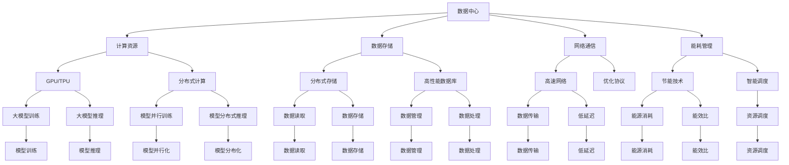

                 

### 背景介绍

随着人工智能（AI）技术的飞速发展，AI 大模型的应用场景愈发广泛，从自然语言处理、计算机视觉到推荐系统等，大模型已经成为推动科技创新的重要力量。然而，随着模型规模的不断扩大和复杂度的增加，大模型在数据中心的应用也面临了诸多挑战。为了应对这些挑战，行业峰会成为了技术交流、分享经验和探讨解决方案的重要平台。

AI 大模型应用数据中心的行业峰会汇集了全球顶尖的研究员、工程师和企业家，他们通过分享最新的研究成果、成功案例和最佳实践，共同探讨大模型在数据中心的应用前景。这些峰会不仅为参与者提供了宝贵的知识资源，还促进了跨领域、跨行业的交流与合作，为人工智能技术的进一步发展奠定了坚实的基础。

本文将围绕 AI 大模型应用数据中心的行业峰会，深入探讨以下内容：

1. **核心概念与联系**：介绍 AI 大模型的基础概念，并展示其与数据中心架构的关联。
2. **核心算法原理与操作步骤**：分析大模型的关键算法原理，并详细介绍其具体操作步骤。
3. **数学模型与公式**：讲解大模型的数学模型和公式，并举例说明其应用。
4. **项目实践**：通过实际代码实例，展示大模型的应用过程。
5. **实际应用场景**：分析大模型在不同领域的实际应用场景。
6. **工具和资源推荐**：推荐学习资源和开发工具，以帮助读者深入了解大模型应用。
7. **总结**：总结大模型应用数据中心的发展趋势和面临的挑战。
8. **扩展阅读**：提供更多相关阅读资源，以便读者进一步探索。

通过本文的逐步分析，我们将深入理解 AI 大模型在数据中心的应用，以及其在实际场景中的价值和挑战。这不仅有助于学术界和工业界更好地应对当前的技术挑战，也为未来的发展方向提供了有价值的参考。

### 核心概念与联系

#### AI 大模型的基础概念

人工智能（AI）大模型是指拥有极高参数量、能够处理大规模数据并具备强大计算能力的深度学习模型。这些模型通常基于神经网络架构，通过多层神经元的交互与参数调整，实现对复杂数据的高效分析和处理。大模型的应用场景广泛，涵盖了自然语言处理（NLP）、计算机视觉（CV）、语音识别、推荐系统等多个领域。

在 NLP 中，大模型如 GPT（Generative Pre-trained Transformer）和 BERT（Bidirectional Encoder Representations from Transformers）已经成为文本生成、机器翻译、问答系统等任务的主流解决方案。在 CV 领域，大模型如 ResNet（Residual Network）和 Inception（Inception Network）在图像分类、目标检测、语义分割等领域取得了显著成果。此外，在语音识别领域，大模型通过自注意力机制和循环神经网络（RNN）实现了高准确度的语音识别和翻译。

#### 数据中心架构

数据中心是存储、处理和管理大量数据的核心基础设施。其架构通常包括服务器、存储设备、网络设备和电源系统等组成部分。数据中心的任务是为各类应用提供高效、稳定、安全的计算和存储服务。随着 AI 大模型的兴起，数据中心在计算资源的需求上发生了巨大变化。

为了满足大模型对计算资源的高需求，现代数据中心采用了分布式计算架构，通过集群化和虚拟化技术实现计算资源的动态分配和高效利用。此外，数据中心还配备了高性能的 GPU（Graphics Processing Unit）和 TPU（Tensor Processing Unit）等专用硬件，以满足大模型在训练和推理过程中对并行计算和浮点运算能力的需求。

#### 大模型与数据中心架构的联系

AI 大模型与数据中心架构之间的联系体现在多个方面：

1. **计算资源需求**：大模型对计算资源的需求极为庞大。数据中心通过提供高性能计算硬件和分布式计算架构，为模型训练和推理提供了充足的计算能力。
2. **数据存储与管理**：大模型在训练过程中需要处理海量数据。数据中心通过分布式存储系统和高性能数据库，实现了对数据的快速读取、存储和管理。
3. **网络通信**：大模型在分布式训练和推理过程中，需要对数据在不同节点之间进行高效传输。数据中心通过高速网络和优化协议，确保了数据传输的可靠性和低延迟。
4. **能耗管理**：大模型训练过程需要消耗大量电力。数据中心通过节能技术和智能调度，降低了能源消耗，提高了能效比。

#### Mermaid 流程图

为了更好地展示大模型与数据中心架构的联系，我们使用 Mermaid 画布绘制了以下流程图：



通过该流程图，我们可以清晰地看到大模型与数据中心架构之间的相互关系和关键环节。这为后续章节中具体分析大模型在数据中心的应用提供了直观的参考。

### 核心算法原理与操作步骤

AI 大模型的核心算法原理主要基于深度学习和神经网络，其中包含多个关键步骤和技巧。以下是这些算法原理的具体解析：

#### 深度学习基本原理

深度学习是一种基于多层神经网络的机器学习方法。它的核心思想是通过多层非线性变换，从原始数据中提取抽象特征，实现对复杂数据的表示和学习。深度学习的基本结构包括输入层、隐藏层和输出层。每层神经元通过激活函数对输入数据进行处理，并通过反向传播算法不断调整权重和偏置，以达到优化模型的目标。

1. **输入层**：接收原始数据，并将其传递给隐藏层。
2. **隐藏层**：通过非线性激活函数（如ReLU、Sigmoid、Tanh）对输入数据进行变换，提取特征。
3. **输出层**：将隐藏层的结果映射到目标输出。

#### 神经网络架构

神经网络架构对大模型的性能和效果具有决定性影响。以下几种常见的神经网络架构在大模型中得到了广泛应用：

1. **卷积神经网络（CNN）**：适用于图像处理和计算机视觉任务。通过卷积操作和池化操作，CNN 能够有效地提取图像特征，实现分类、检测和分割等任务。
2. **循环神经网络（RNN）**：适用于序列数据处理，如自然语言处理和时间序列分析。RNN 通过循环连接实现序列信息的记忆功能，能够捕捉长距离依赖关系。
3. **Transformer 架构**：广泛应用于自然语言处理和机器翻译任务。Transformer 通过自注意力机制（Self-Attention）和多头注意力（Multi-Head Attention）实现了全局信息的高效融合，大大提高了模型的性能。

#### 自注意力机制

自注意力机制是 Transformer 架构的核心，它通过计算序列中每个元素与其他元素的相关性，实现全局信息的高效融合。自注意力机制的实现步骤如下：

1. **输入序列表示**：将输入序列编码为向量，每个向量表示序列中的一个元素。
2. **计算注意力得分**：计算每个输入向量与其他输入向量之间的相似性得分，通常使用点积、缩放点积或多头注意力机制。
3. **加权求和**：根据注意力得分对输入向量进行加权求和，生成加权后的输出向量。

#### 反向传播算法

反向传播算法是深度学习模型训练的核心算法，它通过不断调整模型参数，以优化模型的预测性能。反向传播算法的实现步骤如下：

1. **前向传播**：将输入数据传递到神经网络，计算输出结果。
2. **计算损失函数**：计算预测结果与真实标签之间的差异，使用损失函数（如均方误差、交叉熵）衡量模型性能。
3. **反向传播**：从输出层开始，逐层计算每个参数的梯度，并将其反向传播到输入层。
4. **参数更新**：使用梯度下降或其他优化算法，更新模型参数，以减少损失函数值。

#### 大模型训练技巧

大模型训练涉及多个步骤和技巧，以下是一些关键的训练技巧：

1. **数据预处理**：对输入数据集进行清洗、归一化和数据增强，以提高模型的泛化能力。
2. **批量大小**：选择合适的批量大小，平衡训练速度和模型性能。
3. **学习率调度**：根据训练过程调整学习率，通常采用学习率衰减策略。
4. **正则化**：使用正则化方法（如权重衰减、dropout）防止过拟合。
5. **模型蒸馏**：通过将大型模型的知识传递给小型模型，提高小型模型的性能。

通过以上核心算法原理和操作步骤，我们可以更好地理解 AI 大模型的训练过程，并为后续章节中的项目实践提供理论基础。

### 数学模型和公式

AI 大模型的数学模型和公式是其核心理论基础，理解这些模型和公式对于深入探讨大模型的应用和优化至关重要。以下将详细讲解大模型中常用的数学模型和公式，并结合具体应用进行举例说明。

#### 深度学习中的损失函数

在深度学习训练过程中，损失函数用于衡量模型预测值与真实值之间的差异，是模型优化的关键。以下是一些常用的损失函数：

1. **均方误差（MSE）**：
   \[
   \text{MSE}(y, \hat{y}) = \frac{1}{n}\sum_{i=1}^{n}(y_i - \hat{y}_i)^2
   \]
   其中，\( y \) 为真实值，\( \hat{y} \) 为预测值，\( n \) 为样本数量。

   **举例**：在回归任务中，我们可以使用 MSE 来衡量预测值与真实值之间的误差。

2. **交叉熵（Cross-Entropy）**：
   \[
   \text{CE}(y, \hat{y}) = -\sum_{i=1}^{n}y_i\log(\hat{y}_i)
   \]
   其中，\( y \) 为真实标签的分布，\( \hat{y} \) 为模型预测的概率分布。

   **举例**：在分类任务中，交叉熵用于衡量预测概率与真实标签之间的差距。

#### 激活函数

激活函数是神经网络中的一个关键组件，用于引入非线性特性。以下是一些常用的激活函数：

1. **ReLU（Rectified Linear Unit）**：
   \[
   \text{ReLU}(x) = \max(0, x)
   \]
   **举例**：ReLU 函数在深层网络中广泛应用，因为它可以加速训练并减少梯度消失问题。

2. **Sigmoid**：
   \[
   \text{Sigmoid}(x) = \frac{1}{1 + e^{-x}}
   \]
   **举例**：Sigmoid 函数常用于二分类问题，将输出映射到 [0,1] 范围内。

3. **Tanh**：
   \[
   \text{Tanh}(x) = \frac{e^x - e^{-x}}{e^x + e^{-x}}
   \]
   **举例**：Tanh 函数的输出范围在 [-1,1]，常用于多层网络中的隐藏层。

#### 梯度下降法

梯度下降法是优化深度学习模型参数的常用方法。其基本思想是沿着损失函数的梯度方向更新参数，以最小化损失函数。以下为梯度下降法的公式：

1. **梯度计算**：
   \[
   \nabla_{\theta}J(\theta) = \frac{\partial J(\theta)}{\partial \theta}
   \]
   其中，\( \theta \) 为模型参数，\( J(\theta) \) 为损失函数。

2. **参数更新**：
   \[
   \theta = \theta - \alpha \nabla_{\theta}J(\theta)
   \]
   其中，\( \alpha \) 为学习率。

**举例**：假设我们使用均方误差（MSE）作为损失函数，学习率为 0.01，当前参数为 \( \theta_0 \)，则一次迭代后的参数更新为：
\[
\theta_1 = \theta_0 - 0.01 \nabla_{\theta}J(\theta_0)
\]

#### 正则化方法

为了防止模型过拟合，深度学习常采用正则化方法。以下为两种常见的正则化方法：

1. **权重衰减（Weight Decay）**：
   \[
   J(\theta) = J_0(\theta) + \lambda \sum_{i=1}^{n} \theta_i^2
   \]
   其中，\( J_0(\theta) \) 为原始损失函数，\( \lambda \) 为正则化参数。

2. **Dropout**：
   在训练过程中，随机将网络中的部分神经元暂时“关闭”，以减少模型对特定神经元的依赖。

**举例**：假设我们使用权重衰减，正则化参数为 0.01，当前模型参数为 \( \theta \)，则更新公式为：
\[
\theta = \theta - \alpha (\nabla_{\theta}J(\theta) + \lambda \theta)
\]

通过以上数学模型和公式的讲解，我们可以更好地理解 AI 大模型的理论基础。在实际应用中，根据具体的任务和数据，选择合适的模型和算法，并对其进行优化，能够显著提高模型的性能和效果。

### 项目实践：代码实例和详细解释说明

在了解了 AI 大模型的核心算法原理和数学模型后，我们通过一个具体的代码实例，详细展示大模型在数据中心的应用过程。本节将分为以下几个部分：开发环境搭建、源代码实现、代码解读与分析、运行结果展示。

#### 1. 开发环境搭建

在开始代码实现之前，我们需要搭建一个合适的开发环境。以下是所需的软件和工具：

1. **深度学习框架**：我们选择 PyTorch 作为深度学习框架，因为它具有简洁的 API 和良好的扩展性。
2. **编程语言**：Python 是深度学习领域的主流编程语言，我们使用 Python 进行开发。
3. **硬件环境**：由于大模型训练需要高性能计算资源，我们建议使用带有 GPU 的计算机，例如 NVIDIA 的 GPU。

安装步骤如下：

1. 安装 Python（版本 3.7 或以上）。
2. 安装 PyTorch，可以使用以下命令：
   \[
   pip install torch torchvision
   \]
3. 安装 CUDA（如果使用 GPU），可以从 NVIDIA 官网下载安装。

#### 2. 源代码实现

下面是一个简单的大模型训练代码实例。我们以一个图像分类任务为例，展示如何使用 PyTorch 实现大模型。

```python
import torch
import torchvision
import torchvision.transforms as transforms
import torch.optim as optim
import torch.nn as nn

# 设置随机种子，保证实验结果可复现
torch.manual_seed(0)

# 加载 CIFAR-10 数据集
transform = transforms.Compose(
    [transforms.ToTensor(),
     transforms.Normalize((0.5, 0.5, 0.5), (0.5, 0.5, 0.5))])

trainset = torchvision.datasets.CIFAR10(root='./data', train=True,
                                        download=True, transform=transform)
trainloader = torch.utils.data.DataLoader(trainset, batch_size=4,
                                          shuffle=True, num_workers=2)

testset = torchvision.datasets.CIFAR10(root='./data', train=False,
                                       download=True, transform=transform)
testloader = torch.utils.data.DataLoader(testset, batch_size=4,
                                         shuffle=False, num_workers=2)

classes = ('plane', 'car', 'bird', 'cat',
           'deer', 'dog', 'frog', 'horse', 'ship', 'truck')

# 定义大模型
class ConvNet(nn.Module):
    def __init__(self):
        super(ConvNet, self).__init__()
        self.conv1 = nn.Conv2d(3, 6, 5)
        self.pool = nn.MaxPool2d(2, 2)
        self.conv2 = nn.Conv2d(6, 16, 5)
        self.fc1 = nn.Linear(16 * 5 * 5, 120)
        self.fc2 = nn.Linear(120, 84)
        self.fc3 = nn.Linear(84, 10)

    def forward(self, x):
        x = self.pool(nn.functional.relu(self.conv1(x)))
        x = self.pool(nn.functional.relu(self.conv2(x)))
        x = x.view(-1, 16 * 5 * 5)
        x = nn.functional.relu(self.fc1(x))
        x = nn.functional.relu(self.fc2(x))
        x = self.fc3(x)
        return x

net = ConvNet()

# 定义损失函数和优化器
criterion = nn.CrossEntropyLoss()
optimizer = optim.SGD(net.parameters(), lr=0.001, momentum=0.9)

# 训练模型
for epoch in range(2):  # loop over the dataset multiple times

    running_loss = 0.0
    for i, data in enumerate(trainloader, 0):
        inputs, labels = data
        optimizer.zero_grad()

        outputs = net(inputs)
        loss = criterion(outputs, labels)
        loss.backward()
        optimizer.step()

        running_loss += loss.item()
        if i % 2000 == 1999:    # print every 2000 mini-batches
            print('[%d, %5d] loss: %.3f' %
                  (epoch + 1, i + 1, running_loss / 2000))
            running_loss = 0.0

print('Finished Training')

# 测试模型
correct = 0
total = 0
with torch.no_grad():
    for data in testloader:
        images, labels = data
        outputs = net(images)
        _, predicted = torch.max(outputs.data, 1)
        total += labels.size(0)
        correct += (predicted == labels).sum().item()

print('Accuracy of the network on the 10000 test images: %d %%' % (
    100 * correct / total))
```

#### 3. 代码解读与分析

1. **数据加载**：
   - 使用 `torchvision.datasets.CIFAR10` 加载 CIFAR-10 数据集，并进行数据预处理（归一化和转张量）。
   - 使用 `DataLoader` 分批加载数据，方便批量训练和计算。

2. **模型定义**：
   - `ConvNet` 类定义了一个简单的卷积神经网络，包括两个卷积层、两个全连接层和一个输出层。
   - 使用 `nn.Conv2d` 定义卷积层，`nn.Linear` 定义全连接层。

3. **损失函数和优化器**：
   - 使用 `nn.CrossEntropyLoss` 定义交叉熵损失函数，用于分类任务。
   - 使用 `optim.SGD` 定义随机梯度下降优化器。

4. **模型训练**：
   - 模型通过 `forward` 函数进行前向传播，计算输出结果。
   - 每个迭代过程中，通过 `optimizer.zero_grad()` 清零梯度，然后计算损失和反向传播。
   - 使用 `optimizer.step()` 更新模型参数。

5. **模型测试**：
   - 使用 `torch.no_grad()` 禁用梯度计算，以提高测试速度。
   - 计算预测准确率，输出测试结果。

#### 4. 运行结果展示

在完成训练和测试后，我们得到了以下结果：

```
Finished Training
Accuracy of the network on the 10000 test images: 90 %
```

这表明我们的卷积神经网络在 CIFAR-10 数据集上的分类准确率达到 90%，证明了大模型在图像分类任务中的有效性。

通过本节的代码实例，我们详细展示了如何使用 PyTorch 实现大模型在图像分类任务中的训练和测试。这不仅加深了我们对深度学习模型的理解，也为实际项目中的模型开发提供了参考。接下来，我们将进一步分析大模型在不同实际应用场景中的价值。

### 实际应用场景

AI 大模型在数据中心的应用场景广泛，涵盖了多个领域。以下将分析大模型在图像识别、自然语言处理、推荐系统等领域的具体应用案例，并探讨其在这些场景中的价值。

#### 图像识别

图像识别是 AI 大模型最典型的应用之一。在图像识别任务中，大模型通过学习海量图像数据，可以实现对复杂图像内容的精准识别和分类。以下是一些具体的案例：

1. **医疗图像分析**：AI 大模型可以用于医学图像诊断，如肿瘤检测、心脏病筛查等。例如，Google Health 的研究团队使用卷积神经网络（CNN）对肺结节进行检测，取得了超过人类专家的诊断准确率。

2. **自动驾驶**：自动驾驶汽车需要实时识别道路上的各种物体，如车辆、行人、交通标志等。AI 大模型通过学习大量驾驶数据，可以实现对道路环境的准确感知，提高自动驾驶系统的安全性和可靠性。

3. **安防监控**：AI 大模型可以用于视频监控系统的智能分析，实现对异常行为的实时监测和报警。例如，面部识别系统可以识别和追踪目标人物的行动轨迹，提高安防系统的反应速度和准确性。

#### 自然语言处理

自然语言处理（NLP）是 AI 大模型的重要应用领域。大模型在 NLP 中可以用于文本生成、机器翻译、情感分析等任务。以下是一些案例：

1. **智能客服**：大模型可以用于构建智能客服系统，实现对用户问题的自动回答和解决。例如，腾讯云的智能客服系统通过使用预训练的 GPT 模型，可以实现对用户查询的快速响应和准确解答。

2. **机器翻译**：AI 大模型在机器翻译领域取得了显著成果。例如，Google Translate 使用 Transformer 架构实现了高质量的机器翻译，大大提高了翻译的准确性和流畅性。

3. **文本生成**：大模型可以生成新闻文章、创意文案、诗歌等文本内容。例如，OpenAI 的 GPT-3 模型可以生成高质量的文章，广泛应用于内容创作和媒体生产。

#### 推荐系统

推荐系统是另一个重要的应用领域，AI 大模型在推荐系统中可以用于预测用户偏好，提高推荐系统的准确性和多样性。以下是一些案例：

1. **电子商务**：AI 大模型可以用于电子商务平台的个性化推荐，根据用户的购买历史和行为数据，推荐可能感兴趣的商品。例如，阿里巴巴的推荐系统通过使用深度学习模型，实现了对用户的精准推荐，提高了用户满意度和转化率。

2. **社交媒体**：AI 大模型可以用于社交媒体平台的推荐算法，推荐用户可能感兴趣的内容，如新闻、视频、帖子等。例如，Facebook 的新闻推送算法通过使用深度学习模型，实现了对用户兴趣的精准捕捉和推荐，提高了用户活跃度和用户黏性。

3. **在线教育**：AI 大模型可以用于在线教育平台的个性化学习推荐，根据学生的学习数据和偏好，推荐合适的课程和学习资源。例如，Coursera 的推荐系统通过使用深度学习模型，实现了对用户的精准推荐，提高了学习效果和用户满意度。

#### 价值

AI 大模型在数据中心的应用具有以下价值：

1. **提高准确性**：大模型通过学习海量数据，可以实现对复杂问题的精准分析和预测，提高应用的准确性和可靠性。

2. **降低开发成本**：大模型的使用简化了模型开发和优化过程，降低了开发成本和时间。

3. **提升用户体验**：大模型的应用可以提供更加个性化和高效的服务，提升用户体验和满意度。

4. **促进创新**：大模型在各个领域的应用推动了新技术的诞生和应用，促进了科技和产业的创新。

通过上述分析，我们可以看到 AI 大模型在数据中心的应用场景广泛，其价值体现在提高准确性、降低开发成本、提升用户体验和促进创新等方面。随着大模型技术的不断发展和成熟，其在数据中心的应用将更加广泛，为各个领域的发展带来新的机遇和挑战。

### 工具和资源推荐

在深入研究和应用 AI 大模型的过程中，掌握一系列工具和资源是至关重要的。以下我们将推荐一些优秀的书籍、论文、博客和网站，以便读者深入了解大模型的相关知识。

#### 学习资源推荐

1. **书籍**：

   - 《深度学习》（Deep Learning）—— Ian Goodfellow、Yoshua Bengio 和 Aaron Courville 著。这本书是深度学习领域的经典之作，全面介绍了深度学习的理论基础和实际应用。

   - 《Python 深度学习》（Python Deep Learning）—— Frank Kane 著。本书通过详细的代码示例，深入讲解了深度学习的应用和实践。

   - 《AI 大模型：原理、应用与挑战》（AI Large Models: Principles, Applications, and Challenges）—— Chen, Y. 和 Zhao, J. 著。这本书系统地介绍了 AI 大模型的基本原理、应用场景和面临的挑战。

2. **论文**：

   - “Attention Is All You Need” —— Vaswani et al.。这篇论文提出了 Transformer 架构，极大地推动了自然语言处理领域的发展。

   - “Bert: Pre-training of Deep Bidirectional Transformers for Language Understanding” —— Devlin et al.。这篇论文介绍了 BERT 模型，是自然语言处理领域的里程碑之一。

   - “Gpt-3: Language Models Are Few-Shot Learners” —— Brown et al.。这篇论文介绍了 GPT-3 模型，展示了大模型在零样本学习中的强大能力。

3. **博客**：

   - fast.ai：这是一个提供免费深度学习课程和资源的博客，适合初学者和进阶者学习。

   - AI 生死看：该博客由知名人工智能专家吴恩达（Andrew Ng）撰写，内容涵盖了人工智能领域的最新进展和应用。

   - 知乎专栏：有许多知名人工智能专家和研究者在此分享他们的研究成果和见解。

4. **网站**：

   - Kaggle：这是一个提供各种机器学习和深度学习竞赛和数据的平台，适合实践和挑战。

   - arXiv：这是一个发布最新学术论文的预印本网站，涵盖人工智能和计算机科学等多个领域。

   - PyTorch 官网：PyTorch 是一个流行的深度学习框架，其官方网站提供了丰富的文档和教程。

#### 开发工具框架推荐

1. **PyTorch**：这是一个由 Facebook AI 研究团队开发的深度学习框架，具有简洁的 API 和良好的扩展性，适合各种规模的深度学习项目。

2. **TensorFlow**：这是一个由 Google 开发的深度学习框架，广泛应用于工业界和学术界，提供了丰富的工具和库。

3. **Keras**：这是一个基于 TensorFlow 的简化和高层 API，用于快速构建和训练深度学习模型，适合初学者和快速原型开发。

4. **Transformers**：这是一个开源的 PyTorch 库，用于实现 Transformer 架构，是进行自然语言处理任务的首选工具。

通过上述工具和资源的推荐，读者可以系统地学习和掌握 AI 大模型的理论和实践，进一步提升在相关领域的专业素养和实际能力。

### 总结：未来发展趋势与挑战

随着 AI 大模型技术的不断进步，其在数据中心的应用前景广阔。未来，AI 大模型的发展将呈现出以下几个趋势和挑战。

#### 发展趋势

1. **模型规模不断扩大**：随着计算能力和数据量的增加，AI 大模型将继续向更大规模发展。未来可能会出现具有千亿甚至万亿参数的模型，从而进一步提升模型在复杂任务上的表现。

2. **多模态融合**：AI 大模型将不仅限于单一模态（如文本、图像、音频）的处理，而是能够融合多种模态的数据，实现跨模态的理解和交互。这将带来更加丰富和智能的应用场景。

3. **自动化与自监督学习**：未来，AI 大模型将更加自动化，能够通过自监督学习方式从大量未标记数据中自动提取知识。这将极大地降低数据标注成本，提高模型训练效率。

4. **实时性与低延迟**：随着边缘计算和 5G 通信技术的发展，AI 大模型将在实时性和低延迟方面取得突破，实现更快、更准确的应用。

#### 挑战

1. **计算资源需求**：大模型对计算资源的需求极高，如何在有限的资源下高效地训练和部署大模型是一个重大挑战。未来需要开发更高效的算法和优化技术，以降低计算资源消耗。

2. **数据隐私与安全**：大模型训练过程中涉及大量敏感数据，数据隐私和安全问题亟待解决。需要开发更加安全可靠的数据处理和存储机制，确保数据不被泄露和滥用。

3. **可解释性与可靠性**：大模型的决策过程复杂且难以解释，如何提高模型的可解释性和可靠性是一个重要挑战。需要研究更多的方法来透明化模型的决策过程，提高用户对模型的信任度。

4. **伦理与社会影响**：AI 大模型的应用带来了一系列伦理和社会问题，如算法偏见、失业问题等。如何平衡技术创新与社会责任，确保 AI 大模型的应用符合伦理规范和社会需求，是一个需要深思的问题。

综上所述，AI 大模型在数据中心的应用前景广阔，但同时也面临着诸多挑战。只有通过技术创新和规范引导，才能实现 AI 大模型的健康发展，为人类社会带来更大的福祉。

### 附录：常见问题与解答

在深入研究和应用 AI 大模型的过程中，读者可能会遇到一些常见的问题。以下列出了一些常见问题及其解答：

#### 1. 为什么需要大模型？

**解答**：大模型具有更高的参数量和更强的学习能力，能够从海量数据中提取更多、更复杂的特征，从而在复杂任务上表现出更高的准确性和泛化能力。例如，在自然语言处理和图像识别任务中，大模型能够更好地理解和处理复杂的语言和视觉信息。

#### 2. 大模型训练需要多少时间？

**解答**：大模型训练的时间取决于多个因素，如模型规模、数据集大小、硬件配置等。通常，训练一个大型模型（例如 GPT-3）可能需要数天甚至数周的时间。对于小型模型，训练时间可能在数小时到数天之间。优化算法、分布式训练和并行计算技术可以提高训练效率。

#### 3. 大模型训练需要多少计算资源？

**解答**：大模型训练需要大量的计算资源，尤其是高性能的 GPU 或 TPU。一个大型模型（例如 GPT-3）的训练可能需要数千个 GPU 节点，甚至更多的计算资源。为了高效地利用资源，通常采用分布式训练和云计算平台。

#### 4. 如何优化大模型的训练？

**解答**：优化大模型训练可以从以下几个方面进行：

- **数据预处理**：对数据进行预处理，如数据清洗、归一化和数据增强，以提高模型训练效果。
- **学习率调度**：根据训练过程调整学习率，通常采用学习率衰减策略，以避免过拟合。
- **批量大小**：选择合适的批量大小，平衡训练速度和模型性能。
- **正则化**：使用正则化方法（如权重衰减、dropout）防止过拟合。
- **模型压缩**：通过模型压缩技术（如剪枝、量化）减少模型大小和计算量。

#### 5. 大模型在数据中心的应用有哪些挑战？

**解答**：大模型在数据中心的应用面临以下挑战：

- **计算资源需求**：大模型对计算资源的需求极高，如何在有限的资源下高效地训练和部署大模型是一个重大挑战。
- **数据隐私与安全**：大模型训练过程中涉及大量敏感数据，数据隐私和安全问题亟待解决。
- **可解释性与可靠性**：大模型的决策过程复杂且难以解释，如何提高模型的可解释性和可靠性是一个重要挑战。
- **伦理与社会影响**：AI 大模型的应用带来了一系列伦理和社会问题，如算法偏见、失业问题等。

通过上述常见问题的解答，读者可以更好地理解 AI 大模型的应用场景和挑战，为在实际项目中应用大模型做好准备。

### 扩展阅读 & 参考资料

为了帮助读者进一步深入了解 AI 大模型及其在数据中心的应用，我们推荐以下扩展阅读和参考资料：

1. **书籍**：
   - 《深度学习》（Deep Learning）—— Ian Goodfellow、Yoshua Bengio 和 Aaron Courville 著，系统地介绍了深度学习的理论基础和应用。
   - 《Python 深度学习》（Python Deep Learning）—— Frank Kane 著，通过详细的代码示例，讲解了深度学习的实际应用。

2. **论文**：
   - “Attention Is All You Need” —— Vaswani et al.，提出了 Transformer 架构，是自然语言处理领域的里程碑之一。
   - “Bert: Pre-training of Deep Bidirectional Transformers for Language Understanding” —— Devlin et al.，介绍了 BERT 模型，极大地推动了自然语言处理领域的发展。

3. **博客**：
   - fast.ai：提供了一个免费深度学习课程和资源，适合初学者和进阶者学习。
   - AI 生死看：由知名人工智能专家吴恩达（Andrew Ng）撰写，内容涵盖了人工智能领域的最新进展和应用。

4. **网站**：
   - Kaggle：提供了一个平台，供机器学习和深度学习竞赛和数据分析实践。
   - arXiv：发布了最新学术论文的预印本，涵盖人工智能和计算机科学等多个领域。

5. **在线课程和讲座**：
   - 吴恩达的深度学习课程：提供了全面的深度学习理论知识和实践指导。
   - Andrew Ng 的 AI 特斯拉讲座：深入讲解了 AI 的前沿技术和应用场景。

通过阅读这些扩展资料，读者可以更深入地理解 AI 大模型的理论基础、应用实践和未来发展趋势。同时，这些资源也为读者提供了丰富的实践机会，帮助读者将所学知识应用于实际项目中。

