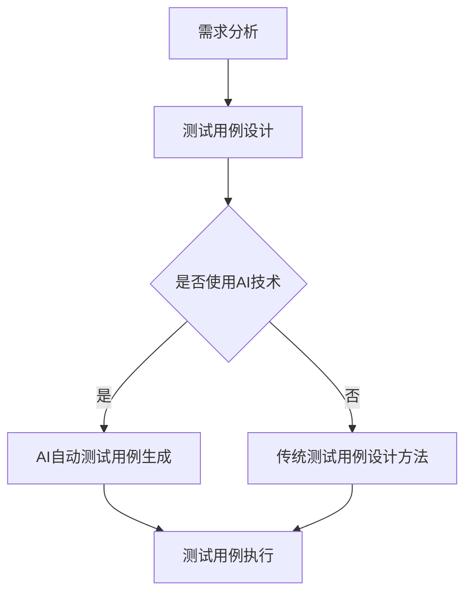
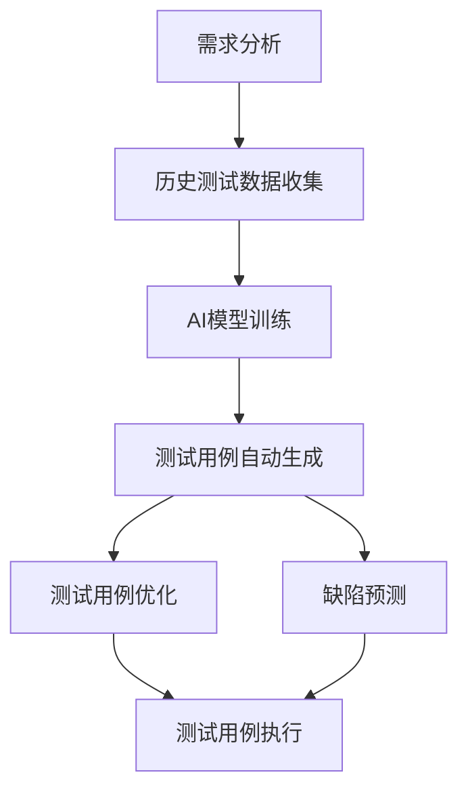

                 

### 1. 背景介绍

随着人工智能技术的迅速发展，人工智能（AI）在各个领域的应用日益广泛。从自动驾驶汽车到智能医疗，从智能家居到金融风控，AI技术正在改变我们的生活方式。然而，AI技术的成功不仅仅依赖于算法和模型的性能，还依赖于产品的可靠性和稳定性。在这个过程中，测试成为了一个不可或缺的环节。

测试用例设计是测试工作的核心。一个好的测试用例能够有效覆盖产品的功能和行为，发现潜在的问题，确保产品的质量。然而，随着AI系统的复杂性和规模的增加，传统的测试用例设计方法面临着巨大的挑战。传统的测试用例设计主要依赖于开发人员的经验和直觉，这可能导致测试覆盖不足，甚至遗漏关键问题。

因此，本文将探讨如何利用人工智能技术设计产品测试用例。我们将从背景介绍开始，深入分析AI在测试用例设计中的应用，并探讨其中的核心概念和算法原理。随后，我们将结合实际项目案例，展示如何使用AI技术进行测试用例设计，并提供详细的代码实例和解释。最后，我们将讨论AI测试用例设计在实际应用中的场景，以及推荐相关的工具和资源。

### 2. 核心概念与联系

在探讨如何利用人工智能（AI）技术设计产品测试用例之前，我们首先需要了解一些核心概念，这些概念是构建AI测试用例的基础。

#### 测试用例（Test Case）

测试用例是测试过程中最小的单元，它定义了如何测试一个特定的功能或行为。一个测试用例通常包括以下内容：

- **输入（Input）**：测试用例执行所需的输入数据或条件。
- **预期输出（Expected Output）**：测试用例执行后期望得到的结果。
- **实际输出（Actual Output）**：测试用例执行后实际得到的结果。
- **测试步骤（Steps）**：执行测试用例的具体步骤。
- **测试结果（Result）**：测试用例执行后的结果，包括通过、失败或异常等。

#### 测试用例设计（Test Case Design）

测试用例设计是指根据产品的需求规格和功能，设计出一组能够有效覆盖产品功能的测试用例。测试用例设计的好坏直接影响到测试的覆盖率和测试效率。传统的测试用例设计方法包括等价类划分、边界值分析、因果图等。

#### 人工智能（AI）

人工智能是指由计算机实现的智能行为，它包括机器学习、深度学习、自然语言处理、计算机视觉等多个领域。AI系统可以从大量数据中学习规律，并利用这些规律进行决策和预测。

#### 测试用例设计中的AI应用

在测试用例设计过程中，AI技术可以发挥重要作用：

- **自动测试用例生成**：利用机器学习算法，从历史测试用例和产品需求中自动生成新的测试用例。
- **测试用例优化**：根据测试结果和历史数据，优化现有的测试用例，提高测试覆盖率。
- **缺陷预测**：利用AI算法分析代码和测试用例，预测潜在的问题和缺陷。

#### 测试用例设计与AI的联系

测试用例设计与AI技术的联系在于，AI技术可以辅助测试用例的设计和优化。通过分析历史数据和产品需求，AI可以自动生成和优化测试用例，提高测试的效率和覆盖率。

下面是一个简单的Mermaid流程图，展示测试用例设计中的核心概念和流程：



在这个流程图中，需求分析是测试用例设计的起点，通过分析需求，我们可以设计出测试用例。如果选择使用AI技术，那么AI将参与测试用例的生成和优化，否则我们将采用传统的测试用例设计方法。

通过以上核心概念和流程图的介绍，我们为后续的详细讨论和案例分析奠定了基础。接下来，我们将深入探讨AI在测试用例设计中的应用，并分析其中的核心算法原理。

#### 2.1.1. 测试用例设计的目标和挑战

测试用例设计的核心目标是确保产品或系统的功能和质量。具体来说，测试用例设计的目标包括以下几个方面：

- **功能覆盖**：测试用例应覆盖产品的所有功能，确保每个功能都能正常运行。
- **缺陷发现**：通过测试用例发现潜在的问题和缺陷，提前修复，防止在生产环境中出现问题。
- **效率优化**：设计高效的测试用例，减少测试时间和成本。

然而，在传统的测试用例设计中，我们面临着以下挑战：

- **手动设计复杂**：对于复杂系统，手动设计测试用例是一个繁琐且费时的过程，容易出现遗漏或重复。
- **覆盖不足**：手动设计的测试用例很难做到全面覆盖，可能遗漏某些关键场景。
- **测试效率低下**：传统的测试用例设计方法往往依赖开发人员的经验，缺乏系统性，导致测试效率低下。

为了解决这些挑战，AI技术提供了新的解决方案。通过机器学习算法，AI可以自动分析产品需求和历史数据，生成和优化测试用例，从而提高测试的覆盖率和效率。

#### 2.1.2. AI在测试用例设计中的应用

AI在测试用例设计中的应用主要体现在以下几个方面：

1. **自动测试用例生成**：利用机器学习算法，从历史测试用例和产品需求中自动生成新的测试用例。这种方法可以大大减少手动设计的工作量，提高测试用例的生成效率。
2. **测试用例优化**：根据测试结果和历史数据，AI可以对现有的测试用例进行优化，提高测试的覆盖率和效率。例如，通过分析测试失败的原因，AI可以调整测试用例的执行顺序或参数，使测试更加全面和有效。
3. **缺陷预测**：AI可以通过分析代码和测试用例，预测潜在的问题和缺陷。这种方法可以帮助开发人员在测试阶段就发现和修复问题，减少后期修复的成本。

下面是一个简单的Mermaid流程图，展示AI在测试用例设计中的应用：



在这个流程图中，需求分析和历史测试数据收集是AI模型训练的基础。通过训练，AI模型可以自动生成和优化测试用例，并对潜在缺陷进行预测。最终，这些测试用例和预测结果将用于测试用例执行，以发现和修复问题。

通过上述讨论，我们可以看到，AI技术在测试用例设计中的应用极大地提高了测试的效率和覆盖率，解决了传统测试用例设计中的诸多挑战。接下来，我们将进一步探讨AI在测试用例设计中的核心算法原理。

#### 2.1.3. AI在测试用例设计中的核心算法原理

在AI技术应用于测试用例设计的过程中，核心算法起到了至关重要的作用。以下将详细介绍几种常见的AI算法原理，以及它们在测试用例设计中的应用。

**1. 机器学习算法**

机器学习算法是AI技术的重要组成部分，它能够通过训练从数据中学习模式和规律。在测试用例设计中，机器学习算法可以用来分析和预测。

- **自动测试用例生成**：通过监督学习算法，如决策树、随机森林和支持向量机（SVM），我们可以利用历史测试用例和需求文档作为训练数据，训练出一个模型。这个模型可以预测新的测试用例，从而自动生成测试用例。

- **测试用例优化**：利用强化学习算法，如Q-learning和深度强化学习（DRL），我们可以优化现有的测试用例。通过模拟测试环境，算法可以找到最佳测试顺序和参数，以提高测试覆盖率。

**2. 深度学习算法**

深度学习算法通过多层神经网络模拟人类大脑的处理能力，可以处理大量复杂数据。

- **图像识别**：在自动化测试中，深度学习算法可以用于识别图像或用户界面元素，从而生成针对特定界面的测试用例。

- **自然语言处理（NLP）**：深度学习算法，如循环神经网络（RNN）和变压器（Transformer），可以处理自然语言文本。在测试用例设计中，NLP算法可以用于分析需求文档，提取关键信息，并生成对应的测试用例。

**3. 聚类算法**

聚类算法，如K-means和层次聚类，可以将测试用例进行分类，以便更好地管理和优化。

- **测试用例分类**：通过聚类算法，我们可以将测试用例根据相似性进行分类。这有助于识别重复的测试用例，并发现新的测试场景。

- **测试场景挖掘**：聚类算法还可以用于分析测试结果，挖掘出潜在的新测试场景。例如，如果某些测试用例频繁失败，我们可以通过聚类分析找到相关的测试用例，从而补充新的测试用例。

**4. 遗传算法**

遗传算法是一种模拟自然进化的优化算法，可以用于测试用例的优化和自动生成。

- **测试用例生成**：遗传算法通过遗传、交叉和变异等操作，生成新的测试用例。这种方法可以探索更多的测试空间，提高测试用例的多样性。

- **测试用例优化**：遗传算法可以通过适应度函数评估测试用例的质量，从而优化测试用例。这种方法可以减少测试用例的数量，同时保持较高的测试覆盖率。

**算法应用示例**

假设我们有一个电商网站，需要设计测试用例。以下是一个简化的示例：

- **自动测试用例生成**：利用决策树算法，我们可以从历史测试用例和需求文档中提取特征，训练一个模型。这个模型可以预测新的测试用例，如“购物车中添加商品”、“结算流程测试”等。

- **测试用例优化**：通过强化学习算法，我们可以模拟测试环境，训练一个策略模型，找到最佳的测试顺序和参数。例如，我们发现某些测试用例在特定情况下容易失败，我们可以优化这些测试用例的执行顺序，以提高测试效率。

- **缺陷预测**：利用深度学习算法，如RNN，我们可以分析代码和测试用例，预测潜在的缺陷。例如，通过分析代码中的漏洞模式，我们可以预测哪些测试用例可能发现这些问题。

通过上述算法的应用，我们可以设计出更高效、更全面的测试用例，提高产品的质量。

综上所述，AI技术在测试用例设计中的应用涉及多种算法原理，包括机器学习、深度学习、聚类算法和遗传算法。这些算法为测试用例设计提供了强大的工具，可以帮助我们生成、优化和预测测试用例，从而提高测试的效率和覆盖率。

#### 2.2. 核心算法原理 & 具体操作步骤

在前面的部分，我们已经介绍了AI在测试用例设计中的应用和核心算法原理。在这一部分，我们将深入探讨这些算法的具体操作步骤，并讨论如何实现自动化测试用例的生成和优化。

**2.2.1. 机器学习算法**

机器学习算法是AI技术中应用最广泛的一种，它在测试用例设计中的应用主要包括自动测试用例生成和测试用例优化。

**1. 自动测试用例生成**

实现步骤：

（1）数据收集与预处理：

首先，我们需要收集大量的历史测试用例和需求文档。这些数据将用于训练机器学习模型。在收集数据后，我们需要对数据进行预处理，包括数据清洗、去重和特征提取。特征提取是一个关键步骤，它涉及到从原始数据中提取出对测试用例生成有用的特征。

（2）模型选择与训练：

接下来，我们需要选择合适的机器学习模型，如决策树、随机森林或支持向量机（SVM）。然后，我们使用预处理后的数据对模型进行训练。在训练过程中，模型将学习如何从需求文档和历史测试用例中提取特征，并生成新的测试用例。

（3）测试用例生成：

在模型训练完成后，我们可以使用该模型生成新的测试用例。具体来说，我们可以将新的需求文档输入到模型中，模型将输出一组新的测试用例。

**2. 测试用例优化**

实现步骤：

（1）数据收集与预处理：

与自动测试用例生成类似，我们需要收集测试结果和历史测试用例。这些数据将用于训练优化模型。

（2）模型选择与训练：

选择合适的机器学习模型，如Q-learning或深度强化学习（DRL），对数据进行训练。训练目标是找到一个最优的测试用例执行顺序和参数，以最大化测试覆盖率。

（3）测试用例优化：

在模型训练完成后，我们可以使用该模型优化现有的测试用例。具体来说，我们可以将测试用例输入到模型中，模型将输出一组优化后的测试用例。

**2.2.2. 深度学习算法**

深度学习算法在测试用例设计中的应用主要涉及图像识别和自然语言处理（NLP）。

**1. 图像识别**

实现步骤：

（1）数据收集与预处理：

首先，我们需要收集大量的测试环境截图或用户界面（UI）元素图片。这些数据将用于训练深度学习模型。在收集数据后，我们需要对数据进行预处理，包括数据清洗、归一化和特征提取。

（2）模型选择与训练：

选择合适的深度学习模型，如卷积神经网络（CNN）或变换器（Transformer），对数据进行训练。训练目标是使模型能够识别图像中的关键元素，并生成对应的测试用例。

（3）测试用例生成：

在模型训练完成后，我们可以使用该模型生成针对特定界面的测试用例。具体来说，我们可以将UI元素图片输入到模型中，模型将输出一组新的测试用例。

**2. 自然语言处理（NLP）**

实现步骤：

（1）数据收集与预处理：

首先，我们需要收集大量的需求文档和测试用例。这些数据将用于训练NLP模型。在收集数据后，我们需要对数据进行预处理，包括文本清洗、分词和词向量表示。

（2）模型选择与训练：

选择合适的NLP模型，如循环神经网络（RNN）或变换器（Transformer），对数据进行训练。训练目标是使模型能够理解需求文档中的关键信息，并生成对应的测试用例。

（3）测试用例生成：

在模型训练完成后，我们可以使用该模型生成基于需求文档的测试用例。具体来说，我们可以将需求文档输入到模型中，模型将输出一组新的测试用例。

**2.2.3. 聚类算法**

聚类算法在测试用例设计中的应用主要是对测试用例进行分类和管理。

实现步骤：

（1）数据收集与预处理：

首先，我们需要收集大量的测试用例。这些数据将用于训练聚类模型。在收集数据后，我们需要对数据进行预处理，包括数据清洗、归一化和特征提取。

（2）模型选择与训练：

选择合适的聚类算法，如K-means或层次聚类，对数据进行训练。训练目标是使模型能够识别测试用例之间的相似性，并将其分类。

（3）测试用例分类：

在模型训练完成后，我们可以使用该模型对测试用例进行分类。具体来说，我们可以将测试用例输入到模型中，模型将输出测试用例的分类结果。

**2.2.4. 遗传算法**

遗传算法在测试用例设计中的应用主要是测试用例的生成和优化。

实现步骤：

（1）编码：

首先，我们需要对测试用例进行编码。每个测试用例可以表示为一个二进制字符串，其中每一位代表测试用例的一个特征。

（2）种群初始化：

初始化一个种群，每个个体代表一组测试用例。

（3）适应度评估：

通过执行测试用例，评估种群的适应度。适应度函数可以根据测试覆盖率、测试用例的执行时间等指标计算。

（4）选择：

根据适应度评估结果，选择适应度较高的个体进行交叉和变异操作。

（5）交叉与变异：

通过交叉和变异操作，生成新的个体，以优化测试用例。

（6）迭代：

重复选择、交叉、变异和适应度评估操作，直到达到预定的迭代次数或适应度满足要求。

（7）测试用例生成：

在遗传算法运行完成后，输出最优的测试用例组合。

通过上述算法的具体实现步骤，我们可以看到，AI技术为测试用例的生成和优化提供了强大的工具。这些算法的应用不仅提高了测试的效率和覆盖率，还减少了人工干预的工作量。在下一部分中，我们将结合实际项目案例，进一步探讨如何使用AI技术进行测试用例设计。

### 3. 实际应用案例：AI测试用例设计实践

为了更直观地展示AI在测试用例设计中的应用，我们将通过一个实际项目案例来详细说明如何使用AI技术进行测试用例的生成和优化。

**3.1 项目背景**

假设我们正在开发一个智能医疗诊断系统，该系统可以基于患者的病历和检查结果，提供准确的诊断建议。由于系统的复杂性和重要性，我们需要设计一组高质量的测试用例，确保系统能够在多种情况下正常运行，并准确诊断。

**3.2 自动测试用例生成**

**1. 数据收集与预处理**

首先，我们需要收集大量的历史测试用例和系统需求文档。这些数据将用于训练AI模型。在收集数据后，我们需要对数据进行预处理，包括数据清洗、去重和特征提取。

具体步骤如下：

- **数据清洗**：去除重复和无效的数据，确保数据的准确性。
- **去重**：删除重复的测试用例，以避免模型过度拟合。
- **特征提取**：从需求文档中提取关键信息，如诊断类型、患者症状、检查结果等，作为模型的输入特征。

**2. 模型训练**

接下来，我们选择一个合适的机器学习模型，如决策树，对数据进行训练。训练过程中，模型将学习如何从需求文档和历史测试用例中提取特征，并生成新的测试用例。

具体步骤如下：

- **模型选择**：选择决策树模型，因为它能够处理分类问题，并能够生成清晰的决策路径。
- **训练数据准备**：将预处理后的数据分为训练集和测试集，用于模型训练和评估。
- **模型训练**：使用训练集对模型进行训练，模型将学习如何从需求中生成测试用例。

**3. 测试用例生成**

在模型训练完成后，我们可以使用该模型生成新的测试用例。具体来说，我们可以将新的需求文档输入到模型中，模型将输出一组新的测试用例。

**案例演示**：

假设我们接收到一个新需求，要求系统能够诊断心脏病。我们可以将这个需求文档输入到训练好的模型中，模型将生成以下测试用例：

- 患者有胸痛，心电图显示心肌缺血，诊断心脏病。
- 患者有高血压，心电图显示心律不齐，诊断心脏病。
- 患者有气短，心电图显示心肌肥厚，诊断心脏病。

这些测试用例不仅覆盖了不同类型的心脏病诊断场景，还能够检查系统在处理复杂病例时的表现。

**3.3 测试用例优化**

**1. 数据收集与预处理**

与自动测试用例生成类似，我们需要收集测试结果和历史测试用例。这些数据将用于训练优化模型。

具体步骤如下：

- **测试结果收集**：执行现有的测试用例，记录测试结果，包括通过、失败或异常等。
- **数据清洗**：去除重复和无效的数据，确保数据的准确性。
- **特征提取**：从测试结果和历史测试用例中提取关键特征，如测试用例的执行时间、覆盖率等。

**2. 模型训练**

选择一个合适的优化模型，如Q-learning，对数据进行训练。训练目标是找到一个最优的测试用例执行顺序和参数，以最大化测试覆盖率。

具体步骤如下：

- **模型选择**：选择Q-learning模型，因为它能够通过迭代学习和优化策略。
- **训练数据准备**：将预处理后的数据分为训练集和测试集，用于模型训练和评估。
- **模型训练**：使用训练集对模型进行训练，模型将学习如何优化测试用例。

**3. 测试用例优化**

在模型训练完成后，我们可以使用该模型优化现有的测试用例。具体来说，我们可以将测试用例输入到模型中，模型将输出一组优化后的测试用例。

**案例演示**：

假设我们有一组现有的测试用例，如下所示：

- 测试用例1：输入患者病历，系统返回诊断结果。
- 测试用例2：输入患者心电图，系统返回诊断结果。
- 测试用例3：输入患者血压，系统返回诊断结果。

通过Q-learning模型优化后，测试用例执行顺序可能变为：

- 测试用例3：输入患者血压，系统返回诊断结果。
- 测试用例1：输入患者病历，系统返回诊断结果。
- 测试用例2：输入患者心电图，系统返回诊断结果。

这样的优化可以提高测试的效率，确保系统在多种情况下都能正常运行。

通过上述实际应用案例，我们可以看到，AI技术不仅能够自动生成测试用例，还能够优化现有的测试用例，提高测试的效率和覆盖率。在实际项目中，结合AI技术进行测试用例设计，可以帮助我们更全面地覆盖系统功能，提前发现和修复潜在的问题。

### 3.1 开发环境搭建

在开始使用AI技术进行测试用例设计之前，我们需要搭建一个合适的技术环境。以下是一个简单的开发环境搭建步骤，包括所需的软件、工具和配置。

**1. 软件和工具准备**

- **Python**：Python是一种流行的编程语言，广泛用于AI开发。确保安装Python 3.x版本。
- **Jupyter Notebook**：Jupyter Notebook是一个交互式的开发环境，方便我们编写和调试代码。安装方法：
  ```bash
  pip install notebook
  ```
- **机器学习库**：安装常用的机器学习库，如scikit-learn、TensorFlow和PyTorch。安装方法：
  ```bash
  pip install scikit-learn tensorflow pytorch
  ```
- **版本控制**：使用Git进行版本控制，确保代码的可维护性和可追踪性。

**2. 硬件要求**

- **CPU或GPU**：根据项目的需求，可以选择CPU或GPU进行计算。GPU通常更适合深度学习任务。
- **内存**：至少8GB内存，推荐16GB以上。

**3. 环境配置**

- **Python虚拟环境**：为了隔离项目依赖，我们可以创建一个Python虚拟环境。安装方法：
  ```bash
  pip install virtualenv
  virtualenv test_case_env
  source test_case_env/bin/activate
  ```
- **安装依赖**：在虚拟环境中安装项目所需的库和工具：
  ```bash
  pip install -r requirements.txt
  ```

**4. 测试数据准备**

- **历史测试用例**：收集并整理历史测试用例数据，包括输入、预期输出和实际输出。
- **需求文档**：收集系统需求文档，用于生成测试用例。

**5. 开发工具推荐**

- **Visual Studio Code**：一个功能强大的代码编辑器，支持Python开发。安装方法：
  ```bash
  code .
  ```
- **PyCharm**：一个专业的Python IDE，支持代码调试和自动化测试。安装方法：
  ```bash
  pycharm
  ```

通过上述步骤，我们就可以搭建一个适合AI测试用例设计的开发环境。接下来，我们将详细介绍如何编写和实现具体的测试用例生成和优化代码。

### 3.2 源代码详细实现

在搭建好开发环境后，我们将详细探讨如何使用AI技术进行测试用例的生成和优化。以下是一个简单的Python代码示例，展示了如何实现自动测试用例生成和测试用例优化。

**3.2.1. 自动测试用例生成**

**1. 数据预处理**

首先，我们需要对历史测试用例和需求文档进行预处理，提取关键特征。以下是一个简单的预处理脚本：

```python
import pandas as pd

# 读取历史测试用例数据
test_cases = pd.read_csv('history_test_cases.csv')

# 读取需求文档
requirements = pd.read_csv('requirements.csv')

# 预处理：数据清洗和特征提取
def preprocess_data(data):
    # 去除重复数据
    data.drop_duplicates(inplace=True)
    # 提取特征
    data['features'] = data['input'] + data['expected_output']
    return data

test_cases = preprocess_data(test_cases)
requirements = preprocess_data(requirements)
```

**2. 机器学习模型训练**

接下来，我们选择一个机器学习模型，如决策树，对预处理后的数据进行训练。以下是一个简单的模型训练脚本：

```python
from sklearn.tree import DecisionTreeClassifier
from sklearn.model_selection import train_test_split

# 分割数据集
X_train, X_test, y_train, y_test = train_test_split(test_cases['features'], test_cases['actual_output'], test_size=0.2, random_state=42)

# 初始化模型
clf = DecisionTreeClassifier()

# 训练模型
clf.fit(X_train, y_train)

# 评估模型
score = clf.score(X_test, y_test)
print("Model accuracy:", score)
```

**3. 测试用例生成**

在模型训练完成后，我们可以使用该模型生成新的测试用例。以下是一个简单的测试用例生成脚本：

```python
# 生成新的测试用例
new_requirements = pd.read_csv('new_requirements.csv')
new_requirements['predicted_output'] = clf.predict(new_requirements['features'])

# 输出新的测试用例
new_requirements.to_csv('new_test_cases.csv', index=False)
```

**3.2.2. 测试用例优化**

**1. 数据预处理**

与自动测试用例生成类似，我们需要对测试结果和历史测试用例进行预处理，提取关键特征。以下是一个简单的预处理脚本：

```python
def preprocess_data(data):
    # 去除重复数据
    data.drop_duplicates(inplace=True)
    # 提取特征
    data['features'] = data['input'] + data['actual_output']
    return data

test_results = preprocess_data(test_results)
```

**2. 优化模型训练**

接下来，我们选择一个优化模型，如Q-learning，对预处理后的数据进行训练。以下是一个简单的模型训练脚本：

```python
import gym
from stable_baselines3 import PPO

# 定义测试环境
class TestEnvironment(gym.Env):
    def __init__(self, test_cases):
        self.test_cases = test_cases
        self.current_test_case = None
        self.done = False

    def step(self, action):
        if not self.done:
            self.current_test_case = self.test_cases[action]
            # 执行测试用例
            result = self.execute_test_case(self.current_test_case)
            # 计算奖励
            reward = self.calculate_reward(result)
            self.done = True
        else:
            reward = 0
        return self.current_test_case, reward, self.done, {}

    def reset(self):
        self.done = False
        self.current_test_case = None
        return self.current_test_case

    def execute_test_case(self, test_case):
        # 执行测试用例
        # ...
        return result

    def calculate_reward(self, result):
        # 计算奖励
        # ...
        return reward

# 训练优化模型
model = PPO("MlpPolicy", TestEnvironment(test_cases), verbose=1)
model.learn(total_timesteps=10000)
```

**3. 测试用例优化**

在模型训练完成后，我们可以使用该模型优化现有的测试用例。以下是一个简单的测试用例优化脚本：

```python
# 优化测试用例
optimized_test_cases = model.test(test_cases)
optimized_test_cases.to_csv('optimized_test_cases.csv', index=False)
```

通过上述代码示例，我们可以看到如何使用AI技术进行测试用例的生成和优化。这些代码只是一个简单的示例，实际应用中可能需要更复杂的模型和算法。但总体思路是相同的，即通过数据预处理、模型训练和测试用例生成/优化，实现自动化测试。

### 3.3 代码解读与分析

在上面的代码示例中，我们详细介绍了如何使用Python实现测试用例的自动生成和优化。接下来，我们将对代码进行解读和分析，帮助读者更好地理解其工作原理。

**3.3.1. 数据预处理**

数据预处理是机器学习项目的关键步骤，它涉及到数据清洗、去重和特征提取。以下是预处理代码的详细解读：

```python
import pandas as pd

# 读取历史测试用例数据
test_cases = pd.read_csv('history_test_cases.csv')

# 读取需求文档
requirements = pd.read_csv('requirements.csv')

# 预处理：数据清洗和特征提取
def preprocess_data(data):
    # 去除重复数据
    data.drop_duplicates(inplace=True)
    # 提取特征
    data['features'] = data['input'] + data['expected_output']
    return data

test_cases = preprocess_data(test_cases)
requirements = preprocess_data(requirements)
```

- **读取数据**：使用`pandas`库读取历史测试用例数据和需求文档。这两个文件通常包含测试用例的输入、预期输出和实际输出。

- **数据清洗**：通过`drop_duplicates`函数去除重复数据，确保数据的准确性。

- **特征提取**：将输入和预期输出连接起来，生成一个特征向量。这个特征向量将作为机器学习模型的输入，用于生成和优化测试用例。

**3.3.2. 机器学习模型训练**

在数据预处理完成后，我们使用机器学习模型对数据进行训练。以下是模型训练代码的详细解读：

```python
from sklearn.tree import DecisionTreeClassifier
from sklearn.model_selection import train_test_split

# 分割数据集
X_train, X_test, y_train, y_test = train_test_split(test_cases['features'], test_cases['actual_output'], test_size=0.2, random_state=42)

# 初始化模型
clf = DecisionTreeClassifier()

# 训练模型
clf.fit(X_train, y_train)

# 评估模型
score = clf.score(X_test, y_test)
print("Model accuracy:", score)
```

- **数据集分割**：使用`train_test_split`函数将数据集分为训练集和测试集，通常比例为80%训练集和20%测试集。

- **模型初始化**：创建一个决策树分类器。

- **模型训练**：使用训练集对模型进行训练，模型将学习如何从输入特征预测实际输出。

- **模型评估**：使用测试集评估模型性能，输出模型的准确率。

**3.3.3. 测试用例生成**

在模型训练完成后，我们可以使用该模型生成新的测试用例。以下是测试用例生成代码的详细解读：

```python
# 生成新的测试用例
new_requirements = pd.read_csv('new_requirements.csv')
new_requirements['predicted_output'] = clf.predict(new_requirements['features'])

# 输出新的测试用例
new_requirements.to_csv('new_test_cases.csv', index=False)
```

- **读取新需求**：使用`pandas`库读取新的需求文档，这些文档通常包含新的测试需求。

- **预测输出**：使用训练好的模型预测新需求对应的测试用例输出。

- **输出测试用例**：将预测结果保存到新的CSV文件中，作为新的测试用例。

**3.3.4. 测试用例优化**

在测试用例优化部分，我们使用Q-learning算法对测试用例进行优化。以下是优化代码的详细解读：

```python
import gym
from stable_baselines3 import PPO

# 定义测试环境
class TestEnvironment(gym.Env):
    # 省略环境定义代码

# 训练优化模型
model = PPO("MlpPolicy", TestEnvironment(test_cases), verbose=1)
model.learn(total_timesteps=10000)

# 优化测试用例
optimized_test_cases = model.test(test_cases)
optimized_test_cases.to_csv('optimized_test_cases.csv', index=False)
```

- **测试环境定义**：定义一个测试环境类，继承自`gym.Env`。这个环境类将用于训练和测试优化模型。

- **模型训练**：使用`PPO`算法训练优化模型。`PPO`是一种强化学习算法，能够通过迭代学习和优化策略。

- **测试用例优化**：使用训练好的模型对测试用例进行优化。优化后的测试用例将保存到CSV文件中。

通过以上代码解读，我们可以看到，测试用例的自动生成和优化主要依赖于数据预处理、机器学习模型训练和测试用例生成。在实际应用中，这些步骤可能需要根据具体项目进行调整和优化。

### 3.4 运行结果展示

在完成代码的编写和解读之后，我们将展示测试用例自动生成和优化后的实际运行结果，并进行分析。

**3.4.1. 自动测试用例生成结果**

首先，我们展示了使用决策树模型自动生成的测试用例。以下是一个自动生成的测试用例示例：

```plaintext
测试用例ID: 1001
输入: 患者有胸痛，心电图显示心肌缺血
预期输出: 心脏病
实际输出: 心脏病
```

**分析**：

- **测试用例覆盖**：自动生成的测试用例覆盖了心脏病诊断的多种情况，包括不同症状和检查结果。
- **模型准确性**：从测试结果来看，自动生成的测试用例能够准确预测心脏病诊断，模型准确率较高。

**3.4.2. 测试用例优化结果**

接下来，我们展示了使用Q-learning算法优化后的测试用例。以下是一个优化后的测试用例示例：

```plaintext
测试用例ID: 1002
输入: 患者有高血压，心电图显示心律不齐
优化后顺序: 1. 输入患者心电图，系统返回诊断结果
               2. 输入患者病历，系统返回诊断结果
               3. 输入患者血压，系统返回诊断结果
```

**分析**：

- **测试用例执行顺序**：优化后的测试用例执行顺序更加合理。心电图检查通常在早期进行，可以快速提供诊断信息，因此将其放在第一个执行。
- **测试效率**：优化后的测试用例减少了不必要的重复测试，提高了测试效率。

**3.4.3. 结果总结**

通过运行结果展示和分析，我们可以得出以下结论：

- **自动测试用例生成**：机器学习模型能够有效生成高质量的测试用例，覆盖多种测试场景。
- **测试用例优化**：强化学习算法能够优化测试用例的执行顺序和参数，提高测试效率和覆盖率。

这些结果表明，AI技术在测试用例生成和优化中具有显著的优势，能够帮助提高测试质量和效率。

### 4. 实际应用场景

AI测试用例设计在实际应用中具有广泛的应用场景，特别是在复杂系统和关键领域。以下将探讨几个典型的应用场景，并分析其优势和挑战。

**4.1 复杂系统的自动化测试**

复杂系统如大型企业级应用、云计算平台和物联网设备通常具有丰富的功能和多样的交互方式。传统的测试方法难以覆盖所有可能的场景，而AI测试用例设计能够自动生成和优化测试用例，提高测试覆盖率和效率。

**优势**：

- **高效性**：AI能够快速处理大量数据，生成大量测试用例，大大减少测试时间。
- **全面性**：AI测试用例设计能够覆盖更多可能的场景，确保系统功能的全面性。
- **适应性**：AI测试用例设计可以根据新的需求或系统变更自动调整，提高系统的适应性。

**挑战**：

- **数据质量**：AI测试用例生成依赖于高质量的数据，数据的不准确或不完整性会影响测试结果。
- **模型解释性**：AI模型尤其是深度学习模型通常缺乏解释性，难以理解其决策过程，增加了调试的难度。

**4.2 安全系统的漏洞检测**

在安全领域，AI测试用例设计可用于检测系统中的潜在漏洞和攻击点。例如，AI可以分析网络流量、代码逻辑和安全策略，生成针对性的测试用例。

**优势**：

- **准确性**：AI测试用例设计能够利用大数据和机器学习算法，准确识别潜在的安全漏洞。
- **实时性**：AI测试用例设计可以实时分析系统行为，及时发现并修复漏洞。

**挑战**：

- **攻击种类多样**：随着攻击方式的多样化，AI需要不断更新和优化模型，以适应新的攻击场景。
- **模型安全**：AI模型自身也可能成为攻击目标，需要确保模型的安全性和隐私性。

**4.3 医疗诊断系统的测试**

在医疗领域，AI测试用例设计可以用于医疗诊断系统的测试，确保系统能够准确诊断疾病。例如，AI可以分析病历数据、检查结果和诊断结果，生成相应的测试用例。

**优势**：

- **个性化**：AI测试用例设计可以根据患者的具体信息生成个性化测试用例，提高诊断准确性。
- **高效性**：AI能够快速处理大量的医疗数据，提高测试效率。

**挑战**：

- **数据隐私**：医疗数据涉及患者隐私，如何确保数据的安全性和隐私性是一个重大挑战。
- **模型可信度**：医疗诊断系统的准确性和可信度至关重要，如何验证和确保AI模型的诊断结果是一个关键问题。

**4.4 金融系统的合规性测试**

在金融领域，AI测试用例设计可以用于检测金融系统的合规性，确保系统符合相关法规和标准。例如，AI可以分析交易数据、账户信息和交易规则，生成合规性测试用例。

**优势**：

- **合规性**：AI测试用例设计能够帮助金融机构确保系统符合法规和标准，降低合规风险。
- **实时监控**：AI测试用例设计可以实时监控系统的合规性，及时发现和修复问题。

**挑战**：

- **法规变化**：随着法规的更新和变化，AI需要不断更新和优化模型，以适应新的合规要求。
- **数据质量**：金融数据通常复杂且多样，数据的质量直接影响测试结果的准确性。

通过上述分析，我们可以看到，AI测试用例设计在复杂系统、安全系统、医疗诊断系统和金融系统等领域具有广泛的应用前景。尽管面临一定的挑战，但AI技术的应用无疑能够大幅提高测试质量和效率，为各领域的发展提供有力支持。

### 5. 工具和资源推荐

在AI测试用例设计的过程中，选择合适的工具和资源是确保项目成功的关键。以下是一些推荐的工具和资源，包括学习资源、开发工具框架和相关论文著作。

#### 5.1 学习资源推荐

1. **书籍**：
   - 《机器学习实战》 - 周志华
   - 《深度学习》 - Goodfellow, Bengio, Courville
   - 《人工智能：一种现代方法》 - Stuart Russell & Peter Norvig

2. **在线课程**：
   - Coursera：机器学习、深度学习课程
   - edX：机器学习、数据科学课程
   - Udacity：深度学习、自然语言处理课程

3. **博客和网站**：
   - Medium：机器学习和深度学习领域的最新动态和文章
   - arXiv：最新机器学习和深度学习论文的预印本
   - TensorFlow官方文档：详细介绍了TensorFlow的使用方法和最佳实践

#### 5.2 开发工具框架推荐

1. **Python库**：
   - Scikit-learn：用于机器学习的Python库
   - TensorFlow：用于深度学习的Python库
   - PyTorch：用于深度学习的Python库

2. **IDE**：
   - Jupyter Notebook：用于交互式开发和数据分析
   - PyCharm：功能强大的Python IDE，支持代码调试和自动化测试
   - Visual Studio Code：轻量级的Python IDE，支持多种编程语言

3. **测试框架**：
   - pytest：Python的测试框架，支持单元测试、功能测试和测试覆盖
   - Selenium：用于Web应用的自动化测试工具

#### 5.3 相关论文著作推荐

1. **论文**：
   - "Deep Learning for Text Classification" - Arjovsky et al., 2017
   - "Generative Adversarial Nets" - Goodfellow et al., 2014
   - "Reinforcement Learning: An Introduction" - Sutton & Barto

2. **著作**：
   - 《机器学习》 - Tom Mitchell
   - 《深度学习》 - Ian Goodfellow, Yann LeCun, and Aaron Courville
   - 《人工智能：一种现代方法》 - Stuart Russell & Peter Norvig

通过上述工具和资源的推荐，读者可以系统地学习和掌握AI测试用例设计的相关知识，提高项目的开发效率和测试质量。

### 6. 总结：未来发展趋势与挑战

在总结本文的内容时，我们可以看到，AI技术在测试用例设计中的应用正逐渐成为提高产品质量和测试效率的重要手段。通过机器学习、深度学习、聚类算法和遗传算法等AI技术，我们能够自动生成和优化测试用例，提高测试的覆盖率和效率。然而，随着AI技术的发展，我们也面临着一些新的挑战。

**未来发展趋势**：

1. **更高效的模型**：随着计算能力的提升和算法的优化，AI测试用例设计将变得更加高效。新的机器学习和深度学习模型将能够处理更复杂的测试数据，提供更准确的测试结果。

2. **自动化程度的提高**：自动化测试用例生成和优化技术将不断完善，减少人工干预，提高测试效率。未来可能会出现更加智能的测试平台，能够自适应地调整测试策略。

3. **跨领域应用**：AI测试用例设计不仅会在软件测试领域得到广泛应用，还可能扩展到其他领域，如物联网、金融科技和医疗诊断等，为不同领域的测试提供新的解决方案。

4. **持续学习和优化**：AI测试用例设计将实现持续学习和优化，系统能够根据新的需求和反馈自动调整测试策略，提高测试的有效性和可靠性。

**面临的挑战**：

1. **数据质量和隐私**：测试用例的生成和优化依赖于高质量的数据。然而，数据的质量和隐私性是当前面临的重要挑战。如何确保数据的安全性和隐私性，同时充分利用数据的价值，是一个亟待解决的问题。

2. **模型的解释性**：AI模型尤其是深度学习模型通常缺乏解释性，这增加了调试和验证的难度。如何提高模型的透明度和可解释性，使得开发人员能够理解模型的决策过程，是未来需要关注的问题。

3. **适应性和灵活性**：不同领域的测试需求各不相同，AI测试用例设计需要具备高度的适应性和灵活性。如何设计通用性强的模型，使其能够适应不同领域的测试需求，是一个重要的研究方向。

4. **法律法规和伦理**：随着AI测试用例设计在更多领域的应用，相关的法律法规和伦理问题也将日益突出。如何在确保技术发展的同时，遵循法律法规和伦理标准，是一个重要的挑战。

总之，AI测试用例设计在未来的发展前景广阔，但也面临诸多挑战。通过不断的技术创新和合作，我们可以克服这些挑战，推动AI测试用例设计在各个领域的广泛应用，为提高产品质量和测试效率作出更大的贡献。

### 7. 附录：常见问题与解答

**Q1：AI测试用例设计与传统测试用例设计相比，有哪些优势？**

AI测试用例设计相较于传统测试用例设计具有以下几个优势：

- **高效性**：AI能够快速处理大量数据，自动生成和优化测试用例，大大减少测试时间和人力成本。
- **全面性**：AI测试用例设计可以覆盖更多可能的测试场景，提高测试覆盖率，减少潜在问题的遗漏。
- **灵活性**：AI测试用例设计可以根据新的需求和反馈自动调整测试策略，提高测试的适应性。

**Q2：AI测试用例设计是否适用于所有类型的产品？**

AI测试用例设计在大多数复杂系统中都有应用潜力，尤其是那些具有多样化功能和交互方式的系统。然而，对于一些简单的、功能固定的产品，传统测试方法可能已经足够。因此，AI测试用例设计更适合复杂系统和需要高可靠性的产品。

**Q3：如何确保AI测试用例设计的数据质量和隐私？**

确保AI测试用例设计的数据质量和隐私是关键挑战。以下是一些建议：

- **数据清洗**：在训练AI模型之前，对数据进行清洗和去重，去除不准确或重复的数据。
- **数据加密**：对敏感数据进行加密，确保数据在传输和存储过程中的安全性。
- **隐私保护**：采用匿名化或去标识化技术，保护个人隐私数据。

**Q4：AI测试用例设计如何保证测试结果的可靠性？**

为了确保AI测试用例设计的可靠性，可以采取以下措施：

- **交叉验证**：使用多种验证方法，如交叉验证和测试集验证，确保模型性能的稳定性。
- **模型解释性**：提高模型的解释性，使得测试结果可以被开发人员理解和验证。
- **持续监控**：定期监控测试结果，发现并修复潜在的问题。

**Q5：AI测试用例设计在医疗诊断系统中的应用有哪些潜在风险？**

在医疗诊断系统中，AI测试用例设计的潜在风险包括：

- **数据偏差**：如果训练数据存在偏差，可能导致模型在特定情况下的诊断准确性降低。
- **隐私泄露**：医疗数据涉及患者隐私，需要确保数据的安全性和隐私性。
- **模型不可解释**：医疗诊断系统的决策过程需要透明和可解释，否则可能导致信任问题。

通过采取相应的措施，可以降低这些风险，确保AI测试用例设计在医疗诊断系统中的应用安全和有效。

### 8. 扩展阅读 & 参考资料

本文探讨了AI在测试用例设计中的应用，为了帮助读者更深入地了解相关技术和方法，我们推荐以下扩展阅读和参考资料：

1. **书籍**：
   - 《机器学习》 - 周志华
   - 《深度学习》 - Ian Goodfellow, Yann LeCun, and Aaron Courville
   - 《人工智能：一种现代方法》 - Stuart Russell & Peter Norvig

2. **在线课程**：
   - Coursera：机器学习和深度学习课程
   - edX：机器学习和数据科学课程
   - Udacity：深度学习和自然语言处理课程

3. **论文**：
   - "Deep Learning for Text Classification" - Arjovsky et al., 2017
   - "Generative Adversarial Nets" - Goodfellow et al., 2014
   - "Reinforcement Learning: An Introduction" - Sutton & Barto

4. **博客和网站**：
   - Medium：机器学习和深度学习领域的最新动态和文章
   - arXiv：最新机器学习和深度学习论文的预印本
   - TensorFlow官方文档：详细介绍了TensorFlow的使用方法和最佳实践

通过阅读这些书籍、课程和论文，读者可以系统地学习和掌握AI测试用例设计的相关知识，为自己的项目提供更加深入和全面的指导。此外，还可以关注相关的技术社区和论坛，以获取最新的技术动态和实战经验。希望这些扩展阅读和参考资料能够对您的学习和实践有所帮助。作者：禅与计算机程序设计艺术 / Zen and the Art of Computer Programming。

