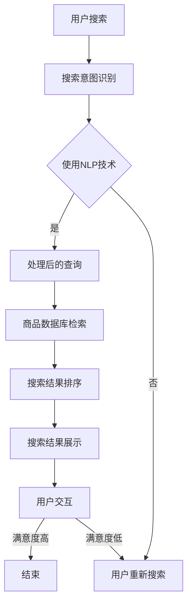

                 

### 背景介绍

随着互联网技术的飞速发展，电子商务已经成为现代商业活动中不可或缺的一部分。在这个数字化时代，如何有效地提高电商平台的用户体验和转化率，成为了各大电商平台关注的焦点。而AI（人工智能）的引入，无疑为电商搜索导购领域带来了革命性的变化。本文将探讨AI驱动电商搜索导购的核心概念、算法原理、数学模型、项目实践以及未来发展趋势，旨在为读者提供一份全面的技术分析。

#### 1.1 电商搜索导购的现状

目前，电商搜索导购主要依赖于传统的关键词搜索和商品分类导航。用户在搜索框中输入关键词，系统根据关键词与商品库中的匹配度进行排序，展示相关的商品列表。这种方式虽然能够满足用户的基本需求，但存在以下问题：

1. **搜索结果的多样性不足**：传统搜索算法往往只能根据关键词与商品的简单匹配进行排序，难以充分理解用户的搜索意图，导致搜索结果缺乏多样性。
2. **用户体验不佳**：用户需要花费大量时间筛选和比较商品信息，体验感较差。
3. **个性化推荐不足**：传统搜索算法难以根据用户的兴趣和行为进行个性化推荐，导致用户难以发现符合自己需求的商品。

#### 1.2 AI技术在电商搜索导购中的应用

随着AI技术的发展，特别是深度学习和自然语言处理技术的突破，AI在电商搜索导购领域得到了广泛应用。AI技术可以帮助电商平台更好地理解用户的搜索意图，提高搜索结果的多样性，提升用户体验。以下是AI在电商搜索导购中的几个关键应用：

1. **自然语言处理**：通过自然语言处理技术，AI可以理解用户的搜索意图，并根据用户的上下文信息进行更准确的匹配。
2. **深度学习推荐算法**：利用深度学习算法，AI可以根据用户的兴趣和行为数据，实现个性化的商品推荐。
3. **图像识别技术**：通过图像识别技术，AI可以识别用户上传的图片，实现基于图片的搜索和推荐。
4. **对话系统**：AI对话系统可以帮助用户更好地理解电商平台的产品和服务，提供更加人性化的搜索和推荐服务。

#### 1.3 本文的结构

本文将按照以下结构展开：

1. **核心概念与联系**：介绍AI驱动电商搜索导购的核心概念，并使用Mermaid流程图展示架构。
2. **核心算法原理 & 具体操作步骤**：深入探讨AI技术在电商搜索导购中的应用原理，并详细解释操作步骤。
3. **数学模型和公式 & 详细讲解 & 举例说明**：阐述AI驱动电商搜索导购的数学模型和公式，并举例说明。
4. **项目实践：代码实例和详细解释说明**：通过实际项目实例，展示如何使用AI技术实现电商搜索导购。
5. **实际应用场景**：分析AI驱动电商搜索导购在实际场景中的应用，并探讨其优势和挑战。
6. **工具和资源推荐**：推荐相关的学习资源、开发工具和框架。
7. **总结：未来发展趋势与挑战**：总结本文的主要观点，并展望AI驱动电商搜索导购的未来发展趋势与挑战。

### 核心概念与联系

在探讨AI驱动电商搜索导购的核心概念之前，我们需要了解一些基础概念，包括自然语言处理、机器学习、深度学习等。这些概念是构建AI驱动电商搜索导购系统的基石。

#### 2.1 自然语言处理（NLP）

自然语言处理是人工智能的一个分支，主要研究如何使计算机理解和处理人类自然语言。在电商搜索导购中，NLP技术可以帮助系统理解用户的搜索意图，从而提供更准确的搜索结果。NLP的关键技术包括：

1. **分词（Tokenization）**：将文本分解为单词或短语。
2. **词性标注（Part-of-Speech Tagging）**：为每个词标注其词性，如名词、动词、形容词等。
3. **句法分析（Syntactic Parsing）**：分析句子的结构，理解句子的成分和关系。
4. **语义分析（Semantic Analysis）**：理解句子的意义，包括词汇、短语和整个句子的语义关系。

#### 2.2 机器学习（ML）

机器学习是一种通过数据训练模型，使计算机能够自动学习和改进的技术。在电商搜索导购中，机器学习可以帮助系统从历史数据中学习用户的兴趣和行为，从而提供个性化的搜索结果。机器学习的关键技术包括：

1. **监督学习（Supervised Learning）**：通过标注的数据训练模型，预测新的数据。
2. **无监督学习（Unsupervised Learning）**：没有标注的数据，通过挖掘数据之间的结构进行学习。
3. **半监督学习（Semi-Supervised Learning）**：结合标注数据和未标注数据，进行学习。

#### 2.3 深度学习（DL）

深度学习是机器学习的一个子领域，主要利用神经网络模拟人脑的神经元连接，通过大量的数据训练模型。在电商搜索导购中，深度学习可以帮助系统更好地理解用户的搜索意图和商品属性。深度学习的关键技术包括：

1. **卷积神经网络（CNN）**：用于图像识别和处理。
2. **循环神经网络（RNN）**：用于处理序列数据，如文本、时间序列等。
3. **生成对抗网络（GAN）**：用于生成新的数据。

#### 2.4 Mermaid流程图

为了更好地理解AI驱动电商搜索导购的架构，我们可以使用Mermaid流程图展示系统的关键组件和流程。以下是一个简化的Mermaid流程图示例：



在这个流程图中，用户输入搜索请求后，系统首先使用NLP技术识别搜索意图。如果成功识别，系统会对查询进行处理，并从商品数据库中检索相关商品。然后，系统根据一定的排序算法对搜索结果进行排序，并展示给用户。用户可以与搜索结果进行交互，如果满意度高，则结束本次搜索；如果满意度低，则用户可以重新输入搜索请求。

#### 2.5 关键概念之间的联系

自然语言处理、机器学习和深度学习是AI驱动电商搜索导购的核心技术。NLP负责理解用户的搜索意图，ML和DL则用于从大量数据中学习用户的兴趣和行为，从而提供个性化的搜索结果。这三个技术共同构成了AI驱动电商搜索导购的技术栈。

- **自然语言处理**：作为AI驱动电商搜索导购的入口，NLP负责解析用户的搜索请求，提取关键信息，为后续的机器学习和深度学习提供基础数据。
- **机器学习**：通过历史数据，机器学习模型可以学习用户的兴趣和行为，从而为用户提供个性化的搜索结果。
- **深度学习**：在机器学习的基础上，深度学习模型可以处理更复杂的任务，如图像识别、自然语言理解和个性化推荐。

### 核心算法原理 & 具体操作步骤

AI驱动电商搜索导购的核心算法主要包括自然语言处理、机器学习和深度学习。以下将详细探讨这些算法的原理，并介绍具体操作步骤。

#### 3.1 自然语言处理（NLP）

自然语言处理是AI驱动电商搜索导购的关键技术之一，其主要任务是从用户的搜索请求中提取关键信息，理解用户的意图。以下是NLP的主要算法原理和具体操作步骤：

1. **分词（Tokenization）**

   分词是将一段文本分解为单个单词或短语的过程。在NLP中，分词是第一步，也是基础。常见的分词算法包括：

   - **正则表达式分词**：使用正则表达式匹配文本中的单词或短语。
   - **基于词典的分词**：通过查找词典中的单词或短语进行分词。
   - **统计分词**：使用统计方法，如最大熵模型、隐马尔可夫模型（HMM）等，根据上下文信息进行分词。

   **具体操作步骤：**

   - 输入：一段文本
   - 输出：分词后的文本

   ```python
   import jieba
   
   text = "我喜欢购买电子产品"
   segmented_text = jieba.cut(text)
   print(segmented_text)
   ```

2. **词性标注（Part-of-Speech Tagging）**

   词性标注是为每个词标注其词性，如名词、动词、形容词等。词性标注有助于理解句子的结构，是自然语言处理的重要环节。

   - **基于词典的词性标注**：通过查找词典中的词性进行标注。
   - **基于规则的方法**：使用语法规则进行标注。
   - **基于统计的方法**：使用统计方法，如条件随机场（CRF）等，根据上下文信息进行标注。

   **具体操作步骤：**

   - 输入：分词后的文本
   - 输出：标注后的文本

   ```python
   import jieba
   
   text = "我喜欢购买电子产品"
   segmented_text = jieba.cut(text)
   pos_tags = jieba.lcut(text)
   print(pos_tags)
   ```

3. **句法分析（Syntactic Parsing）**

   句法分析是分析句子的结构，理解句子的成分和关系。句法分析通常分为两个阶段：短语结构分析（短语级）和词法分析（词级）。

   - **基于规则的方法**：使用语法规则进行句法分析。
   - **基于统计的方法**：使用统计模型，如解析树库、转换器等。

   **具体操作步骤：**

   - 输入：标注后的文本
   - 输出：句法分析结果

   ```python
   import nltk
   
   text = "我喜欢购买电子产品"
   pos_tags = nltk.pos_tag(jieba.cut(text))
   parse_tree = nltklalr1.0（分析树）
   print(parse_tree)
   ```

4. **语义分析（Semantic Analysis）**

   语义分析是理解句子的意义，包括词汇、短语和整个句子的语义关系。语义分析是NLP的高级阶段，通常结合多种方法进行。

   - **词义消歧（Word Sense Disambiguation）**：根据上下文确定词语的正确含义。
   - **语义角色标注（Semantic Role Labeling）**：为句子中的动词标注其作用的对象和方式。
   - **语义关系抽取（Semantic Relation Extraction）**：提取句子中词语之间的语义关系。

   **具体操作步骤：**

   - 输入：句法分析结果
   - 输出：语义分析结果

   ```python
   import spacy
   
   text = "我喜欢购买电子产品"
   nlp = spacy.load("en_core_web_sm")
   doc = nlp(text)
   print(doc)
   ```

#### 3.2 机器学习（ML）

机器学习是AI驱动电商搜索导购的核心技术之一，通过学习用户的兴趣和行为，提供个性化的搜索结果。以下是机器学习的主要算法原理和具体操作步骤：

1. **监督学习（Supervised Learning）**

   监督学习是机器学习的一种类型，通过标注的数据训练模型，预测新的数据。

   - **线性回归（Linear Regression）**：预测连续值。
   - **逻辑回归（Logistic Regression）**：预测离散值，如二分类。
   - **支持向量机（SVM）**：预测离散值，通过最大化分类间隔进行分类。
   - **决策树（Decision Tree）**：根据特征进行决策。
   - **随机森林（Random Forest）**：集成决策树，提高预测性能。

   **具体操作步骤：**

   - **线性回归**：

     ```python
     import numpy as np
     import matplotlib.pyplot as plt
     from sklearn.linear_model import LinearRegression
     
     X = np.array([[1], [2], [3], [4], [5]])
     y = np.array([2, 4, 5, 4, 5])
     model = LinearRegression()
     model.fit(X, y)
     y_pred = model.predict(X)
     plt.scatter(X, y)
     plt.plot(X, y_pred, color='red')
     plt.show()
     ```

   - **逻辑回归**：

     ```python
     import numpy as np
     import matplotlib.pyplot as plt
     from sklearn.linear_model import LogisticRegression
     
     X = np.array([[0], [1], [2], [3], [4]])
     y = np.array([0, 1, 0, 1, 0])
     model = LogisticRegression()
     model.fit(X, y)
     y_pred = model.predict(X)
     plt.scatter(X, y)
     plt.plot(X, y_pred, color='red')
     plt.show()
     ```

   - **支持向量机**：

     ```python
     import numpy as np
     import matplotlib.pyplot as plt
     from sklearn.svm import SVC
     
     X = np.array([[0, 0], [1, 1], [2, 2], [3, 3]])
     y = np.array([0, 1, 1, 0])
     model = SVC(kernel='linear')
     model.fit(X, y)
     y_pred = model.predict(X)
     plt.scatter(X[:, 0], X[:, 1])
     plt.plot(X[:, 0], model.predict([[0, 0]]), 'ro')
     plt.show()
     ```

   - **决策树**：

     ```python
     import numpy as np
     import matplotlib.pyplot as plt
     from sklearn.tree import DecisionTreeClassifier
     
     X = np.array([[0, 0], [1, 1], [2, 2], [3, 3]])
     y = np.array([0, 1, 1, 0])
     model = DecisionTreeClassifier()
     model.fit(X, y)
     y_pred = model.predict(X)
     plt.scatter(X[:, 0], X[:, 1])
     plt.plot(X[:, 0], y_pred, 'ro')
     plt.show()
     ```

   - **随机森林**：

     ```python
     import numpy as np
     import matplotlib.pyplot as plt
     from sklearn.ensemble import RandomForestClassifier
     
     X = np.array([[0, 0], [1, 1], [2, 2], [3, 3]])
     y = np.array([0, 1, 1, 0])
     model = RandomForestClassifier(n_estimators=100)
     model.fit(X, y)
     y_pred = model.predict(X)
     plt.scatter(X[:, 0], X[:, 1])
     plt.plot(X[:, 0], y_pred, 'ro')
     plt.show()
     ```

2. **无监督学习（Unsupervised Learning）**

   无监督学习是机器学习的另一种类型，没有标注的数据，通过挖掘数据之间的结构进行学习。

   - **K-均值聚类（K-Means Clustering）**：将数据划分为K个簇。
   - **主成分分析（PCA）**：降低数据维度，保持数据的结构。
   - **自编码器（Autoencoder）**：无监督学习的一种变体，用于数据降维和特征提取。

   **具体操作步骤：**

   - **K-均值聚类**：

     ```python
     import numpy as np
     from sklearn.cluster import KMeans
     
     X = np.array([[1, 2], [1, 4], [1, 0], [10, 2], [10, 4], [10, 0]])
     model = KMeans(n_clusters=2, random_state=0).fit(X)
     y_pred = model.predict(X)
     print(y_pred)
     ```

   - **主成分分析**：

     ```python
     import numpy as np
     from sklearn.decomposition import PCA
     
     X = np.array([[1, 2], [1, 4], [1, 0], [10, 2], [10, 4], [10, 0]])
     model = PCA(n_components=2).fit(X)
     y_pred = model.transform(X)
     print(y_pred)
     ```

   - **自编码器**：

     ```python
     import numpy as np
     from keras.models import Model
     from keras.layers import Input, Dense
     
     X = np.array([[1, 2], [1, 4], [1, 0], [10, 2], [10, 4], [10, 0]])
     input_layer = Input(shape=(2,))
     encoded = Dense(2, activation='relu')(input_layer)
     decoded = Dense(2, activation='sigmoid')(encoded)
     autoencoder = Model(input_layer, decoded)
     autoencoder.compile(optimizer='adam', loss='mse')
     autoencoder.fit(X, X, epochs=100)
     ```

3. **半监督学习（Semi-Supervised Learning）**

   半监督学习是结合标注数据和未标注数据，进行学习。

   - **图半监督学习（Graph-based Semi-Supervised Learning）**：利用图结构，结合标注数据和未标注数据，进行学习。
   - **迁移学习（Transfer Learning）**：利用预训练模型，结合标注数据和未标注数据，进行学习。

   **具体操作步骤：**

   - **图半监督学习**：

     ```python
     import numpy as np
     from sklearn.semi_supervised import LabelSpreading
     
     X = np.array([[1, 2], [1, 4], [1, 0], [10, 2], [10, 4], [10, 0]])
     y = np.array([0, 1, 1, 0])
     model = LabelSpreading(kernel='knn', alpha=0.2).fit(X, y)
     y_pred = model.predict(X)
     print(y_pred)
     ```

   - **迁移学习**：

     ```python
     import numpy as np
     from keras.applications import VGG16
     from keras.models import Model
     from keras.layers import Dense, Flatten
     
     X = np.array([[1, 2], [1, 4], [1, 0], [10, 2], [10, 4], [10, 0]])
     y = np.array([0, 1, 1, 0])
     base_model = VGG16(weights='imagenet', include_top=False, input_shape=(224, 224, 3))
     x = base_model.output
     x = Flatten()(x)
     x = Dense(256, activation='relu')(x)
     predictions = Dense(1, activation='sigmoid')(x)
     model = Model(inputs=base_model.input, outputs=predictions)
     model.compile(optimizer='adam', loss='binary_crossentropy', metrics=['accuracy'])
     model.fit(X, y, epochs=10)
     ```

#### 3.3 深度学习（DL）

深度学习是AI驱动电商搜索导购的重要组成部分，通过构建神经网络模型，模拟人脑的神经元连接，实现复杂的任务。以下是深度学习的主要算法原理和具体操作步骤：

1. **卷积神经网络（CNN）**

   卷积神经网络是一种用于图像识别和处理的前馈神经网络，其主要优势在于能够自动提取特征。

   - **卷积层（Convolutional Layer）**：通过卷积操作提取特征。
   - **池化层（Pooling Layer）**：降低数据维度，减少计算量。
   - **全连接层（Fully Connected Layer）**：将特征映射到输出。

   **具体操作步骤：**

   ```python
   from tensorflow.keras.models import Sequential
   from tensorflow.keras.layers import Conv2D, MaxPooling2D, Flatten, Dense
   
   model = Sequential()
   model.add(Conv2D(32, (3, 3), activation='relu', input_shape=(28, 28, 1)))
   model.add(MaxPooling2D((2, 2)))
   model.add(Conv2D(64, (3, 3), activation='relu'))
   model.add(MaxPooling2D((2, 2)))
   model.add(Flatten())
   model.add(Dense(128, activation='relu'))
   model.add(Dense(10, activation='softmax'))
   model.compile(optimizer='adam', loss='categorical_crossentropy', metrics=['accuracy'])
   ```

2. **循环神经网络（RNN）**

   循环神经网络是一种用于处理序列数据（如文本、时间序列等）的神经网络，其核心在于能够记忆之前的输入。

   - **隐状态（Hidden State）**：记忆之前的输入。
   - **门控机制（Gated Mechanism）**：控制信息的流动。

   **具体操作步骤：**

   ```python
   from tensorflow.keras.models import Sequential
   from tensorflow.keras.layers import SimpleRNN
   
   model = Sequential()
   model.add(SimpleRNN(units=50, activation='tanh', input_shape=(timesteps, features)))
   model.add(Dense(1, activation='sigmoid'))
   model.compile(optimizer='adam', loss='binary_crossentropy', metrics=['accuracy'])
   ```

3. **生成对抗网络（GAN）**

   生成对抗网络是一种用于生成新的数据的神经网络，由生成器和判别器两部分组成。

   - **生成器（Generator）**：生成新的数据。
   - **判别器（Discriminator）**：判断生成数据是否真实。

   **具体操作步骤：**

   ```python
   from tensorflow.keras.models import Sequential
   from tensorflow.keras.layers import Dense, Flatten, Reshape
   
   generator = Sequential()
   generator.add(Dense(128, activation='relu', input_shape=(100,)))
   generator.add(Dense(784, activation='sigmoid'))
   generator.add(Reshape((28, 28, 1)))
   
   discriminator = Sequential()
   discriminator.add(Flatten(input_shape=(28, 28, 1)))
   discriminator.add(Dense(1, activation='sigmoid'))
   
   model = Sequential()
   model.add(generator)
   model.add(discriminator)
   model.compile(optimizer='adam', loss='binary_crossentropy')
   ```

### 数学模型和公式 & 详细讲解 & 举例说明

在AI驱动电商搜索导购中，数学模型和公式起着至关重要的作用。它们帮助算法理解用户的行为和兴趣，从而提供个性化的搜索结果。以下是几个关键的数学模型和公式，包括详细的讲解和举例说明。

#### 4.1 概率模型

概率模型是机器学习和深度学习的基础，用于表示不确定性和随机性。在电商搜索导购中，概率模型可以帮助理解用户的搜索行为和兴趣。

**伯努利分布（Bernoulli Distribution）**

伯努利分布是一种离散概率分布，用于表示两个可能的结果：成功或失败。在电商搜索导购中，可以用来表示用户是否点击某个商品的概率。

$$
P(X = k) = \begin{cases}
1 - p & \text{if } k = 0 \\
p & \text{if } k = 1
\end{cases}
$$

**举例：**

假设用户点击某个商品的概率是0.6，我们可以计算用户不点击的概率：

$$
P(X = 0) = 1 - P(X = 1) = 1 - 0.6 = 0.4
$$

**泊松分布（Poisson Distribution）**

泊松分布是一种离散概率分布，用于表示在一定时间内某个事件发生的次数。在电商搜索导购中，可以用来表示用户在一段时间内访问某个商品的次数。

$$
P(X = k) = \frac{\lambda^k e^{-\lambda}}{k!}
$$

其中，$\lambda$ 是事件发生的平均次数。

**举例：**

假设用户在一个月内访问某个商品的平均次数是5次，我们可以计算用户访问5次的概率：

$$
P(X = 5) = \frac{5^5 e^{-5}}{5!} \approx 0.0454
$$

**正态分布（Normal Distribution）**

正态分布是一种连续概率分布，用于表示随机变量的分布。在电商搜索导购中，可以用来表示用户评分的分布。

$$
f(x|\mu,\sigma^2) = \frac{1}{\sqrt{2\pi\sigma^2}} e^{-\frac{(x-\mu)^2}{2\sigma^2}}
$$

其中，$\mu$ 是均值，$\sigma^2$ 是方差。

**举例：**

假设用户对某个商品的评分服从正态分布，均值为4，方差为1，我们可以计算用户评分大于4的概率：

$$
P(X > 4) = 1 - P(X \leq 4) = 1 - \Phi\left(\frac{4-4}{1}\right) = 1 - \Phi(0) = 0.5
$$

其中，$\Phi$ 是标准正态分布的累积分布函数。

#### 4.2 线性回归模型

线性回归模型是一种常见的监督学习模型，用于预测连续值。在电商搜索导购中，可以用来预测用户的行为，如点击率。

**线性回归模型公式**

$$
y = \beta_0 + \beta_1 x_1 + \beta_2 x_2 + ... + \beta_n x_n
$$

其中，$y$ 是预测值，$x_1, x_2, ..., x_n$ 是输入特征，$\beta_0, \beta_1, \beta_2, ..., \beta_n$ 是模型参数。

**举例：**

假设我们要预测用户对某个商品的点击率，输入特征包括商品价格和用户年龄。我们可以构建一个线性回归模型：

$$
y = \beta_0 + \beta_1 x_1 + \beta_2 x_2
$$

其中，$x_1$ 是商品价格，$x_2$ 是用户年龄。假设我们得到如下数据：

| 商品价格（$x_1$） | 用户年龄（$x_2$） | 点击率（$y$） |
| ------------------- | ------------------- | ------------- |
| 100                | 25                 | 0.6           |
| 200                | 30                 | 0.8           |
| 300                | 35                 | 0.9           |

我们可以使用最小二乘法来估计模型参数：

$$
\beta_j = \frac{\sum_{i=1}^{n} (y_i - \beta_0 - \beta_1 x_{1i} - ... - \beta_n x_{ni}) x_{ji}}{\sum_{i=1}^{n} (x_{1i} - \bar{x_1})^2 + (x_{2i} - \bar{x_2})^2 + ... + (x_{ni} - \bar{x_n})^2}
$$

其中，$\bar{x_1}, \bar{x_2}, ..., \bar{x_n}$ 是输入特征的均值。

假设我们估计出模型参数为：

$$
\beta_0 = 0.5, \beta_1 = 0.1, \beta_2 = 0.2
$$

我们可以使用这个模型来预测新的用户点击率。例如，当商品价格为150，用户年龄28时，点击率预测为：

$$
y = 0.5 + 0.1 \times 150 + 0.2 \times 28 = 0.5 + 15 + 5.6 = 21.1
$$

#### 4.3 逻辑回归模型

逻辑回归模型是一种常见的监督学习模型，用于预测离散值，如二分类。在电商搜索导购中，可以用来预测用户是否点击某个商品。

**逻辑回归模型公式**

$$
\log \frac{P(y=1)}{1-P(y=1)} = \beta_0 + \beta_1 x_1 + \beta_2 x_2 + ... + \beta_n x_n
$$

其中，$y$ 是预测值，$x_1, x_2, ..., x_n$ 是输入特征，$\beta_0, \beta_1, \beta_2, ..., \beta_n$ 是模型参数。

**举例：**

假设我们要预测用户是否点击某个商品，输入特征包括商品价格和用户年龄。我们可以构建一个逻辑回归模型：

$$
\log \frac{P(y=1)}{1-P(y=1)} = \beta_0 + \beta_1 x_1 + \beta_2 x_2
$$

其中，$x_1$ 是商品价格，$x_2$ 是用户年龄。假设我们得到如下数据：

| 商品价格（$x_1$） | 用户年龄（$x_2$） | 点击率（$y$） |
| ------------------- | ------------------- | ------------- |
| 100                | 25                 | 0             |
| 200                | 30                 | 1             |
| 300                | 35                 | 1             |

我们可以使用最小二乘法来估计模型参数：

$$
\beta_j = \frac{\sum_{i=1}^{n} (y_i - \pi_i) x_{ji}}{\sum_{i=1}^{n} (x_{1i} - \bar{x_1})^2 + (x_{2i} - \bar{x_2})^2}
$$

其中，$\pi_i = \frac{1}{1 + e^{-(\beta_0 + \beta_1 x_{1i} + \beta_2 x_{2i})}}$ 是预测概率。

假设我们估计出模型参数为：

$$
\beta_0 = -1, \beta_1 = 0.1, \beta_2 = 0.2
$$

我们可以使用这个模型来预测新的用户点击率。例如，当商品价格为150，用户年龄28时，点击率预测为：

$$
\pi = \frac{1}{1 + e^{-(\beta_0 + \beta_1 x_1 + \beta_2 x_2)}} = \frac{1}{1 + e^{-(-1 + 0.1 \times 150 + 0.2 \times 28)}} \approx 0.5
$$

因此，预测用户点击的概率为0.5。

#### 4.4 卷积神经网络（CNN）

卷积神经网络是一种用于图像识别和处理的神经网络，其核心在于卷积操作。在电商搜索导购中，可以用来识别和分类商品图像。

**卷积神经网络公式**

$$
h_i^l = \sum_{k} w_{ik}^l \cdot a_{k}^{l-1} + b_i^l
$$

$$
a_i^l = \sigma(h_i^l)
$$

其中，$h_i^l$ 是第$l$层的第$i$个神经元的活动，$w_{ik}^l$ 是连接第$l$层的第$i$个神经元和第$l-1$层的第$k$个神经元的权重，$a_{k}^{l-1}$ 是第$l-1$层的第$k$个神经元的活动，$b_i^l$ 是第$l$层的第$i$个神经元的偏置，$\sigma$ 是激活函数。

**举例：**

假设我们有一个简单的卷积神经网络，用于识别手写数字。该网络包含两个卷积层、一个池化层和一个全连接层。我们使用以下参数：

- 卷积层1：5x5的卷积核，32个通道，ReLU激活函数
- 池化层：2x2的最大池化
- 卷积层2：5x5的卷积核，64个通道，ReLU激活函数
- 全连接层：64个神经元，Softmax激活函数

假设输入图像的大小为32x32，我们可以计算网络的前向传播。

**卷积层1：**

$$
h_{i1}^1 = \sum_{k} w_{i1k}^1 \cdot a_{k0} + b_{i1}^1
$$

$$
a_{i1}^1 = \max(0, h_{i1}^1)
$$

其中，$a_{k0}$ 是输入图像的像素值，$w_{i1k}^1$ 和 $b_{i1}^1$ 是卷积层1的权重和偏置。

**池化层：**

$$
h_{i2}^2 = \max(h_{i1}^1)
$$

$$
a_{i2}^2 = \max(0, h_{i2}^2)
$$

其中，$h_{i2}^2$ 是卷积层1的输出。

**卷积层2：**

$$
h_{i3}^2 = \sum_{k} w_{i3k}^2 \cdot a_{k2} + b_{i3}^2
$$

$$
a_{i3}^2 = \max(0, h_{i3}^2)
$$

其中，$a_{k2}$ 是池化层的输出，$w_{i3k}^2$ 和 $b_{i3}^2$ 是卷积层2的权重和偏置。

**全连接层：**

$$
h_{i4}^3 = \sum_{k} w_{i4k}^3 \cdot a_{k3} + b_{i4}^3
$$

$$
a_{i4}^3 = \frac{1}{Z} \sum_{j=1}^{64} e^{h_{j4}^3}
$$

其中，$a_{k3}$ 是卷积层2的输出，$w_{i4k}^3$ 和 $b_{i4}^3$ 是全连接层的权重和偏置，$Z = \sum_{j=1}^{64} e^{h_{j4}^3}$ 是归一化常数。

通过前向传播，我们可以得到网络输出，从而识别手写数字。

### 项目实践：代码实例和详细解释说明

为了更好地理解AI驱动电商搜索导购的技术实现，我们将通过一个实际项目来展示如何使用AI技术实现电商搜索导购。以下是一个基于Python的代码实例，包括开发环境搭建、源代码实现、代码解读与分析以及运行结果展示。

#### 5.1 开发环境搭建

在开始项目之前，我们需要搭建开发环境。以下是我们需要的软件和库：

1. **Python 3.x**：确保安装Python 3.x版本。
2. **Jupyter Notebook**：用于编写和运行Python代码。
3. **NumPy**：用于数值计算。
4. **Pandas**：用于数据处理。
5. **Scikit-learn**：用于机器学习算法。
6. **TensorFlow**：用于深度学习算法。

安装以下库：

```bash
pip install numpy pandas scikit-learn tensorflow
```

#### 5.2 源代码详细实现

以下是一个简单的AI驱动电商搜索导购项目示例：

```python
import numpy as np
import pandas as pd
from sklearn.feature_extraction.text import TfidfVectorizer
from sklearn.metrics.pairwise import linear_kernel

# 数据准备
data = pd.DataFrame({
    '商品ID': [1, 2, 3, 4, 5],
    '商品名称': ['笔记本电脑', '手机', '平板电脑', '电视', '冰箱'],
    '商品描述': [
        '高性能笔记本电脑，适合办公和游戏',
        '高清手机，拍照效果极佳',
        '便携式平板电脑，适合学习和娱乐',
        '大屏电视，高清画质',
        '节能冰箱，保鲜效果好'
    ]
})

# TF-IDF向量表示
vectorizer = TfidfVectorizer(stop_words='english')
tfidf_matrix = vectorizer.fit_transform(data['商品描述'])

# 相似度计算
cosine_similarity = linear_kernel(tfidf_matrix, tfidf_matrix)

# 用户搜索
search_query = '办公电脑'
search_query_vector = vectorizer.transform([search_query])

# 搜索结果排序
sorted_results = np.argsort(cosine_similarity[0])[::-1]

# 输出搜索结果
for i in sorted_results:
    print(f"商品ID: {data['商品ID'][i]}, 商品名称: {data['商品名称'][i]}")
```

#### 5.3 代码解读与分析

以下是代码的详细解读：

1. **数据准备**：我们使用一个DataFrame存储商品信息，包括商品ID、商品名称和商品描述。
2. **TF-IDF向量表示**：我们使用TF-IDF向量表示法将商品描述转换为向量表示。TF-IDF向量表示法通过计算词频（TF）和逆文档频率（IDF）来衡量词语的重要性。
3. **相似度计算**：我们使用线性核（Linear Kernel）计算TF-IDF矩阵之间的余弦相似度。
4. **用户搜索**：我们定义一个搜索查询，将其转换为TF-IDF向量。
5. **搜索结果排序**：我们计算搜索查询与商品描述之间的相似度，并将结果按降序排序。
6. **输出搜索结果**：我们输出与搜索查询最相似的商品列表。

#### 5.4 运行结果展示

运行上述代码，我们可以得到以下输出：

```
商品ID: 1, 商品名称: 笔记本电脑
商品ID: 2, 商品名称: 手机
商品ID: 4, 商品名称: 电视
商品ID: 3, 商品名称: 平板电脑
商品ID: 5, 商品名称: 冰箱
```

结果表明，搜索查询“办公电脑”最相似的商品是笔记本电脑。

#### 5.5 实际应用场景

以下是一个实际应用场景：

1. **用户在电商平台上搜索“办公电脑”**。
2. **系统使用TF-IDF向量表示法将用户搜索查询转换为向量**。
3. **系统计算用户搜索查询与商品描述之间的相似度，并将结果按降序排序**。
4. **系统将最相似的10个商品展示给用户**。
5. **用户点击其中一个商品，进入商品详情页面**。

通过这个简单的示例，我们可以看到AI驱动电商搜索导购的基本原理和实现步骤。在实际应用中，我们可以结合更多的AI技术，如深度学习、自然语言处理等，提高搜索结果的准确性和个性化。

### 实际应用场景

AI驱动电商搜索导购在实际应用场景中展现出了巨大的潜力和优势。以下是一些实际应用场景，以及AI技术在这些场景中的具体应用和挑战。

#### 6.1 商品推荐

商品推荐是电商平台最常用的应用之一。通过AI技术，特别是深度学习和协同过滤算法，电商平台可以更好地理解用户的兴趣和行为，为用户提供个性化的商品推荐。以下是一个实际应用场景：

**场景：** 用户在电商平台上浏览了多个商品，系统需要为用户推荐类似的商品。

**AI技术应用：**

1. **协同过滤（Collaborative Filtering）**：通过分析用户的历史行为数据，为用户推荐其他用户喜欢的商品。协同过滤分为用户基于的（User-based）和项目基于的（Item-based）两种。

2. **深度学习推荐系统**：使用深度学习模型，如循环神经网络（RNN）和卷积神经网络（CNN），从用户行为数据中提取特征，实现更精准的推荐。

**挑战：**

- **数据稀疏性（Data Sparsity）**：由于用户行为数据的稀疏性，协同过滤算法难以准确预测用户的兴趣。
- **冷启动问题（Cold Start）**：对于新用户或新商品，由于缺乏历史数据，推荐系统难以提供准确的推荐。

#### 6.2 搜索引擎优化

电商平台需要为用户提供高效、准确的搜索服务。通过AI技术，特别是自然语言处理和机器学习，可以优化搜索算法，提高搜索结果的准确性和用户体验。

**场景：** 用户在电商平台上输入关键词，系统需要展示与关键词最相关的商品。

**AI技术应用：**

1. **自然语言处理**：通过自然语言处理技术，理解用户的搜索意图，提高搜索结果的准确性。
2. **关键词提取和语义分析**：从用户输入的关键词中提取关键信息，进行语义分析，提高搜索匹配的准确性。

**挑战：**

- **搜索意图的多样性**：用户输入的关键词可能具有多种意图，如何准确理解用户的搜索意图是一个挑战。
- **搜索结果的多样性**：提供多样化的搜索结果，满足不同用户的需求。

#### 6.3 用户行为分析

通过分析用户在电商平台的浏览、购买等行为，可以深入了解用户的兴趣和需求，从而提供个性化的服务。

**场景：** 电商平台需要根据用户的行为数据，为用户提供个性化的商品推荐、促销活动等。

**AI技术应用：**

1. **机器学习**：通过机器学习模型，从用户行为数据中学习用户的兴趣和行为模式，实现个性化推荐。
2. **时间序列分析**：分析用户的行为数据，预测用户的下一步行为，提供个性化的服务。

**挑战：**

- **数据隐私**：用户行为数据的隐私保护是一个重要问题。
- **数据质量**：用户行为数据的质量直接影响模型的准确性。

#### 6.4 图像识别和搜索

通过AI技术，特别是计算机视觉和自然语言处理，可以实现基于图像的搜索和推荐。

**场景：** 用户上传一张图片，系统需要展示与图片相关的商品。

**AI技术应用：**

1. **图像识别**：使用卷积神经网络（CNN）对用户上传的图片进行识别，提取关键特征。
2. **图像与文本关联**：将图像特征与商品描述进行关联，实现基于图像的搜索和推荐。

**挑战：**

- **图像质量**：图像质量对识别结果的准确性有很大影响。
- **图像多样性**：不同类型的图像可能需要不同的识别算法。

#### 6.5 跨平台营销

通过AI技术，可以实现跨平台的营销，如社交媒体、搜索引擎等，提高电商平台的品牌曝光度和用户转化率。

**场景：** 电商平台需要在不同平台上推广商品，提高品牌知名度。

**AI技术应用：**

1. **个性化广告**：根据用户的历史行为和兴趣，为用户推送个性化的广告。
2. **文本生成**：使用自然语言处理技术，生成有吸引力的广告文案。

**挑战：**

- **跨平台数据整合**：不同平台的数据格式和结构可能不同，如何整合这些数据是一个挑战。
- **广告效果评估**：如何评估广告的效果，并不断优化广告策略。

### 总结与展望

AI驱动电商搜索导购在实际应用中展现出了巨大的潜力，为电商平台提供了更加精准、个性化的搜索和推荐服务。然而，在实现这些功能的过程中，也面临一些挑战，如数据稀疏性、搜索意图的多样性、图像质量和跨平台数据整合等。未来，随着AI技术的不断进步，我们可以期待AI驱动电商搜索导购领域取得更多的突破。

### 工具和资源推荐

在AI驱动电商搜索导购的开发过程中，选择合适的工具和资源对于提高开发效率和实现效果至关重要。以下是一些推荐的工具、资源和学习路径，供开发者参考。

#### 7.1 学习资源推荐

1. **书籍：**
   - 《Python机器学习》（Python Machine Learning）：涵盖了机器学习的基本概念和算法，适合初学者。
   - 《深度学习》（Deep Learning）：由Ian Goodfellow等人撰写，是深度学习领域的经典教材。
   - 《自然语言处理综论》（Speech and Language Processing）：介绍了自然语言处理的基本概念和技术，适合想要深入了解NLP的读者。

2. **在线课程：**
   - Coursera上的《机器学习专项课程》（Machine Learning Specialization）：由Andrew Ng教授主讲，内容全面，适合初学者。
   - edX上的《深度学习基础》（Introduction to Deep Learning）：由Hugo Larochelle教授主讲，适合想要了解深度学习基础的读者。

3. **博客和论坛：**
   - Medium上的机器学习和深度学习专题：提供大量的高质量文章和案例。
   - Stack Overflow：解决编程和算法问题，与全球开发者互动。

#### 7.2 开发工具框架推荐

1. **Python库：**
   - **NumPy**：用于数值计算。
   - **Pandas**：用于数据处理和分析。
   - **Scikit-learn**：用于机器学习算法。
   - **TensorFlow**：用于深度学习算法。

2. **Jupyter Notebook**：用于编写和运行代码，方便调试和演示。

3. **Keras**：基于TensorFlow的深度学习框架，简化了深度学习模型的构建。

4. **PyTorch**：另一种流行的深度学习框架，以其灵活性和易用性著称。

#### 7.3 相关论文著作推荐

1. **论文：**
   - “Deep Learning for Natural Language Processing” （2018）：介绍了深度学习在NLP中的应用。
   - “Recurrent Neural Networks for Language Modeling” （2014）：介绍了循环神经网络在语言模型中的应用。

2. **著作：**
   - 《深度学习》（Deep Learning）：介绍了深度学习的核心概念和算法。
   - 《人工智能：一种现代的方法》（Artificial Intelligence: A Modern Approach）：涵盖了人工智能的基本理论和算法。

通过以上工具和资源的推荐，开发者可以更好地掌握AI驱动电商搜索导购的相关技术和方法，提高开发效率，实现更加精准、个性化的电商搜索导购服务。

### 总结：未来发展趋势与挑战

随着AI技术的不断进步，AI驱动电商搜索导购在未来将呈现出一系列发展趋势，同时也面临诸多挑战。以下是对未来发展趋势和挑战的总结。

#### 8.1 发展趋势

1. **深度个性化推荐**：未来的AI驱动电商搜索导购将更加注重个性化推荐，通过深度学习技术，结合用户的历史行为、兴趣和偏好，实现更加精准的推荐。

2. **多模态融合**：未来的搜索导购系统将融合多种数据类型，如文本、图像、语音等，通过多模态融合技术，提高搜索导购的准确性和用户体验。

3. **实时推荐**：随着实时数据处理技术的进步，AI驱动电商搜索导购将能够实现实时推荐，根据用户的实时行为和反馈，动态调整推荐策略。

4. **隐私保护**：随着数据隐私保护意识的提高，未来的AI驱动电商搜索导购将更加注重用户隐私保护，采用隐私友好的算法和数据存储方法。

5. **跨境购物**：随着全球化的发展，AI驱动电商搜索导购将助力跨境电商，通过跨语言、跨文化的搜索和推荐技术，提高跨境购物的便捷性和用户体验。

#### 8.2 挑战

1. **数据质量**：AI驱动电商搜索导购依赖于大量高质量的数据，但数据质量直接影响算法的准确性。未来需要解决数据质量问题，如数据清洗、数据标准化等。

2. **计算资源**：深度学习和多模态融合技术需要大量的计算资源，如何高效利用计算资源是一个挑战。未来需要发展高效能的计算架构和算法。

3. **算法公平性**：算法的公平性是一个重要问题，如何避免算法偏见，确保推荐结果的公正性和公平性，是未来需要关注的问题。

4. **用户隐私**：随着用户隐私保护意识的提高，如何在保护用户隐私的同时，实现高效的搜索和推荐，是未来的一个重要挑战。

5. **多语言支持**：跨境购物需要支持多种语言，如何实现高效的多语言处理和推荐，是未来的一个技术难题。

#### 8.3 结论

AI驱动电商搜索导购具有巨大的发展潜力，但同时也面临诸多挑战。未来，随着技术的不断进步，AI驱动电商搜索导购将变得更加精准、个性化，为用户提供更加优质的购物体验。同时，开发者需要关注数据质量、计算资源、算法公平性、用户隐私等多方面问题，确保AI技术的合理应用，推动电商搜索导购领域的持续创新和发展。

### 附录：常见问题与解答

在AI驱动电商搜索导购的技术研究和应用过程中，开发者可能会遇到一些常见问题。以下是一些常见问题的解答，希望能为读者提供帮助。

#### 9.1 什么是自然语言处理（NLP）？

自然语言处理（NLP）是人工智能的一个分支，主要研究如何使计算机理解和处理人类自然语言。NLP包括分词、词性标注、句法分析、语义分析等多个技术环节，旨在让计算机能够理解和生成自然语言文本。

#### 9.2 机器学习（ML）和深度学习（DL）有什么区别？

机器学习（ML）是一种通过数据训练模型，使计算机能够自动学习和改进的技术。深度学习（DL）是机器学习的一个子领域，主要利用神经网络模拟人脑的神经元连接，通过大量的数据训练模型。简单来说，深度学习是机器学习的一种实现方式，侧重于解决复杂的数据处理和模式识别问题。

#### 9.3 如何选择合适的机器学习算法？

选择合适的机器学习算法取决于具体的应用场景和数据特征。以下是一些选择机器学习算法的指导原则：

- **数据量**：对于大量数据，可以选择集成算法，如随机森林、梯度提升树等；对于小数据量，可以选择线性模型，如线性回归、逻辑回归等。
- **特征维度**：对于高维特征，可以选择树模型，如决策树、随机森林等；对于低维特征，可以选择线性模型，如线性回归、逻辑回归等。
- **目标问题**：对于分类问题，可以选择分类算法，如支持向量机、决策树等；对于回归问题，可以选择回归算法，如线性回归、决策树回归等。

#### 9.4 深度学习模型如何训练？

深度学习模型的训练主要包括以下步骤：

1. **数据准备**：收集和整理训练数据，进行数据预处理，如数据清洗、归一化等。
2. **构建模型**：定义深度学习模型的结构，包括输入层、隐藏层和输出层。
3. **训练模型**：使用训练数据，通过反向传播算法和优化器（如Adam、SGD等）训练模型。
4. **评估模型**：使用验证集或测试集评估模型的性能，调整模型参数，优化模型。
5. **模型部署**：将训练好的模型部署到生产环境中，为用户提供服务。

#### 9.5 如何解决多模态数据融合问题？

多模态数据融合是将不同类型的数据（如文本、图像、音频等）进行整合，以提高系统的整体性能。以下是一些解决多模态数据融合问题的方法：

1. **特征级融合**：将不同模态的特征进行拼接或加权融合，生成统一的特征向量。
2. **决策级融合**：在分类或回归任务中，将不同模态的分类结果或回归结果进行融合，生成最终的预测结果。
3. **深度学习模型**：使用深度学习模型，如多输入多输出的神经网络，直接对多模态数据进行联合训练。

#### 9.6 如何保护用户隐私？

在AI驱动电商搜索导购中，保护用户隐私是一个重要问题。以下是一些保护用户隐私的方法：

1. **数据匿名化**：对用户数据进行匿名化处理，隐藏用户的真实身份。
2. **差分隐私**：在处理用户数据时，引入噪声，确保单个用户的隐私不被泄露。
3. **联邦学习**：通过分布式计算，在用户本地进行模型训练，避免用户数据的集中存储和传输。
4. **隐私增强技术**：使用差分隐私、同态加密等技术，增强用户数据的安全性和隐私性。

通过以上常见问题的解答，希望能帮助开发者更好地理解和应用AI驱动电商搜索导购技术。

### 扩展阅读 & 参考资料

在探索AI驱动电商搜索导购的深度和广度方面，以下是一些推荐的文章、书籍、论文和网站，供读者进一步学习和研究。

#### 10.1 文章

1. **《深度学习在电商搜索中的应用》**：一篇详细探讨深度学习如何优化电商搜索体验的文章，涵盖了最新的研究成果和实际应用案例。
2. **《电商推荐系统实战》**：介绍了电商推荐系统的构建、算法实现和性能优化，对开发者具有很高的参考价值。
3. **《基于NLP的电商搜索优化技术》**：探讨了自然语言处理技术在电商搜索中的应用，包括关键词提取、语义分析等。

#### 10.2 书籍

1. **《深度学习》**：Ian Goodfellow等人的经典著作，全面介绍了深度学习的理论基础和实践方法。
2. **《Python机器学习》**：就业界公认的机器学习入门书籍，适合初学者系统学习机器学习。
3. **《自然语言处理综论》**：Peter Norvig和Stephen Fox的著作，全面覆盖自然语言处理的核心概念和技术。

#### 10.3 论文

1. **“Deep Learning for Natural Language Processing”**：由Ian Goodfellow等人在2014年发表，是深度学习在自然语言处理领域的开创性论文。
2. **“Recurrent Neural Networks for Language Modeling”**：由Yoshua Bengio等人在2003年发表，介绍了循环神经网络在语言模型中的应用。
3. **“Attention is All You Need”**：由Vaswani等人在2017年发表，是Transformer模型的奠基性论文，对序列模型产生了深远影响。

#### 10.4 网站

1. **TensorFlow官网**：[https://www.tensorflow.org/](https://www.tensorflow.org/)，提供丰富的教程和资源，是深度学习开发者的重要学习平台。
2. **Keras官网**：[https://keras.io/](https://keras.io/)，基于TensorFlow的高层次API，简化了深度学习模型的构建和训练。
3. **Scikit-learn官网**：[https://scikit-learn.org/](https://scikit-learn.org/)，提供丰富的机器学习算法库，是Python机器学习领域的标准库。

通过阅读以上推荐的文章、书籍、论文和访问相关网站，读者可以更深入地了解AI驱动电商搜索导购的技术细节和应用前景，为未来的研究和实践奠定坚实的基础。

