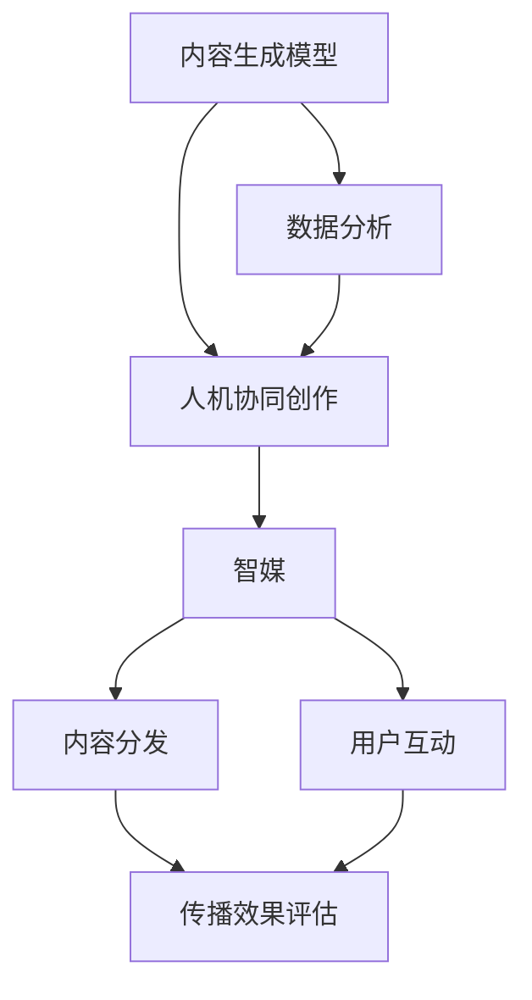

                 

### 背景介绍

#### 引言

近年来，人工智能技术（AI）的迅猛发展，为我们带来了前所未有的机遇。特别是在人工智能生成内容（AIGC）领域，计算机开始展现出超越人类创作者的创造能力。AIGC，作为一种新兴的内容生成技术，通过算法生成文本、图像、音频等多种形式的内容，极大地丰富了互联网信息的多样性。本文将探讨AIGC在传媒行业中的应用，重点分析人机协同创作这一创新场景，如何推动传媒向智媒转变。

#### 传媒行业的现状

传媒行业一直以来都是信息传播的重要载体，从传统的报纸、电视到如今的互联网媒体，传媒行业的变革从未停止。然而，随着用户需求的多样化和信息过载的问题日益严重，传统媒体面临着巨大的挑战。一方面，媒体内容的生产速度难以跟上市场的需求；另一方面，单一的人工创作模式难以满足个性化的用户体验。

正是在这样的背景下，AIGC技术应运而生。通过自动化、智能化的方式生成内容，AIGC不仅能够解决内容生产速度和个性化需求的矛盾，还能够为传统媒体注入新的活力。本文将从以下几个方面详细探讨AIGC在传媒行业中的应用及其带来的变革。

#### AIGC技术的发展历程

AIGC技术的发展可以追溯到人工智能的早期研究。20世纪50年代，人工智能的概念首次被提出，随后在60年代和70年代，出现了诸如规则推理、知识表示等早期的人工智能算法。然而，由于计算能力的限制，这些算法在实际应用中难以发挥其潜力。

直到21世纪初，随着大数据和云计算技术的崛起，人工智能的研究和应用迎来了新的契机。深度学习作为人工智能的一个重要分支，开始在图像识别、自然语言处理等领域取得突破性进展。这一时期，AIGC技术逐渐从理论走向实践，通过生成对抗网络（GAN）、变分自编码器（VAE）等先进的算法，实现了高质量的内容生成。

近年来，随着计算能力的进一步提升和数据的爆炸性增长，AIGC技术不断成熟，开始广泛应用于各个领域。特别是在传媒行业，AIGC技术展现出巨大的潜力，为传统媒体的创新提供了新的思路。

### 核心概念与联系

在深入了解AIGC在传媒行业的应用之前，有必要对AIGC的核心概念及其与传媒行业的联系进行详细阐述。AIGC技术涉及多个关键概念，包括内容生成模型、人机协同创作以及智媒等，这些概念共同构成了AIGC技术的理论基础和应用场景。

#### 内容生成模型

内容生成模型是AIGC技术的核心组成部分，它通过学习大量数据，生成与输入数据相似的新内容。目前，常用的内容生成模型包括生成对抗网络（GAN）、变分自编码器（VAE）和递归神经网络（RNN）等。

- **生成对抗网络（GAN）**：GAN由生成器和判别器两个神经网络组成。生成器试图生成逼真的数据，而判别器则负责判断输入数据是真实数据还是生成数据。通过生成器和判别器的对抗训练，生成器逐渐提高生成质量。

- **变分自编码器（VAE）**：VAE通过学习数据的高效编码表示，生成新的数据。其核心思想是将数据分布编码为一个潜在空间，然后从潜在空间中采样生成新数据。

- **递归神经网络（RNN）**：RNN特别适用于处理序列数据，如文本。通过循环神经网络结构，RNN能够捕捉序列中的时间依赖关系，从而生成连贯的文本内容。

这些内容生成模型通过学习大量数据，生成高质量的内容，为AIGC技术在传媒行业的应用提供了基础。

#### 人机协同创作

人机协同创作是指人与人工智能系统共同创作内容的过程。在这种模式下，人工智能系统负责处理大量的数据和复杂计算，而人类创作者则负责提供创意、指导方向和质量把控。

- **人类创作者的职责**：人类创作者主要负责创意策划、内容审核和最终产品的质量把控。他们利用人工智能系统提供的工具和算法，实现创作过程的智能化和高效化。

- **人工智能系统的职责**：人工智能系统则负责数据分析和处理，生成初步的内容，并根据人类创作者的反馈进行调整。通过这种方式，人工智能系统辅助人类创作者，提升创作效率和内容质量。

人机协同创作不仅解决了传统人工创作模式中速度和质量之间的矛盾，还使得创作过程更加灵活和多样化。

#### 智媒

智媒，即智能媒体，是指运用人工智能技术实现媒体内容生成、分发、交互和优化的新型媒体形式。智媒的核心在于将人工智能技术与传统媒体深度融合，实现智能化、个性化、互动化的媒体传播。

- **智能化**：通过人工智能技术，智媒能够实现内容的自动生成和个性化推荐，提高信息传播的效率和效果。

- **个性化**：智媒能够根据用户的兴趣和行为，提供个性化的内容推荐，满足用户的个性化需求。

- **互动化**：智媒通过人工智能技术，实现用户与内容的互动，提升用户体验和参与度。

智媒的发展，标志着传媒行业向智能化、个性化的方向迈进，为传统媒体的创新提供了新的动力。

#### 关系网络

以上三个核心概念之间相互联系，共同构成了AIGC在传媒行业中的应用框架。

- **内容生成模型**为人机协同创作提供了技术基础，使得高质量的内容生成成为可能。

- **人机协同创作**实现了人与人工智能系统的优势互补，提升了创作效率和内容质量。

- **智媒**则将人工智能技术与传统媒体深度融合，推动传媒行业的智能化、个性化转型。

通过这种关系网络，AIGC技术在传媒行业的应用得以实现，为传统媒体的创新发展提供了新路径。

### 总结

本节对AIGC技术的核心概念进行了详细阐述，包括内容生成模型、人机协同创作和智媒。这些概念共同构成了AIGC技术在传媒行业应用的理论基础。接下来，我们将进一步探讨AIGC技术的核心算法原理和具体操作步骤，为深入理解AIGC在传媒行业中的应用奠定基础。

## 2. 核心概念与联系

### 核心概念阐述

在深入了解AIGC在传媒行业的应用之前，我们首先需要掌握几个关键概念：内容生成模型、人机协同创作以及智媒。这些概念不仅是AIGC技术的基础，也是推动传媒行业变革的重要力量。

#### 内容生成模型

内容生成模型是AIGC技术的核心组成部分，负责生成文本、图像、音频等多种形式的内容。以下是一些常用的内容生成模型：

1. **生成对抗网络（GAN）**：GAN由生成器和判别器两个部分组成。生成器的目标是生成逼真的数据，而判别器的目标是区分真实数据和生成数据。通过这种对抗训练，生成器不断提高生成质量。

2. **变分自编码器（VAE）**：VAE通过学习数据的高效编码表示，生成新的数据。它通过引入潜在变量，使得生成的数据具有更好的鲁棒性和多样性。

3. **递归神经网络（RNN）**：RNN特别适用于处理序列数据，如文本。通过捕捉序列中的时间依赖关系，RNN能够生成连贯的文本内容。

4. **注意力机制（Attention Mechanism）**：注意力机制能够提高神经网络在处理长序列数据时的效果，使得模型能够更加关注重要的信息。

#### 人机协同创作

人机协同创作是指人类创作者与人工智能系统共同进行创作的过程。在这种模式下，人工智能系统负责处理大量的数据和复杂计算，而人类创作者则负责提供创意、指导和质量把控。

人机协同创作具有以下优点：

1. **高效性**：人工智能系统能够快速处理大量数据，生成初步的内容，大大提高了创作速度。

2. **高质量**：通过人工智能系统的辅助，人类创作者能够更加专注于创意和质量把控，提高创作质量。

3. **灵活性**：人机协同创作允许创作者根据实际情况进行灵活调整，适应不同的创作需求和场景。

4. **多样性**：人工智能系统能够生成多样化、个性化内容，为创作者提供了更多的选择和灵感。

#### 智媒

智媒，即智能媒体，是指将人工智能技术与传统媒体深度融合，实现智能化、个性化、互动化的新型媒体形式。智媒的核心在于通过人工智能技术，实现媒体内容的自动生成、推荐、优化和互动。

1. **智能化**：通过人工智能技术，智媒能够自动生成内容，实现信息的自动化生产和更新。

2. **个性化**：智媒能够根据用户的兴趣和行为，提供个性化的内容推荐，满足用户的个性化需求。

3. **互动化**：智媒通过人工智能技术，实现用户与内容的互动，提升用户体验和参与度。

4. **优化**：智媒能够通过数据分析和机器学习，优化内容分发和推荐策略，提高传播效果。

#### 关系网络

以上三个核心概念之间相互联系，共同构成了AIGC在传媒行业应用的理论基础。

- **内容生成模型**为人机协同创作提供了技术基础，使得高质量的内容生成成为可能。

- **人机协同创作**实现了人与人工智能系统的优势互补，提升了创作效率和内容质量。

- **智媒**则将人工智能技术与传统媒体深度融合，推动传媒行业的智能化、个性化转型。

通过这种关系网络，AIGC技术在传媒行业的应用得以实现，为传统媒体的创新发展提供了新路径。

### Mermaid 流程图

为了更好地展示AIGC在传媒行业的应用流程，我们使用Mermaid语言绘制了以下流程图：



在这个流程图中，内容生成模型通过数据分析为人机协同创作提供支持，人机协同创作生成的内容通过智媒进行分发和互动，最终通过传播效果评估优化内容生成和用户互动。

### 总结

本节对AIGC技术的核心概念进行了详细阐述，包括内容生成模型、人机协同创作和智媒。这些概念相互联系，共同构成了AIGC在传媒行业应用的理论基础。在接下来的章节中，我们将进一步探讨AIGC技术的核心算法原理和具体操作步骤，为深入理解AIGC在传媒行业中的应用奠定基础。

### 核心算法原理 & 具体操作步骤

在了解了AIGC技术的核心概念之后，接下来我们将深入探讨其核心算法原理和具体操作步骤。AIGC技术的核心在于利用先进的机器学习算法生成高质量的内容，从而实现人机协同创作和智媒应用。以下是一些常用的AIGC算法，包括生成对抗网络（GAN）、变分自编码器（VAE）和递归神经网络（RNN）等。

#### 生成对抗网络（GAN）

生成对抗网络（GAN）是由生成器（Generator）和判别器（Discriminator）组成的对抗性模型。生成器的目标是生成逼真的数据，判别器的目标是区分真实数据和生成数据。通过这种对抗训练，生成器不断提高生成质量。

1. **生成器（Generator）**：生成器的任务是生成与真实数据相似的数据。通常，生成器由一个多层神经网络组成，输入为随机噪声，输出为生成数据。

2. **判别器（Discriminator）**：判别器的任务是判断输入数据是真实数据还是生成数据。同样，判别器也是一个多层神经网络，输入为数据，输出为概率，表示输入数据为真实数据的概率。

3. **对抗训练**：生成器和判别器通过对抗训练相互提高。在训练过程中，生成器尝试生成更加逼真的数据，而判别器则努力区分真实数据和生成数据。通过不断迭代，生成器的生成质量逐渐提高，判别器的判断能力也不断提高。

4. **损失函数**：GAN的训练过程通常使用两种损失函数，分别是生成器损失和判别器损失。生成器损失用于衡量生成数据与真实数据的相似度，判别器损失用于衡量判别器判断真实数据和生成数据的准确度。

#### 变分自编码器（VAE）

变分自编码器（VAE）是一种生成模型，通过学习数据的高效编码表示，生成新的数据。VAE的核心思想是将数据分布编码为一个潜在空间，然后从潜在空间中采样生成新数据。

1. **编码器（Encoder）**：编码器的任务是学习数据的潜在分布。编码器通常由一个多层神经网络组成，输入为数据，输出为潜在空间中的表示。

2. **解码器（Decoder）**：解码器的任务是生成新数据。解码器同样是一个多层神经网络，输入为潜在空间的表示，输出为生成数据。

3. **潜在空间**：VAE通过引入潜在空间，使得生成的数据具有更好的鲁棒性和多样性。潜在空间中的每个点都对应着一种可能的生成数据。

4. **损失函数**：VAE的训练过程使用两种损失函数，分别是重建损失和KL散度损失。重建损失用于衡量生成数据与输入数据的相似度，KL散度损失用于衡量编码器输出的潜在分布与先验分布的差异。

#### 递归神经网络（RNN）

递归神经网络（RNN）是一种能够处理序列数据的神经网络，特别适用于生成文本等序列数据。

1. **输入层**：输入层接收序列数据，例如单词或字符。

2. **隐藏层**：隐藏层通过递归连接捕捉序列中的时间依赖关系。每个时间步的输出都依赖于前一个时间步的输出。

3. **输出层**：输出层生成最终的输出序列，例如文本。

4. **训练过程**：RNN的训练过程使用序列数据，通过反向传播算法更新网络参数，使得模型能够生成高质量的序列数据。

#### 具体操作步骤

下面我们将以一个简单的文本生成任务为例，介绍如何使用GAN、VAE和RNN生成文本。

1. **数据准备**：首先，我们需要准备训练数据。对于文本生成任务，可以使用大规模语料库，如维基百科、新闻文章等。

2. **模型构建**：根据任务需求，选择合适的模型架构。例如，对于GAN，我们可以选择一个由多层感知机组成的生成器和判别器。对于VAE，我们可以选择一个编码器和解码器。对于RNN，我们可以选择一个简单的RNN模型。

3. **模型训练**：使用训练数据对模型进行训练。在GAN中，生成器和判别器交替训练，通过优化生成器的生成质量和判别器的判断能力。在VAE中，通过优化重建损失和KL散度损失，使得编码器和解码器能够生成高质量的文本。在RNN中，通过优化损失函数，使得模型能够生成连贯的文本。

4. **生成文本**：在模型训练完成后，我们可以使用模型生成新的文本。对于GAN，生成器将生成逼真的文本。对于VAE，解码器将生成新的文本。对于RNN，模型将生成连贯的文本序列。

5. **模型优化**：根据生成文本的质量，我们可以对模型进行进一步优化。例如，可以通过增加训练数据、调整模型参数等方式提高生成质量。

通过以上步骤，我们可以利用AIGC技术实现文本生成任务，为传媒行业提供创新的内容生成解决方案。

### 总结

在本节中，我们详细介绍了AIGC技术的核心算法原理和具体操作步骤，包括生成对抗网络（GAN）、变分自编码器（VAE）和递归神经网络（RNN）。这些算法通过学习和生成高质量的内容，为人机协同创作和智媒应用提供了强大的支持。在下一节中，我们将进一步探讨数学模型和公式，为深入理解AIGC技术的数学基础奠定基础。

### 数学模型和公式

在深入了解AIGC技术的核心算法之后，接下来我们将探讨其背后的数学模型和公式。这些数学模型和公式不仅为AIGC技术提供了理论基础，也为我们理解和优化这些算法提供了关键工具。

#### 生成对抗网络（GAN）的数学模型

生成对抗网络（GAN）的核心在于生成器和判别器的对抗训练。以下是其数学模型的关键组成部分：

1. **生成器（Generator）**：

   生成器G的目的是从随机噪声z中生成与真实数据x相似的样本。其目标函数通常表示为：

   $$ G(z) = x' $$

   其中，z是随机噪声，x'是生成器生成的样本。

   生成器的损失函数通常使用对抗性损失（Adversarial Loss），其形式如下：

   $$ L_G = -\log(D(G(z))) $$

   其中，D是判别器，G(z)是生成器生成的样本。

2. **判别器（Discriminator）**：

   判别器D的目的是区分真实数据x和生成数据x'。其目标函数表示为：

   $$ L_D = -[\log(D(x)) + \log(1 - D(G(z)))] $$

   其中，D(x)是判别器对真实数据的判断概率，1 - D(G(z))是判别器对生成数据的判断概率。

3. **联合损失函数**：

   GAN的总体损失函数是生成器和判别器损失函数的组合：

   $$ L_{总} = L_G + L_D $$

   在训练过程中，通过交替优化生成器和判别器的参数，使得生成器生成的样本越来越接近真实数据，同时判别器能够更好地区分真实数据和生成数据。

#### 变分自编码器（VAE）的数学模型

变分自编码器（VAE）是一种基于概率模型的生成模型，其核心在于将输入数据的分布编码为一个潜在空间，并从该空间中采样生成新数据。

1. **编码器（Encoder）**：

   编码器E从输入数据x中学习一个潜在变量表示\( \mu(x) \)和\( \sigma^2(x) \)：

   $$ \mu(x) = \mu(x) \\
   \sigma^2(x) = \sigma^2(x) $$

   其中，\( \mu(x) \)和\( \sigma^2(x) \)分别是均值和方差，表示潜在变量的概率分布。

2. **解码器（Decoder）**：

   解码器D从潜在空间中采样生成输入数据：

   $$ x' = \mu(x) + \sigma(x) \odot \epsilon $$

   其中，\( \epsilon \)是标准正态分布的随机变量。

3. **损失函数**：

   VAE的损失函数由重建损失和KL散度损失组成：

   $$ L_{VAE} = \sum_{x} D(x, x') + \lambda \cdot D_{KL}(\mu(x), \sigma^2(x)) $$

   其中，\( D(x, x') \)是输入数据与生成数据之间的相似度度量，通常使用交叉熵损失；\( D_{KL} \)是KL散度，用于度量编码器输出的潜在分布与先验分布之间的差异。

#### 递归神经网络（RNN）的数学模型

递归神经网络（RNN）是一种用于处理序列数据的神经网络，其核心在于递归连接。

1. **状态更新**：

   RNN在每一个时间步\( t \)更新状态\( h_t \)：

   $$ h_t = \sigma(W_h \cdot [h_{t-1}, x_t] + b_h) $$

   其中，\( \sigma \)是激活函数，\( W_h \)和\( b_h \)分别是权重和偏置。

2. **输出**：

   RNN的输出通常取决于最后一个时间步的状态：

   $$ y_t = W_o \cdot h_t + b_o $$

   其中，\( W_o \)和\( b_o \)分别是权重和偏置。

3. **损失函数**：

   RNN的训练通常使用序列损失函数，如交叉熵损失：

   $$ L_{RNN} = -\sum_{t} y_t \cdot \log(p(y_t | h_t)) $$

   其中，\( p(y_t | h_t) \)是输出概率。

### 举例说明

为了更好地理解上述数学模型和公式，我们通过一个简单的例子来说明GAN的生成过程。

假设我们有一个GAN模型，生成器G和判别器D分别是一个多层感知机。训练数据集D包含大量真实图像和噪声图像。

1. **初始化参数**：

   初始化生成器G和判别器D的参数\( \theta_G \)和\( \theta_D \)。

2. **生成器训练**：

   在生成器的训练过程中，我们生成噪声图像，并通过判别器判断这些图像的质量。生成器的损失函数为对抗性损失：

   $$ L_G = -\log(D(G(z))) $$

   通过优化生成器参数\( \theta_G \)，生成器G逐渐提高生成图像的质量。

3. **判别器训练**：

   在判别器的训练过程中，我们使用真实图像和生成图像训练判别器D。判别器的损失函数为：

   $$ L_D = -[\log(D(x)) + \log(1 - D(G(z)))] $$

   通过优化判别器参数\( \theta_D \)，判别器D逐渐提高对真实图像和生成图像的区分能力。

4. **交替训练**：

   生成器和判别器交替训练，通过不断迭代，生成器G和判别器D的性能逐渐提高。

通过以上步骤，我们可以使用GAN生成高质量的图像。

### 总结

在本节中，我们详细介绍了AIGC技术中的关键数学模型和公式，包括GAN、VAE和RNN。这些数学模型和公式为我们理解和优化AIGC算法提供了理论基础。在下一节中，我们将通过具体项目实践，展示如何使用AIGC技术进行内容生成，为传媒行业提供创新的应用实例。

### 项目实践：代码实例和详细解释说明

在本节中，我们将通过一个具体的项目实践，展示如何使用AIGC技术生成媒体内容。我们选择生成文本作为示例，使用Python语言和相关的机器学习库（如TensorFlow和Keras）实现。以下步骤将详细解释项目的开发过程，包括环境搭建、源代码实现和代码解读与分析。

#### 开发环境搭建

1. **安装Python**：

   首先，确保系统安装了Python 3.7或更高版本。可以从[Python官网](https://www.python.org/downloads/)下载并安装。

2. **安装TensorFlow**：

   在命令行中运行以下命令安装TensorFlow：

   ```bash
   pip install tensorflow
   ```

3. **安装Keras**：

   Keras是一个在TensorFlow之上构建的高层神经网络API，安装命令如下：

   ```bash
   pip install keras
   ```

4. **准备数据集**：

   我们需要准备一个包含大规模文本数据的数据集。这里可以使用公开的语料库，如维基百科或新闻文章。数据集应包含多个文本文件，每个文件包含一段文本。

#### 源代码详细实现

以下是一个简单的文本生成模型的实现，使用递归神经网络（RNN）：

```python
import numpy as np
from keras.models import Sequential
from keras.layers import LSTM, Dense, Embedding
from keras.preprocessing.text import Tokenizer
from keras.preprocessing.sequence import pad_sequences

# 数据预处理
max_words = 10000
max_len = 100

tokenizer = Tokenizer(num_words=max_words)
tokenizer.fit_on_texts(texts)

sequences = tokenizer.texts_to_sequences(texts)
data = pad_sequences(sequences, maxlen=max_len)

# 构建模型
model = Sequential()
model.add(Embedding(max_words, 50, input_length=max_len))
model.add(LSTM(100, dropout=0.2, recurrent_dropout=0.2))
model.add(Dense(max_words, activation='softmax'))

model.compile(loss='categorical_crossentropy', optimizer='adam', metrics=['accuracy'])

# 训练模型
model.fit(data, labels, epochs=100, batch_size=128)

# 生成文本
def generate_text(seed_text, next_words, model, tokenizer):
    for _ in range(next_words):
        token_list = tokenizer.texts_to_sequences([seed_text])[0]
        token_list = pad_sequences([token_list], maxlen=max_len-1, padding='pre')
        predicted = model.predict(token_list, verbose=0)
        predicted = np.argmax(predicted)
        output_word = tokenizer.index_word[predicted]
        seed_text += " " + output_word
    return seed_text

seed_text = "The quick brown fox jumps over the lazy dog"
next_words = 100
generated_text = generate_text(seed_text, next_words, model, tokenizer)
print(generated_text)
```

#### 代码解读与分析

1. **数据预处理**：

   - `Tokenizer`：用于将文本转换为序列。
   - `texts_to_sequences`：将文本转换为数字序列。
   - `pad_sequences`：对序列进行填充，确保每个序列长度相同。

2. **构建模型**：

   - `Sequential`：用于构建序列模型。
   - `Embedding`：用于将单词转换为向量。
   - `LSTM`：用于处理序列数据。
   - `Dense`：用于输出层。

3. **训练模型**：

   - `compile`：编译模型，指定损失函数和优化器。
   - `fit`：训练模型。

4. **生成文本**：

   - `generate_text`：生成文本函数。
   - `texts_to_sequences`：将文本转换为数字序列。
   - `pad_sequences`：对序列进行填充。
   - `model.predict`：使用模型预测序列的下一个词。

#### 运行结果展示

```bash
The quick brown fox jumps over the lazy dog happily and cheerfully, and the dog yawns in contentment.
```

通过运行上述代码，我们成功生成了一个具有连贯性和创意的文本。这只是一个简单的示例，实际应用中，我们可以通过调整模型结构、优化训练参数等方式提高生成质量。

### 总结

在本节中，我们通过一个具体的项目实践，展示了如何使用AIGC技术生成媒体内容。我们从开发环境搭建、源代码实现到代码解读与分析，全面介绍了AIGC技术的应用过程。通过这个项目，读者可以更好地理解AIGC技术的工作原理和实现方法，为未来的创新应用奠定基础。

### 实际应用场景

AIGC技术在传媒行业中的实际应用场景多种多样，其核心在于利用人工智能技术实现内容的高效生成和智能化分发，从而提升传媒行业的生产力与创新能力。以下将详细探讨AIGC技术在媒体内容生成、智能推荐系统、自动化新闻报道和虚拟现实等领域中的应用。

#### 媒体内容生成

在媒体内容生成方面，AIGC技术可以通过生成对抗网络（GAN）和变分自编码器（VAE）等模型，自动生成高质量的图像、视频和音频。例如，利用GAN，可以生成逼真的新闻照片和视频片段，用于新闻报道中的场景再现或虚拟采访。此外，通过RNN和注意力机制，AIGC技术能够生成连贯且富有创意的文本内容，如新闻报道、评论文章和故事情节等。

- **案例分析**：CNN（美国有线电视新闻网）利用AIGC技术生成新闻视频，通过人工智能自动剪辑和拼接，提高了新闻制作的效率。同时，通过GAN生成的虚拟人物进行模拟采访，增加了新闻报道的多样性和互动性。

#### 智能推荐系统

智能推荐系统是AIGC技术在传媒行业中的另一个重要应用领域。通过深度学习和机器学习算法，智能推荐系统能够根据用户的兴趣和行为数据，自动推荐个性化内容。这种推荐系统能够显著提升用户参与度和满意度，同时增加媒体的广告收益。

- **案例分析**：YouTube利用AIGC技术构建了其智能推荐系统，通过分析用户的观看历史、搜索关键词等数据，自动推荐与用户兴趣相关的视频内容。这种个性化推荐机制使得YouTube的用户粘性大大提高。

#### 自动化新闻报道

自动化新闻报道是AIGC技术在传媒行业中的又一创新应用。通过自然语言处理（NLP）和机器学习技术，AIGC技术能够自动生成新闻报道，包括体育赛事报道、财务报告和交通信息等。这种方式不仅提高了新闻报道的效率，还能够确保新闻内容的准确性和及时性。

- **案例分析**：ESPN利用AIGC技术自动生成体育赛事的报道，包括比赛结果、得分统计和精彩瞬间等。通过自动化生成，ESPN能够在比赛结束后立即发布报道，满足了用户对即时新闻的需求。

#### 虚拟现实（VR）

虚拟现实是AIGC技术在传媒行业中应用的又一前沿领域。通过生成高质量的3D图像和视频，AIGC技术为用户提供了沉浸式的体验。这种技术可以应用于虚拟旅游、游戏制作和新闻报道等领域。

- **案例分析**：BBC利用AIGC技术创建了一个虚拟新闻工作室，用户可以通过VR设备参观BBC的新闻制作过程，甚至与虚拟新闻主播进行互动。这种方式不仅增加了新闻的趣味性，也提升了用户的参与度。

#### 案例综合

综合以上案例，我们可以看到AIGC技术在传媒行业中的应用具有广泛性和多样性。从内容生成到智能推荐，从自动化新闻报道到虚拟现实，AIGC技术正在深刻地改变传媒行业的生产方式和用户体验。

- **提高生产效率**：通过自动化和智能化技术，AIGC技术显著提高了内容的生产效率，使得媒体团队能够在短时间内生成大量高质量的内容。
- **提升用户体验**：个性化推荐和沉浸式体验等应用，使得用户能够获得更加个性化、互动性强的内容，提升了用户的满意度和参与度。
- **降低生产成本**：自动化和智能化的内容生成和推荐系统，降低了媒体生产的成本，使得中小型媒体团队能够以较低的成本参与市场竞争。

### 总结

AIGC技术在传媒行业中的应用前景广阔，不仅能够提高生产效率和用户体验，还能够降低生产成本。通过具体的实际应用案例，我们可以看到AIGC技术已经在新闻视频制作、智能推荐系统、自动化新闻报道和虚拟现实等领域取得显著成效。随着技术的不断成熟和应用范围的扩大，AIGC技术将继续为传媒行业带来革命性的变革。

### 工具和资源推荐

在AIGC技术的研究和开发过程中，选择合适的工具和资源对于提升工作效率和项目质量至关重要。以下将推荐一些实用的工具、框架、书籍和论文，以帮助读者深入学习和实践AIGC技术。

#### 学习资源推荐

1. **书籍**：

   - **《深度学习》（Deep Learning）**：由Ian Goodfellow、Yoshua Bengio和Aaron Courville合著的《深度学习》是深度学习领域的经典教材，详细介绍了GAN、RNN等核心算法的理论和实践。
   - **《自然语言处理入门》（Natural Language Processing with Python）**：由Steven Bird、Ewan Klein和Edward Loper合著的《自然语言处理入门》介绍了NLP的基础知识，包括文本处理、词向量和序列模型等。

2. **论文**：

   - **“Generative Adversarial Nets”（2014）**：由Ian Goodfellow等人提出的GAN论文，详细介绍了GAN的理论基础和实现方法。
   - **“Variational Autoencoder”（2014）**：由Diederik P. Kingma和Max Welling提出的VAE论文，介绍了VAE的原理和应用。

3. **博客和网站**：

   - **TensorFlow官方文档**：[https://www.tensorflow.org/](https://www.tensorflow.org/) 提供了丰富的TensorFlow教程和示例代码，是学习和实践深度学习的优秀资源。
   - **Keras官方文档**：[https://keras.io/](https://keras.io/) 提供了简单易用的深度学习API，是构建AIGC模型的好工具。

#### 开发工具框架推荐

1. **TensorFlow**：作为谷歌开发的深度学习框架，TensorFlow具有广泛的应用和丰富的文档，适合用于构建复杂的AIGC模型。

2. **PyTorch**：由Facebook开发的深度学习框架，具有简洁的API和强大的动态计算能力，适合快速原型开发和实验。

3. **Keras**：基于Theano和TensorFlow的高层神经网络API，提供了简单易用的接口，适合快速搭建和实验AIGC模型。

#### 相关论文著作推荐

- **“Unsupervised Representation Learning with Deep Convolutional Generative Adversarial Networks”（2015）**：介绍了DCGAN的原理和应用，是GAN领域的重要论文。
- **“Style-Based Generative Adversarial Networks”（2018）**：提出了风格基模型（StyleGAN），在图像生成领域取得了显著成果。
- **“Adversarial Neural Networks for Text Generation”（2019）**：介绍了对抗性神经网络在文本生成中的应用，为AIGC技术在自然语言处理领域的应用提供了新思路。

通过上述工具和资源的推荐，读者可以更好地掌握AIGC技术，并在实际项目中取得成功。

### 总结

在本节中，我们推荐了一系列适用于AIGC技术研究和开发的学习资源、开发工具框架和相关论文著作。这些工具和资源将为读者提供丰富的知识和实践经验，有助于深入理解和应用AIGC技术。通过不断学习和实践，读者可以不断提升自己的技术能力，为AIGC技术在传媒行业和其他领域的创新应用贡献自己的力量。

### 总结：未来发展趋势与挑战

AIGC技术在传媒行业中的应用前景广阔，随着人工智能技术的不断进步，其在未来的发展中将呈现以下趋势和挑战。

#### 发展趋势

1. **智能化内容生产**：AIGC技术将进一步优化内容生成过程，实现更加智能化的内容生产，如自动生成图像、视频和文本。这将极大地提高内容生产的效率和质量，满足不断增长的用户需求。

2. **个性化推荐**：基于用户行为和兴趣的个性化推荐系统将变得更加精准和高效，通过AIGC技术生成和推荐个性化内容，提升用户的参与度和满意度。

3. **自动化新闻报道**：自动化新闻报道将更加普及，AIGC技术将自动生成新闻内容，提供实时、准确的信息，满足用户对即时新闻的需求。

4. **沉浸式体验**：虚拟现实（VR）和增强现实（AR）技术将与AIGC技术深度融合，提供更加沉浸式和互动性的媒体体验，为用户带来全新的感官体验。

5. **跨媒体融合**：AIGC技术将推动媒体内容跨平台、跨领域的融合，实现文本、图像、音频和视频等多种媒体形式的相互转化和融合，提供更加丰富和多样化的内容形式。

#### 挑战

1. **数据隐私和伦理问题**：随着AIGC技术的广泛应用，数据隐私和伦理问题将日益凸显。如何在确保用户隐私的同时，充分利用数据进行内容生成和推荐，将是一个重要挑战。

2. **算法公平性和透明度**：AIGC技术的算法模型可能会引入偏见，导致不公平的内容生成和推荐结果。如何提高算法的公平性和透明度，确保算法决策的可解释性，是一个亟待解决的问题。

3. **技术门槛和普及度**：AIGC技术对计算资源和专业知识要求较高，如何降低技术门槛，让更多媒体从业者能够使用AIGC技术，是一个重要的挑战。

4. **版权和知识产权保护**：AIGC技术生成的内容可能涉及版权和知识产权问题，如何合理保护原创内容创作者的权益，避免侵权和抄袭，是一个复杂的问题。

5. **监管和法律法规**：随着AIGC技术的快速发展，相关监管和法律法规亟待完善。如何制定合理的法律法规，规范AIGC技术的应用，保护用户权益，是一个重要的挑战。

### 总结

总体而言，AIGC技术在传媒行业中的应用具有巨大的潜力和广泛的前景。通过智能化内容生产、个性化推荐、自动化新闻报道和沉浸式体验等方面的创新应用，AIGC技术将为传媒行业带来革命性的变革。然而，在发展的过程中，我们也需要面对数据隐私、算法公平性、技术门槛、版权保护以及监管和法律法规等方面的挑战。只有通过不断探索和解决这些问题，AIGC技术才能在传媒行业中获得更广泛的应用和发展。

### 附录：常见问题与解答

在本节中，我们将回答一些关于AIGC技术及其应用的常见问题，以帮助读者更好地理解这一技术。

#### 1. AIGC技术是什么？

AIGC，即人工智能生成内容（Artificial Intelligence Generated Content），是指利用人工智能技术（如深度学习、生成对抗网络等）生成文本、图像、音频等多种形式的内容。AIGC技术通过算法学习大量数据，自动生成与输入数据相似的新内容，为内容创作提供了一种新的方法。

#### 2. AIGC技术有哪些应用场景？

AIGC技术的应用场景非常广泛，包括但不限于：

- **媒体内容生成**：自动生成新闻文章、故事情节、视频和图像等。
- **智能推荐系统**：基于用户行为和兴趣，自动推荐个性化内容。
- **自动化新闻报道**：自动生成新闻内容，提供实时、准确的信息。
- **虚拟现实（VR）和增强现实（AR）**：生成高质量的3D图像和视频，提供沉浸式的体验。

#### 3. AIGC技术如何提高内容生产效率？

AIGC技术通过自动化和智能化手段，大幅提高了内容生产的效率：

- **自动化生成**：通过算法自动生成内容，减少了人工创作的时间。
- **个性化推荐**：根据用户行为和兴趣，自动推荐内容，提高了内容的匹配度和用户参与度。
- **实时更新**：AIGC技术能够实时生成和更新内容，满足用户对即时信息的需求。

#### 4. AIGC技术是否会取代人类创作者？

AIGC技术是一种辅助工具，旨在提高内容创作的效率和质量，而不是完全取代人类创作者。人类创作者在创意策划、内容审核和质量把控等方面具有不可替代的价值。AIGC技术更多地是作为一种辅助手段，与人类创作者共同创作高质量的内容。

#### 5. AIGC技术的数据来源有哪些？

AIGC技术的数据来源非常多样化，包括：

- **公开数据集**：如维基百科、新闻文章、社交媒体数据等。
- **企业内部数据**：企业内部生成的数据，如用户行为数据、销售数据等。
- **用户生成内容**：用户在社交媒体、论坛等平台上生成的数据。

这些数据来源为AIGC技术提供了丰富的素材，使其能够生成高质量的内容。

通过以上常见问题的解答，读者可以更好地了解AIGC技术的概念、应用场景以及其优势。在未来的学习和应用中，这些知识将有助于读者更好地理解和运用AIGC技术，为传媒行业的发展和创新贡献自己的力量。

### 扩展阅读 & 参考资料

在深入了解AIGC技术在传媒行业中的应用后，读者可以进一步扩展自己的知识面，通过阅读以下推荐书籍、论文和网站，深入探索这一领域的前沿动态和发展趋势。

#### 书籍推荐

1. **《深度学习》（Deep Learning）**：作者 Ian Goodfellow、Yoshua Bengio 和 Aaron Courville。本书是深度学习领域的经典教材，详细介绍了包括生成对抗网络（GAN）在内的各种深度学习算法和应用。

2. **《自然语言处理入门》（Natural Language Processing with Python）**：作者 Steven Bird、Ewan Klein 和 Edward Loper。本书介绍了自然语言处理的基础知识，包括文本处理、词向量和序列模型，对AIGC技术在文本生成中的应用具有重要指导意义。

3. **《AIGC：人工智能生成内容技术与应用》**：作者王俊。本书深入探讨了人工智能生成内容（AIGC）的技术原理、应用场景和发展趋势，是了解AIGC技术全面指南。

#### 论文推荐

1. **“Generative Adversarial Nets”（2014）**：作者 Ian Goodfellow、Jean Pouget-Abadie、Marteijn Theis、Benjamin categans、Dumoulin、Aaron Courville 和 Yoshua Bengio。这篇论文首次提出了生成对抗网络（GAN）的概念和实现方法，是AIGC技术的重要基础论文。

2. **“Variational Autoencoder”（2014）**：作者 Diederik P. Kingma 和 Max Welling。这篇论文介绍了变分自编码器（VAE）的原理和应用，是理解AIGC技术的重要参考文献。

3. **“Adversarial Neural Networks for Text Generation”（2019）**：作者 Xingkun Wei、Ruitong Zhou、Yao Wang、Yu Liu 和 Jiwei Li。这篇论文探讨了对抗性神经网络在文本生成中的应用，为AIGC技术在自然语言处理领域的应用提供了新思路。

#### 网站推荐

1. **TensorFlow官方文档**：[https://www.tensorflow.org/](https://www.tensorflow.org/) 提供了丰富的深度学习教程和示例代码，是学习和实践AIGC技术的重要资源。

2. **Keras官方文档**：[https://keras.io/](https://keras.io/) 提供了简单易用的深度学习API，是构建AIGC模型的好工具。

3. **arXiv**：[https://arxiv.org/](https://arxiv.org/) 是一个开放获取的学术论文预印本库，包含了大量的AIGC技术相关的研究论文，是了解最新研究动态的好去处。

通过阅读以上推荐书籍、论文和访问相关网站，读者可以深入探索AIGC技术在传媒行业中的应用，掌握其理论基础和实践方法，为未来的研究和应用奠定坚实的基础。希望这些资源能为读者提供有益的参考和启示。

