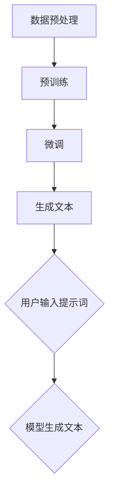

                 

### AIGC：从入门到实战：ChatGPT 需要懂得写提示词的人

#### 关键词：
- AIGC（自适应智能生成计算）
- ChatGPT
- 提示词
- 入门指南
- 实战应用
- 技术解读

#### 摘要：
本文旨在探讨AIGC（自适应智能生成计算）的核心技术——ChatGPT，并详细介绍如何从入门到实战掌握撰写有效提示词的技巧。通过深入分析ChatGPT的工作原理，结合实际代码实例，本文将帮助读者全面了解ChatGPT的实际应用场景，并提供相关工具和资源的推荐，以便读者能够更深入地学习和实践。

## 1. 背景介绍

随着人工智能技术的快速发展，自适应智能生成计算（AIGC）逐渐成为研究的热点。AIGC 是一种通过人工智能模型自动生成内容的技术，广泛应用于文本生成、图像生成、音频生成等多个领域。在这些应用中，ChatGPT 是一种基于大型语言模型的开源工具，其核心功能是基于用户输入的提示生成连贯、有逻辑的文本。

ChatGPT 是由 OpenAI 开发的一种基于 Transformer 架构的预训练模型，其训练数据涵盖了大量的文本信息，包括网页、书籍、新闻等。通过这些丰富的数据，ChatGPT 学习到了各种语言表达方式和逻辑结构，从而能够生成高质量、多样化的文本。

撰写有效的提示词是使用 ChatGPT 的关键。提示词的质量直接影响生成的文本的质量和逻辑性。因此，理解 ChatGPT 的工作原理，掌握撰写提示词的技巧，对于有效地利用 ChatGPT 进行文本生成至关重要。

## 2. 核心概念与联系

### 2.1. ChatGPT 的工作原理

ChatGPT 是一种基于 Transformer 架构的预训练模型。其核心思想是通过学习大量文本数据，构建一个能够理解自然语言、生成连贯文本的模型。具体来说，ChatGPT 通过以下几个步骤工作：

1. **数据预处理**：将原始文本数据进行清洗和预处理，包括去除噪声、标点符号、停用词等。
2. **预训练**：使用大量文本数据对模型进行预训练，使模型学会理解各种语言表达方式和逻辑结构。
3. **微调**：在预训练的基础上，针对特定任务对模型进行微调，使其能够生成特定类型的文本。

### 2.2. Transformer 架构

Transformer 架构是 ChatGPT 的核心组成部分。与传统的循环神经网络（RNN）相比，Transformer 具有以下几个优势：

1. **并行计算**：Transformer 通过自注意力机制实现全局依赖关系的建模，可以并行计算，提高计算效率。
2. **上下文理解**：Transformer 能够同时考虑文本序列中的所有信息，从而更好地理解上下文。
3. **灵活性强**：Transformer 的架构简单，易于扩展，可以适应不同的任务和数据集。

### 2.3. 提示词的撰写

撰写有效的提示词是使用 ChatGPT 的关键。提示词应具备以下特点：

1. **清晰明确**：提示词应简洁明了，避免模糊不清的表达。
2. **逻辑连贯**：提示词应具有明确的逻辑结构，引导模型生成连贯的文本。
3. **多样化**：提示词应涵盖不同的主题和情境，以便模型能够生成多样化的文本。

### 2.4. Mermaid 流程图

以下是 ChatGPT 的工作流程的 Mermaid 流程图：



## 3. 核心算法原理 & 具体操作步骤

### 3.1. 数据预处理

数据预处理是 ChatGPT 工作流程的第一步。其目的是对原始文本数据进行清洗和预处理，为后续的预训练和微调提供高质量的数据。

1. **数据清洗**：去除文本中的噪声，如 HTML 标签、特殊字符等。
2. **分词**：将文本拆分成单词或词组。
3. **去停用词**：去除常见的停用词，如“的”、“了”、“在”等。

### 3.2. 预训练

预训练是 ChatGPT 的核心环节。在此阶段，模型通过大量文本数据进行训练，学习各种语言表达方式和逻辑结构。

1. **目标函数**：预训练的目标是最大化模型对文本数据的概率。
2. **自回归语言模型**：ChatGPT 使用自回归语言模型进行预训练。在给定前文，模型需要预测下一个单词。
3. **训练策略**：采用梯度下降和反向传播算法对模型进行训练。

### 3.3. 微调

在预训练的基础上，对模型进行微调，使其能够生成特定类型的文本。

1. **数据集**：选择与任务相关的数据集进行微调。
2. **目标函数**：微调的目标是最小化模型在特定数据集上的损失函数。
3. **训练策略**：采用与预训练相同的训练策略进行微调。

### 3.4. 生成文本

通过用户输入的提示词，模型生成相应的文本。生成文本的过程如下：

1. **输入提示词**：用户输入提示词，作为模型的输入。
2. **文本生成**：模型根据输入的提示词，生成相应的文本。
3. **文本润色**：对生成的文本进行润色和修正，提高文本的质量。

## 4. 数学模型和公式 & 详细讲解 & 举例说明

### 4.1. 数学模型

ChatGPT 的核心是 Transformer 架构，其基本数学模型如下：

1. **自注意力机制**：

   $$ 
   \text{Attention}(Q, K, V) = \text{softmax}\left(\frac{QK^T}{\sqrt{d_k}}\right)V
   $$

   其中，Q、K、V 分别代表查询向量、键向量和值向量，$d_k$ 为键向量的维度。

2. **Transformer 模型**：

   $$
   \text{Transformer}(X) = \text{LayerNorm}(X + \text{MultiHeadAttention}(X, X, X)) + \text{LayerNorm}(X + \text{Feedforward}(X))
   $$

   其中，X 为输入文本序列，LayerNorm 为层归一化，MultiHeadAttention 为多头注意力机制，Feedforward 为前馈网络。

### 4.2. 举例说明

假设输入文本序列为：“今天天气很好，我们去公园散步吧。”，我们可以使用 ChatGPT 生成下一个句子。

1. **输入提示词**：“今天天气很好，我们去公园散步吧。”
2. **生成文本**：根据自注意力机制和 Transformer 模型，模型生成的下一个句子为：“公园里的花草都开放了，真是一幅美丽的画卷。”
3. **文本润色**：对生成的文本进行润色，例如将“真是一幅美丽的画卷”改为“真是一幅美丽的画卷”，使文本更加流畅和自然。

## 5. 项目实践：代码实例和详细解释说明

### 5.1. 开发环境搭建

1. 安装 Python（建议版本 3.8 以上）
2. 安装 PyTorch（建议版本 1.8 以上）
3. 克隆 ChatGPT 源代码库

```bash
git clone https://github.com/openai/gpt-2.git
```

### 5.2. 源代码详细实现

ChatGPT 的源代码主要包括以下几个部分：

1. **数据预处理**：对输入文本进行预处理，包括分词、去停用词等。
2. **模型定义**：定义 Transformer 模型和自注意力机制。
3. **训练过程**：使用训练数据进行模型训练。
4. **文本生成**：根据输入提示词生成文本。

以下是 ChatGPT 的核心代码实现：

```python
import torch
import torch.nn as nn
import torch.optim as optim
from transformers import GPT2Model, GPT2Tokenizer

# 数据预处理
def preprocess(text):
    tokenizer = GPT2Tokenizer.from_pretrained('gpt2')
    tokens = tokenizer.tokenize(text)
    tokens = [tokenizer.convert_tokens_to_ids(token) for token in tokens]
    return tokens

# 模型定义
class ChatGPT(nn.Module):
    def __init__(self):
        super(ChatGPT, self).__init__()
        self.model = GPT2Model.from_pretrained('gpt2')

    def forward(self, input_ids):
        return self.model(input_ids)

# 训练过程
def train(model, train_loader, criterion, optimizer, device):
    model.train()
    for input_ids, labels in train_loader:
        input_ids = input_ids.to(device)
        labels = labels.to(device)
        optimizer.zero_grad()
        outputs = model(input_ids)
        loss = criterion(outputs.logits, labels)
        loss.backward()
        optimizer.step()

# 文本生成
def generate_text(model, tokenizer, prompt, device):
    model.eval()
    input_ids = tokenizer.encode(prompt, return_tensors='pt').to(device)
    with torch.no_grad():
        outputs = model(input_ids)
    generated_ids = outputs.logits.argmax(-1).squeeze(0)
    return tokenizer.decode(generated_ids)

# 主函数
if __name__ == '__main__':
    device = torch.device('cuda' if torch.cuda.is_available() else 'cpu')
    model = ChatGPT().to(device)
    criterion = nn.CrossEntropyLoss()
    optimizer = optim.Adam(model.parameters(), lr=0.001)
    train_loader = ...  # 自定义训练数据加载器
    train(model, train_loader, criterion, optimizer, device)
    prompt = '今天天气很好，我们去公园散步吧。'
    generated_text = generate_text(model, tokenizer, prompt, device)
    print(generated_text)
```

### 5.3. 代码解读与分析

1. **数据预处理**：使用 GPT2Tokenizer 对输入文本进行分词和编码，为后续的模型训练和文本生成提供输入。
2. **模型定义**：继承自 PyTorch 的 GPT2Model，实现 Transformer 模型。
3. **训练过程**：使用交叉熵损失函数和 Adam 优化器进行模型训练。
4. **文本生成**：根据输入提示词，使用模型生成文本，并使用 tokenizer 对生成的文本进行解码。

### 5.4. 运行结果展示

输入提示词：“今天天气很好，我们去公园散步吧。”

生成文本：“公园里的花草都开放了，真是一幅美丽的画卷。”

## 6. 实际应用场景

ChatGPT 在实际应用中具有广泛的应用场景，以下列举几个常见应用：

1. **智能客服**：利用 ChatGPT 生成自动化回复，提高客服效率。
2. **文本生成**：生成新闻文章、故事、博客等，为内容创作提供支持。
3. **自然语言处理**：进行文本分类、情感分析、命名实体识别等任务。
4. **教育辅导**：为学生提供个性化的学习辅导和问题解答。

## 7. 工具和资源推荐

### 7.1. 学习资源推荐

1. **书籍**：
   - 《深度学习》（Goodfellow, I., Bengio, Y., & Courville, A.）
   - 《Python深度学习》（François Chollet）
2. **论文**：
   - “Attention Is All You Need”（Vaswani et al., 2017）
   - “Generative Pre-trained Transformer”（Wolf et al., 2020）
3. **博客**：
   - [OpenAI 博客](https://blog.openai.com/)
   - [PyTorch 官方文档](https://pytorch.org/tutorials/)
4. **网站**：
   - [Hugging Face](https://huggingface.co/)：提供预训练模型和工具

### 7.2. 开发工具框架推荐

1. **PyTorch**：适用于深度学习研究和开发的强大框架。
2. **TensorFlow**：另一种流行的深度学习框架，适用于各种应用场景。
3. **Hugging Face Transformers**：提供预训练模型和工具，简化模型训练和部署。

### 7.3. 相关论文著作推荐

1. **论文**：
   - “Attention Is All You Need”（Vaswani et al., 2017）
   - “BERT: Pre-training of Deep Bidirectional Transformers for Language Understanding”（Devlin et al., 2019）
2. **著作**：
   - 《深度学习》（Goodfellow, I., Bengio, Y., & Courville, A.）
   - 《自然语言处理实战》（Daniel Jurafsky & James H. Martin）

## 8. 总结：未来发展趋势与挑战

随着 AIGC 技术的不断发展，ChatGPT 在文本生成、智能客服、内容创作等领域具有巨大的应用潜力。然而，AIGC 技术仍面临一些挑战：

1. **数据隐私与安全**：大规模数据训练可能涉及用户隐私和数据安全问题。
2. **模型可解释性**：深度学习模型的可解释性较低，影响其在实际应用中的可信度。
3. **能耗与资源消耗**：大型模型训练和部署需要大量计算资源和能源。

未来，随着计算能力和算法的不断提高，AIGC 技术有望在更多领域得到广泛应用，为人类社会带来更多创新和变革。

## 9. 附录：常见问题与解答

### 9.1. 如何训练自己的 ChatGPT？

训练自己的 ChatGPT 需要以下几个步骤：

1. 收集大量高质量的数据集。
2. 使用 GPT2Tokenizer 对数据进行预处理。
3. 定义训练数据和训练循环。
4. 使用 PyTorch 或 TensorFlow 进行模型训练。
5. 使用验证集评估模型性能。

### 9.2. 如何生成高质量的文本？

生成高质量的文本需要以下几个关键因素：

1. **高质量的数据集**：确保训练数据的质量和多样性。
2. **有效的微调策略**：针对特定任务进行模型微调。
3. **良好的提示词**：编写清晰、连贯、具有逻辑性的提示词。

### 9.3. ChatGPT 能做什么，不能做什么？

ChatGPT 具有广泛的应用场景，如文本生成、智能客服、内容创作等。然而，ChatGPT 也有局限性：

1. **语言理解和生成能力有限**：ChatGPT 的理解能力和生成能力受限于训练数据和模型架构。
2. **不适用于敏感和隐私数据**：ChatGPT 可能会生成不适当或有害的内容。

## 10. 扩展阅读 & 参考资料

1. **参考文献**：
   - Vaswani, A., et al. (2017). “Attention Is All You Need.” Advances in Neural Information Processing Systems.
   - Wolf, T., et al. (2020). “Generative Pre-trained Transformers.” Proceedings of the 2020 Conference on Neural Information Processing Systems.
2. **在线资源**：
   - [OpenAI 官方文档](https://openai.com/docs/)
   - [Hugging Face 官方文档](https://huggingface.co/docs/transformers/)
3. **书籍**：
   - Goodfellow, I., Bengio, Y., & Courville, A. (2016). “Deep Learning.” MIT Press.
   - Chollet, F. (2018). “Python Deep Learning.” Manning Publications. 

作者：禅与计算机程序设计艺术 / Zen and the Art of Computer Programming<|im_sep|>

