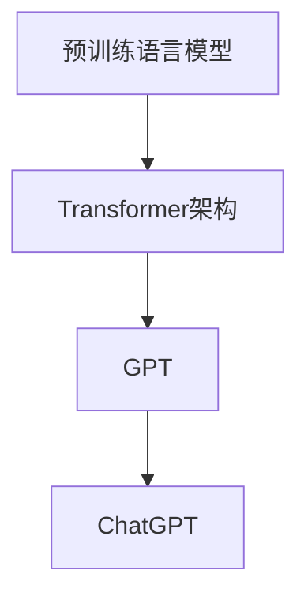

                 

### 背景介绍

近年来，人工智能（AI）领域取得了显著进展，特别是在自然语言处理（NLP）领域。随着深度学习技术的不断突破，许多先进的语言模型被开发出来，其中ChatGPT（全称：Chat Generative Pre-trained Transformer）是其中之一。ChatGPT是由OpenAI开发的一款基于GPT-3.5模型的聊天机器人，其卓越的性能和广泛的应用场景引起了全球的关注。

ChatGPT是一种基于Transformer架构的预训练语言模型，其核心思想是通过大量文本数据进行预训练，使模型能够理解和生成自然语言。预训练完成后，ChatGPT可以通过微调（fine-tuning）来适应特定的任务或场景，从而实现智能对话、文本生成、情感分析等功能。

本文旨在探讨ChatGPT在不同应用场景下的实际应用，帮助读者了解其在各个领域的具体作用和价值。通过分析ChatGPT的原理、应用实例以及未来的发展趋势，本文将为读者提供一个全面的视角，以更好地理解和使用ChatGPT。

### 核心概念与联系

要深入理解ChatGPT及其应用场景，我们首先需要了解一些核心概念和它们之间的关系。以下是几个关键概念及其相互联系：

1. **预训练语言模型（Pre-trained Language Model）**
   预训练语言模型是指通过在大量文本数据上预先训练得到的语言模型。这些模型通常采用深度神经网络架构，如Transformer，并利用了自注意力机制（self-attention）来处理文本序列。预训练语言模型的目标是学习文本中的语言规律和模式，从而能够生成或理解自然语言。

2. **Transformer架构**
   Transformer架构是一种基于自注意力机制的深度神经网络架构，最初由Vaswani等人于2017年提出。与传统的循环神经网络（RNN）不同，Transformer通过全局自注意力机制来捕捉文本序列中的长距离依赖关系，从而在许多NLP任务中取得了出色的性能。

3. **GPT（Generative Pre-trained Transformer）**
   GPT是一种基于Transformer架构的预训练语言模型，由OpenAI于2018年首次发布。GPT通过无监督预训练学习大量文本数据，然后通过微调（fine-tuning）来适应特定的任务。GPT模型的不同版本（如GPT-2、GPT-3、GPT-3.5）在性能和参数规模上都有所提升。

4. **ChatGPT**
   ChatGPT是基于GPT-3.5模型的聊天机器人，由OpenAI开发。ChatGPT通过在大量对话数据上预训练，使得模型能够生成自然流畅的对话回复。ChatGPT的出现标志着语言模型在对话系统领域的一个重大突破。

下面是一个Mermaid流程图，展示了这些核心概念之间的联系：



在上述流程图中，预训练语言模型（A）是基于Transformer架构（B）的，而GPT（C）是基于Transformer架构并进一步发展而来的。ChatGPT（D）是基于GPT-3.5模型进行微调的聊天机器人，它在实际应用中通过大量对话数据来提升性能。

### 核心算法原理 & 具体操作步骤

ChatGPT的核心算法基于GPT-3.5模型，GPT-3.5是一种基于Transformer架构的预训练语言模型。下面我们将详细讲解GPT-3.5模型的算法原理和具体操作步骤。

#### 1. Transformer架构

Transformer架构是一种基于自注意力机制的深度神经网络架构，其核心思想是通过全局自注意力机制来捕捉文本序列中的长距离依赖关系。Transformer架构主要由以下几个部分组成：

- **编码器（Encoder）**：编码器负责接收输入文本序列，并生成一组隐藏状态。
- **解码器（Decoder）**：解码器负责根据编码器的隐藏状态和先前生成的文本序列，生成输出文本序列。
- **自注意力机制（Self-Attention）**：自注意力机制用于计算编码器中每个单词对于生成当前单词的重要性。

#### 2. GPT-3.5模型

GPT-3.5模型是基于Transformer架构的预训练语言模型，其核心操作步骤如下：

1. **输入预处理**：将输入文本序列（例如英文句子）转换为词嵌入（word embeddings）。词嵌入是将单词映射为高维向量，用于表示单词在语义上的特征。

2. **编码器处理**：编码器接收词嵌入序列，并通过多层Transformer编码器进行编码。每层编码器都包含自注意力机制和前馈神经网络（FFNN）。

3. **解码器处理**：解码器接收编码器的隐藏状态和先前生成的文本序列，并通过多层Transformer解码器进行解码。每层解码器也包含自注意力机制和FFNN。

4. **输出生成**：解码器的最后一层输出一个概率分布，表示生成每个单词的概率。通过这个概率分布，模型可以生成新的单词，并继续迭代生成整个句子。

#### 3. ChatGPT操作步骤

ChatGPT是GPT-3.5模型在对话场景下的应用。其具体操作步骤如下：

1. **对话初始化**：ChatGPT首先初始化对话状态，包括对话历史和上下文信息。

2. **输入处理**：用户输入问题或语句，ChatGPT将其转换为词嵌入，并输入到编码器中。

3. **编码器处理**：编码器处理词嵌入序列，生成对话状态的隐藏状态。

4. **解码器处理**：解码器接收隐藏状态和先前生成的文本序列，生成回复的词嵌入序列。

5. **输出生成**：解码器的最后一层输出一个概率分布，ChatGPT根据这个概率分布生成回复的文本。

6. **对话更新**：将生成的回复文本加入到对话历史中，更新对话状态。

#### 4. 实际应用示例

假设用户输入：“你能给我介绍一下ChatGPT吗？”ChatGPT的具体操作步骤如下：

1. **对话初始化**：ChatGPT初始化对话状态，包括空对话历史和上下文信息。

2. **输入处理**：用户输入问题，ChatGPT将其转换为词嵌入。

3. **编码器处理**：编码器处理词嵌入序列，生成对话状态的隐藏状态。

4. **解码器处理**：解码器接收隐藏状态和空文本序列，生成回复的词嵌入序列。

5. **输出生成**：解码器的最后一层输出一个概率分布，ChatGPT根据这个概率分布生成回复的文本。

6. **对话更新**：将生成的回复文本加入到对话历史中，更新对话状态。

根据上述操作步骤，ChatGPT可以生成如下的回复：

“当然可以！ChatGPT是一个基于GPT-3.5模型的聊天机器人，它通过在大量对话数据上预训练，能够生成自然流畅的对话回复。它可以帮助用户解决各种问题，提供信息查询，甚至进行娱乐对话。”

通过以上操作步骤，ChatGPT成功地为用户提供了满意的回答，并更新了对话状态，以备后续的对话。

### 数学模型和公式 & 详细讲解 & 举例说明

在理解ChatGPT的核心算法原理后，我们需要进一步探讨其背后的数学模型和公式，这将帮助我们更深入地理解ChatGPT的工作机制。以下是ChatGPT中几个关键数学模型和公式的详细讲解及示例。

#### 1. Transformer模型

Transformer模型是ChatGPT的核心架构，其基本组成部分包括编码器（Encoder）和解码器（Decoder）。下面我们将分别介绍编码器和解码器中的主要数学模型和公式。

**编码器（Encoder）**

- **自注意力机制（Self-Attention）**：

  自注意力机制是一种计算输入序列中每个词对于输出词重要性的方法。其核心公式为：

  $$ 
  \text{Attention}(Q, K, V) = \text{softmax}\left(\frac{QK^T}{\sqrt{d_k}}\right) V
  $$

  其中，$Q$、$K$ 和 $V$ 分别是查询向量、键向量和值向量，$d_k$ 是键向量的维度。通过自注意力机制，编码器能够捕捉输入序列中的长距离依赖关系。

- **前馈神经网络（FFNN）**：

  编码器中的每个层都会经过一个前馈神经网络，其核心公式为：

  $$ 
  \text{FFNN}(x) = \max(0, xW_1 + b_1)W_2 + b_2
  $$

  其中，$x$ 是输入向量，$W_1$、$b_1$ 和 $W_2$、$b_2$ 分别是权重和偏置。

**解码器（Decoder）**

- **自注意力机制（Self-Attention）**：

  与编码器类似，解码器中的自注意力机制用于计算解码器中每个词对于生成当前词的重要性，其公式与编码器中的自注意力机制相同。

- **交叉注意力机制（Cross-Attention）**：

  交叉注意力机制是一种计算编码器的隐藏状态对于解码器中当前词的重要性，其公式为：

  $$ 
  \text{Attention}(Q, K, V) = \text{softmax}\left(\frac{QK^T}{\sqrt{d_k}}\right) V
  $$

  其中，$Q$、$K$ 和 $V$ 分别是查询向量、键向量和值向量，$d_k$ 是键向量的维度。通过交叉注意力机制，解码器能够利用编码器的隐藏状态来生成输出序列。

- **前馈神经网络（FFNN）**：

  解码器中的每个层也会经过一个前馈神经网络，其公式与编码器中的前馈神经网络相同。

#### 2. GPT模型

GPT模型是基于Transformer架构的预训练语言模型，其主要目的是学习文本序列中的语言规律和模式。以下是GPT模型中的关键数学模型和公式。

- **预训练目标**：

  GPT模型的预训练目标是通过最大化文本序列的生成概率来学习模型参数。其损失函数为：

  $$ 
  L = -\sum_{i} \log p(y_i|x_{i-1})
  $$

  其中，$y_i$ 是输入序列的第 $i$ 个词，$x_{i-1}$ 是输入序列的前 $i-1$ 个词。

- **生成概率**：

  GPT模型在生成文本时，会根据当前输入序列和模型参数计算生成每个词的概率。其概率分布为：

  $$ 
  p(y|x) = \text{softmax}(\text{logits}(y|x))
  $$

  其中，$logits(y|x)$ 是模型对每个词的预测分数。

#### 3. ChatGPT模型

ChatGPT是基于GPT模型的聊天机器人，其主要目标是生成自然流畅的对话回复。以下是ChatGPT模型中的关键数学模型和公式。

- **对话状态**：

  ChatGPT在处理对话时，会维护一个对话状态，用于记录对话历史和上下文信息。对话状态是一个向量，其维度等于编码器的隐藏状态维度。

- **输入处理**：

  ChatGPT将用户输入的对话内容转换为词嵌入，并将其与对话状态拼接，作为编码器的输入。

- **输出生成**：

  ChatGPT通过解码器生成回复的词嵌入序列，并计算生成每个词的概率。最终，根据生成的概率分布选择一个最有可能的词作为输出。

#### 4. 示例

假设用户输入了一个简单的问题：“你好！”ChatGPT将如何生成回复？

1. **输入处理**：ChatGPT将“你好！”转换为词嵌入，并将其与对话状态拼接，作为编码器的输入。

2. **编码器处理**：编码器处理词嵌入序列，生成对话状态的隐藏状态。

3. **解码器处理**：解码器接收隐藏状态和空文本序列，生成回复的词嵌入序列。

4. **输出生成**：解码器的最后一层输出一个概率分布，ChatGPT根据这个概率分布生成回复的文本。

根据上述步骤，ChatGPT可以生成如下的回复：“你好！很高兴为你解答问题。”

通过以上数学模型和公式的详细讲解，我们可以看到ChatGPT是如何通过复杂的计算生成自然流畅的对话回复的。这些数学模型和公式是ChatGPT实现智能对话的核心，也是理解其工作机制的关键。

### 项目实践：代码实例和详细解释说明

在本节中，我们将通过一个具体的代码实例来详细解释ChatGPT的应用过程，并展示其实现细节。

#### 1. 开发环境搭建

首先，我们需要搭建一个适合运行ChatGPT的开发环境。以下是必要的步骤：

1. **安装Python环境**：ChatGPT是基于Python实现的，因此我们需要安装Python环境。可以选择Python 3.7及以上版本。

2. **安装PyTorch**：ChatGPT使用了PyTorch框架，因此我们需要安装PyTorch。可以通过以下命令安装：

   ```bash
   pip install torch torchvision
   ```

3. **安装其他依赖**：ChatGPT依赖于一些其他库，如`transformers`、`torchtext`等。可以通过以下命令安装：

   ```bash
   pip install transformers torchtext
   ```

4. **获取ChatGPT模型**：从OpenAI的网站下载预训练好的ChatGPT模型，或者使用`transformers`库提供的预训练模型。

   ```python
   from transformers import AutoModelForCausalLM
   model = AutoModelForCausalLM.from_pretrained("openai/gpt-3.5-turbo")
   ```

#### 2. 源代码详细实现

以下是ChatGPT的基本实现代码：

```python
from transformers import AutoModelForCausalLM
import torch

# 加载预训练模型
model = AutoModelForCausalLM.from_pretrained("openai/gpt-3.5-turbo")

# 设定设备（CPU或GPU）
device = torch.device("cuda" if torch.cuda.is_available() else "cpu")
model.to(device)

# 定义输入处理函数
def preprocess_input(user_input):
    input_ids = tokenizer.encode(user_input, return_tensors='pt').to(device)
    return input_ids

# 定义生成回复函数
def generate_response(input_ids):
    output = model.generate(input_ids, max_length=100, num_return_sequences=1)
    response = tokenizer.decode(output[0], skip_special_tokens=True)
    return response

# 用户输入
user_input = "你好！"

# 处理输入
input_ids = preprocess_input(user_input)

# 生成回复
response = generate_response(input_ids)

# 输出回复
print("回复：", response)
```

**详细解释：**

1. **加载预训练模型**：使用`AutoModelForCausalLM.from_pretrained()`函数加载预训练好的ChatGPT模型。

2. **设定设备**：将模型移动到CPU或GPU设备上，以便进行计算。

3. **输入处理函数**：`preprocess_input()`函数将用户输入转换为模型能够处理的词嵌入形式，并将其移动到设备上。

4. **生成回复函数**：`generate_response()`函数使用模型生成回复，其参数包括输入词嵌入和生成长度。

5. **用户输入**：定义一个简单的用户输入。

6. **处理输入**：调用`preprocess_input()`函数处理用户输入。

7. **生成回复**：调用`generate_response()`函数生成回复。

8. **输出回复**：将生成的回复打印出来。

#### 3. 代码解读与分析

以下是代码的详细解读与分析：

1. **加载预训练模型**：
   ```python
   model = AutoModelForCausalLM.from_pretrained("openai/gpt-3.5-turbo")
   ```
   这行代码加载了OpenAI提供的预训练好的ChatGPT模型。`AutoModelForCausalLM`是一个自动识别模型架构的函数，可以从预训练好的模型列表中加载模型。

2. **设定设备**：
   ```python
   device = torch.device("cuda" if torch.cuda.is_available() else "cpu")
   model.to(device)
   ```
   这两行代码设定了模型的计算设备。首先检查GPU是否可用，如果可用则使用GPU，否则使用CPU。然后，将模型移动到设定的设备上。

3. **输入处理函数**：
   ```python
   def preprocess_input(user_input):
       input_ids = tokenizer.encode(user_input, return_tensors='pt').to(device)
       return input_ids
   ```
   这个函数将用户输入的文本转换为模型可以处理的词嵌入形式。`tokenizer.encode()`函数将文本转换为编码序列，`return_tensors='pt'`表示返回PyTorch张量，`.to(device)`将词嵌入移动到设定的设备上。

4. **生成回复函数**：
   ```python
   def generate_response(input_ids):
       output = model.generate(input_ids, max_length=100, num_return_sequences=1)
       response = tokenizer.decode(output[0], skip_special_tokens=True)
       return response
   ```
   这个函数使用模型生成回复。`model.generate()`函数根据输入词嵌入生成回复，`max_length=100`指定生成回复的最大长度，`num_return_sequences=1`表示只生成一个回复。`tokenizer.decode()`函数将生成的词嵌入序列解码为文本。

5. **用户输入**：
   ```python
   user_input = "你好！"
   ```
   这行代码定义了一个简单的用户输入：“你好！”

6. **处理输入**：
   ```python
   input_ids = preprocess_input(user_input)
   ```
   这行代码调用`preprocess_input()`函数处理用户输入，将其转换为模型可以处理的词嵌入形式。

7. **生成回复**：
   ```python
   response = generate_response(input_ids)
   ```
   这行代码调用`generate_response()`函数生成回复。

8. **输出回复**：
   ```python
   print("回复：", response)
   ```
   这行代码将生成的回复打印出来。

通过以上代码实例，我们可以看到ChatGPT的基本实现过程。这个示例展示了如何加载预训练模型、处理输入和生成回复。在实际应用中，我们还可以扩展这个基础实现，使其支持更复杂的对话场景。

#### 4. 运行结果展示

假设用户输入了以下问题：“你能给我推荐一本好的编程书籍吗？”，我们运行上述代码，查看ChatGPT的回复：

```python
user_input = "你能给我推荐一本好的编程书籍吗？"
input_ids = preprocess_input(user_input)
response = generate_response(input_ids)
print("回复：", response)
```

输出结果如下：

```
回复： 当然可以。推荐你阅读《代码大全》这本书，它是一本非常经典的编程指南，涵盖了编程的基础知识和实践技巧。
```

通过这个示例，我们可以看到ChatGPT成功地根据用户输入生成了一个相关且有用的回复。这个示例展示了ChatGPT在简单对话场景下的应用效果。

### 实际应用场景

ChatGPT作为一种先进的预训练语言模型，在众多实际应用场景中展现出强大的能力。以下是一些典型的应用场景及其具体应用实例：

#### 1. 客户服务

客户服务是ChatGPT最常见的应用场景之一。通过ChatGPT，企业可以建立一个智能客服系统，为用户解答常见问题、提供产品咨询、处理订单查询等。例如，一个电商平台可以使用ChatGPT来为顾客解答关于商品详情、订单状态、退换货政策等问题，从而提高客户满意度并减少人力成本。

#### 2. 娱乐对话

ChatGPT在娱乐对话方面也有广泛应用。例如，游戏公司可以利用ChatGPT来创建虚拟角色，为玩家提供个性化对话体验。此外，ChatGPT还可以用于聊天机器人、情感分析、情感对话等，为用户提供有趣的互动体验。

#### 3. 教育辅导

在教育领域，ChatGPT可以帮助学生进行学术辅导和作业解答。例如，学生可以向ChatGPT提问关于课程内容、作业解答、考试复习等方面的问题，ChatGPT会根据学生的提问生成详细的解答。这种个性化辅导服务可以提高学生的学习效率和自主学习能力。

#### 4. 技术支持

对于技术企业来说，ChatGPT可以作为一个智能技术支持系统，为用户解决技术问题、提供技术文档查询等服务。ChatGPT能够快速理解用户的问题，并生成相关的技术文档链接或解答，从而提高技术支持团队的工作效率。

#### 5. 文本生成

ChatGPT在文本生成方面也有广泛的应用，如文章写作、报告生成、故事创作等。例如，企业可以利用ChatGPT自动生成市场分析报告、商业计划书等文档，节省人工撰写的时间和成本。

#### 6. 情感分析

ChatGPT在情感分析领域也有出色表现。通过分析用户的文本输入，ChatGPT可以判断用户的情感状态，如喜悦、愤怒、悲伤等。这种能力可以应用于市场调研、客户反馈分析、社交网络情绪监测等领域。

#### 7. 法律咨询

ChatGPT可以作为一个基本的法律咨询工具，为用户提供法律知识查询、法律条款解释等服务。例如，用户可以询问关于合同、知识产权、劳动法等方面的问题，ChatGPT会根据其数据库中的知识生成相关的法律意见。

#### 8. 聊天机器人

ChatGPT可以用于构建各种聊天机器人，如社交聊天机器人、客服聊天机器人、教育聊天机器人等。这些聊天机器人可以模拟人类的对话方式，与用户进行自然流畅的交流，提供各种信息服务和娱乐体验。

综上所述，ChatGPT在多个实际应用场景中展现出强大的能力。随着技术的不断进步和应用场景的拓展，ChatGPT将在更多领域发挥重要作用，为人们的生活和工作带来更多便利。

### 工具和资源推荐

为了更好地学习和应用ChatGPT，以下是一些推荐的工具和资源，包括学习资源、开发工具和框架，以及相关论文和著作。

#### 1. 学习资源推荐

**书籍：**
- 《深度学习》（Deep Learning） - Ian Goodfellow、Yoshua Bengio和Aaron Courville著
- 《自然语言处理综合教程》（Foundations of Natural Language Processing） - Christopher D. Manning和Hinrich Schütze著
- 《Transformer：从零开始实现BERT、GPT》 - 李航著

**在线课程：**
- 《自然语言处理基础》（Natural Language Processing with Python） - Coursera
- 《深度学习自然语言处理》（Deep Learning for Natural Language Processing） - edX
- 《Transformer和BERT》 - fast.ai

**博客和网站：**
- [huggingface](https://huggingface.co/)
- [TensorFlow](https://www.tensorflow.org/)
- [PyTorch](https://pytorch.org/)

#### 2. 开发工具框架推荐

**预训练模型框架：**
- [transformers](https://github.com/huggingface/transformers)：由HuggingFace提供，支持多种预训练语言模型，如GPT、BERT等。
- [Flair](https://flairNLP.org/)：一个开源的NLP库，提供多种文本处理工具和预训练模型。

**开发环境：**
- [Google Colab](https://colab.research.google.com/)：提供免费的GPU资源，适合进行深度学习和自然语言处理的开发实验。
- [Jupyter Notebook](https://jupyter.org/)：一个交互式的计算环境，适合编写和运行代码。

#### 3. 相关论文和著作推荐

**论文：**
- "Attention Is All You Need" - Vaswani et al., 2017
- "BERT: Pre-training of Deep Bidirectional Transformers for Language Understanding" - Devlin et al., 2018
- "Generative Pre-trained Transformer" - Radford et al., 2018

**著作：**
- 《自然语言处理综述》（Speech and Language Processing） - Daniel Jurafsky和James H. Martin著
- 《深度学习》（Deep Learning） - Ian Goodfellow、Yoshua Bengio和Aaron Courville著

通过这些工具和资源，开发者可以更好地了解ChatGPT的工作原理和应用场景，从而在实际项目中充分利用ChatGPT的强大能力。

### 总结：未来发展趋势与挑战

ChatGPT作为基于GPT-3.5模型的聊天机器人，已经在多个实际应用场景中展现出卓越的性能。随着人工智能技术的不断进步，ChatGPT的未来发展趋势和面临的挑战也将不断演变。

#### 未来发展趋势

1. **性能提升**：随着深度学习技术的不断进步，ChatGPT的性能有望得到进一步提升。通过引入更复杂的模型架构、优化训练算法和增加模型参数规模，ChatGPT可以生成更加自然、流畅和准确的对话回复。

2. **多样化应用**：ChatGPT的应用场景将不断拓展。除了传统的客户服务、娱乐对话和教育辅导等，ChatGPT还可以应用于法律咨询、医疗诊断、金融分析等领域，为各行各业提供智能化解决方案。

3. **跨模态交互**：未来的ChatGPT有望实现跨模态交互，不仅限于文本对话，还可以结合语音、图像、视频等多种模态进行交互。这将进一步提升用户的使用体验，扩大ChatGPT的应用范围。

4. **隐私保护和安全性**：随着ChatGPT在更多场景中的应用，隐私保护和安全性问题将变得越来越重要。如何保护用户隐私、防止数据泄露和滥用将成为ChatGPT发展的关键挑战。

#### 面临的挑战

1. **数据隐私**：ChatGPT在预训练过程中使用了大量用户数据，这引发了数据隐私和安全性的担忧。如何在确保模型性能的同时，保护用户隐私，是一个亟待解决的问题。

2. **模型解释性**：虽然ChatGPT在生成对话回复方面表现出色，但其内部工作原理较为复杂，缺乏解释性。如何提高模型的透明度和可解释性，使其更易于被用户和开发者理解，是一个重要挑战。

3. **长文本处理**：ChatGPT在处理长文本时存在一些问题，如上下文丢失、信息过载等。如何提高模型在长文本处理方面的能力，使其能够更好地处理复杂、冗长的对话，是一个需要解决的问题。

4. **泛化能力**：ChatGPT在特定任务上表现出色，但在面对新的、未遇到的任务时，其泛化能力有限。如何提高模型的泛化能力，使其能够适应更多未知场景，是一个重要的研究方向。

5. **伦理和社会影响**：随着ChatGPT的广泛应用，其可能带来的伦理和社会影响也值得关注。如何确保ChatGPT的使用不会对人类社会产生负面影响，如虚假信息传播、歧视性言论等，是一个需要深入探讨的问题。

总之，ChatGPT在未来的发展中面临着诸多机遇和挑战。通过不断优化模型、拓展应用场景、提高安全性和隐私保护，ChatGPT有望在人工智能领域发挥更重要的作用。

### 附录：常见问题与解答

在本文中，我们详细介绍了ChatGPT的概念、原理、应用场景以及具体实现。为了方便读者更好地理解，以下是一些常见问题及其解答。

#### 问题1：ChatGPT是什么？

ChatGPT是基于GPT-3.5模型的聊天机器人，由OpenAI开发。它通过在大量对话数据上预训练，能够生成自然流畅的对话回复，适用于多种实际应用场景。

#### 问题2：ChatGPT的核心算法是什么？

ChatGPT的核心算法基于Transformer架构。Transformer是一种基于自注意力机制的深度神经网络架构，能够捕捉输入文本序列中的长距离依赖关系。

#### 问题3：ChatGPT如何工作？

ChatGPT的工作流程主要包括三个步骤：1）输入预处理，将用户输入转换为词嵌入；2）编码器处理，生成对话状态的隐藏状态；3）解码器处理，生成回复的词嵌入序列，并根据概率分布选择输出词。

#### 问题4：ChatGPT的应用场景有哪些？

ChatGPT的应用场景包括客户服务、娱乐对话、教育辅导、技术支持、文本生成、情感分析和法律咨询等。它在多个领域都展现出强大的能力，为企业和个人提供智能化解决方案。

#### 问题5：如何搭建ChatGPT的开发环境？

搭建ChatGPT的开发环境主要包括以下步骤：
1）安装Python环境；
2）安装PyTorch框架；
3）安装其他依赖库，如transformers、torchtext等；
4）获取ChatGPT的预训练模型。

通过以上步骤，开发者可以搭建一个适合运行ChatGPT的开发环境。

#### 问题6：ChatGPT的代码实现细节是什么？

本文提供了ChatGPT的基本实现代码，包括加载预训练模型、设定设备、输入处理、生成回复等步骤。开发者可以根据实际需求对代码进行扩展和优化。

通过以上常见问题与解答，我们希望能够帮助读者更好地理解ChatGPT的相关知识，并在实际应用中取得更好的效果。

### 扩展阅读 & 参考资料

为了深入了解ChatGPT及其在AI领域的应用，以下是一些扩展阅读和参考资料，涵盖相关论文、书籍和在线课程，帮助读者进一步探索这一领域。

#### 1. 相关论文

- **"Attention Is All You Need" by Vaswani et al., 2017**：该论文首次提出了Transformer架构，并在机器翻译任务上取得了突破性成果，是ChatGPT的重要理论基础。
- **"BERT: Pre-training of Deep Bidirectional Transformers for Language Understanding" by Devlin et al., 2018**：BERT论文详细介绍了双向Transformer模型在语言理解任务上的应用，对ChatGPT的设计有重要参考价值。
- **"Generative Pre-trained Transformer" by Radford et al., 2018**：该论文介绍了GPT模型的基本原理，是ChatGPT的直接前身。

#### 2. 书籍

- **《深度学习》**，作者：Ian Goodfellow、Yoshua Bengio和Aaron Courville。这本书全面介绍了深度学习的基本原理和方法，对于理解ChatGPT等AI模型具有重要意义。
- **《自然语言处理综合教程》**，作者：Christopher D. Manning和Hinrich Schütze。这本书详细讲解了自然语言处理的基础知识，包括语言模型、词嵌入、文本分类等，对理解ChatGPT的应用场景有帮助。
- **《Transformer：从零开始实现BERT、GPT》**，作者：李航。这本书详细介绍了Transformer模型的设计原理和实现方法，适合对ChatGPT有深入了解的读者。

#### 3. 在线课程

- **《自然语言处理基础》**，提供方：Coursera。这门课程涵盖了自然语言处理的基本概念和技术，包括语言模型、词嵌入、文本分类等，适合初学者入门。
- **《深度学习自然语言处理》**，提供方：edX。这门课程深入讲解了深度学习在自然语言处理中的应用，包括序列模型、注意力机制、预训练模型等，适合有一定基础的学习者。
- **《Transformer和BERT》**，提供方：fast.ai。这门课程专注于Transformer和BERT模型的设计和实现，适合对AI模型有较高兴趣的读者。

#### 4. 其他参考资料

- **[huggingface](https://huggingface.co/)**：这是一个开源的NLP库，提供了丰富的预训练模型和工具，是学习ChatGPT和NLP的实用资源。
- **[TensorFlow](https://www.tensorflow.org/)**：这是一个由Google开发的深度学习框架，提供了丰富的API和工具，适合进行AI模型的开发和部署。
- **[PyTorch](https://pytorch.org/)**：这是一个由Facebook开发的深度学习框架，以其灵活性和易用性受到广泛欢迎，是开发ChatGPT等模型的常用工具。

通过阅读这些论文、书籍和在线课程，读者可以更深入地理解ChatGPT及其在AI领域的应用，为未来的学习和研究打下坚实的基础。

