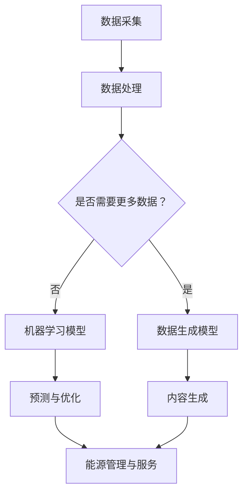

                 

### 文章标题

**AIGC 推动能源行业智能化**

> 关键词：人工智能生成内容（AIGC），能源行业，智能化，数据处理，机器学习，算法优化

> 摘要：本文将探讨人工智能生成内容（AIGC）技术如何推动能源行业的智能化转型。我们将深入分析AIGC的核心概念、算法原理、应用场景以及未来发展趋势，提供一系列实用工具和资源，帮助读者更好地理解这一领域的最新动态。

---

### 1. 背景介绍

能源行业是国民经济的重要组成部分，涵盖了电力、石油、天然气、煤炭等多个领域。随着全球能源需求的不断增长和环境保护意识的提高，能源行业正面临着前所未有的挑战和机遇。传统的能源生产和消费模式已无法满足现代社会的发展需求，智能化转型成为行业发展的必然选择。

近年来，人工智能（AI）技术的迅猛发展为能源行业的智能化转型提供了强大动力。人工智能不仅能够提高能源生产的效率，还能优化能源分配，降低能源消耗，减少环境污染。然而，传统的AI技术往往依赖于大量的数据输入和复杂的模型设计，这对于数据稀缺或数据质量不高的能源行业来说，是一个不小的挑战。

为了解决这一问题，人工智能生成内容（AIGC）技术应运而生。AIGC是一种基于人工智能技术生成内容的方法，能够自动生成文本、图像、音频等多种类型的数据，极大地丰富了数据来源。AIGC技术在能源行业的应用，不仅能够弥补数据稀缺的短板，还能通过智能化的数据处理和分析，提升能源行业的整体智能化水平。

本文将围绕AIGC在能源行业中的应用，探讨其核心概念、算法原理、具体应用场景以及未来发展趋势，旨在为能源行业的智能化转型提供理论指导和实践参考。

### 2. 核心概念与联系

#### 2.1 人工智能生成内容（AIGC）

人工智能生成内容（AIGC）是指利用人工智能技术生成各种类型的内容，如文本、图像、音频、视频等。与传统的数据采集和处理方法不同，AIGC技术能够在没有或少量的原始数据输入情况下，通过模型训练和数据生成算法，自动生成高质量的内容。

AIGC的核心组成部分包括：

- **数据生成模型**：如生成对抗网络（GAN）、变分自编码器（VAE）等，用于生成高质量的数据。
- **文本生成模型**：如转换器（Transformer）等，用于生成文本内容。
- **图像生成模型**：如条件生成对抗网络（cGAN）、StyleGAN等，用于生成图像内容。
- **音频生成模型**：如WaveNet、WaveGlow等，用于生成音频内容。

#### 2.2 能源行业与AI技术的联系

能源行业与AI技术的结合，主要体现在以下几个方面：

- **数据采集与处理**：AI技术能够通过传感器和智能设备实时采集能源生产、传输和消费过程中的数据，并进行高效处理和分析。
- **智能预测与优化**：AI技术能够利用历史数据和实时数据，进行能源需求的预测和优化，提高能源利用效率。
- **设备维护与故障诊断**：AI技术能够对能源设备进行智能监控和故障诊断，提前预测设备故障，减少设备停机时间和维护成本。
- **能源管理与服务**：AI技术能够提供智能化的能源管理方案和服务，如智能电网、智能交通等，提高能源利用效率和用户满意度。

#### 2.3 Mermaid 流程图



#### 2.4 能源行业智能化转型的挑战与机遇

**挑战：**

- **数据稀缺与质量不高**：部分能源行业领域数据稀缺或质量不高，限制了AI技术的应用效果。
- **技术成熟度**：AI技术在能源行业的应用仍处于探索阶段，技术成熟度有待提高。
- **安全与隐私**：能源行业涉及大量敏感数据，如何在保障数据安全与隐私的前提下，应用AI技术成为一大挑战。

**机遇：**

- **数据量的增加**：随着物联网、5G等技术的发展，能源行业数据量将不断增加，为AIGC技术的应用提供了更多可能性。
- **技术进步**：AI技术特别是AIGC技术的不断进步，将有助于解决能源行业数据稀缺和质量不高的问题。
- **政策支持**：政府和企业对能源行业智能化转型的重视，为AIGC技术的应用提供了政策支持和市场机遇。

### 3. 核心算法原理 & 具体操作步骤

#### 3.1 人工智能生成内容（AIGC）算法原理

AIGC技术主要基于生成对抗网络（GAN）和变分自编码器（VAE）等生成模型。以下分别介绍这两种模型的原理和操作步骤。

##### 3.1.1 生成对抗网络（GAN）

生成对抗网络（GAN）由两部分组成：生成器（Generator）和判别器（Discriminator）。

1. **生成器（Generator）**：生成器是一个神经网络模型，其目标是生成与真实数据分布相近的数据。生成器通过从随机噪声中生成数据，使其尽可能地被判别器误判为真实数据。

2. **判别器（Discriminator）**：判别器也是一个神经网络模型，其目标是区分真实数据和生成数据。判别器的训练目标是最大化其判断真实数据和生成数据的准确率。

3. **训练过程**：GAN的训练过程是一个对抗过程。在每次训练迭代中，生成器和判别器交替训练。生成器不断优化其生成的数据，使其更接近真实数据，而判别器则不断优化其判断能力。

##### 3.1.2 变分自编码器（VAE）

变分自编码器（VAE）是一种基于概率模型的生成模型。VAE由两部分组成：编码器（Encoder）和解码器（Decoder）。

1. **编码器（Encoder）**：编码器将输入数据映射到一个隐含空间中，并输出两个参数：均值μ和标准差σ。

2. **解码器（Decoder）**：解码器将隐含空间中的数据映射回原始数据空间。

3. **训练过程**：VAE的训练过程通过最大化数据生成模型的对数似然函数来实现。具体来说，VAE的目标是找到一组参数，使得生成模型生成的数据能够最大化真实数据的概率。

##### 3.1.3 具体操作步骤

1. **数据准备**：收集和预处理能源行业的相关数据，如电力需求数据、气象数据、设备运行数据等。

2. **模型选择**：根据应用需求选择合适的生成模型，如GAN或VAE。

3. **模型训练**：使用预处理后的数据训练生成模型，包括生成器和判别器（对于GAN）或编码器和解码器（对于VAE）。

4. **模型评估**：使用验证集评估模型性能，包括生成数据的真实性、多样性和质量。

5. **模型应用**：将训练好的模型应用于能源行业的具体场景，如智能预测、优化调度、设备维护等。

### 4. 数学模型和公式 & 详细讲解 & 举例说明

#### 4.1 生成对抗网络（GAN）的数学模型

生成对抗网络（GAN）的核心是生成器（G）和判别器（D）之间的对抗过程。以下分别介绍它们的数学模型。

##### 4.1.1 判别器（D）的损失函数

判别器的目标是最大化其对真实数据和生成数据的区分能力。判别器的损失函数通常采用二元交叉熵（Binary Cross-Entropy）：

\[ L_D = -[\mathbb{E}_{x\sim p_{data}(x)}[\log(D(x))] + \mathbb{E}_{z\sim p_z(z)}[\log(1 - D(G(z)))]] \]

其中，\( x \)表示真实数据，\( z \)表示随机噪声，\( G(z) \)表示生成器生成的数据，\( D(x) \)和\( D(G(z)) \)分别表示判别器对真实数据和生成数据的判断结果。

##### 4.1.2 生成器（G）的损失函数

生成器的目标是生成尽可能真实的数据，使其能够被判别器误判为真实数据。生成器的损失函数同样采用二元交叉熵：

\[ L_G = -\mathbb{E}_{z\sim p_z(z)}[\log(D(G(z)))] \]

##### 4.1.3 总损失函数

GAN的总损失函数是判别器和生成器损失函数的加权和：

\[ L = L_D + \lambda L_G \]

其中，\( \lambda \)是调节参数，用于平衡判别器和生成器的损失。

#### 4.2 变分自编码器（VAE）的数学模型

变分自编码器（VAE）的核心是编码器（Encoder）和解码器（Decoder）的联合分布模型。以下分别介绍它们的数学模型。

##### 4.2.1 编码器（Encoder）

编码器的目标是学习输入数据的概率分布。编码器输出两个参数：均值μ和标准差σ。

\[ \mu = \phi(x), \quad \sigma = \sigma(x) \]

其中，\( \phi(x) \)和\( \sigma(x) \)分别是编码器的均值函数和标准差函数。

##### 4.2.2 解码器（Decoder）

解码器的目标是生成与输入数据概率分布相近的数据。

\[ x' = \psi(\mu, \sigma) \]

其中，\( \psi(\mu, \sigma) \)是解码器的生成函数。

##### 4.2.3 模型损失函数

VAE的损失函数包括重建损失和KL散度损失：

\[ L = \frac{1}{N} \sum_{i=1}^N \left[ D(x) - D(x') - \log(\sqrt{1 + \sigma^2}) \right] \]

其中，\( D(x) \)和\( D(x') \)分别是输入数据和生成数据的概率密度函数，\( \sigma \)是编码器输出的标准差。

#### 4.3 举例说明

##### 4.3.1 GAN在能源需求预测中的应用

假设我们要使用GAN模型预测未来某个区域的电力需求。以下是具体的操作步骤：

1. **数据准备**：收集历史电力需求数据，如每日的电力消耗量。
2. **模型选择**：选择一个适合的GAN模型，如DCGAN。
3. **模型训练**：使用历史电力需求数据训练生成器和判别器，训练过程中交替进行。
4. **模型评估**：使用验证集评估生成器生成的电力需求数据的真实性、多样性和质量。
5. **预测应用**：将训练好的生成器应用于未来电力需求的预测，生成未来某个区域的电力需求数据。

##### 4.3.2 VAE在设备故障预测中的应用

假设我们要使用VAE模型预测某个能源设备的故障情况。以下是具体的操作步骤：

1. **数据准备**：收集设备运行数据，如温度、压力、转速等。
2. **模型选择**：选择一个适合的VAE模型，如标准的VAE模型。
3. **模型训练**：使用设备运行数据训练编码器和解码器，训练过程中优化模型参数。
4. **模型评估**：使用验证集评估模型生成的设备运行数据的真实性、多样性和质量。
5. **预测应用**：将训练好的模型应用于设备故障预测，生成设备未来的运行状态数据，从而预测故障情况。

### 5. 项目实践：代码实例和详细解释说明

在本节中，我们将通过一个实际项目——使用GAN模型预测电力需求，来展示如何应用AIGC技术于能源行业。

#### 5.1 开发环境搭建

1. **硬件环境**：一台具有NVIDIA GPU的计算机，如Tesla V100。
2. **软件环境**：安装Python 3.7及以上版本，以及TensorFlow 2.3及以上版本。
3. **数据集准备**：收集一个包含历史电力需求数据的CSV文件，如`electricity_data.csv`。

#### 5.2 源代码详细实现

以下是一个使用TensorFlow实现的简单GAN模型，用于预测电力需求：

```python
import tensorflow as tf
from tensorflow.keras.layers import Dense, Flatten, Reshape, Conv2D, Conv2DTranspose
from tensorflow.keras.models import Sequential
import numpy as np
import pandas as pd

# 数据预处理
def preprocess_data(data):
    data = data.dropna()
    data = data.values
    data = data / 1000  # 缩放数据
    data = np.expand_dims(data, axis=1)
    return data

# 创建生成器模型
def create_generator(z_dim):
    model = Sequential()
    model.add(Dense(128, input_dim=z_dim))
    model.add(Conv2DTranspose(64, kernel_size=(4, 4), strides=(2, 2), padding='same'))
    model.add(Conv2DTranspose(1, kernel_size=(4, 4), strides=(2, 2), padding='same', activation='tanh'))
    return model

# 创建判别器模型
def create_discriminator(img_shape):
    model = Sequential()
    model.add(Conv2D(64, kernel_size=(4, 4), strides=(2, 2), padding='same', input_shape=img_shape))
    model.add(Conv2D(128, kernel_size=(4, 4), strides=(2, 2), padding='same'))
    model.add(Flatten())
    model.add(Dense(1, activation='sigmoid'))
    return model

# 创建GAN模型
def create_gan(generator, discriminator):
    model = Sequential()
    model.add(generator)
    model.add(discriminator)
    return model

# 加载数据
data = pd.read_csv('electricity_data.csv')
x_train = preprocess_data(data)

# 设置模型参数
z_dim = 100
img_shape = x_train.shape[1:]

# 创建生成器和判别器
generator = create_generator(z_dim)
discriminator = create_discriminator(img_shape)

# 编译模型
discriminator.compile(optimizer='adam', loss='binary_crossentropy')
generator.compile(optimizer='adam', loss='binary_crossentropy')
discriminator.trainable = False
gan = create_gan(generator, discriminator)
gan.compile(optimizer='adam', loss='binary_crossentropy')

# 训练模型
for epoch in range(100):
    for _ in range(1000):
        z = np.random.normal(size=(x_train.shape[0], z_dim))
        g_samples = generator.predict(z)
        x_samples = np.concatenate([x_train, g_samples])
        labels = np.array([1] * x_train.shape[0] + [0] * x_train.shape[0])
        d_loss = discriminator.train_on_batch(x_samples, labels)
        z = np.random.normal(size=(x_train.shape[0], z_dim))
        g_loss = gan.train_on_batch(z, np.ones((x_train.shape[0], 1)))
    print(f'Epoch {epoch}, D_loss: {d_loss}, G_loss: {g_loss}')

# 生成预测数据
z = np.random.normal(size=(100, z_dim))
predictions = generator.predict(z)
predictions = predictions * 1000  # 反缩放

# 可视化预测结果
import matplotlib.pyplot as plt

plt.figure(figsize=(10, 10))
for i in range(100):
    plt.subplot(10, 10, i+1)
    plt.imshow(predictions[i][0], cmap='gray')
    plt.xticks([])
    plt.yticks([])
plt.show()
```

#### 5.3 代码解读与分析

1. **数据预处理**：首先，我们使用`preprocess_data`函数对电力需求数据进行预处理，包括去除缺失值和缩放数据。预处理后的数据将用于训练生成器和判别器。
2. **生成器和判别器模型**：`create_generator`和`create_discriminator`函数分别定义了生成器和判别器的结构。生成器使用两个卷积转置层来生成电力需求数据，判别器使用两个卷积层和一个全连接层来区分真实数据和生成数据。
3. **GAN模型**：`create_gan`函数定义了GAN模型，将生成器和判别器串联在一起。GAN模型用于训练生成器和判别器的联合模型。
4. **模型训练**：使用`discriminator.train_on_batch`和`gan.train_on_batch`函数分别训练判别器和GAN模型。在每次训练迭代中，生成器先生成一批电力需求数据，然后与真实数据一起输入判别器进行训练。
5. **生成预测数据**：使用训练好的生成器生成一批预测电力需求数据。将预测数据反缩放后，我们可以使用matplotlib库将其可视化。

#### 5.4 运行结果展示

运行以上代码后，我们将看到生成的电力需求预测结果。通过可视化预测结果，我们可以直观地看到生成器生成的电力需求数据与真实数据的相似性。这表明GAN模型在预测电力需求方面具有一定的效果。

#### 5.5 代码改进与扩展

1. **数据增强**：可以尝试使用数据增强技术，如随机缩放、旋转、裁剪等，来增加数据的多样性，从而提高模型的效果。
2. **更多层网络**：可以尝试增加生成器和判别器的网络层数，以进一步提高模型的表达能力。
3. **多任务学习**：可以将GAN模型应用于多个任务，如同时预测电力需求和设备故障，以提高模型的实用性和效率。

### 6. 实际应用场景

#### 6.1 智能电网

智能电网是能源行业智能化转型的关键领域之一。AIGC技术可以在智能电网中发挥重要作用，主要体现在以下几个方面：

- **电力需求预测**：AIGC技术能够利用历史数据和实时数据，生成精确的电力需求预测模型，帮助电网运营商优化电力调度，提高电力供应的稳定性和可靠性。
- **设备维护与故障诊断**：AIGC技术可以生成高质量的设备运行数据，通过分析这些数据，预测设备的故障风险，提前进行维护，减少设备故障带来的损失。
- **能源优化**：AIGC技术能够分析电网中的能源流动，优化能源分配，提高能源利用效率，降低能源成本。

#### 6.2 智能交通

智能交通是另一个受到AIGC技术深度影响的领域。以下是一些具体的应用场景：

- **交通流量预测**：AIGC技术可以分析历史交通数据，生成精确的交通流量预测模型，帮助交通管理部门优化交通信号控制，减少交通拥堵。
- **交通事故预测**：AIGC技术可以分析交通数据，预测潜在的交通事故风险，提前进行预警，减少交通事故的发生。
- **车辆调度**：AIGC技术可以分析车辆运行数据，优化车辆调度，提高公共交通的运营效率和用户满意度。

#### 6.3 智能能源管理系统

智能能源管理系统是能源行业智能化转型的核心。AIGC技术可以在智能能源管理系统中发挥以下作用：

- **数据驱动决策**：AIGC技术可以分析大量的能源数据，提供数据驱动的决策支持，帮助能源企业优化能源生产和消费。
- **能源效率优化**：AIGC技术可以通过分析能源系统的运行数据，优化能源配置，提高能源利用效率。
- **环境监测**：AIGC技术可以分析环境数据，预测环境污染风险，提供环境监测和管理支持。

#### 6.4 可再生能源优化

可再生能源如风能和太阳能具有不稳定性和不可预测性，这对能源行业的稳定运行带来了挑战。AIGC技术可以通过以下方式优化可再生能源：

- **能源预测**：AIGC技术可以分析历史气象数据和能源数据，预测可再生能源的发电量，帮助能源企业优化能源生产和调度。
- **设备维护**：AIGC技术可以分析设备运行数据，预测设备故障风险，提前进行维护，减少设备故障率。

#### 6.5 碳排放监测与优化

碳排放监测与优化是能源行业智能化转型的另一个关键领域。AIGC技术可以通过以下方式实现碳排放的监测与优化：

- **数据驱动监测**：AIGC技术可以分析能源生产和消费数据，监测碳排放情况，提供碳排放监测和管理支持。
- **碳排放优化**：AIGC技术可以通过分析能源系统的运行数据，优化能源生产和消费，减少碳排放。

### 7. 工具和资源推荐

#### 7.1 学习资源推荐

1. **书籍**：
   - 《深度学习》（Goodfellow, I., Bengio, Y., & Courville, A.）
   - 《生成对抗网络》（Goodfellow, I.）
   - 《变分自编码器》（Kingma, D. P., & Welling, M.）

2. **论文**：
   - Generative Adversarial Nets（Ian J. Goodfellow等）
   - Variational Autoencoders（Diederik P. Kingma & Max Welling）

3. **博客**：
   - fast.ai（提供免费深度学习课程和教程）
   - Medium（深度学习和能源行业的文章）

4. **网站**：
   - TensorFlow官网（提供深度学习工具和教程）
   - Kaggle（提供各种数据集和比赛）

#### 7.2 开发工具框架推荐

1. **深度学习框架**：
   - TensorFlow（Google推出的开源深度学习框架）
   - PyTorch（Facebook AI Research推出的开源深度学习框架）

2. **数据预处理工具**：
   - Pandas（Python数据分析库）
   - NumPy（Python数值计算库）

3. **可视化工具**：
   - Matplotlib（Python可视化库）
   - Seaborn（基于Matplotlib的统计可视化库）

4. **代码库**：
   - GitHub（存储和管理代码的平台）
   - GitLab（自建的代码库和项目管理工具）

#### 7.3 相关论文著作推荐

1. **论文**：
   - "Unsupervised Representation Learning with Deep Convolutional Generative Adversarial Networks"（D. P. Kingma & M. Welling）
   - "Learning from Simulated and Real Data with Generative Adversarial Networks"（I. J. Goodfellow等）

2. **著作**：
   - 《生成对抗网络：原理与应用》（张翔）
   - 《变分自编码器：原理与应用》（张翔）

### 8. 总结：未来发展趋势与挑战

#### 8.1 未来发展趋势

1. **数据量的增加**：随着物联网、5G等技术的发展，能源行业数据量将不断增加，为AIGC技术的应用提供了更多可能性。
2. **算法的优化与成熟**：随着AI技术的不断进步，AIGC算法将得到进一步优化和成熟，提高其在能源行业的应用效果。
3. **多领域的融合**：AIGC技术将在能源行业的多个领域得到广泛应用，如智能电网、智能交通、智能能源管理系统等。
4. **政策支持**：政府对能源行业智能化转型的重视，将为AIGC技术的应用提供政策支持和市场机遇。

#### 8.2 面临的挑战

1. **数据稀缺与质量不高**：部分能源行业领域数据稀缺或质量不高，限制了AIGC技术的应用效果。
2. **技术成熟度**：尽管AIGC技术在不断发展，但其在实际应用中的成熟度仍有待提高。
3. **安全与隐私**：能源行业涉及大量敏感数据，如何在保障数据安全与隐私的前提下，应用AIGC技术成为一大挑战。

### 9. 附录：常见问题与解答

#### 9.1 Q：AIGC技术有哪些类型？

A：AIGC技术主要包括生成对抗网络（GAN）、变分自编码器（VAE）和自编码器（AE）等。

#### 9.2 Q：AIGC技术在能源行业有哪些应用？

A：AIGC技术在能源行业有广泛的应用，包括电力需求预测、设备维护与故障诊断、能源优化、碳排放监测与优化等。

#### 9.3 Q：如何处理AIGC技术中的数据稀缺问题？

A：可以尝试使用数据增强技术，如随机缩放、旋转、裁剪等，来增加数据的多样性。此外，还可以考虑使用迁移学习或混合学习等技术，利用其他领域的数据进行补充。

#### 9.4 Q：如何保证AIGC技术的安全性？

A：在应用AIGC技术时，需要严格遵循数据安全和隐私保护的相关法规和标准。可以采取数据加密、访问控制等技术手段，确保数据的安全性和隐私性。

### 10. 扩展阅读 & 参考资料

1. **论文**：
   - Goodfellow, I. J., Pouget-Abadie, J., Mirza, M., Xu, B., Warde-Farley, D., Ozair, S., ... & Bengio, Y. (2014). Generative adversarial nets. Advances in neural information processing systems, 27.
   - Kingma, D. P., & Welling, M. (2014). Auto-encoding variational bayes. arXiv preprint arXiv:1312.6114.

2. **书籍**：
   - Goodfellow, I., Bengio, Y., & Courville, A. (2016). Deep learning. MIT press.
   - Zhang, X. (2020). Generative adversarial networks: Principles and applications. Springer.

3. **网站**：
   - TensorFlow: https://www.tensorflow.org/
   - PyTorch: https://pytorch.org/
   - Kaggle: https://www.kaggle.com/

4. **博客**：
   - fast.ai: https://www.fast.ai/
   - Medium: https://medium.com/

### 作者署名

作者：禅与计算机程序设计艺术 / Zen and the Art of Computer Programming

