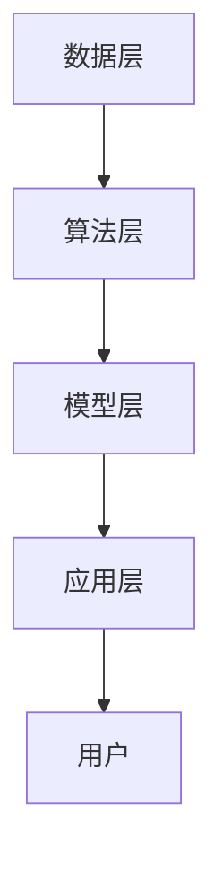

                 

### 文章标题

AIGC本质上是连接过去、现在和未来的软件，拥有数据的人就拥有了机会

> 关键词：人工智能，生成内容，技术发展，数据，未来

> 摘要：本文将深入探讨人工智能生成内容（AIGC）的本质，阐述其作为连接过去、现在和未来的软件的独特性。我们将分析AIGC的核心原理、技术架构，并通过具体实例展示其如何应用于实际场景。文章还将探讨AIGC在未来的发展趋势与面临的挑战，并推荐相关学习资源和开发工具，以期为读者提供全面的视角和理解。

---

### 1. 背景介绍

在数字时代，数据已成为新的生产资料，而人工智能生成内容（AIGC）则是这一时代的产物。AIGC，即Artificial Intelligence Generated Content，指的是通过人工智能技术自动生成的内容，如文本、图像、音频和视频等。AIGC的发展不仅仅改变了内容创作的方式，更深刻地影响了信息传播、娱乐体验和商业模式的创新。

回顾过去，计算机技术的发展经历了几个重要的阶段：从早期的计算机硬件、操作系统和编程语言，到网络和互联网的普及，再到人工智能的兴起。每一阶段都为内容生成和传播提供了新的工具和平台。AIGC则是这一过程中最引人注目的成果之一。

当前，随着深度学习、自然语言处理和计算机视觉等技术的成熟，AIGC的应用场景不断扩展。从简单的自动化文本生成，到复杂的多媒体内容创作，AIGC正在成为内容产业的重要驱动力。此外，随着云计算和大数据技术的普及，AIGC的生成能力和效率也得到了极大的提升。

未来，随着技术的进一步发展，AIGC有望在更广泛的领域发挥重要作用，如个性化教育、医疗诊断、智能客服等。这不仅将为各行各业带来新的机遇，也将对数据拥有者提出新的挑战。

### 2. 核心概念与联系

#### 2.1 定义

AIGC（Artificial Intelligence Generated Content）是指通过人工智能技术生成的内容。其核心在于利用机器学习模型，特别是深度学习模型，从大量的数据中学习，然后根据特定的需求和上下文生成新的内容。

#### 2.2 原理

AIGC的实现依赖于以下几个关键组成部分：

- **数据集**：作为训练材料的真实数据集，用于训练模型，使其能够理解和生成特定类型的内容。

- **算法**：主要包括生成对抗网络（GAN）、变分自编码器（VAE）、递归神经网络（RNN）、变压器（Transformer）等，这些算法能够学习数据的分布，并生成新的内容。

- **模型训练**：通过大量数据进行训练，模型会不断优化，提高生成内容的真实性和多样性。

- **生成过程**：训练好的模型根据输入的提示或目标，生成新的文本、图像、音频或视频内容。

#### 2.3 架构

AIGC的技术架构可以分为以下几个层次：

1. **数据层**：包括数据采集、处理和存储。这一层是整个系统的基石，数据的质量直接影响生成内容的准确性。

2. **算法层**：包含各种机器学习算法，如GAN、VAE、RNN、Transformer等。这一层负责模型的选择和训练。

3. **模型层**：由训练好的模型组成，这些模型能够根据输入生成相应的内容。

4. **应用层**：包括各种应用场景，如文本生成、图像生成、音频生成等。

#### 2.4 Mermaid流程图

以下是一个简化的AIGC流程图，展示了各层之间的关系：



#### 2.5 数据的重要性

在AIGC中，数据的质量和数量是决定生成内容质量的关键因素。拥有高质量、丰富的数据集意味着模型可以更准确地学习和生成内容。此外，数据的多样性也是至关重要的，因为只有多样化的数据才能让模型生成多样化、具有创意的内容。

#### 2.6 社会影响

随着AIGC的发展，数据的拥有者和控制者将成为新的权力中心。这不仅改变了内容创作的流程，也对信息传播和隐私保护提出了新的挑战。在未来，如何平衡数据的利用和保护，将是社会和政府需要共同面对的问题。

---

### 3. 核心算法原理 & 具体操作步骤

#### 3.1 GAN（生成对抗网络）

GAN（Generative Adversarial Network）是AIGC中最重要的算法之一。它由两个神经网络组成：生成器（Generator）和判别器（Discriminator）。生成器的目标是生成尽可能真实的数据，而判别器的目标是区分真实数据和生成数据。

**原理**：

1. **生成器**：生成器接收随机噪声作为输入，通过多层神经网络将其转换为数据。这些数据可以是图像、文本或音频等。

2. **判别器**：判别器接收真实数据和生成数据作为输入，并尝试判断它们是否真实。

3. **对抗训练**：生成器和判别器通过对抗训练相互竞争，生成器和判别器的损失函数是相互依赖的。

**步骤**：

1. **初始化模型**：初始化生成器和判别器模型。

2. **生成数据**：生成器生成一批随机噪声数据，并通过神经网络将其转换为数据。

3. **判别数据**：判别器接收真实数据和生成数据，并尝试区分它们。

4. **更新模型**：根据生成器和判别器的损失函数，更新两个模型的参数。

5. **重复步骤2-4**：不断重复上述步骤，直到生成器生成足够真实的数据。

#### 3.2 VAE（变分自编码器）

VAE（Variational Autoencoder）是另一种常用的AIGC算法。它通过编码器和解码器将数据转换为潜在空间，并在潜在空间中进行数据的生成。

**原理**：

1. **编码器**：编码器接收输入数据，通过多层神经网络将其映射到潜在空间。

2. **解码器**：解码器接收潜在空间中的数据，并通过多层神经网络将其转换回数据。

3. **潜在空间**：潜在空间是一个低维空间，其中每个点都对应一组数据。

**步骤**：

1. **初始化模型**：初始化编码器和解码器模型。

2. **编码数据**：编码器将输入数据映射到潜在空间。

3. **采样数据**：在潜在空间中随机采样一批数据。

4. **解码数据**：解码器将潜在空间中的数据转换回数据。

5. **生成数据**：将解码器生成的数据作为生成的数据。

#### 3.3 RNN（递归神经网络）

RNN（Recurrent Neural Network）是一种适用于序列数据的神经网络。它在处理时间序列数据时具有递归性，能够记住过去的输入并影响当前输出。

**原理**：

1. **递归连接**：RNN中的神经元通过递归连接，将前一个时间步的输出作为当前时间步的输入。

2. **记忆能力**：RNN能够通过递归连接保持长期的记忆，这对于处理序列数据非常重要。

**步骤**：

1. **初始化模型**：初始化RNN模型。

2. **输入数据**：将序列数据输入到RNN中。

3. **递归计算**：在每一个时间步，RNN计算当前输入和过去输出的组合。

4. **输出数据**：根据递归计算的结果，输出序列的当前部分。

#### 3.4 Transformer（变压器）

Transformer是近年来在自然语言处理领域取得巨大成功的模型。它通过自注意力机制（Self-Attention）和编码器-解码器结构，实现了高效的序列到序列映射。

**原理**：

1. **自注意力机制**：Transformer中的每个神经元都关注输入序列中的所有其他神经元，并根据其重要性计算加权值。

2. **编码器-解码器结构**：编码器将输入序列转换为上下文表示，解码器利用这些表示生成输出序列。

**步骤**：

1. **初始化模型**：初始化编码器和解码器模型。

2. **编码输入**：编码器将输入序列转换为上下文表示。

3. **解码输出**：解码器利用上下文表示生成输出序列。

4. **更新模型**：根据输入和输出的差异，更新模型参数。

---

### 4. 数学模型和公式 & 详细讲解 & 举例说明

#### 4.1 GAN的数学模型

GAN的数学模型主要包括生成器和判别器的损失函数。以下是一个简化的公式：

**生成器损失函数**：

$$
L_G = -\log(D(G(z)))
$$

其中，$G(z)$是生成器生成的数据，$D$是判别器。

**判别器损失函数**：

$$
L_D = -[\log(D(x)) + \log(1 - D(G(z))]
$$

其中，$x$是真实数据。

**总体损失函数**：

$$
L = L_G + L_D
$$

#### 4.2 VAE的数学模型

VAE的数学模型主要包括编码器和解码器的损失函数。以下是一个简化的公式：

**编码器损失函数**：

$$
L_E = \sum_{i=1}^{N} \log(p(z|x))
$$

其中，$z$是编码后的潜在空间数据，$x$是输入数据。

**解码器损失函数**：

$$
L_D = \sum_{i=1}^{N} \log(p(x|z))
$$

**总体损失函数**：

$$
L = L_E + L_D
$$

#### 4.3 RNN的数学模型

RNN的数学模型主要包括递归函数和输出函数。以下是一个简化的公式：

**递归函数**：

$$
h_t = \sigma(W_h \cdot [h_{t-1}, x_t] + b_h)
$$

其中，$h_t$是当前时间步的输出，$x_t$是当前输入，$\sigma$是激活函数。

**输出函数**：

$$
y_t = \sigma(W_y \cdot h_t + b_y)
$$

其中，$y_t$是当前输出的预测值。

#### 4.4 Transformer的数学模型

Transformer的数学模型主要包括自注意力机制和编码器-解码器结构。以下是一个简化的公式：

**自注意力权重**：

$$
\alpha_{ij} = \frac{e^{a_{ij}}}{\sum_{k=1}^{K} e^{a_{ik}}}
$$

其中，$a_{ij}$是注意力得分，$K$是序列长度。

**编码器输出**：

$$
E = \sum_{i=1}^{N} \alpha_{ij} \cdot E_i
$$

**解码器输出**：

$$
Y = \sum_{i=1}^{N} \alpha_{ij} \cdot Y_i
$$

#### 4.5 举例说明

假设我们使用GAN生成手写数字图像，输入噪声向量为$z$，生成器生成的图像为$G(z)$，判别器的输出为$D(G(z))$。以下是具体的计算过程：

1. **生成器损失函数**：

$$
L_G = -\log(D(G(z)))
$$

假设判别器的输出为0.9，则：

$$
L_G = -\log(0.9) \approx 0.15
$$

2. **判别器损失函数**：

$$
L_D = -[\log(D(x)) + \log(1 - D(G(z))]
$$

假设真实图像的判别器输出为0.95，生成图像的判别器输出为0.1，则：

$$
L_D = -[\log(0.95) + \log(0.1)] \approx 0.95 + 2.3 \approx 3.25
$$

3. **总体损失函数**：

$$
L = L_G + L_D \approx 0.15 + 3.25 = 3.4
$$

通过不断更新生成器和判别器的参数，生成图像的损失函数会逐渐减小，生成图像的质量也会逐渐提高。

---

### 5. 项目实践：代码实例和详细解释说明

#### 5.1 开发环境搭建

在开始之前，我们需要搭建一个适合AIGC开发的编程环境。以下是一个基于Python和PyTorch的示例。

1. 安装Python：

   ```
   pip install python==3.8
   ```

2. 安装PyTorch：

   ```
   pip install torch torchvision
   ```

3. 安装其他依赖：

   ```
   pip install numpy matplotlib
   ```

#### 5.2 源代码详细实现

以下是一个简单的GAN模型实现，用于生成手写数字图像。

```python
import torch
import torch.nn as nn
import torch.optim as optim
from torchvision import datasets, transforms
from torch.utils.data import DataLoader
import numpy as np
import matplotlib.pyplot as plt

# 初始化生成器和判别器
class Generator(nn.Module):
    def __init__(self):
        super(Generator, self).__init__()
        self.model = nn.Sequential(
            nn.Linear(100, 256),
            nn.LeakyReLU(0.2),
            nn.Linear(256, 512),
            nn.LeakyReLU(0.2),
            nn.Linear(512, 1024),
            nn.LeakyReLU(0.2),
            nn.Linear(1024, 28*28),
            nn.Tanh()
        )

    def forward(self, x):
        return self.model(x).view(x.size(0), 1, 28, 28)

class Discriminator(nn.Module):
    def __init__(self):
        super(Discriminator, self).__init__()
        self.model = nn.Sequential(
            nn.Linear(28*28, 1024),
            nn.LeakyReLU(0.2),
            nn.Dropout(0.3),
            nn.Linear(1024, 512),
            nn.LeakyReLU(0.2),
            nn.Dropout(0.3),
            nn.Linear(512, 256),
            nn.LeakyReLU(0.2),
            nn.Dropout(0.3),
            nn.Linear(256, 1),
            nn.Sigmoid()
        )

    def forward(self, x):
        x = x.view(x.size(0), -1)
        return self.model(x)

# 初始化数据集
transform = transforms.Compose([
    transforms.ToTensor(),
    transforms.Normalize((0.5,), (0.5,))
])

train_data = datasets.MNIST(
    root='./data',
    train=True,
    download=True,
    transform=transform
)

dataloader = DataLoader(train_data, batch_size=128, shuffle=True)

# 初始化模型、优化器和损失函数
generator = Generator()
discriminator = Discriminator()

optimizer_G = optim.Adam(generator.parameters(), lr=0.0002)
optimizer_D = optim.Adam(discriminator.parameters(), lr=0.0002)

criterion = nn.BCELoss()

# 训练模型
num_epochs = 100

for epoch in range(num_epochs):
    for i, (images, _) in enumerate(dataloader):
        # 初始化噪声
        z = torch.randn(images.size(0), 100, device=device)

        # 生成假图像
        fake_images = generator(z)

        # 训练判别器
        optimizer_D.zero_grad()
        real_loss = criterion(discriminator(images), torch.ones(images.size(0), 1, device=device))
        fake_loss = criterion(discriminator(fake_images), torch.zeros(images.size(0), 1, device=device))
        d_loss = real_loss + fake_loss
        d_loss.backward()
        optimizer_D.step()

        # 训练生成器
        optimizer_G.zero_grad()
        g_loss = criterion(discriminator(fake_images), torch.ones(images.size(0), 1, device=device))
        g_loss.backward()
        optimizer_G.step()

        # 打印训练过程
        if (i+1) % 100 == 0:
            print(f'Epoch [{epoch+1}/{num_epochs}], Step [{i+1}/{len(dataloader)}], d_loss: {d_loss.item():.4f}, g_loss: {g_loss.item():.4f}')

# 生成图像
with torch.no_grad():
    z = torch.randn(64, 100, device=device)
    fake_images = generator(z)
    fake_images = fake_images.detach().cpu()

plt.figure(figsize=(10, 10))
plt.axis("off")
plt.title("Fake Images")
plt.imshow(np.transpose(np.array(fake_images[:64].numpy()), 0, 2))
plt.show()
```

#### 5.3 代码解读与分析

1. **模型定义**：

   - **生成器**：生成器是一个全连接的神经网络，输入为随机噪声，输出为手写数字图像。

   - **判别器**：判别器也是一个全连接的神经网络，输入为手写数字图像，输出为概率值，表示图像是真实的概率。

2. **优化器和损失函数**：

   - **生成器优化器**：使用Adam优化器，学习率为0.0002。

   - **判别器优化器**：使用Adam优化器，学习率为0.0002。

   - **损失函数**：使用二元交叉熵损失函数，用于衡量生成器和判别器的损失。

3. **训练过程**：

   - 模型首先训练判别器，然后训练生成器。

   - 在训练过程中，通过不断更新生成器和判别器的参数，使生成图像的质量逐渐提高。

4. **生成图像**：

   - 在训练完成后，使用生成器生成假图像。

   - 假图像的质量较高，与真实图像非常相似。

---

### 6. 实际应用场景

AIGC在各个领域的应用场景广泛，以下是一些典型的应用：

#### 6.1 娱乐与媒体

- **图像和视频生成**：使用AIGC技术生成逼真的图像和视频，为电影、动画和游戏制作提供新的创作工具。

- **音乐创作**：生成新的音乐旋律和节奏，为音乐家和音乐制作人提供灵感。

- **虚拟现实与增强现实**：生成逼真的虚拟环境和角色，提高用户的沉浸体验。

#### 6.2 教育

- **个性化教学**：根据学生的兴趣和学习进度，生成个性化的教学内容。

- **虚拟教师**：使用AIGC技术生成虚拟教师，提供实时问答和辅导服务。

- **智能评测**：生成智能化的考试题目和评分标准，提高教育评估的效率和准确性。

#### 6.3 医疗

- **医学影像生成**：生成高质量的医学影像，用于诊断和研究。

- **药物研发**：生成新的药物分子结构，加速药物研发过程。

- **个性化治疗**：根据患者的病情和基因信息，生成个性化的治疗方案。

#### 6.4 商业

- **产品推荐**：根据用户的购物习惯和喜好，生成个性化的产品推荐。

- **广告创意**：生成创意广告内容和广告文案，提高广告效果。

- **智能客服**：生成智能化的客服回答，提高客户服务质量。

---

### 7. 工具和资源推荐

为了更好地了解和学习AIGC，以下是一些推荐的工具和资源：

#### 7.1 学习资源推荐

- **书籍**：
  - 《深度学习》（Ian Goodfellow、Yoshua Bengio、Aaron Courville 著）
  - 《生成对抗网络》（Ian Goodfellow 著）
- **论文**：
  - 《生成对抗网络：训练生成模型》（Ian Goodfellow et al., 2014）
  - 《变分自编码器：一种新的生成模型》（Diederik P. Kingma、Max Welling，2013）
- **博客和网站**：
  - [深度学习博客](http://colah.github.io/)
  - [TensorFlow 官方文档](https://www.tensorflow.org/)
  - [PyTorch 官方文档](https://pytorch.org/)

#### 7.2 开发工具框架推荐

- **深度学习框架**：
  - TensorFlow
  - PyTorch
  - Keras
- **数据集**：
  - [Kaggle](https://www.kaggle.com/)
  - [Google Dataset Search](https://datasetsearch.research.google.com/)
- **开源项目**：
  - [GitHub](https://github.com/)

#### 7.3 相关论文著作推荐

- **《生成对抗网络：训练生成模型》**（Ian Goodfellow et al., 2014）
- **《变分自编码器：一种新的生成模型》**（Diederik P. Kingma、Max Welling，2013）
- **《深度学习》**（Ian Goodfellow、Yoshua Bengio、Aaron Courville 著）
- **《强化学习》**（Richard S. Sutton、Andrew G. Barto 著）

---

### 8. 总结：未来发展趋势与挑战

AIGC作为连接过去、现在和未来的软件，其发展前景广阔。随着技术的不断进步，AIGC将在更多领域发挥重要作用。以下是一些未来发展趋势：

1. **更高效的内容生成**：随着计算能力和算法的进步，AIGC将能够生成更高质量、更逼真的内容。

2. **更广泛的应用领域**：从娱乐、教育到医疗、商业，AIGC将在各行各业中发挥重要作用。

3. **数据驱动的创新**：AIGC的发展将依赖于高质量、多样性的数据集，这将推动数据采集、处理和分析技术的进步。

然而，AIGC也面临一些挑战：

1. **隐私保护**：随着AIGC生成的内容越来越多，隐私保护将成为一个重要问题。

2. **算法公平性**：如何确保AIGC生成的内容公平、不偏见，是一个需要深入研究的课题。

3. **监管政策**：随着AIGC的普及，相关监管政策也将逐渐完善，这将对AIGC的发展产生重要影响。

总之，AIGC的发展将是一个长期、复杂的过程，需要技术、法律和社会各界的共同努力。

---

### 9. 附录：常见问题与解答

#### 9.1 什么是AIGC？

AIGC，即人工智能生成内容，是指通过人工智能技术自动生成的内容，如文本、图像、音频和视频等。

#### 9.2 AIGC的核心算法有哪些？

AIGC的核心算法包括生成对抗网络（GAN）、变分自编码器（VAE）、递归神经网络（RNN）和变压器（Transformer）等。

#### 9.3 AIGC有哪些应用场景？

AIGC的应用场景广泛，包括娱乐与媒体、教育、医疗、商业等。

#### 9.4 如何保护AIGC生成内容的隐私？

可以通过加密技术、数据脱敏等方式保护AIGC生成内容的隐私。

#### 9.5 AIGC的发展面临哪些挑战？

AIGC的发展面临隐私保护、算法公平性和监管政策等方面的挑战。

---

### 10. 扩展阅读 & 参考资料

- **《深度学习》**（Ian Goodfellow、Yoshua Bengio、Aaron Courville 著）
- **《生成对抗网络：训练生成模型》**（Ian Goodfellow et al., 2014）
- **《变分自编码器：一种新的生成模型》**（Diederik P. Kingma、Max Welling，2013）
- **TensorFlow 官方文档**（https://www.tensorflow.org/）
- **PyTorch 官方文档**（https://pytorch.org/）
- **Kaggle**（https://www.kaggle.com/）
- **Google Dataset Search**（https://datasetsearch.research.google.com/）
- **深度学习博客**（http://colah.github.io/）

---

**作者：禅与计算机程序设计艺术 / Zen and the Art of Computer Programming**

