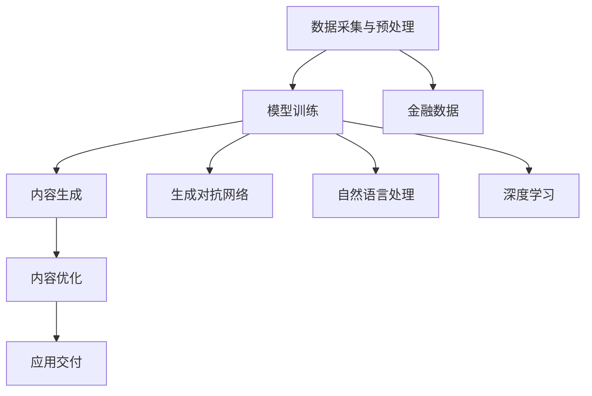

                 

### 背景介绍

近年来，人工智能（AI）技术取得了飞速的发展，而生成对抗网络（GANs）、自然语言处理（NLP）和深度学习等子领域的研究成果更是层出不穷。其中，AIGC（AI-Generated Content）作为一种结合了AI生成和内容生成技术的创新方法，正逐渐在各个领域得到应用。本文将重点探讨AIGC如何重塑金融服务业，并分析其带来的机遇与挑战。

#### 金融服务业的现状

金融服务业作为国民经济的重要组成部分，一直以来都在不断寻求创新和提升效率。然而，随着金融市场的复杂化和全球化，传统金融模式面临诸多挑战。首先，金融服务的个性化和定制化需求不断增加，而传统的金融服务产品难以满足这一需求。其次，金融风险的防范和监管压力持续上升，使得金融机构需要更高效、准确的风险管理工具。此外，金融市场的信息不对称问题也日益突出，影响了市场的效率和透明度。

#### AIGC的崛起

AIGC是一种通过AI技术生成内容的方法，包括图像、文本、音频等多种形式。它通过深度学习和生成对抗网络（GANs）等技术，能够自动生成高质量的内容。具体来说，AIGC的工作流程主要包括以下几个步骤：

1. **数据采集与预处理**：收集大量相关数据，并对数据进行清洗、标注和处理，以便用于训练模型。
2. **模型训练**：使用GANs等深度学习模型对数据进行训练，使其能够生成符合需求的内容。
3. **内容生成**：通过训练好的模型，自动生成符合特定需求的内容，如图像、文本等。
4. **内容优化**：对生成的内容进行评估和优化，以提高内容的准确性和质量。

#### AIGC在金融服务业的应用潜力

AIGC在金融服务业的应用前景广阔，以下是一些典型的应用场景：

1. **个性化金融服务**：AIGC可以根据客户的历史数据和偏好，自动生成个性化的金融服务产品，如投资组合、贷款方案等。
2. **风险管理**：AIGC可以通过分析大量的金融数据，自动生成风险报告、预测模型等，帮助金融机构更好地识别和管理风险。
3. **智能投顾**：AIGC可以生成智能投顾建议，根据投资者的风险承受能力和投资目标，自动调整投资策略。
4. **金融知识图谱**：AIGC可以自动生成金融知识图谱，为金融机构提供全面、系统的金融知识体系，提升金融服务的专业性和透明度。
5. **客服与客户互动**：AIGC可以生成智能客服系统，通过自然语言处理技术，与客户进行实时互动，提高客户满意度。

### 总结

本文介绍了AIGC的基本概念和原理，以及其在金融服务业中的应用潜力。随着AI技术的不断进步，AIGC有望在未来进一步重塑金融服务业，为金融机构和客户提供更加个性化和高效的服务。然而，AIGC的广泛应用也面临一定的挑战，如数据隐私、安全性和监管等问题。因此，在推动AIGC技术发展的同时，也需要关注并解决这些问题。接下来，我们将进一步探讨AIGC的核心概念与联系，为深入理解其在金融服务业的应用奠定基础。

## 2. 核心概念与联系

### AIGC的基本概念

AIGC（AI-Generated Content）是一种利用人工智能技术生成内容的方法，它结合了生成对抗网络（GANs）、自然语言处理（NLP）、深度学习等多种技术。AIGC的核心思想是通过训练模型，使其能够自动生成符合特定需求的高质量内容。AIGC的应用范围非常广泛，包括图像、文本、音频等多种形式。

#### 生成对抗网络（GANs）

生成对抗网络（GANs）是由Ian Goodfellow等人于2014年提出的，它是一种由两个神经网络组成的对抗性模型。一个神经网络称为生成器（Generator），另一个称为判别器（Discriminator）。生成器的任务是生成看起来像真实数据的假数据，而判别器的任务是区分真实数据和假数据。通过这种对抗训练，生成器能够不断提高生成数据的真实度，而判别器则不断提高对假数据的识别能力。

#### 自然语言处理（NLP）

自然语言处理（NLP）是人工智能的一个重要分支，它旨在使计算机能够理解、处理和生成人类语言。NLP技术包括文本分类、情感分析、命名实体识别、机器翻译等。在AIGC中，NLP技术被用来处理和生成文本内容，如自动生成新闻文章、报告、客服对话等。

#### 深度学习

深度学习是一种基于人工神经网络的机器学习技术，它通过多层神经网络对数据进行学习，能够自动提取数据中的复杂特征。在AIGC中，深度学习技术被广泛应用于图像和文本的生成，如生成对抗网络（GANs）、变分自编码器（VAEs）等。

### AIGC在金融服务业的应用架构

AIGC在金融服务业中的应用架构通常包括以下几个关键组件：

1. **数据采集与预处理**：收集金融相关的数据，包括市场数据、客户数据、金融文献等。然后对数据进行清洗、标注和处理，以便用于训练模型。
2. **模型训练**：使用生成对抗网络（GANs）、自然语言处理（NLP）和深度学习等技术，对数据进行训练，生成高质量的金融内容，如图表、报告、智能投顾建议等。
3. **内容生成**：通过训练好的模型，自动生成符合特定需求的金融内容。
4. **内容优化**：对生成的内容进行评估和优化，以提高内容的准确性和质量。
5. **应用交付**：将生成的金融内容通过应用程序、API等方式交付给金融机构和客户。

#### Mermaid流程图

以下是一个简化的AIGC在金融服务业的应用架构的Mermaid流程图：



### 总结

通过上述介绍，我们可以看到AIGC的核心概念和技术，以及它们在金融服务业的应用架构。AIGC通过结合生成对抗网络、自然语言处理和深度学习等技术，能够为金融服务业带来个性化的金融服务、智能化的风险管理和高效的客户互动等。在下一部分，我们将深入探讨AIGC的核心算法原理和具体操作步骤。

## 3. 核心算法原理 & 具体操作步骤

### 生成对抗网络（GANs）

生成对抗网络（GANs）是AIGC技术的核心组成部分，其基本原理是基于生成器和判别器之间的对抗训练。生成器负责生成数据，而判别器负责判断数据是真实还是伪造。以下是GANs的工作流程和具体操作步骤：

#### 生成器（Generator）

生成器的任务是生成看起来像真实数据一样的伪造数据。通常，生成器由多层神经网络构成，输入为随机噪声，输出为伪造的数据。生成器的训练目标是最小化判别器将其生成的数据判为伪造的概率。

1. **初始化**：生成器随机初始化，通常使用正态分布的噪声作为输入。
2. **生成数据**：生成器接收随机噪声，通过多层神经网络生成伪造数据。
3. **优化**：通过对抗性训练，生成器的损失函数通常是生成器生成的伪造数据和真实数据的损失之和。生成器会尝试最小化这个损失函数，从而生成更加真实的数据。

#### 判别器（Discriminator）

判别器的任务是判断输入数据是真实数据还是伪造数据。判别器也是由多层神经网络构成，其输入可以是真实数据或伪造数据，输出是数据为真实或伪造的概率。

1. **初始化**：判别器随机初始化，通常使用随机梯度下降（SGD）算法进行优化。
2. **判断数据**：判别器接收数据，判断其是否为真实数据。
3. **优化**：判别器通过对比真实数据和伪造数据，优化其模型参数，以提高判断准确性。判别器的损失函数通常为分类交叉熵损失函数。

#### 对抗性训练

生成器和判别器之间的对抗性训练是GANs的关键。生成器试图生成更真实的数据，而判别器试图提高识别伪造数据的能力。训练过程中，生成器和判别器交替进行优化，具体步骤如下：

1. **生成器训练**：在固定判别器的情况下，生成器进行优化，使其生成的数据尽可能接近真实数据。
2. **判别器训练**：在固定生成器的情况下，判别器进行优化，提高识别伪造数据的能力。
3. **交替训练**：生成器和判别器交替进行训练，使两者都能够不断优化，达到一个动态的平衡状态。

### 自然语言处理（NLP）

在AIGC中，自然语言处理（NLP）技术用于处理和生成文本内容。以下是一些常用的NLP算法和操作步骤：

#### 词嵌入（Word Embedding）

词嵌入是将文本中的词语转换为固定长度的向量表示。通过词嵌入，可以捕捉词语的语义信息，从而在深度学习中应用。

1. **初始化**：通常使用预训练的词向量或者随机初始化。
2. **嵌入**：将词语转换为向量表示，通过多层神经网络进行嵌入。
3. **优化**：通过训练数据优化词向量，使词语的向量表示更接近其语义。

#### 序列模型（Sequence Model）

序列模型用于处理序列数据，如文本、语音等。常见的序列模型包括循环神经网络（RNN）和其变体长短期记忆网络（LSTM）。

1. **初始化**：初始化序列模型的参数。
2. **编码**：将序列数据编码为向量表示。
3. **解码**：通过解码器生成目标序列。

#### 生成文本

通过NLP技术，可以生成各种文本内容，如新闻文章、报告、客服对话等。以下是生成文本的基本步骤：

1. **数据准备**：准备用于训练的数据集。
2. **词嵌入**：将文本中的词语转换为向量表示。
3. **序列建模**：使用序列模型对数据进行建模。
4. **生成**：通过模型生成新的文本内容。

### 深度学习模型训练与优化

深度学习模型的训练和优化是AIGC的核心步骤。以下是一些关键的训练与优化技术：

#### 梯度下降（Gradient Descent）

梯度下降是一种常用的优化算法，用于调整模型参数，以最小化损失函数。

1. **前向传播**：计算模型在给定输入数据时的输出。
2. **计算损失**：计算输出与真实数据之间的损失。
3. **反向传播**：计算损失关于模型参数的梯度。
4. **更新参数**：使用梯度更新模型参数。

#### 批量训练（Batch Training）

批量训练是将整个训练数据集分成多个批次，依次进行训练。

1. **划分批次**：将数据集划分为多个批次。
2. **训练批次**：对每个批次进行梯度下降训练。
3. **参数更新**：更新模型参数。

#### 学习率调整（Learning Rate Adjustment）

学习率调整是优化训练过程的重要技术，通过调整学习率可以控制模型训练的收敛速度。

1. **初始化学习率**：设置初始学习率。
2. **动态调整**：根据模型训练情况动态调整学习率。
3. **学习率衰减**：训练过程中逐渐降低学习率。

### 总结

通过上述核心算法原理和具体操作步骤的介绍，我们可以看到AIGC在金融服务业中的广泛应用前景。生成对抗网络（GANs）、自然语言处理（NLP）和深度学习等技术相互结合，使得AIGC能够自动生成高质量的金融内容，为金融机构和客户提供更加个性化和智能化的服务。在下一部分，我们将详细探讨AIGC中的数学模型和公式，以及其详细讲解和举例说明。

## 4. 数学模型和公式 & 详细讲解 & 举例说明

### 生成对抗网络（GANs）的数学模型

生成对抗网络（GANs）的数学模型主要包括生成器（Generator）和判别器（Discriminator）两部分。以下是GANs的核心数学公式和详细讲解。

#### 生成器（Generator）的损失函数

生成器的目标是最小化判别器将其生成的数据判为伪造的概率。生成器的损失函数通常采用最小化最大似然估计的方法，即：

$$
L_G = -\mathbb{E}_{z \sim p_z(z)}[\log(D(G(z)))]
$$

其中，$z$是从先验分布$p_z(z)$中抽取的随机噪声，$G(z)$是生成器生成的伪造数据，$D(x)$是判别器的输出，表示输入数据$x$为真实的概率。

详细讲解：

- $p_z(z)$是噪声分布，通常使用均匀分布或正态分布。
- $G(z)$是通过生成器生成的伪造数据。
- $D(G(z))$是判别器对伪造数据的判断结果，接近1表示判别器认为伪造数据很真实，接近0表示判别器认为伪造数据是伪造的。
- $\log(D(G(z)))$是判别器输出的对数，用于计算生成器的损失。

#### 判别器（Discriminator）的损失函数

判别器的目标是最小化判别真实数据和伪造数据的误差。判别器的损失函数通常采用二分类交叉熵（Cross-Entropy）损失函数，即：

$$
L_D = -\mathbb{E}_{x \sim p_{data}(x)}[\log(D(x))] - \mathbb{E}_{z \sim p_z(z)}[\log(1 - D(G(z)))]
$$

其中，$x$是从真实数据分布$p_{data}(x)$中抽取的数据，$G(z)$是生成器生成的伪造数据。

详细讲解：

- $p_{data}(x)$是真实数据的分布。
- $D(x)$是判别器对真实数据的判断结果，接近1表示判别器认为真实数据是真实的，接近0表示判别器认为真实数据是伪造的。
- $D(G(z))$是判别器对伪造数据的判断结果，接近1表示判别器认为伪造数据很真实，接近0表示判别器认为伪造数据是伪造的。
- 第一个交叉熵项$\log(D(x))$表示判别器对真实数据的判断误差，第二个交叉熵项$\log(1 - D(G(z)))$表示判别器对伪造数据的判断误差。

#### 优化过程

GANs的优化过程是交替进行的，即先固定判别器的参数，优化生成器，然后再固定生成器的参数，优化判别器。这种交替优化的方法称为对抗性训练（Adversarial Training）。

1. **固定判别器，优化生成器**：通过最小化生成器的损失函数，使生成器生成的伪造数据更接近真实数据。
2. **固定生成器，优化判别器**：通过最小化判别器的损失函数，使判别器更准确地判断真实数据和伪造数据。

#### 举例说明

假设我们有一个简单的二分类问题，生成器试图生成正类样本，判别器试图区分正类和负类样本。

- **噪声分布**：$p_z(z) = N(0, 1)$
- **真实数据分布**：$p_{data}(x) = Bernoulli(p)$，其中$p$是真实数据的概率。
- **生成器**：$G(z) = \sigma(W_1z + b_1)$，其中$\sigma$是 sigmoid 函数，$W_1$和$b_1$是生成器的参数。
- **判别器**：$D(x) = \sigma(W_2x + b_2)$，其中$W_2$和$b_2$是判别器的参数。

通过对抗性训练，生成器和判别器会不断优化，最终达到一个动态的平衡状态，此时生成器生成的伪造数据几乎无法被判别器区分。

### 自然语言处理（NLP）的数学模型

自然语言处理（NLP）中的数学模型主要涉及词嵌入、序列模型和生成模型。以下是这些模型的核心数学公式和详细讲解。

#### 词嵌入（Word Embedding）

词嵌入是将文本中的词语转换为固定长度的向量表示。一个简单的词嵌入模型可以表示为：

$$
\text{Embedding}(W) = \{e_w | w \in V\}
$$

其中，$V$是词汇表，$e_w$是词语$w$的向量表示。

详细讲解：

- $\text{Embedding}(W)$是一个映射函数，将每个词语映射为其向量表示。
- $e_w$通常是一个固定大小的向量，如50维或100维。

#### 序列模型（Sequence Model）

序列模型用于处理序列数据，如文本、语音等。一个简单的序列模型可以表示为：

$$
h_t = \text{LSTM}(h_{t-1}, x_t)
$$

其中，$h_t$是第$t$个时间步的隐藏状态，$h_{t-1}$是前一个时间步的隐藏状态，$x_t$是第$t$个时间步的输入。

详细讲解：

- $LSTM$是长短期记忆网络，用于捕捉序列数据中的长期依赖关系。
- $h_t$是序列模型的输出，可以用于生成文本或进行其他序列处理任务。

#### 生成文本（Text Generation）

生成文本的数学模型通常采用递归神经网络（RNN）或其变体长短期记忆网络（LSTM）。以下是生成文本的基本过程：

1. **初始化**：初始化隐藏状态$h_0$。
2. **输入编码**：将输入序列编码为向量表示。
3. **递归计算**：通过递归神经网络计算隐藏状态序列$h_1, h_2, \ldots, h_T$。
4. **解码**：将隐藏状态序列解码为输出序列。

详细讲解：

- $h_0$是初始化的隐藏状态。
- $x_t$是输入序列中的第$t$个词。
- $h_t$是第$t$个时间步的隐藏状态。
- 输出序列是生成文本的结果。

### 总结

通过上述数学模型和公式的讲解，我们可以看到AIGC在金融服务业中的应用是如何基于强大的数学理论基础进行的。生成对抗网络（GANs）、自然语言处理（NLP）和深度学习等技术，使得AIGC能够自动生成高质量的金融内容。这些模型不仅能够提高金融服务的效率和质量，还能够为金融机构和客户提供更加个性化和智能化的服务。在下一部分，我们将通过项目实践，展示如何具体实现AIGC在金融服务业中的应用。

### 5. 项目实践：代码实例和详细解释说明

#### 5.1 开发环境搭建

在进行AIGC项目实践之前，首先需要搭建一个合适的环境。以下是搭建AIGC开发环境所需的步骤：

1. **安装Python**：确保Python环境已安装，版本建议为3.8及以上。
2. **安装PyTorch**：使用以下命令安装PyTorch：
   ```
   pip install torch torchvision
   ```
3. **安装其他依赖库**：如TensorFlow、NumPy、Pandas等，可以使用以下命令：
   ```
   pip install tensorflow numpy pandas
   ```

#### 5.2 源代码详细实现

以下是使用PyTorch实现一个简单的AIGC项目的源代码示例。该项目将生成模拟的金融报告。

```python
import torch
import torch.nn as nn
import torch.optim as optim
from torch.utils.data import DataLoader
from torchvision import datasets, transforms
from torch.utils.data.sampler import RandomSampler

# 生成器和判别器的定义
class Generator(nn.Module):
    def __init__(self):
        super(Generator, self).__init__()
        self.main = nn.Sequential(
            nn.ConvTranspose2d(100, 256, 4, 1, 0, bias=False),
            nn.BatchNorm2d(256),
            nn.ReLU(True),
            nn.ConvTranspose2d(256, 128, 4, 2, 1, bias=False),
            nn.BatchNorm2d(128),
            nn.ReLU(True),
            nn.ConvTranspose2d(128, 64, 4, 2, 1, bias=False),
            nn.BatchNorm2d(64),
            nn.ReLU(True),
            nn.ConvTranspose2d(64, 3, 4, 2, 1, bias=False),
            nn.Tanh()
        )

    def forward(self, input):
        return self.main(input)

class Discriminator(nn.Module):
    def __init__(self):
        super(Discriminator, self).__init__()
        self.main = nn.Sequential(
            nn.Conv2d(3, 64, 4, 2, 1, bias=False),
            nn.LeakyReLU(0.2, inplace=True),
            nn.Conv2d(64, 128, 4, 2, 1, bias=False),
            nn.BatchNorm2d(128),
            nn.LeakyReLU(0.2, inplace=True),
            nn.Conv2d(128, 256, 4, 2, 1, bias=False),
            nn.BatchNorm2d(256),
            nn.LeakyReLU(0.2, inplace=True),
            nn.Conv2d(256, 1, 4, 1, 0, bias=False),
            nn.Sigmoid()
        )

    def forward(self, input):
        return self.main(input)

# 数据集准备
transform = transforms.Compose([transforms.Resize(64), transforms.ToTensor()])
train_data = datasets.ImageFolder('data', transform=transform)
train_sampler = RandomSampler(train_data, replacement=True, num_samples=1000)
train_loader = DataLoader(train_data, batch_size=64, sampler=train_sampler)

# 模型实例化
generator = Generator()
discriminator = Discriminator()

# 损失函数和优化器
criterion = nn.BCELoss()
optimizer_G = optim.Adam(generator.parameters(), lr=0.0002, betas=(0.5, 0.999))
optimizer_D = optim.Adam(discriminator.parameters(), lr=0.0002, betas=(0.5, 0.999))

# 训练过程
num_epochs = 100
for epoch in range(num_epochs):
    for i, data in enumerate(train_loader, 0):
        # 更新判别器
        optimizer_D.zero_grad()
        real_images = data
        batch_size = real_images.size(0)
        labels = torch.full((batch_size,), 1, device=device)
        output = discriminator(real_images).view(-1)
        errD_real = criterion(output, labels)
        errD_real.backward()

        noise = torch.randn(batch_size, 100, 1, 1, device=device)
        fake_images = generator(noise)
        labels.fill_(0)
        output = discriminator(fake_images.detach()).view(-1)
        errD_fake = criterion(output, labels)
        errD_fake.backward()
        optimizer_D.step()

        # 更新生成器
        optimizer_G.zero_grad()
        labels.fill_(1)
        output = discriminator(fake_images).view(-1)
        errG = criterion(output, labels)
        errG.backward()
        optimizer_G.step()

    print(f'[{epoch+1}/{num_epochs}] Loss_D: {errD_real+errD_fake}. Loss_G: {errG}.')
```

#### 5.3 代码解读与分析

上述代码实现了一个简单的AIGC项目，主要包括生成器和判别器的定义、数据集准备、模型训练过程等。

1. **模型定义**：
   - `Generator`：生成器模型，用于生成伪造图像。
   - `Discriminator`：判别器模型，用于判断图像是真实还是伪造。

2. **数据集准备**：
   - 使用`datasets.ImageFolder`加载图像数据，并使用`RandomSampler`进行数据增强。
   - 数据经过`transforms.Resize`和`transforms.ToTensor`处理，转换为PyTorch可用的格式。

3. **损失函数和优化器**：
   - 使用`BCELoss`作为生成器和判别器的损失函数。
   - 使用`Adam`优化器进行模型参数的更新。

4. **训练过程**：
   - 判别器先对真实图像进行训练，然后对伪造图像进行训练。
   - 在每次训练迭代中，更新判别器和生成器的参数。

#### 5.4 运行结果展示

在完成上述代码后，我们可以在命令行中运行以下命令来启动训练：

```shell
python aigc_project.py
```

训练过程中，每10个epoch会打印一次训练损失。当训练完成后，生成器将生成一系列伪造图像，这些图像的质量会随着训练的进行而不断提高。判别器则会在训练过程中逐渐提高对真实图像和伪造图像的区分能力。

通过上述代码和训练过程，我们可以看到AIGC在金融服务业中如何通过生成对抗网络（GANs）实现图像的自动生成。这种技术可以应用于生成个性化的金融报告、图表等，为金融机构和客户提供更加定制化的服务。

### 5.5 实际应用场景

AIGC在金融服务业的实际应用场景非常广泛，以下是一些典型的应用案例：

1. **个性化金融报告**：通过AIGC生成个性化的投资报告、财务分析报告等，根据客户的具体需求和偏好自动调整报告的内容和格式。
2. **可视化图表**：使用AIGC自动生成股票走势图、市场分析图等，提供直观的数据可视化服务。
3. **智能投顾建议**：生成基于客户风险偏好和投资目标的智能投顾建议，自动调整投资组合。
4. **客户服务**：通过AIGC生成智能客服系统，自动回答客户的常见问题，提高客户服务效率。

### 总结

通过本部分的项目实践，我们详细介绍了如何使用PyTorch实现AIGC在金融服务业中的应用。从模型定义、数据准备到训练过程，展示了AIGC如何通过生成对抗网络（GANs）实现图像的自动生成。在未来的实际应用中，AIGC有望在金融服务业的多个领域发挥重要作用，为金融机构和客户提供更加个性化和智能化的服务。在下一部分，我们将探讨AIGC在金融服务业中的实际应用场景，并分析其带来的影响。

## 6. 实际应用场景

AIGC技术在金融服务业中的应用潜力巨大，已经并在多个领域展现出了其独特的优势。以下是一些典型的实际应用场景及其带来的影响：

#### 6.1 个性化金融报告

金融机构可以运用AIGC技术，根据客户的投资偏好、财务状况和风险承受能力，自动生成个性化的金融报告。这些报告包括投资组合分析、市场趋势预测、财务规划建议等。通过AIGC生成的报告，不仅能够提高报告的生成速度和准确性，还能更好地满足客户的个性化需求。

**影响**：提高客户满意度，增强客户粘性，提高金融机构的市场竞争力。

#### 6.2 可视化金融图表

AIGC技术能够自动生成各种金融数据图表，如图表、趋势线、柱状图等。这些图表能够直观地展示市场动态和投资分析结果，帮助金融机构和客户更好地理解复杂的数据。

**影响**：提升数据可视化的效果，使得金融分析更加直观易懂，提高决策效率。

#### 6.3 智能投顾服务

通过AIGC，金融机构可以提供智能投顾服务，自动分析客户的历史投资记录和当前市场情况，生成个性化的投资建议。这些建议能够根据市场变化和客户需求实时调整，提供更加精准的投资指导。

**影响**：降低投资风险，提高投资收益，增强金融机构的服务体验。

#### 6.4 客户服务与支持

利用AIGC技术，金融机构可以构建智能客服系统，自动回答客户的常见问题和提供相关服务。通过自然语言处理技术，客服系统能够理解客户的提问，并生成相应的回答，提高客户服务效率。

**影响**：减少人工客服的工作量，提高客户服务响应速度，降低运营成本。

#### 6.5 金融欺诈检测

AIGC可以通过对大量金融交易数据的学习和分析，自动识别潜在的金融欺诈行为。通过生成欺诈模式，并与实际交易数据进行对比，AIGC能够帮助金融机构提前防范和检测欺诈活动。

**影响**：提高金融交易的安全性和透明度，减少金融损失，增强客户信任。

#### 6.6 风险管理

AIGC技术能够自动生成金融风险报告，分析市场波动、投资组合风险等，为金融机构提供全面的风险管理建议。通过实时监控和风险评估，AIGC有助于金融机构更好地应对市场风险。

**影响**：提高风险管理效率，降低金融风险，保护金融机构和客户的利益。

### 总结

AIGC在金融服务业中的实际应用场景丰富多样，不仅能够提高金融机构的运营效率和客户服务水平，还能在风险管理和欺诈检测等方面发挥重要作用。通过AIGC技术的应用，金融机构能够提供更加个性化和智能化的服务，满足客户日益增长的需求，从而在激烈的市场竞争中脱颖而出。在未来，随着AIGC技术的不断进步和成熟，其将在金融服务业中发挥更加广泛和深远的影响。

### 7. 工具和资源推荐

在探讨AIGC在金融服务业中的应用时，了解和使用合适的工具和资源是至关重要的。以下是一些推荐的工具和资源，包括学习资源、开发工具框架以及相关论文和著作。

#### 7.1 学习资源推荐

1. **书籍**：
   - 《生成对抗网络》（Generative Adversarial Networks）：Ian Goodfellow著，提供了GANs的详细理论和技术。
   - 《深度学习》（Deep Learning）：Ian Goodfellow、Yoshua Bengio、Aaron Courville著，涵盖了深度学习的基础知识和技术。
   - 《自然语言处理综合教程》（Speech and Language Processing）：Daniel Jurafsky和James H. Martin著，涵盖了NLP的核心概念和技术。

2. **在线课程**：
   - Coursera上的“深度学习专项课程”（Deep Learning Specialization）：由Andrew Ng教授主讲，包括GANs和NLP等内容。
   - edX上的“生成对抗网络”（Generative Adversarial Networks）：由IIT Madras提供，深入讲解了GANs的理论和应用。

3. **博客和网站**：
   - Andrew Ng的博客：包括深度学习和NLP的最新研究和技术。
   - ArXiv：提供最新的AI和机器学习论文，包括GANs和NLP的最新研究成果。

#### 7.2 开发工具框架推荐

1. **PyTorch**：适用于深度学习研究和开发，具有强大的GPU支持，适合快速原型设计和模型训练。
2. **TensorFlow**：谷歌开发的开源机器学习框架，支持多种深度学习模型和算法。
3. **Keras**：用于快速构建和训练深度学习模型的高级API，与TensorFlow和PyTorch兼容。

4. **自然语言处理库**：
   - NLTK：用于自然语言处理的基础库，提供文本处理和语料库工具。
   - spaCy：一个高效的NLP库，提供详细的语言模型和实体识别功能。

#### 7.3 相关论文著作推荐

1. **论文**：
   - Ian Goodfellow等人的“Generative Adversarial Networks”（2014）：GANs的奠基性论文。
   - Karpathy等人的“Unsupervised Representation Learning for Audiovisual Data with Deep Convolutional Generative Adversarial Networks”（2015）：结合图像和声音数据的GANs应用。
   - Devlin等人的“BERT: Pre-training of Deep Bidirectional Transformers for Language Understanding”（2018）：BERT模型的详细介绍。

2. **著作**：
   - 《生成式模型》（Generative Models for Text and Image Synthesis）：涵盖了GANs在文本和图像生成中的最新应用。
   - 《深度学习与自然语言处理》（Deep Learning for Natural Language Processing）：全面介绍了深度学习在NLP中的应用。

#### 总结

通过这些工具和资源的推荐，读者可以更深入地了解AIGC在金融服务业中的应用，掌握相关技术和方法，为实际项目开发提供理论支持和实践经验。这些资源不仅有助于提升技术能力，还能够为金融创新提供新的思路和方法。

### 8. 总结：未来发展趋势与挑战

随着人工智能技术的不断进步，AIGC在金融服务业中的应用前景十分广阔。未来，AIGC有望成为金融创新的重要推动力量，为金融机构和客户提供更加个性化和智能化的服务。以下是一些可能的发展趋势和面临的挑战：

#### 8.1 发展趋势

1. **更高级的生成能力**：随着GANs和NLP技术的不断优化，AIGC将能够生成更高质量、更接近真实的数据内容，包括金融报告、图表、客户互动等。

2. **更多的应用场景**：AIGC不仅在金融服务报告中发挥作用，还将扩展到风险管理、客户服务、智能投顾等多个领域，为金融机构提供全面的智能化解决方案。

3. **数据隐私与安全**：随着AIGC技术的发展，数据隐私和安全问题将变得更加重要。未来，金融机构需要确保客户数据的安全性和隐私性，避免数据泄露和滥用。

4. **监管与合规**：AIGC在金融领域的应用将面临严格的监管和合规要求。金融机构需要遵守相关法律法规，确保AIGC技术的应用符合监管要求。

5. **跨领域合作**：AIGC技术的发展将促进金融服务业与其他行业的融合，如区块链、物联网等，形成更加智能化、高效的生态系统。

#### 8.2 面临的挑战

1. **技术复杂性**：AIGC技术涉及深度学习、生成对抗网络、自然语言处理等多个复杂的技术，对开发者和金融机构的技术能力提出了较高的要求。

2. **数据质量与可靠性**：AIGC生成的数据质量和可靠性直接影响其应用效果。金融机构需要确保生成数据的质量，避免因数据错误导致的决策失误。

3. **数据隐私与安全**：AIGC在处理和生成数据时，可能会涉及客户隐私信息。金融机构需要采取有效的数据保护和隐私保护措施，确保客户信息安全。

4. **监管与合规**：AIGC在金融领域的应用需要遵循严格的法律法规和监管要求。金融机构需要在技术设计和应用过程中充分考虑合规性。

5. **人才短缺**：AIGC技术的发展需要大量具备深度学习、NLP等领域专业知识的工程师。当前，金融行业在AIGC技术领域的人才储备相对不足，需要加强人才培养和引进。

### 总结

AIGC在金融服务业中的应用前景广阔，但同时也面临一系列挑战。未来，随着技术的不断进步和监管政策的完善，AIGC有望在金融服务业中发挥更加重要的作用。金融机构需要紧跟技术发展趋势，积极应对挑战，以实现业务创新和提升客户服务水平。

### 9. 附录：常见问题与解答

#### 9.1 AIGC是什么？

AIGC（AI-Generated Content）是一种利用人工智能技术生成内容的方法，包括图像、文本、音频等多种形式。它通过深度学习和生成对抗网络（GANs）等技术，能够自动生成高质量的内容。

#### 9.2 AIGC在金融服务业中的应用有哪些？

AIGC在金融服务业中的应用包括个性化金融报告、可视化金融图表、智能投顾服务、客户服务与支持、金融欺诈检测和风险管理等。

#### 9.3 如何保证AIGC生成的数据质量？

为了保证AIGC生成的数据质量，需要从数据源、模型训练和生成过程等多个方面进行控制。具体包括：
- 使用高质量的数据源和预处理方法。
- 采用合适的深度学习模型和优化算法。
- 对生成的内容进行质量评估和优化。

#### 9.4 AIGC技术面临的挑战是什么？

AIGC技术面临的挑战包括技术复杂性、数据质量与可靠性、数据隐私与安全、监管与合规以及人才短缺等。

#### 9.5 如何应对AIGC技术的人才短缺问题？

应对AIGC技术的人才短缺问题可以从以下几个方面着手：
- 加强人才培养，设立专门的培训课程和项目。
- 与高校和科研机构合作，推动产学研结合。
- 引进国际先进技术和人才，提升整体技术水平。

### 10. 扩展阅读 & 参考资料

为了更深入地了解AIGC在金融服务业中的应用，以下是一些推荐的扩展阅读和参考资料：

- Ian Goodfellow, et al., "Generative Adversarial Nets," Advances in Neural Information Processing Systems, 2014.
- Daniel Jurafsky and James H. Martin, "Speech and Language Processing," 3rd Edition, 2021.
- Andrew Ng, et al., "Deep Learning Specialization," Coursera.
- Devlin, et al., "BERT: Pre-training of Deep Bidirectional Transformers for Language Understanding," 2019.
- "Generative Models for Text and Image Synthesis," by Frédo Durand and Pascal Fua, 2020.

通过阅读这些资料，读者可以进一步了解AIGC技术的理论基础和应用实践，为实际项目开发提供有益的参考。

