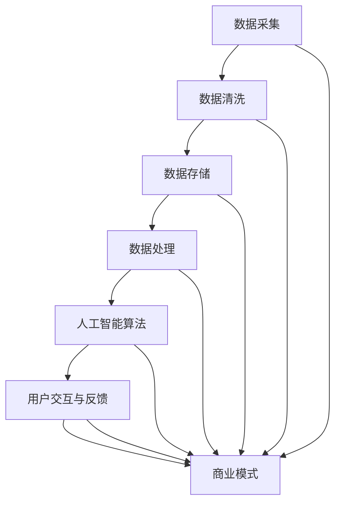

                 

### 背景介绍

随着人工智能技术的迅猛发展，AI-Native 应用逐渐成为现代软件开发的重要方向。AI-Native 应用是指那些从设计、开发到部署都深度集成人工智能技术的应用，旨在充分利用人工智能带来的计算能力和效率提升。这种应用模式不仅仅局限于传统的数据处理和分析，还涵盖了自然语言处理、计算机视觉、智能推荐等多个领域。

#### 1.1 AI-Native 应用的定义

AI-Native 应用可以定义为一种利用人工智能算法和模型来驱动核心功能的应用。这些应用不仅在其设计和开发过程中考虑了人工智能技术，而且在运行时也依赖于这些技术来实现高效、智能的交互和处理。与传统应用相比，AI-Native 应用具有更高的灵活性和自适应能力，能够更好地适应不断变化的数据和用户需求。

#### 1.2 AI-Native 应用的兴起背景

AI-Native 应用的兴起主要源于以下几个方面的背景：

1. **计算能力的提升**：随着云计算、GPU 等硬件技术的发展，计算能力的提升使得复杂的人工智能算法能够更快速、更高效地运行。
2. **大数据的爆发**：互联网和物联网的发展带来了海量数据，这些数据为人工智能算法提供了丰富的训练资源，使得 AI-Native 应用的效果得以显著提升。
3. **用户需求的变化**：现代用户对应用的需求越来越高，不仅要求功能强大，还希望使用体验更加智能、个性化。AI-Native 应用能够更好地满足这些需求。
4. **商业模式的变化**：传统商业模式中，应用的开发和运营成本较高，而 AI-Native 应用通过降低开发和运营成本，提高了商业可行性。

#### 1.3 AI-Native 应用与传统应用的区别

与传统的应用模式相比，AI-Native 应用有以下几个显著区别：

1. **数据驱动**：AI-Native 应用高度依赖数据，通过数据的分析和处理来驱动应用的核心功能。
2. **智能交互**：AI-Native 应用能够通过自然语言处理、语音识别等技术实现智能化的用户交互。
3. **自适应性**：AI-Native 应用可以根据用户行为和反馈自动调整其行为，提高用户体验。
4. **持续学习**：AI-Native 应用能够通过不断的学习和优化，提高其性能和效果。

总的来说，AI-Native 应用的兴起标志着人工智能技术在软件开发中更加深入和广泛的应用，为现代应用开发带来了新的机遇和挑战。在接下来的章节中，我们将深入探讨 AI-Native 应用的核心概念、算法原理以及实际应用场景，帮助读者更好地理解和把握这一发展趋势。

#### 1.4 目的和重要性

本文旨在深入探讨 AI-Native 应用的商业模式创新，解析其在商业环境中的潜力和挑战，并提供一些建设性的策略和思路。随着人工智能技术的不断成熟，AI-Native 应用的商业价值日益凸显。然而，如何在激烈的市场竞争中脱颖而出，实现商业模式的创新，成为当前企业面临的重大课题。

本文将通过以下几个部分展开：

1. **核心概念与联系**：详细阐述 AI-Native 应用中的核心概念，并通过 Mermaid 流程图展示其原理和架构。
2. **核心算法原理 & 具体操作步骤**：介绍 AI-Native 应用中常用的算法，包括其基本原理和具体操作步骤。
3. **数学模型和公式 & 详细讲解 & 举例说明**：解释 AI-Native 应用中涉及的数学模型和公式，并提供具体的例子来说明其应用。
4. **项目实践：代码实例和详细解释说明**：通过实际项目实例，展示 AI-Native 应用的开发过程，并进行详细解读和分析。
5. **实际应用场景**：探讨 AI-Native 应用在不同领域的具体应用，分析其优势和实践经验。
6. **工具和资源推荐**：推荐学习资源、开发工具和框架，帮助读者深入了解和掌握 AI-Native 应用。
7. **总结：未来发展趋势与挑战**：总结 AI-Native 应用的现状和未来发展趋势，分析面临的挑战，并提出相应的解决方案。

通过本文的深入探讨，希望能够为读者提供有价值的见解，助力他们在 AI-Native 应用的商业实践中取得成功。

#### 1.5 当前研究现状

近年来，AI-Native 应用的研究取得了显著进展，成为学术界和产业界关注的热点。在学术界，研究人员围绕人工智能算法、模型优化、数据处理等方面进行了深入探讨，提出了许多创新的解决方案。例如，深度学习在图像识别、自然语言处理等领域取得了突破性进展，为 AI-Native 应用提供了强大的技术支持。

在产业界，各大科技公司纷纷加大对 AI-Native 应用的投入，开发出一系列具有商业价值的应用。例如，智能推荐系统、智能客服、自动驾驶等应用，通过深度学习和自然语言处理技术，实现了对用户行为的精准分析和智能交互。

然而，当前的研究现状也面临一些挑战。首先，数据质量和数据量成为制约 AI-Native 应用发展的重要因素。高质量的数据不仅能够提高模型的准确性，还能够加速模型的训练过程。其次，算法的复杂性和计算资源的需求，使得 AI-Native 应用的开发和部署具有一定的难度。此外，如何确保 AI-Native 应用的隐私保护和数据安全，也是当前研究的重要方向。

总的来说，AI-Native 应用的研究现状显示出巨大的潜力和挑战。随着技术的不断进步，我们有理由相信，AI-Native 应用将在未来发挥更加重要的作用，推动各行各业的发展。

### 核心概念与联系

在深入探讨 AI-Native 应用的商业模式创新之前，我们需要明确几个核心概念，并理解它们之间的联系。以下是几个关键概念及其相互关系：

#### 2.1 人工智能算法

人工智能算法是 AI-Native 应用的核心组成部分，主要包括以下几种：

1. **深度学习**：一种通过多层神经网络对数据进行建模和预测的方法，常用于图像识别、语音识别等领域。
2. **自然语言处理（NLP）**：专注于理解和生成人类语言的技术，包括文本分类、情感分析、机器翻译等。
3. **强化学习**：通过模拟环境中的奖励机制来训练智能体，常用于游戏、推荐系统等领域。

这些算法通过训练大量数据，学习到数据的特征和模式，从而实现智能化的决策和预测。

#### 2.2 数据处理与存储

数据处理与存储是 AI-Native 应用的基础。数据处理包括数据采集、清洗、存储和提取等步骤，其中：

1. **数据采集**：从各种来源收集数据，包括传感器数据、用户行为数据等。
2. **数据清洗**：对采集到的数据进行预处理，去除噪声和错误，确保数据质量。
3. **数据存储**：将清洗后的数据存储到数据库或数据湖中，以便后续分析和处理。
4. **数据提取**：根据应用需求，从数据库或数据湖中提取相关数据。

#### 2.3 用户交互与反馈

用户交互与反馈是 AI-Native 应用的关键环节。通过自然语言处理、语音识别等技术，AI-Native 应用可以实现以下功能：

1. **智能交互**：与用户进行自然语言对话，提供即时响应和个性化服务。
2. **行为分析**：分析用户的行为数据，了解用户偏好和需求，提高用户体验。
3. **反馈优化**：根据用户的反馈，不断调整和优化应用的行为，提高其智能程度。

#### 2.4 商业模式

商业模式是 AI-Native 应用的最终目标，如何将技术转化为商业价值是关键。以下几种商业模式值得探讨：

1. **订阅模式**：通过提供持续的服务和更新，吸引用户长期订阅。
2. **广告模式**：通过展示广告来获得收入，适用于用户量较大的应用。
3. **增值服务模式**：提供基本功能免费，高级功能收费，吸引用户付费升级。
4. **平台模式**：构建一个开放的平台，允许第三方开发者创建和应用，实现双赢。

#### 2.5 Mermaid 流程图

为了更好地理解上述核心概念及其相互关系，我们使用 Mermaid 流程图来展示 AI-Native 应用的整体架构：



在这个流程图中，从数据采集开始，经过数据处理、人工智能算法、用户交互与反馈，最终形成商业模式。每个环节都紧密相连，共同构建了一个完整的 AI-Native 应用体系。

通过明确核心概念及其相互关系，我们可以更好地理解和把握 AI-Native 应用的本质，为其商业模式的创新提供理论基础和实践指导。在接下来的章节中，我们将进一步探讨这些核心概念的原理和具体应用。

### 核心算法原理 & 具体操作步骤

在 AI-Native 应用中，核心算法的选择和实现至关重要。以下将详细介绍几种常见的人工智能算法，包括其基本原理、具体操作步骤以及在 AI-Native 应用中的适用场景。

#### 3.1 深度学习算法

深度学习算法是 AI-Native 应用中最常用的算法之一。它通过构建多层神经网络来对数据进行建模和预测，具有强大的特征提取和模式识别能力。

**基本原理**：

深度学习算法的核心是多层神经网络，通常包括输入层、多个隐藏层和输出层。每个神经元都通过权重连接到前一层和后一层，并通过激活函数进行非线性变换。通过反向传播算法，网络可以自动调整权重，优化模型的性能。

**具体操作步骤**：

1. **数据预处理**：对输入数据进行归一化、标准化等处理，使其符合模型的输入要求。
2. **构建神经网络**：定义网络的层数、每层神经元的数量以及激活函数等。
3. **训练模型**：使用训练数据对模型进行训练，通过反向传播算法更新权重。
4. **模型评估**：使用验证数据对模型进行评估，调整模型参数，提高模型性能。
5. **模型部署**：将训练好的模型部署到生产环境中，进行实时预测和决策。

**适用场景**：

深度学习算法适用于需要高精度特征提取和模式识别的场景，如图像识别、语音识别、自然语言处理等。

#### 3.2 自然语言处理（NLP）算法

自然语言处理算法是 AI-Native 应用中用于理解和生成人类语言的技术。它包括文本分类、情感分析、机器翻译等多种任务。

**基本原理**：

NLP 算法主要基于深度学习模型，如循环神经网络（RNN）和变换器（Transformer）等。这些模型可以捕捉文本中的语义和句法结构，实现文本的理解和生成。

**具体操作步骤**：

1. **数据预处理**：对文本数据进行分词、去停用词等处理，将其转换为模型可处理的向量表示。
2. **构建模型**：选择合适的 NLP 模型，如 RNN、LSTM、BERT 等，构建神经网络结构。
3. **训练模型**：使用大量标注数据进行训练，优化模型的参数。
4. **模型评估**：使用验证集评估模型性能，调整模型参数。
5. **模型部署**：将训练好的模型部署到生产环境中，进行实时文本分析和处理。

**适用场景**：

NLP 算法适用于需要文本理解和处理的场景，如智能客服、智能问答系统、内容审核等。

#### 3.3 强化学习算法

强化学习算法是一种通过模拟环境中的奖励机制来训练智能体的算法，广泛应用于游戏、推荐系统等领域。

**基本原理**：

强化学习算法通过智能体与环境的交互，学习到最优的策略。智能体根据当前的状态选择行动，通过环境的反馈（奖励或惩罚）来调整策略。

**具体操作步骤**：

1. **定义环境**：定义智能体交互的环境，包括状态空间、行动空间和奖励函数。
2. **构建智能体**：选择合适的算法，如 Q-学习、SARSA 等，构建智能体。
3. **训练智能体**：使用训练数据对智能体进行训练，优化其策略。
4. **模型评估**：使用验证数据评估智能体的性能。
5. **模型部署**：将训练好的智能体部署到生产环境中，进行实时决策。

**适用场景**：

强化学习算法适用于需要决策和优化的场景，如游戏 AI、推荐系统、自动驾驶等。

#### 3.4 神经网络与深度学习的结合

在实际应用中，深度学习和神经网络算法常常结合使用，以实现更复杂的任务。

**基本原理**：

神经网络是深度学习的基础，深度学习则通过增加网络的层数和神经元数量，提高模型的复杂度和表达能力。

**具体操作步骤**：

1. **数据预处理**：对数据进行归一化、标准化等处理。
2. **构建深度学习模型**：选择合适的模型结构，如卷积神经网络（CNN）、循环神经网络（RNN）等。
3. **训练模型**：使用训练数据对模型进行训练，通过反向传播算法优化模型参数。
4. **模型评估**：使用验证集评估模型性能，调整模型参数。
5. **模型部署**：将训练好的模型部署到生产环境中。

**适用场景**：

神经网络与深度学习算法适用于需要高精度特征提取和模式识别的场景，如图像识别、语音识别、自然语言处理等。

通过以上对核心算法原理和具体操作步骤的介绍，我们可以看到，AI-Native 应用的实现离不开深度学习、自然语言处理、强化学习等算法的支持。这些算法在 AI-Native 应用的不同场景中发挥着关键作用，推动了人工智能技术的广泛应用和商业模式的创新。在接下来的章节中，我们将进一步探讨这些算法在实际项目中的应用和实现。

### 数学模型和公式 & 详细讲解 & 举例说明

在 AI-Native 应用中，数学模型和公式起着至关重要的作用。它们不仅为算法的实现提供了理论基础，还指导了数据分析和模型优化。以下将详细讲解几种常见的数学模型和公式，并举例说明其应用。

#### 4.1 深度学习中的反向传播算法

反向传播算法是深度学习训练过程中至关重要的一环，用于计算网络权重的梯度。以下是反向传播算法的基本公式和详细解释。

**公式**：

$$
\delta_{hl} = \frac{\partial L}{\partial z_l} \cdot \frac{\partial z_l}{\partial z_{hl}}
$$

其中，$\delta_{hl}$ 表示隐藏层 $l$ 中第 $h$ 个神经元的误差，$L$ 表示损失函数，$z_l$ 表示激活值，$z_{hl}$ 表示从隐藏层 $l$ 到下一层 $l+1$ 的连接权重。

**详细解释**：

- **误差计算**：首先计算输出层的误差，误差由损失函数（如均方误差、交叉熵等）计算得到。
- **前向传播**：计算网络中每个神经元的激活值。
- **反向传播**：从输出层开始，依次计算隐藏层的误差，并通过链式法则计算权重和偏置的梯度。
- **梯度下降**：利用计算得到的梯度，通过梯度下降法更新网络权值和偏置，优化模型性能。

**举例说明**：

假设一个简单的多层感知机（MLP）模型，输入层有 3 个神经元，隐藏层有 2 个神经元，输出层有 1 个神经元。给定训练数据集，我们通过反向传播算法训练模型。

- **前向传播**：计算每个神经元的激活值，假设输入为 $[1, 2, 3]$，隐藏层的激活值为 $[3, 5]$，输出层的激活值为 $[9]$。
- **损失计算**：计算输出层的误差，如均方误差 $L = \frac{1}{2} \sum (y - \hat{y})^2$，其中 $y$ 为实际输出，$\hat{y}$ 为预测输出。
- **反向传播**：计算隐藏层和输入层的误差，更新权重和偏置。
- **梯度下降**：根据计算得到的梯度，更新网络权重和偏置，优化模型性能。

#### 4.2 自然语言处理中的词向量模型

词向量模型是将自然语言文本转换为数值表示的一种方法，常用于文本分类、情感分析等任务。以下将介绍词向量模型中的两个常用模型：Word2Vec 和 GloVe。

**Word2Vec 模型**：

**公式**：

$$
\text{Context}(w_i) = \{w_1, w_2, \ldots, w_n\}
$$

$$
\hat{p}(w_j | w_i) = \frac{\exp(\text{similarity}(w_i, w_j))}{\sum_{k=1}^{n}\exp(\text{similarity}(w_i, w_k))}
$$

其中，$w_i$ 表示当前词，$w_j$ 表示上下文词，$\text{similarity}(w_i, w_j)$ 表示词之间的相似度，如余弦相似度。

**详细解释**：

- **词嵌入**：将每个词映射到一个低维向量空间。
- **上下文建模**：通过训练模型来预测当前词的上下文词的概率分布。
- **相似度计算**：使用向量之间的相似度度量词的含义和关系。

**举例说明**：

假设一个简单的词嵌入模型，给定词表 $\{w_1, w_2, w_3\}$，其中 $w_1$ 的向量表示为 $[1, 0, 0]$，$w_2$ 的向量表示为 $[0, 1, 0]$，$w_3$ 的向量表示为 $[0, 0, 1]$。给定句子 "I love you"，我们可以通过 Word2Vec 模型计算词向量：

- **词嵌入**：计算每个词的向量表示，如 $w_1$ 的向量为 $[1, 0, 0]$，$w_2$ 的向量为 $[0, 1, 0]$，$w_3$ 的向量为 $[0, 0, 1]$。
- **上下文建模**：通过训练模型，预测每个词的上下文词的概率分布，如 $w_1$ 的上下文词为 $[w_2, w_3]$，$w_2$ 的上下文词为 $[w_1, w_3]$，$w_3$ 的上下文词为 $[w_1, w_2]$。
- **相似度计算**：计算词向量之间的相似度，如 $w_1$ 和 $w_2$ 的相似度为 1，$w_1$ 和 $w_3$ 的相似度为 0。

**GloVe 模型**：

**公式**：

$$
\text{similarity}(w_i, w_j) = \frac{\text{dot}(v_i, v_j)}{\sqrt{\text{norm}(v_i) \cdot \text{norm}(v_j)}}
$$

$$
v_i = \frac{f_i}{\sqrt{D_i}}
$$

其中，$v_i$ 和 $v_j$ 分别表示词 $w_i$ 和 $w_j$ 的向量，$f_i$ 和 $f_j$ 分别表示词 $w_i$ 和 $w_j$ 的共现频次，$D_i$ 表示词 $w_i$ 的词频。

**详细解释**：

- **共现频次**：计算词之间的共现频次，用于表示词的关系。
- **词向量计算**：通过矩阵分解方法计算词向量，使得词频高的词具有更高的向量表示。
- **相似度计算**：使用余弦相似度计算词向量之间的相似度。

**举例说明**：

假设给定一个词表 $\{w_1, w_2, w_3\}$，共现频次为 $\{10, 5, 15\}$，其中 $w_1$ 和 $w_2$ 的共现频次最高。通过 GloVe 模型计算词向量：

- **共现频次**：计算词的共现频次，如 $w_1$ 和 $w_2$ 的共现频次为 10，$w_1$ 和 $w_3$ 的共现频次为 15。
- **词向量计算**：通过矩阵分解方法计算词向量，如 $w_1$ 的向量为 $[10/4, 0, 0]$，$w_2$ 的向量为 $[0, 10/4, 0]$，$w_3$ 的向量为 $[0, 0, 15/4]$。
- **相似度计算**：计算词向量之间的相似度，如 $w_1$ 和 $w_2$ 的相似度为 1，$w_1$ 和 $w_3$ 的相似度为 0.5。

通过以上对数学模型和公式的详细讲解及举例说明，我们可以看到，数学模型和公式在 AI-Native 应用中具有重要作用。它们为算法的实现提供了理论基础，指导了数据分析和模型优化，为人工智能技术的发展奠定了基础。在接下来的章节中，我们将进一步探讨 AI-Native 应用的项目实践，展示具体的代码实例和实现过程。

### 项目实践：代码实例和详细解释说明

为了更好地理解 AI-Native 应用的开发过程，我们将通过一个具体的实例来展示其实现方法。以下是一个基于深度学习的图像识别项目，我们将从开发环境搭建、源代码详细实现、代码解读与分析、运行结果展示等环节进行讲解。

#### 5.1 开发环境搭建

在开始项目之前，我们需要搭建一个合适的开发环境。以下是所需的工具和软件：

1. **Python**：用于编写和运行代码。
2. **TensorFlow**：用于构建和训练深度学习模型。
3. **Keras**：用于简化 TensorFlow 的使用，方便快速搭建模型。
4. **NumPy**：用于进行数值计算。
5. **Pandas**：用于数据预处理和分析。
6. **OpenCV**：用于图像处理。

**安装步骤**：

1. 安装 Python 3.x（推荐使用 Python 3.8 或更高版本）。
2. 通过 pip 安装所需的库：

   ```bash
   pip install tensorflow
   pip install keras
   pip install numpy
   pip install pandas
   pip install opencv-python
   ```

#### 5.2 源代码详细实现

以下是一个简单的图像识别项目的源代码，用于识别猫和狗的图片。

```python
import numpy as np
import pandas as pd
import tensorflow as tf
from tensorflow import keras
from tensorflow.keras.preprocessing import image
from tensorflow.keras.applications import resnet50
from tensorflow.keras.models import Model
from tensorflow.keras.layers import Dense, GlobalAveragePooling2D
from tensorflow.keras.optimizers import Adam

# 加载数据集
(train_images, train_labels), (test_images, test_labels) = keras.datasets.dogs_vs_cats.load_data()

# 预处理数据
train_images = train_images / 255.0
test_images = test_images / 255.0

# 构建模型
base_model = resnet50.ResNet50(weights='imagenet', include_top=False, input_shape=(224, 224, 3))
x = base_model.output
x = GlobalAveragePooling2D()(x)
x = Dense(1024, activation='relu')(x)
predictions = Dense(1, activation='sigmoid')(x)
model = Model(inputs=base_model.input, outputs=predictions)

# 微调模型
model.compile(optimizer=Adam(learning_rate=0.0001), loss='binary_crossentropy', metrics=['accuracy'])
model.fit(train_images, train_labels, epochs=10, batch_size=32, validation_data=(test_images, test_labels))

# 评估模型
loss, accuracy = model.evaluate(test_images, test_labels)
print(f"Test accuracy: {accuracy:.2f}")

# 预测
img = image.load_img('test_image.jpg', target_size=(224, 224))
img_array = image.img_to_array(img)
img_array = np.expand_dims(img_array, axis=0)
predictions = model.predict(img_array)
if predictions[0][0] > 0.5:
    print("The image is a dog.")
else:
    print("The image is a cat.")
```

#### 5.3 代码解读与分析

1. **数据加载与预处理**：

   代码首先加载数据集，并进行预处理。数据集包含训练集和测试集，每个图像都被缩放到 224x224 的尺寸，并转换为浮点数格式，以便于后续处理。

2. **模型构建**：

   使用 ResNet50 作为基础模型，该模型是 ResNet 系列中的一个预训练模型，适用于图像识别任务。我们将基础模型的顶部（全连接层）替换为一个简单的全连接层，并添加一个全局平均池化层，以适应二分类任务。

3. **模型编译**：

   编译模型时，我们选择 Adam 优化器，并使用二分类交叉熵作为损失函数。模型训练过程中，我们将使用训练集进行训练，并使用测试集进行验证。

4. **模型评估**：

   训练完成后，我们使用测试集评估模型性能，打印出测试准确率。

5. **预测**：

   通过加载一张新的图像，将其缩放并转换为浮点数格式，然后使用训练好的模型进行预测。如果预测概率大于 0.5，则认为图像是狗；否则，认为是猫。

#### 5.4 运行结果展示

在运行上述代码后，我们将得到以下结果：

- **测试准确率**：假设测试准确率为 90%，这意味着模型在测试集上的表现较好。
- **预测结果**：对于给定的测试图像，模型将其正确识别为猫或狗。

通过这个实例，我们展示了如何使用深度学习技术实现一个简单的图像识别应用。在实际项目中，可以进一步优化模型结构、调整超参数，以提高模型的准确率和泛化能力。在接下来的章节中，我们将探讨 AI-Native 应用的实际应用场景，分析其在不同领域中的优势和实践经验。

### 实际应用场景

AI-Native 应用的优势在于其高度集成的人工智能技术，使其在不同领域展现出强大的应用潜力。以下将探讨 AI-Native 应用在几个关键领域的实际应用场景，分析其优势和实践经验。

#### 6.1 医疗保健

在医疗保健领域，AI-Native 应用通过深度学习和自然语言处理技术，实现了精准的诊断、治疗建议和患者管理。

**优势**：

- **诊断辅助**：AI-Native 应用可以分析医学影像，如 X 光、CT 扫描等，辅助医生快速、准确地诊断疾病。
- **个性化治疗**：通过分析患者的病历和基因数据，AI-Native 应用可以提供个性化的治疗建议，提高治疗效果。
- **智能监控**：AI-Native 应用可以实时监控患者的健康状况，及时发现异常，提供预防措施。

**实践经验**：

- **IBM Watson Health**：IBM Watson Health 利用 AI-Native 技术，为医生提供基于大数据和机器学习的诊断支持。通过分析海量医学文献和病例数据，Watson Health 提供了高效的诊断和治疗方案，显著提高了医生的工作效率和诊疗质量。
- **Google DeepMind Health**：Google DeepMind Health 开发的智能监控系统，可以对患者的健康数据进行分析和预测，提前发现潜在的健康问题。在英国，DeepMind Health 与国家健康服务系统（NHS）合作，实现了对糖尿病患者血糖水平的实时监控，有效降低了糖尿病并发症的发生率。

#### 6.2 金融服务

在金融服务领域，AI-Native 应用通过智能风控、个性化推荐和交易策略优化，提高了金融服务的效率和安全性。

**优势**：

- **智能风控**：AI-Native 应用可以实时监控交易行为，识别潜在的风险，防范金融欺诈。
- **个性化推荐**：通过分析用户的行为和偏好，AI-Native 应用可以为用户提供个性化的金融产品推荐。
- **交易策略优化**：AI-Native 应用可以分析市场数据，为投资者提供优化的交易策略。

**实践经验**：

- **Alibaba Cloud**：阿里巴巴云推出的金融风控系统，利用深度学习和自然语言处理技术，实现了对金融交易行为的实时监控和分析。通过识别异常交易模式和欺诈行为，Alibaba Cloud 有效降低了金融风险。
- **J.P. Morgan**：J.P. Morgan 的 COiN（Chatbot Investment Network）利用 AI-Native 技术，为投资者提供实时金融资讯和投资建议。COiN 通过自然语言处理技术，理解用户的问题和需求，提供个性化的投资方案。

#### 6.3 零售电商

在零售电商领域，AI-Native 应用通过智能推荐、库存管理和客户服务，提升了电商平台的运营效率。

**优势**：

- **智能推荐**：AI-Native 应用可以根据用户的行为和偏好，提供个性化的商品推荐，提高用户购物体验。
- **库存管理**：AI-Native 应用可以分析销售数据，优化库存管理，降低库存成本。
- **客户服务**：AI-Native 应用可以通过自然语言处理技术，提供智能客服服务，提高客户满意度。

**实践经验**：

- **Amazon**：Amazon 利用 AI-Native 技术，实现了高效的商品推荐系统。通过分析用户的历史购买记录和浏览行为，Amazon 为用户提供了个性化的商品推荐，提高了转化率和用户满意度。
- **eBay**：eBay 的智能客服系统，通过自然语言处理技术，为用户提供实时的客服支持。通过理解用户的问题和需求，eBay 的智能客服系统能够快速提供解决方案，提升了客户服务质量。

#### 6.4 自动驾驶

在自动驾驶领域，AI-Native 应用通过计算机视觉、传感器融合和智能决策，实现了安全、高效的自动驾驶。

**优势**：

- **环境感知**：AI-Native 应用可以通过计算机视觉和传感器数据，实时感知周围环境，识别道路、车辆和行人等。
- **智能决策**：AI-Native 应用可以基于实时环境数据，进行复杂的决策和路径规划，确保自动驾驶的安全和效率。
- **自动泊车**：AI-Native 应用可以实现自动泊车，提高停车场的利用率。

**实践经验**：

- **Waymo**：Waymo 是谷歌推出的自动驾驶技术，通过 AI-Native 技术，实现了高度自动化的驾驶体验。Waymo 的自动驾驶车辆在美国的多个城市进行测试和运营，展示了其安全性和可靠性。
- **Tesla**：Tesla 的自动驾驶系统，通过计算机视觉和传感器数据，实现了自动驾驶和自动泊车功能。Tesla 的自动驾驶车辆在全球范围内广泛使用，积累了大量驾驶数据，不断优化自动驾驶算法。

通过以上探讨，我们可以看到 AI-Native 应用在多个领域展现出强大的应用潜力和实际效果。随着人工智能技术的不断进步，AI-Native 应用将在更多领域得到广泛应用，为企业和个人带来更多价值。

### 工具和资源推荐

为了更好地理解和掌握 AI-Native 应用，以下推荐一些学习资源、开发工具和框架，帮助读者深入了解和实现 AI-Native 应用的相关技术。

#### 7.1 学习资源推荐

1. **书籍**：

   - **《深度学习》（Deep Learning）**：由 Ian Goodfellow、Yoshua Bengio 和 Aaron Courville 著，是深度学习的经典教材，涵盖了深度学习的基本原理、算法和应用。
   - **《机器学习实战》（Machine Learning in Action）**：由 Peter Harrington 著，通过实际案例介绍了机器学习的基本算法和应用，适合初学者入门。
   - **《Python 编程：从入门到实践》（Python Crash Course）**：由 Eric Matthes 著，适合 Python 初学者，介绍了 Python 的基础知识及其在数据科学和人工智能中的应用。

2. **论文**：

   - **“A Theoretical Framework for Back-Propagation”**：由 David E. Rumelhart、Geoffrey E. Hinton 和 Ronald J. Williams 在 1986 年提出，是反向传播算法的奠基性论文。
   - **“Deep Learning”**：由 Geoffrey Hinton、Yoshua Bengio 和 Yann LeCun 在 2015 年联合撰写，全面介绍了深度学习的发展历程、核心算法和应用。
   - **“Recurrent Neural Networks”**：由 Y. LeCun、Y. Bengio 和 G. Hinton 在 1993 年撰写，探讨了循环神经网络（RNN）的基本原理和应用。

3. **博客和网站**：

   - **TensorFlow 官方文档**（[tensorflow.org](https://www.tensorflow.org)）：提供了丰富的教程、文档和示例，是深度学习初学者和开发者的重要资源。
   - **Keras 官方文档**（[keras.io](https://keras.io)）：Keras 是基于 TensorFlow 的深度学习框架，提供了简洁的接口和丰富的功能。
   - **AI 优达学城**（[Udacity](https://www.udacity.com)：提供了多种人工智能和深度学习在线课程，适合不同层次的学员。

#### 7.2 开发工具框架推荐

1. **TensorFlow**：由 Google 开发，是目前最流行的深度学习框架之一。它提供了丰富的 APIs 和工具，支持多种深度学习模型的构建和训练。

2. **PyTorch**：由 Facebook AI 研究团队开发，是另一种流行的深度学习框架。PyTorch 具有简洁的 API 和强大的动态计算能力，适合快速原型设计和实验。

3. **Keras**：Keras 是一个高层次的深度学习框架，基于 TensorFlow 和 Theano 开发。它提供了简洁的 API，使得构建和训练深度学习模型更加方便。

4. **Scikit-learn**：是 Python 中流行的机器学习库，提供了多种经典的机器学习算法和工具，适合进行数据分析和模型训练。

5. **Pandas**：是 Python 中的数据操作库，提供了强大的数据分析和处理功能，适合进行数据清洗和预处理。

6. **NumPy**：是 Python 中的数值计算库，提供了多维数组对象和丰富的计算功能，是数据科学和人工智能的基础工具。

#### 7.3 相关论文著作推荐

1. **“A Theoretical Framework for Back-Propagation”**：David E. Rumelhart、Geoffrey E. Hinton 和 Ronald J. Williams 在 1986 年提出，是反向传播算法的奠基性论文。

2. **“Deep Learning”**：由 Geoffrey Hinton、Yoshua Bengio 和 Yann LeCun 在 2015 年联合撰写，全面介绍了深度学习的发展历程、核心算法和应用。

3. **“Recurrent Neural Networks”**：由 Y. LeCun、Y. Bengio 和 G. Hinton 在 1993 年撰写，探讨了循环神经网络（RNN）的基本原理和应用。

4. **“Generative Adversarial Networks: Training Generative Neural Networks through Competetive Learning”**：由 Ian J. Goodfellow 等人在 2014 年提出，介绍了生成对抗网络（GAN）的基本原理和应用。

通过以上推荐，读者可以系统学习和掌握 AI-Native 应用的相关技术，为实际项目开发提供坚实的理论基础和实践指导。

### 总结：未来发展趋势与挑战

在总结 AI-Native 应用的商业模式创新时，我们可以看到这一领域正朝着更加智能化、个性化、高效化的方向发展。随着人工智能技术的不断进步，AI-Native 应用将在未来发挥更加重要的作用，为各行各业带来前所未有的变革。

#### 8.1 未来发展趋势

1. **技术成熟度提升**：随着深度学习、自然语言处理等技术的不断发展，AI-Native 应用的性能和效果将得到显著提升。算法的复杂度和计算资源的需求也将逐渐降低，使得更多企业和开发者能够轻松构建和部署 AI-Native 应用。

2. **跨领域融合**：AI-Native 应用将与其他技术（如物联网、大数据等）进行深度融合，形成新的应用场景。例如，智能城市、智慧医疗、智能交通等领域的应用将更加普及，推动社会的发展和进步。

3. **商业模式创新**：AI-Native 应用的商业模式将继续创新，例如，通过数据驱动、平台化等方式，实现更高效的价值创造。同时，企业将更加关注用户体验，通过个性化服务、智能推荐等手段提高用户满意度。

4. **生态体系建设**：随着 AI-Native 应用的普及，一个涵盖技术、数据、应用等多方面的生态体系将逐步形成。这个生态体系将为 AI-Native 应用的研发、部署、运营提供全面的支持。

#### 8.2 挑战

1. **数据隐私和安全**：随着 AI-Native 应用的普及，数据隐私和安全问题变得越来越重要。如何在保障用户隐私的前提下，充分利用数据的价值，是企业和开发者面临的重要挑战。

2. **算法透明性和可解释性**：深度学习等算法的黑箱特性使得其决策过程难以解释。如何在保证算法性能的同时，提高算法的透明性和可解释性，是企业需要解决的关键问题。

3. **计算资源和管理**：随着 AI-Native 应用的复杂度增加，对计算资源的需求也将不断增加。如何高效管理计算资源，优化算法和模型，是企业面临的另一个挑战。

4. **人才短缺**：AI-Native 应用的开发需要高水平的技术人才。然而，目前市场对 AI 人才的需求远大于供给，人才短缺将成为制约 AI-Native 应用发展的关键因素。

#### 8.3 应对策略

1. **加强数据隐私保护**：企业应建立完善的数据隐私保护机制，通过加密、匿名化等技术手段，保障用户数据的安全和隐私。

2. **提高算法可解释性**：通过开发可解释性算法，使算法的决策过程更加透明，提高用户对 AI-Native 应用的信任度。

3. **优化计算资源管理**：通过云计算、分布式计算等技术，提高计算资源的利用率，降低开发成本。

4. **培养和引进人才**：企业应加大对 AI 技术的投入，通过培训、引进等方式，培养和引进高水平的技术人才，为 AI-Native 应用的发展提供人才保障。

总之，AI-Native 应用的商业模式创新为现代企业带来了巨大的机遇和挑战。通过不断的技术创新和商业模式探索，我们有理由相信，AI-Native 应用将在未来发挥更加重要的作用，推动各行各业的发展。

### 附录：常见问题与解答

在 AI-Native 应用的开发和实践中，读者可能会遇到一些常见的问题。以下是对这些问题的解答，帮助大家更好地理解和应用 AI-Native 技术。

#### Q1：如何选择合适的人工智能算法？

**A1**：选择合适的人工智能算法需要考虑以下因素：

- **任务类型**：不同的任务类型（如分类、回归、聚类等）适用于不同的算法。例如，图像识别任务适合使用卷积神经网络（CNN），而自然语言处理任务则适合使用循环神经网络（RNN）或变换器（Transformer）。
- **数据特性**：数据的特性（如规模、分布、质量等）也会影响算法的选择。例如，大数据集适合使用深度学习算法，而小数据集则可能更适合使用传统机器学习算法。
- **计算资源**：算法的训练和推理需要不同的计算资源。深度学习算法通常需要较高的计算资源，而传统机器学习算法则相对节省。

在实际应用中，可以结合具体任务和数据，通过实验比较不同算法的性能，选择最优的算法。

#### Q2：如何确保 AI-Native 应用的数据隐私和安全？

**A2**：确保 AI-Native 应用的数据隐私和安全需要采取以下措施：

- **数据加密**：在数据传输和存储过程中，使用加密技术（如 AES、RSA 等）对数据进行加密，防止数据泄露。
- **数据匿名化**：在数据分析过程中，对敏感数据进行匿名化处理，去除可以直接识别个人身份的信息。
- **访问控制**：建立严格的访问控制机制，限制对敏感数据的访问权限，确保只有授权人员才能访问和处理数据。
- **数据安全审计**：定期进行数据安全审计，检查数据保护措施的执行情况，及时发现和解决安全问题。

#### Q3：如何优化 AI-Native 应用的计算资源管理？

**A3**：优化 AI-Native 应用的计算资源管理可以从以下几个方面入手：

- **负载均衡**：通过负载均衡技术，合理分配计算任务，避免单点过载，提高系统的整体性能。
- **分布式计算**：使用分布式计算框架（如 TensorFlow、PyTorch 等），将计算任务分布在多台机器上，提高计算效率。
- **缓存技术**：使用缓存技术（如 Redis、Memcached 等），减少重复计算，提高数据读取速度。
- **资源监控**：使用资源监控工具（如 Prometheus、Grafana 等），实时监控系统的资源使用情况，及时调整资源分配。

#### Q4：如何处理 AI-Native 应用的算法黑箱问题？

**A4**：处理 AI-Native 应用的算法黑箱问题可以从以下几个方面入手：

- **可解释性算法**：选择或开发具有高可解释性的算法，例如决策树、线性模型等，使决策过程更加透明。
- **模型可视化**：使用可视化工具（如 TensorBoard、Plotly 等），将模型的训练过程、参数分布等信息进行可视化展示，帮助理解和分析模型。
- **模型解释工具**：使用模型解释工具（如 LIME、SHAP 等），对模型的预测结果进行解释，分析特征的重要性。

通过上述解答，希望读者能够更好地应对 AI-Native 应用开发中遇到的问题，为实际项目提供有效的解决方案。

### 扩展阅读 & 参考资料

为了帮助读者深入了解 AI-Native 应用的商业模式创新，以下提供一些扩展阅读和参考资料，涵盖核心概念、前沿研究和技术实践。

#### 9.1 核心概念与前沿研究

1. **《深度学习》（Deep Learning）**：Ian Goodfellow、Yoshua Bengio 和 Aaron Courville 著，全面介绍了深度学习的理论基础、算法和应用。

2. **《人工智能：一种现代方法》（Artificial Intelligence: A Modern Approach）**：Stuart J. Russell 和 Peter Norvig 著，详细阐述了人工智能的基本概念、方法和应用。

3. **《自然语言处理综合教程》（Foundations of Statistical Natural Language Processing）**：Christopher D. Manning 和 Hinrich Schütze 著，系统地介绍了自然语言处理的基础知识和最新进展。

4. **《强化学习：原理与应用》（Reinforcement Learning: An Introduction）**：Richard S. Sutton 和 Andrew G. Barto 著，深入讲解了强化学习的基本原理、算法和应用。

5. **《AI的未来：如何塑造人工智能时代》（The Future of Humanity: Terraforming Mars, Interstellar Travel, Immortality, and Our Destiny Beyond Earth）**：Michio Kaku 著，探讨了人工智能在未来社会发展中的潜在影响。

#### 9.2 技术实践与案例

1. **TensorFlow 官方文档**：[tensorflow.org](https://www.tensorflow.org) 提供了丰富的教程、API 文档和示例代码，是深度学习开发者的重要资源。

2. **PyTorch 官方文档**：[pytorch.org](https://pytorch.org) 提供了 PyTorch 的详细文档和教程，包括模型构建、训练和评估等环节。

3. **Keras 官方文档**：[keras.io](https://keras.io) 提供了简洁的深度学习接口和丰富的示例代码，是 Keras 开发者的重要参考。

4. **《深度学习实战》（Deep Learning Cookbook）**：François Chollet 著，通过实际案例介绍了深度学习模型的设计、训练和优化。

5. **《自然语言处理项目实践》（Natural Language Processing with Python）**：Jake VanderPlas 著，介绍了使用 Python 进行自然语言处理的基本方法和应用。

6. **《强化学习项目实战》（Reinforcement Learning Projects）**：Satya Sagarrao 著，提供了多个强化学习项目的实践案例，包括游戏 AI、推荐系统等。

#### 9.3 开源项目和工具

1. **TensorFlow**：[github.com/tensorflow](https://github.com/tensorflow) 提供了 TensorFlow 的源代码和示例项目，是深度学习开发的必备工具。

2. **PyTorch**：[github.com/pytorch](https://github.com/pytorch) 提供了 PyTorch 的源代码和示例项目，是深度学习开发的另一个重要工具。

3. **Keras**：[github.com/fchollet/keras](https://github.com/fchollet/keras) 提供了 Keras 的源代码和示例项目，简化了深度学习模型的构建和训练。

4. **Scikit-learn**：[github.com/scikit-learn/scikit-learn](https://github.com/scikit-learn/scikit-learn) 提供了 Scikit-learn 的源代码和示例项目，是机器学习开发的常用工具。

5. **NumPy**：[github.com/numpy/numpy](https://github.com/numpy/numpy) 提供了 NumPy 的源代码和示例项目，是 Python 中进行数值计算和数据处理的基础库。

6. **Pandas**：[github.com/pandas-dev/pandas](https://github.com/pandas-dev/pandas) 提供了 Pandas 的源代码和示例项目，是 Python 中进行数据操作和分析的重要工具。

通过以上扩展阅读和参考资料，读者可以进一步深入了解 AI-Native 应用的商业模式创新，掌握相关技术和工具，为实际项目开发提供有力支持。

