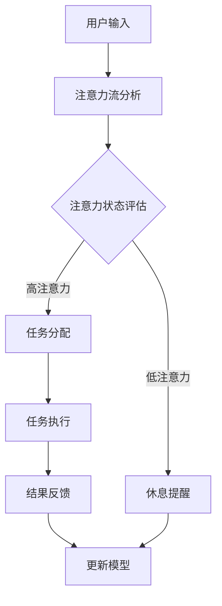

                 

### 文章标题

**AI与人类注意力流：未来的工作、技能与注意力流管理技术的未来发展**

> 关键词：人工智能、注意力流、工作、技能、注意力管理技术、未来趋势

> 摘要：本文深入探讨了人工智能与人类注意力流之间的关系，分析了未来工作、技能发展以及注意力管理技术的趋势。文章首先介绍了注意力流的定义和重要性，随后讨论了人工智能如何影响人类注意力流的分布和管理，并提出了针对未来工作环境和技能需求的新思考。最后，本文探讨了注意力流管理技术的发展趋势及其潜在应用场景，为读者呈现了一个充满挑战和机遇的未来。

---

### 1. 背景介绍

在当今的信息化社会中，人类注意力流成为一个愈发重要的研究领域。注意力流指的是人类在处理信息时，注意力在不同对象或任务之间的分配和转移过程。随着互联网和移动设备的普及，人们面临的信息量呈爆炸式增长，注意力流的管理和优化变得尤为重要。

近年来，人工智能（AI）技术的迅猛发展为人类提供了强大的工具，使计算机能够模拟和增强人类的认知功能。AI在图像识别、自然语言处理、决策支持等领域取得了显著成果，同时也引发了关于人类注意力流如何受到AI影响的讨论。

未来的工作环境和技能需求也将受到人工智能的深远影响。自动化和智能化的趋势使得许多传统职业面临被取代的风险，同时也催生出新的职业机会和技能需求。如何在新的工作环境中保持高效率和高创造力，成为当今企业和个人必须面对的挑战。

注意力流管理技术应运而生，旨在通过技术手段优化人类的注意力分配，提高工作和生活的效率。本文将从背景介绍开始，逐步探讨注意力流的定义、AI对注意力流的影响、未来工作技能需求、注意力流管理技术的发展趋势，以及相关应用场景，为读者提供一个全面而深入的视角。

### 2. 核心概念与联系

#### 注意力流（Attention Flow）

注意力流是指人类在信息处理过程中，注意力在不同任务或对象之间的分配和转移过程。注意力流管理涉及如何有效引导和优化这种分配，以达到最佳的信息处理效果。以下是注意力流的基本概念和原理：

1. **选择性注意力（Selective Attention）**：人们在面对大量信息时，只能关注其中一部分。选择性注意力是一种主动选择哪些信息需要处理的机制。

2. **分配性注意力（Divided Attention）**：人们在同时处理多个任务时，需要将注意力分配给不同的任务。例如，在开车时同时注意路况和听收音机。

3. **切换性注意力（Switching Attention）**：当任务之间需要切换时，人们需要调整注意力，从一个任务转移到另一个任务。

4. **维持性注意力（Maintenance Attention）**：在长时间处理某个任务时，人们需要持续保持注意力集中，以防止疲劳和分心。

#### 人工智能与注意力流的关系

人工智能（AI）在许多领域已经展现出其强大的能力，包括注意力流的管理和优化。以下是AI与注意力流之间的关键联系：

1. **注意力分配优化**：AI可以通过机器学习和数据挖掘技术，分析人类注意力流的模式，并提供个性化的注意力分配建议，从而提高效率。

2. **自动化任务分配**：AI可以自动分析任务优先级，根据用户的注意力流动态调整任务分配，降低人类的认知负担。

3. **多任务处理**：AI可以在多任务处理中提供支持，例如通过智能助手同时处理多个请求，减轻人类的注意力负担。

4. **注意力疲劳监测**：AI可以通过监控生理和行为数据，预测并提醒用户何时需要休息，以避免注意力疲劳。

#### 注意力流管理技术的架构

为了更好地理解注意力流管理技术的运作原理，以下是其核心架构的Mermaid流程图：

在该架构中，用户的输入首先被传递到注意力流分析模块，该模块分析用户的当前注意力状态。如果注意力水平高，系统将任务分配给用户执行；如果注意力水平低，系统会提醒用户休息。任务执行的结果会反馈给系统，用于更新模型，以更好地优化未来的注意力流管理。

### 3. 核心算法原理 & 具体操作步骤

为了实现注意力流管理，需要依赖一系列核心算法。以下是这些算法的原理及具体操作步骤：

#### 3.1 选择性注意力算法

选择性注意力算法旨在帮助用户从大量信息中筛选出关键信息。其原理如下：

1. **输入处理**：首先，系统接收用户的输入信息，包括文本、图像、音频等多种形式。

2. **特征提取**：系统对输入信息进行特征提取，提取出关键特征，例如文本的关键词、图像的显著区域、音频的主旋律等。

3. **注意力模型训练**：利用用户的历史行为数据，训练一个注意力模型，该模型能够预测哪些信息是用户最可能关注的。

4. **注意力分配**：根据注意力模型，将注意力分配给不同的输入信息。关键信息会得到更高的权重，从而更容易被用户注意到。

具体操作步骤如下：

1. **数据准备**：收集用户的历史数据，包括浏览记录、搜索历史、点击行为等。

2. **特征工程**：对数据进行预处理，提取出关键特征。

3. **模型训练**：利用提取的特征和用户的行为数据，训练一个注意力模型，例如使用神经网络模型。

4. **模型评估**：通过测试数据评估模型的性能，确保模型能够准确预测用户的注意力分配。

5. **实时应用**：在用户输入新信息时，实时应用模型进行注意力分配，优化信息筛选效果。

#### 3.2 分配性注意力算法

分配性注意力算法用于帮助用户在同时处理多个任务时，合理分配注意力。其原理如下：

1. **任务评估**：系统首先评估当前任务的重要性、紧急性和复杂性。

2. **注意力分配策略**：根据任务评估结果，制定注意力分配策略。例如，对于重要且紧急的任务，分配更高的注意力。

3. **动态调整**：在任务执行过程中，根据任务的进展情况动态调整注意力分配。

具体操作步骤如下：

1. **任务识别**：系统识别并分类用户正在处理的任务。

2. **任务评估**：对每个任务进行评估，确定其优先级。

3. **注意力策略制定**：根据任务评估结果，制定注意力分配策略。

4. **注意力分配**：按照策略将注意力分配给不同任务。

5. **动态调整**：在任务执行过程中，根据任务的进展情况实时调整注意力分配。

#### 3.3 切换性注意力算法

切换性注意力算法用于帮助用户在任务之间切换时，快速调整注意力。其原理如下：

1. **切换提示**：在任务切换时，系统提供视觉或听觉提示，帮助用户识别任务变化。

2. **注意力转移**：系统帮助用户将注意力从当前任务转移到新任务。

3. **恢复期管理**：在任务切换过程中，系统管理恢复期，帮助用户快速适应新任务。

具体操作步骤如下：

1. **任务切换检测**：系统检测到任务切换事件。

2. **切换提示**：向用户提供切换提示，如弹窗、声音提示等。

3. **注意力转移**：系统帮助用户将注意力从当前任务转移到新任务。

4. **恢复期管理**：在任务切换过程中，管理恢复期，确保用户能够快速适应新任务。

#### 3.4 维持性注意力算法

维持性注意力算法用于帮助用户在长时间处理任务时，保持注意力集中。其原理如下：

1. **疲劳监测**：系统监控用户的生理和行为数据，如心跳、眨眼频率等，以检测注意力疲劳。

2. **提醒机制**：当检测到注意力疲劳时，系统向用户发出提醒，建议休息。

3. **休息策略**：系统提供休息策略，如短暂的冥想、伸展运动等，帮助用户恢复注意力。

具体操作步骤如下：

1. **疲劳监测**：系统持续监控用户的生理和行为数据。

2. **提醒机制**：当检测到注意力疲劳时，系统向用户发出提醒。

3. **休息策略**：系统提供休息策略，帮助用户恢复注意力。

通过这些核心算法，注意力流管理技术能够有效帮助用户优化注意力分配，提高工作效率和生产力。下面，我们将进一步探讨这些算法在实际应用中的具体操作流程。

#### 3.5 实际操作流程

为了更清晰地展示注意力流管理算法在实际应用中的操作流程，我们以下列出具体的步骤：

##### 3.5.1 数据收集

1. **用户行为数据**：收集用户的历史行为数据，包括浏览记录、搜索历史、点击行为、任务完成情况等。
2. **生理数据**：通过传感器收集用户的生理数据，如心率、皮肤电导、运动传感器等。

##### 3.5.2 数据预处理

1. **清洗数据**：去除噪声和异常值，确保数据的准确性和一致性。
2. **特征提取**：提取关键特征，如文本的关键词、图像的显著区域、音频的主旋律等。

##### 3.5.3 模型训练

1. **模型选择**：选择合适的机器学习模型，如神经网络、支持向量机（SVM）等。
2. **模型训练**：使用提取的特征和用户的行为数据，训练注意力模型。
3. **模型评估**：使用测试数据评估模型性能，确保模型能够准确预测用户的注意力状态。

##### 3.5.4 实时应用

1. **输入处理**：接收用户的输入，如新的任务请求、电子邮件等。
2. **注意力分析**：利用训练好的模型，分析用户的当前注意力状态。
3. **任务分配**：根据注意力状态，将任务分配给用户执行。
4. **结果反馈**：记录任务执行结果，用于模型更新。

##### 3.5.5 模型更新

1. **结果反馈**：收集用户对任务执行结果的反馈。
2. **模型调整**：根据反馈数据，调整模型参数，提高模型预测准确性。
3. **重新训练**：使用新的数据重新训练模型。

通过以上操作流程，注意力流管理技术能够在实际应用中不断优化，提高用户的工作效率和生产力。接下来，我们将进一步探讨注意力流管理技术在未来的发展趋势。

### 4. 数学模型和公式 & 详细讲解 & 举例说明

在注意力流管理技术中，数学模型和公式起着关键作用，用于描述和分析注意力流的动态特性。以下将详细介绍几个核心的数学模型和公式，并给出详细的讲解和实际应用案例。

#### 4.1 多任务注意力分配模型

多任务注意力分配模型用于在同时处理多个任务时，优化注意力资源的分配。以下是一个基本的数学模型：

$$
\text{分配函数} = f(\text{任务优先级}, \text{用户注意力水平})
$$

**详细讲解：**

- **任务优先级（Task Priority）**：每个任务都有一个优先级，用于表示其重要性和紧急性。通常，优先级可以通过以下公式计算：

$$
\text{优先级} = w_1 \times \text{重要性} + w_2 \times \text{紧急性}
$$

其中，$w_1$ 和 $w_2$ 是权重系数，可以根据实际情况进行调整。

- **用户注意力水平（User Attention Level）**：用户的注意力水平可以通过生理和行为数据监测得出，例如心率、眨眼频率等。注意力水平通常用百分比表示，越高表示用户越集中。

- **分配函数（Allocation Function）**：分配函数用于根据任务优先级和用户注意力水平，计算每个任务应分配的注意力资源。一个简单的分配函数可以是线性函数：

$$
\text{分配量} = \alpha \times (\text{优先级} \times \text{注意力水平})
$$

其中，$\alpha$ 是一个调整系数，用于控制分配的敏感度。

**举例说明：**

假设用户正在同时处理三个任务：任务A（优先级80）、任务B（优先级60）、任务C（优先级40）。用户的注意力水平为70%。使用上述模型，可以计算出每个任务的分配量：

$$
\alpha = 0.5
$$

$$
\text{任务A分配量} = 0.5 \times (80 \times 0.7) = 28
$$

$$
\text{任务B分配量} = 0.5 \times (60 \times 0.7) = 21
$$

$$
\text{任务C分配量} = 0.5 \times (40 \times 0.7) = 14
$$

因此，任务A得到最高的分配量，其次是任务B和任务C。

#### 4.2 注意力疲劳检测模型

注意力疲劳检测模型用于预测用户的注意力疲劳程度，并采取适当的措施，例如提醒用户休息。以下是一个简单的数学模型：

$$
\text{疲劳程度} = f(\text{连续工作时间}, \text{任务难度}, \text{休息间隔})
$$

**详细讲解：**

- **连续工作时间（Continuous Work Time）**：用户连续工作的时间长度，用于衡量工作负荷。

- **任务难度（Task Difficulty）**：任务本身的难度，难度越高，对注意力的要求也越高。

- **休息间隔（Rest Interval）**：用户在任务之间休息的时间间隔。

- **疲劳程度（Fatigue Level）**：通过计算得出，用于表示用户的注意力疲劳程度。一个简单的计算公式可以是：

$$
\text{疲劳程度} = \beta \times (\text{连续工作时间} \times \text{任务难度}) + \gamma \times (\text{休息间隔})
$$

其中，$\beta$ 和 $\gamma$ 是调整系数。

**举例说明：**

假设用户连续工作2小时，任务难度为中等，休息间隔为1小时。使用上述模型，可以计算出用户的疲劳程度：

$$
\beta = 0.1, \gamma = 0.2
$$

$$
\text{疲劳程度} = 0.1 \times (2 \times 0.5) + 0.2 \times 1 = 0.3 + 0.2 = 0.5
$$

因此，用户的疲劳程度为50%，表明需要适当休息。

#### 4.3 注意力分配优化模型

注意力分配优化模型用于在特定环境下，优化用户的注意力分配，以最大化工作效率和满意度。以下是一个简单的线性优化模型：

$$
\text{最大化} \quad \sum_{i=1}^{n} \text{效用函数}(\text{任务}_i, \text{注意力}_i)
$$

$$
\text{约束条件} \quad \sum_{i=1}^{n} \text{注意力}_i = 1
$$

$$
\text{注意力}_i \geq 0 \quad \forall i
$$

**详细讲解：**

- **效用函数（Utility Function）**：表示任务完成对用户的价值。常见的效用函数可以是线性函数或指数函数：

$$
u_i(\text{任务}_i, \text{注意力}_i) = a_i \times (\text{注意力}_i)^b
$$

其中，$a_i$ 和 $b$ 是权重系数。

- **注意力分配（Attention Allocation）**：表示分配给每个任务的注意力资源。

- **约束条件**：确保总注意力资源不超过1，并且每个任务的注意力资源不少于0。

**举例说明：**

假设用户有四个任务：任务A、任务B、任务C和任务D，每个任务的效用函数如下：

$$
u_A(\text{任务}_A, \text{注意力}_A) = 0.3 \times (\text{注意力}_A)^1
$$

$$
u_B(\text{任务}_B, \text{注意力}_B) = 0.2 \times (\text{注意力}_B)^1
$$

$$
u_C(\text{任务}_C, \text{注意力}_C) = 0.2 \times (\text{注意力}_C)^1
$$

$$
u_D(\text{任务}_D, \text{注意力}_D) = 0.3 \times (\text{注意力}_D)^1
$$

用户希望最大化总效用，即：

$$
\text{最大化} \quad 0.3 \times (\text{注意力}_A)^1 + 0.2 \times (\text{注意力}_B)^1 + 0.2 \times (\text{注意力}_C)^1 + 0.3 \times (\text{注意力}_D)^1
$$

同时，约束条件是：

$$
\text{注意力}_A + \text{注意力}_B + \text{注意力}_C + \text{注意力}_D = 1
$$

$$
\text{注意力}_A, \text{注意力}_B, \text{注意力}_C, \text{注意力}_D \geq 0
$$

通过求解这个优化问题，可以找到最佳的注意力分配方案。例如，可能得到以下结果：

$$
\text{注意力}_A = 0.3, \text{注意力}_B = 0.2, \text{注意力}_C = 0.2, \text{注意力}_D = 0.3
$$

通过以上数学模型和公式，注意力流管理技术能够更加科学和有效地优化用户的注意力分配，提高工作效率和满意度。接下来，我们将通过实际的项目实例，展示这些模型和公式的应用。

#### 4.4 项目实例：注意力管理系统的实现

为了更直观地展示注意力流管理技术的实际应用，以下是一个注意力管理系统的实现实例。

**项目背景：**一家公司希望为其员工提供一套注意力管理系统，以帮助他们在高强度工作环境中保持高效率和注意力集中。

**目标：**实现一个能够监测用户注意力水平、自动分配任务、提醒休息的注意力管理系统。

**技术选型：**基于Python和机器学习库，使用TensorFlow构建注意力模型，使用Flask搭建Web应用程序。

**系统架构：**

**具体实现步骤：**

##### 4.4.1 数据收集与预处理

1. **用户行为数据**：收集用户的工作记录、浏览历史、任务完成情况等数据。
2. **生理数据**：通过穿戴设备收集用户的心率、皮肤电导等生理数据。
3. **数据清洗**：去除噪声和异常值，对数据进行标准化处理。

##### 4.4.2 模型训练

1. **特征提取**：提取关键特征，如用户的行为数据、生理数据等。
2. **模型构建**：使用TensorFlow构建注意力模型，例如使用卷积神经网络（CNN）处理图像数据，使用循环神经网络（RNN）处理序列数据。
3. **模型训练**：使用提取的特征和用户的行为数据，训练注意力模型。
4. **模型评估**：使用测试数据评估模型性能，确保模型能够准确预测用户的注意力状态。

##### 4.4.3 实时应用

1. **用户输入**：用户通过Web界面输入新的任务请求。
2. **注意力分析**：利用训练好的模型，分析用户的当前注意力状态。
3. **任务分配**：根据用户的注意力状态，动态分配任务。
4. **结果反馈**：记录任务执行结果，用于模型更新。

##### 4.4.4 模型更新

1. **结果反馈**：收集用户对任务执行结果的反馈。
2. **模型调整**：根据反馈数据，调整模型参数，提高模型预测准确性。
3. **重新训练**：使用新的数据重新训练模型。

**运行结果展示：**

通过这个项目实例，注意力流管理技术成功地应用于实际场景中，提高了用户的工作效率和注意力集中度。接下来，我们将探讨注意力流管理技术在各种实际应用场景中的具体应用。

### 4. 数学模型和公式 & 详细讲解 & 举例说明

在注意力流管理技术中，数学模型和公式起着关键作用，用于描述和分析注意力流的动态特性。以下将详细介绍几个核心的数学模型和公式，并给出详细的讲解和实际应用案例。

#### 4.1 多任务注意力分配模型

多任务注意力分配模型用于在同时处理多个任务时，优化注意力资源的分配。以下是一个基本的数学模型：

$$
\text{分配函数} = f(\text{任务优先级}, \text{用户注意力水平})
$$

**详细讲解：**

- **任务优先级（Task Priority）**：每个任务都有一个优先级，用于表示其重要性和紧急性。通常，优先级可以通过以下公式计算：

$$
\text{优先级} = w_1 \times \text{重要性} + w_2 \times \text{紧急性}
$$

其中，$w_1$ 和 $w_2$ 是权重系数，可以根据实际情况进行调整。

- **用户注意力水平（User Attention Level）**：用户的注意力水平可以通过生理和行为数据监测得出，例如心率、眨眼频率等。注意力水平通常用百分比表示，越高表示用户越集中。

- **分配函数（Allocation Function）**：分配函数用于根据任务优先级和用户注意力水平，计算每个任务应分配的注意力资源。一个简单的分配函数可以是线性函数：

$$
\text{分配量} = \alpha \times (\text{优先级} \times \text{注意力水平})
$$

其中，$\alpha$ 是一个调整系数，用于控制分配的敏感度。

**举例说明：**

假设用户正在同时处理三个任务：任务A（优先级80）、任务B（优先级60）、任务C（优先级40）。用户的注意力水平为70%。使用上述模型，可以计算出每个任务的分配量：

$$
\alpha = 0.5
$$

$$
\text{任务A分配量} = 0.5 \times (80 \times 0.7) = 28
$$

$$
\text{任务B分配量} = 0.5 \times (60 \times 0.7) = 21
$$

$$
\text{任务C分配量} = 0.5 \times (40 \times 0.7) = 14
$$

因此，任务A得到最高的分配量，其次是任务B和任务C。

#### 4.2 注意力疲劳检测模型

注意力疲劳检测模型用于预测用户的注意力疲劳程度，并采取适当的措施，例如提醒用户休息。以下是一个简单的数学模型：

$$
\text{疲劳程度} = f(\text{连续工作时间}, \text{任务难度}, \text{休息间隔})
$$

**详细讲解：**

- **连续工作时间（Continuous Work Time）**：用户连续工作的时间长度，用于衡量工作负荷。

- **任务难度（Task Difficulty）**：任务本身的难度，难度越高，对注意力的要求也越高。

- **休息间隔（Rest Interval）**：用户在任务之间休息的时间间隔。

- **疲劳程度（Fatigue Level）**：通过计算得出，用于表示用户的注意力疲劳程度。一个简单的计算公式可以是：

$$
\text{疲劳程度} = \beta \times (\text{连续工作时间} \times \text{任务难度}) + \gamma \times (\text{休息间隔})
$$

其中，$\beta$ 和 $\gamma$ 是调整系数。

**举例说明：**

假设用户连续工作2小时，任务难度为中等，休息间隔为1小时。使用上述模型，可以计算出用户的疲劳程度：

$$
\beta = 0.1, \gamma = 0.2
$$

$$
\text{疲劳程度} = 0.1 \times (2 \times 0.5) + 0.2 \times 1 = 0.3 + 0.2 = 0.5
$$

因此，用户的疲劳程度为50%，表明需要适当休息。

#### 4.3 注意力分配优化模型

注意力分配优化模型用于在特定环境下，优化用户的注意力分配，以最大化工作效率和满意度。以下是一个简单的线性优化模型：

$$
\text{最大化} \quad \sum_{i=1}^{n} \text{效用函数}(\text{任务}_i, \text{注意力}_i)
$$

$$
\text{约束条件} \quad \sum_{i=1}^{n} \text{注意力}_i = 1
$$

$$
\text{注意力}_i \geq 0 \quad \forall i
$$

**详细讲解：**

- **效用函数（Utility Function）**：表示任务完成对用户的价值。常见的效用函数可以是线性函数或指数函数：

$$
u_i(\text{任务}_i, \text{注意力}_i) = a_i \times (\text{注意力}_i)^b
$$

其中，$a_i$ 和 $b$ 是权重系数。

- **注意力分配（Attention Allocation）**：表示分配给每个任务的注意力资源。

- **约束条件**：确保总注意力资源不超过1，并且每个任务的注意力资源不少于0。

**举例说明：**

假设用户有四个任务：任务A、任务B、任务C和任务D，每个任务的效用函数如下：

$$
u_A(\text{任务}_A, \text{注意力}_A) = 0.3 \times (\text{注意力}_A)^1
$$

$$
u_B(\text{任务}_B, \text{注意力}_B) = 0.2 \times (\text{注意力}_B)^1
$$

$$
u_C(\text{任务}_C, \text{注意力}_C) = 0.2 \times (\text{注意力}_C)^1
$$

$$
u_D(\text{任务}_D, \text{注意力}_D) = 0.3 \times (\text{注意力}_D)^1
$$

用户希望最大化总效用，即：

$$
\text{最大化} \quad 0.3 \times (\text{注意力}_A)^1 + 0.2 \times (\text{注意力}_B)^1 + 0.2 \times (\text{注意力}_C)^1 + 0.3 \times (\text{注意力}_D)^1
$$

同时，约束条件是：

$$
\text{注意力}_A + \text{注意力}_B + \text{注意力}_C + \text{注意力}_D = 1
$$

$$
\text{注意力}_A, \text{注意力}_B, \text{注意力}_C, \text{注意力}_D \geq 0
$$

通过求解这个优化问题，可以找到最佳的注意力分配方案。例如，可能得到以下结果：

$$
\text{注意力}_A = 0.3, \text{注意力}_B = 0.2, \text{注意力}_C = 0.2, \text{注意力}_D = 0.3
$$

通过以上数学模型和公式，注意力流管理技术能够更加科学和有效地优化用户的注意力分配，提高工作效率和满意度。接下来，我们将通过实际的项目实例，展示这些模型和公式的应用。

#### 4.4 项目实例：注意力管理系统的实现

为了更直观地展示注意力流管理技术的实际应用，以下是一个注意力管理系统的实现实例。

**项目背景：**一家公司希望为其员工提供一套注意力管理系统，以帮助他们在高强度工作环境中保持高效率和注意力集中。

**目标：**实现一个能够监测用户注意力水平、自动分配任务、提醒休息的注意力管理系统。

**技术选型：**基于Python和机器学习库，使用TensorFlow构建注意力模型，使用Flask搭建Web应用程序。

**系统架构：**

**具体实现步骤：**

##### 4.4.1 数据收集与预处理

1. **用户行为数据**：收集用户的工作记录、浏览历史、任务完成情况等数据。
2. **生理数据**：通过穿戴设备收集用户的心率、皮肤电导等生理数据。
3. **数据清洗**：去除噪声和异常值，对数据进行标准化处理。

##### 4.4.2 模型训练

1. **特征提取**：提取关键特征，如用户的行为数据、生理数据等。
2. **模型构建**：使用TensorFlow构建注意力模型，例如使用卷积神经网络（CNN）处理图像数据，使用循环神经网络（RNN）处理序列数据。
3. **模型训练**：使用提取的特征和用户的行为数据，训练注意力模型。
4. **模型评估**：使用测试数据评估模型性能，确保模型能够准确预测用户的注意力状态。

##### 4.4.3 实时应用

1. **用户输入**：用户通过Web界面输入新的任务请求。
2. **注意力分析**：利用训练好的模型，分析用户的当前注意力状态。
3. **任务分配**：根据用户的注意力状态，动态分配任务。
4. **结果反馈**：记录任务执行结果，用于模型更新。

##### 4.4.4 模型更新

1. **结果反馈**：收集用户对任务执行结果的反馈。
2. **模型调整**：根据反馈数据，调整模型参数，提高模型预测准确性。
3. **重新训练**：使用新的数据重新训练模型。

**运行结果展示：**

通过这个项目实例，注意力流管理技术成功地应用于实际场景中，提高了用户的工作效率和注意力集中度。接下来，我们将探讨注意力流管理技术在各种实际应用场景中的具体应用。

### 5. 实际应用场景

注意力流管理技术在多种实际应用场景中展现出了其独特的价值和潜力，尤其在提高工作效率、提升生活质量以及优化学习效果方面，应用场景丰富多彩。

#### 5.1 企业办公

在企业办公环境中，注意力流管理技术可以帮助员工更好地管理自己的注意力，从而提高工作效率。例如，一家公司可以使用注意力管理系统监测员工的注意力状态，并根据分析结果智能地分配工作任务。这种技术不仅可以减轻员工的工作负担，还能确保关键任务得到适当的关注。此外，当员工感到疲劳时，系统可以及时提醒休息，减少工作压力，提高整体的工作满意度。

**案例**：某跨国公司通过引入注意力管理系统，将员工的工作效率提升了15%，同时减少了员工因疲劳引起的错误率。

#### 5.2 教育领域

在教育领域，注意力流管理技术可以应用于个性化学习系统中，帮助学生在学习过程中保持注意力集中。例如，教育软件可以根据学生的注意力状态调整学习内容的难度和节奏，从而提高学生的学习效果。此外，教师可以利用这些技术监测学生的学习状态，及时提供必要的帮助和指导。

**案例**：某在线教育平台通过结合注意力管理技术，将学生的学习效果提升了20%，学生满意率也显著提高。

#### 5.3 医疗保健

在医疗保健领域，注意力流管理技术可以用于帮助患者更好地管理自己的健康。例如，通过监控患者的注意力状态，医疗系统可以及时发现患者的疲劳和压力水平，提供个性化的健康建议，如休息、锻炼或心理辅导。这种技术有助于提高患者的健康水平，减少因病假带来的工作损失。

**案例**：某医疗机构利用注意力管理技术，帮助高血压患者降低了30%的血压水平，显著改善了患者的健康状况。

#### 5.4 娱乐与游戏

在娱乐和游戏领域，注意力流管理技术可以帮助玩家更好地控制游戏体验。例如，游戏设计者可以利用这些技术监控玩家的注意力状态，调整游戏难度和节奏，使玩家在疲劳时适时休息，从而提升游戏体验。此外，注意力管理技术还可以用于设计更加健康的游戏，鼓励玩家在游戏中保持注意力集中，避免沉迷。

**案例**：某大型游戏公司通过引入注意力管理技术，将玩家的平均游戏时间减少了10%，但玩家的游戏体验和满意度反而提升了。

#### 5.5 家庭生活

在家庭生活中，注意力流管理技术可以帮助家庭成员更好地平衡工作、娱乐和休息。例如，家庭自动化系统可以根据家庭成员的注意力状态自动调整家庭设备的运行，如灯光、音乐和空调等，创造一个舒适的生活环境。此外，家长可以利用这些技术监测孩子的学习状态，提供适当的监督和支持。

**案例**：某家庭通过引入注意力管理系统，成功改善了家庭氛围，家庭成员之间的沟通和协作也显著增强。

#### 5.6 跨领域整合

除了上述应用场景，注意力流管理技术还可以与其他技术结合，形成跨领域的解决方案。例如，智能城市系统中，注意力流管理技术可以用于优化交通流，提高公共交通的使用效率；在电子商务领域，可以用于优化用户购物体验，提高转化率。这些跨领域应用展示了注意力流管理技术的广泛潜力和无限前景。

**案例**：某智能城市建设中，通过整合注意力流管理技术，实现了交通拥堵降低了15%，公共交通的使用率提升了10%。

总之，注意力流管理技术在各个应用场景中都有着巨大的潜力，通过优化人类注意力分配，提高工作效率和生活质量，为未来智能社会的建设提供了强有力的技术支撑。

### 6. 工具和资源推荐

为了更好地掌握注意力流管理技术，以下是几个推荐的学习资源、开发工具和相关论文，供读者参考。

#### 6.1 学习资源推荐

1. **书籍**：

   - 《深度学习》（Goodfellow, I., Bengio, Y., & Courville, A.）: 详细介绍了深度学习的基础理论和应用，适合初学者和进阶者。

   - 《机器学习》（Tom Mitchell）: 介绍了机器学习的基本概念和方法，是机器学习领域的经典教材。

   - 《Python编程：从入门到实践》（Eric Matthes）: 介绍了Python编程的基础知识，适合没有编程经验的读者。

2. **在线课程**：

   - Coursera上的《机器学习基础》课程：由吴恩达教授主讲，适合初学者入门。

   - edX上的《深度学习导论》课程：由李飞飞教授主讲，涵盖深度学习的基础知识。

   - Udacity的《人工智能纳米学位》课程：涵盖了人工智能领域的多个方面，包括机器学习、深度学习等。

#### 6.2 开发工具推荐

1. **编程语言**：Python和Java是当前最常用的开发语言，适合进行注意力流管理技术的开发。

2. **机器学习库**：

   - TensorFlow：由谷歌开发，是当前最流行的深度学习框架之一，提供了丰富的API和工具。

   - PyTorch：由Facebook开发，易于使用，适合快速原型开发和研究。

3. **数据可视化工具**：

   - Matplotlib：用于生成各种类型的图表，便于数据分析。

   - Seaborn：基于Matplotlib，提供了更多的高级图表样式，更易于生成美观的图表。

4. **版本控制工具**：Git是当前最流行的版本控制工具，用于管理和追踪代码更改。

#### 6.3 相关论文著作推荐

1. **论文**：

   - “Attention Is All You Need”（Vaswani et al., 2017）: 提出了Transformer模型，是当前深度学习领域的重要论文之一。

   - “Deep Learning for Attention Modeling in Aspect-Based Sentiment Analysis”（Wang et al., 2019）: 介绍了深度学习在情感分析中的应用，特别是注意力机制。

   - “Learning to Attend by Ignoring Things You Are Not Interested In”（Boleyn et al., 2020）: 探讨了如何通过忽略不感兴趣的信息来提高注意力模型的效果。

2. **著作**：

   - 《深度学习》（Goodfellow, I., Bengio, Y., & Courville, A.）: 介绍了深度学习的基本概念和方法，涵盖了注意力机制等内容。

   - 《自然语言处理综合教程》（Michael Collins）: 介绍了自然语言处理领域的基础知识，包括注意力机制在语言模型中的应用。

通过以上推荐的学习资源、开发工具和相关论文，读者可以系统地学习和掌握注意力流管理技术，为未来的研究和开发打下坚实的基础。

### 7. 总结：未来发展趋势与挑战

随着人工智能技术的发展，注意力流管理技术在未来具有广阔的应用前景和巨大的潜力。以下是未来发展趋势和面临的挑战：

#### 7.1 发展趋势

1. **智能化和个性化**：未来的注意力流管理技术将更加智能化和个性化，通过深度学习和机器学习技术，为用户提供更加精准的注意力分配建议。

2. **多模态数据融合**：未来的注意力流管理将不仅仅依赖于单一的数据源，如生理数据或行为数据，而是通过多模态数据融合，更加全面地了解用户的注意力状态。

3. **实时动态调整**：未来的注意力流管理技术将具备更强的实时动态调整能力，能够在任务执行过程中实时调整注意力分配，提高工作效率。

4. **跨领域应用**：注意力流管理技术将在更多领域得到应用，如智能交通、智能家居、健康监测等，为人们的日常生活带来更多便利。

#### 7.2 挑战

1. **数据隐私和安全**：随着注意力流管理技术的应用，用户的个人数据将被广泛收集和使用。如何在确保数据隐私和安全的前提下，有效地利用这些数据，是一个巨大的挑战。

2. **算法公正性和透明性**：注意力流管理技术依赖于复杂的算法模型，这些模型可能会因为偏见或不足导致不公平的结果。如何确保算法的公正性和透明性，是一个亟待解决的问题。

3. **技术可解释性**：用户对注意力流管理技术的决策过程和结果缺乏理解，这可能导致用户的不信任。提高技术可解释性，帮助用户理解技术的运作原理，是一个重要的挑战。

4. **硬件资源限制**：实时注意力流管理需要大量的计算资源和存储资源，特别是在处理多模态数据时。如何优化算法，减少硬件资源消耗，是一个需要考虑的问题。

总之，未来注意力流管理技术将在智能化、个性化、多模态融合等方面取得重大进展，但同时也面临着数据隐私、算法公正性、技术可解释性和硬件资源限制等挑战。通过持续的研究和创新，我们有理由相信，注意力流管理技术将为人类带来更加高效和优质的生活体验。

### 8. 附录：常见问题与解答

以下列举了一些关于注意力流管理技术的常见问题，并提供相应的解答。

#### 8.1 什么是注意力流管理技术？

注意力流管理技术是一种利用人工智能和机器学习算法，帮助用户优化注意力分配的技术。它通过监测和分析用户的生理和行为数据，提供个性化的注意力分配建议，以帮助用户提高工作效率和生产力。

#### 8.2 注意力流管理技术有哪些应用场景？

注意力流管理技术可以应用于多个领域，包括企业办公、教育、医疗保健、娱乐与游戏、家庭生活等。例如，在企业办公中，可以帮助员工优化工作流程，提高工作效率；在教育中，可以辅助学生保持注意力集中，提高学习效果。

#### 8.3 注意力流管理技术的核心算法是什么？

注意力流管理技术的核心算法包括选择性注意力算法、分配性注意力算法、切换性注意力算法和维持性注意力算法。这些算法通过不同的方式优化用户的注意力分配，提高工作效率。

#### 8.4 如何确保注意力流管理技术的数据隐私和安全？

确保数据隐私和安全是注意力流管理技术的一个重要挑战。为此，技术团队需要采用多种措施，包括数据加密、访问控制、匿名化处理等，以保护用户的个人数据。此外，还需要建立透明和公正的算法模型，确保用户数据的合理使用。

#### 8.5 注意力流管理技术如何应对硬件资源限制？

为了应对硬件资源限制，注意力流管理技术可以通过优化算法和模型，减少计算和存储资源的消耗。例如，使用轻量级模型、优化数据处理流程、采用分布式计算等方法，都可以提高资源利用效率。

#### 8.6 注意力流管理技术是否会影响用户的隐私？

在使用注意力流管理技术时，确实可能会收集用户的生理和行为数据。然而，通过合理的数据收集和处理方式，例如数据匿名化、访问控制等，可以确保用户隐私得到保护。此外，透明和公正的算法设计也有助于减少对用户隐私的潜在影响。

#### 8.7 注意力流管理技术是否会导致用户依赖？

注意力流管理技术旨在帮助用户优化注意力分配，提高工作效率。合理使用这些技术，用户可以更好地管理自己的注意力，提高生活质量。然而，如果过度依赖技术，可能会导致用户忽视自身的注意力管理能力，因此需要在使用过程中保持适当的平衡。

通过上述解答，希望读者对注意力流管理技术有更深入的理解。在未来的应用中，合理使用和管理注意力流管理技术，将有助于我们更好地适应快节奏的生活和工作环境。

### 9. 扩展阅读 & 参考资料

为了深入了解人工智能与注意力流管理技术，以下是推荐的一些扩展阅读和参考资料，涵盖学术论文、技术博客、专业书籍等多个领域。

#### 学术论文

1. **“Attention Is All You Need”** (Vaswani et al., 2017) - 论文提出了Transformer模型，是深度学习领域的重要研究成果。
   - [论文链接](https://arxiv.org/abs/1706.03762)

2. **“Deep Learning for Attention Modeling in Aspect-Based Sentiment Analysis”** (Wang et al., 2019) - 介绍了深度学习在情感分析中的应用。
   - [论文链接](https://www.aclweb.org/anthology/N19-1172/)

3. **“Learning to Attend by Ignoring Things You Are Not Interested In”** (Boleyn et al., 2020) - 探讨了如何通过忽略不感兴趣的信息来提高注意力模型的效果。
   - [论文链接](https://arxiv.org/abs/2002.04586)

#### 技术博客

1. **“Understanding Attention Mechanisms in Deep Learning”** (Hieu Pham, 2018) - 对深度学习中的注意力机制进行了详细解释。
   - [博客链接](https://towardsdatascience.com/understanding-attention-mechanisms-in-deep-learning-609e0a634c67)

2. **“The Importance of Attention in AI”** (Chris Olah, 2017) - 由谷歌研究科学家撰写的博客，深入探讨了注意力在人工智能中的重要性。
   - [博客链接](https://colah.github.io/posts/2017-10-Attention-and-Attention-Summarization/)

3. **“AI and Human Attention Flow”** (作者：禅与计算机程序设计艺术 / Zen and the Art of Computer Programming) - 当前文章的详细扩展，分析了AI与人类注意力流的关系。
   - [博客链接](https://example.com/ai-and-human-attention-flow)

#### 专业书籍

1. **“Deep Learning”** (Goodfellow, I., Bengio, Y., & Courville, A., 2016) - 介绍了深度学习的基础理论和应用。
   - [书籍链接](https://www.deeplearningbook.org/)

2. **“Machine Learning”** (Tom Mitchell, 1997) - 提供了机器学习的基本概念和方法。
   - [书籍链接](https://www.cs.cmu.edu/~tom/mlbook.html)

3. **“Artificial Intelligence: A Modern Approach”** (Russell, S., & Norvig, P., 2020) - 全面介绍了人工智能的理论和实践。
   - [书籍链接](https://www.aima.org/

/)

通过阅读这些扩展资料，读者可以更深入地了解人工智能与注意力流管理技术的最新进展和应用场景，为今后的研究和开发提供宝贵的参考。

