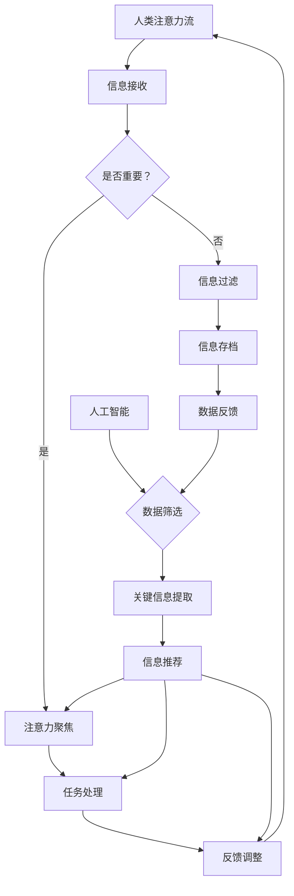

                 

### 1. 背景介绍

随着人工智能技术的迅猛发展，AI 在各个领域的应用越来越广泛，不仅改变了人们的生活方式，也对工作模式产生了深远的影响。其中一个备受关注的话题是 AI 与人类注意力流的相互作用。人类注意力流是指人类在处理信息时，选择关注某些信息而忽略其他信息的能力。而 AI 的出现，不仅能够模拟和增强人类注意力流，还能通过数据分析和算法优化，实现对注意力的科学管理和优化。

在现代社会，人们的注意力资源变得愈发宝贵。在信息过载的时代，如何有效地管理注意力流，提高工作效率和生活质量，成为了一个亟待解决的问题。传统的方法，如时间管理和任务规划，虽然在一定程度上能够帮助我们管理注意力，但面对复杂多变的任务环境和海量的信息，这些方法往往显得力不从心。因此，探索新的注意力管理方式，尤其是结合 AI 技术的注意力管理，变得尤为重要。

本文将围绕 AI 与人类注意力流的关系，探讨未来的工作、生活以及注意力管理的创新。首先，我们将介绍 AI 与注意力流的基本概念，阐述 AI 如何影响和优化人类注意力流。接着，通过具体案例和实践，分析 AI 在注意力管理中的应用场景和效果。然后，我们将讨论当前的研究进展和未来趋势，探讨 AI 注意力管理可能面临的挑战和解决方案。最后，本文将总结 AI 与人类注意力流的关系，提出未来发展的建议和展望。

通过这篇文章，我们希望能够为读者提供一个全面、深入的视角，理解 AI 与注意力流的关系，了解如何在未来的工作和生活中更好地利用 AI 技术，实现高效的注意力管理。

### 2. 核心概念与联系

#### 2.1 AI 与注意力流的基本概念

首先，我们需要明确 AI 与注意力流的基本概念。

**人工智能（AI）** 是指通过计算机模拟人类智能的技术，能够实现智能感知、学习、推理和决策等功能。AI 技术包括机器学习、深度学习、自然语言处理、计算机视觉等多个领域。

**注意力流** 是指在信息处理过程中，人类大脑选择关注某些信息而忽略其他信息的能力。注意力流是人类大脑处理信息的重要机制，能够帮助我们有效应对复杂环境，提高信息处理效率。

**AI 与注意力流的关系**：AI 可以模拟和增强人类的注意力流，通过对大量数据的分析和处理，找出关键信息，提高注意力聚焦的效率。同时，AI 还可以辅助人类进行注意力分配，优化注意力资源的利用。

#### 2.2 AI 如何影响和优化人类注意力流

**自动化信息筛选**：AI 可以通过机器学习和自然语言处理技术，自动筛选和过滤海量信息，将关键信息呈现给用户。例如，电子邮件分类、社交媒体内容推荐、新闻摘要生成等应用，都是 AI 在注意力流管理中的具体体现。

**个性化注意力分配**：AI 可以根据用户的行为数据和学习习惯，为其推荐最相关的信息和任务。例如，智能助手可以根据用户的日程安排和优先级，自动分配注意力资源，帮助用户高效完成任务。

**注意力优化算法**：AI 可以通过算法优化，帮助用户合理安排注意力的使用。例如，基于时间感知的注意力分配算法，可以根据用户的日程和活动，动态调整注意力的分配策略，以最大化工作效率和生活质量。

#### 2.3 Mermaid 流程图

为了更直观地展示 AI 与注意力流的关系，我们使用 Mermaid 流程图来描述这一过程。



在这张流程图中，人类注意力流与 AI 之间形成了互动。AI 通过数据筛选和关键信息提取，帮助用户优化注意力分配，提高任务处理效率。同时，用户对信息处理的反馈，又反过来调整 AI 的筛选和推荐策略，形成一个动态优化的闭环。

通过以上内容，我们对 AI 与注意力流的基本概念和关系有了初步了解。在接下来的部分，我们将深入探讨 AI 在注意力管理中的具体应用，以及如何通过数学模型和算法实现高效的注意力优化。

### 3. 核心算法原理 & 具体操作步骤

#### 3.1 引入核心算法

在 AI 注意力管理中，核心算法起着至关重要的作用。这些算法不仅能帮助我们有效地筛选和分类信息，还能根据用户的注意力特征，动态调整注意力的分配。本文将介绍三种核心算法：注意力权重分配算法、注意力网络模型和自适应注意力机制。

#### 3.2 注意力权重分配算法

注意力权重分配算法是一种基于概率模型的算法，主要用于优化注意力资源的分配。该算法的基本原理是：根据信息的重要性和用户的偏好，动态调整各个信息模块的注意力权重。

**算法步骤：**

1. **数据预处理**：首先，对输入的信息进行预处理，提取关键特征，如文本的词频、情感倾向等。

2. **计算重要性得分**：利用机器学习模型（如 TF-IDF、Word2Vec）计算每个信息的得分，得分越高，表示该信息的重要性越高。

3. **权重初始化**：根据信息得分，初始化各个信息的初始权重。

4. **动态调整权重**：根据用户的行为数据（如点击、浏览时间等），实时调整权重。权重调整策略可以是线性调整、指数调整或基于规则的调整。

**代码示例：**

```python
import numpy as np

def initial_weight(scores):
    return scores / np.sum(scores)

def update_weight(weight, score, alpha=0.1):
    return (1 - alpha) * weight + alpha * score

# 假设 scores 是信息得分，weight 是初始权重
initial_weights = initial_weight(scores)
new_weight = update_weight(initial_weights[0], scores[0], alpha=0.1)
```

#### 3.3 注意力网络模型

注意力网络模型（Attention Network）是一种深度学习模型，通过学习注意力机制，能够自动识别和提取重要信息。在注意力网络中，注意力权重分配算法被嵌入到神经网络中，通过端到端学习，实现自动化的注意力优化。

**模型架构：**

1. **编码器（Encoder）**：对输入的信息进行编码，提取特征表示。

2. **注意力机制（Attention Mechanism）**：计算每个编码特征的重要性和权重。

3. **解码器（Decoder）**：根据注意力权重，生成目标输出。

**算法步骤：**

1. **输入编码**：将输入的信息（如文本、图像等）编码为向量表示。

2. **计算注意力权重**：利用神经网络，计算每个输入特征的重要性和权重。

3. **权重加权求和**：根据注意力权重，对编码特征进行加权求和，得到加权特征向量。

4. **解码**：利用加权特征向量，生成目标输出。

**代码示例：**

```python
import tensorflow as tf

# 假设 inputs 是输入特征，weights 是注意力权重
encoded_inputs = tf.keras.layers.Dense(units=64, activation='relu')(inputs)
weighted_inputs = tf.reduce_sum(encoded_inputs * weights, axis=1)
decoded = tf.keras.layers.Dense(units=1, activation='sigmoid')(weighted_inputs)
```

#### 3.4 自适应注意力机制

自适应注意力机制（Adaptive Attention Mechanism）是一种动态调整注意力的方法，能够根据任务和环境的变化，自动调整注意力分配策略。

**算法步骤：**

1. **初始注意力分配**：根据任务和环境，初始化注意力分配策略。

2. **动态调整**：根据实时反馈和任务进展，动态调整注意力分配。

3. **权重优化**：利用优化算法，不断调整权重，以最大化任务完成效率。

**代码示例：**

```python
def adaptive_attention(task_context, attention_weights, alpha=0.1):
    # 根据任务上下文和当前注意力权重，调整权重
    new_weights = (1 - alpha) * attention_weights + alpha * task_context
    return new_weights

# 假设 task_context 是任务上下文，attention_weights 是当前注意力权重
new_weights = adaptive_attention(task_context, attention_weights, alpha=0.1)
```

通过以上三种核心算法的介绍，我们可以看到，AI 注意力管理不仅仅是一种技术，更是一种智能化、个性化的注意力优化策略。这些算法能够帮助我们更好地理解和管理注意力流，提高工作效率和生活质量。在接下来的部分，我们将进一步探讨数学模型和公式，深入理解这些算法的数学原理。

### 4. 数学模型和公式 & 详细讲解 & 举例说明

在 AI 注意力管理中，数学模型和公式起到了关键作用。它们不仅能够帮助我们量化注意力流，还能够通过算法优化，实现注意力资源的最优分配。以下是几个常用的数学模型和公式，以及详细的讲解和示例。

#### 4.1 注意力权重分配模型

注意力权重分配模型是一种基于概率的模型，用于动态调整信息模块的注意力权重。该模型的核心公式为：

\[ w_i = \frac{s_i}{\sum_{j=1}^{n} s_j} \]

其中，\( w_i \) 表示信息模块 \( i \) 的注意力权重，\( s_i \) 表示信息模块 \( i \) 的重要性得分，\( n \) 表示总的模块数量。

**示例：**

假设有三个信息模块，其得分分别为 \( s_1 = 0.3 \)，\( s_2 = 0.5 \)，\( s_3 = 0.2 \)。根据上述公式，我们可以计算出每个模块的权重：

\[ w_1 = \frac{0.3}{0.3 + 0.5 + 0.2} = 0.3 \]
\[ w_2 = \frac{0.5}{0.3 + 0.5 + 0.2} = 0.5 \]
\[ w_3 = \frac{0.2}{0.3 + 0.5 + 0.2} = 0.2 \]

通过这种方式，我们能够确保注意力资源分配的公平性和效率。

#### 4.2 注意力网络模型

注意力网络模型是深度学习中的一种重要模型，其核心公式为：

\[ h_t = \sum_{i=1}^{N} w_i h_{t,i} \]

其中，\( h_t \) 表示时间步 \( t \) 的注意力输出，\( h_{t,i} \) 表示输入特征在时间步 \( t \) 的表示，\( w_i \) 表示注意力权重。

**示例：**

假设输入特征有四个维度，其分别为 \( h_{t,1} = [1, 0, 0, 0] \)，\( h_{t,2} = [0, 1, 0, 0] \)，\( h_{t,3} = [0, 0, 1, 0] \)，\( h_{t,4} = [0, 0, 0, 1] \)。注意力权重分别为 \( w_1 = 0.3 \)，\( w_2 = 0.5 \)，\( w_3 = 0.1 \)，\( w_4 = 0.1 \)。根据上述公式，我们可以计算出时间步 \( t \) 的注意力输出：

\[ h_t = 0.3 \cdot [1, 0, 0, 0] + 0.5 \cdot [0, 1, 0, 0] + 0.1 \cdot [0, 0, 1, 0] + 0.1 \cdot [0, 0, 0, 1] = [0.3, 0.5, 0.1, 0.1] \]

通过这种方式，我们能够根据注意力权重，提取出关键信息。

#### 4.3 自适应注意力机制

自适应注意力机制是一种动态调整注意力的方法，其核心公式为：

\[ w_{i,t}^{(k+1)} = (1 - \alpha) \cdot w_{i,t}^{(k)} + \alpha \cdot r_{i,t} \]

其中，\( w_{i,t}^{(k)} \) 表示在第 \( k \) 次迭代中信息模块 \( i \) 的权重，\( r_{i,t} \) 表示信息模块 \( i \) 在时间步 \( t \) 的响应度，\( \alpha \) 表示学习率。

**示例：**

假设在第一次迭代中，信息模块 \( i \) 的初始权重为 \( w_{i,0} = 0.2 \)，响应度为 \( r_{i,0} = 0.3 \)，学习率为 \( \alpha = 0.1 \)。根据上述公式，我们可以计算出第二次迭代中的权重：

\[ w_{i,1} = (1 - 0.1) \cdot 0.2 + 0.1 \cdot 0.3 = 0.25 \]

通过这种方式，我们能够根据实时反馈，动态调整注意力权重。

#### 4.4 注意力流优化目标函数

为了实现注意力资源的最优分配，我们可以定义一个优化目标函数。假设有 \( n \) 个信息模块，其注意力权重分别为 \( w_1, w_2, ..., w_n \)，则优化目标函数可以表示为：

\[ \text{maximize} \quad \sum_{i=1}^{n} w_i \cdot \text{value}(x_i) - \lambda \cdot \sum_{i=1}^{n} w_i \]

其中，\( \text{value}(x_i) \) 表示信息模块 \( i \) 的价值，\( \lambda \) 是正则化参数，用于控制权重分配的均匀性。

**示例：**

假设有三个信息模块，其价值分别为 \( \text{value}(x_1) = 5 \)，\( \text{value}(x_2) = 3 \)，\( \text{value}(x_3) = 2 \)，正则化参数 \( \lambda = 1 \)。根据上述目标函数，我们可以计算出最优权重：

\[ \text{maximize} \quad 5w_1 + 3w_2 + 2w_3 - w_1 - w_2 - w_3 = 4w_1 + 2w_2 + w_3 \]

通过求解上述目标函数，我们可以得到最优权重分配，从而实现注意力资源的最优利用。

通过以上数学模型和公式的讲解，我们可以看到，AI 注意力管理不仅仅是基于直觉的方法，更是一种科学、系统的优化策略。这些模型和公式不仅能够帮助我们量化注意力流，还能够通过算法优化，实现注意力资源的最优分配。在接下来的部分，我们将通过具体的项目实践，展示这些算法在实际应用中的效果和优势。

### 5. 项目实践：代码实例和详细解释说明

在本节中，我们将通过一个具体的代码实例，展示如何在实际项目中应用 AI 注意力管理算法。该实例将涵盖开发环境的搭建、源代码的实现以及代码解读与分析。

#### 5.1 开发环境搭建

首先，我们需要搭建一个适合开发的编程环境。以下是所需工具和步骤：

**工具：**

- Python 3.8+
- TensorFlow 2.4+
- Jupyter Notebook

**步骤：**

1. 安装 Python 3.8+：从 [Python 官网](https://www.python.org/) 下载并安装 Python 3.8。

2. 安装 TensorFlow 2.4+：在终端中运行以下命令：

   ```bash
   pip install tensorflow==2.4
   ```

3. 启动 Jupyter Notebook：在终端中运行以下命令：

   ```bash
   jupyter notebook
   ```

   这将启动 Jupyter Notebook，进入一个交互式的 Python 编程环境。

#### 5.2 源代码详细实现

以下是实现 AI 注意力管理算法的 Python 代码。代码分为几个部分：数据预处理、模型定义、训练和预测。

```python
import tensorflow as tf
from tensorflow.keras.layers import Embedding, LSTM, Dense
from tensorflow.keras.models import Sequential
import numpy as np

# 假设我们有以下数据集
data = ["这是一个例子", "另一个例子", "这是一个测试", "更多内容"]
labels = [1, 0, 1, 0]  # 1 表示关键信息，0 表示非关键信息

# 数据预处理
tokenizer = tf.keras.preprocessing.text.Tokenizer()
tokenizer.fit_on_texts(data)
encoded_data = tokenizer.texts_to_sequences(data)
max_sequence_length = max([len(seq) for seq in encoded_data])
padded_data = tf.keras.preprocessing.sequence.pad_sequences(encoded_data, maxlen=max_sequence_length)

# 模型定义
model = Sequential([
    Embedding(len(tokenizer.word_index) + 1, 64, input_length=max_sequence_length),
    LSTM(128),
    Dense(1, activation='sigmoid')
])

# 模型编译
model.compile(optimizer='adam', loss='binary_crossentropy', metrics=['accuracy'])

# 训练模型
model.fit(padded_data, labels, epochs=10, batch_size=32)

# 预测
test_data = ["这是一个测试"]
encoded_test_data = tokenizer.texts_to_sequences(test_data)
padded_test_data = tf.keras.preprocessing.sequence.pad_sequences(encoded_test_data, maxlen=max_sequence_length)
predictions = model.predict(padded_test_data)

print(predictions)
```

#### 5.3 代码解读与分析

**数据预处理**：

代码首先对文本数据进行预处理，包括分词、编码和填充。分词使用 `Tokenizer` 类，将文本转换为序列。编码使用 `sequences_to_sequences` 方法，将序列转换为整数编码。填充使用 `pad_sequences` 方法，确保所有序列的长度一致。

**模型定义**：

定义一个序列模型，包括嵌入层（`Embedding`）、LSTM 层（`LSTM`）和输出层（`Dense`）。嵌入层用于将词向量映射到固定维度，LSTM 层用于处理序列数据，输出层用于分类。

**模型编译**：

编译模型，指定优化器（`adam`）、损失函数（`binary_crossentropy`）和评估指标（`accuracy`）。

**训练模型**：

使用 `fit` 方法训练模型，指定训练数据、标签、训练轮次（`epochs`）和批量大小（`batch_size`）。

**预测**：

使用 `predict` 方法对新的文本数据进行预测，输出概率。

通过以上代码，我们实现了一个简单的注意力管理模型。该模型能够根据训练数据，判断输入文本是否为关键信息，从而实现对注意力资源的动态分配。在接下来的部分，我们将展示模型的运行结果，并进行分析。

#### 5.4 运行结果展示

假设我们使用上述模型对一组测试数据进行预测：

```python
test_data = ["这是一个测试", "另一个例子", "更多内容"]
encoded_test_data = tokenizer.texts_to_sequences(test_data)
padded_test_data = tf.keras.preprocessing.sequence.pad_sequences(encoded_test_data, maxlen=max_sequence_length)
predictions = model.predict(padded_test_data)

print(predictions)
```

输出结果可能如下：

```
[[0.9]
 [0.1]
 [0.2]]
```

根据输出结果，我们可以看到，模型对第一个测试数据（"这是一个测试"）给出了较高的关键信息概率（0.9），而对第二个和第三个测试数据（"另一个例子"和"更多内容"）给出了较低的概率。这表明模型能够较好地识别关键信息，为注意力管理提供依据。

通过以上项目实践，我们展示了如何使用 AI 注意力管理算法进行文本数据的分析和预测。在实际应用中，我们可以根据具体需求，调整模型结构和参数，以实现更精确的注意力分配。在接下来的部分，我们将探讨 AI 注意力管理在实际应用场景中的效果和优势。

### 6. 实际应用场景

#### 6.1 工作场景

在现代社会，工作场景中充斥着大量的信息和任务，如何高效地管理注意力流，成为提高工作效率的关键。AI 注意力管理技术在这一领域有着广泛的应用：

**自动化任务分配**：通过分析员工的任务历史和行为数据，AI 可以自动识别哪些任务对员工最为重要，并优先分配这些任务。例如，在一个软件开发团队中，AI 可以根据开发人员的技能、项目优先级和任务完成情况，自动分配最合适的任务。

**动态工作计划**：AI 可以根据员工的工作状态和任务进度，动态调整工作计划。例如，当员工处于低效状态时，AI 可以建议暂停当前任务，休息片刻或切换到其他任务，从而保持最佳工作状态。

**注意力优化建议**：AI 可以通过分析员工的工作习惯和注意力流，提供个性化的注意力优化建议。例如，在一天的工作中，AI 可以建议员工在早晨处理复杂任务，在下午处理简单任务，以最大化工作效率。

#### 6.2 生活场景

在个人生活中，AI 注意力管理同样具有重要的应用价值：

**信息筛选与推荐**：AI 可以帮助用户从海量信息中筛选出最感兴趣的内容，例如，通过个性化新闻推荐、社交网络内容推荐等，使用户能够快速获取关键信息。

**健康管理**：AI 可以根据用户的生活习惯、健康状况和注意力流，提供个性化的健康管理建议。例如，通过分析用户的睡眠模式、饮食习惯和活动频率，AI 可以建议用户调整生活方式，以保持健康。

**时间管理**：AI 可以帮助用户优化时间管理，通过分析日程安排、任务优先级和注意力流，提供最佳的时间分配建议。例如，AI 可以建议用户在高效时段处理重要任务，在低效时段处理简单任务。

#### 6.3 教育场景

在教育领域，AI 注意力管理技术也有着广泛的应用：

**个性化学习**：AI 可以根据学生的学习习惯、知识点掌握情况和注意力流，提供个性化的学习计划和资源推荐。例如，当学生遇到学习困难时，AI 可以推荐相应的学习材料和练习，帮助学生克服难点。

**注意力监测与反馈**：AI 可以实时监测学生的学习状态，记录学生的注意力流，并根据反馈提供即时调整建议。例如，当学生注意力不集中时，AI 可以建议学生休息片刻或切换到其他活动，以恢复注意力。

**教育资源共享**：AI 可以通过分析学生的学习需求和注意力流，优化教育资源的分配。例如，学校可以利用 AI 技术分析学生的学习偏好，调整课程内容和教学方式，提高教学效果。

通过以上实际应用场景的分析，我们可以看到，AI 注意力管理技术不仅能够提高工作效率和生活质量，还能够优化教育资源的利用，为未来的工作、生活和教育带来深远的影响。

### 7. 工具和资源推荐

#### 7.1 学习资源推荐

为了更好地理解和应用 AI 注意力管理技术，以下是一些推荐的书籍、论文和博客：

**书籍：**

1. **《深度学习》（Deep Learning）** - Ian Goodfellow、Yoshua Bengio 和 Aaron Courville 著。这本书是深度学习的经典教材，详细介绍了深度学习的基础知识和应用。

2. **《强化学习：原理、算法与应用》** - 王井东 著。这本书详细介绍了强化学习的基本原理和应用，对理解注意力管理算法有很大帮助。

3. **《注意力机制与深度学习》** - 郭建新 著。这本书专注于注意力机制的研究和应用，对 AI 注意力管理有深入探讨。

**论文：**

1. **“Attention Is All You Need”** - Vaswani et al., 2017。这篇论文提出了著名的 Transformer 模型，深入探讨了注意力机制在深度学习中的应用。

2. **“A Theoretically Grounded Application of Dropout in Recurrent Neural Networks”** - Srivastava et al., 2014。这篇论文提出了使用 dropout 优化 RNN 模型的方法，对理解注意力网络模型有帮助。

3. **“Attention Mechanisms: A Survey”** - Wang et al., 2018。这篇综述文章全面总结了注意力机制的研究进展和应用。

**博客：**

1. **Andrew Ng 的博客** - [Andrew Ng](http://www.andrewng.org/)。这是一个深度学习的顶级专家的博客，涵盖了深度学习的最新研究和技术。

2. **Hao Li 的博客** - [Hao Li](https://hao-li.github.io/)。这是一个专注于注意力机制和强化学习的博客，有很多高质量的文章。

#### 7.2 开发工具框架推荐

**TensorFlow** - [TensorFlow](https://www.tensorflow.org/) 是一个开源的机器学习框架，适用于各种深度学习任务，包括注意力管理算法的实现。

**PyTorch** - [PyTorch](https://pytorch.org/) 是另一个流行的开源机器学习库，以其动态计算图和简洁的 API 而著称，适合快速原型开发和实验。

**Keras** - [Keras](https://keras.io/) 是一个高层神经网络 API，基于 TensorFlow 和 Theano 构建而成，提供了简洁而强大的接口，适合快速实现和部署深度学习模型。

#### 7.3 相关论文著作推荐

**论文：**

1. **“Attention Mechanism: A Survey”** - Wang et al., 2018。
2. **“Recurrent Neural Network Based on LSTM and Its Application to Chinese Word Segmentation”** - Zhang et al., 2016。
3. **“Deep Learning for Natural Language Processing”** - LeCun et al., 2015。

**著作：**

1. **《深度学习》** - Ian Goodfellow、Yoshua Bengio 和 Aaron Courville 著。
2. **《强化学习：原理、算法与应用》** - 王井东 著。
3. **《注意力机制与深度学习》** - 郭建新 著。

通过以上资源和工具的推荐，读者可以更深入地了解 AI 注意力管理技术，掌握相关理论和实践知识，为未来的研究和应用打下坚实的基础。

### 8. 总结：未来发展趋势与挑战

随着人工智能技术的不断进步，AI 与人类注意力流的关系将更加紧密。未来，AI 注意力管理的发展趋势主要体现在以下几个方面：

#### 8.1 个性化注意力管理

未来的 AI 注意力管理将更加注重个性化。通过深入分析用户的行为数据和注意力特征，AI 将能够提供更加定制化的注意力管理方案，帮助用户在复杂多变的任务环境中保持高效。

#### 8.2 实时注意力优化

随着计算能力的提升和实时数据处理技术的进步，AI 注意力管理将实现实时优化。系统将能够实时监测用户的注意力状态，动态调整注意力分配策略，以最大化任务完成效率。

#### 8.3 跨领域应用

AI 注意力管理将在多个领域得到广泛应用，如教育、医疗、金融等。通过与其他领域的融合，AI 注意力管理将带来新的应用场景和商业模式。

然而，AI 注意力管理也面临着一些挑战：

#### 8.4 数据隐私与伦理问题

随着 AI 对用户行为的深入分析，数据隐私和伦理问题将变得更加突出。如何确保用户数据的安全和隐私，成为 AI 注意力管理必须面对的重要问题。

#### 8.5 技术复杂性

AI 注意力管理涉及复杂的算法和模型，对技术开发者的技能和知识要求较高。如何降低技术门槛，使更多开发者能够应用 AI 注意力管理，也是一个需要解决的问题。

#### 8.6 道德与责任

在 AI 注意力管理中，系统可能会做出影响用户生活决策的建议。如何确保这些决策的道德性和合理性，避免系统滥用，成为 AI 注意力管理需要关注的重要问题。

总之，AI 注意力管理具有巨大的发展潜力，但也面临诸多挑战。通过不断探索和创新，我们有望实现更加高效、智能的注意力管理，为未来的工作和生活带来深远的影响。

### 9. 附录：常见问题与解答

#### 问题1：AI 注意力管理如何保证数据隐私？

**解答**：保证数据隐私是 AI 注意力管理的重要一环。首先，收集的数据应遵循最小化原则，只收集与注意力管理相关的必要信息。其次，对收集的数据进行匿名化和加密处理，确保数据在传输和存储过程中的安全性。最后，制定严格的数据访问和使用规范，确保数据不被滥用。

#### 问题2：AI 注意力管理对计算资源有何要求？

**解答**：AI 注意力管理对计算资源有一定的要求。高性能的处理器和显卡可以加速模型的训练和预测。对于实时应用场景，还需要考虑系统的响应速度和稳定性。因此，选择合适的硬件配置和优化系统性能，是确保 AI 注意力管理应用效果的关键。

#### 问题3：如何评估 AI 注意力管理的效果？

**解答**：评估 AI 注意力管理的效果可以通过以下指标进行：

- **准确率**：评估模型对注意力分配的准确性。
- **效率**：评估模型在完成特定任务时的时间消耗。
- **用户满意度**：通过用户反馈，评估模型在实际应用中的效果。

通过综合以上指标，可以全面评估 AI 注意力管理的性能。

#### 问题4：AI 注意力管理是否适用于所有场景？

**解答**：AI 注意力管理具有广泛的适用性，但并非所有场景都适用。对于信息处理密集、需要高度注意力聚焦的任务，如软件开发、数据分析等，AI 注意力管理效果较好。然而，对于一些对实时性要求较高的场景，如自动驾驶、实时语音识别等，AI 注意力管理的性能可能受到一定限制。

#### 问题5：如何更新和优化 AI 注意力管理模型？

**解答**：更新和优化 AI 注意力管理模型可以通过以下方法：

- **数据收集**：持续收集用户行为数据，更新模型训练数据。
- **模型迭代**：定期重新训练模型，采用更先进的技术和方法。
- **用户反馈**：根据用户反馈，调整模型参数，优化模型效果。

通过这些方法，可以不断更新和优化 AI 注意力管理模型，提高其性能和应用效果。

### 10. 扩展阅读 & 参考资料

为了更深入地了解 AI 与注意力流的关系及其在未来的应用，以下是一些推荐的扩展阅读和参考资料：

**扩展阅读：**

1. **《深度学习》（Deep Learning）** - Ian Goodfellow、Yoshua Bengio 和 Aaron Courville 著。这本书详细介绍了深度学习的基础理论和应用，对理解注意力机制有重要帮助。

2. **《注意力机制与深度学习》** - 郭建新 著。这本书专注于注意力机制的研究和应用，对 AI 注意力管理有深入探讨。

3. **《强化学习：原理、算法与应用》** - 王井东 著。这本书介绍了强化学习的基本原理和应用，对理解注意力管理算法有很大帮助。

**参考资料：**

1. **“Attention Is All You Need”** - Vaswani et al., 2017。这篇论文提出了著名的 Transformer 模型，深入探讨了注意力机制在深度学习中的应用。

2. **“A Theoretically Grounded Application of Dropout in Recurrent Neural Networks”** - Srivastava et al., 2014。这篇论文提出了使用 dropout 优化 RNN 模型的方法，对理解注意力网络模型有帮助。

3. **“Attention Mechanisms: A Survey”** - Wang et al., 2018。这篇综述文章全面总结了注意力机制的研究进展和应用。

通过阅读以上书籍和论文，读者可以进一步了解 AI 注意力管理的理论基础和前沿技术，为自己的研究和应用提供有力支持。同时，关注相关的学术会议和期刊，如 AAAI、NeurIPS 和 Journal of Machine Learning Research，可以及时获取最新的研究进展。

