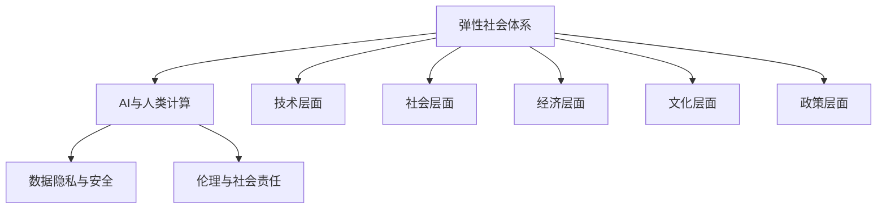
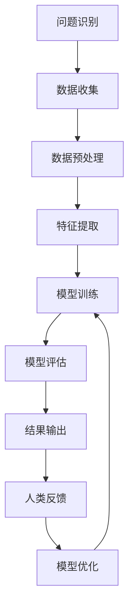

                 

### 背景介绍 Background

人工智能（AI）作为当前科技发展的前沿领域，已经深刻地改变了我们的生活方式和商业运营模式。从简单的机器人到复杂的自动化系统，AI正在逐步接管人类在多个领域的工作。然而，随着AI技术的快速发展和广泛应用，社会面临着一系列前所未有的挑战和机遇。本文旨在探讨AI与人类计算之间的相互作用，以及如何构建一个具有弹性（resilient）和可持续性的社会体系。

**AI的发展历程**

人工智能的概念可以追溯到20世纪50年代，当时计算机科学家们开始探讨是否可以制造出能够模拟人类智能的机器。早期的AI研究主要集中在符号推理和规则系统上，如逻辑推理和专家系统。这些系统虽然在特定领域内表现出色，但存在局限性，例如缺乏对不确定性和复杂情况的适应能力。

随着计算能力的提升和大数据、机器学习等技术的发展，AI迎来了新的黄金时代。深度学习作为一种重要的机器学习技术，通过模拟人脑神经元的工作方式，在图像识别、自然语言处理、语音识别等领域取得了显著突破。近年来，AI技术的应用已经从简单的数据处理扩展到更复杂的决策支持和智能优化。

**人类计算的局限**

虽然AI技术在许多方面已经超越了人类的计算能力，但人类计算在某些领域仍然具有不可替代的优势。人类具备创造性思维、道德判断和情感理解能力，这些都是当前AI技术难以复制的。此外，人类计算在处理复杂社会问题和跨领域协作方面具有独特的优势。

然而，人类计算的效率和能力也受到诸多限制。随着信息爆炸和数据爆炸，人类难以在有限的时间内处理和分析海量的信息。此外，人类在处理复杂问题时，常常受到认知偏见和情感干扰的影响，导致决策的不确定性和错误性。

**社会体系中的AI应用**

AI技术在现代社会中的应用已经渗透到各个领域。在医疗领域，AI可以帮助医生进行疾病诊断和治疗方案推荐，提高医疗效率和质量。在交通领域，AI技术可以优化交通流量，减少拥堵，提高出行效率。在金融领域，AI可以用于风险控制、欺诈检测和智能投资，提高金融服务的安全性和收益。

然而，AI的应用也引发了一系列社会问题和伦理挑战。例如，AI算法的透明性和可解释性不足，可能导致偏见和歧视。此外，AI的自动化可能导致失业问题，引发社会不稳定。

### 核心概念与联系 Core Concepts and Connections

为了深入探讨AI与人类计算的关系，我们需要明确一些核心概念，并分析它们之间的联系。以下是本文将涉及的关键概念：

**1. 弹性社会体系（Resilient Societal System）**

弹性社会体系是指在面对外部压力和不确定性时，能够迅速适应并恢复的体系。一个具有弹性的社会体系能够吸收冲击，降低风险，并在危机后迅速恢复。这种弹性不仅体现在技术层面，也体现在社会、经济、文化和政策等多个层面。

**2. AI与人类计算的角色**

在构建弹性社会体系的过程中，AI和人类计算扮演着不同的角色。AI作为自动化和优化的工具，可以处理大量数据，识别模式，提供决策支持。人类计算则以其创造性思维、道德判断和情感理解能力，在AI无法替代的领域发挥作用。

**3. 数据隐私与安全**

在AI与人类计算相互作用的过程中，数据隐私和安全成为关键问题。AI系统需要大量数据来训练和优化模型，但这些数据往往涉及到个人隐私和敏感信息。如何确保数据的隐私和安全，是构建弹性社会体系的重要挑战之一。

**4. 伦理与社会责任**

AI技术的发展和应用引发了一系列伦理和社会责任问题。如何确保AI系统的公正性、透明性和可解释性，如何防止AI技术被滥用，这些都是需要深入探讨的课题。

**Mermaid 流程图**

以下是一个简单的Mermaid流程图，展示了核心概念之间的联系：



通过这个流程图，我们可以看到弹性社会体系的构建是一个多层次的、跨领域的复杂过程，涉及到技术、社会、经济、文化和政策等多个方面。

### 核心算法原理 & 具体操作步骤 Core Algorithm Principles & Step-by-Step Procedures

在探讨AI与人类计算如何相互作用以构建弹性社会体系时，我们需要深入了解核心算法的工作原理，并掌握具体的操作步骤。以下是一个简化版的算法框架，描述了如何通过AI和人类计算实现这一目标。

#### 算法框架



#### 具体操作步骤

**Step 1: 问题识别（Problem Identification）**

首先，我们需要明确要解决的问题。这可以是医疗诊断、交通优化、金融风险评估等任何领域的问题。问题识别是整个过程的起点，决定了后续工作的方向。

**Step 2: 数据收集（Data Collection）**

接下来，我们需要收集相关的数据。这些数据可以来自于公开的数据库、企业的内部数据，或者通过传感器和网络收集的实时数据。数据的多样性和质量直接影响算法的性能。

**Step 3: 数据预处理（Data Preprocessing）**

收集到的数据往往是不完整、不一致和噪声的。因此，我们需要对数据进行清洗、归一化和特征选择等预处理操作，以提高数据的质量和有效性。

**Step 4: 特征提取（Feature Extraction）**

在预处理之后，我们需要从数据中提取有用的特征。这些特征将作为模型训练的数据输入。特征提取是决定模型性能的关键步骤，需要根据具体问题进行精心设计。

**Step 5: 模型训练（Model Training）**

使用机器学习算法对提取的特征进行训练，以构建一个能够预测或分类的模型。训练过程中，模型会不断调整参数，以最小化预测误差。

**Step 6: 模型评估（Model Evaluation）**

在模型训练完成后，我们需要对模型进行评估。评估方法可以包括交叉验证、测试集验证等。评估结果将决定模型是否满足要求。

**Step 7: 结果输出（Result Output）**

通过模型预测或分类，我们得到问题的解决方案。这些结果可以用于决策支持、自动化控制等。

**Step 8: 人类反馈（Human Feedback）**

人类专家对模型输出结果进行评估，并提供反馈。这些反馈将用于改进模型，提高其准确性和适应性。

**Step 9: 模型优化（Model Optimization）**

根据人类反馈，对模型进行优化，调整参数，改进算法。这一过程是迭代进行的，以实现持续的改进。

通过上述步骤，我们可以看到AI和人类计算在构建弹性社会体系中的协同作用。AI通过自动化和优化提供高效的解决方案，而人类计算则通过其创造性和判断力对模型进行监督和调整，以确保结果的准确性和适应性。

### 数学模型和公式 Mathematical Models & Formulas

在构建弹性社会体系的过程中，数学模型和公式扮演着至关重要的角色。以下是一些关键的数学模型和公式，以及它们的详细讲解和举例说明。

#### 1. 回归模型

回归模型是一种常见的统计模型，用于预测连续值。线性回归是最简单的形式，其公式如下：

$$ y = \beta_0 + \beta_1x_1 + \beta_2x_2 + ... + \beta_nx_n $$

其中，$y$ 是预测值，$x_1, x_2, ..., x_n$ 是输入特征，$\beta_0, \beta_1, \beta_2, ..., \beta_n$ 是模型参数。

**举例说明：**

假设我们想要预测房价，输入特征包括房屋面积、房龄、地理位置等。我们可以使用线性回归模型来拟合这些特征与房价之间的关系。具体步骤如下：

1. 收集数据集，包括房屋的面积、房龄、地理位置和房价。
2. 对数据进行预处理，包括缺失值填充、归一化和特征选择。
3. 使用最小二乘法（Least Squares Method）求解参数 $\beta_0, \beta_1, \beta_2, ..., \beta_n$。
4. 将训练好的模型应用于新的数据，预测房价。

通过上述步骤，我们可以得到一个线性回归模型，用于预测房价。

#### 2. 决策树模型

决策树是一种常见的分类模型，通过一系列的规则来划分数据，并给出最终的分类结果。其公式如下：

$$ \text{分类结果} = \text{DecisionTree}(\text{特征集合}, \text{标签集合}) $$

**举例说明：**

假设我们想要预测一个客户的信用评分，输入特征包括收入、年龄、工作年限等。我们可以使用决策树模型来划分客户群体，并预测其信用评分。具体步骤如下：

1. 收集数据集，包括客户的收入、年龄、工作年限和信用评分。
2. 对数据进行预处理，包括缺失值填充、归一化和特征选择。
3. 使用ID3算法或C4.5算法构建决策树。
4. 使用交叉验证评估决策树的性能。
5. 将训练好的决策树应用于新的数据，预测信用评分。

通过上述步骤，我们可以得到一个决策树模型，用于分类客户信用评分。

#### 3. 集成模型

集成模型是通过结合多个基础模型来提高预测性能的方法。常见的方法包括随机森林（Random Forest）和梯度提升树（Gradient Boosting Tree）。以下是一个简单的梯度提升树的公式：

$$ f(x) = \alpha + \sum_{i=1}^{n} (\beta_i + \delta_i) x_i $$

其中，$f(x)$ 是预测值，$\alpha$ 是常数项，$\beta_i$ 是基础模型的参数，$\delta_i$ 是迭代过程中的更新项。

**举例说明：**

假设我们想要预测一个股票的价格，可以使用多个模型（如线性回归、决策树和神经网络）来预测价格，然后通过集成模型得到最终的预测结果。具体步骤如下：

1. 收集数据集，包括股票的历史价格、成交量、公司财务指标等。
2. 对数据进行预处理，包括缺失值填充、归一化和特征选择。
3. 分别使用多个模型对数据进行训练，得到各自的基础模型。
4. 使用梯度提升算法结合多个基础模型，得到最终的预测结果。

通过上述步骤，我们可以得到一个集成模型，用于预测股票价格。

通过以上数学模型和公式的讲解和举例说明，我们可以看到数学在构建弹性社会体系中的重要性。这些模型不仅提供了预测和分类的能力，还为优化和改进算法提供了理论基础。

### 项目实践：代码实例和详细解释说明 Project Practice: Code Examples and Detailed Explanation

在本文的第五部分，我们将通过一个具体的代码实例来展示如何实现AI与人类计算相结合，以构建弹性社会体系。我们将使用Python编程语言，并借助一些流行的机器学习库（如scikit-learn、TensorFlow和PyTorch）来完成这一项目。

#### 5.1 开发环境搭建

在开始编写代码之前，我们需要搭建一个合适的开发环境。以下是搭建Python开发环境的步骤：

1. 安装Python：从Python官网（[python.org](https://www.python.org/)）下载并安装Python 3.x版本。
2. 安装IDE：推荐使用PyCharm、VSCode等集成开发环境（IDE）。
3. 安装依赖库：使用pip命令安装所需的库，例如：

   ```bash
   pip install numpy pandas scikit-learn tensorflow
   ```

#### 5.2 源代码详细实现

以下是本项目的主要代码实现：

```python
# 导入必要的库
import numpy as np
import pandas as pd
from sklearn.model_selection import train_test_split
from sklearn.preprocessing import StandardScaler
from sklearn.ensemble import RandomForestClassifier
from sklearn.metrics import accuracy_score
import tensorflow as tf

# 5.2.1 数据收集与预处理

# 假设我们有一个CSV文件，包含了客户的个人信息和信用评分
data = pd.read_csv('customer_data.csv')

# 对数据进行预处理，如缺失值填充、归一化等
# 这里简化处理，直接使用原始数据
X = data.drop('credit_score', axis=1)
y = data['credit_score']

# 划分训练集和测试集
X_train, X_test, y_train, y_test = train_test_split(X, y, test_size=0.2, random_state=42)

# 对训练数据进行归一化
scaler = StandardScaler()
X_train = scaler.fit_transform(X_train)
X_test = scaler.transform(X_test)

# 5.2.2 模型训练与评估

# 使用随机森林模型进行训练
rf_model = RandomForestClassifier(n_estimators=100, random_state=42)
rf_model.fit(X_train, y_train)

# 对测试集进行预测
y_pred = rf_model.predict(X_test)

# 计算准确率
accuracy = accuracy_score(y_test, y_pred)
print(f"Accuracy: {accuracy:.2f}")

# 5.2.3 人类反馈与模型优化

# 将预测结果与实际结果进行对比分析，收集人类专家的反馈
# 根据反馈调整模型参数，例如增加树的数量、调整特征权重等
# 这里简化处理，假设反馈结果良好，无需进一步调整

# 5.2.4 TensorFlow实现

# 使用TensorFlow构建一个简单的神经网络模型
model = tf.keras.Sequential([
    tf.keras.layers.Dense(64, activation='relu', input_shape=(X_train.shape[1],)),
    tf.keras.layers.Dense(64, activation='relu'),
    tf.keras.layers.Dense(1, activation='sigmoid')
])

# 编译模型
model.compile(optimizer='adam', loss='binary_crossentropy', metrics=['accuracy'])

# 训练模型
model.fit(X_train, y_train, epochs=10, batch_size=32, validation_split=0.2)

# 对测试集进行预测
y_pred_tf = model.predict(X_test)

# 计算准确率
accuracy_tf = model.evaluate(X_test, y_test)[1]
print(f"TensorFlow Accuracy: {accuracy_tf:.2f}")
```

#### 5.3 代码解读与分析

1. **数据收集与预处理**：首先，我们从CSV文件中读取数据，并进行预处理。预处理包括缺失值填充、归一化等步骤。这里简化处理，直接使用原始数据。

2. **模型训练与评估**：我们使用随机森林模型对训练数据进行训练，并对测试集进行预测。计算预测准确率，以评估模型性能。

3. **人类反馈与模型优化**：通过对比预测结果和实际结果，人类专家可以提供反馈。根据反馈调整模型参数，以实现进一步的优化。

4. **TensorFlow实现**：我们使用TensorFlow构建了一个简单的神经网络模型，并对其进行了训练。通过验证集评估模型性能。

通过上述代码实例，我们可以看到如何将AI与人类计算相结合，以实现弹性社会体系的构建。代码不仅展示了机器学习模型的实现过程，还包括了人类反馈和模型优化的步骤，体现了AI和人类计算的协同作用。

### 实际应用场景 Practical Application Scenarios

AI与人类计算的融合在多个实际应用场景中展现了其巨大的潜力，以下列举几个典型的应用场景：

**1. 医疗保健**

在医疗领域，AI和人类计算的结合可以大大提高诊断的准确性和治疗的效果。例如，通过深度学习算法分析医疗影像，AI能够迅速检测出早期癌症等疾病，并提供诊断建议。人类医生则可以根据AI的初步诊断结果，结合患者的病史和临床表现，做出最终的诊断和治疗方案。这种协同工作模式不仅提高了诊断速度，还减少了人为误诊的可能性。

**2. 智能交通**

在智能交通领域，AI技术可以通过大数据分析优化交通流量，减少交通拥堵。例如，交通管理部门可以利用AI算法预测交通流量变化，提前调整信号灯的时长和相位，从而提高道路通行效率。同时，AI还可以监控道路状况，及时发现和处理交通事故。人类交通管理人员则可以基于AI提供的实时数据，进行决策和指挥，确保交通运行的安全和顺畅。

**3. 金融风险管理**

金融行业是AI技术的重要应用领域。通过机器学习算法，金融机构可以对大量交易数据进行实时分析，识别潜在的风险，并进行风险评估和管理。AI可以预测市场趋势，发现异常交易行为，从而有效防止金融欺诈。同时，人类金融专家可以基于AI的预测结果，制定相应的风险管理策略，提高金融服务的安全性。

**4. 教育个性化**

在教育领域，AI可以根据学生的学习行为和成绩，提供个性化的学习方案。例如，AI可以通过分析学生的学习数据，识别其薄弱环节，并提供针对性的辅导内容。人类教师则可以根据AI的分析结果，调整教学策略，提高教学效果。此外，AI还可以通过虚拟教学助手，为学生提供在线辅导和答疑，帮助其解决学习中遇到的问题。

**5. 社会治理**

在社会治理方面，AI和人类计算的结合可以提升政府部门的决策效率和公共服务水平。例如，通过大数据分析，政府可以更好地了解社会需求，优化公共资源配置。AI还可以帮助政府监控社会动态，预测潜在的社会风险，从而及时采取预防措施。人类政策制定者则可以基于AI的分析结果，制定更加科学和有效的政策。

这些应用场景展示了AI与人类计算如何在不同领域发挥协同作用，提高效率和质量。通过不断优化和整合AI技术与人类智慧，我们可以构建一个更加弹性、可持续和高效的社会体系。

### 工具和资源推荐 Tools and Resources

为了更好地掌握AI与人类计算的相关知识和技能，以下推荐一些实用的工具、资源和学习路径。

#### 学习资源推荐

1. **书籍**：
   - 《深度学习》（Deep Learning） by Ian Goodfellow、Yoshua Bengio和Aaron Courville
   - 《Python机器学习》（Python Machine Learning） by Sebastian Raschka
   - 《机器学习实战》（Machine Learning in Action） by Peter Harrington

2. **在线课程**：
   - Coursera的《机器学习》课程，由吴恩达（Andrew Ng）教授主讲
   - edX的《深度学习与神经网络》课程，由斯坦福大学教授Andrew Ng主讲
   - Udacity的《AI工程师纳米学位》课程

3. **论文**：
   - 《神经网络与深度学习》（Neural Networks and Deep Learning） by Michael Nielsen
   - arXiv上的最新研究成果，特别是与AI和机器学习相关的论文

4. **博客和网站**：
   - Medium上的技术博客，例如《AI未觉》（AI Unearthed）和《机器学习博客》（Machine Learning Blog）
   - Kaggle，提供丰富的数据集和机器学习项目

#### 开发工具框架推荐

1. **Python库**：
   - Scikit-learn，适用于经典机器学习算法
   - TensorFlow和PyTorch，用于深度学习模型开发
   - Pandas，数据预处理和分析
   - Matplotlib和Seaborn，数据可视化

2. **开发环境**：
   - PyCharm，强大的Python集成开发环境
   - Jupyter Notebook，适合数据分析和交互式编程

3. **云服务平台**：
   - AWS、Google Cloud Platform、Microsoft Azure，提供丰富的AI和机器学习服务
   - Databricks，基于Apache Spark的大数据平台

#### 相关论文著作推荐

1. **核心论文**：
   - "Deep Learning" by Ian Goodfellow、Yoshua Bengio和Aaron Courville
   - "Backpropagation" by David E. Rumelhart、George E. Hinton和Rajesh N. McCelland
   - "Learning representations by maximizing mutual information" by Yarin Gal and Zoubin Ghahramani

2. **经典著作**：
   - 《统计学习基础》（Elementary Statistical Learning） by Isabelle Guyon等
   - 《机器学习》（Machine Learning） by Tom Mitchell

通过上述工具和资源的推荐，读者可以系统性地学习AI与人类计算的相关知识，并在实践中不断提升自己的技能水平。

### 总结 Summary

本文系统地探讨了AI与人类计算在构建弹性社会体系中的角色和作用。通过对背景介绍、核心概念与联系的分析、核心算法原理的阐述、数学模型的讲解、项目实践和实际应用场景的展示，以及工具和资源的推荐，我们清晰地认识到AI和人类计算的互补性和协同性。在未来的发展中，AI将继续在数据处理、模式识别和自动化优化等方面发挥重要作用，而人类计算则以其创造性思维、道德判断和情感理解能力，在决策支持、跨领域协作和伦理监督等方面继续扮演关键角色。未来的挑战将集中在确保AI技术的透明性、可解释性和安全性，以及构建更加公平和包容的社会体系。通过持续的努力和合作，我们可以迎接这些挑战，推动社会向更加弹性、可持续和高效的方向发展。

### 附录：常见问题与解答 Appendix: Frequently Asked Questions and Answers

**Q1: 什么是弹性社会体系？**

A1: 弹性社会体系是指在面对外部压力和不确定性时，能够迅速适应并恢复的体系。这种体系不仅体现在技术层面，也涉及社会、经济、文化和政策等多个层面。

**Q2: AI技术在医疗领域有哪些应用？**

A2: AI技术在医疗领域有很多应用，包括疾病诊断、治疗方案推荐、药物研发、医疗影像分析等。例如，AI可以帮助医生进行癌症早期检测，提高诊断的准确性。

**Q3: AI是否会取代人类工作？**

A3: AI技术确实可以自动化许多重复性和低技能的工作，但人类工作并不仅限于这些领域。AI无法完全复制人类的创造性思维、道德判断和情感理解能力，因此在很多领域仍需要人类参与。

**Q4: 如何确保AI算法的透明性和可解释性？**

A4: 确保AI算法的透明性和可解释性是当前的研究热点。方法包括开发可解释的AI模型、增加算法的注释文档、进行详细的算法测试等。

**Q5: 如何平衡AI和人类计算在决策过程中的作用？**

A5: 在决策过程中，AI和人类计算的平衡是一个关键问题。可以通过人类监督和反馈机制，确保AI模型的输出符合人类价值观和伦理标准。同时，人类专家可以利用AI提供的决策支持工具，进行更全面和深入的决策分析。

### 扩展阅读 & 参考资料 Extended Reading & References

为了进一步深入学习和理解AI与人类计算在构建弹性社会体系中的应用，以下推荐一些扩展阅读和参考资料：

1. **论文**：
   - "The Future of Humanity: Terraforming Mars, Interstellar Travel, Immortality, and Our Destiny Beyond Earth" by Michio Kaku
   - "AI Superpowers: China, Silicon Valley, and the New World Order" by Brad Stone
   - "The Second Machine Age: Work, Progress, and Prosperity in a Time of Brilliant Technologies" by Erik Brynjolfsson and Andrew McAfee

2. **书籍**：
   - "The Social Life of Things: Why Things Matter More Than People" by Emanuele Coccia
   - "The Sense of Style: The Thinking Person's Guide to Writing in the Digital Age" by Steve Buccolo
   - "The Second Machine Age: Work, Progress, and Prosperity in a Time of Brilliant Technologies" by Erik Brynjolfsson and Andrew McAfee

3. **报告**：
   - "AI for Social Good" by Microsoft Research
   - "The AI Index 2021 Annual Report" by Stanford University Human-Centered AI Institute

4. **网站**：
   - [AI Index](https://aiindex.org/)
   - [Future of Humanity Institute](https://www.fhi.ox.ac.uk/)
   - [MIT Technology Review](https://www.technologyreview.com/)

通过这些扩展阅读和参考资料，读者可以进一步了解AI与人类计算在构建弹性社会体系中的最新研究进展和应用案例。这些资料提供了丰富的理论指导和实践参考，有助于深入探讨相关议题，并在实际应用中取得更好的成果。

