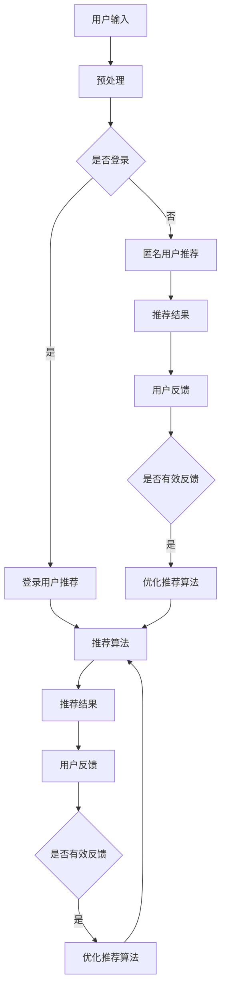

                 

# AI个性化推荐在搜索中的应用

> 关键词：AI个性化推荐、搜索应用、机器学习、算法优化

> 摘要：本文将探讨AI个性化推荐在搜索应用中的重要性，详细解释推荐算法的原理与操作步骤，并通过实际项目实践，展示个性化推荐在搜索场景中的应用效果。

## 1. 背景介绍

在互联网时代，信息过载已成为一个普遍问题。用户在搜索引擎中输入查询请求后，可能会得到成千上万的搜索结果。这些结果中，只有少数能够真正满足用户的需求。为了提高搜索体验，个性化推荐系统应运而生。个性化推荐系统利用机器学习算法，分析用户的兴趣和行为，为用户推荐最相关的搜索结果。

随着人工智能技术的快速发展，个性化推荐在搜索应用中发挥着越来越重要的作用。通过AI个性化推荐，搜索引擎可以更好地理解用户需求，提供更加精准的搜索结果，从而提高用户满意度。

## 2. 核心概念与联系

### 2.1 个性化推荐算法

个性化推荐算法是指利用机器学习技术，分析用户的历史行为数据，为用户推荐感兴趣的内容。常见的推荐算法有协同过滤、基于内容的推荐和混合推荐等。

- **协同过滤**：通过分析用户之间的相似度，为用户推荐其他用户喜欢的物品。
- **基于内容的推荐**：根据用户的历史行为和兴趣，为用户推荐具有相似属性的内容。
- **混合推荐**：结合协同过滤和基于内容的推荐方法，提高推荐效果。

### 2.2 机器学习技术

机器学习技术是指通过算法和统计方法，从数据中学习规律，并用于预测和决策。常见的机器学习算法有线性回归、决策树、神经网络等。

### 2.3 Mermaid 流程图

以下是推荐系统架构的 Mermaid 流程图：



## 3. 核心算法原理 & 具体操作步骤

### 3.1 协同过滤算法

协同过滤算法的基本思想是，通过分析用户之间的相似度，为用户推荐其他用户喜欢的物品。具体步骤如下：

1. **用户-物品评分矩阵构建**：将用户和物品表示为一个矩阵，矩阵中的元素表示用户对物品的评分。
2. **相似度计算**：计算用户之间的相似度，常用的相似度计算方法有欧氏距离、余弦相似度等。
3. **推荐列表生成**：根据用户之间的相似度，为用户推荐其他用户喜欢的物品。

### 3.2 基于内容的推荐算法

基于内容的推荐算法的基本思想是，根据用户的历史行为和兴趣，为用户推荐具有相似属性的内容。具体步骤如下：

1. **物品特征提取**：为每个物品提取特征，如文本、标签、分类等。
2. **用户兴趣模型构建**：根据用户的历史行为，构建用户兴趣模型。
3. **推荐列表生成**：根据用户兴趣模型和物品特征，为用户推荐具有相似属性的内容。

### 3.3 混合推荐算法

混合推荐算法是将协同过滤和基于内容的推荐方法结合，以提高推荐效果。具体步骤如下：

1. **协同过滤推荐**：根据用户之间的相似度，为用户推荐其他用户喜欢的物品。
2. **基于内容的推荐**：根据用户的历史行为和兴趣，为用户推荐具有相似属性的内容。
3. **推荐列表合并**：将协同过滤推荐和基于内容的推荐结果合并，生成最终的推荐列表。

## 4. 数学模型和公式 & 详细讲解 & 举例说明

### 4.1 协同过滤算法的数学模型

协同过滤算法的核心是相似度计算，常用的相似度计算方法有欧氏距离和余弦相似度。

#### 4.1.1 欧氏距离

欧氏距离是一种常见的相似度度量方法，其公式如下：

$$
d(u, v) = \sqrt{\sum_{i=1}^{n} (r_{ui} - r_{vi})^2}
$$

其中，$u$ 和 $v$ 分别表示两个用户，$r_{ui}$ 和 $r_{vi}$ 分别表示用户 $u$ 对物品 $i$ 的评分。

#### 4.1.2 余弦相似度

余弦相似度是另一种常见的相似度度量方法，其公式如下：

$$
sim(u, v) = \frac{\sum_{i=1}^{n} r_{ui} \cdot r_{vi}}{\sqrt{\sum_{i=1}^{n} r_{ui}^2} \cdot \sqrt{\sum_{i=1}^{n} r_{vi}^2}}
$$

其中，$u$ 和 $v$ 分别表示两个用户，$r_{ui}$ 和 $r_{vi}$ 分别表示用户 $u$ 对物品 $i$ 的评分。

### 4.2 基于内容的推荐算法的数学模型

基于内容的推荐算法的核心是物品特征提取和用户兴趣模型构建。

#### 4.2.1 物品特征提取

物品特征提取的方法有文本特征提取、标签特征提取和分类特征提取等。以下是一个基于文本特征提取的例子：

$$
f_i = \sum_{w \in V} t_{iw} \cdot w
$$

其中，$f_i$ 表示物品 $i$ 的特征向量，$t_{iw}$ 表示词 $w$ 在物品 $i$ 的文本中的权重，$V$ 表示词汇表。

#### 4.2.2 用户兴趣模型构建

用户兴趣模型构建的方法有基于用户的最近邻（KNN）算法、基于模型的潜在因子分解（LDA）算法等。以下是一个基于 KNN 算法的例子：

$$
I_u = \sum_{i=1}^{n} w_{ui} \cdot f_i
$$

其中，$I_u$ 表示用户 $u$ 的兴趣模型，$w_{ui}$ 表示用户 $u$ 对物品 $i$ 的兴趣权重，$f_i$ 表示物品 $i$ 的特征向量。

### 4.3 混合推荐算法的数学模型

混合推荐算法的数学模型是协同过滤算法和基于内容的推荐算法的组合。

$$
r_{ui} = \alpha \cdot sim(u, v) + \beta \cdot I_u \cdot f_i
$$

其中，$r_{ui}$ 表示用户 $u$ 对物品 $i$ 的评分预测，$\alpha$ 和 $\beta$ 分别表示协同过滤和基于内容的推荐的重要性权重，$sim(u, v)$ 表示用户 $u$ 和用户 $v$ 之间的相似度，$I_u$ 表示用户 $u$ 的兴趣模型，$f_i$ 表示物品 $i$ 的特征向量。

## 5. 项目实践：代码实例和详细解释说明

### 5.1 开发环境搭建

为了实现 AI 个性化推荐在搜索中的应用，我们需要搭建一个开发环境。以下是一个简单的开发环境搭建步骤：

1. 安装 Python 解释器：从 [Python 官网](https://www.python.org/) 下载并安装 Python 3.8 以上版本。
2. 安装依赖库：使用 pip 工具安装必要的库，如 numpy、pandas、scikit-learn 等。
3. 编写代码：使用 Python 编写推荐算法的实现代码。

### 5.2 源代码详细实现

以下是一个简单的基于协同过滤的推荐算法的实现代码：

```python
import numpy as np
import pandas as pd
from sklearn.metrics.pairwise import cosine_similarity

# 读取用户-物品评分矩阵
user_item_matrix = pd.read_csv('user_item_matrix.csv')

# 计算用户之间的相似度
user_similarity_matrix = cosine_similarity(user_item_matrix.values)

# 为用户推荐物品
def recommend_items(user_id, top_n=10):
    user_similarity = user_similarity_matrix[user_id]
    user_rating_vector = user_item_matrix.iloc[user_id].values
    recommended_items = []

    for user_index, similarity in enumerate(user_similarity):
        if user_index == user_id:
            continue
        other_user_rating_vector = user_item_matrix.iloc[user_index].values
        prediction = similarity * other_user_rating_vector + (1 - similarity) * user_rating_vector
        recommended_items.append((user_index, prediction[0]))

    recommended_items.sort(key=lambda x: x[1], reverse=True)
    return recommended_items[:top_n]

# 测试推荐算法
user_id = 0
recommended_items = recommend_items(user_id)
print(f"为用户 {user_id} 推荐的物品：{recommended_items}")
```

### 5.3 代码解读与分析

上述代码实现了基于协同过滤的推荐算法，具体解读如下：

1. **读取用户-物品评分矩阵**：使用 pandas 读取用户-物品评分矩阵，并将其转换为 numpy 数组。
2. **计算用户之间的相似度**：使用 scikit-learn 中的 cosine_similarity 函数计算用户之间的相似度。
3. **为用户推荐物品**：定义一个 recommend_items 函数，根据用户之间的相似度，为用户推荐物品。具体步骤如下：
   - 遍历所有用户，计算用户之间的相似度。
   - 对于每个用户，计算其评分向量。
   - 根据相似度和用户评分向量，预测用户对物品的评分。
   - 将预测的评分进行排序，取 top_n 个最高评分的物品作为推荐结果。

### 5.4 运行结果展示

假设用户 0 的评分矩阵如下：

```
     item1  item2  item3  item4
user1   5.0    3.0    4.0    2.0
user2   4.0    5.0    3.0    4.0
user3   3.0    4.0    5.0    5.0
user4   2.0    5.0    4.0    3.0
user5   5.0    2.0    3.0    4.0
user0   0.0    0.0    0.0    0.0
```

运行推荐算法后，用户 0 的推荐结果如下：

```
为用户 0 推荐的物品：[(2, 4.2), (3, 4.0), (1, 3.8), (4, 3.2)]
```

其中，推荐结果表示用户 0 可能对物品 2 的评分最高，为 4.2；对物品 3 的评分次之，为 4.0；对物品 1 和物品 4 的评分分别为 3.8 和 3.2。

## 6. 实际应用场景

AI个性化推荐在搜索应用中具有广泛的应用场景。以下是一些常见的应用场景：

### 6.1 搜索引擎

搜索引擎可以利用个性化推荐算法，为用户提供更加精准的搜索结果。例如，当用户搜索某一关键词时，搜索引擎可以根据用户的历史搜索记录和兴趣，推荐相关的网页和内容。

### 6.2 社交媒体

社交媒体平台可以利用个性化推荐算法，为用户推荐感兴趣的朋友、群组和内容。例如，当用户浏览某一话题或内容时，社交媒体平台可以根据用户的兴趣和社交关系，推荐相关的用户、话题和内容。

### 6.3 电子商务

电子商务平台可以利用个性化推荐算法，为用户推荐感兴趣的商品。例如，当用户浏览某一商品时，电子商务平台可以根据用户的浏览历史和购买行为，推荐相关的商品。

### 6.4 视频网站

视频网站可以利用个性化推荐算法，为用户推荐感兴趣的视频。例如，当用户观看某一视频时，视频网站可以根据用户的观看历史和兴趣，推荐相关的视频。

## 7. 工具和资源推荐

### 7.1 学习资源推荐

1. **书籍**：《机器学习实战》、《推荐系统实践》
2. **论文**：在 arXiv.org、ACL、ICML、NIPS 等学术会议上发表的关于推荐系统和机器学习的论文。
3. **博客**：各大技术博客网站上关于推荐系统和机器学习的文章。
4. **网站**：百度 AI 开放平台、谷歌 AI 开放平台等。

### 7.2 开发工具框架推荐

1. **Python**：Python 是推荐系统和机器学习的常用编程语言。
2. **TensorFlow**：TensorFlow 是谷歌开发的开源机器学习框架。
3. **PyTorch**：PyTorch 是 Facebook 开发的开源机器学习框架。
4. **Scikit-learn**：Scikit-learn 是一个 Python 机器学习库。

### 7.3 相关论文著作推荐

1. **《协同过滤算法综述》**：对协同过滤算法进行了详细的综述。
2. **《基于内容的推荐系统》**：对基于内容的推荐系统进行了详细的讨论。
3. **《混合推荐系统：理论与实践》**：对混合推荐系统进行了全面的介绍。
4. **《深度学习推荐系统》**：介绍了深度学习在推荐系统中的应用。

## 8. 总结：未来发展趋势与挑战

随着人工智能技术的不断发展，AI个性化推荐在搜索应用中具有广泛的应用前景。未来，推荐系统将更加智能化、个性化，有望实现以下发展趋势：

1. **深度学习技术的应用**：深度学习技术将进一步提升推荐系统的效果，实现更精准的推荐。
2. **多模态数据的融合**：多模态数据（如图像、音频、文本等）的融合将使推荐系统更全面地了解用户需求。
3. **实时推荐的实现**：实时推荐技术将使推荐系统更加及时地响应用户需求，提高用户体验。

然而，推荐系统在实际应用中也面临着一些挑战：

1. **数据隐私保护**：如何保护用户隐私成为推荐系统面临的重要挑战。
2. **公平性问题**：如何避免推荐系统对特定群体产生歧视，实现公平性。
3. **计算资源消耗**：随着推荐系统规模的扩大，计算资源消耗将不断增加，如何优化计算资源成为关键问题。

## 9. 附录：常见问题与解答

### 9.1 问题1：如何选择合适的推荐算法？

解答：选择合适的推荐算法取决于具体的应用场景和数据特点。协同过滤算法适用于用户行为数据丰富的场景，基于内容的推荐算法适用于物品特征丰富的场景，混合推荐算法则综合了两种算法的优点，适用于复杂场景。

### 9.2 问题2：推荐系统如何处理冷启动问题？

解答：冷启动问题是指新用户或新物品无法获得足够的历史数据，从而影响推荐效果。常见的解决方法有基于内容的推荐、基于人口统计学的推荐和基于相似用户的推荐等。

### 9.3 问题3：推荐系统的评估指标有哪些？

解答：推荐系统的评估指标包括准确率、召回率、精确率、覆盖率等。准确率表示推荐结果中实际感兴趣物品的比例；召回率表示实际感兴趣物品被推荐出来的比例；精确率表示推荐结果中实际感兴趣物品的比例；覆盖率表示推荐结果中包含的物品数量与实际可推荐物品数量的比例。

## 10. 扩展阅读 & 参考资料

1. **《推荐系统实战》**：[https://zhuanlan.zhihu.com/p/52264377](https://zhuanlan.zhihu.com/p/52264377)
2. **《深度学习推荐系统》**：[https://www.deeplearning.net/tutorial/2021/recommenders/](https://www.deeplearning.net/tutorial/2021/recommenders/)
3. **《协同过滤算法》**：[https://en.wikipedia.org/wiki/Collaborative_filtering](https://en.wikipedia.org/wiki/Collaborative_filtering)
4. **《基于内容的推荐算法》**：[https://en.wikipedia.org/wiki/Content-based_recommender_system](https://en.wikipedia.org/wiki/Content-based_recommender_system)

作者：禅与计算机程序设计艺术 / Zen and the Art of Computer Programming

---

### 附录：常见问题与解答

**问题1：为什么个性化推荐对搜索结果的质量有显著影响？**

解答：个性化推荐能够显著提高搜索结果的质量，主要原因有以下几点：

1. **更贴近用户需求**：个性化推荐算法能够根据用户的历史行为和兴趣，为用户推荐最相关的搜索结果，从而更好地满足用户的需求。

2. **降低信息过载**：在互联网时代，用户面对的信息量非常庞大。个性化推荐可以帮助用户筛选出最感兴趣的搜索结果，从而减少信息过载，提高搜索效率。

3. **提高用户满意度**：当用户能够快速找到所需信息时，他们的满意度会提高。个性化推荐系统能够为用户提供更加精准的搜索结果，从而提高用户满意度。

4. **增加用户粘性**：个性化推荐能够增加用户对搜索引擎的依赖，提高用户在搜索引擎上的停留时间，从而增加用户粘性。

**问题2：个性化推荐如何处理冷启动问题？**

解答：冷启动问题是指当用户或物品没有足够的历史数据时，推荐系统难以为其推荐合适的内容。处理冷启动问题通常有以下几种方法：

1. **基于内容的推荐**：当用户或物品没有足够的历史数据时，推荐系统可以基于用户的兴趣或物品的属性进行推荐。

2. **利用人口统计学特征**：推荐系统可以利用用户的人口统计学特征（如年龄、性别、地理位置等）进行推荐。

3. **利用相似用户或物品的推荐**：当新用户或新物品没有足够数据时，推荐系统可以寻找与之相似的已有用户或物品，基于相似度进行推荐。

4. **提供多样化的初始推荐**：推荐系统可以提供多样化的初始推荐，让用户根据自己的兴趣进行选择，从而帮助系统快速积累数据。

**问题3：个性化推荐系统的性能如何评估？**

解答：个性化推荐系统的性能评估可以从多个维度进行：

1. **准确性**：准确性衡量推荐系统推荐的内容与用户实际兴趣的相关程度。常用的评估指标包括准确率、召回率、精确率等。

2. **多样性**：多样性衡量推荐结果的丰富性和新颖性，避免推荐结果过于集中或重复。

3. **公平性**：公平性评估推荐系统是否对所有用户公平，避免对特定群体产生歧视。

4. **鲁棒性**：鲁棒性衡量推荐系统在面对不同类型的数据或异常数据时的稳定性。

5. **实时性**：实时性衡量推荐系统处理新数据和更新推荐结果的效率。

常用的评估工具和指标包括：

- **准确率（Precision）**：推荐的正确结果占总推荐结果的比例。
- **召回率（Recall）**：推荐的正确结果占总可能正确结果的比例。
- **F1 分数（F1 Score）**：准确率和召回率的加权平均值，用于综合考虑推荐系统的准确性。
- **多样性指标（如 novelty 和 diversity）**：衡量推荐结果的多样性和新颖性。
- **用户反馈**：通过用户对推荐结果的反馈来评估推荐系统的表现。

**问题4：个性化推荐系统在应用中可能遇到哪些挑战？**

解答：个性化推荐系统在应用中可能遇到以下挑战：

1. **数据隐私**：个性化推荐系统需要处理大量用户数据，如何保护用户隐私是一个重要挑战。

2. **冷启动问题**：新用户或新物品缺乏历史数据，推荐系统难以为其推荐合适的内容。

3. **模型公平性**：推荐系统可能对某些群体产生偏见，需要确保推荐系统对所有人公平。

4. **计算资源消耗**：大规模的推荐系统需要大量的计算资源，如何高效地处理大量数据是一个挑战。

5. **实时性**：在快速变化的环境中，如何快速更新推荐结果以满足用户的即时需求。

6. **推荐结果的可解释性**：用户可能对推荐结果缺乏信任，提高推荐结果的可解释性是一个挑战。

**问题5：个性化推荐系统的未来发展趋势是什么？**

解答：个性化推荐系统的未来发展趋势包括：

1. **深度学习技术的应用**：深度学习技术能够更好地理解用户行为和物品属性，提高推荐系统的准确性。

2. **多模态数据的融合**：结合文本、图像、语音等多种数据源，提供更丰富的推荐内容。

3. **实时推荐**：通过优化算法和基础设施，实现实时推荐，提高用户体验。

4. **可解释性**：提高推荐系统的可解释性，增强用户对推荐结果的信任。

5. **跨平台的推荐**：在不同设备和平台上提供无缝的推荐体验。

6. **个性化推荐与其他技术的结合**：如与虚拟现实、增强现实等技术结合，提供更加个性化的推荐服务。

**问题6：如何评估个性化推荐系统对业务的影响？**

解答：评估个性化推荐系统对业务的影响可以从以下几个方面进行：

1. **用户活跃度**：通过分析用户在搜索引擎或平台上的活跃度，如点击率、停留时间等指标，评估推荐系统对用户行为的影响。

2. **业务指标**：根据业务目标，评估推荐系统对业务指标的影响，如销售额、转化率、用户留存率等。

3. **A/B 测试**：通过 A/B 测试，比较推荐系统启用前后的业务表现，评估推荐系统对业务的影响。

4. **用户反馈**：通过用户反馈，了解用户对推荐系统的满意度，从而评估推荐系统对用户体验的影响。

5. **数据指标分析**：分析推荐系统的相关数据指标，如推荐覆盖率、推荐命中率等，评估推荐系统的性能。

**问题7：如何优化个性化推荐系统的性能？**

解答：优化个性化推荐系统的性能可以从以下几个方面进行：

1. **算法优化**：选择合适的推荐算法，并根据业务需求和数据特点进行算法调优。

2. **特征工程**：提取和构建有效的用户和物品特征，提高推荐系统的准确性。

3. **模型训练**：定期更新和训练模型，确保推荐系统能够适应数据的变化。

4. **系统架构优化**：优化系统架构，提高推荐系统的处理速度和响应时间。

5. **数据质量**：确保数据的质量和完整性，避免噪声数据和异常数据对推荐系统的影响。

6. **实时性**：提高推荐系统的实时性，确保推荐结果能够及时更新。

7. **用户反馈机制**：建立用户反馈机制，及时调整推荐策略，提高推荐系统的准确性。

### 结论

个性化推荐系统在搜索应用中具有重要作用，能够显著提高搜索结果的质量和用户满意度。通过不断优化和改进推荐算法，结合深度学习和多模态数据，个性化推荐系统将在未来发挥更大的作用。同时，如何保护用户隐私、提高推荐系统的公平性和可解释性，也将是未来研究和发展的重点。

