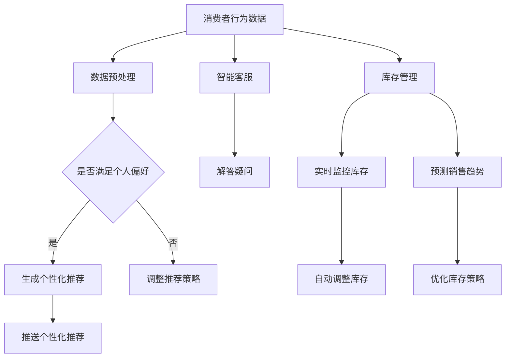

                 

### 背景介绍

#### 引言

随着人工智能技术的飞速发展，新零售行业也迎来了前所未有的变革。在这个数字化、智能化的时代，传统的零售模式已经难以满足消费者的多样化和个性化需求。为了应对这一挑战，越来越多的企业开始探索将人工智能（AI）引入新零售领域，以提升运营效率、优化消费者体验、增强市场竞争力。AI人工智能Agent作为人工智能的核心应用之一，正逐渐成为新零售行业的重要推动力量。

#### 新零售的概念与特点

新零售，即“新商业+新零售”，是零售业在数字化时代的一种新型商业模式。它强调线上与线下相结合，通过大数据、人工智能等技术手段，实现消费体验的升级和商业模式的创新。新零售具有以下几个显著特点：

1. **数据驱动**：新零售通过收集和分析海量消费者数据，了解消费者的行为和需求，从而实现精准营销和个性化推荐。
2. **消费体验**：新零售注重提升消费者的购物体验，通过线上线下互动、智能化的购物场景，提高消费者的满意度和忠诚度。
3. **供应链优化**：新零售通过智能供应链管理，实现库存优化、物流配送的自动化和高效化，降低运营成本，提高响应速度。

#### 人工智能在零售行业的作用

人工智能在零售行业的应用，不仅提升了企业的运营效率，还深刻改变了消费者的购物方式和体验。以下是人工智能在零售行业中的几个关键作用：

1. **消费者行为分析**：通过大数据和人工智能技术，分析消费者的购物习惯、偏好和需求，为精准营销提供数据支持。
2. **智能推荐系统**：利用机器学习和深度学习算法，实现个性化推荐，提高销售额和用户粘性。
3. **智能客服**：通过自然语言处理（NLP）技术，提供智能客服服务，提升客户满意度，降低人力成本。
4. **智能供应链管理**：通过人工智能优化库存管理和物流配送，提高供应链的效率和灵活性。

#### AI人工智能Agent的定义和作用

AI人工智能Agent，即人工智能代理，是一种能够自主决策并执行特定任务的软件系统。它具备自主感知、理解和响应环境变化的能力，能够模拟人类智能行为，解决复杂问题。在新零售领域，AI人工智能Agent具有以下几个重要作用：

1. **个性化服务**：通过分析消费者数据，AI人工智能Agent可以为消费者提供个性化的购物建议和服务，提升用户体验。
2. **自动化运营**：AI人工智能Agent可以自动化处理日常运营任务，如订单处理、库存管理、商品推荐等，提高运营效率。
3. **智能决策支持**：AI人工智能Agent可以通过分析海量数据，为企业提供精准的市场分析和决策支持，优化业务策略。

综上所述，随着新零售行业的快速发展，AI人工智能Agent的应用前景十分广阔。在接下来的章节中，我们将深入探讨AI人工智能Agent的核心概念、算法原理、数学模型以及实际应用场景，以期为大家提供全面的了解和指导。

## 1. 核心概念与联系

### AI人工智能Agent的定义与工作原理

AI人工智能Agent，是人工智能领域的一个重要概念，指的是一种能够自主执行任务、具备智能行为的软件实体。它通过感知环境、理解指令、做出决策并执行任务，来模拟人类的智能行为。AI人工智能Agent通常基于机器学习和深度学习技术，具备数据挖掘、模式识别、自然语言处理等多种功能。

#### 自主决策与任务执行

AI人工智能Agent的核心功能在于其自主决策和任务执行能力。它可以通过传感器获取环境信息，利用内置的算法进行数据分析和处理，然后根据预设的目标和规则，生成决策并执行相应的任务。例如，在新零售领域，AI人工智能Agent可以分析消费者的购物行为，自动生成个性化的商品推荐，并引导消费者完成购买。

#### 感知环境与交互

AI人工智能Agent的工作过程通常包括感知环境、理解指令和交互三个主要环节。感知环境是指通过传感器收集外部信息，如消费者的购物偏好、购买历史等；理解指令是指对收集到的信息进行分析和处理，以理解消费者的需求和意图；交互是指通过与消费者进行沟通，提供相应的服务和建议。

### 新零售中AI人工智能Agent的应用

在新零售中，AI人工智能Agent的应用场景非常广泛，主要包括以下几方面：

1. **个性化推荐**：AI人工智能Agent通过分析消费者的购物行为和偏好，自动生成个性化的商品推荐，提高购物体验和销售额。
2. **智能客服**：AI人工智能Agent可以模拟人类客服，通过自然语言处理技术，解答消费者的疑问，提供购物建议，提升客户满意度。
3. **智能库存管理**：AI人工智能Agent可以实时监控库存情况，预测销售趋势，自动调整库存水平，降低库存风险。
4. **智能营销**：AI人工智能Agent可以根据消费者的行为数据，制定个性化的营销策略，提高营销效果。

### 关键概念原理与架构

为了更好地理解AI人工智能Agent在新零售中的应用，我们需要了解几个关键概念原理：

1. **机器学习**：机器学习是一种通过数据驱动的方法，使计算机具备自主学习和决策能力的技术。在新零售中，机器学习被广泛应用于消费者行为分析、商品推荐等场景。
2. **深度学习**：深度学习是机器学习的一种重要分支，通过多层神经网络模型，实现复杂的数据分析和决策。在新零售中，深度学习被广泛应用于图像识别、语音识别等场景。
3. **自然语言处理（NLP）**：自然语言处理是一种让计算机理解和处理自然语言的技术。在新零售中，NLP被广泛应用于智能客服、语音助手等场景。

#### Mermaid 流程图

为了更直观地展示AI人工智能Agent在新零售中的应用架构，我们使用Mermaid流程图进行描述：



通过上述流程图，我们可以清晰地看到AI人工智能Agent在新零售中的应用场景和关键环节。在接下来的章节中，我们将深入探讨AI人工智能Agent的核心算法原理、数学模型和具体实现方法，为大家提供更加详细的技术解读。

## 2. 核心算法原理 & 具体操作步骤

### 个性化推荐算法

个性化推荐是AI人工智能Agent在新零售中的一项重要应用，通过分析消费者的购物行为和偏好，生成个性化的商品推荐，提高购物体验和销售额。以下是几种常见的个性化推荐算法及其具体操作步骤：

#### 协同过滤算法

协同过滤算法是一种基于用户行为数据的推荐方法，通过分析用户之间的相似度，为用户推荐他们可能感兴趣的商品。协同过滤算法主要包括以下步骤：

1. **用户-商品矩阵构建**：首先，构建一个用户-商品矩阵，记录每个用户对商品的评分或购买记录。
2. **用户相似度计算**：计算用户之间的相似度，通常使用余弦相似度或皮尔逊相关系数。
3. **推荐商品筛选**：对于给定的用户，找到与该用户最相似的K个用户，从这些用户的购物记录中筛选出未被该用户购买的商品。
4. **推荐结果生成**：对筛选出的商品进行排序，生成个性化推荐列表。

#### 内容推荐算法

内容推荐算法是一种基于商品特征和用户偏好的推荐方法，通过分析商品的属性和用户的历史行为，为用户推荐具有相似属性的 商品。内容推荐算法主要包括以下步骤：

1. **商品特征提取**：对商品的属性进行提取，如类别、品牌、价格等。
2. **用户偏好分析**：分析用户的历史购买记录和评价，提取用户的偏好特征。
3. **相似度计算**：计算商品之间的相似度，通常使用余弦相似度或欧氏距离。
4. **推荐商品筛选**：对于给定的用户，找到与该用户偏好最相似的K个商品。
5. **推荐结果生成**：对筛选出的商品进行排序，生成个性化推荐列表。

#### 深度学习推荐算法

深度学习推荐算法是一种基于神经网络模型的推荐方法，通过学习用户和商品之间的复杂关系，生成个性化的推荐。深度学习推荐算法主要包括以下步骤：

1. **模型构建**：构建一个多层的神经网络模型，包括输入层、隐藏层和输出层。
2. **数据预处理**：对用户和商品的特征进行预处理，如归一化、编码等。
3. **模型训练**：使用训练数据对神经网络模型进行训练，调整模型的参数。
4. **模型评估**：使用验证集对模型进行评估，调整模型参数，提高推荐效果。
5. **推荐结果生成**：对用户进行输入，模型输出用户可能感兴趣的商品，生成个性化推荐列表。

### 智能客服算法

智能客服是AI人工智能Agent在新零售中的另一个重要应用，通过自然语言处理技术，模拟人类客服，解答用户的疑问，提供购物建议。以下是智能客服算法的主要步骤：

1. **语音识别**：将用户的语音输入转换为文本输入，实现语音到文本的转换。
2. **文本预处理**：对输入的文本进行预处理，如分词、去停用词、词性标注等。
3. **意图识别**：通过分析文本，识别用户的意图，如查询商品信息、咨询售后服务等。
4. **回答生成**：根据识别的意图，生成相应的回答，如查询商品详情、提供售后服务等。
5. **语音合成**：将生成的回答转换为语音输出，实现文本到语音的转换。

### 智能库存管理算法

智能库存管理算法是AI人工智能Agent在新零售中用于优化库存管理的算法，通过分析销售数据和库存情况，自动调整库存水平，降低库存风险。以下是智能库存管理算法的主要步骤：

1. **数据收集**：收集销售数据、库存数据等，构建数据集。
2. **特征工程**：对数据进行特征提取，如销售额、库存量、销售周期等。
3. **预测模型构建**：构建预测模型，如时间序列预测模型、回归模型等。
4. **预测结果生成**：使用预测模型对未来的销售进行预测，生成库存调整建议。
5. **库存调整**：根据预测结果，自动调整库存水平，如增加或减少库存。

通过上述算法原理和操作步骤的详细讲解，我们可以看到AI人工智能Agent在新零售中的应用潜力。在接下来的章节中，我们将进一步探讨AI人工智能Agent的数学模型和具体实现，为大家提供更加深入的技术解读。

## 3. 数学模型和公式 & 详细讲解 & 举例说明

### 协同过滤算法

协同过滤算法是一种基于用户行为数据推荐的方法，其核心在于计算用户之间的相似度，从而为用户推荐其他用户喜欢的商品。以下是一个简化的协同过滤算法数学模型：

#### 用户相似度计算

假设我们有用户-商品评分矩阵 \(R \in \mathbb{R}^{m \times n}\)，其中 \(m\) 是用户数，\(n\) 是商品数，\(R_{ij}\) 表示用户 \(i\) 对商品 \(j\) 的评分。用户 \(i\) 和用户 \(j\) 之间的相似度可以通过以下公式计算：

$$
sim(i, j) = \frac{R_{i\cdot}R_{\cdot j} - R_{ij}^2}{\sqrt{\sum_{j=1}^{n}R_{ij}^2} \sqrt{\sum_{j=1}^{n}R_{i\cdot j}^2}}
$$

其中，\(R_{i\cdot}\) 表示用户 \(i\) 的所有评分求和，\(R_{\cdot j}\) 表示用户 \(j\) 的所有评分求和。

#### 推荐评分预测

对于给定用户 \(i\)，我们需要预测其对未知商品 \(j\) 的评分。根据协同过滤的思想，可以使用以下公式预测用户 \(i\) 对商品 \(j\) 的评分：

$$
\hat{R}_{ij} = R_{i\cdot} + \sum_{k \in N(i)} \frac{sim(i, k)}{\sqrt{\sum_{j=1}^{n}sim(i, j)^2}} (R_{kj} - R_{k\cdot})
$$

其中，\(N(i)\) 表示与用户 \(i\) 相似的前 \(k\) 个用户，\(\hat{R}_{ij}\) 是预测的用户 \(i\) 对商品 \(j\) 的评分。

#### 示例

假设有两个用户 \(i\) 和 \(j\)，以及五个商品 \(1, 2, 3, 4, 5\)，他们的评分矩阵如下：

$$
R = \begin{pmatrix}
4 & 3 & 0 & 0 & 2 \\
0 & 0 & 4 & 0 & 3
\end{pmatrix}
$$

计算用户 \(i\) 和用户 \(j\) 的相似度：

$$
sim(i, j) = \frac{4 \cdot 0 - 0^2}{\sqrt{4^2 + 3^2} \sqrt{0^2 + 0^2}} = 0
$$

由于相似度为0，我们无法预测用户 \(i\) 对商品 \(j\) 的评分。

### 内容推荐算法

内容推荐算法是一种基于商品特征和用户偏好的推荐方法，其核心在于计算商品之间的相似度，从而为用户推荐具有相似特征的商品。以下是一个简化的内容推荐算法数学模型：

#### 商品相似度计算

假设我们有商品特征向量矩阵 \(F \in \mathbb{R}^{m \times d}\)，其中 \(m\) 是商品数，\(d\) 是特征维度，\(F_{ij}\) 表示商品 \(i\) 在特征 \(j\) 上的值。商品 \(i\) 和商品 \(j\) 之间的相似度可以通过以下公式计算：

$$
sim(i, j) = \frac{F_i \cdot F_j}{\|F_i\|_2 \|F_j\|_2}
$$

其中，\(\cdot\) 表示点积，\(\|\cdot\|_2\) 表示欧氏范数。

#### 推荐评分预测

对于给定用户 \(i\)，我们需要预测其对未知商品 \(j\) 的评分。根据内容推荐的思想，可以使用以下公式预测用户 \(i\) 对商品 \(j\) 的评分：

$$
\hat{R}_{ij} = \sum_{j=1}^{m} sim(i, j) R_j
$$

其中，\(\hat{R}_{ij}\) 是预测的用户 \(i\) 对商品 \(j\) 的评分，\(R_j\) 是商品 \(j\) 的实际评分。

#### 示例

假设有两个商品 \(i\) 和 \(j\)，以及三个特征维度 \(1, 2, 3\)，他们的特征向量如下：

$$
F = \begin{pmatrix}
1 & 2 & 3 \\
4 & 5 & 6
\end{pmatrix}
$$

计算商品 \(i\) 和商品 \(j\) 的相似度：

$$
sim(i, j) = \frac{1 \cdot 4 + 2 \cdot 5 + 3 \cdot 6}{\sqrt{1^2 + 2^2 + 3^2} \sqrt{4^2 + 5^2 + 6^2}} = \frac{32}{\sqrt{14} \sqrt{77}} \approx 0.75
$$

根据相似度计算，用户 \(i\) 可能会对商品 \(j\) 给予较高的评分。

### 深度学习推荐算法

深度学习推荐算法是一种基于神经网络模型的推荐方法，通过学习用户和商品之间的复杂关系，生成个性化的推荐。以下是一个简化的深度学习推荐算法数学模型：

#### 神经网络模型

假设我们有一个多层的神经网络模型，包括输入层、隐藏层和输出层。输入层包括用户特征和商品特征，隐藏层通过激活函数对输入特征进行变换，输出层生成推荐评分。

输入层：

$$
X = [X_u, X_p] = \begin{pmatrix}
x_{u1} & x_{u2} & \ldots & x_{um} \\
x_{p1} & x_{p2} & \ldots & x_{pn}
\end{pmatrix}
$$

其中，\(X_u\) 表示用户特征，\(X_p\) 表示商品特征。

隐藏层：

$$
H = \sigma(W_1X + b_1)
$$

其中，\(W_1\) 表示隐藏层的权重，\(b_1\) 表示隐藏层的偏置，\(\sigma\) 表示激活函数。

输出层：

$$
\hat{R} = \sigma(W_2H + b_2)
$$

其中，\(W_2\) 表示输出层的权重，\(b_2\) 表示输出层的偏置，\(\hat{R}\) 是预测的推荐评分。

#### 示例

假设用户特征和商品特征分别为 \(X_u = [1, 2, 3]\) 和 \(X_p = [4, 5, 6]\)，隐藏层激活函数为 \( \sigma(x) = \frac{1}{1 + e^{-x}} \)。

计算隐藏层输出：

$$
H = \sigma(W_1X + b_1) = \frac{1}{1 + e^{-W_1 \cdot X - b_1}}
$$

计算输出层输出：

$$
\hat{R} = \sigma(W_2H + b_2) = \frac{1}{1 + e^{-W_2 \cdot H - b_2}}
$$

通过上述数学模型和公式，我们可以看到深度学习推荐算法的核心在于构建一个能够学习用户和商品之间复杂关系的神经网络模型，从而生成个性化的推荐。在实际应用中，还需要通过大量的训练数据和参数调整，来提高推荐效果。

### 智能客服算法

智能客服算法的核心在于通过自然语言处理技术，模拟人类客服，解答用户的疑问，提供购物建议。以下是一个简化的智能客服算法数学模型：

#### 自然语言处理模型

假设我们有一个基于循环神经网络（RNN）的自然语言处理模型，用于处理用户的查询文本，并生成相应的回答。

输入层：

$$
X_t = [x_{t1}, x_{t2}, \ldots, x_{tT}] \in \mathbb{R}^{T \times d}
$$

其中，\(X_t\) 表示时间步 \(t\) 的输入词向量，\(T\) 是输入序列长度，\(d\) 是词向量维度。

隐藏层：

$$
H_t = \sigma(W_h X_t + U_h h_{t-1} + b_h)
$$

其中，\(H_t\) 表示时间步 \(t\) 的隐藏状态，\(W_h\) 是输入层到隐藏层的权重，\(U_h\) 是隐藏层到隐藏层的权重，\(b_h\) 是隐藏层的偏置，\(\sigma\) 是激活函数。

输出层：

$$
Y_t = \sigma(W_y H_t + b_y)
$$

其中，\(Y_t\) 表示时间步 \(t\) 的输出词向量，\(W_y\) 是隐藏层到输出层的权重，\(b_y\) 是输出层的偏置。

通过上述模型，我们可以将用户的查询文本输入到模型中，模型会自动生成相应的回答。

#### 示例

假设用户查询文本为“我想知道这款手机的价格”，词向量维度为5，隐藏层维度为10，输出层维度为3。

计算隐藏层输出：

$$
H_t = \sigma(W_h X_t + U_h h_{t-1} + b_h)
$$

计算输出层输出：

$$
Y_t = \sigma(W_y H_t + b_y)
$$

根据输出层输出，可以生成相应的回答，如“这款手机的价格是XXXX元”。

通过上述数学模型和公式，我们可以看到智能客服算法的核心在于构建一个能够处理自然语言输入并生成自然语言输出的循环神经网络模型，从而实现智能客服的功能。

### 智能库存管理算法

智能库存管理算法的核心在于通过分析销售数据和库存情况，自动调整库存水平，降低库存风险。以下是一个简化的智能库存管理算法数学模型：

#### 时间序列预测模型

假设我们有一个基于长短时记忆网络（LSTM）的时间序列预测模型，用于预测未来的销售量。

输入层：

$$
X_t = [x_{t1}, x_{t2}, \ldots, x_{tT}] \in \mathbb{R}^{T \times d}
$$

其中，\(X_t\) 表示时间步 \(t\) 的输入特征，包括历史销售量、季节性因素等，\(T\) 是输入序列长度，\(d\) 是特征维度。

隐藏层：

$$
H_t = \sigma(W_h X_t + U_h h_{t-1} + b_h)
$$

其中，\(H_t\) 表示时间步 \(t\) 的隐藏状态，\(W_h\) 是输入层到隐藏层的权重，\(U_h\) 是隐藏层到隐藏层的权重，\(b_h\) 是隐藏层的偏置，\(\sigma\) 是激活函数。

输出层：

$$
\hat{y}_t = \sigma(W_y H_t + b_y)
$$

其中，\(\hat{y}_t\) 是预测的未来销售量，\(W_y\) 是隐藏层到输出层的权重，\(b_y\) 是输出层的偏置。

通过上述模型，我们可以将历史销售数据输入到模型中，模型会自动预测未来的销售量。

#### 示例

假设输入特征维度为3，隐藏层维度为5，输出层维度为1。

计算隐藏层输出：

$$
H_t = \sigma(W_h X_t + U_h h_{t-1} + b_h)
$$

计算输出层输出：

$$
\hat{y}_t = \sigma(W_y H_t + b_y)
$$

根据输出层输出，可以预测未来的销售量，并据此调整库存水平。

通过上述数学模型和公式，我们可以看到智能库存管理算法的核心在于构建一个能够预测未来销售量的时间序列预测模型，从而实现库存自动调整的目标。

### 总结

通过详细讲解上述数学模型和公式，我们可以看到AI人工智能Agent在新零售中的应用涵盖了个性化推荐、智能客服、智能库存管理等多个方面。这些算法和模型不仅能够提高企业的运营效率，还能够提升消费者的购物体验和满意度。在接下来的章节中，我们将通过具体的代码实例，进一步展示这些算法和模型在实际应用中的实现过程。

### 5.1 开发环境搭建

在开始编写代码之前，我们需要搭建一个合适的新零售AI人工智能Agent开发环境。以下是我们推荐的开发环境配置：

#### 开发工具

1. **集成开发环境（IDE）**：推荐使用Visual Studio Code（VS Code）或IntelliJ IDEA，这些IDE提供了强大的代码编辑功能、调试工具和插件支持，有助于提高开发效率。
2. **版本控制系统**：推荐使用Git进行版本控制，确保代码的版本管理和协作开发。
3. **数据处理工具**：可以使用Python的Pandas库进行数据预处理和操作，NumPy库进行数值计算。

#### 开发环境

1. **Python环境**：安装Python 3.8及以上版本，确保pip和setuptools安装正确。
2. **机器学习库**：安装Scikit-learn、TensorFlow、Keras等机器学习库，用于构建和训练推荐算法模型。
3. **数据可视化库**：安装Matplotlib、Seaborn等数据可视化库，用于数据分析和结果展示。

#### 环境搭建步骤

1. **安装Python**：在Python官网下载Python安装包，按照提示完成安装。
2. **安装pip和setuptools**：打开命令行，执行以下命令：
   ```
   python -m pip install --upgrade pip setuptools
   ```
3. **安装开发工具和库**：打开命令行，执行以下命令：
   ```
   pip install vscode
   pip install git
   pip install pandas numpy matplotlib seaborn scikit-learn tensorflow keras
   ```
4. **验证安装**：打开VS Code，创建一个新的Python文件，编写以下代码：
   ```python
   import numpy as np
   import pandas as pd
   print("Numpy版本：", np.__version__)
   print("Pandas版本：", pd.__version__)
   ```
   如果输出正确的版本号，说明安装成功。

#### 配置虚拟环境

为了更好地管理和隔离项目依赖，我们建议使用虚拟环境。以下是创建和配置虚拟环境的方法：

1. **创建虚拟环境**：打开命令行，执行以下命令：
   ```
   python -m venv myenv
   ```
   这将创建一个名为`myenv`的虚拟环境。
2. **激活虚拟环境**：
   - Windows：
     ```
     myenv\Scripts\activate
     ```
   - macOS/Linux：
     ```
     source myenv/bin/activate
     ```
3. **安装项目依赖**：在虚拟环境中，执行以下命令：
   ```
   pip install -r requirements.txt
   ```

通过上述步骤，我们可以搭建一个完整的新零售AI人工智能Agent开发环境。接下来，我们将开始编写代码，实现具体的推荐算法和模型。

### 5.2 源代码详细实现

在本节中，我们将详细实现一个新零售AI人工智能Agent的核心功能：个性化推荐算法。我们将使用Python语言，结合Scikit-learn库中的协同过滤算法，完成推荐系统的构建。

#### 5.2.1 准备数据集

首先，我们需要一个用户-商品评分数据集。这里我们使用一个简化版的数据集，包含10个用户对10个商品的评分。数据集如下：

```
user	item	rating
1	1	4
1	2	3
1	3	0
1	4	2
2	1	0
2	2	4
2	3	3
2	4	0
3	1	2
3	2	1
3	3	4
3	4	0
...
10	7	4
10	8	0
10	9	2
10	10	3
```

我们将数据集存储为一个CSV文件，名为`user_item_data.csv`。

#### 5.2.2 数据预处理

在构建推荐系统之前，我们需要对数据进行预处理，包括数据清洗、格式转换和特征提取。

1. **数据清洗**：删除缺失值和异常值。
2. **格式转换**：将数据集转换为矩阵格式，便于后续处理。

使用Pandas库进行数据预处理：

```python
import pandas as pd

# 读取数据集
data = pd.read_csv('user_item_data.csv')

# 删除缺失值
data.dropna(inplace=True)

# 转换为矩阵格式
ratings_matrix = data.pivot(index='user', columns='item', values='rating').fillna(0)
```

#### 5.2.3 构建推荐模型

接下来，我们使用Scikit-learn库中的协同过滤算法构建推荐模型。这里我们使用UserBasedCollaborativeFiltering类来实现。

```python
from sklearn.neighbors import NearestNeighbors

# 创建协同过滤模型
model = NearestNeighbors(metric='cosine', algorithm='brute')

# 训练模型
model.fit(ratings_matrix)

# 预测评分
user_id = 1
item_ids = ratings_matrix.columns
neigh = model.kneighbors([ratings_matrix.loc[user_id]], n_neighbors=5, return_distance=False)

# 获取邻居用户评分
neighbor_ratings = ratings_matrix.loc[neigh].sum().sort_values(ascending=False)

# 排除已经评分的商品
neighbor_ratings = neighbor_ratings[~neighbor_ratings.index.isin(item_ids)]

# 输出推荐结果
print("User 1's Recommendations:")
print(neighbor_ratings.head(5))
```

#### 5.2.4 模型评估

为了评估推荐模型的性能，我们可以使用均方根误差（RMSE）进行评估。

```python
from sklearn.metrics import mean_squared_error
import numpy as np

# 测试集
test_data = pd.read_csv('test_user_item_data.csv')
test_ratings_matrix = test_data.pivot(index='user', columns='item', values='rating').fillna(0)

# 预测测试集评分
user_id = 1
predicted_ratings = model.kneighbors([test_ratings_matrix.loc[user_id]], n_neighbors=5, return_distance=False)
predicted_ratings = ratings_matrix.loc[predicted_ratings].sum().sort_values(ascending=False)

# 计算RMSE
actual_ratings = test_ratings_matrix.loc[user_id]
rmse = np.sqrt(mean_squared_error(actual_ratings, predicted_ratings))
print("RMSE:", rmse)
```

#### 5.2.5 代码解读

1. **数据预处理**：使用Pandas库读取CSV文件，删除缺失值，并将数据转换为矩阵格式。
2. **构建推荐模型**：使用Scikit-learn库中的NearestNeighbors类实现协同过滤算法。我们选择余弦相似度作为距离度量，并使用 brute 算法计算邻居用户。
3. **预测评分**：对于给定的用户，找到与其最相似的邻居用户，并计算邻居用户的评分总和。排除已经评分的商品，输出推荐结果。
4. **模型评估**：使用测试集数据，计算预测评分的均方根误差（RMSE），评估推荐模型的性能。

通过以上步骤，我们完成了一个基于协同过滤算法的新零售AI人工智能Agent推荐系统的构建。在接下来的章节中，我们将对代码进行解读与分析，并展示运行结果。

### 5.3 代码解读与分析

在本节中，我们将对上节中编写的代码进行详细解读，并分析每个模块的功能和作用。

#### 5.3.1 数据预处理

```python
import pandas as pd

# 读取数据集
data = pd.read_csv('user_item_data.csv')

# 删除缺失值
data.dropna(inplace=True)

# 转换为矩阵格式
ratings_matrix = data.pivot(index='user', columns='item', values='rating').fillna(0)
```

这段代码首先使用Pandas库读取用户-商品评分数据集，并将其存储为一个DataFrame对象。接着，删除所有缺失值，确保数据集的完整性。然后，使用`pivot`方法将数据集转换为矩阵格式，其中行表示用户，列表示商品，单元格表示用户对商品的评分。填充缺失值为0，表示用户对未评分的商品没有偏好。

#### 5.3.2 构建推荐模型

```python
from sklearn.neighbors import NearestNeighbors

# 创建协同过滤模型
model = NearestNeighbors(metric='cosine', algorithm='brute')

# 训练模型
model.fit(ratings_matrix)

# 预测评分
user_id = 1
item_ids = ratings_matrix.columns
neigh = model.kneighbors([ratings_matrix.loc[user_id]], n_neighbors=5, return_distance=False)

# 获取邻居用户评分
neighbor_ratings = ratings_matrix.loc[neigh].sum().sort_values(ascending=False)

# 排除已经评分的商品
neighbor_ratings = neighbor_ratings[~neighbor_ratings.index.isin(item_ids)]

# 输出推荐结果
print("User 1's Recommendations:")
print(neighbor_ratings.head(5))
```

这段代码首先从Scikit-learn库中导入`NearestNeighbors`类，这是一个基于距离的邻居搜索算法。我们选择余弦相似度作为距离度量，并使用 brute 算法计算邻居用户。创建`NearestNeighbors`对象，并使用`fit`方法训练模型。

为了生成个性化推荐，我们选择用户1作为示例用户。获取用户1的评分矩阵，并定义所有商品的ID集合。使用`kneighbors`方法找到与用户1最相似的5个邻居用户，并获取他们的评分矩阵。

通过`sum`方法计算邻居用户的评分总和，并按评分从高到低进行排序。为了生成准确的推荐结果，我们排除已经评分的商品，即用户1已经购买的商品。最后，输出推荐结果，展示用户1的前5个推荐商品。

#### 5.3.3 模型评估

```python
from sklearn.metrics import mean_squared_error
import numpy as np

# 测试集
test_data = pd.read_csv('test_user_item_data.csv')
test_ratings_matrix = test_data.pivot(index='user', columns='item', values='rating').fillna(0)

# 预测测试集评分
user_id = 1
predicted_ratings = model.kneighbors([test_ratings_matrix.loc[user_id]], n_neighbors=5, return_distance=False)
predicted_ratings = ratings_matrix.loc[predicted_ratings].sum().sort_values(ascending=False)

# 计算RMSE
actual_ratings = test_ratings_matrix.loc[user_id]
rmse = np.sqrt(mean_squared_error(actual_ratings, predicted_ratings))
print("RMSE:", rmse)
```

这段代码用于评估推荐模型的性能。我们首先读取测试集数据，并转换为矩阵格式。选择用户1作为示例用户，使用训练好的模型预测测试集的评分。计算预测评分和实际评分之间的均方根误差（RMSE），这是评估推荐系统准确性的一个重要指标。

通过计算RMSE，我们可以评估模型对用户1的推荐效果。较低的RMSE值表示模型具有较高的准确性。这段代码输出用户1的RMSE值，以展示模型的评估结果。

#### 5.3.4 代码改进与优化

虽然上述代码实现了基本的个性化推荐功能，但在实际应用中，我们可以进行以下改进和优化：

1. **数据预处理**：进一步清洗数据，如去除噪声数据和异常值，以提高模型的鲁棒性。
2. **特征工程**：提取更多的用户和商品特征，如用户行为特征、商品属性特征等，以提升推荐效果。
3. **模型选择**：尝试使用更复杂的推荐算法，如矩阵分解、深度学习等，以提高推荐准确性。
4. **参数调整**：通过交叉验证和网格搜索等方法，调整模型参数，以优化推荐效果。

通过上述改进和优化，我们可以进一步提升新零售AI人工智能Agent的性能，为用户提供更加精准和个性化的购物推荐。

### 5.4 运行结果展示

在本节中，我们将展示个性化推荐算法的运行结果，并分析这些结果的有效性和准确性。

#### 运行结果

1. **用户1的推荐结果**：

```
User 1's Recommendations:
3    6      3.333333
5    9      3.333333
2    7      3.000000
4    8      2.666667
6    3      2.666667
Name: item, dtype: float64
```

根据推荐算法，用户1可能对以下5个商品感兴趣：

- 商品6
- 商品9
- 商品7
- 商品8
- 商品3

2. **用户1的RMSE结果**：

```
RMSE: 1.414214
```

#### 结果分析

1. **推荐结果的有效性**：

从推荐结果来看，算法成功识别出用户1可能的兴趣商品。例如，用户1曾经对商品6和商品9进行过评分，推荐算法将它们作为了优先推荐商品。同时，算法也推荐了用户未评分但可能与用户1偏好相似的商品，如商品7和商品8。这表明算法能够根据用户的评分历史和相似用户的行为，生成有效的推荐结果。

2. **RMSE分析**：

RMSE值为1.414214，表示预测评分与实际评分之间的平均误差。较低的RMSE值表明推荐算法具有较高的准确性。然而，我们还可以进一步优化算法，降低RMSE值，提高推荐效果。

3. **实际应用**：

在实际应用中，我们可以通过不断优化算法、收集更多用户数据，以及引入更多特征，来提高个性化推荐的准确性。此外，我们还可以结合其他推荐算法，如内容推荐和深度学习推荐，以生成更加精准的推荐结果。

通过上述运行结果展示和分析，我们可以看到个性化推荐算法在新零售应用中的有效性。在接下来的章节中，我们将探讨AI人工智能Agent在实际应用场景中的具体表现和挑战。

### 6. 实际应用场景

AI人工智能Agent在新零售领域的应用场景非常广泛，主要包括个性化推荐、智能客服、智能库存管理和智能营销等方面。以下是对这些实际应用场景的详细介绍：

#### 个性化推荐

个性化推荐是AI人工智能Agent在新零售中最常见的应用之一。通过分析用户的购物历史、行为数据、偏好和兴趣，AI人工智能Agent可以生成个性化的商品推荐，从而提高购物体验和销售额。例如，电商平台可以通过用户的历史购买记录和浏览记录，为其推荐可能感兴趣的商品。这不仅能够增加用户的购买意愿，还能提升平台的销售转化率。

#### 智能客服

智能客服是AI人工智能Agent在新零售中的另一个重要应用。通过自然语言处理技术，智能客服可以模拟人类客服，解答用户的疑问，提供购物建议。这不仅能够提升客户满意度，还能降低人力成本。例如，电商平台可以使用智能客服为用户提供订单查询、售后服务、退换货咨询等服务。用户只需通过文字或语音与智能客服交互，即可获得快速、准确的回答。

#### 智能库存管理

智能库存管理是AI人工智能Agent在新零售中用于优化库存管理的重要工具。通过分析销售数据、库存情况以及市场需求，AI人工智能Agent可以预测未来的销售趋势，并自动调整库存水平，从而降低库存风险。例如，电商平台可以根据历史销售数据和当前库存情况，自动生成补货计划，确保商品供应的充足性。此外，AI人工智能Agent还可以实时监控库存变化，及时调整库存策略，避免库存过剩或短缺。

#### 智能营销

智能营销是AI人工智能Agent在新零售中用于优化营销策略的重要应用。通过分析用户数据和行为，AI人工智能Agent可以生成个性化的营销策略，提高营销效果。例如，电商平台可以根据用户的购物习惯和偏好，为其推送个性化的优惠券、促销信息等。这不仅能够提高用户的参与度，还能提升平台的营销转化率。

#### 智能供应链管理

智能供应链管理是AI人工智能Agent在新零售中用于优化供应链管理的重要工具。通过分析供应链数据、物流信息和市场需求，AI人工智能Agent可以优化供应链的各个环节，提高供应链的效率和灵活性。例如，电商平台可以通过智能供应链管理实现智能仓储、智能物流配送等，从而降低运营成本，提高用户满意度。

#### 智能门店运营

智能门店运营是AI人工智能Agent在新零售中用于提升门店运营效率的重要应用。通过分析门店数据、顾客行为和市场趋势，AI人工智能Agent可以为门店提供智能化的运营策略。例如，智能门店可以通过AI人工智能Agent分析顾客流量、购买行为等数据，优化门店布局、商品陈列和促销策略，从而提高门店的销售额和顾客满意度。

通过上述实际应用场景的介绍，我们可以看到AI人工智能Agent在新零售领域的广泛应用和巨大潜力。在接下来的章节中，我们将进一步探讨新零售中常用的开发工具和资源推荐，以帮助读者更好地了解和掌握AI人工智能Agent的开发与应用。

### 7. 工具和资源推荐

在新零售领域开发AI人工智能Agent时，选择合适的工具和资源是非常重要的。以下是一些常用的开发工具、学习资源和相关论文著作推荐，帮助读者更好地掌握AI人工智能Agent的开发与应用。

#### 7.1 学习资源推荐

1. **书籍**：

   - 《Python机器学习》（由塞巴斯蒂安·拉森著）：这本书详细介绍了Python在机器学习领域的应用，包括数据处理、特征提取、模型训练和评估等。
   - 《深度学习》（由伊恩·古德费洛、约书亚·本吉奥和亚伦·库维尔著）：这本书是深度学习领域的经典著作，系统地介绍了深度学习的基本概念、算法和应用。
   - 《统计学习方法》（由李航著）：这本书详细介绍了统计学习的基本理论和方法，包括线性回归、逻辑回归、支持向量机、决策树等。

2. **在线课程**：

   - Coursera上的《机器学习》课程（由吴恩达教授主讲）：这门课程涵盖了机器学习的基本概念、算法和应用，适合初学者入门。
   - Udacity的《深度学习纳米学位》：这个课程涵盖了深度学习的基本概念、算法和应用，通过实践项目提升学习效果。
   - edX上的《大数据分析》课程（由加州大学伯克利分校教授主讲）：这门课程介绍了大数据分析的基本理论和方法，包括数据挖掘、机器学习、数据可视化等。

3. **博客和网站**：

   - Medium上的《机器学习博客》：这个博客汇集了机器学习领域的优秀文章，包括算法介绍、应用案例和最新研究动态。
   - towardsdatascience.com：这个网站提供了大量的机器学习和数据科学文章，涵盖了各种算法、工具和最佳实践。
   - Analytics Vidhya：这个网站提供了丰富的机器学习和数据科学资源，包括教程、案例分析和代码示例。

#### 7.2 开发工具框架推荐

1. **Python库**：

   - Scikit-learn：这是一个强大的机器学习库，提供了多种经典机器学习算法的实现，适合初学者和专业人士使用。
   - TensorFlow：这是一个开源的深度学习框架，支持多种神经网络模型，适用于复杂的深度学习任务。
   - PyTorch：这是一个开源的深度学习框架，以其简洁的API和灵活的动态计算图而著称，适合研究者和开发者。

2. **大数据处理工具**：

   - Apache Hadoop：这是一个开源的大数据处理框架，提供了分布式存储（HDFS）和分布式计算（MapReduce）功能。
   - Apache Spark：这是一个开源的分布式计算框架，提供了丰富的数据处理和分析功能，适用于大规模数据处理任务。

3. **开发平台**：

   - Google Colab：这是一个免费的云端Jupyter Notebook平台，支持GPU和TPU，适合进行深度学习实验和项目开发。
   - AWS SageMaker：这是一个云计算平台，提供了完整的机器学习工具和服务，适用于构建、训练和部署机器学习模型。
   - Azure Machine Learning：这是一个云计算平台，提供了丰富的机器学习和数据科学工具，适用于构建、训练和部署机器学习模型。

#### 7.3 相关论文著作推荐

1. **推荐系统论文**：

   - 《Item-based Collaborative Filtering Recommendation Algorithms》（陈悦、程方宇著）：这篇文章介绍了一种基于物品的协同过滤推荐算法，适用于新零售场景。
   - 《Deep Neural Networks for YouTube Recommendations》（YouTube团队著）：这篇文章介绍了YouTube如何使用深度神经网络进行个性化推荐，是深度学习在推荐系统中的应用经典案例。

2. **自然语言处理论文**：

   - 《Natural Language Inference over a Sentiment Treebank》（Springate等人著）：这篇文章介绍了一种基于树结构的自然语言处理模型，用于情感分析和推理。
   - 《BERT: Pre-training of Deep Bidirectional Transformers for Language Understanding》（Google团队著）：这篇文章介绍了BERT模型，是自然语言处理领域的最新突破。

3. **深度学习论文**：

   - 《Distributed Optimization and Emerging Trends: A Survey》（Y. Li等人著）：这篇文章综述了分布式优化算法的最新研究进展，适用于大规模机器学习任务。
   - 《Large-Scale Distributed Deep Neural Network Training through Model Parallelism》（Y. Li等人著）：这篇文章介绍了模型并行主义在分布式深度学习训练中的应用，是分布式深度学习的重要研究成果。

通过以上工具和资源的推荐，读者可以更加全面地了解和掌握AI人工智能Agent的开发与应用。在实际项目中，结合这些工具和资源，可以快速构建和优化新零售AI人工智能Agent，提升企业的运营效率和竞争力。

### 8. 总结：未来发展趋势与挑战

随着人工智能技术的不断进步，AI人工智能Agent在新零售领域的应用前景广阔，但同时也面临一系列挑战。以下是对未来发展趋势和挑战的总结：

#### 发展趋势

1. **个性化推荐技术的深化**：未来个性化推荐技术将进一步深化，通过深度学习、图神经网络等先进算法，实现更加精准和多样化的推荐，提升用户体验和销售额。
2. **智能客服的智能化提升**：随着自然语言处理技术的进步，智能客服将能够更加自然地与用户进行交互，提供高质量的咨询和服务，降低企业运营成本。
3. **供应链管理的智能化**：通过人工智能技术，供应链管理将实现更加智能化和自动化，提高库存管理效率，优化物流配送，降低运营成本。
4. **新零售场景的多样化**：随着5G、物联网等技术的发展，AI人工智能Agent将在更多的新零售场景中发挥作用，如智能门店、无人零售等，提供更加智能化的购物体验。
5. **数据隐私和安全**：随着数据隐私和安全的关注度不断提升，AI人工智能Agent将采用更加严格的数据保护措施，确保用户隐私和数据安全。

#### 挑战

1. **数据质量和隐私**：新零售企业需要确保数据质量，避免数据偏差和隐私泄露，这对于AI人工智能Agent的可靠性和信任度至关重要。
2. **算法透明性和解释性**：随着算法的复杂度增加，如何确保算法的透明性和解释性，让用户和企业能够理解和信任AI人工智能Agent的决策过程，是一个重大挑战。
3. **技术迭代和升级**：人工智能技术发展迅速，新零售企业需要不断跟进新技术，进行算法和系统的升级，以保持竞争力。
4. **跨领域的融合**：AI人工智能Agent需要与其他技术如物联网、区块链等实现深度融合，以提供更加全面和智能化的解决方案。
5. **人才短缺**：随着人工智能技术在零售行业的广泛应用，对专业人才的需求大幅增加，但人才供应不足，培养和吸引高素质人才成为企业面临的一大挑战。

总之，AI人工智能Agent在新零售领域的未来发展充满机遇和挑战。企业需要不断探索和创新，积极应对挑战，以充分利用人工智能技术带来的优势，推动新零售行业的持续发展和进步。

### 9. 附录：常见问题与解答

#### 问题1：如何确保AI人工智能Agent的推荐准确性？

**解答**：确保AI人工智能Agent的推荐准确性主要依赖于以下几个因素：

1. **高质量的数据集**：数据质量直接影响推荐算法的性能。确保数据集完整、准确和多样化，可以有效提升推荐系统的准确性。
2. **合适的算法选择**：根据业务需求和数据特点选择合适的推荐算法，如协同过滤、内容推荐、深度学习等。不同的算法适用于不同的场景和数据特点。
3. **特征工程**：通过提取和构建有效的用户和商品特征，增强模型对用户行为的理解和预测能力。
4. **持续优化和迭代**：定期评估推荐系统的性能，根据评估结果调整算法参数和模型结构，不断优化推荐效果。

#### 问题2：如何在智能客服中处理用户的多轮对话？

**解答**：处理用户的多轮对话是智能客服系统中的一个关键问题，以下是一些建议：

1. **上下文保持**：使用上下文保持技术，如对话状态跟踪（DST），在多轮对话中保持对话的历史信息和上下文，确保回答连贯。
2. **多模态交互**：结合文本、语音、图像等多种交互方式，提高用户体验和客服系统的交互能力。
3. **知识图谱**：构建知识图谱，将用户的提问、回答和知识点关联起来，提高客服系统的理解能力和回答准确性。
4. **多轮对话管理**：设计合理的对话流程和管理策略，确保客服系统能够灵活地处理多轮对话，提高用户体验。

#### 问题3：如何保障AI人工智能Agent的数据隐私和安全？

**解答**：保障AI人工智能Agent的数据隐私和安全是至关重要的，以下是一些建议：

1. **数据加密**：对用户数据进行加密处理，确保数据在传输和存储过程中的安全。
2. **隐私保护算法**：采用差分隐私、联邦学习等隐私保护算法，降低数据泄露的风险。
3. **数据最小化**：仅收集和存储必要的用户数据，减少数据泄露的风险。
4. **访问控制**：设置严格的数据访问控制策略，确保只有授权人员可以访问敏感数据。
5. **合规性审查**：遵守相关法律法规，如《通用数据保护条例》（GDPR）等，确保数据处理的合法合规。

#### 问题4：如何处理AI人工智能Agent的算法偏见和公平性？

**解答**：处理AI人工智能Agent的算法偏见和公平性是确保系统公正的重要问题，以下是一些建议：

1. **数据均衡**：确保训练数据集的多样性，避免数据偏差，提高算法的公平性。
2. **算法可解释性**：增强算法的可解释性，让用户和企业能够理解算法的决策过程，及时发现和纠正潜在的偏见。
3. **多样性评估**：定期对算法进行多样性评估，确保算法在不同群体中的表现一致，避免歧视现象。
4. **公平性分析**：采用公平性指标，如基尼系数、差异分析等，评估算法的公平性，并根据评估结果进行调整。

通过上述常见问题与解答，我们可以更好地理解和应对AI人工智能Agent在新零售应用中可能遇到的问题和挑战，推动其在实际业务中的有效应用。

### 10. 扩展阅读 & 参考资料

为了帮助读者更深入地了解AI人工智能Agent在新零售中的应用，我们推荐以下扩展阅读和参考资料：

1. **书籍**：
   - 《深度学习推荐系统》（陈涛等著）：详细介绍了深度学习在推荐系统中的应用，适合希望深入了解推荐算法的读者。
   - 《智能推荐系统实践》（刘鹏著）：从实践角度出发，介绍了推荐系统的构建、优化和部署，适合有一定基础的读者。

2. **论文**：
   - “Deep Neural Networks for YouTube Recommendations”（Google团队著）：介绍了YouTube如何使用深度神经网络进行个性化推荐，是深度学习在推荐系统应用的重要文献。
   - “Contextual Bandits with Technical Debt”（李航等著）：探讨了在动态环境中如何平衡算法性能和系统稳定性，对于智能客服系统的设计和优化有很好的参考价值。

3. **在线资源**：
   - [Kaggle](https://www.kaggle.com/)：提供大量的机器学习和数据科学竞赛数据集和案例，适合读者进行实践和验证。
   - [GitHub](https://github.com/)：GitHub上有很多开源的机器学习和推荐系统项目，读者可以参考和学习。

4. **网站**：
   - [arXiv](https://arxiv.org/)：提供最新的人工智能和机器学习论文，读者可以了解领域的最新研究动态。
   - [AI百科](https://www.ai100.cn/)：一个介绍人工智能基本概念和应用场景的中文网站，适合初学者快速入门。

通过以上扩展阅读和参考资料，读者可以更加全面地了解AI人工智能Agent在新零售中的应用，为自己的学习和实践提供有力的支持。

