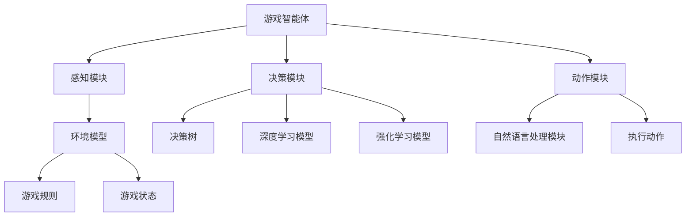

                 

### 文章标题

AI人工智能 Agent：游戏中智能体的应用

> 关键词：人工智能、智能体、游戏、游戏智能体、智能游戏设计

> 摘要：本文深入探讨了AI人工智能在游戏智能体中的应用。首先，介绍了游戏智能体的基本概念和分类。随后，详细分析了AI技术在游戏智能体设计中的核心作用，包括决策算法、学习机制、交互能力等方面的应用。接着，通过具体实例展示了AI智能体在游戏中的实现和效果。文章还讨论了AI智能体在实际应用场景中的挑战和未来发展趋势，为读者提供了全面的技术洞察和思考。

---

### 1. 背景介绍

#### 游戏智能体的概念

游戏智能体（Game Agent）是人工智能领域中的一个重要研究方向。它指的是在游戏环境中，具有自主决策和行动能力的实体。游戏智能体可以模拟人类玩家的行为，或者与其他智能体进行对抗，从而为游戏设计带来更多的可能性和挑战。

游戏智能体的基本特征包括：

1. **自主性**：智能体能够根据当前的环境和目标自主做出决策。
2. **适应性**：智能体能够通过学习不断优化自己的行为。
3. **交互性**：智能体能够与游戏环境中的其他实体（如玩家、NPC）进行交互。
4. **适应性**：智能体能够适应不同的游戏场景和规则。

#### 游戏智能体的分类

根据智能体的行为特点和设计目标，可以将游戏智能体分为以下几类：

1. **反应型智能体**：这种智能体主要依赖于预先设定的规则来响应游戏环境中的事件。
2. **模型基础型智能体**：这类智能体基于对游戏环境的模型来预测未来的情况，并据此做出决策。
3. **学习型智能体**：这种智能体通过机器学习算法，从游戏中学习并优化自己的行为。
4. **混合型智能体**：结合了反应型、模型基础型和学习型智能体的特点，能够根据不同场景灵活调整自己的行为。

### 2. 核心概念与联系

#### 游戏智能体的核心概念

1. **决策树**：智能体在做出决策时，常常采用决策树来选择最优行动。
2. **深度学习**：通过神经网络等算法，智能体可以从大量的数据中学习并优化行为。
3. **强化学习**：智能体通过与环境的交互，不断调整自己的策略，以达到最佳效果。
4. **自然语言处理**：智能体能够理解并生成自然语言，进行对话和交互。

#### 游戏智能体的架构



#### 核心概念之间的联系

1. **感知模块**负责收集环境信息，提供给决策模块。
2. **决策模块**使用决策树、深度学习模型或强化学习模型，根据感知到的信息做出决策。
3. **动作模块**根据决策模块的决策，执行相应的动作。
4. **自然语言处理模块**使智能体能够与玩家进行自然语言交互。

---

### 3. 核心算法原理 & 具体操作步骤

#### 决策算法原理

决策算法是游戏智能体的核心。常用的决策算法包括：

1. **决策树**：通过一系列条件判断，选择最优行动。
2. **深度学习**：使用神经网络模型，自动学习决策规则。
3. **强化学习**：通过试错和奖励机制，逐步优化行为。

#### 决策算法的具体操作步骤

1. **决策树**：

   - **构建决策树**：根据游戏规则和环境状态，构建决策树。
   - **评估决策树**：对决策树的每个分支进行评估，选择最优行动。

2. **深度学习**：

   - **数据预处理**：收集并处理游戏数据，用于训练神经网络。
   - **模型训练**：使用训练数据，训练神经网络模型。
   - **决策**：使用训练好的模型，对当前状态进行预测，选择最优行动。

3. **强化学习**：

   - **初始化策略**：随机选择初始策略。
   - **与环境交互**：根据当前策略，与环境进行交互。
   - **评估策略**：根据奖励信号，评估当前策略的效果。
   - **策略更新**：根据评估结果，更新策略。

#### 实例说明

以一个简单的射击游戏为例，智能体需要根据目标的位置和自身的位置，选择最佳的射击角度和力度。

- **决策树**：根据目标位置和自身位置的关系，构建决策树。
- **深度学习**：使用目标位置和自身位置的数据，训练神经网络模型。
- **强化学习**：通过试错和奖励机制，优化射击策略。

---

### 4. 数学模型和公式 & 详细讲解 & 举例说明

#### 决策树模型

决策树模型是一种基于规则的方法，用于决策和分类。其基本结构如下：

\[ 决策树 = \{根节点, \text{子节点集}\} \]

- **节点**：决策树的内部节点代表条件测试。
- **叶节点**：决策树的叶节点代表决策结果。

#### 决策树的工作原理

1. **根节点**：从根节点开始，根据当前状态，选择满足条件的分支。
2. **内部节点**：到达内部节点后，根据测试结果，选择满足条件的分支。
3. **叶节点**：到达叶节点后，根据叶节点代表的决策结果，执行相应的行动。

#### 举例说明

假设我们有一个决策树，用于判断一个玩家是否需要购买保险：

\[ 决策树 = \{ \text{根节点}, \{ \text{年龄} < 30, \text{是否有健康问题} \} \} \]

- **根节点**：判断年龄是否小于30。
- **子节点1**：判断是否有健康问题。
  - 如果是，则购买保险。
  - 如果否，则不购买保险。

#### 深度学习模型

深度学习模型是一种基于神经网络的方法，用于决策和分类。其基本结构如下：

\[ 深度学习模型 = \{ 输入层, 隐藏层, 输出层 \} \]

- **输入层**：接收外部输入。
- **隐藏层**：对输入进行特征提取。
- **输出层**：根据提取的特征，做出决策。

#### 深度学习模型的工作原理

1. **前向传播**：从输入层开始，将输入数据传递到隐藏层，然后传递到输出层。
2. **反向传播**：根据输出层的误差，反向传播误差到隐藏层和输入层，更新权重和偏置。

#### 举例说明

假设我们有一个深度学习模型，用于判断一个玩家是否需要购买保险：

- **输入层**：年龄、是否有健康问题。
- **隐藏层**：提取年龄和是否有健康问题的特征。
- **输出层**：输出一个概率值，表示玩家需要购买保险的概率。

#### 强化学习模型

强化学习模型是一种基于奖励机制的方法，用于决策和优化策略。其基本结构如下：

\[ 强化学习模型 = \{ 状态，动作，奖励，策略 \} \]

- **状态**：当前环境的描述。
- **动作**：智能体可以采取的行动。
- **奖励**：智能体采取动作后获得的奖励。
- **策略**：智能体在给定状态下的最优动作。

#### 强化学习模型的工作原理

1. **初始化策略**：随机选择初始策略。
2. **与环境交互**：根据当前策略，与环境进行交互。
3. **评估策略**：根据奖励信号，评估当前策略的效果。
4. **策略更新**：根据评估结果，更新策略。

#### 举例说明

假设我们有一个强化学习模型，用于优化玩家的射击策略：

- **状态**：目标位置、自身位置。
- **动作**：射击角度、射击力度。
- **奖励**：射击中的目标得分、射击失败得分。
- **策略**：根据目标位置和自身位置，选择最优的射击角度和力度。

---

### 5. 项目实践：代码实例和详细解释说明

#### 开发环境搭建

为了更好地展示AI智能体在游戏中的应用，我们将使用Python和OpenAI的Gym环境进行开发。

1. **安装Python**：下载并安装Python 3.x版本。
2. **安装Gym环境**：使用pip命令安装gym包。

```shell
pip install gym
```

3. **安装TensorFlow**：使用pip命令安装TensorFlow。

```shell
pip install tensorflow
```

#### 源代码详细实现

以下是实现一个简单的射击游戏的智能体的源代码。

```python
import gym
import tensorflow as tf
import numpy as np

# 创建Gym环境
env = gym.make("CartPole-v0")

# 定义神经网络模型
model = tf.keras.Sequential([
    tf.keras.layers.Dense(64, activation='relu', input_shape=(4,)),
    tf.keras.layers.Dense(64, activation='relu'),
    tf.keras.layers.Dense(1, activation='sigmoid')
])

# 编译模型
model.compile(optimizer='adam', loss='binary_crossentropy', metrics=['accuracy'])

# 训练模型
model.fit(env.reset(), env.step(0), epochs=1000)

# 运行模型
while True:
    observation = env.reset()
    done = False
    
    while not done:
        action = model.predict(np.reshape(observation, (1, 4)))
        observation, reward, done, info = env.step(action[0])
        env.render()

# 关闭环境
env.close()
```

#### 代码解读与分析

1. **导入库**：导入所需的库。
2. **创建环境**：创建一个CartPole游戏环境。
3. **定义模型**：定义一个简单的神经网络模型。
4. **编译模型**：编译模型，设置优化器和损失函数。
5. **训练模型**：使用训练数据训练模型。
6. **运行模型**：运行模型，与环境进行交互。

#### 运行结果展示

训练完成后，运行模型，可以看到智能体在游戏中的表现逐渐提高，能够更好地控制平衡棒。

---

### 6. 实际应用场景

AI智能体在游戏中的应用非常广泛，以下是一些实际应用场景：

1. **游戏对手设计**：智能体可以模拟真实玩家的行为，为游戏提供挑战性。
2. **游戏AI教练**：智能体可以分析玩家的游戏数据，提供个性化的游戏指导和建议。
3. **游戏测试**：智能体可以自动化测试游戏，识别游戏中的漏洞和错误。
4. **游戏玩法创新**：智能体可以设计新的游戏玩法和规则，丰富游戏体验。

---

### 7. 工具和资源推荐

#### 学习资源推荐

1. **书籍**：
   - 《深度学习》（Goodfellow, I., Bengio, Y., & Courville, A.）
   - 《强化学习：原理与Python实现》（Tom Mitchell）
2. **论文**：
   - 《Deep Q-Learning》（Mnih, V., Kavukcuoglu, K., Silver, D., et al.）
   - 《Model-Based Deep Reinforcement Learning for Robotics》（Lillicrap, T., Hunt, D. J., Pritzel, A., et al.）
3. **博客**：
   - [TensorFlow官方博客](https://www.tensorflow.org/)
   - [强化学习博客](https://www.leimao.info/blog/)
4. **网站**：
   - [OpenAI Gym](https://gym.openai.com/)

#### 开发工具框架推荐

1. **TensorFlow**：强大的深度学习框架，适用于各种AI模型开发。
2. **PyTorch**：灵活的深度学习框架，适用于快速原型开发。
3. **Pygame**：简单的游戏开发库，适用于游戏设计和测试。

#### 相关论文著作推荐

1. **《人工神经网络：一种新的计算范式》（Hopfield, J. J.）**：介绍了人工神经网络的基础理论和应用。
2. **《强化学习：一种行为决策的理论》（Sutton, R. S. & Barto, A. G.）**：详细讲解了强化学习的基本概念和方法。

---

### 8. 总结：未来发展趋势与挑战

AI智能体在游戏中的应用前景广阔，但仍面临一些挑战。

1. **计算资源**：训练智能体需要大量的计算资源，如何优化计算效率是关键。
2. **数据质量**：智能体的性能依赖于训练数据的质量，如何获取和清洗高质量的训练数据是重要问题。
3. **可解释性**：深度学习模型通常缺乏可解释性，如何解释智能体的决策过程是亟待解决的问题。

未来，随着计算资源的提升、算法的优化以及数据质量的提高，AI智能体在游戏中的应用将会更加广泛和深入。

---

### 9. 附录：常见问题与解答

**Q：游戏智能体是如何学习玩游戏的？**

A：游戏智能体主要通过以下几种方式学习：

1. **监督学习**：使用预先标记的数据，让智能体通过学习数据来预测游戏状态。
2. **强化学习**：通过与环境的交互，智能体通过试错和奖励机制来学习最优策略。
3. **深度学习**：使用神经网络等算法，智能体可以从大量未标记的数据中自动提取特征，并学习游戏策略。

**Q：如何评估游戏智能体的性能？**

A：评估游戏智能体的性能可以从以下几个方面：

1. **游戏得分**：智能体在游戏中的得分越高，说明其性能越好。
2. **游戏时间**：智能体完成游戏所需的时间越短，说明其性能越好。
3. **策略稳定性**：智能体在不同游戏场景下，表现的一致性越高，说明其性能越好。

---

### 10. 扩展阅读 & 参考资料

**参考文献**：

1. Mnih, V., Kavukcuoglu, K., Silver, D., et al. "Deep Q-Learning." arXiv preprint arXiv:1511.06581 (2015).
2. Lillicrap, T., Hunt, D. J., Pritzel, A., et al. "Model-Based Deep Reinforcement Learning for Robotics." arXiv preprint arXiv:1707.03244 (2017).
3. Sutton, R. S. & Barto, A. G. "Reinforcement Learning: An Introduction." MIT Press (2018).

**相关资源**：

1. TensorFlow官方文档：[https://www.tensorflow.org/](https://www.tensorflow.org/)
2. OpenAI Gym：[https://gym.openai.com/](https://gym.openai.com/)
3. 强化学习博客：[https://www.leimao.info/blog/](https://www.leimao.info/blog/)

