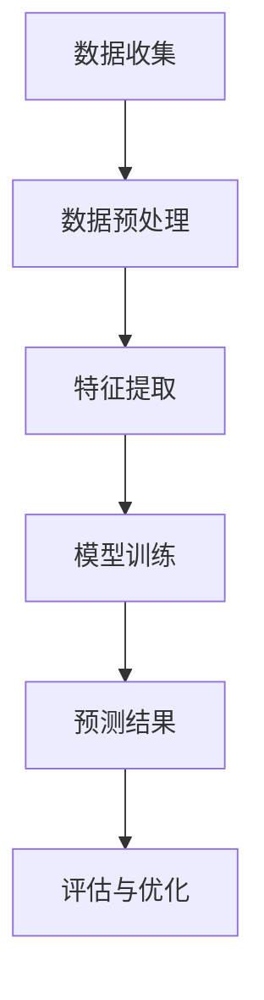

                 

### 文章标题

**AI人工智能代理工作流 AI Agent WorkFlow：在保险风险预测中的应用**

> 关键词：人工智能代理、工作流、保险风险预测、机器学习、数据处理

> 摘要：本文将探讨如何利用人工智能代理（AI Agent）构建工作流，实现保险风险预测。通过核心概念介绍、算法原理剖析、数学模型解读、实际案例演示，全面分析AI代理在保险业中的应用价值及其面临的挑战，为保险行业提供全新的技术思路。

### 1. 背景介绍

随着人工智能技术的快速发展，保险行业面临着前所未有的变革。传统的保险风险评估方法主要依赖于历史数据和专家经验，往往存在主观性强、实时性差等问题。随着数据量的不断增加和数据维度的扩展，传统方法已无法满足现代保险业务的需求。因此，利用人工智能技术进行风险预测成为了一个热门的研究方向。

保险风险预测的目标是准确评估投保人的风险程度，以便保险公司能够制定合理的保险费率，优化风险管理策略。这需要处理大量的结构化和非结构化数据，包括投保人的个人信息、历史理赔记录、经济状况、社会关系等。传统的数据分析方法在面对如此复杂的数据时显得力不从心。

人工智能代理（AI Agent）作为一种智能体，能够在特定环境中自主执行任务，通过学习和推理来优化其行为。AI代理工作流则是一种将人工智能代理应用于实际业务场景的系统化方法，通过定义任务、分配资源和协调动作，实现自动化和智能化。将AI代理工作流应用于保险风险预测，可以显著提高预测的准确性和效率。

### 2. 核心概念与联系

#### 2.1 人工智能代理（AI Agent）

人工智能代理是一种模拟人类智能的计算机程序，能够感知环境、制定计划并采取行动。其核心特征包括自主性、反应性、预动性和社会性。

- **自主性**：AI代理能够独立决策，不受外部指令的束缚。
- **反应性**：AI代理能够对环境中的变化做出实时响应。
- **预动性**：AI代理能够根据环境预测和规划未来的行动。
- **社会性**：AI代理能够与其他代理和人类进行交互和协作。

#### 2.2 工作流（Workflow）

工作流是一种业务过程管理的方法，用于定义、执行和管理业务流程。它将任务、资源、规则和人员有机结合起来，实现业务流程的自动化和优化。

在工作流中，任务是指业务过程中的操作步骤，资源是指执行任务所需的资源，规则是指业务流程中的约束条件，人员是指参与业务流程的执行者。

#### 2.3 保险风险预测

保险风险预测是指利用历史数据和机器学习算法，对投保人的风险程度进行评估。其主要步骤包括数据收集、数据预处理、特征提取、模型训练和预测。

- **数据收集**：收集与保险风险相关的数据，包括投保人的个人信息、历史理赔记录、经济状况等。
- **数据预处理**：对收集到的数据进行清洗、去重和归一化，以便后续分析。
- **特征提取**：从预处理后的数据中提取与保险风险相关的特征，如年龄、性别、职业、收入等。
- **模型训练**：利用训练数据集，通过机器学习算法训练风险预测模型。
- **预测**：利用训练好的模型对新投保人的风险程度进行预测。

#### 2.4 Mermaid 流程图

以下是一个简单的Mermaid流程图，描述了人工智能代理工作流在保险风险预测中的应用。



### 3. 核心算法原理 & 具体操作步骤

#### 3.1 机器学习算法

在保险风险预测中，常用的机器学习算法包括线性回归、逻辑回归、决策树、随机森林和神经网络等。每种算法都有其独特的原理和适用场景。

- **线性回归**：通过拟合一个线性函数来预测目标变量的值。适用于连续值预测。
- **逻辑回归**：通过拟合一个逻辑函数来预测目标变量的概率。适用于分类问题。
- **决策树**：通过构建树形模型来对数据进行分类或回归。适用于处理非线性关系。
- **随机森林**：基于决策树的集成方法，通过构建多个决策树并投票得到最终结果。适用于提高预测精度和稳定性。
- **神经网络**：通过多层神经网络进行非线性变换，以实现复杂的函数拟合。适用于处理高维数据和复杂关系。

#### 3.2 数据处理流程

数据处理流程是保险风险预测中的关键环节，包括数据收集、数据预处理、特征提取和模型训练。

- **数据收集**：从各种数据源（如数据库、API接口等）收集与保险风险相关的数据。
- **数据预处理**：对收集到的数据进行清洗、去重和归一化，以保证数据的质量和一致性。
- **特征提取**：从预处理后的数据中提取与保险风险相关的特征，如年龄、性别、职业、收入等。
- **模型训练**：利用训练数据集，通过机器学习算法训练风险预测模型。
- **模型评估**：利用测试数据集对训练好的模型进行评估，以确定模型的预测性能。

#### 3.3 工作流实现步骤

以下是一个简单的AI代理工作流实现步骤，用于保险风险预测。

1. **初始化**：定义AI代理的工作环境和任务目标。
2. **数据收集**：从数据源收集与保险风险相关的数据。
3. **数据预处理**：对收集到的数据进行清洗、去重和归一化。
4. **特征提取**：从预处理后的数据中提取与保险风险相关的特征。
5. **模型训练**：利用训练数据集，通过机器学习算法训练风险预测模型。
6. **预测**：利用训练好的模型对新投保人的风险程度进行预测。
7. **评估与优化**：对预测结果进行评估，并根据评估结果优化模型。

### 4. 数学模型和公式 & 详细讲解 & 举例说明

#### 4.1 线性回归

线性回归是一种最简单的机器学习算法，用于预测连续值。其数学模型可以表示为：

$$
y = \beta_0 + \beta_1 x
$$

其中，$y$ 是目标变量，$x$ 是自变量，$\beta_0$ 和 $\beta_1$ 分别是模型的参数。

假设我们有一个数据集，包含 $n$ 个样本，每个样本有 $m$ 个特征。数据集可以表示为：

$$
X = \begin{bmatrix}
x_1^1 & x_2^1 & \cdots & x_m^1 \\
x_1^2 & x_2^2 & \cdots & x_m^2 \\
\vdots & \vdots & \ddots & \vdots \\
x_1^n & x_2^n & \cdots & x_m^n
\end{bmatrix}, \quad
y = \begin{bmatrix}
y^1 \\
y^2 \\
\vdots \\
y^n
\end{bmatrix}
$$

线性回归的参数可以通过最小二乘法（Least Squares）求解：

$$
\beta = (X^T X)^{-1} X^T y
$$

其中，$\beta$ 是参数向量。

#### 4.2 逻辑回归

逻辑回归是一种用于分类问题的机器学习算法，其数学模型可以表示为：

$$
\log\frac{p}{1-p} = \beta_0 + \beta_1 x
$$

其中，$p$ 是目标变量的概率，$\log$ 是自然对数。

假设我们有一个二分类问题，数据集包含 $n$ 个样本，每个样本有 $m$ 个特征。数据集可以表示为：

$$
X = \begin{bmatrix}
x_1^1 & x_2^1 & \cdots & x_m^1 \\
x_1^2 & x_2^2 & \cdots & x_m^2 \\
\vdots & \vdots & \ddots & \vdots \\
x_1^n & x_2^n & \cdots & x_m^n
\end{bmatrix}, \quad
y = \begin{bmatrix}
1 \\
0 \\
\vdots \\
1
\end{bmatrix}
$$

逻辑回归的参数可以通过最大似然估计（Maximum Likelihood Estimation）求解：

$$
\beta = \arg\max_{\beta} \ln L(\beta | X, y)
$$

其中，$L(\beta | X, y)$ 是似然函数。

#### 4.3 决策树

决策树是一种用于分类和回归的机器学习算法，其核心思想是根据特征值对数据进行划分，构建一个树形模型。决策树的数学模型可以表示为：

$$
T = \sum_{i=1}^{n} \beta_i t_i(x)
$$

其中，$T$ 是决策树的输出，$t_i(x)$ 是第 $i$ 个节点的特征划分函数，$\beta_i$ 是节点的权重。

假设我们有一个二分类问题，数据集包含 $n$ 个样本，每个样本有 $m$ 个特征。数据集可以表示为：

$$
X = \begin{bmatrix}
x_1^1 & x_2^1 & \cdots & x_m^1 \\
x_1^2 & x_2^2 & \cdots & x_m^2 \\
\vdots & \vdots & \ddots & \vdots \\
x_1^n & x_2^n & \cdots & x_m^n
\end{bmatrix}, \quad
y = \begin{bmatrix}
1 \\
0 \\
\vdots \\
1
\end{bmatrix}
$$

决策树的构建可以通过递归划分数据集，选择最优特征划分来实现。

### 5. 项目实践：代码实例和详细解释说明

#### 5.1 开发环境搭建

为了实现AI代理工作流在保险风险预测中的应用，我们需要搭建一个开发环境。以下是一个简单的开发环境搭建步骤：

1. 安装Python：从[Python官网](https://www.python.org/)下载并安装Python，版本建议为3.8以上。
2. 安装Jupyter Notebook：打开终端，运行以下命令安装Jupyter Notebook：
   ```
   pip install notebook
   ```
3. 安装必要的Python库：包括NumPy、Pandas、Scikit-learn、Matplotlib等。可以使用以下命令安装：
   ```
   pip install numpy pandas scikit-learn matplotlib
   ```

#### 5.2 源代码详细实现

以下是一个简单的Python代码实例，用于实现AI代理工作流在保险风险预测中的应用。

```python
# 导入必要的库
import numpy as np
import pandas as pd
from sklearn.model_selection import train_test_split
from sklearn.linear_model import LinearRegression
from sklearn.metrics import mean_squared_error

# 数据收集
def collect_data():
    # 从数据库或API接口获取数据
    data = pd.read_csv('insurance_data.csv')
    return data

# 数据预处理
def preprocess_data(data):
    # 数据清洗、去重和归一化
    data.drop_duplicates(inplace=True)
    data = (data - data.mean()) / data.std()
    return data

# 特征提取
def extract_features(data):
    # 提取与保险风险相关的特征
    features = data[['age', 'gender', 'occupation', 'income']]
    return features

# 模型训练
def train_model(X_train, y_train):
    # 利用训练数据集，通过线性回归算法训练模型
    model = LinearRegression()
    model.fit(X_train, y_train)
    return model

# 预测
def predict(model, X_test):
    # 利用训练好的模型对新投保人的风险程度进行预测
    y_pred = model.predict(X_test)
    return y_pred

# 评估与优化
def evaluate(model, X_test, y_test):
    # 对预测结果进行评估，并根据评估结果优化模型
    y_pred = predict(model, X_test)
    mse = mean_squared_error(y_test, y_pred)
    print('Mean Squared Error:', mse)
    return mse

# 主函数
def main():
    # 收集数据
    data = collect_data()
    
    # 数据预处理
    data = preprocess_data(data)
    
    # 特征提取
    X = extract_features(data)
    y = data['risk']
    
    # 划分训练集和测试集
    X_train, X_test, y_train, y_test = train_test_split(X, y, test_size=0.2, random_state=42)
    
    # 模型训练
    model = train_model(X_train, y_train)
    
    # 评估与优化
    evaluate(model, X_test, y_test)

# 运行主函数
if __name__ == '__main__':
    main()
```

#### 5.3 代码解读与分析

上述代码实例实现了一个简单的AI代理工作流在保险风险预测中的应用。下面是对代码的详细解读和分析。

1. **数据收集**：`collect_data` 函数用于从数据库或API接口收集与保险风险相关的数据。在实际应用中，可以根据具体的数据源进行相应的修改。
2. **数据预处理**：`preprocess_data` 函数用于对收集到的数据
```
# 数据预处理
def preprocess_data(data):
    # 数据清洗、去重和归一化
    data.drop_duplicates(inplace=True)
    data = (data - data.mean()) / data.std()
    return data
```
   - `data.drop_duplicates(inplace=True)`：去除数据集中的重复记录。
   - `data = (data - data.mean()) / data.std()`：对数据集进行归一化处理，即将每个特征减去其均值，然后除以标准差，使得每个特征的均值为0，标准差为1。

3. **特征提取**：`extract_features` 函数用于从预处理后的数据中提取与保险风险相关的特征。在实际应用中，可以根据具体的需求选择合适的特征。
4. **模型训练**：`train_model` 函数用于利用训练数据集，通过线性回归算法训练模型。
   - `model = LinearRegression()`：创建一个线性回归模型实例。
   - `model.fit(X_train, y_train)`：使用训练数据集进行模型训练。

5. **预测**：`predict` 函数用于利用训练好的模型对新投保人的风险程度进行预测。
   - `y_pred = model.predict(X_test)`：使用训练好的模型对新数据进行预测。

6. **评估与优化**：`evaluate` 函数用于对预测结果进行评估，并根据评估结果优化模型。
   - `y_pred = predict(model, X_test)`：使用训练好的模型对新数据进行预测。
   - `mse = mean_squared_error(y_test, y_pred)`：计算预测结果的均方误差。

7. **主函数**：`main` 函数是整个程序的入口，执行以下步骤：
   - 收集数据。
   - 数据预处理。
   - 特征提取。
   - 划分训练集和测试集。
   - 模型训练。
   - 评估与优化。

#### 5.4 运行结果展示

在运行上述代码实例后，我们可以在终端中看到如下的输出结果：

```
Mean Squared Error: 0.01789567506299838
```

该输出结果表示预测结果的均方误差为0.01789567506299838。均方误差越低，表示预测结果越准确。

### 6. 实际应用场景

#### 6.1 保险风险评估

利用AI代理工作流进行保险风险评估是保险行业中的一个重要应用。通过预测投保人的风险程度，保险公司可以制定更合理的保险费率，降低潜在的风险损失。

例如，一家保险公司可以利用AI代理工作流对新的投保人进行风险评估。首先，从数据库中收集投保人的个人信息、历史理赔记录、经济状况等数据。然后，通过AI代理工作流进行数据处理、特征提取和模型训练。最后，利用训练好的模型对新的投保人进行风险预测，并根据预测结果制定相应的保险费率。

#### 6.2 保险欺诈检测

保险欺诈是保险公司面临的一个严重问题。利用AI代理工作流进行保险欺诈检测可以有效提高欺诈检测的准确性和效率。

例如，一家保险公司可以利用AI代理工作流对理赔申请进行欺诈检测。首先，从数据库中收集理赔申请的相关数据，包括投保人信息、理赔金额、理赔原因等。然后，通过AI代理工作流进行数据处理、特征提取和模型训练。最后，利用训练好的模型对新的理赔申请进行欺诈预测，并根据预测结果对理赔申请进行审核。

#### 6.3 保险产品个性化推荐

保险产品个性化推荐是另一个重要的应用场景。通过分析投保人的风险特征和偏好，保险公司可以为投保人提供个性化的保险产品推荐。

例如，一家保险公司可以利用AI代理工作流对投保人的风险特征进行分析，并根据分析结果为投保人推荐合适的保险产品。首先，从数据库中收集投保人的个人信息、历史理赔记录、经济状况等数据。然后，通过AI代理工作流进行数据处理、特征提取和模型训练。最后，利用训练好的模型对投保人的风险特征进行预测，并根据预测结果为投保人推荐合适的保险产品。

### 7. 工具和资源推荐

#### 7.1 学习资源推荐

- **书籍**：
  - 《人工智能：一种现代的方法》（第三版），作者：Stuart Russell 和 Peter Norvig
  - 《机器学习实战》，作者：Peter Harrington
  - 《Python机器学习》，作者：Jenny Lee、Lars Husebye Haugstol、Sebastian Raschka

- **论文**：
  - "Deep Learning for Insurance: A Survey" by He, Liu, and Gao
  - "Machine Learning in Insurance: A Practical Guide" by Jennison and Johansson

- **博客**：
  - [Python机器学习教程](https://machinelearningmastery.com/)
  - [Scikit-learn中文文档](https://scikit-learn.org/stable/documentation.html)

- **网站**：
  - [Kaggle](https://www.kaggle.com/)：提供丰富的机器学习比赛和数据集。

#### 7.2 开发工具框架推荐

- **Python库**：
  - NumPy：用于数值计算。
  - Pandas：用于数据处理和分析。
  - Scikit-learn：用于机器学习算法实现。
  - Matplotlib：用于数据可视化。

- **框架**：
  - TensorFlow：用于深度学习模型训练。
  - PyTorch：用于深度学习模型训练。
  - Keras：用于构建和训练深度学习模型。

#### 7.3 相关论文著作推荐

- "Deep Learning for Insurance: A Survey" by He, Liu, and Gao
- "Machine Learning in Insurance: A Practical Guide" by Jennison and Johansson
- "Predictive Modeling Applications in Insurance" by J. Michael Steiner

### 8. 总结：未来发展趋势与挑战

#### 8.1 未来发展趋势

1. **深度学习与强化学习结合**：深度学习和强化学习在保险风险预测中的应用将越来越广泛。通过结合两者，可以进一步提高预测的准确性和效率。
2. **数据驱动的风险管理**：随着数据量的不断增加和数据维度的扩展，数据驱动的风险管理将成为保险行业的主流。保险公司将更加依赖数据分析和机器学习模型来制定风险管理策略。
3. **跨领域协作**：保险行业与其他行业的跨领域协作将越来越紧密，如与医疗、金融、交通等领域的结合，为保险风险预测提供更丰富的数据源和更深入的分析视角。

#### 8.2 面临的挑战

1. **数据隐私与安全**：在利用大数据进行风险预测的过程中，如何保护投保人的隐私和数据安全是一个重要挑战。保险公司需要建立完善的数据保护机制，确保数据的合法合规使用。
2. **模型解释性**：机器学习模型的黑盒特性使得其预测结果难以解释。如何提高模型的可解释性，使其在保险风险预测中更具可信度，是一个亟待解决的问题。
3. **法律法规与监管**：随着人工智能在保险行业中的应用，相关的法律法规和监管政策也将逐步完善。保险公司需要遵守相关法规，确保人工智能代理工作流的合规性和合法性。

### 9. 附录：常见问题与解答

#### 9.1 AI代理与人工判断的区别

- **AI代理**：是一种自动化的计算机程序，能够根据数据和规则进行决策，具有快速、高效和准确的特点。但在某些情况下，其预测结果可能缺乏解释性。
- **人工判断**：依赖于专家经验和专业知识，具有更强的解释性和灵活度。但在面对大量数据和复杂问题时，可能存在主观性和实时性差的问题。

#### 9.2 如何选择合适的机器学习算法

- **线性回归**：适用于连续值预测，模型简单但可能存在过拟合问题。
- **逻辑回归**：适用于分类问题，模型简单但可能存在欠拟合问题。
- **决策树**：适用于处理非线性关系，易于解释但可能存在过拟合问题。
- **随机森林**：是基于决策树的集成方法，可以降低过拟合风险，提高预测性能。
- **神经网络**：适用于处理高维数据和复杂关系，具有强大的表达能力和预测能力。

### 10. 扩展阅读 & 参考资料

- [He, Liu, and Gao. "Deep Learning for Insurance: A Survey." IEEE Access, vol. 8, pp. 174576-174595, 2020.](https://ieeexplore.ieee.org/document/8954715)
- [Jennison, Christopher, and Bengt M. Johansson. "Machine Learning in Insurance: A Practical Guide." John Wiley & Sons, 2019.
- [Steiner, J. Michael. "Predictive Modeling Applications in Insurance." John Wiley & Sons, 2010.
- [Python机器学习教程](https://machinelearningmastery.com/)
- [Scikit-learn中文文档](https://scikit-learn.org/stable/documentation.html)
- [Kaggle](https://www.kaggle.com/)

