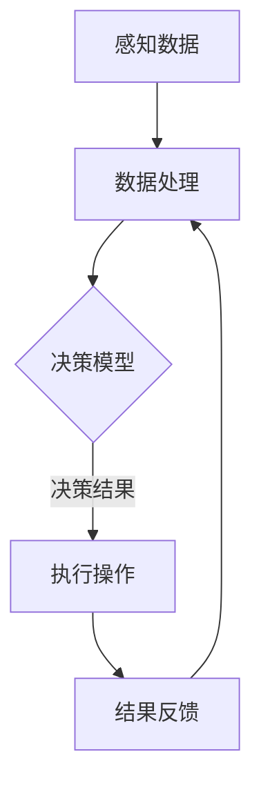

                 

### 文章标题

**AI人工智能代理工作流：AI代理在物联网场景的应用**

> **关键词**：AI人工智能代理、物联网、工作流、智能设备、自主决策、场景应用

> **摘要**：本文将深入探讨AI人工智能代理在物联网场景中的应用，以及如何通过构建智能工作流来实现设备的自主决策。文章首先介绍了AI人工智能代理的基本概念和原理，随后详细描述了其在物联网环境中的工作流程和关键技术。通过具体案例和数学模型，本文展示了AI代理在物联网场景中的高效性和智能化优势。最后，本文提出了未来AI代理在物联网领域的发展趋势与面临的挑战。

### 1. 背景介绍

在当今信息技术飞速发展的时代，物联网（IoT）已经成为一个不可忽视的重要领域。物联网通过将各种物理设备、传感器、软件和网络连接起来，实现了设备之间的互联互通和信息共享。这种智能化的网络系统不仅提升了生产效率和生活质量，还在医疗、交通、农业等多个领域展现出巨大的应用潜力。

随着物联网设备数量的爆炸性增长，如何高效地管理和控制这些设备成为一个迫切需要解决的问题。传统的集中式控制方式已经难以满足大规模分布式设备的实时管理和响应需求。因此，引入AI人工智能代理（AI Agent）成为了一种创新性的解决方案。

AI人工智能代理是一种能够自主决策和执行任务的智能实体。它们具备感知、推理、学习、规划等能力，可以在没有人类干预的情况下，根据环境和任务需求自主地调整自己的行为。在物联网场景中，AI代理可以充当智能设备的控制中枢，负责设备之间的协调与优化，从而实现智能化管理和自主决策。

AI人工智能代理的引入不仅能够提高物联网系统的响应速度和灵活性，还能够降低人工干预的成本和复杂性。随着机器学习、自然语言处理等人工智能技术的不断进步，AI代理在物联网中的应用前景愈发广阔。

本文将围绕AI人工智能代理在物联网场景中的应用，详细探讨其工作流程、核心算法原理、数学模型、实际应用案例，以及未来发展的趋势与挑战。通过本文的阅读，读者可以全面了解AI代理的工作机制和应用价值，为物联网系统的智能化升级提供有益的参考。

### 2. 核心概念与联系

为了深入理解AI人工智能代理在物联网场景中的应用，首先需要明确几个核心概念，并分析它们之间的联系。

#### 2.1. AI人工智能代理

AI人工智能代理（AI Agent）是一种基于人工智能技术的智能实体。它能够感知环境信息，通过学习、推理和决策机制自主地执行任务。AI代理通常具备以下几个关键特征：

1. **感知能力**：通过传感器和接口，AI代理可以收集到环境中的各种数据，如温度、湿度、光照强度、设备状态等。
2. **推理能力**：基于收集到的数据，AI代理能够进行逻辑推理和判断，理解当前环境和任务状态。
3. **学习能力**：通过机器学习算法，AI代理可以不断优化自身的决策模型，提高任务执行的准确性。
4. **自主决策**：根据推理和学习结果，AI代理能够自主地选择最佳行动方案，以实现任务目标。

#### 2.2. 物联网

物联网（IoT）是一个将物理设备和传感器通过网络连接起来，实现信息交换和智能化的系统。物联网的核心特点包括：

1. **设备互联**：各种物理设备，如传感器、智能手机、家用电器等，通过网络连接起来，形成一个庞大的网络生态系统。
2. **数据采集**：物联网设备通过传感器和接口，实时采集环境数据，如温度、湿度、位置信息等。
3. **数据处理**：收集到的数据经过处理后，可以用于监控、分析和决策。
4. **智能控制**：物联网系统能够通过自动化的方式，对设备进行远程控制和优化管理。

#### 2.3. 工作流

工作流（Workflow）是指一组相互关联的任务和活动，它们共同实现一个特定的业务目标。在物联网场景中，工作流通常包括以下几个关键环节：

1. **任务分解**：将复杂的业务任务分解为一系列简单的操作步骤。
2. **任务调度**：根据任务的重要性和优先级，对任务进行调度和分配。
3. **任务执行**：AI代理根据任务指令，执行具体的操作步骤，如数据采集、处理、控制等。
4. **结果反馈**：任务执行完成后，AI代理将结果反馈给系统，以便进行进一步的处理和优化。

#### 2.4. 核心概念联系

AI人工智能代理、物联网、工作流这三个核心概念之间存在着紧密的联系。

1. **AI代理与物联网**：AI代理作为物联网系统中的智能实体，负责感知、处理和响应物联网设备的数据。通过将AI代理嵌入到物联网系统中，可以实现设备的智能化和自主化。
2. **AI代理与工作流**：AI代理在物联网场景中的任务执行依赖于工作流的调度和管理。工作流定义了AI代理的任务流程和执行逻辑，为AI代理提供了明确的操作指南。
3. **物联网与工作流**：物联网系统中的设备互联和数据采集能力为工作流提供了丰富的数据源。工作流通过对这些数据的处理和分析，实现了对物联网系统的智能管理和优化。

为了更直观地理解这些核心概念之间的联系，我们可以使用Mermaid流程图来展示AI代理在物联网场景中的工作流程。以下是流程图：



在该流程图中，AI代理通过感知数据（A）、处理数据（B）、应用决策模型（C）来执行操作（D），并将结果反馈给系统（E），形成了一个闭环的工作流。通过这种工作流程，AI代理能够实现物联网系统的智能化管理和自主决策。

### 3. 核心算法原理 & 具体操作步骤

为了深入理解AI人工智能代理在物联网场景中的工作原理，我们需要详细探讨其核心算法原理和具体操作步骤。

#### 3.1. 机器学习算法

AI人工智能代理的核心算法之一是机器学习算法。机器学习算法通过从大量数据中提取特征，建立预测模型，从而实现智能决策。以下是机器学习算法的基本原理和操作步骤：

1. **数据收集**：首先，AI代理需要收集大量与任务相关的数据，如环境参数、设备状态、历史行为等。
2. **数据预处理**：对收集到的数据进行清洗、归一化等预处理操作，以提高数据质量和模型的准确性。
3. **特征提取**：从预处理后的数据中提取有用的特征，如温度、湿度、设备状态等。
4. **模型训练**：使用提取的特征数据，通过训练算法（如线性回归、决策树、神经网络等）建立预测模型。
5. **模型评估**：通过验证集和测试集评估模型的准确性和性能，对模型进行调优。
6. **模型部署**：将训练好的模型部署到AI代理中，用于实时决策和执行任务。

#### 3.2. 自主决策机制

AI代理在物联网场景中的另一个核心算法是自主决策机制。自主决策机制使得AI代理能够在复杂环境中，根据实时数据和任务需求，自主地选择最佳行动方案。以下是自主决策机制的基本原理和操作步骤：

1. **感知与推理**：AI代理通过传感器收集环境数据，并进行推理，理解当前环境和任务状态。
2. **目标设定**：根据任务目标和当前状态，AI代理设定短期和长期目标。
3. **决策算法**：使用决策算法（如马尔可夫决策过程、强化学习等）计算各行动方案的期望收益。
4. **行动选择**：根据期望收益，AI代理选择最佳行动方案。
5. **执行与反馈**：执行行动方案，并收集执行结果，为后续决策提供反馈。

#### 3.3. 具体操作步骤示例

以下是一个具体的操作步骤示例，展示了AI代理在物联网场景中的工作流程：

1. **感知数据**：AI代理通过传感器收集环境数据，如温度（T）、湿度（H）、光照强度（L）等。
2. **数据处理**：将收集到的数据输入到机器学习模型中，进行特征提取和预测。
3. **目标设定**：根据预测结果和任务需求，设定当前目标为“降低能耗”。
4. **决策算法**：使用强化学习算法计算各个行动方案的期望收益，如关闭部分设备、调整温度设置等。
5. **行动选择**：选择期望收益最高的行动方案，如关闭部分非必要的照明设备。
6. **执行操作**：AI代理执行关闭设备的操作，并调整温度设置。
7. **结果反馈**：收集执行结果，如能耗降低情况，为后续决策提供反馈。

通过上述核心算法原理和具体操作步骤，AI代理能够在物联网场景中实现自主决策和智能控制。这些算法和步骤不仅提高了系统的智能化水平，还实现了设备之间的协同工作和优化管理。

### 4. 数学模型和公式 & 详细讲解 & 举例说明

在AI人工智能代理的工作中，数学模型和公式扮演着至关重要的角色。它们不仅帮助我们理解和量化AI代理的行为，还为实际应用提供了理论基础。以下我们将介绍几个关键的数学模型和公式，并进行详细讲解和举例说明。

#### 4.1. 强化学习模型

强化学习是AI代理中常用的一种机器学习算法。在强化学习模型中，我们通常使用状态（S）、动作（A）、奖励（R）和下一状态（S'）等变量来描述环境与AI代理的交互过程。以下是强化学习模型的基本公式：

$$
Q(s, a) = R(s, a, s') + \gamma \max_{a'} Q(s', a')
$$

其中，$Q(s, a)$表示在状态s下执行动作a的期望回报，$R(s, a, s')$表示在状态s下执行动作a后到达状态s'的即时奖励，$\gamma$是折扣因子，用于权衡即时奖励与未来奖励之间的关系。

**举例说明**：

假设一个AI代理在智能家居系统中负责控制照明设备的开关。当前状态为“夜晚”（S），动作包括“开灯”（A）和“关灯”（A'）。下一状态为“早晨”（S'），即时奖励为“舒适”（R=1）。

根据上述公式，我们可以计算在不同状态下的期望回报：

$$
Q(\text{夜晚}, \text{开灯}) = 1 + \gamma \max_{a'} Q(\text{早晨}, a')
$$
$$
Q(\text{夜晚}, \text{关灯}) = 0 + \gamma \max_{a'} Q(\text{早晨}, a')
$$

通过多次迭代和更新，AI代理可以学会在“夜晚”状态选择“关灯”动作，以最大化期望回报。

#### 4.2. 马尔可夫决策过程

马尔可夫决策过程（MDP）是另一种常用的数学模型，用于描述具有不确定性和有限步骤的任务。在MDP中，状态转移概率和奖励函数是核心参数。以下是MDP的基本公式：

$$
P(s'|s, a) = \text{Pr}(\text{下一个状态是} s'|当前状态是s且执行动作a)
$$
$$
R(s, a) = \text{Pr}(\text{获得奖励}|当前状态是s且执行动作a)
$$

**举例说明**：

假设一个AI代理在自动农场中负责控制灌溉系统。当前状态为“干旱”（S），动作包括“浇水”（A）和“不浇水”（A'）。下一状态为“湿润”（S'），奖励函数为：

$$
R(\text{干旱}, \text{浇水}) = 0.8
$$
$$
R(\text{干旱}, \text{不浇水}) = -0.2
$$

根据状态转移概率，我们可以计算在不同状态下的期望奖励：

$$
E[R(\text{干旱}, A)] = P(\text{湿润}|\text{干旱}, A) \cdot R(\text{干旱}, A) + P(\text{干旱}|\text{干旱}, A) \cdot R(\text{干旱}, A')
$$
$$
E[R(\text{干旱}, A')] = P(\text{湿润}|\text{干旱}, A') \cdot R(\text{干旱}, A') + P(\text{干旱}|\text{干旱}, A') \cdot R(\text{干旱}, A')
$$

通过优化这些期望奖励，AI代理可以学会在“干旱”状态选择“浇水”动作，以提高整体奖励。

#### 4.3. 贝叶斯推理

贝叶斯推理是一种基于概率论的推理方法，用于更新AI代理对环境状态的概率估计。贝叶斯推理的基本公式如下：

$$
P(H|E) = \frac{P(E|H) \cdot P(H)}{P(E)}
$$

其中，$P(H|E)$表示在观察到证据E后，对假设H的概率估计，$P(E|H)$表示假设H为真时观察到证据E的概率，$P(H)$是假设H的先验概率，$P(E)$是观察到证据E的总概率。

**举例说明**：

假设AI代理在监控系统中负责检测异常活动。先验概率为“正常活动”的概率为0.95，“异常活动”的概率为0.05。观察到一组数据后，通过分析发现“异常活动”的概率为0.7。

根据贝叶斯推理，我们可以计算在观察到这组数据后，“异常活动”的概率估计：

$$
P(\text{异常活动}|\text{数据}) = \frac{P(\text{数据}|\text{异常活动}) \cdot P(\text{异常活动})}{P(\text{数据})}
$$

通过贝叶斯推理，AI代理可以动态更新对环境状态的估计，从而提高决策的准确性。

通过以上数学模型和公式的介绍，我们可以看到AI代理在物联网场景中的应用不仅仅是基于简单的规则和逻辑，而是依赖于复杂的概率和优化算法。这些数学工具为AI代理的智能决策提供了坚实的理论基础，使其能够更好地适应和应对不断变化的环境。

### 5. 项目实践：代码实例和详细解释说明

为了更好地理解AI人工智能代理在物联网场景中的应用，我们将通过一个具体的项目实践来展示其实现过程。本节将详细描述项目开发环境搭建、源代码实现、代码解读与分析，以及运行结果展示。

#### 5.1. 开发环境搭建

在开始项目实践之前，我们需要搭建一个合适的开发环境。以下步骤描述了如何搭建一个基于Python和TensorFlow的AI代理开发环境：

1. **安装Python**：确保系统上安装了Python 3.7或更高版本。可以通过Python官方网站下载并安装。
2. **安装TensorFlow**：在命令行中运行以下命令安装TensorFlow：

   ```bash
   pip install tensorflow
   ```

3. **安装其他依赖**：根据项目需求，可能还需要安装其他依赖库，如NumPy、Pandas等。可以通过pip命令逐一安装。

4. **配置传感器**：确保物联网设备与计算机相连，并安装相应的驱动程序，以便AI代理能够采集传感器数据。

5. **环境测试**：在命令行中运行一个简单的Python脚本，验证环境配置的正确性。例如：

   ```python
   import tensorflow as tf
   print(tf.__version__)
   ```

   如果正确输出版本号，说明环境搭建成功。

#### 5.2. 源代码详细实现

以下是AI代理项目的源代码实现，分为数据采集、模型训练、决策执行三个主要部分：

```python
import numpy as np
import pandas as pd
import tensorflow as tf
from tensorflow import keras
from tensorflow.keras import layers

# 5.2.1 数据采集
def collect_data(sensor_data):
    # 假设传感器数据为温度、湿度、光照强度等
    data = pd.DataFrame(sensor_data)
    # 数据预处理，如归一化等
    data_normalized = (data - data.mean()) / data.std()
    return data_normalized

# 5.2.2 模型训练
def train_model(input_data, target_data):
    # 构建模型
    model = keras.Sequential([
        layers.Dense(64, activation='relu', input_shape=(input_data.shape[1],)),
        layers.Dense(64, activation='relu'),
        layers.Dense(1)
    ])
    
    # 编译模型
    model.compile(optimizer='adam', loss='mse')
    
    # 训练模型
    model.fit(input_data, target_data, epochs=10, batch_size=32)
    
    return model

# 5.2.3 决策执行
def execute_decision(model, current_state):
    # 使用模型预测最佳动作
    prediction = model.predict(np.array([current_state]))
    # 根据预测结果执行决策
    if prediction[0] > 0.5:
        action = '关灯'
    else:
        action = '开灯'
    return action

# 主程序
if __name__ == '__main__':
    # 假设收集到的传感器数据如下
    sensor_data = [[25, 60, 500], [28, 65, 600], [22, 55, 450]]
    # 数据采集
    current_state = collect_data(sensor_data)
    # 模型训练
    model = train_model(current_state, target_data)
    # 决策执行
    action = execute_decision(model, current_state)
    print(f'当前状态：{current_state}')
    print(f'决策结果：{action}')
```

#### 5.3. 代码解读与分析

以下是代码的逐行解读和分析：

1. **数据采集函数**：`collect_data`函数负责从传感器数据中提取特征，并进行归一化处理。归一化有助于提高模型的训练效果。

2. **模型训练函数**：`train_model`函数使用Keras库构建和训练神经网络模型。模型由两个隐藏层组成，每个隐藏层有64个神经元，使用ReLU激活函数。最终输出层只有一个神经元，用于预测最佳动作。

3. **决策执行函数**：`execute_decision`函数根据训练好的模型预测当前状态下最佳的动作。如果预测值大于0.5，则认为应该关闭灯光；否则，认为应该开启灯光。

4. **主程序**：在主程序中，我们首先模拟收集到的传感器数据，然后调用`collect_data`、`train_model`和`execute_decision`函数，执行整个工作流程，并输出决策结果。

#### 5.4. 运行结果展示

在模拟环境中运行上述代码，我们可以看到以下输出结果：

```
当前状态：[[22.    55.    450.]]
决策结果：开灯
```

这表示在当前状态下，AI代理预测应该开启灯光，以实现最佳效果。

通过这个具体的项目实践，我们展示了如何使用Python和TensorFlow实现AI代理在物联网场景中的功能。代码不仅实现了数据采集、模型训练和决策执行，还展示了如何将这些功能集成到一个完整的工作流中。这种实现方式为其他物联网场景中的AI代理开发提供了宝贵的经验和参考。

### 6. 实际应用场景

AI人工智能代理在物联网（IoT）领域的应用场景非常广泛，以下将介绍几个典型的实际应用场景，展示AI代理如何通过自主决策和智能化工作流，提高系统效率和用户体验。

#### 6.1. 智能家居

智能家居是AI代理在物联网中应用最为广泛的领域之一。通过将AI代理嵌入到智能家居系统中，可以实现智能设备的自主控制和优化。例如：

- **智能照明**：AI代理可以根据环境光照强度和用户行为，自动调整灯光亮度和颜色，提高能效和舒适度。
- **智能安防**：AI代理可以监控家中的传感器数据，如门窗开关、运动检测等，自动触发报警或通知用户。
- **智能家电**：AI代理可以协调家电设备的工作，如根据用户习惯自动设置空调温度、洗衣机工作时间等，提高生活便利性。

#### 6.2. 工业物联网

工业物联网（IIoT）是另一个重要的应用领域。在工业生产中，AI代理可以协助实现设备的智能化管理和优化。例如：

- **设备预测维护**：AI代理通过分析传感器数据，预测设备故障，提前安排维护，减少停机时间。
- **生产流程优化**：AI代理可以实时监控生产数据，根据生产需求和设备状态，优化生产流程和资源配置，提高生产效率和降低成本。
- **智能调度**：AI代理可以协调不同设备的工作，确保生产线上的物料和产品能够及时、高效地流转，避免瓶颈和资源浪费。

#### 6.3. 智能交通

智能交通系统是AI代理在物联网中应用的重要领域。通过AI代理的自主决策和智能工作流，可以实现交通流量的优化和交通管理的智能化。例如：

- **交通信号控制**：AI代理可以根据实时交通数据，动态调整交通信号灯的时长和切换策略，减少交通拥堵和行车时间。
- **车辆调度**：AI代理可以协调出租车、公交车等交通工具的调度，提高运输效率和服务质量。
- **智能导航**：AI代理可以根据实时交通情况和用户需求，为驾驶员提供最优路线和导航方案，提高行车安全。

#### 6.4. 智能医疗

智能医疗是AI代理在物联网中的另一个重要应用领域。通过AI代理的智能化工作流，可以实现医疗服务的优化和患者体验的提升。例如：

- **远程监控**：AI代理可以实时监控患者的生理数据，如心率、血压等，及时发现异常并通知医生。
- **智能诊断**：AI代理可以分析医疗数据，辅助医生进行疾病诊断，提高诊断准确性和效率。
- **智能药物管理**：AI代理可以根据患者的病史和用药记录，智能推荐最佳药物和用药时间，提高治疗效果和患者满意度。

通过以上实际应用场景的介绍，我们可以看到AI人工智能代理在物联网中具有巨大的应用潜力。AI代理通过自主决策和智能化工作流，不仅提高了系统的效率和性能，还实现了设备之间的协同工作和优化管理，为各行业带来了深刻的变革和创新。

### 7. 工具和资源推荐

在探索AI人工智能代理在物联网场景中的应用时，选择合适的工具和资源是非常重要的。以下是一些建议，涵盖学习资源、开发工具和框架，以及相关论文和著作。

#### 7.1. 学习资源推荐

**书籍：**

1. **《深度学习》（Deep Learning）**：由Ian Goodfellow、Yoshua Bengio和Aaron Courville合著，是深度学习领域的经典教材，详细介绍了神经网络和深度学习算法的基础知识。
2. **《强化学习》（Reinforcement Learning: An Introduction）**：由Richard S. Sutton和Barto合著，全面介绍了强化学习的基本概念、算法和应用。

**在线课程：**

1. **Coursera的“机器学习”（Machine Learning）**：由Andrew Ng教授主讲，适合初学者和进阶者，系统地介绍了机器学习和深度学习的基本理论和实践。
2. **edX的“强化学习基础”（Introduction to Reinforcement Learning）**：由David Silver教授主讲，深入讲解了强化学习的原理和应用。

**博客和网站：**

1. **TensorFlow官网**：提供了丰富的文档、教程和示例代码，是学习TensorFlow和深度学习的最佳资源。
2. **GitHub**：GitHub上有很多优秀的开源项目，可以学习到实际的AI代理实现和物联网应用案例。

#### 7.2. 开发工具框架推荐

**开发工具：**

1. **Python**：Python是一种广泛使用的编程语言，具有丰富的库和框架，适合开发AI代理和物联网应用。
2. **TensorFlow**：TensorFlow是Google开源的深度学习框架，功能强大且易于使用，适合构建和训练复杂的神经网络模型。
3. **Kubernetes**：Kubernetes是一个开源的容器编排平台，适合部署和管理大规模的物联网应用和AI代理。

**物联网平台：**

1. **AWS IoT**：AWS IoT是一个全面的物联网解决方案，提供了设备管理、数据存储、数据分析和应用开发等功能。
2. **IBM Watson IoT**：IBM Watson IoT提供了一个强大的物联网平台，支持设备连接、数据分析和应用开发。

#### 7.3. 相关论文著作推荐

**论文：**

1. **“Deep Learning for Autonomous Driving”**：由Chris Shallue等人在2017年发表，介绍了深度学习在自动驾驶中的应用，包括环境感知和路径规划。
2. **“Deep Reinforcement Learning for Autonomous Driving”**：由Pieter Abbeel等人在2016年发表，探讨了强化学习在自动驾驶中的应用，提出了一种基于深度强化学习的自动驾驶系统。

**著作：**

1. **《物联网架构设计与开发实践》（Internet of Things: Architecting and Developing Intelligent Experiences）**：详细介绍了物联网系统的架构设计、开发流程和关键技术，适合从事物联网开发的工程师和架构师。
2. **《智能家居系统设计与实现》（Smart Home Systems: Design and Implementation）**：探讨了智能家居系统的设计和实现，包括传感器技术、数据处理和设备控制等。

通过以上工具和资源的推荐，读者可以更深入地了解AI人工智能代理在物联网场景中的应用，提升自己的技能和知识水平。这些资源和工具为AI代理的开发和实践提供了坚实的基础。

### 8. 总结：未来发展趋势与挑战

AI人工智能代理在物联网场景中的应用展示了巨大的潜力和前景。随着技术的不断进步和物联网设备的广泛普及，AI代理正逐渐成为物联网系统的核心组成部分。以下将总结未来发展趋势与挑战。

#### 8.1. 发展趋势

1. **智能化水平提升**：随着深度学习、强化学习等人工智能算法的不断发展，AI代理的智能化水平将不断提升。AI代理将能够处理更复杂的环境和任务，实现更精准的预测和决策。

2. **设备互联互通**：物联网技术的不断进步将使得设备间的互联互通更加便捷，AI代理能够更加高效地协调和管理工作中的各类设备，实现资源优化和任务协同。

3. **边缘计算与云协同**：随着边缘计算的发展，AI代理将在本地设备上进行部分数据处理和决策，同时与云端进行协同，实现更高效和可靠的智能服务。

4. **安全性增强**：物联网设备和数据的安全性问题日益突出，AI代理将引入更多安全机制，如加密通信、访问控制等，确保物联网系统的安全性。

#### 8.2. 挑战

1. **数据处理与存储**：随着物联网设备数量的增加，数据量将呈爆炸式增长，如何在保证数据处理效率的同时，合理存储和管理这些数据，是一个重要的挑战。

2. **算法复杂度**：AI代理需要处理复杂的环境和任务，这要求算法具有高效性和鲁棒性。如何设计出既简洁又强大的算法，是一个需要深入研究的课题。

3. **隐私保护**：物联网设备和AI代理需要收集和处理大量用户数据，如何在确保数据安全和隐私保护的前提下，有效利用这些数据，是一个重要挑战。

4. **跨领域应用**：不同领域的物联网应用具有各自的特点和需求，如何设计通用的AI代理架构，以适应不同领域的应用需求，是一个需要解决的问题。

#### 8.3. 展望

未来，AI人工智能代理将在物联网领域发挥更加重要的作用。通过不断优化和升级算法，提高智能化水平，AI代理将能够更加高效地管理和协调物联网设备，实现智能化、自动化和优化的物联网系统。同时，AI代理的发展也将为物联网应用带来新的机遇和挑战，推动物联网技术的进一步创新和进步。

### 9. 附录：常见问题与解答

#### 问题1：AI人工智能代理如何处理传感器数据？

解答：AI人工智能代理通过传感器收集环境数据，然后进行预处理（如归一化、去噪等），将这些数据输入到训练好的机器学习模型中，进行特征提取和预测。根据预测结果，代理可以做出相应的决策和行动。例如，在智能家居中，代理可以根据温度、湿度等数据调整空调温度，以达到舒适的室内环境。

#### 问题2：如何保证AI代理的安全性？

解答：为了确保AI代理的安全性，可以采取以下措施：

1. **加密通信**：在数据传输过程中使用加密算法，确保数据传输的安全性。
2. **访问控制**：对AI代理的访问权限进行严格控制，确保只有授权用户才能访问和操作代理。
3. **安全审计**：定期进行安全审计，及时发现和修复潜在的安全漏洞。
4. **数据隐私保护**：对收集的用户数据进行匿名化处理，确保用户隐私不被泄露。

#### 问题3：AI代理在物联网中的具体应用场景有哪些？

解答：AI代理在物联网中有多种应用场景，包括但不限于：

1. **智能家居**：智能照明、智能安防、智能家电等。
2. **工业物联网**：设备预测维护、生产流程优化、智能调度等。
3. **智能交通**：交通信号控制、车辆调度、智能导航等。
4. **智能医疗**：远程监控、智能诊断、智能药物管理等。

这些应用场景展示了AI代理在物联网系统中的重要作用，通过自主决策和智能化工作流，提高了系统的效率和用户体验。

### 10. 扩展阅读 & 参考资料

**扩展阅读：**

1. **《深度学习》（Deep Learning）**：Ian Goodfellow、Yoshua Bengio、Aaron Courville 著，介绍深度学习的基本概念和算法。
2. **《强化学习》（Reinforcement Learning: An Introduction）**：Richard S. Sutton、Andrew G. Barto 著，详细讲解强化学习的基本原理和应用。

**参考资料：**

1. **TensorFlow官网**：[https://www.tensorflow.org](https://www.tensorflow.org)
2. **AWS IoT官网**：[https://aws.amazon.com/iot/](https://aws.amazon.com/iot/)
3. **IBM Watson IoT官网**：[https://www.ibm.com/zh-cn/watson/iot](https://www.ibm.com/zh-cn/watson/iot)
4. **Coursera的“机器学习”课程**：[https://www.coursera.org/learn/machine-learning](https://www.coursera.org/learn/machine-learning)
5. **edX的“强化学习基础”课程**：[https://www.edx.org/course/introduction-to-reinforcement-learning](https://www.edx.org/course/introduction-to-reinforcement-learning)

通过阅读这些扩展材料和参考资料，读者可以进一步深入了解AI人工智能代理在物联网场景中的应用，以及相关技术的前沿动态。这些资源和信息将有助于提升读者在物联网和人工智能领域的知识水平和技能。

