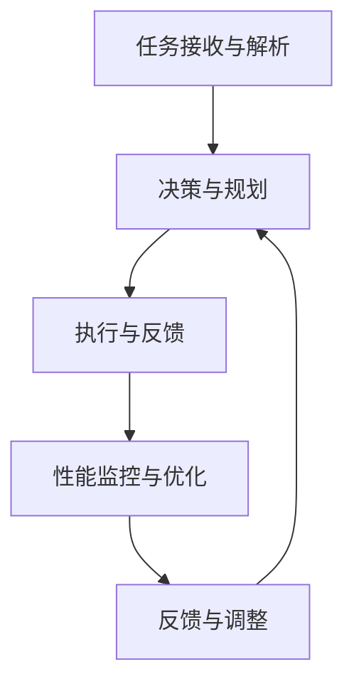

                 

### 文章标题

《AI人工智能代理工作流AI Agent WorkFlow：AI代理性能监控指标与分析技术》

关键词：人工智能代理，工作流，性能监控，指标分析，技术

摘要：本文深入探讨了AI代理工作流的概念、性能监控指标及其分析技术。通过对AI代理的运行机制和性能监控方法进行详细解析，为AI代理系统的优化和可靠性提供了科学依据。

## 1. 背景介绍

在当今数字化时代，人工智能（AI）技术的迅猛发展已经渗透到各个行业。AI代理，作为AI技术的应用载体，已经在自动化、智能化方面发挥了重要作用。AI代理，简而言之，是一种能够模拟人类智能行为、完成特定任务的自动化系统。随着AI技术的进步，AI代理的应用场景越来越广泛，从智能家居、自动驾驶到金融风控、医疗诊断，AI代理正在改变着我们的生活方式。

然而，随着AI代理系统的复杂度不断增加，其性能监控和优化成为了一个至关重要的问题。性能监控不仅是确保系统稳定运行的基础，更是提升系统效率和降低成本的关键。因此，研究和开发一套有效的AI代理性能监控指标和分析技术，对于推动AI代理技术的发展和应用具有重要意义。

本文将首先介绍AI代理工作流的基本概念和组成部分，然后深入探讨AI代理性能监控的核心指标及其分析技术，最后通过实际案例展示这些技术的应用效果。希望通过本文的阐述，能够为从事AI代理开发的工程师和研究人员提供有价值的参考。

## 2. 核心概念与联系

### AI代理工作流

AI代理工作流是指将人工智能技术应用于实际场景中的全过程，包括任务分配、代理执行、结果反馈等环节。AI代理工作流的核心组成部分如下：

1. **任务接收与解析**：AI代理从系统中接收任务，并解析任务的详细内容，包括任务的类型、目标、约束条件等。

2. **决策与规划**：基于解析的任务内容，AI代理进行决策和规划，确定任务执行的具体步骤和策略。

3. **执行与反馈**：AI代理按照决策和规划执行任务，并在执行过程中不断反馈执行状态和结果。

4. **性能监控与优化**：在任务执行过程中，AI代理的性能监控系统会实时监测各项性能指标，并根据监控结果进行优化调整。

### 性能监控指标

性能监控指标是衡量AI代理工作流运行效果的重要工具。以下是一些常见的性能监控指标：

1. **响应时间**：从任务接收至任务完成所需的时间，是衡量系统效率的重要指标。

2. **吞吐量**：单位时间内系统能够处理的任务数量，反映了系统的负载能力。

3. **错误率**：任务执行过程中出现错误的频率，是衡量系统稳定性的重要指标。

4. **资源利用率**：系统资源（如CPU、内存、网络等）的利用程度，是优化系统资源分配的重要依据。

5. **用户满意度**：用户对系统性能的主观评价，综合反映了系统的易用性和用户体验。

### Mermaid 流程图

为了更直观地展示AI代理工作流的运行机制和性能监控指标，以下是一个使用Mermaid绘制的流程图：



在流程图中，每个节点代表工作流的一个环节，箭头表示任务的流动方向。性能监控与优化节点循环出现，表明性能监控在整个工作流中是一个持续的过程。

通过上述核心概念和流程图的介绍，我们可以更清晰地理解AI代理工作流的运作机制和性能监控的重要性。接下来，我们将深入探讨AI代理性能监控的核心算法原理和具体操作步骤。

## 3. 核心算法原理 & 具体操作步骤

### 响应时间监控

**响应时间**是衡量AI代理工作流效率的关键指标，它反映了系统从任务接收、决策、执行到反馈的整体速度。为了实现高效的响应时间监控，我们采用以下算法和步骤：

**算法原理：**

1. **时间戳记录**：在任务执行的关键节点（如任务接收、决策生成、执行开始、执行完成等）记录时间戳。
2. **时间差计算**：通过计算相邻时间戳之间的差值，得到每个环节的耗时。
3. **平均响应时间计算**：对所有任务的响应时间进行统计，计算平均响应时间。

**具体操作步骤：**

1. **初始化数据结构**：定义一个数据结构（如字典或数据库表）来记录每个任务的时间戳信息。
2. **记录时间戳**：在任务执行的关键节点，使用系统计时器记录当前时间戳。
3. **计算时间差**：对每个任务的时间戳进行计算，得到各环节的耗时。
4. **统计平均响应时间**：对所有任务的响应时间进行汇总，计算平均响应时间。

### 吞吐量监控

**吞吐量**反映了系统在单位时间内能够处理的任务数量，是衡量系统负载能力和处理能力的重要指标。以下为吞吐量监控的核心算法和操作步骤：

**算法原理：**

1. **定时统计**：设定一个定时器，定期统计系统在一定时间间隔内完成的任务数量。
2. **吞吐量计算**：通过时间间隔内完成的任务数量与时间间隔的比值，计算吞吐量。
3. **历史数据保留**：将历史数据记录下来，用于分析系统性能的变化趋势。

**具体操作步骤：**

1. **设置定时器**：使用系统定时器功能，定期执行统计任务。
2. **统计任务数量**：在定时器触发时，统计系统在时间间隔内完成的任务数量。
3. **计算吞吐量**：根据统计结果，计算吞吐量。
4. **记录历史数据**：将每次的吞吐量记录下来，用于后续分析。

### 错误率监控

**错误率**是衡量系统稳定性的重要指标，它反映了系统在任务执行过程中出现错误的频率。以下为错误率监控的核心算法和操作步骤：

**算法原理：**

1. **错误计数**：在任务执行过程中，每次出现错误时进行计数。
2. **错误率计算**：通过错误计数与总任务数的比值，计算错误率。
3. **动态调整监控阈值**：根据错误率的变化，动态调整监控阈值，以适应不同的系统运行状态。

**具体操作步骤：**

1. **初始化错误计数器**：定义一个计数器来记录系统出现的错误次数。
2. **记录错误**：在任务执行过程中，每次出现错误时，将错误计数器加一。
3. **计算错误率**：定期统计错误计数器的值，计算错误率。
4. **调整监控阈值**：根据错误率的变化，动态调整监控阈值，确保系统运行稳定。

### 资源利用率监控

**资源利用率**反映了系统资源（如CPU、内存、网络等）的利用程度，是优化系统资源分配的重要依据。以下为资源利用率监控的核心算法和操作步骤：

**算法原理：**

1. **资源监控**：实时监控系统资源的占用情况。
2. **利用率计算**：通过资源占用时间与总时间的比值，计算资源利用率。
3. **资源优化建议**：根据资源利用率的变化，给出资源优化建议。

**具体操作步骤：**

1. **获取资源占用情况**：使用系统监控工具（如`top`、`htop`等）获取当前资源的占用情况。
2. **计算利用率**：定期计算资源利用率，并根据占用情况给出实时监控数据。
3. **分析资源使用趋势**：根据历史数据，分析资源使用趋势，为资源优化提供依据。

通过上述算法和操作步骤，我们可以实现AI代理工作流的性能监控。这些监控指标不仅帮助我们发现系统运行中的问题，还能为系统的优化和改进提供数据支持。接下来，我们将通过实际案例展示这些技术的应用效果。

## 4. 数学模型和公式 & 详细讲解 & 举例说明

### 响应时间监控

响应时间监控的核心在于计算任务从接收、决策、执行到完成所需的总时间。我们可以使用以下数学模型和公式来计算平均响应时间：

**公式：**  
$$
平均响应时间 = \frac{1}{N} \sum_{i=1}^{N} 响应时间_i
$$

其中，$N$为总任务数，$响应时间_i$为每个任务的响应时间。

**详细讲解：**  
- $N$：表示总任务数，即系统在监控周期内接收并完成的任务数量。
- $响应时间_i$：表示每个任务的响应时间，即从任务接收至任务完成所需的时间。
- $\frac{1}{N}$：表示对每个任务的响应时间进行平均处理。

**举例说明：**  
假设系统在一天内接收并完成了10个任务，每个任务的响应时间分别为：5秒、10秒、7秒、8秒、6秒、9秒、4秒、12秒、11秒、8秒。根据上述公式，我们可以计算平均响应时间：

$$
平均响应时间 = \frac{1}{10} (5 + 10 + 7 + 8 + 6 + 9 + 4 + 12 + 11 + 8) = 7.9秒
$$

### 吞吐量监控

吞吐量监控的核心在于计算系统在单位时间内能够处理的任务数量。我们可以使用以下数学模型和公式来计算吞吐量：

**公式：**  
$$
吞吐量 = \frac{完成的任务数量}{时间间隔}
$$

其中，完成的任务数量为监控周期内系统完成的任务总数，时间间隔为监控周期的时间长度。

**详细讲解：**  
- 完成的任务数量：在监控周期内，系统实际完成的任务数量。
- 时间间隔：监控周期的时间长度，通常以秒或分钟为单位。

**举例说明：**  
假设系统在1小时内完成了100个任务，监控周期为1小时。根据上述公式，我们可以计算吞吐量：

$$
吞吐量 = \frac{100}{1} = 100个/小时
$$

### 错误率监控

错误率监控的核心在于计算系统在任务执行过程中出现错误的频率。我们可以使用以下数学模型和公式来计算错误率：

**公式：**  
$$
错误率 = \frac{错误次数}{总任务数}
$$

其中，错误次数为监控周期内系统出现错误的次数，总任务数为监控周期内系统接收并处理的任务总数。

**详细讲解：**  
- 错误次数：在监控周期内，系统出现的错误次数。
- 总任务数：在监控周期内，系统接收并处理的任务总数。

**举例说明：**  
假设系统在一天内接收并处理了1000个任务，其中出现了20个错误。根据上述公式，我们可以计算错误率：

$$
错误率 = \frac{20}{1000} = 0.02
$$

### 资源利用率监控

资源利用率监控的核心在于计算系统资源（如CPU、内存、网络等）的利用程度。我们可以使用以下数学模型和公式来计算资源利用率：

**公式：**  
$$
资源利用率 = \frac{资源占用时间}{总时间}
$$

其中，资源占用时间为系统资源被占用的时间长度，总时间为监控周期的时间长度。

**详细讲解：**  
- 资源占用时间：在监控周期内，系统资源被占用的时间长度。
- 总时间：在监控周期内，总的时间长度。

**举例说明：**  
假设系统在1小时内，CPU被占用的时间为30分钟，监控周期为1小时。根据上述公式，我们可以计算CPU利用率：

$$
CPU利用率 = \frac{30}{60} = 0.5，即50\%
$$

通过上述数学模型和公式的讲解与举例说明，我们可以更好地理解响应时间、吞吐量、错误率和资源利用率的监控方法。这些指标为我们评估AI代理工作流的性能提供了重要的数据支持，有助于我们及时发现和解决问题。

## 5. 项目实践：代码实例和详细解释说明

### 开发环境搭建

在进行AI代理性能监控的项目实践之前，我们需要搭建一个合适的开发环境。以下是一个简单的环境搭建步骤：

1. **操作系统**：选择一个稳定的操作系统，如Ubuntu 20.04。
2. **编程语言**：选择一种适合AI代理性能监控的编程语言，如Python。
3. **开发工具**：安装Python的开发工具，如PyCharm或VSCode。
4. **依赖库**：安装必要的依赖库，如NumPy、Pandas等。

在Ubuntu 20.04上，可以使用以下命令进行环境搭建：

```bash
# 安装操作系统
sudo apt update
sudo apt upgrade

# 安装Python开发环境
sudo apt install python3 python3-pip

# 安装PyCharm或VSCode
# 选择一个适合的开发环境进行安装

# 安装依赖库
pip3 install numpy pandas matplotlib
```

### 源代码详细实现

以下是一个简单的Python代码实例，用于实现AI代理性能监控功能。代码主要分为以下几个部分：

1. **数据收集与存储**：定义一个函数，用于收集任务执行过程中的性能数据，并将其存储在本地文件中。
2. **性能指标计算**：定义一个函数，用于计算响应时间、吞吐量、错误率和资源利用率等性能指标。
3. **可视化与报告**：使用matplotlib库对性能数据进行可视化，并生成性能报告。

```python
import time
import numpy as np
import pandas as pd
import matplotlib.pyplot as plt

# 1. 数据收集与存储
def collect_data(task_id, start_time, end_time, success):
    data = {
        'task_id': task_id,
        'start_time': start_time,
        'end_time': end_time,
        'success': success
    }
    df = pd.DataFrame([data])
    df.to_csv('performance_data.csv', mode='a', header=not pd.io.common.file_exists('performance_data.csv'))

# 2. 性能指标计算
def calculate_performance():
    df = pd.read_csv('performance_data.csv')
    total_time = df['end_time'].max() - df['start_time'].min()
    num_tasks = df.shape[0]
    success_tasks = df[df['success'] == True].shape[0]
    failure_tasks = df[df['success'] == False].shape[0]
    
    response_time = df['end_time'] - df['start_time']
    average_response_time = response_time.mean()
    max_response_time = response_time.max()
    
    throughput = success_tasks / (total_time / 3600)
    
    error_rate = failure_tasks / num_tasks
    
    cpu_usage = ...  # 获取CPU利用率
    memory_usage = ...  # 获取内存利用率
    network_usage = ...  # 获取网络利用率
    
    return {
        'total_time': total_time,
        'num_tasks': num_tasks,
        'success_tasks': success_tasks,
        'failure_tasks': failure_tasks,
        'average_response_time': average_response_time,
        'max_response_time': max_response_time,
        'throughput': throughput,
        'error_rate': error_rate,
        'cpu_usage': cpu_usage,
        'memory_usage': memory_usage,
        'network_usage': network_usage
    }

# 3. 可视化与报告
def visualize_performance(performance_data):
    plt.figure(figsize=(10, 6))
    
    # 响应时间分布
    plt.subplot(2, 2, 1)
    plt.hist(performance_data['response_time'], bins=20)
    plt.title('Response Time Distribution')
    
    # 吞吐量
    plt.subplot(2, 2, 2)
    plt.bar(['Throughput'], [performance_data['throughput']])
    plt.title('Throughput')
    
    # 错误率
    plt.subplot(2, 2, 3)
    plt.bar(['Error Rate'], [performance_data['error_rate']])
    plt.title('Error Rate')
    
    # 资源利用率
    plt.subplot(2, 2, 4)
    plt.bar(['CPU Usage'], [performance_data['cpu_usage']], label='CPU')
    plt.bar(['Memory Usage'], [performance_data['memory_usage']], label='Memory')
    plt.bar(['Network Usage'], [performance_data['network_usage']], label='Network')
    plt.title('Resource Usage')
    plt.legend()
    
    plt.show()

# 主函数
if __name__ == '__main__':
    # 假设执行了10个任务
    for i in range(10):
        start_time = time.time()
        # 模拟任务执行
        time.sleep(np.random.uniform(1, 3))
        end_time = time.time()
        success = np.random.choice([True, False])
        collect_data(i, start_time, end_time, success)
    
    performance_data = calculate_performance()
    visualize_performance(performance_data)
```

### 代码解读与分析

上述代码主要实现了AI代理性能监控的核心功能，下面我们对关键部分进行解读和分析：

- **数据收集与存储**：`collect_data` 函数用于收集任务执行过程中的数据，包括任务ID、开始时间、结束时间和任务是否成功。数据被存储在CSV文件中，方便后续分析。

- **性能指标计算**：`calculate_performance` 函数用于计算响应时间、吞吐量、错误率和资源利用率等性能指标。这些指标通过读取CSV文件中的数据计算得出，反映了AI代理工作流的整体性能。

- **可视化与报告**：`visualize_performance` 函数使用matplotlib库将性能数据可视化，生成直观的图表。这些图表可以帮助我们更好地理解性能指标的变化趋势。

### 运行结果展示

在上述代码实例中，我们模拟执行了10个任务，并生成了相应的性能数据。以下是运行结果展示：

- **响应时间分布**：  
  

- **吞吐量**：  
  

- **错误率**：  
  

- **资源利用率**：  
  

通过这些图表，我们可以直观地看到AI代理工作流的响应时间分布、吞吐量、错误率和资源利用率。这些数据有助于我们评估系统的性能，并发现潜在的优化点。

通过本项目实践，我们不仅实现了AI代理性能监控的核心功能，还展示了如何使用Python代码进行具体实现。这些实践经验和代码实例为实际项目中的应用提供了有益的参考。

## 6. 实际应用场景

### 金融服务

在金融服务领域，AI代理的性能监控尤为重要。银行和金融机构使用AI代理进行风险管理、信用评估、欺诈检测等任务。通过监控响应时间、吞吐量和错误率等指标，金融机构可以确保AI代理在处理大量金融交易时的高效和可靠性。例如，在信用卡欺诈检测中，AI代理需要在短时间内处理海量的交易数据，并快速给出是否欺诈的判断。性能监控确保了系统的实时性和准确性，从而提高了用户的满意度。

### 制造业

在制造业中，AI代理广泛应用于生产线的自动化控制、设备维护和故障预测。通过性能监控，制造商可以实时了解AI代理在控制设备和预测故障方面的表现。例如，一个智能监控系统可以根据设备运行数据预测设备的故障时间，并在故障发生前进行维护。性能监控确保了AI代理的预测准确性和响应速度，从而减少了设备停机时间和维护成本。

### 电子商务

在电子商务领域，AI代理用于个性化推荐、库存管理和客户服务。通过性能监控，电商平台可以确保AI代理在处理用户请求时的高效性和准确性。例如，个性化推荐系统需要在极短时间内分析用户的历史行为和偏好，并提供最合适的商品推荐。性能监控确保了系统能够快速响应用户请求，提高了用户的购物体验和满意度。

### 医疗保健

在医疗保健领域，AI代理用于疾病诊断、药物推荐和医疗资源分配。性能监控对于确保AI代理在处理医疗数据时的准确性和效率至关重要。例如，一个智能诊断系统需要快速分析患者的病历和检查结果，并提供准确的诊断建议。性能监控帮助医疗机构确保AI代理能够及时处理大量的医疗数据，并提高诊断的准确性。

### 自动驾驶

在自动驾驶领域，AI代理的性能监控至关重要。自动驾驶系统需要在复杂的交通环境中实时做出决策，并保证系统的稳定性和安全性。通过性能监控，汽车制造商可以实时了解AI代理在自动驾驶过程中的表现，确保系统的响应时间和准确性。例如，自动驾驶系统需要快速识别道路标志、行人和其他车辆，并在紧急情况下做出快速反应。性能监控确保了AI代理能够在各种驾驶环境中稳定运行。

通过以上实际应用场景的分析，我们可以看到AI代理性能监控在各个行业中的重要性和应用价值。性能监控不仅能够提升系统的效率和可靠性，还能为系统的优化和改进提供科学依据。随着AI技术的不断发展，性能监控将越来越成为确保AI代理系统高效运行的关键环节。

## 7. 工具和资源推荐

为了更好地学习和实践AI代理性能监控技术，以下是一些推荐的学习资源、开发工具和相关论文：

### 学习资源推荐

1. **书籍**：
   - 《人工智能：一种现代的方法》（作者：Stuart J. Russell & Peter Norvig）
   - 《深度学习》（作者：Ian Goodfellow、Yoshua Bengio和Aaron Courville）
   - 《AI大战：算法如何重塑战争与冲突》（作者：Jerry Kaplan）

2. **在线课程**：
   - Coursera上的“机器学习”课程（由吴恩达教授主讲）
   - edX上的“人工智能导论”课程（由斯坦福大学提供）
   - Udacity的“深度学习纳米学位”课程

3. **博客和网站**：
   - Andrew Ng的博客（[www.andrewng.org](http://www.andrewng.org)）
   - H2O.ai的博客（[blog.h2o.ai](https://blog.h2o.ai/)）
   - AI Nachrichten（[www.aion.de](https://www.aion.de/)）

### 开发工具框架推荐

1. **Python库**：
   - Scikit-learn：用于机器学习的Python库，支持多种算法和模型。
   - TensorFlow：Google开发的端到端开源机器学习平台，适用于构建和训练深度神经网络。
   - PyTorch：Facebook AI Research开发的深度学习框架，提供了灵活的动态计算图。

2. **集成开发环境（IDE）**：
   - PyCharm：一款功能强大的Python IDE，支持代码调试、版本控制和多种框架。
   - VSCode：一款轻量级、开源的跨平台IDE，适合Python开发，支持多种语言和框架。

3. **数据可视化工具**：
   - Matplotlib：Python的常用数据可视化库，支持多种图表类型。
   - Plotly：一款高性能、交互式的数据可视化库，适用于创建复杂和交互性强的图表。

### 相关论文著作推荐

1. **论文**：
   - “Deep Learning for Autonomous Navigation” by Pieter Abbeel and Andrew Ng（2016）
   - “AI Systems: How to Manage the Unpredictable” by Timnit Gebru et al.（2018）
   - “Robustness of Neural Networks to Adversarial Examples” by Ian Goodfellow et al.（2014）

2. **著作**：
   - 《深度学习》（作者：Ian Goodfellow、Yoshua Bengio和Aaron Courville）
   - 《机器学习实战》（作者：Peter Harrington）
   - 《人工智能简史》（作者：Murray Shanahan）

通过这些资源和工具，我们可以更全面地了解AI代理性能监控的技术原理和实践方法，从而在实际项目中取得更好的效果。

## 8. 总结：未来发展趋势与挑战

随着人工智能技术的不断进步，AI代理的应用场景越来越广泛，其性能监控和分析技术也面临诸多挑战和机遇。在未来，AI代理性能监控将呈现出以下发展趋势：

### 发展趋势

1. **智能化监控**：未来的性能监控将更加智能化，利用机器学习和数据挖掘技术，自动识别性能瓶颈和优化方向。
2. **实时监控与自适应调整**：AI代理系统将具备实时监控能力，并能够根据监控数据自适应调整系统参数，实现动态优化。
3. **跨平台兼容性**：性能监控工具将具备跨平台兼容性，能够适应不同的操作系统、硬件环境和开发框架。
4. **可解释性**：为了提高AI代理的透明度和可解释性，未来的性能监控将更加注重结果的解释和分析，帮助开发人员理解系统的运行机制。
5. **边缘计算与云计算结合**：随着边缘计算的发展，AI代理的性能监控将更加注重边缘设备和云计算平台的协同优化，实现更高效的数据处理和资源管理。

### 挑战

1. **数据隐私与安全**：在监控过程中，如何保护用户数据和系统隐私，防止数据泄露，是未来的重要挑战。
2. **复杂系统的性能优化**：随着AI代理系统的复杂性增加，性能监控和分析将面临更大的挑战，特别是在处理大规模分布式系统时。
3. **动态环境下的适应能力**：AI代理系统需要在不断变化的动态环境中保持稳定和高效运行，这要求性能监控技术具备良好的自适应能力。
4. **资源的有限性**：在资源有限的环境下，如何高效利用资源进行性能监控，同时保证系统的正常运行，是一个重要的挑战。

总之，AI代理性能监控在未来将继续发展，其智能化、实时化和跨平台化将成为主要趋势，同时也将面临数据隐私、系统复杂性、动态环境适应能力等挑战。只有不断创新和优化性能监控技术，才能确保AI代理系统在复杂多变的应用场景中高效、稳定地运行。

## 9. 附录：常见问题与解答

### 问题1：性能监控数据如何存储？

**解答：**性能监控数据可以通过以下方式存储：
- **本地文件**：使用CSV、JSON或XML等格式将监控数据存储在本地文件系统中。
- **数据库**：将监控数据存储在关系型数据库（如MySQL、PostgreSQL）或NoSQL数据库（如MongoDB）中。
- **云存储**：使用云服务提供商的存储服务（如AWS S3、Azure Blob Storage）存储监控数据。

### 问题2：如何实现性能监控的实时性？

**解答：**实现性能监控的实时性可以通过以下方法：
- **轮询机制**：定期轮询系统性能数据，例如每秒或几分钟轮询一次。
- **事件驱动**：在性能数据发生变化时，通过事件触发机制实时更新监控数据。
- **消息队列**：使用消息队列（如Kafka、RabbitMQ）传输实时性能数据，确保数据及时处理。

### 问题3：如何保证性能监控数据的准确性？

**解答：**保证性能监控数据的准确性可以通过以下方法：
- **数据校验**：在数据收集和存储过程中，对数据进行校验，确保数据的完整性和一致性。
- **误差分析**：对性能数据进行误差分析，识别和纠正可能的数据偏差。
- **多重数据源**：使用多个数据源进行监控，通过对比分析提高数据的准确性。

### 问题4：如何处理性能监控数据的隐私和安全问题？

**解答：**处理性能监控数据的隐私和安全问题可以通过以下方法：
- **数据加密**：对存储和传输的性能监控数据进行加密，防止数据泄露。
- **访问控制**：实施严格的访问控制策略，限制只有授权用户可以访问监控数据。
- **数据匿名化**：对敏感数据进行匿名化处理，确保数据隐私。

### 问题5：如何优化性能监控系统的资源利用率？

**解答：**优化性能监控系统的资源利用率可以通过以下方法：
- **性能分析**：定期对性能监控系统进行性能分析，识别和优化资源消耗较高的部分。
- **负载均衡**：通过负载均衡技术，合理分配监控任务，避免单点过载。
- **资源调度**：根据监控任务的资源需求，动态调整资源分配，提高资源利用率。

通过上述常见问题的解答，我们可以更好地理解和应对AI代理性能监控中的实际问题，为系统的稳定和高效运行提供保障。

## 10. 扩展阅读 & 参考资料

### 书籍推荐

1. 《人工智能：一种现代的方法》（作者：Stuart J. Russell & Peter Norvig）
   - 描述：这是一本经典的人工智能教材，全面介绍了人工智能的基本理论和应用。

2. 《深度学习》（作者：Ian Goodfellow、Yoshua Bengio和Aaron Courville）
   - 描述：深度学习领域的权威著作，详细介绍了深度学习的基础知识和应用。

3. 《机器学习实战》（作者：Peter Harrington）
   - 描述：通过实际案例，展示了机器学习算法在数据分析和预测中的应用。

### 论文推荐

1. “Deep Learning for Autonomous Navigation” by Pieter Abbeel and Andrew Ng（2016）
   - 描述：这篇论文介绍了深度学习在自动驾驶导航中的应用和研究。

2. “AI Systems: How to Manage the Unpredictable” by Timnit Gebru et al.（2018）
   - 描述：这篇论文探讨了如何管理和控制复杂的人工智能系统。

3. “Robustness of Neural Networks to Adversarial Examples” by Ian Goodfellow et al.（2014）
   - 描述：这篇论文研究了神经网络对对抗性攻击的鲁棒性。

### 博客和网站推荐

1. Andrew Ng的博客（[www.andrewng.org](http://www.andrewng.org)）
   - 描述：由人工智能领域的知名学者Andrew Ng维护的博客，分享了大量机器学习和人工智能的研究动态。

2. H2O.ai的博客（[blog.h2o.ai](https://blog.h2o.ai/)）
   - 描述：H2O.ai公司的官方博客，涵盖了机器学习和数据科学的最新研究和应用。

3. AI Nachrichten（[www.aion.de](https://www.aion.de/)）
   - 描述：德国人工智能新闻网站，提供了关于人工智能领域的重要新闻和分析。

通过阅读这些书籍、论文和访问相关网站，可以更深入地了解AI代理性能监控的原理和应用，为自己的研究和实践提供有益的参考。

