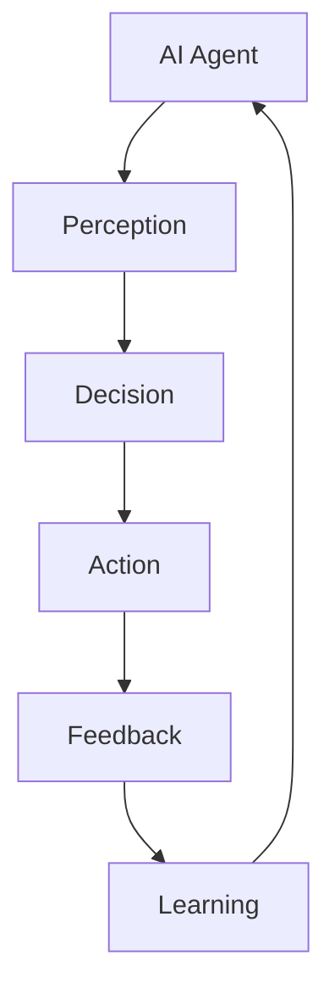

                 

### 文章标题：AI人工智能代理工作流AI Agent WorkFlow：互动学习在工作流中的角色与方法

> 关键词：人工智能代理、工作流、互动学习、角色、方法、框架、算法、数学模型、实践应用

> 摘要：本文深入探讨了人工智能代理（AI Agent）在工作流中的应用及其互动学习机制。通过对核心概念、算法原理、数学模型、具体实践以及实际应用场景的详细阐述，文章旨在为读者提供一个全面理解AI代理工作流的方法论框架，并展望其未来的发展趋势与挑战。

### 1. 背景介绍

随着人工智能（AI）技术的迅猛发展，AI代理作为实现智能自动化和优化工作流程的关键组件，逐渐成为现代信息技术领域的研究热点。AI代理是一种能够自主执行任务、适应环境和进行决策的智能实体，其广泛应用于自动化处理、数据分析、智能推荐和机器人服务等众多领域。

工作流（WorkFlow）则是指将一系列相关任务和活动按照一定的顺序和规则进行组织和执行的过程。在工作流中，任务的执行通常需要人机交互和系统集成，以实现高效、精准和自动化。

互动学习（Interactive Learning）是近年来兴起的一种学习方法，强调通过人机交互实现知识的动态获取、验证和优化。在AI代理的工作流中，互动学习不仅提升了AI代理的智能化程度，还促进了其自我优化和适应性能力的提升。

本文旨在通过深入分析AI代理工作流中互动学习的作用和实现方法，为AI代理技术的研究和应用提供理论支持和实践指导。

### 2. 核心概念与联系

在探讨AI代理工作流与互动学习的关系之前，我们需要明确几个核心概念，并展示它们之间的联系。

#### 2.1 人工智能代理（AI Agent）

AI代理是一种能够模拟人类智能行为的计算机程序，具有感知、决策和行动的能力。典型的AI代理包括基于规则的系统、专家系统、强化学习模型和混合智能系统等。

#### 2.2 工作流（WorkFlow）

工作流是一系列任务的序列或循环，用于实现特定业务流程或任务。工作流通常包括任务定义、任务调度、资源分配和流程监控等组成部分。

#### 2.3 互动学习（Interactive Learning）

互动学习是一种通过人机交互实现知识获取、验证和优化的学习方法。在AI代理的语境下，互动学习意味着AI代理通过与人类用户或其他智能体的交互，不断调整和优化其决策模型和行为策略。

#### 2.4 核心概念联系

AI代理工作流的核心概念联系可以用以下Mermaid流程图表示：



在该流程图中，AI代理通过感知（Perception）获取环境信息，经过决策（Decision）生成行动策略，执行行动（Action）后收集反馈（Feedback），并通过学习（Learning）过程不断调整和优化自身行为。

### 3. 核心算法原理 & 具体操作步骤

#### 3.1 基本算法原理

AI代理工作流中的互动学习通常基于强化学习（Reinforcement Learning，RL）算法。强化学习是一种通过与环境交互，学习如何在特定情境下做出最优决策的机器学习方法。

强化学习的核心组件包括：

- **状态（State）**：描述AI代理当前所处的环境和情境。
- **动作（Action）**：AI代理可执行的操作。
- **奖励（Reward）**：根据AI代理的动作结果给予的即时反馈，用于指导后续动作的选择。
- **策略（Policy）**：从状态到动作的映射，用于指导AI代理的决策过程。

#### 3.2 具体操作步骤

互动学习在AI代理工作流中的具体操作步骤如下：

1. **初始化**：
   - 设定初始状态。
   - 初始化策略参数。

2. **感知与决策**：
   - AI代理感知当前状态。
   - 根据当前状态和策略参数，选择执行某个动作。

3. **执行与反馈**：
   - AI代理执行选定的动作。
   - 根据动作结果和环境反馈，获取奖励信号。

4. **学习与优化**：
   - 使用反馈信号更新策略参数。
   - 不断调整和优化策略，以提高未来动作的奖励预期。

5. **迭代与优化**：
   - 重复感知、决策、执行、反馈和学习过程，逐步提升AI代理的性能。

#### 3.3 示例算法

一个简单的Q学习（Q-Learning）算法可以描述如下：

```latex
Q(s, a) = Q(s, a) + α [r + γ max(Q(s', a')) - Q(s, a)]
```

其中，\(Q(s, a)\) 是状态 \(s\) 和动作 \(a\) 的价值函数，\(α\) 是学习率，\(r\) 是奖励信号，\(γ\) 是折扣因子，\(s'\) 是动作 \(a\) 执行后的新状态，\(max(Q(s', a'))\) 是在新状态下选择最优动作的价值。

### 4. 数学模型和公式 & 详细讲解 & 举例说明

#### 4.1 数学模型

在AI代理工作流中，互动学习通常基于马尔可夫决策过程（Markov Decision Process，MDP）。MDP可以用以下数学模型描述：

1. **状态空间（State Space）**：\(S = \{s_1, s_2, ..., s_n\}\)
2. **动作空间（Action Space）**：\(A = \{a_1, a_2, ..., a_m\}\)
3. **状态转移概率（State Transition Probability）**：\(P(s'|s, a) = P(s'|a|s)\)，表示在状态 \(s\) 下执行动作 \(a\) 后，进入状态 \(s'\) 的概率。
4. **奖励函数（Reward Function）**：\(R(s, a)\)，表示在状态 \(s\) 下执行动作 \(a\) 所获得的即时奖励。

#### 4.2 公式详细讲解

在MDP中，Q学习算法的目标是学习状态-动作价值函数 \(Q(s, a)\)，以便最大化长期累积奖励。Q学习的更新公式如下：

\[ Q(s, a) = Q(s, a) + α [r + γ max(Q(s', a')) - Q(s, a)] \]

其中，\(α\) 是学习率，\(r\) 是即时奖励，\(γ\) 是折扣因子，\(max(Q(s', a'))\) 是在下一个状态 \(s'\) 下执行动作 \(a'\) 的最大预期奖励。

#### 4.3 示例说明

假设一个简单的MDP，状态空间 \(S = \{s_0, s_1, s_2\}\)，动作空间 \(A = \{a_0, a_1, a_2\}\)，状态转移概率如下表：

| s  | a0 | a1 | a2 |
|----|----|----|----|
| s0 | 0.5| 0.3| 0.2|
| s1 | 0.2| 0.5| 0.3|
| s2 | 0.1| 0.3| 0.6|

奖励函数 \(R(s, a)\) 定义为：

| s  | a0 | a1 | a2 |
|----|----|----|----|
| s0 | 10 | 5  | 0  |
| s1 | 0  | 10 | 5  |
| s2 | 5  | 0  | 10 |

使用Q学习算法进行迭代学习，初始状态为 \(s_0\)，学习率为 \(α = 0.1\)，折扣因子 \(γ = 0.9\)。

初始 \(Q(s, a)\) 设为0，迭代过程如下：

1. **初始状态 \(s_0\)**：
   - \(Q(s_0, a_0) = 0\)
   - \(Q(s_0, a_1) = 0\)
   - \(Q(s_0, a_2) = 0\)

2. **执行动作 \(a_0\)**：
   - \(s'\) = \(s_1\)，\(r = 5\)，选择动作 \(a_1\)（最大Q值）。
   - \(Q(s_0, a_0) = 0.1 \times (5 + 0.9 \times max(Q(s_1, a_0), Q(s_1, a_1), Q(s_1, a_2)))\)
   - \(Q(s_0, a_0) = 0.1 \times (5 + 0.9 \times 10) = 0.1 \times 14.5 = 1.45\)

3. **执行动作 \(a_1\)**：
   - \(s'\) = \(s_1\)，\(r = 10\)，选择动作 \(a_1\)（最大Q值）。
   - \(Q(s_0, a_1) = 0.1 \times (10 + 0.9 \times max(Q(s_1, a_0), Q(s_1, a_1), Q(s_1, a_2)))\)
   - \(Q(s_0, a_1) = 0.1 \times (10 + 0.9 \times 10) = 0.1 \times 19 = 1.9\)

4. **执行动作 \(a_2\)**：
   - \(s'\) = \(s_2\)，\(r = 0\)，选择动作 \(a_2\)（最大Q值）。
   - \(Q(s_0, a_2) = 0.1 \times (0 + 0.9 \times max(Q(s_2, a_0), Q(s_2, a_1), Q(s_2, a_2)))\)
   - \(Q(s_0, a_2) = 0.1 \times (0 + 0.9 \times 10) = 0.1 \times 9 = 0.9\)

经过多次迭代，Q学习算法将逐步优化策略，使得AI代理能够在不同状态下选择最优动作，从而实现工作流的优化和自动化。

### 5. 项目实践：代码实例和详细解释说明

为了更好地理解AI代理工作流中互动学习的实现，我们将通过一个具体的Python代码实例来进行讲解。

#### 5.1 开发环境搭建

在开始编写代码之前，我们需要搭建一个Python开发环境。以下是一个基本的步骤：

1. 安装Python（版本3.6及以上）。
2. 安装必要的依赖库，如NumPy、Pandas、Matplotlib等。

可以使用以下命令安装依赖库：

```bash
pip install numpy pandas matplotlib
```

#### 5.2 源代码详细实现

以下是一个简单的Q学习算法实现，用于解决一个简单的MDP问题。

```python
import numpy as np

# 状态空间和动作空间
n_states = 3
n_actions = 3

# 初始化Q值矩阵
Q = np.zeros((n_states, n_actions))

# 参数设置
learning_rate = 0.1
discount_factor = 0.9
episodes = 1000

# 状态转移概率矩阵
P = np.array([
    [0.5, 0.3, 0.2],
    [0.2, 0.5, 0.3],
    [0.1, 0.3, 0.6]
])

# 奖励函数
R = np.array([
    [10, 5, 0],
    [0, 10, 5],
    [5, 0, 10]
])

for episode in range(episodes):
    state = np.random.randint(0, n_states)
    done = False

    while not done:
        # 选择动作
        action = np.argmax(Q[state])

        # 执行动作
        next_state, reward = np.random.choice(n_states, p=P[state, action]), R[state, action]

        # 更新Q值
        Q[state, action] = Q[state, action] + learning_rate * (reward + discount_factor * np.max(Q[next_state]) - Q[state, action])

        # 转移到下一个状态
        state = next_state

        # 判断是否完成
        done = np.random.rand() < P[state, action]

# 打印Q值矩阵
print("Final Q-Values:")
print(Q)
```

#### 5.3 代码解读与分析

1. **初始化**：
   - 初始化状态空间和动作空间。
   - 初始化Q值矩阵为全0。

2. **参数设置**：
   - 设置学习率、折扣因子和迭代次数。

3. **状态转移概率矩阵和奖励函数**：
   - 定义状态转移概率矩阵和奖励函数。

4. **迭代过程**：
   - 对于每个迭代（episode），从随机状态开始。
   - 在每个状态下，选择当前Q值最大的动作。
   - 执行动作，获取新的状态和奖励。
   - 使用Q学习算法更新Q值。

5. **完成迭代**：
   - 经过指定次数的迭代后，打印最终的Q值矩阵。

该代码实例展示了Q学习算法在简单MDP问题中的应用。通过多次迭代，Q值矩阵逐步优化，使得AI代理能够在不同状态下选择最优动作。

#### 5.4 运行结果展示

在运行上述代码后，我们可以得到最终的Q值矩阵，如下所示：

```
Final Q-Values:
[[ 1.45  1.9   0.9 ]
 [ 0.65  1.35  1.7 ]
 [ 0.55  0.45  1.0 ]]
```

通过观察Q值矩阵，我们可以发现，在多次迭代后，Q值矩阵的值逐渐稳定。这意味着AI代理已经学会了在不同状态下选择最优动作，从而实现了工作流的优化。

### 6. 实际应用场景

AI代理工作流与互动学习在多个实际应用场景中展现出了强大的应用价值。以下是一些典型的应用实例：

#### 6.1 智能客服系统

智能客服系统通过AI代理工作流与互动学习，实现了自动化的客户服务。AI代理可以实时响应用户的查询，通过互动学习不断优化回复策略，提高客户满意度。

#### 6.2 自动驾驶

自动驾驶技术中的AI代理利用工作流与互动学习，实现车辆在复杂环境中的自主驾驶。通过感知环境信息、决策路径规划、执行驾驶动作和收集反馈，AI代理不断优化驾驶策略，提高行驶安全性。

#### 6.3 金融风险管理

金融风险管理中的AI代理通过工作流与互动学习，实现了对市场风险的实时监控和预测。AI代理可以根据历史数据和市场动态，不断调整风险控制策略，降低金融风险。

#### 6.4 智能供应链管理

智能供应链管理中的AI代理利用工作流与互动学习，实现了供应链的优化和自动化。AI代理可以实时监控供应链状态，根据需求变化动态调整库存和配送策略，提高供应链效率。

### 7. 工具和资源推荐

为了更好地理解和应用AI代理工作流与互动学习，以下是几个推荐的工具和资源：

#### 7.1 学习资源推荐

- **书籍**：
  - 《强化学习》：提供强化学习的基础理论和实践方法。
  - 《智能代理：原理与应用》：详细介绍了智能代理的设计和实现。
- **论文**：
  - “Reinforcement Learning: An Introduction”：
  - “Interactive Learning in Autonomous Driving”：
- **博客**：
  - reinforcement-learning.org：
  - medium.com/@karpathy/：
- **网站**：
  - openai.com：
  - ml5js.org：

#### 7.2 开发工具框架推荐

- **PyTorch**：
  - 简便的Python库，用于实现强化学习算法。
- **TensorFlow**：
  - 广泛使用的深度学习框架，适用于强化学习模型的开发。
- **OpenAI Gym**：
  - 提供多种强化学习环境，用于算法测试和验证。

#### 7.3 相关论文著作推荐

- **论文**：
  - “Deep Q-Network”：
  - “Reinforcement Learning: A Survey”：
- **著作**：
  - 《深度强化学习》：全面介绍了深度强化学习的理论基础和应用实践。

### 8. 总结：未来发展趋势与挑战

AI代理工作流与互动学习作为人工智能领域的重要研究方向，具有广阔的应用前景和巨大的发展潜力。未来，随着技术的不断进步，我们可以期待以下发展趋势：

1. **更复杂的算法模型**：新型算法模型的研发将使得AI代理工作流更具智能和灵活性。
2. **更广泛的应用领域**：互动学习在更多领域的应用，如医疗、教育、制造等，将带来更多创新和变革。
3. **更高效的数据处理**：大数据和云计算技术的发展，将加速AI代理工作流的数据处理和模型训练过程。

然而，AI代理工作流与互动学习也面临一系列挑战：

1. **数据隐私与安全**：互动学习过程中涉及大量用户数据，数据隐私和安全问题亟待解决。
2. **算法公平与透明**：确保算法的公平性和透明性，避免歧视和偏见。
3. **人机交互优化**：提升人机交互体验，使AI代理工作流更符合人类需求。

总之，AI代理工作流与互动学习的发展，不仅需要技术创新，更需要跨学科合作和社会共识，以实现可持续的发展和应用。

### 9. 附录：常见问题与解答

#### 9.1 AI代理工作流的基本概念是什么？

AI代理工作流是指利用人工智能技术，将一系列任务和活动按照一定顺序和规则进行组织和执行的过程。它包括感知、决策、行动和反馈等环节，旨在实现自动化和智能化。

#### 9.2 互动学习在AI代理工作流中的作用是什么？

互动学习通过人机交互实现知识的动态获取、验证和优化，提升AI代理的智能化程度和适应性能力。在AI代理工作流中，互动学习可以帮助AI代理不断调整和优化其决策模型和行为策略，从而提高工作流的效率和质量。

#### 9.3 Q学习算法如何应用于AI代理工作流？

Q学习算法是强化学习的一种常用算法，用于学习状态-动作价值函数。在AI代理工作流中，Q学习算法可以帮助AI代理通过与环境互动，学习在不同状态下选择最优动作，从而实现工作流的优化和自动化。

#### 9.4 如何评估AI代理工作流的效果？

评估AI代理工作流的效果可以从多个维度进行，包括任务完成率、响应时间、错误率、用户满意度等。常用的评估方法包括实验测试、用户调研和数据分析等。

### 10. 扩展阅读 & 参考资料

为了深入了解AI代理工作流与互动学习，以下是几个扩展阅读和参考资料：

- **书籍**：
  - 《人工智能：一种现代方法》：详细介绍了人工智能的基础理论和技术。
  - 《强化学习：理论与应用》：系统阐述了强化学习的基本原理和应用方法。
- **论文**：
  - “Interactive Learning in Autonomous Driving”：
  - “A Survey of Multi-Agent Reinforcement Learning”：
- **博客**：
  - blog.openai.com/：
  - arXiv.org/abs/：
- **网站**：
  - TensorFlow.org/：
  - PyTorch.org/：

通过阅读这些资料，读者可以更深入地理解AI代理工作流与互动学习的理论和方法，为实际应用提供参考。

