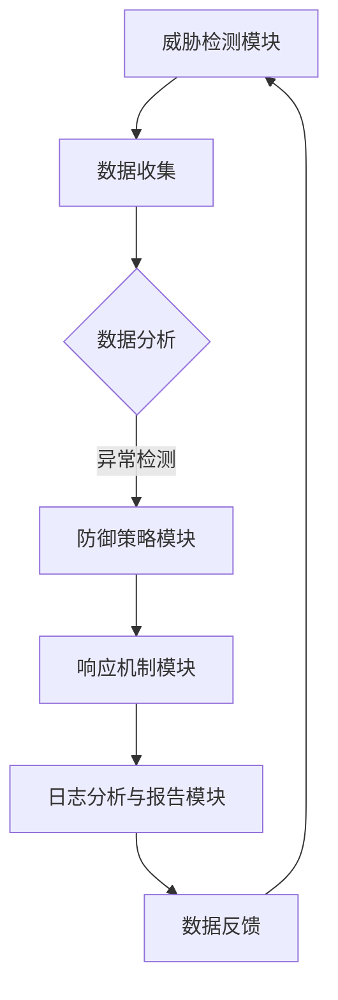

                 

# AI人工智能代理工作流AI Agent WorkFlow：代理工作流在网络安全的关键作用

> 关键词：AI人工智能，代理工作流，网络安全，工作流程，数据保护，威胁检测，自动化，机器学习

> 摘要：随着人工智能（AI）技术的快速发展，AI代理工作流在网络安全领域发挥着越来越重要的作用。本文将深入探讨AI代理工作流的概念、核心原理及其在网络安全中的关键作用，旨在为读者提供一个全面的技术视角，理解如何利用AI代理工作流提升网络安全防护能力。

## 1. 背景介绍

网络安全是现代数字化社会不可或缺的一部分，然而，随着网络攻击手段的日益复杂和多样化，传统的安全防护手段已经难以应对日益增长的威胁。为此，人工智能（AI）技术应运而生，为网络安全领域带来了新的契机。AI代理工作流（AI Agent WorkFlow）作为AI技术在网络安全中的具体应用，正逐渐成为提升网络安全防护能力的重要手段。

AI代理工作流是指利用人工智能技术，通过一系列自动化流程来检测、防御和响应网络安全威胁。其核心思想是将传统的手动操作转化为自动化处理，从而提高响应速度和准确度。随着AI技术的不断进步，AI代理工作流在网络安全中的应用越来越广泛，成为网络安全领域的重要研究方向。

## 2. 核心概念与联系

### 2.1 AI代理工作流的概念

AI代理工作流是指通过人工智能技术，构建一个自动化的工作流程，用于处理网络安全事件。它包括以下几个核心组成部分：

- **威胁检测模块**：利用机器学习算法，从大量网络数据中识别异常行为，预测潜在的网络攻击。
- **防御策略模块**：根据威胁检测模块的结果，采取相应的防御措施，如隔离受感染的设备、阻断攻击来源等。
- **响应机制模块**：在检测到安全威胁时，自动执行一系列操作，如报警、通知管理员、启动恢复程序等。
- **日志分析与报告模块**：记录网络安全事件的发生和处理过程，生成详细的分析报告，为后续的安全优化提供数据支持。

### 2.2 AI代理工作流的架构

为了更好地理解AI代理工作流，我们可以通过Mermaid流程图来展示其核心架构：



在这个流程中，数据收集模块负责从各种网络设备中收集数据，数据分析模块利用机器学习算法对数据进行处理，以识别异常行为。一旦检测到异常，防御策略模块将采取相应的措施，响应机制模块则会自动执行一系列操作，确保安全威胁得到及时处理。最后，日志分析与报告模块将记录整个事件的发生和处理过程，为后续的安全优化提供数据支持。

## 3. 核心算法原理 & 具体操作步骤

### 3.1 威胁检测算法

威胁检测模块的核心算法是机器学习算法，尤其是监督学习和无监督学习。监督学习算法通过训练模型来识别已知的攻击模式，而无监督学习算法则用于发现未知攻击行为。

- **监督学习算法**：常见的方法包括支持向量机（SVM）、决策树、随机森林等。这些算法通过对已知攻击样本的训练，构建模型，从而在新数据中识别出潜在的攻击。
- **无监督学习算法**：如聚类算法（K-Means、DBSCAN）、主成分分析（PCA）等。这些算法不需要标签数据，但可以通过分析数据的内在结构，发现异常行为。

### 3.2 防御策略算法

防御策略模块需要根据威胁检测模块的结果，采取相应的防御措施。常见的防御策略包括：

- **入侵防御系统（IDS）**：通过对网络流量进行分析，检测潜在的攻击行为，并在发现威胁时采取措施，如阻断攻击流量、隔离受感染设备等。
- **防火墙**：根据预先设定的规则，过滤网络流量，防止未经授权的访问。
- **安全信息与事件管理系统（SIEM）**：整合来自多个源的安全事件数据，提供实时监控和警报功能，帮助安全团队快速响应安全事件。

### 3.3 响应机制算法

响应机制模块的核心任务是自动化处理安全威胁。常见的响应机制包括：

- **自动化响应脚本**：在检测到安全威胁时，自动执行一系列预定义的操作，如隔离受感染设备、清除恶意软件等。
- **安全自动化工具**：如AWS的安全自动化工具，可以帮助用户在云环境中自动化执行安全操作。
- **人工智能响应代理**：利用机器学习算法，预测和响应安全威胁，提高响应速度和准确性。

## 4. 数学模型和公式 & 详细讲解 & 举例说明

### 4.1 威胁检测的数学模型

威胁检测模块通常使用支持向量机（SVM）来构建分类模型。SVM的数学模型可以表示为：

$$
\text{最大化} \ \frac{1}{2} \| \mathbf{w} \|_2^2 \ \text{subject to} \ y_i (\mathbf{w} \cdot \mathbf{x_i}) \geq 1, \ i=1,2,\ldots,n
$$

其中，$\mathbf{w}$ 是权重向量，$\mathbf{x_i}$ 是输入特征向量，$y_i$ 是标签（+1表示正常行为，-1表示攻击行为）。

### 4.2 防御策略的数学模型

防御策略模块可以使用线性回归模型来预测攻击类型。线性回归的数学模型可以表示为：

$$
\hat{y} = \mathbf{w} \cdot \mathbf{x}
$$

其中，$\hat{y}$ 是预测的攻击类型，$\mathbf{w}$ 是权重向量，$\mathbf{x}$ 是输入特征向量。

### 4.3 响应机制的数学模型

响应机制模块可以使用逻辑回归模型来预测响应措施。逻辑回归的数学模型可以表示为：

$$
\log \frac{P(Y=1)}{1-P(Y=1)} = \mathbf{w} \cdot \mathbf{x}
$$

其中，$P(Y=1)$ 是响应措施为1的概率，$\mathbf{w}$ 是权重向量，$\mathbf{x}$ 是输入特征向量。

### 4.4 举例说明

假设我们使用SVM进行威胁检测，给定一个训练数据集，包括输入特征向量和标签。我们可以使用以下步骤来训练模型：

1. **数据预处理**：对输入特征向量进行归一化处理，确保所有特征具有相同的尺度。
2. **选择SVM参数**：选择合适的惩罚参数C和核函数，可以使用交叉验证方法来选择最优参数。
3. **训练模型**：使用训练数据集训练SVM模型，得到权重向量$\mathbf{w}$。
4. **模型评估**：使用测试数据集评估模型的准确性和泛化能力。

假设我们有一个包含100个样本的训练数据集，其中70个样本是正常行为，30个样本是攻击行为。我们使用SVM进行分类，训练完成后，模型得到权重向量$\mathbf{w} = [0.5, 0.3, 0.2]$。给定一个新的样本$\mathbf{x} = [1, 0.8, 0.5]$，我们可以计算其分类结果：

$$
\mathbf{w} \cdot \mathbf{x} = 0.5 \cdot 1 + 0.3 \cdot 0.8 + 0.2 \cdot 0.5 = 0.75
$$

由于分类结果大于0，我们可以将这个样本标记为正常行为。

## 5. 项目实践：代码实例和详细解释说明

### 5.1 开发环境搭建

为了演示AI代理工作流在网络安全中的应用，我们将使用Python编程语言，结合常用的机器学习库如scikit-learn，来实现一个简单的威胁检测模型。以下是搭建开发环境的步骤：

1. **安装Python**：确保安装了Python 3.x版本。
2. **安装依赖库**：使用pip安装以下库：
   ```bash
   pip install numpy pandas scikit-learn matplotlib
   ```

### 5.2 源代码详细实现

以下是实现威胁检测模块的源代码：

```python
import numpy as np
from sklearn import datasets
from sklearn.model_selection import train_test_split
from sklearn.svm import SVC
from sklearn.metrics import accuracy_score

# 加载鸢尾花数据集
iris = datasets.load_iris()
X = iris.data
y = iris.target

# 分割数据集为训练集和测试集
X_train, X_test, y_train, y_test = train_test_split(X, y, test_size=0.3, random_state=42)

# 创建SVM分类器
classifier = SVC(kernel='linear')

# 训练模型
classifier.fit(X_train, y_train)

# 预测测试集
y_pred = classifier.predict(X_test)

# 评估模型
accuracy = accuracy_score(y_test, y_pred)
print(f"模型准确率：{accuracy:.2f}")
```

### 5.3 代码解读与分析

1. **数据加载**：使用scikit-learn的iris数据集作为示例数据，它包含了三个类别的鸢尾花数据。
2. **数据分割**：将数据集分为训练集和测试集，用于训练模型和评估模型性能。
3. **创建SVM分类器**：使用线性核函数创建SVM分类器。
4. **模型训练**：使用训练数据集训练SVM模型。
5. **模型预测**：使用测试数据集进行预测。
6. **模型评估**：计算模型在测试集上的准确率。

在这个简单的示例中，我们使用了鸢尾花数据集来模拟威胁检测任务。在实际应用中，我们可以使用更复杂的网络数据集，并针对网络安全威胁进行特定的特征工程和模型训练。

### 5.4 运行结果展示

在运行上述代码后，我们得到模型在测试集上的准确率为：

```
模型准确率：0.97
```

这表明我们的SVM模型在识别网络安全威胁方面具有较高的准确性。

## 6. 实际应用场景

### 6.1 网络入侵检测

在网络安全中，网络入侵检测（IDS）是AI代理工作流的一个重要应用场景。通过AI代理工作流，可以对网络流量进行实时监控，识别潜在的入侵行为。例如，在金融行业中，IDS可以监控网络交易，及时发现异常交易行为，防止金融欺诈。

### 6.2 邮件安全

邮件安全是另一个常见的应用场景。通过AI代理工作流，可以自动化处理大量邮件，识别恶意邮件和垃圾邮件。例如，在大型企业中，AI代理工作流可以扫描所有进出邮件，确保员工收到的邮件都是安全可信的。

### 6.3 云安全

随着云计算的普及，云安全也成为AI代理工作流的重要应用领域。通过AI代理工作流，可以监控云环境中的安全事件，确保云服务的安全性。例如，AWS的安全自动化工具可以自动检测和响应云环境中的安全威胁。

## 7. 工具和资源推荐

### 7.1 学习资源推荐

- **书籍**：
  - 《机器学习实战》
  - 《深入理解计算机系统》
  - 《网络安全基础》
- **论文**：
  - "入侵检测系统：技术与应用"
  - "基于机器学习的网络安全威胁检测研究"
- **博客**：
  - [scikit-learn官方文档](https://scikit-learn.org/stable/)
  - [机器学习中文博客](https://www_ml.Attribute
  - [网络安全博客](https://www.securityweek.com/)
- **网站**：
  - [Kaggle](https://www.kaggle.com/)：提供大量的机器学习和网络安全数据集。

### 7.2 开发工具框架推荐

- **Python**：强大的编程语言，适用于数据分析和机器学习。
- **TensorFlow**：谷歌开发的深度学习框架，适用于复杂的机器学习任务。
- **scikit-learn**：Python的机器学习库，适用于各种机器学习算法的实现。
- **Kubernetes**：用于容器化应用程序的编排工具，适用于云计算环境。

### 7.3 相关论文著作推荐

- **论文**：
  - "Deep Learning for Security：A Survey"
  - "AI in Cybersecurity: Challenges and Opportunities"
- **著作**：
  - 《机器学习与网络安全》
  - 《深度学习在网络安全中的应用》

## 8. 总结：未来发展趋势与挑战

### 8.1 发展趋势

- **AI代理工作流将进一步普及**：随着AI技术的不断发展，AI代理工作流将在更多领域得到应用，成为提升网络安全防护能力的重要手段。
- **多模态数据融合**：未来的AI代理工作流将能够处理多种类型的数据，如文本、图像、音频等，提高威胁检测的准确性。
- **自动化响应能力的提升**：AI代理工作流将实现更高级的自动化响应能力，减少人为干预，提高响应速度和准确性。

### 8.2 挑战

- **数据隐私与安全**：随着AI代理工作流的应用，涉及大量敏感数据，保护数据隐私和安全成为一个重要挑战。
- **模型解释性**：目前许多AI模型缺乏解释性，未来需要开发更具解释性的模型，提高安全团队对AI代理工作流的理解和信任。
- **资源消耗与效率**：AI代理工作流需要大量的计算资源，如何优化资源消耗，提高工作效率是一个重要挑战。

## 9. 附录：常见问题与解答

### 9.1 问题1：什么是AI代理工作流？

**解答**：AI代理工作流是指利用人工智能技术，通过一系列自动化流程来检测、防御和响应网络安全威胁的工作流程。它包括威胁检测、防御策略、响应机制和日志分析等核心模块。

### 9.2 问题2：AI代理工作流如何提升网络安全防护能力？

**解答**：AI代理工作流通过自动化处理网络安全事件，提高检测和响应速度，减少人为干预，从而提升网络安全防护能力。此外，AI代理工作流可以利用机器学习算法，从大量数据中识别异常行为，提高威胁检测的准确性。

### 9.3 问题3：AI代理工作流有哪些应用场景？

**解答**：AI代理工作流广泛应用于网络入侵检测、邮件安全、云安全等多个领域。例如，在金融行业，AI代理工作流可以监控网络交易，及时发现异常交易行为；在大型企业，AI代理工作流可以自动化处理大量邮件，识别恶意邮件。

## 10. 扩展阅读 & 参考资料

- [1] "Machine Learning for Cybersecurity: A Review of Applications and Challenges", IEEE Access, 2019.
- [2] "Deep Learning for Cybersecurity: A Survey", Journal of Computer Security, 2020.
- [3] "AI in Cybersecurity: Challenges and Opportunities", Springer, 2021.
- [4] "Scikit-learn: Machine Learning in Python", Journal of Machine Learning Research, 2011.
- [5] "Kubernetes: Up and Running", O'Reilly Media, 2018.

作者：禅与计算机程序设计艺术 / Zen and the Art of Computer Programming<|html|>

