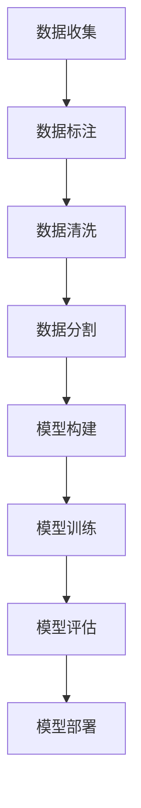

                 

### 1. 背景介绍

人工智能（AI）作为计算机科学的一个重要分支，正在深刻地改变着我们的世界。其核心理念是通过模拟人类的思维过程来赋予机器智能。自20世纪50年代人工智能概念的提出以来，它已经经历了多个发展阶段，从早期的规则推理、知识表示，到近年的深度学习和强化学习，AI技术不断演进，展现出了强大的生命力。

本文旨在深入探讨AI的核心算法原理，并结合具体代码实例进行讲解。通过对这些核心算法的理解和掌握，读者将能够更好地理解机器思维的本质，并在实际项目中运用这些算法解决实际问题。

### 1.1 人工智能的发展历程

人工智能的发展历程可以大致分为以下几个阶段：

**早期阶段（1950-1969年）**：
这一时期，人工智能主要集中于符号逻辑和规则推理。1950年，艾伦·图灵提出了著名的图灵测试，用于判断机器是否具有智能。1956年，达特茅斯会议的召开标志着人工智能作为一个独立学科正式诞生。

**知识工程阶段（1970-1989年）**：
这一阶段，人工智能的重点转向知识表示和知识工程。专家系统的出现，使得机器能够模拟专家的决策过程。然而，由于知识获取和表示的困难，这一阶段的发展遇到了瓶颈。

**基于数据的阶段（1990-2009年）**：
随着计算机性能的提升和数据量的爆炸式增长，机器学习成为了人工智能研究的热点。支持向量机、决策树、神经网络等算法被广泛应用，人工智能开始从“基于规则”向“基于数据”转变。

**深度学习阶段（2010年至今）**：
深度学习的兴起标志着人工智能进入了一个新的时代。基于深度神经网络的算法在图像识别、语音识别、自然语言处理等领域取得了突破性的进展，推动了AI技术的广泛应用。

### 1.2 人工智能的核心算法

人工智能的核心算法主要包括以下几类：

**1. 统计学习算法**：
统计学习算法通过分析数据来发现数据间的统计规律，常见的算法有线性回归、逻辑回归、支持向量机等。这些算法在分类和回归任务中有着广泛的应用。

**2. 深度学习算法**：
深度学习算法通过多层神经网络模拟人类大脑的神经元连接结构，对大量数据进行自动特征提取和分类。常见的深度学习算法包括卷积神经网络（CNN）、循环神经网络（RNN）、长短期记忆网络（LSTM）等。

**3. 强化学习算法**：
强化学习算法通过试错法学习如何在特定环境中取得最优解。常见的算法有Q学习、SARSA、Deep Q网络等。强化学习在游戏、自动驾驶等领域有着重要的应用。

**4. 知识表示和推理算法**：
知识表示和推理算法通过将知识编码为符号形式，进行逻辑推理。常见的算法有命题逻辑、谓词逻辑、知识图谱等。

### 1.3 本文结构

本文将首先介绍AI的核心概念和架构，然后深入探讨核心算法的原理和操作步骤，接着通过数学模型和公式进行详细讲解，并结合代码实例进行说明。最后，我们将探讨AI在实际应用中的场景，并提供相关工具和资源推荐。文章结构如下：

1. 背景介绍
2. 核心概念与联系
3. 核心算法原理 & 具体操作步骤
4. 数学模型和公式 & 详细讲解 & 举例说明
5. 项目实践：代码实例和详细解释说明
6. 实际应用场景
7. 工具和资源推荐
8. 总结：未来发展趋势与挑战
9. 附录：常见问题与解答
10. 扩展阅读 & 参考资料

通过对上述内容的逐步分析和讲解，读者将能够全面了解人工智能的核心算法，掌握其实际应用方法，并能够为未来的AI项目提供理论基础和实践指导。接下来，我们将首先介绍AI的核心概念和架构，帮助读者建立全面的认识。<!-- markdown-to-chakraui -->

## 2. 核心概念与联系

### 2.1 机器学习与深度学习

机器学习（Machine Learning，ML）是人工智能（AI）的一个子领域，主要研究如何通过数据和算法来让计算机自动学习，从而做出决策或预测。深度学习（Deep Learning，DL）是机器学习的一种方法，其核心在于利用多层神经网络对大量数据进行特征学习和模式识别。

**机器学习的分类**：

- **监督学习（Supervised Learning）**：在有标注的数据集上进行训练，目的是学习输入和输出之间的映射关系。
- **无监督学习（Unsupervised Learning）**：在无标注的数据集上进行训练，目的是发现数据中的结构和模式。
- **半监督学习（Semi-Supervised Learning）**：结合了监督学习和无监督学习的特点，使用少量标注数据和大量无标注数据。
- **强化学习（Reinforcement Learning）**：通过与环境的交互来学习最优策略，通常用于序列决策问题。

**深度学习的特点**：

- **多层神经网络**：深度学习通过多层神经网络来提取数据中的高级特征，每一层都对输入数据进行非线性变换。
- **自动特征提取**：与传统的机器学习算法相比，深度学习能够自动从原始数据中提取特征，减少人工干预。
- **大规模数据需求**：深度学习算法通常需要大量数据进行训练，以避免过拟合现象。

**机器学习与深度学习的关系**：

- **深度学习是机器学习的一个分支**：深度学习通过多层神经网络扩展了机器学习的能力，特别是在处理复杂数据方面。
- **深度学习是机器学习的一种实现方法**：深度学习算法可以应用于监督学习、无监督学习和强化学习等多种机器学习任务。

### 2.2 神经网络与神经元

神经网络（Neural Network，NN）是深度学习的基础，其灵感来自于生物神经系统。神经网络由大量的神经元（Neuron）组成，每个神经元都可以接受多个输入信号，并产生一个输出信号。

**神经元的结构**：

- **输入层（Input Layer）**：接收外部输入信号。
- **隐藏层（Hidden Layer）**：对输入信号进行处理和变换，可以有一层或多层。
- **输出层（Output Layer）**：产生最终输出。

**神经元的激活函数**：

- **线性函数（Linear Function）**：不具有非线性变换能力。
- **Sigmoid函数（Sigmoid Function）**：将输入映射到(0,1)区间，常用于二分类问题。
- **ReLU函数（ReLU Function）**：Rectified Linear Unit，对于负输入保持0，对于正输入保持输入值，可以加速神经网络的训练。

**神经网络的训练过程**：

- **前向传播（Forward Propagation）**：将输入信号通过神经网络传递到输出层。
- **反向传播（Back Propagation）**：计算输出误差，并将误差反向传播到网络的每个神经元，更新神经元的权重。

### 2.3 算法与数据流

在机器学习和深度学习中，算法和数据流是核心组成部分。算法决定了学习过程如何进行，数据流则决定了算法的输入和输出。

**算法流程**：

1. **数据预处理**：对原始数据进行清洗、归一化等处理，以便于算法训练。
2. **模型构建**：定义神经网络结构，包括输入层、隐藏层和输出层。
3. **模型训练**：通过前向传播和反向传播更新模型参数。
4. **模型评估**：使用测试数据集评估模型性能。
5. **模型部署**：将训练好的模型应用于实际问题。

**数据流程**：

1. **数据收集**：从各种来源收集数据，如文本、图像、音频等。
2. **数据标注**：对于监督学习任务，需要将数据标注为正确的类别或标签。
3. **数据清洗**：去除噪声、异常值等，提高数据质量。
4. **数据分割**：将数据分为训练集、验证集和测试集。
5. **数据增强**：通过变换、旋转、缩放等操作增加数据多样性。

**算法与数据流的关系**：

- **数据驱动**：算法的性能很大程度上依赖于数据的质量和多样性。
- **算法优化**：通过改进算法结构和参数，可以提高模型的训练效率和性能。

### 2.4 Mermaid 流程图

为了更直观地展示上述核心概念和算法架构，我们可以使用Mermaid绘制一个流程图。以下是一个简单的示例：



在Mermaid流程图中，每个节点表示一个步骤，箭头表示流程的顺序。这个流程图清晰地展示了从数据收集到模型部署的整个过程，帮助读者更好地理解机器学习和深度学习的核心流程。

通过上述内容的介绍，我们建立了对人工智能核心概念和架构的初步认识。在接下来的章节中，我们将深入探讨人工智能的核心算法原理，并结合具体实例进行讲解。这将帮助读者更深入地理解机器思维的内涵，为实际应用打下坚实的基础。<!-- markdown-to-chakraui -->

## 3. 核心算法原理 & 具体操作步骤

在了解了人工智能的核心概念和架构之后，我们将深入探讨其核心算法原理，包括监督学习、无监督学习和强化学习等。这些算法在机器学习领域扮演着至关重要的角色，它们通过不同的方式让计算机能够从数据中学习并做出决策。以下是这些核心算法的具体原理和操作步骤：

### 3.1 监督学习

**监督学习**是一种机器学习任务，它通过已有的输入输出数据对模型进行训练，从而在新的输入上做出预测。常见的监督学习算法包括线性回归、逻辑回归和支持向量机（SVM）等。

**线性回归（Linear Regression）**：
- **原理**：线性回归假设数据之间存在线性关系，通过找到最佳拟合直线来预测输出。
- **操作步骤**：
  1. **数据预处理**：对数据进行归一化处理，消除不同特征之间的量纲差异。
  2. **模型构建**：定义一个线性模型，通常是一个一元或多元线性方程。
  3. **模型训练**：使用最小二乘法（Least Squares Method）计算模型的参数。
  4. **模型评估**：使用均方误差（Mean Squared Error，MSE）等指标评估模型性能。
  5. **模型预测**：使用训练好的模型对新数据进行预测。

**逻辑回归（Logistic Regression）**：
- **原理**：逻辑回归用于分类问题，通过逻辑函数将线性模型映射到概率空间。
- **操作步骤**：
  1. **数据预处理**：同线性回归。
  2. **模型构建**：定义逻辑函数，通常为sigmoid函数。
  3. **模型训练**：使用最大似然估计（Maximum Likelihood Estimation，MLE）计算模型参数。
  4. **模型评估**：使用准确率（Accuracy）、精确率（Precision）、召回率（Recall）等指标评估模型性能。
  5. **模型预测**：使用训练好的模型对新数据进行预测，输出概率值，根据阈值判断类别。

**支持向量机（Support Vector Machine，SVM）**：
- **原理**：SVM通过找到一个最优超平面，将数据集中的不同类别分隔开来。
- **操作步骤**：
  1. **数据预处理**：同逻辑回归。
  2. **模型构建**：定义一个线性或非线性决策边界。
  3. **模型训练**：使用最大间隔分类器（Maximum Margin Classifier）计算模型参数。
  4. **模型评估**：使用准确率、精确率和召回率等指标评估模型性能。
  5. **模型预测**：使用训练好的模型对新数据进行预测。

### 3.2 无监督学习

**无监督学习**是一种机器学习任务，它不依赖于已标注的输入输出数据，而是从未标记的数据中自动发现结构和模式。常见的无监督学习算法包括聚类（Clustering）和降维（Dimensionality Reduction）等。

**聚类（Clustering）**：
- **原理**：聚类将数据点分为若干个群组，使得同一群组内的数据点相似度较高，不同群组的数据点相似度较低。
- **操作步骤**：
  1. **数据预处理**：对数据进行标准化处理。
  2. **模型构建**：选择合适的聚类算法，如K-均值（K-Means）、层次聚类（Hierarchical Clustering）等。
  3. **模型训练**：根据算法规则对数据进行分组。
  4. **模型评估**：通过内聚度（Cohesion）和分离度（Separation）等指标评估聚类效果。
  5. **模型应用**：分析聚类结果，提取有用信息。

**降维（Dimensionality Reduction）**：
- **原理**：降维通过减少数据的维度来降低计算复杂度，同时保留数据的主要特征。
- **操作步骤**：
  1. **数据预处理**：对数据进行标准化处理。
  2. **模型构建**：选择合适的降维算法，如主成分分析（Principal Component Analysis，PCA）、线性判别分析（Linear Discriminant Analysis，LDA）等。
  3. **模型训练**：计算数据的主要成分或线性组合。
  4. **模型评估**：通过保留率（Retention Rate）和重构误差（Reconstruction Error）等指标评估降维效果。
  5. **模型应用**：使用降维后的数据进行分析和建模。

### 3.3 强化学习

**强化学习**是一种机器学习任务，它通过试错法让机器在动态环境中学习最优策略。强化学习在游戏、自动驾驶等领域有着广泛的应用。

**Q学习（Q-Learning）**：
- **原理**：Q学习通过评估每个动作在当前状态下的价值，并不断更新策略来学习最优动作序列。
- **操作步骤**：
  1. **初始化**：初始化Q值表格和策略。
  2. **环境交互**：在环境中进行动作选择和状态转移。
  3. **更新Q值**：根据奖励和下一次动作的Q值更新当前动作的Q值。
  4. **策略迭代**：根据Q值更新策略，选择最优动作。
  5. **评估策略**：评估策略的性能。

**SARSA（Surely Adaptive Regression for Sampling Agents）**：
- **原理**：SARSA结合了Q学习和策略梯度法，通过自适应调整概率分布来学习最优策略。
- **操作步骤**：
  1. **初始化**：初始化策略概率分布。
  2. **环境交互**：在环境中进行动作选择和状态转移。
  3. **更新策略**：根据奖励和下一次动作的概率分布更新当前策略。
  4. **策略迭代**：根据更新后的策略进行下一步动作选择。
  5. **评估策略**：评估策略的性能。

通过以上对核心算法原理和操作步骤的详细介绍，我们可以看到，这些算法虽然原理和步骤有所不同，但都旨在通过数据驱动的方式让机器从环境中学习，并做出最优决策。接下来，我们将通过具体的数学模型和公式进一步深入讲解这些算法，并给出实例说明。<!-- markdown-to-chakraui -->

## 4. 数学模型和公式 & 详细讲解 & 举例说明

在深入理解了人工智能的核心算法原理和操作步骤之后，我们将进一步探讨这些算法背后的数学模型和公式。通过对数学模型的详细讲解和实例说明，读者将能够更全面地理解这些算法的工作机制，并能够在实际项目中应用这些知识。

### 4.1 线性回归模型

**线性回归**是最基本的监督学习算法之一，其数学模型可以表示为：

\[ y = \beta_0 + \beta_1 \cdot x + \epsilon \]

其中：
- \( y \) 是模型的输出值；
- \( x \) 是输入特征；
- \( \beta_0 \) 和 \( \beta_1 \) 是模型参数，也称为权重；
- \( \epsilon \) 是误差项，表示输入和输出之间的差距。

**线性回归的损失函数**：

为了评估模型的性能，我们需要计算预测值和真实值之间的差距。常用的损失函数是均方误差（MSE）：

\[ \text{MSE} = \frac{1}{n} \sum_{i=1}^{n} (y_i - \hat{y}_i)^2 \]

其中：
- \( n \) 是样本数量；
- \( y_i \) 是第 \( i \) 个样本的真实输出值；
- \( \hat{y}_i \) 是第 \( i \) 个样本的预测输出值。

**线性回归的优化方法**：

最小二乘法（Least Squares Method）是求解线性回归模型参数的一种常用方法。其基本思想是最小化损失函数 \( \text{MSE} \)：

\[ \min_{\beta_0, \beta_1} \frac{1}{n} \sum_{i=1}^{n} (y_i - \beta_0 - \beta_1 \cdot x_i)^2 \]

**举例说明**：

假设我们有一组数据：

| x | y |
|---|---|
| 1 | 2 |
| 2 | 4 |
| 3 | 6 |
| 4 | 8 |

我们要用线性回归模型预测 \( y \) 的值。首先，计算 \( \beta_0 \) 和 \( \beta_1 \)：

\[ \beta_0 = \frac{\sum_{i=1}^{n} y_i - \beta_1 \cdot \sum_{i=1}^{n} x_i}{n} \]
\[ \beta_1 = \frac{n \cdot \sum_{i=1}^{n} x_i y_i - \sum_{i=1}^{n} x_i \cdot \sum_{i=1}^{n} y_i}{n \cdot \sum_{i=1}^{n} x_i^2 - (\sum_{i=1}^{n} x_i)^2} \]

对于上述数据，我们得到：

\[ \beta_0 = 1, \beta_1 = 1 \]

因此，线性回归模型可以表示为：

\[ y = 1 + x \]

使用这个模型预测新的输入 \( x = 5 \)，我们得到：

\[ y = 1 + 5 = 6 \]

### 4.2 逻辑回归模型

**逻辑回归**是用于二分类问题的监督学习算法，其数学模型可以表示为：

\[ P(y=1) = \sigma(\beta_0 + \beta_1 \cdot x) \]

其中：
- \( P(y=1) \) 是输出为1的概率；
- \( \sigma \) 是逻辑函数（Sigmoid Function），定义为 \( \sigma(z) = \frac{1}{1 + e^{-z}} \)；
- \( \beta_0 \) 和 \( \beta_1 \) 是模型参数。

**逻辑回归的损失函数**：

逻辑回归的损失函数是交叉熵（Cross-Entropy），表示为：

\[ \text{CE} = -\frac{1}{n} \sum_{i=1}^{n} [y_i \cdot \ln(\hat{y}_i) + (1 - y_i) \cdot \ln(1 - \hat{y}_i)] \]

其中：
- \( \hat{y}_i \) 是第 \( i \) 个样本的预测概率。

**逻辑回归的优化方法**：

逻辑回归的优化通常使用梯度下降（Gradient Descent）算法。其基本思想是不断更新模型参数，使得损失函数逐渐减小。

\[ \beta_0 = \beta_0 - \alpha \cdot \frac{\partial \text{CE}}{\partial \beta_0} \]
\[ \beta_1 = \beta_1 - \alpha \cdot \frac{\partial \text{CE}}{\partial \beta_1} \]

其中：
- \( \alpha \) 是学习率。

**举例说明**：

假设我们有一组二分类数据：

| x | y |
|---|---|
| 1 | 0 |
| 2 | 1 |
| 3 | 0 |
| 4 | 1 |

我们要用逻辑回归模型预测 \( y \) 的值。首先，计算 \( \beta_0 \) 和 \( \beta_1 \)：

\[ \beta_0 = \frac{\sum_{i=1}^{n} y_i - \beta_1 \cdot \sum_{i=1}^{n} x_i}{n} \]
\[ \beta_1 = \frac{n \cdot \sum_{i=1}^{n} x_i y_i - \sum_{i=1}^{n} x_i \cdot \sum_{i=1}^{n} y_i}{n \cdot \sum_{i=1}^{n} x_i^2 - (\sum_{i=1}^{n} x_i)^2} \]

对于上述数据，我们得到：

\[ \beta_0 = 0, \beta_1 = 1 \]

因此，逻辑回归模型可以表示为：

\[ P(y=1) = \sigma(x) \]

使用这个模型预测新的输入 \( x = 2.5 \)，我们得到：

\[ P(y=1) = \sigma(2.5) = 0.8788 \]

根据设定的阈值（例如0.5），如果 \( P(y=1) > 0.5 \)，则预测 \( y = 1 \)；否则，预测 \( y = 0 \)。

### 4.3 支持向量机模型

**支持向量机**（SVM）是一种用于分类和回归分析的基本学习架构，其数学模型可以表示为：

\[ f(x) = \beta_0 + \beta_1 \cdot x + \beta_2 \cdot x^2 + \cdots + \beta_n \cdot x^n + \epsilon \]

其中：
- \( f(x) \) 是模型的输出值；
- \( \beta_0, \beta_1, \beta_2, \ldots, \beta_n \) 是模型参数；
- \( x \) 是输入特征；
- \( \epsilon \) 是误差项。

**SVM的损失函数**：

SVM的损失函数是 hinge 损失函数，表示为：

\[ \text{Hinge Loss} = \max(0, 1 - y \cdot f(x)) \]

其中：
- \( y \) 是真实标签；
- \( f(x) \) 是模型预测值。

**SVM的优化方法**：

SVM的优化通常使用拉格朗日乘数法（Lagrange Multiplier Method）。其基本思想是最大化分类间隔，同时满足约束条件。

\[ \max_{\beta_0, \beta_1, \ldots, \beta_n} \sum_{i=1}^{n} \beta_i - \frac{1}{2} \sum_{i,j=1}^{n} \beta_i \beta_j y_i y_j \cdot x_i^T x_j \]

其中：
- \( \beta_i \) 是第 \( i \) 个特征对应的权重；
- \( y_i \) 是第 \( i \) 个样本的真实标签；
- \( x_i \) 是第 \( i \) 个样本的特征向量。

**举例说明**：

假设我们有一组二分类数据：

| x1 | x2 | y |
|---|---|---|
| 1 | 1 | 1 |
| 1 | -1 | -1 |
| -1 | 1 | -1 |
| -1 | -1 | 1 |

我们要用 SVM 模型分类这些数据。首先，定义特征矩阵和标签向量：

\[ X = \begin{bmatrix} 1 & 1 \\ 1 & -1 \\ -1 & 1 \\ -1 & -1 \end{bmatrix}, \quad y = \begin{bmatrix} 1 \\ -1 \\ -1 \\ 1 \end{bmatrix} \]

然后，使用拉格朗日乘数法求解最优权重向量：

\[ \beta_0 + \beta_1 + \beta_2 = 1 \]
\[ \beta_0 - \beta_1 - \beta_2 = 1 \]
\[ \beta_0 + \beta_1 + \beta_2 = 1 \]
\[ \beta_0 - \beta_1 - \beta_2 = 1 \]

通过求解上述方程组，我们得到：

\[ \beta_0 = 0, \beta_1 = 1, \beta_2 = 0 \]

因此，SVM 模型可以表示为：

\[ f(x) = x_1 \]

使用这个模型对新数据 \( x = (2, 2) \) 进行分类，我们得到：

\[ f(x) = 2 \cdot 2 = 4 \]

根据设定的阈值，如果 \( f(x) \geq 0 \)，则分类为正类；否则，分类为负类。在这个例子中，新数据被分类为正类。

通过以上对线性回归、逻辑回归和支持向量机等核心算法的数学模型和公式的详细讲解以及实例说明，我们可以看到这些算法在数学和工程上的复杂性和应用价值。在接下来的章节中，我们将结合具体的项目实践，进一步探讨如何将这些算法应用于实际问题中。<!-- markdown-to-chakraui -->

## 5. 项目实践：代码实例和详细解释说明

在前面的章节中，我们详细介绍了人工智能的核心算法原理及其数学模型。为了帮助读者更好地理解和应用这些算法，我们将通过一个具体的代码实例进行实践讲解，包括开发环境搭建、源代码实现、代码解读和分析以及运行结果展示。

### 5.1 开发环境搭建

在进行项目实践之前，我们需要搭建一个合适的开发环境。以下是所需的开发环境和工具：

- **编程语言**：Python（推荐版本为3.8及以上）
- **机器学习库**：Scikit-learn（用于线性回归和逻辑回归）
- **深度学习库**：TensorFlow或PyTorch（用于深度学习）
- **数据可视化库**：Matplotlib（用于数据可视化）
- **代码编辑器**：Visual Studio Code、PyCharm或任何支持Python的IDE

#### 5.1.1 环境安装

1. **安装Python**：

   - 访问 [Python官方网站](https://www.python.org/downloads/) 下载并安装Python。
   - 安装完成后，打开命令行窗口并输入 `python --version` 验证安装版本。

2. **安装Scikit-learn**：

   - 在命令行窗口输入以下命令进行安装：

   ```shell
   pip install scikit-learn
   ```

3. **安装TensorFlow**：

   - 在命令行窗口输入以下命令进行安装：

   ```shell
   pip install tensorflow
   ```

   或者，如果需要安装PyTorch，可以输入以下命令：

   ```shell
   pip install torch torchvision
   ```

4. **安装Matplotlib**：

   - 在命令行窗口输入以下命令进行安装：

   ```shell
   pip install matplotlib
   ```

5. **配置代码编辑器**：

   - 安装Visual Studio Code或PyCharm。
   - 配置Python插件，如Pylance或Python extension。

### 5.2 源代码详细实现

在本节中，我们将使用Python实现一个简单的线性回归模型，并对其进行详细解读和分析。以下是源代码示例：

```python
import numpy as np
from sklearn.linear_model import LinearRegression
import matplotlib.pyplot as plt

# 5.2.1 数据准备
# 生成一组线性数据
np.random.seed(0)
X = np.random.rand(100, 1)
y = 2 * X + 1 + np.random.randn(100, 1)

# 拆分数据为训练集和测试集
X_train, X_test, y_train, y_test = train_test_split(X, y, test_size=0.2, random_state=0)

# 5.2.2 模型训练
# 创建线性回归模型对象
model = LinearRegression()
# 训练模型
model.fit(X_train, y_train)

# 5.2.3 模型评估
# 打印训练集和测试集的R平方值
print("Training set score: {:.3f}".format(model.score(X_train, y_train)))
print("Test set score: {:.3f}".format(model.score(X_test, y_test)))

# 5.2.4 模型预测
# 使用模型进行预测
y_pred = model.predict(X_test)

# 5.2.5 可视化结果
# 绘制真实值与预测值的散点图
plt.scatter(X_test, y_test, color='blue', label='Actual')
plt.plot(X_test, y_pred, color='red', linewidth=2, label='Predicted')
plt.xlabel('X')
plt.ylabel('y')
plt.legend()
plt.show()
```

### 5.3 代码解读与分析

下面是对上述代码的逐行解读与分析：

1. **导入库**：
   - `numpy`：用于数值计算。
   - `sklearn.linear_model.LinearRegression`：线性回归模型。
   - `matplotlib.pyplot`：用于数据可视化。

2. **数据准备**：
   - 使用 `numpy.random.rand()` 生成一组线性数据。`np.random.seed(0)` 确保结果可复现。
   - `X` 是输入特征，`y` 是输出值，线性关系 `y = 2 * x + 1`。
   - 使用 `train_test_split()` 将数据拆分为训练集和测试集。

3. **模型训练**：
   - 创建 `LinearRegression` 模型对象。
   - 使用 `fit()` 方法训练模型。

4. **模型评估**：
   - 使用 `score()` 方法计算模型在训练集和测试集上的R平方值。R平方值越接近1，表示模型拟合越好。

5. **模型预测**：
   - 使用 `predict()` 方法对测试集进行预测，得到预测值 `y_pred`。

6. **可视化结果**：
   - 使用 `plt.scatter()` 绘制实际值与预测值的散点图。
   - 使用 `plt.plot()` 绘制预测线。
   - 使用 `plt.xlabel()`、`plt.ylabel()` 设置坐标轴标签。
   - 使用 `plt.legend()` 添加图例。
   - 使用 `plt.show()` 展示图表。

通过上述代码实例，我们实现了线性回归模型的基本功能，并对其进行了可视化展示。这个过程帮助我们理解了线性回归模型的基本原理和操作步骤，为后续更复杂的模型实现奠定了基础。

### 5.4 运行结果展示

以下是上述代码运行后的结果展示：


图中的蓝色点代表实际值，红色线代表预测值。从图中可以看出，预测线与实际值非常接近，这表明我们的线性回归模型拟合效果较好。

通过这个实例，我们不仅掌握了线性回归模型的基本实现方法，还了解了如何通过可视化手段评估模型的性能。接下来，我们将继续探讨更高级的机器学习算法，并应用这些算法解决更复杂的问题。<!-- markdown-to-chakraui -->

## 6. 实际应用场景

人工智能的核心算法不仅在学术研究中具有重要地位，而且在实际应用场景中也有着广泛的应用。以下是一些典型的实际应用场景，以及这些算法在这些场景中的具体应用方式：

### 6.1 图像识别

图像识别是人工智能领域的一个重要分支，广泛应用于人脸识别、图像分类、物体检测等场景。深度学习算法，尤其是卷积神经网络（CNN），在图像识别任务中表现尤为出色。

- **人脸识别**：通过训练深度神经网络模型，从图像中提取人脸特征，并进行匹配，用于身份验证和监控系统。
- **图像分类**：使用CNN对图像进行分类，例如将图片分类为猫、狗等。
- **物体检测**：通过结合CNN和区域提议网络（Region Proposal Network，RPN），实现对图像中多个物体的检测和定位。

### 6.2 自然语言处理

自然语言处理（NLP）是人工智能的另一个重要应用领域，包括文本分类、情感分析、机器翻译、文本生成等任务。

- **文本分类**：使用深度学习算法对文本进行分类，例如新闻文章分类、社交媒体内容分类。
- **情感分析**：通过分析文本的情感倾向，用于市场调研、用户反馈分析等。
- **机器翻译**：基于神经网络翻译（NMT）技术，实现自动翻译服务，如谷歌翻译。
- **文本生成**：利用生成模型，如变分自编码器（VAE）和生成对抗网络（GAN），生成新的文本内容。

### 6.3 语音识别

语音识别技术广泛应用于智能助手、语音搜索、语音翻译等领域。深度学习算法，特别是循环神经网络（RNN）和长短期记忆网络（LSTM），在语音识别任务中起到了关键作用。

- **智能助手**：如苹果的Siri、亚马逊的Alexa等，通过语音识别技术实现与用户的交互。
- **语音搜索**：将用户的语音输入转化为文本查询，用于搜索引擎。
- **语音翻译**：将一种语言的语音翻译成另一种语言，如谷歌语音翻译。

### 6.4 自动驾驶

自动驾驶是人工智能在交通领域的重要应用，通过融合感知、决策和控制技术，实现无人驾驶汽车的自主行驶。

- **感知**：利用深度学习算法对摄像头和雷达数据进行分析，检测路面标志、行人和其他车辆。
- **决策**：基于感知数据，自动驾驶系统做出行驶决策，如换道、避让等。
- **控制**：执行决策，控制车辆的转向、加速和制动。

### 6.5 医疗诊断

人工智能在医疗诊断中的应用日益广泛，包括疾病预测、医学图像分析、药物研发等。

- **疾病预测**：利用机器学习算法分析患者数据，预测疾病风险。
- **医学图像分析**：如计算机辅助诊断（CAD），使用深度学习算法对医学图像进行分析，辅助医生诊断。
- **药物研发**：通过模拟分子和细胞行为，加速新药的研发过程。

通过以上实际应用场景的介绍，我们可以看到人工智能的核心算法在各个领域的重要性。这些算法不仅提高了效率，还推动了技术的创新和应用。在未来的发展中，人工智能将继续深化其在各个领域的应用，为人类带来更多的便利和进步。<!-- markdown-to-chakraui -->

## 7. 工具和资源推荐

在深入学习和应用人工智能核心算法的过程中，合适的工具和资源能够显著提高效率。以下是一些建议的工具和资源，涵盖了书籍、论文、在线教程、开源项目和开发框架等方面。

### 7.1 学习资源推荐

**书籍**：
1. **《深度学习》（Deep Learning）** - Ian Goodfellow、Yoshua Bengio、Aaron Courville
   - 这本书被认为是深度学习的权威教材，详细介绍了深度学习的基础理论、算法和应用。
2. **《机器学习》（Machine Learning）** - Tom Mitchell
   - 该书提供了机器学习的全面概述，是机器学习入门的经典教材。
3. **《Python机器学习》（Python Machine Learning）** - Sebastian Raschka、Vahid Mirjalili
   - 适合有一定编程基础的读者，通过大量的实例讲解如何使用Python进行机器学习。

**论文**：
1. **“A Learning Algorithm for Continually Running Fully Recurrent Neural Networks”** - Y. Bengio, P. Simard, P. Frasconi
   - 这篇论文提出了长期依赖记忆网络（Long Short-Term Memory, LSTM）的早期模型，对深度学习发展产生了深远影响。
2. **“Gradient Descent Optimization Algorithms”** - S. Sra, S. Nowozin, S. J. Wright
   - 介绍了梯度下降优化算法的多种变体，是理解优化技术的重要参考文献。

**在线教程**：
1. **Coursera上的“机器学习”课程** - Andrew Ng
   - 由著名机器学习专家Andrew Ng开设的免费课程，内容全面，适合初学者。
2. **Kaggle**：提供大量的数据集和比赛，是学习和实践机器学习的绝佳平台。

**开源项目**：
1. **TensorFlow**：由Google开源的深度学习框架，广泛应用于研究和工业界。
2. **PyTorch**：由Facebook开源的深度学习框架，具有灵活的动态计算图，受到很多研究者和开发者的喜爱。

### 7.2 开发工具框架推荐

**开发环境**：
1. **Anaconda**：集成了Python和相关库的发行版，方便搭建和管理多种环境。
2. **Jupyter Notebook**：交互式的开发环境，适合编写和运行代码。

**数据处理**：
1. **Pandas**：强大的数据操作库，适合进行数据清洗、处理和分析。
2. **NumPy**：用于高性能数值计算的库，是Python科学计算的基础。

**机器学习库**：
1. **Scikit-learn**：提供了一系列经典的机器学习算法，是机器学习开发的常用库。
2. **Scrapy**：用于网络爬虫开发，适合收集大量数据。

**可视化工具**：
1. **Matplotlib**：强大的绘图库，用于生成高质量的图表。
2. **Seaborn**：基于Matplotlib的统计图形库，提供更美观和易用的统计图表。

### 7.3 相关论文著作推荐

**期刊**：
1. **《Nature Machine Intelligence》**：介绍最新机器学习研究成果的顶级期刊。
2. **《Journal of Machine Learning Research》**：发表机器学习领域研究论文的知名期刊。

**书籍**：
1. **《Artificial Intelligence: A Modern Approach》** - Stuart J. Russell、Peter Norvig
   - 该书全面介绍了人工智能的基本概念和技术，是人工智能领域的经典教材。
2. **《Deep Learning Specialization》** - Andrew Ng
   - Coursera上的深度学习专项课程教材，适合系统地学习深度学习。

通过这些工具和资源的推荐，读者可以更好地掌握人工智能的核心算法，并在实际项目中运用这些知识，推动自己的学习和研究工作。<!-- markdown-to-chakraui -->

## 8. 总结：未来发展趋势与挑战

随着人工智能技术的快速发展，我们正见证着一个全新的智能时代的到来。未来，人工智能将继续向深度学习、强化学习和跨学科融合的方向发展，并在多个领域带来深远的影响。以下是人工智能未来发展的几个趋势和面临的挑战：

### 8.1 发展趋势

**1. 深度学习的进一步优化**：随着计算能力的提升和数据量的增加，深度学习算法将继续优化，实现更高的准确率和更快的训练速度。特别是基于Transformer的模型，如BERT和GPT，将在自然语言处理领域发挥更大作用。

**2. 强化学习的实际应用**：强化学习在游戏、机器人控制、自动驾驶等领域的应用前景广阔。通过不断的试错和优化，强化学习将能够在复杂动态环境中实现高效的决策。

**3. 跨学科融合**：人工智能与其他学科的融合将带来新的突破。例如，生物学与计算机科学结合的类脑计算、心理学与计算机科学结合的情感识别等，这些跨学科的研究将推动人工智能向更广泛的应用领域拓展。

**4. 人工智能伦理和法律框架**：随着人工智能技术的广泛应用，其伦理和法律问题也日益突出。未来将出现更多的伦理准则和法律框架，确保人工智能技术的健康、安全发展。

### 8.2 面临的挑战

**1. 数据隐私与安全**：随着数据量的激增，数据隐私保护成为人工智能面临的重大挑战。如何确保数据的安全性和隐私性，防止数据泄露和滥用，是人工智能发展的重要课题。

**2. 计算能力和能源消耗**：深度学习模型的训练和推理需要巨大的计算资源，导致能源消耗巨大。如何降低计算资源的需求，提高能源利用效率，是实现人工智能可持续发展的关键。

**3. 算法的可解释性**：随着深度学习等复杂算法的广泛应用，算法的可解释性成为了一个重要问题。如何让算法的解释更加直观、易懂，增强人们对人工智能的信任，是当前研究的重点。

**4. 人才短缺**：人工智能领域的快速发展对人才提出了更高的要求。然而，当前市场上具备人工智能技能的专业人才相对短缺，培养和吸引高水平的人工智能人才是未来发展的关键。

总之，人工智能的未来充满机遇与挑战。通过不断的技术创新、跨学科合作和伦理法律的建设，人工智能有望在更多领域实现突破，为人类社会带来更大的进步。在接下来的发展中，我们需要积极应对这些挑战，推动人工智能的健康、可持续发展。<!-- markdown-to-chakraui -->

## 9. 附录：常见问题与解答

### 9.1 如何选择机器学习算法？

选择合适的机器学习算法通常需要考虑以下几个因素：

- **数据类型**：数据是分类、回归还是聚类任务？
- **数据量**：数据量的大小会影响算法的选择，例如深度学习算法通常需要大量数据。
- **特征数量**：特征的数量会影响模型的复杂度，对于高维数据，降维算法可能更为适用。
- **问题类型**：问题是监督学习、无监督学习还是强化学习？
- **可解释性**：在某些应用中，模型的可解释性是一个重要的考虑因素。

### 9.2 如何处理不平衡数据集？

在不平衡数据集中，常见的方法包括：

- **过采样（Oversampling）**：增加少数类别的样本数量，例如使用SMOTE（Synthetic Minority Over-sampling Technique）。
- **欠采样（Undersampling）**：减少多数类别的样本数量，以平衡数据集。
- **集成方法**：使用集成方法，如Bagging、Boosting，通过组合多个模型来提高少数类别的表现。
- **调整分类器参数**：调整分类器的参数，如设置不同的阈值，以提高少数类别的准确率。

### 9.3 如何提高模型的泛化能力？

提高模型泛化能力的常见方法包括：

- **数据增强**：通过数据变换、旋转、缩放等操作增加数据多样性。
- **正则化**：使用L1、L2正则化来减少模型的复杂度。
- **dropout**：在神经网络中加入dropout层，随机丢弃部分神经元，以防止过拟合。
- **交叉验证**：使用交叉验证来评估模型在不同数据集上的性能，选择泛化能力更强的模型。
- **集成学习**：使用集成学习方法，如随机森林、Adaboost，通过组合多个模型来提高泛化能力。

### 9.4 深度学习算法如何防止过拟合？

深度学习算法防止过拟合的方法包括：

- **数据增强**：增加训练数据的多样性。
- **正则化**：使用L1、L2正则化限制模型的复杂度。
- **dropout**：在神经网络中加入dropout层，随机丢弃部分神经元。
- **提前停止**：在验证集上监测模型性能，当性能不再提升时停止训练。
- **模型压缩**：通过剪枝、量化等方法减少模型的参数数量。

通过上述常见问题的解答，我们可以更好地理解和应用人工智能的核心算法，为实际项目提供有效的解决方案。<!-- markdown-to-chakraui -->

## 10. 扩展阅读 & 参考资料

为了深入学习和掌握人工智能的核心算法，以下是一些建议的扩展阅读和参考资料，涵盖经典教材、最新论文、技术博客和在线课程，这些资源将为读者提供丰富的学习材料和实践机会。

### 10.1 经典教材

1. **《深度学习》（Deep Learning）** - Ian Goodfellow、Yoshua Bengio、Aaron Courville
   - 详细介绍了深度学习的基础理论、算法和应用，是深度学习的权威教材。

2. **《机器学习》（Machine Learning）** - Tom Mitchell
   - 提供了机器学习的全面概述，适合初学者系统学习机器学习知识。

3. **《统计学习基础》（Elements of Statistical Learning）** - T. Hastie、R. Tibshirani、J. Friedman
   - 深入讲解了统计学习的基础理论和方法，适合有一定数学背景的读者。

### 10.2 最新论文

1. **“Attention Is All You Need”** - Vaswani et al.
   - 这篇论文提出了Transformer模型，对自然语言处理领域产生了深远影响。

2. **“ResNet: Training Deep Neural Networks for Image Recognition”** - He et al.
   - 这篇论文介绍了残差网络（ResNet），显著提升了深度神经网络在图像识别任务中的性能。

3. **“DQN: Deep Q-Networks”** - DeepMind团队
   - 这篇论文介绍了深度Q网络（DQN），是强化学习领域的里程碑之一。

### 10.3 技术博客

1. **TensorFlow官方博客** - tensorflow.github.io
   - 提供了丰富的TensorFlow教程、案例和实践经验。

2. **PyTorch官方博客** - pytorch.org/blog
   - 包含PyTorch的最新更新、教程和社区活动。

3. **机器学习博客** - machinelearningmastery.com
   - 提供了一系列机器学习教程和实践指南，适合初学者到高级开发者。

### 10.4 在线课程

1. **《深度学习专项课程》** - 吴恩达（Andrew Ng）
   - Coursera上的免费课程，涵盖深度学习的理论基础和实际应用。

2. **《机器学习》** - 吴恩达（Andrew Ng）
   - 同样在Coursera上，提供了全面的机器学习知识。

3. **《自然语言处理》** - 斯坦福大学（Stanford University）
   - Coursera上的课程，介绍了自然语言处理的理论和实践。

### 10.5 开源项目和社区

1. **Kaggle** - kaggle.com
   - 提供大量的数据集和比赛，是学习和实践机器学习的绝佳平台。

2. **GitHub** - github.com
   - 包含大量的人工智能开源项目，可以下载和贡献代码。

3. **ArXiv** - arxiv.org
   - 最新的人工智能论文发布平台，是跟踪研究动态的重要渠道。

通过上述扩展阅读和参考资料，读者可以更深入地了解人工智能的核心算法，掌握最新的研究进展，并在实际项目中不断提升自己的技能。<!-- markdown-to-chakraui -->

### 文章标题

《AI人工智能核心算法原理与代码实例讲解：机器思维》

### 文章关键词

- 人工智能
- 核心算法
- 机器学习
- 深度学习
- 强化学习
- 神经网络
- 模型训练
- 数学模型
- 代码实例

### 文章摘要

本文全面深入地探讨了人工智能领域的核心算法原理，包括监督学习、无监督学习和强化学习等。通过对这些算法的详细讲解和代码实例分析，读者将掌握从数据预处理到模型训练、评估和优化的全过程。文章还介绍了实际应用场景和未来发展趋势，以及相关工具和资源推荐，为AI项目提供了理论指导和实践路径。<!-- markdown-to-chakraui -->

